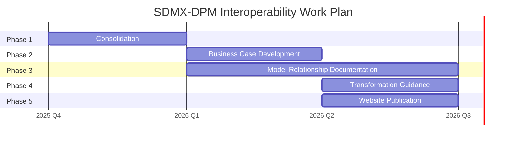

# Concept Note: SDMX–DPM Interoperability Work Package

**DRAFT for Review 26 Sept 2026**

Date: 26 Sept 2025

## Background and Context

The Statistical Data and Metadata eXchange (SDMX) standard and the Data Point Model (DPM) are widely adopted frameworks for structuring, exchanging, and integrating data in the statistical and supervisory domains. Both models share common features in their treatment of concepts, classifications, and reporting structures, but they have evolved in different communities of practice—SDMX primarily in official statistics and central banking, and DPM within financial supervision and regulatory reporting.

In June 2025, the SDMX Technical Working Group (TWG) reviewed a presentation highlighting the similarities between SDMX and DPM. The discussion demonstrated significant potential for interoperability, which could reduce duplication of effort, improve consistency across domains, and foster greater reuse of data definitions.

To build on this work, the TWG proposes a dedicated work package to make these findings accessible to a broader audience through a public-facing standards interoperability website.

## Objectives of the Work Package

The objectives of this work package are to:

- Develop and present the business case for interoperability between SDMX and DPM.
- Provide clear, accessible descriptions of the relationships between the SDMX and DPM models, including key similarities and differences.
- Demonstrate how transformations between SDMX and DPM can be achieved in both directions, enabling practical interoperability.
- Analyse how interoperability with XBRL-CSV (as de-facto serialisation standard for DPM) can be achieved.
- Populate the standards interoperability website with these materials to serve as a reference for stakeholders across the statistics, supervision, and regulatory reporting communities.

## Scope and Approach

The work package will focus on the following activities:

- Business case: Identify and articulate the benefits of SDMX–DPM interoperability, including efficiency gains, cost reduction, cross-domain integration, and improved data quality.
- Model relationships: Provide structured documentation of the alignments between the two models, with emphasis on conceptual correspondences, reusable artefacts, and mapping points.
- Transformation paths: Describe methodologies and illustrative examples showing how DPM structures can be represented in SDMX, and conversely, how SDMX structures can inform DPM models.
- Data instances relationships: Describe constraints under which SDMX-CSV and XBRL-CSV can be interoperable, meaning that can be easily used with DPM metadata (for SDMX-CSV) or with SDMX metadata (for XBRL-CSV).
- Public presentation: Adapt the outputs into clear and accessible web content for the standards interoperability website, ensuring the material is understandable for both technical and non-technical audiences.

The approach will combine expert input from TWG members with feedback from the broader community, building on the June 2025 presentation as the starting point.

## Work Plan and Deliverables

### Work Plan

The work will be organised into the following phases:

1. **Consolidation** (Q4 2025) – Collect and refine material from the June 2025 TWG presentation and subsequent discussions.
2. **Business Case Development** (Q1 2026) – Draft and review the case for interoperability, including value propositions for key stakeholders.
3. **Model Relationship Documentation** (Q1–Q2 2026) – Produce detailed descriptions and visualisations of alignments between SDMX and DPM. Including relationships at SDMX and XBRL-CSV report level.
4. **Transformation Guidance** (Q2 2026) – Document example conversion approaches and case studies. Including guide for CSV reports interoperability.
5. **Website Publication** (Q2–Q3 2026) – Finalise and publish the outputs on the [standards interoperability website](https://bis-medit-sdmxio.github.io/data-standards-interoperability/).

### Deliverables:

- Written business case for SDMX–DPM interoperability.
- Documentation of model relationships, including diagrams and mapping tables. Shall also deal with SDMX and XBRL-CSV report relationships.
- Guidance on SDMX↔DPM transformations with illustrative examples. Including examples for CSV reports.
- Web-ready content for publication on the [interoperability website](https://bis-medit-sdmxio.github.io/data-standards-interoperability/).

## Members

- **Lead** Antonio Olleros (TWG)
- Matt Nelson (TWG)
- Daniel Suranyi (SWG)
- Angelo Linardi (TWG)
- Haizhen Li (EBA)
- Mark Goodhand (Corefiling)
- Fernando Wagener (ECB)
- Stefano Pambianco (ECB)
- Katrin Heinze (ECB)
- Ida Migliaccio (BdI)
