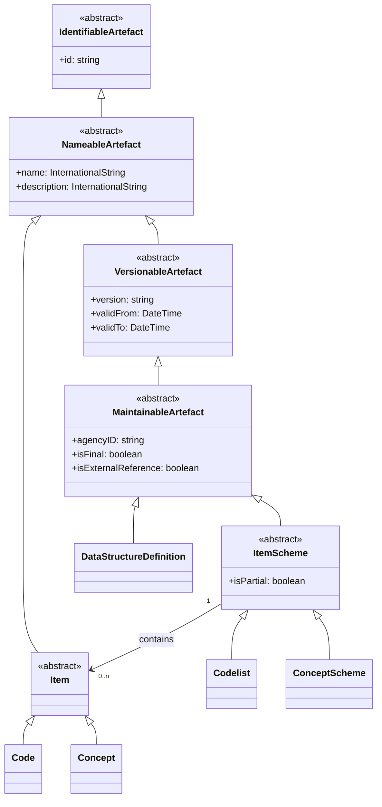
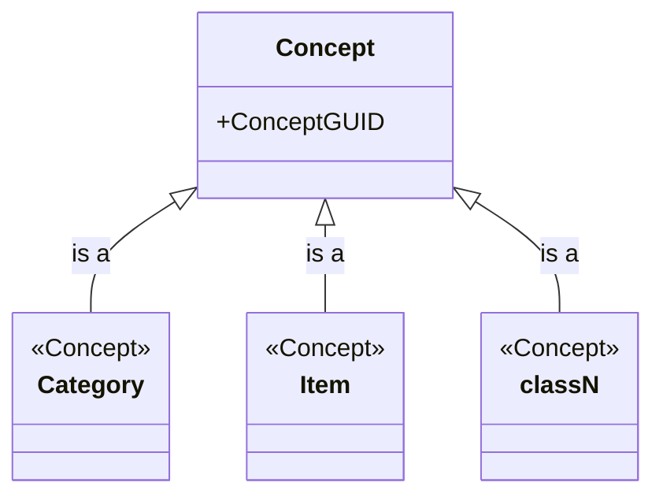
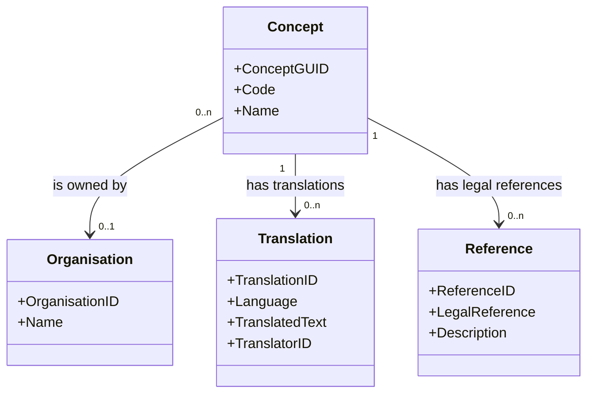

# Base Comparison: SDMX and DPM

This chapter provides a foundational comparison between SDMX (Statistical Data and Metadata eXchange) and DPM (Data Point Model), focusing on their architectural principles, design philosophies, and core structural differences. Understanding these fundamental distinctions is essential before diving into the detailed artefact-level mappings presented in subsequent chapters.

## 1. Architectural approaches

### 1.1 SDMX Information Model

The SDMX Information Model is a **UML-based conceptual design** that remains syntax-neutral. Key characteristics:

- **Conceptual abstraction**: Focuses on the logical structure of statistical data and metadata without prescribing implementation details.
- **Syntax neutrality**: Can be serialized in multiple formats (SDMX-ML, SDMX-JSON, SDMX-CSV).
- **Exchange-oriented**: Designed for the standardized exchange of data and metadata across distributed systems.
- **Implementation-agnostic**: Does not mandate specific database structures or storage mechanisms.

### 1.2 DPM meta-model

The DPM meta-model is a **model of the model**, consisting of statements and structures that hold the definitions of information requirements. Key characteristics:

- **Physical orientation**: Typically expressed through entity–relationship structures aimed at physical database implementation.
- **Database specification**: Designed to specify the precise structure of an actual database or repository.
- **Shared semantic content**: The database content is shared among regulators and reporting entities to ensure a common understanding.
- **Implementation-focused**: Directly maps to database schemas, tables, and relationships.

### 1.3 Summary comparison

| Aspect | SDMX Information Model | DPM Meta-model |
| --- | --- | --- |
| Primary purpose | Conceptual exchange framework | Database implementation specification |
| Expression | UML class diagrams | Entity–relationship diagrams |
| Implementation | Syntax-neutral serializations | Physical database schemas |
| Focus | Distributed data exchange | Shared repository structure |
| Abstraction level | Conceptual | Physical/logical |

It should be noted that SDMX provides specific syntaxes (XML, JSON and, for data, CSV) that serve as actual implementations of the conceptual model. But the SDMX information model is agnostic regarding databases. Similarly, the exchange format using DPM is also database-agnostic.

## 2. Conceptual foundations

### 2.1 SDMX abstract classes

SDMX utilizes a hierarchy of abstract classes to serve as architectural archetypes. These base classes provide foundational building blocks that are inherited by concrete subclasses:

- **IdentifiableArtefact**: Provides basic identity through an ID.
- **NameableArtefact**: Adds name and description capabilities (extends IdentifiableArtefact).
- **MaintainableArtefact**: Introduces versioning, agency ownership, and lifecycle management (extends NameableArtefact).
- **ItemScheme / Item**: Pattern for maintained lists and their entries.

Concrete structural artefacts such as Codelists or Data Structure Definitions (DSDs) inherit these properties through the class hierarchy. This approach separates architectural concerns (identity, maintenance, naming) from domain-specific semantics (statistical concepts, data structures).

### 2.2 DPM Concepts

In the Data Point Model (DPM), **Concepts** are defined as identifiable objects within a model, such as a Category, Item, or Variable. These entities serve as the primary units of metadata and are characterized by:

- **Concrete modelling units**: Each Concept represents a tangible element (e.g. a specific category, a business term, or a variable) that modellers work with directly.
- **Ownership**: Concepts can be identified with an Owner (the maintaining organization).
- **Documentation**: Concepts are linked to supportive documentation such as legal references.
- **Translatable attributes**: Concepts contain attributes that can be translated into multiple languages, with translations tracked by organization.

Concepts may be owned by an organisation (depending on the type of concept), and they may also have translations and/or legal references.

### 2.3 Key distinction

Where DPM treats "Concept" as the primary building block that directly represents modelling entities, SDMX uses abstract base classes as templates from which concrete artefacts are derived. This reflects their different design origins: DPM as a database implementation model and SDMX as a conceptual exchange framework.

## 3. Metadata access models

The two standards differ significantly in their approach to metadata exposure and storage. This fundamental difference reflects their distinct use cases and design philosophies.

### 3.1 SDMX: Exchange and dissemination

SDMX is primarily focused on the **exchange and dissemination** of metadata (and data)through standardized APIs:

- **RESTful web services**: Metadata and data are exposed via REST APIs that allow users to "pull" data on demand.
- **Multi-dimensional slices**: Data is conceptualized as a multi-dimensional cube. A **slice** is identified by a key consisting of values for all dimensions except time (or another designated dimension).
- **Registry as metadata hub**: The SDMX Registry does not store the data itself. Instead, it provides visibility into available data and supplies URLs pointing to data located at provider sites.
- **Distributed architecture**: Data remains at source systems; consumers query endpoints to retrieve specific slices or observations.
- **Pull model**: Users actively request data through API queries specifying the dimensions and attributes of interest.

### 3.2 DPM: Shared repositories

The DPM provides a **database structure in which metadata is stored**:

- **Database storage**: Regulatory data definitions (such as those for COREP, Solvency II, AnaCredit) result in metadata stored directly in a DPM database.
- **Meta-model conformance**: The database follows the DPM metamodel structures (tables, variables, properties, categories).
- **Sharing DBs**: Each DPM owner creates and shares its own database as a portable DB (normally Access or SQLite). Database contents can be merged into a common database, ensuring all stakeholders (regulators, reporting entities, vendors) have access to the common definitions.

### 3.3 Implications

| Feature | SDMX | DPM |
| --- | --- | --- |
| Data location | Distributed (at source providers) | Distributed (at collector side) |
| Access method | RESTful APIs (pull model) | Sharing portable DB |
| Data conceptualization | Slices of multi-dimensional cubes | Rows in tables conforming to meta-model |

## 4. Object identification

Object identification strategies reflect the implementation goals and technical contexts of each standard.

### 4.1 SDMX identification

SDMX uses a **Universal Resource Name (URN)**, which is a globally unique identifier string composed of an object's identification components:

- **URN structure**: `urn:sdmx:org.sdmx.infomodel.{package}.{class}={agencyID}:{resourceID}({version})`
- **Components**:
  - **Agency ID**: The organization maintaining the artefact.
  - **Resource ID**: The identifier for the specific artefact.
  - **Version**: The version string (e.g. `1.0`, `2.1.0`).
- **Interoperability**: URNs provide interoperability in a distributed network, ensuring that any identifiable artefact can be referenced and accessed as a single string regardless of its location.
- **Example**: `urn:sdmx:org.sdmx.infomodel.codelist.Codelist=ECB:CL_FREQ(1.0)`

### 4.2 DPM identification

Modellers identify concepts using **Codes** and **Names**. In physical database implementations, object identity is managed through:

- **Primary Key IDs**: Owner-prefixed numeric identifiers structured as a three-digit IDPrefix (indicating the owning Organisation) followed by a sequential numeric suffix. These are not pure surrogate keys — the prefix carries business meaning.
- **IDPrefix for uniqueness**: The first three digits of any Primary Key ID identify the owning Organisation:
  - `100`: DPM Metamodel
  - `101`: EBA (European Banking Authority)
  - `102`: EIOPA (European Insurance and Occupational Pensions Authority)
- **Model merging**: The IDPrefix simplifies the process of merging models from different databases, as keys remain globally unique.
- **RowGUID**: A separate, system-generated GUID/UUID on every entity, used for change tracking and synchronization. Unlike the Primary Key ID, the RowGUID carries no business semantics.

**Example**: An EBA-owned Concept might have a primary key ID `101000042`, where `101` indicates EBA ownership.

### 4.3 Comparison

| Feature | SDMX Identification | DPM Identification |
| --- | --- | --- |
| Primary identifier | URN (string) | Primary Key ID (numeric) |
| Uniqueness mechanism | Agency ID within URN | IDPrefix (first 3 digits) |
| Format | Web-centric (URI/URN strings) | Database-centric (numeric keys) |
| Purpose | Distributed referencing and exchange | Database merging and storage |
| Change tracking | Version in URN | RowGUID (UUID) |
| Human readability | URN components (parseable) | Code + Name |

## 5. Ownership models

In both the SDMX and DPM frameworks, ownership is fundamental to the identification and maintenance of metadata artefacts. While they share the goal of identifying a responsible organization, they differ in their structural implementation and how ownership defines an object's identity.

### 5.1 Ownership in SDMX

In SDMX, ownership is primarily defined through **Maintenance Agencies** and **Metadata Providers**.

#### 5.1.1 Ownership as identity

Ownership is a **core component of an object's unique identity**. An object is defined by the combination of its:

- **Agency ID**: The maintaining organization.
- **ID**: The object identifier.
- **Version**: The version string.

This triplet is expressed as a **URN** (Universal Resource Name), which must include the `agencyid` to ensure global uniqueness.

**Example**: `urn:sdmx:org.sdmx.infomodel.codelist.Codelist=ECB:CL_FREQ(1.0)`

#### 5.1.2 Hierarchical agency structure

Unlike the DPM's flat list of owners, SDMX supports an **n-level hierarchical structure** for agencies:

- The top-level agency is **SDMX**, which maintains the top-level **Agency Scheme**.
- Agencies in this top level can declare **sub-agencies** (e.g. `AgencyA.Dept1.Unit2`).
- Each sub-agency can maintain its own scheme, allowing for organizational flexibility.

#### 5.1.3 Maintainable artefacts

Only objects inheriting from the **MaintainableArtefact** class are associated with a maintenance organization. These include:

- Dataflows
- Codelists
- Data Structure Definitions (DSDs)
- Concept Schemes
- Category Schemes

Items within schemes (e.g. individual Codes within a Codelist) are not independently maintainable; they inherit ownership from their parent scheme.

#### 5.1.4 Metadata providers

While structural metadata is managed by a **Maintenance Agency**, reference metadata (Metadata Sets) is maintained by a **Metadata Provider**. This distinction separates structural definitions from the actual metadata content.

#### 5.1.5 Versioning constraints

Ownership is critical for version control. Maintainable items can generally only be modified or deleted by the specific agency that created them. This ensures clear responsibility and prevents unauthorized changes in distributed environments.

### 5.2 Ownership in DPM

In the DPM framework, ownership is tied to the concept of **Organisations** and is a requirement for all entities identified as Concepts.

#### 5.2.1 Strict single ownership

The DPM metamodel restricts each Concept to having **one and only one Owner**. This Organisation is responsible for defining and managing the classification, business term, or data set.

#### 5.2.2 Ownership inheritance

Some Concepts do not have an explicitly assigned owner but instead **inherit** it from a parent class. E.g., a **TableVersion** inherits from its **Table**.

#### 5.2.3 Technical implementation (IDPrefix)

To facilitate the merging of models from different databases, the first three digits of any primary key ID in a physical implementation indicate the owner (the **IDPrefix**):

- `100`: DPM Metamodel
- `101`: EBA (European Banking Authority)
- `102`: EIOPA (European Insurance and Occupational Pensions Authority)

This approach ensures that keys remain globally unique when models from different organizations are combined.

#### 5.2.4 Translations

Ownership also extends to documentation. An attribute can have multiple translations managed by different organizations, identified by a **TranslatorID**.

### 5.3 Summary of ownership differences

| Feature | SDMX Ownership | DPM Ownership |
| --- | --- | --- |
| Primary term | Maintenance Agency / Metadata Provider | Owner (Organisation) |
| Structure | Hierarchical (e.g. Agency.Dept.Unit) | Flat list of Organisations |
| Inheritance | Determined by the MaintainableArtefact class | Inherited through object class hierarchies |
| Uniqueness | Ensured via the URN string (Agency + ID + Version) | Ensured via IDPrefix in database keys |
| Granularity | Applies to maintainable artefacts (not items within schemes) | Applies to individual Concepts |

## 6. Conclusion

The fundamental differences between SDMX and DPM reflect their distinct origins and use cases:

- **SDMX** is designed as a **conceptual exchange framework** for distributed statistical data dissemination, emphasizing interoperability, syntax neutrality, and API-based access.
- **DPM** is designed as a **database implementation model** for regulatory data collection, emphasizing shared repositories, physical storage structures, and direct data access.

These architectural differences inform all subsequent mappings between the two standards. Understanding these foundational distinctions is essential for:

- Designing bidirectional transformations that preserve semantics.
- Identifying where information loss or approximation is unavoidable.
- Making informed modelling choices when implementing either standard.
- Bridging the conceptual gap between exchange-oriented and repository-oriented approaches.

The following chapters build upon this foundation to provide detailed mappings of specific artefacts, starting with the glossary components (concepts, codelists, categories) and proceeding to data structures and other metadata artefacts.
