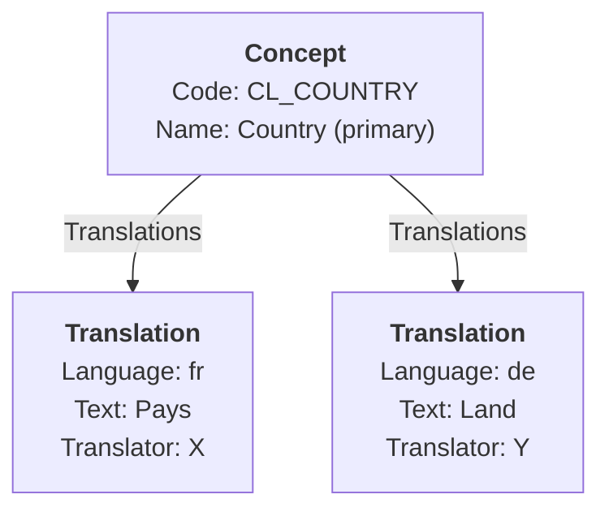

# 2. Detailed Mapping Rules

This chapter establishes the foundational mapping rules that apply across all artefact transformations between SDMX and DPM. These general principles govern object creation, identification, and multilingual handling, forming the basis for the specific mappings detailed in subsequent chapters.

## 2.1 Object creation principles

### 2.1.1 Mapping direction

Mappings between SDMX and DPM can be performed in either direction:

- **SDMX → DPM**: Transforming SDMX structural metadata into a DPM database
- **DPM → SDMX**: Generating SDMX artefacts from a DPM repository

Each direction has distinct considerations due to the architectural differences between the standards (see [Base Comparison](01_base_comparison.md)).

### 2.1.2 Object correspondence

The mapping establishes correspondences between SDMX artefacts and DPM classes. These correspondences can be:

| Cardinality | Description | Example |
|-------------|-------------|---------|
| **1:1** | One SDMX artefact maps to exactly one DPM object | Codelist ↔ Category |
| **1:N** | One SDMX artefact produces multiple DPM objects | Code → Item + CategoryItem |
| **N:1** | Multiple SDMX artefacts combine into one DPM object | Multiple ConceptSchemes → single Glossary namespace |
| **Conditional** | Mapping depends on attribute values | Category (enumerated) ↔ Codelist; Category (non-enumerated) → no mapping |

### 2.1.3 System-generated values

Both standards use system-generated identifiers for internal management:

| Standard | Generated Value | Purpose |
|----------|-----------------|---------|
| **DPM** | Primary Key ID (numeric) | Database row identification |
| **DPM** | RowGUID (UUID) | Change tracking and synchronization |
| **SDMX** | URN | Global unique reference (derived from id + agencyID + version) |

**Mapping rule**: System-generated values are **never mapped** between standards. Each system generates its own identifiers according to its requirements.

## 2.2 Identification: DPM IDs vs SDMX URNs

### 2.2.1 SDMX identification model

SDMX uses a composite identification scheme for MaintainableArtefacts:

```
┌─────────────────────────────────────────────────────────────────┐
│                        SDMX URN                                 │
├─────────────────────────────────────────────────────────────────┤
│ urn:sdmx:org.sdmx.infomodel.{package}.{class}                   │
│     ={agencyID}:{resourceID}({version})                         │
└─────────────────────────────────────────────────────────────────┘
```

**Components**:

| Component | Description | Example |
|-----------|-------------|---------|
| `agencyID` | Maintenance agency identifier | `ECB`, `EBA`, `SDMX` |
| `resourceID` | Artefact identifier (unique within agency) | `CL_FREQ`, `CS_MEASURE` |
| `version` | Semantic version string | `1.0`, `2.1.0` |

**Example URN**: `urn:sdmx:org.sdmx.infomodel.codelist.Codelist=ECB:CL_COUNTRY(1.0)`

Items within MaintainableArtefacts (e.g., Code within Codelist) are identified by appending the item ID:
```
urn:sdmx:org.sdmx.infomodel.codelist.Code=ECB:CL_COUNTRY(1.0).ES
```

### 2.2.2 DPM identification model

DPM uses a dual identification approach:

1. **Modeller-facing**: `Code` attribute (string identifier used in business logic)
2. **System-facing**: Primary Key ID with IDPrefix for cross-database uniqueness

```
┌─────────────────────────────────────────────────────────────────┐
│                     DPM Primary Key                             │
├─────────────────────────────────────────────────────────────────┤
│  [IDPrefix (3 digits)][Sequential ID]                           │
│       ↓                     ↓                                   │
│    Owner org            System-generated                        │
└─────────────────────────────────────────────────────────────────┘
```

**IDPrefix values**:

| Prefix | Organisation |
|--------|--------------|
| `100` | DPM Metamodel |
| `101` | EBA |
| `102` | EIOPA |

### 2.2.3 Mapping rules for identification

#### SDMX → DPM

When converting SDMX artefacts to DPM:

| DPM Attribute | Derivation |
|---------------|------------|
| `Code` | Normally taken from the `artefactId` (may need transformation) |
| `Primary Key ID` | System-generated (not from SDMX) |
| `RowGUID` | System-generated UUID (not from SDMX) |
| `Owner` | Derived from `agencyID` → mapped Organisation |


#### DPM → SDMX

When generating SDMX artefacts from DPM:

| SDMX Attribute | Derivation |
|----------------|------------|
| `agencyID` | From DPM `Owner` → mapped Agency |
| `id` | From DPM `Code` (may need transformation) |
| `version` | From DPM Release/versioning metadata or default `1.0` |
| `URN` | **Auto-generated** from `agencyID`, `id`, and `version` |

> **Note**: Translation of ids to codes and viceversas may differ depending on the type of object. This is to avoid conflicts in some particular cases of mappings.

## 2.3 Multilingual support: InternationalString vs Translations

### 2.3.1 SDMX multilingual model

SDMX uses `InternationalString` for all human-readable text (names, descriptions). This is a map of language codes to text values, embedded directly in the artefact:

```xml
<Name xml:lang="en">Country</Name>
<Name xml:lang="fr">Pays</Name>
<Name xml:lang="de">Land</Name>
<Description xml:lang="en">List of countries for reporting</Description>
```

**Characteristics**:

- Translations are **inline** within the artefact
- Language codes follow ISO 639-1 (or more specific locale codes)
- All translations share the same version lifecycle
- No tracking of translation authorship

### 2.3.2 DPM translation model

DPM uses a separate `Translation` entity linked to Concepts:



**Characteristics**:

- Default/primary language stored directly on the Concept (`Name`, `Description`)
- Additional translations in separate `Translation` entities
- Each translation tracks:
    - `Language`: ISO language code
    - `TranslatedText`: The translated value
    - `TranslatorID`: Organisation responsible for the translation
- Translations can have independent lifecycle and provenance

### 2.3.3 Mapping rules for multilingual content

#### SDMX → DPM

| SDMX Source | DPM Target | Rule |
|-------------|------------|------|
| `Name` (primary language) | `Concept.Name` | Use English (`en`) or first available as primary |
| `Name` (other languages) | `Translation` entities | Create one Translation per language |
| `Description` (primary) | `Concept.Description` | Same language selection as Name |
| `Description` (other) | `Translation` entities | Create Translation entries for descriptions |

**Algorithm**:

1. Identify the **primary language** (configurable, default: `en`)
2. Extract the primary language value → store in `Name`/`Description`
3. For each remaining language:
   - Create a `Translation` record
   - Set `TranslatorID` to the source Agency (or a designated import organisation)

**Example**:

```xml
<!-- SDMX Input -->
<Codelist id="CL_COUNTRY" agencyID="ECB" version="1.0">
  <Name xml:lang="en">Country</Name>
  <Name xml:lang="fr">Pays</Name>
  <Description xml:lang="en">List of countries</Description>
  <Description xml:lang="fr">Liste des pays</Description>
</Codelist>
```

```
-- DPM Output --
Category:
  Code: "ECB.CS_GEO.CL_COUNTRY"
  Name: "Country"
  Description: "List of countries"

Translations:
  { ConceptGUID: <ref>, Language: "fr", Attribute: "Name",
    TranslatedText: "Pays", TranslatorID: <ECB> }
  { ConceptGUID: <ref>, Language: "fr", Attribute: "Description",
    TranslatedText: "Liste des pays", TranslatorID: <ECB> }
```

#### DPM → SDMX

| DPM Source | SDMX Target | Rule |
|------------|-------------|------|
| `Concept.Name` | `Name` (primary language) | Output as `xml:lang="en"` (or configured primary) |
| `Concept.Description` | `Description` (primary) | Same language as Name |
| `Translation` (Name) | `Name` (translated) | Add `<Name xml:lang="{lang}">` for each |
| `Translation` (Description) | `Description` (translated) | Add `<Description xml:lang="{lang}">` |

**Note**: The `TranslatorID` information is lost in SDMX as there is no equivalent attribute.

### 2.3.4 Language code handling

Both standards use ISO 639 language codes, but with potential variations:

| Scenario | Recommendation |
|----------|----------------|
| Simple codes (`en`, `fr`, `de`) | Direct mapping |
| Locale codes (`en-GB`, `en-US`) | Preserve full code if supported; otherwise truncate to primary |
| Non-standard codes | Log warning; apply configurable default |

## 2.4 Name and Description mapping

Although `name` and `description` are not attributes of the SDMX `Concept` class specifically (they are inherited from `NameableArtefact`), the pattern for mapping these attributes applies universally across all artefact types.

### 2.4.1 Attribute correspondence

| SDMX (NameableArtefact) | DPM (Concept) | Notes |
|-------------------------|---------------|-------|
| `name` | `Name` | InternationalString → primary + Translations |
| `description` | `Description` | InternationalString → primary + Translations |

### 2.4.2 Handling missing values

| Scenario | SDMX → DPM | DPM → SDMX |
|----------|------------|------------|
| Name missing | Use `id` as fallback | Name is **required** in SDMX; use `Code` |
| Description missing | Set to `NULL` | Omit `<Description>` element |
| Empty string | Treat as missing | Omit element |

### 2.4.3 Length and format constraints

| Attribute | DPM Constraint | SDMX Constraint | Mapping Rule |
|-----------|----------------|-----------------|--------------|
| Name | Typically VARCHAR(255) | Unbounded | Truncate with warning if exceeded |
| Description | Typically TEXT/CLOB | Unbounded | No truncation normally needed |

### 2.4.4 Generic mapping template

This generic mapping can be overriden for some artefacts, especially in relation to id/code and versions.

For any SDMX artefact inheriting from `NameableArtefact` to its corresponding DPM Concept:

```
SDMX Artefact                          DPM Concept
─────────────                          ───────────
id                          →          Code (may be with namespace prefix)
name[primaryLang]           →          Name
name[otherLangs]            →          Translation (Name)
description[primaryLang]    →          Description
description[otherLangs]     →          Translation (Description)
agencyID                    →          Owner
version                     →          Release (indirect mapping)
```

And for the reverse direction:

```
DPM Concept                            SDMX Artefact
───────────                            ─────────────
Code                        →          id (extracted or full)
Name                        →          name[primaryLang]
Translation (Name)          →          name[lang]
Description                 →          description[primaryLang]
Translation (Description)   →          description[lang]
Owner                       →          agencyID
Release                     →          version (requires strategy)
```
