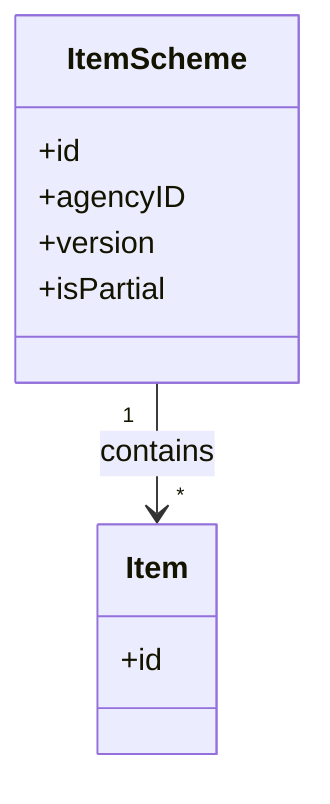
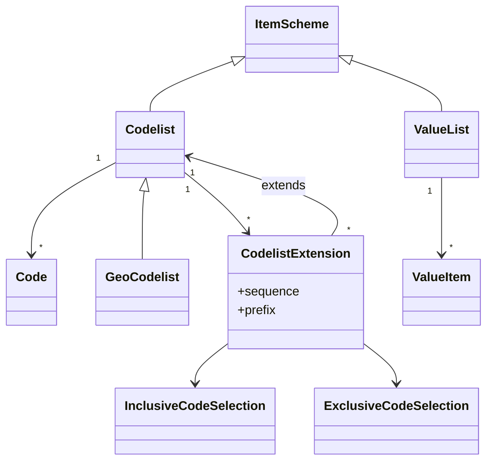
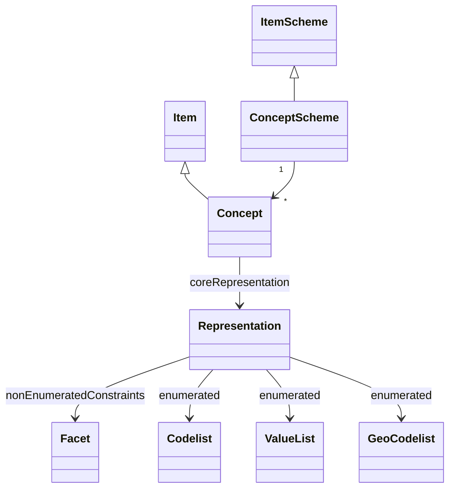
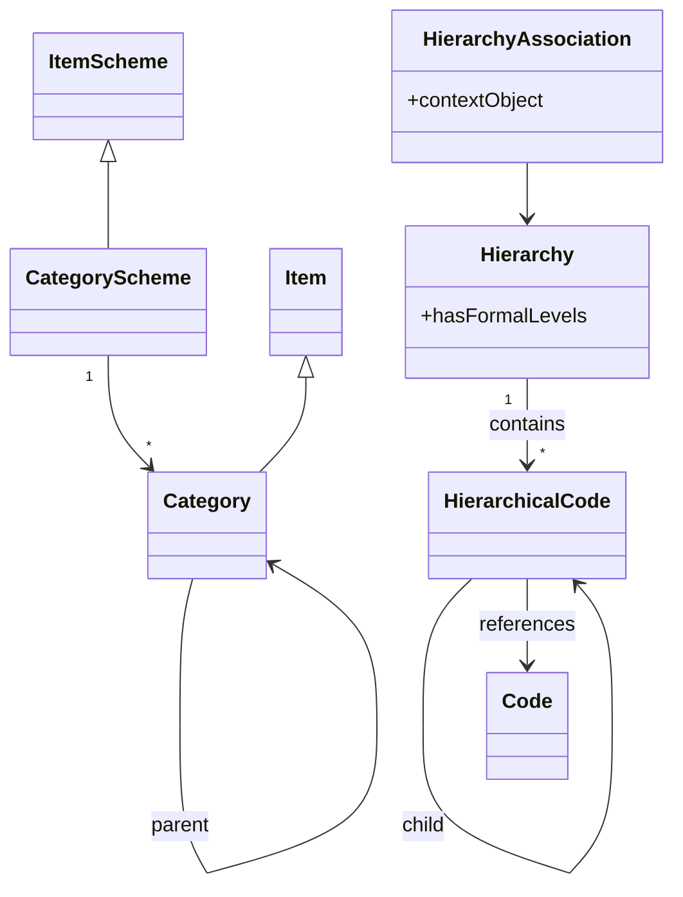
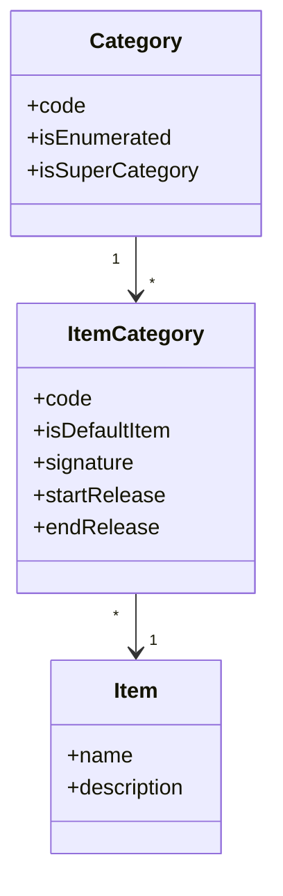
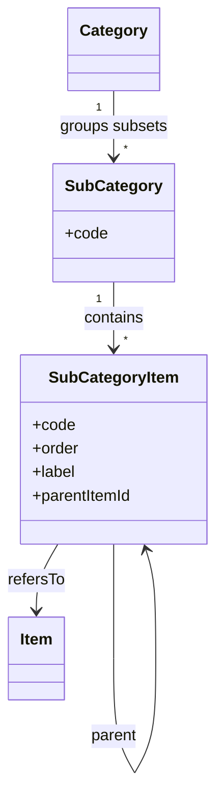
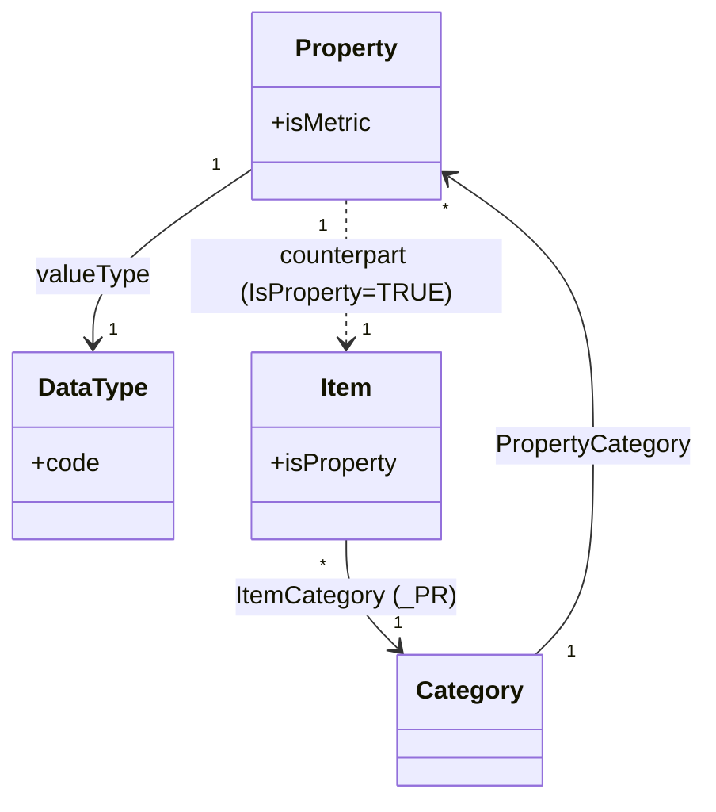
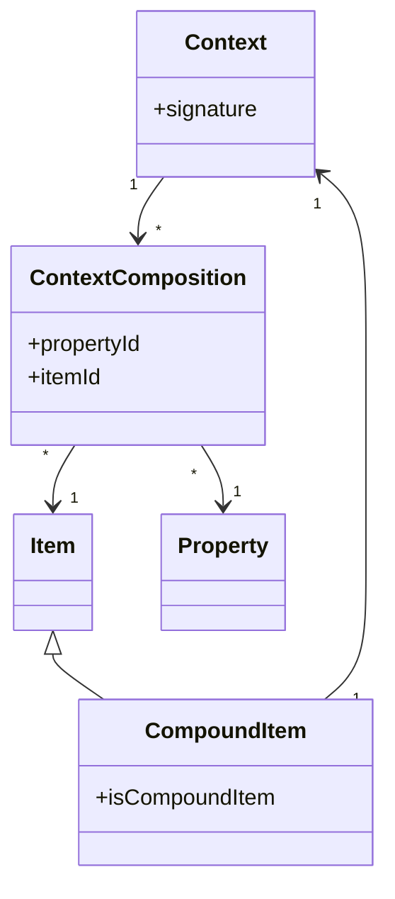
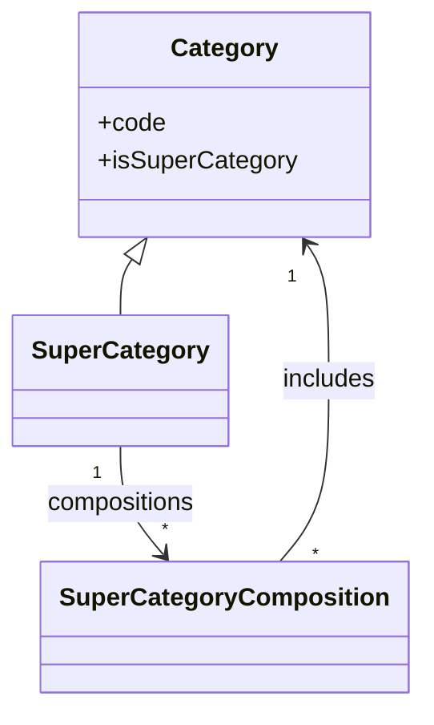

# 1. Glossary overview

This chapter introduces the "glossary" parts of the two metamodels used in this work: SDMX and DPM. It focuses on the artefacts that define and organise concepts, categories and value domains, i.e. the vocabulary that is later reused by structures (DSDs, tables, variables, etc.) but is itself independent from any particular data exchange syntax or physical implementation.

## Key characteristics of a glossary

A well-designed glossary in a data-modelling context typically exhibits the following characteristics:

- **Standardized definitions**: provides precise and standardized definitions of terms used in the data model to avoid ambiguity and misinterpretation.
- **Domain-specific language**: tailored to the specific domain or industry (e.g. finance, insurance, banking supervision), ensuring relevance to the context of the data model.
- **Relationships between terms**: includes relationships between terms, such as hierarchical or associative links, to help clarify how concepts interact or are connected.
- **Supports data modelling**: acts as a foundation for building data points, attributes, entities, and relationships in the model by clearly defining what each represents.
- **Improves collaboration**: facilitates communication among stakeholders by ensuring everyone uses the same terminology and understands the data points in the same way.

## 1.1 SDMX Glossary artefacts

The SDMX glossary is built around maintained lists (“schemes”) and their items. Each scheme is owned by an agency and versioned. Below are the artefacts that matter for understanding how SDMX names and constrains glossary content. (Mapping artefacts, organisation schemes, and constraints are intentionally out of scope here.) The goal is to show how SDMX structures the glossary that later feeds structures like DSDs, without getting into data exchange syntax.

### Item schemes and items

- **ItemScheme / Item**  
  Pattern for any maintained list (scheme) and its entries (items). ItemSchemes are maintainable. Items are nameable, can carry descriptions and annotations, and can be organised hierarchically if the concrete scheme supports it.
  An ItemScheme can be marked as **partial** (`isPartial = true`) to indicate that it carries only a subset of the items in the full scheme. This is strictly a **dissemination mechanism**: a partial scheme shares the same identity (agencyId, id, version) as the full scheme, cannot contain items absent from it, and cannot alter the content of any item. It is not a way to create or maintain independent subsets — subsetting for structural purposes is achieved via the Constraint mechanism.

### Value domains (enumerated)

- **Codelist**  
  Enumerated value domain for coded concepts (e.g. `FREQ`). Contains **Code** items. Can be partial (for dissemination only; see ItemScheme above) and supports single-parent code hierarchies (lightweight trees directly inside the codelist).
  - *Example*: a codelist `CL_AREA_ISO` containing ISO country codes (`ES`, `FR`, `DE`, …) and another codelist `CL_AREA_NUTS` containing EU NUTS region codes (`ES300`, `ES302`, …). Both can be used to represent geographical areas in different levels of detail.

- **Extended Codelist**
  A codelist can include one or more **CodelistExtension** entries, each referencing a base codelist. This mechanism allows combining multiple codelists and/or creating subsets without duplicating codes. Each extension carries:
  - **sequence**: determines precedence when multiple extensions have conflicting codes (later overrides earlier).
  - **prefix**: optional string prepended to inherited codes to avoid conflicts.

  Codes inherited from a base codelist can be filtered using:
  - **InclusiveCodeSelection**: include only the specified codes from the base (creating a subset).
  - **ExclusiveCodeSelection**: include all codes from the base except the specified ones.

  In both cases, **MemberValue** entries identify which codes to include or exclude. MemberValues support `cascadeValues` (to include/exclude child codes automatically, with an `excludeRoot` option) and the `%` wildcard character for pattern matching on code identifiers.

  - *Examples*:
    - *Combining*: an extended codelist `CL_GEO_AREA` that combines `CL_AREA_ISO` (countries) and `CL_AREA_NUTS` (regions) so that a single representation can be used for the concept "Geographical area" while reusing existing code sets.
    - *Subsetting*: an extended codelist `CL_EU_COUNTRIES` that extends `CL_AREA_ISO` with an InclusiveCodeSelection listing only EU member-state codes (`AT`, `BE`, `DE`, …), creating a subset without maintaining a separate codelist.

- **GeoCodelist**  
  Codelist specialised for geospatial identifiers (e.g. geographic features or grids), with codes that reference geometries.

- **ValueList**  
  Lightweight enumerated value domain without “code” semantics (useful for short pick-lists). Contains **ValueItem** entries.

### Semantics

- **ConceptScheme**  
  Container that groups **Concepts** for a domain (e.g. all concepts for a subject area). It is the anchor for semantic definitions and is maintainable/versioned like other schemes.

- **Concept**  
  Semantic definition of a business characteristic (can serve as dimension, attribute, or measure in a DSD). Each concept has a **core representation**: either enumerated (via Codelist/ValueList/GeoCodelist) or non-enumerated (via data type and **Facet** constraints). Structural artefacts (e.g. a Dimension) can override this with a local representation.
  - *Examples*:
    - `RESIDENCE` and `BIRTH_LOC` concepts with an enumerated representation using `CL_GEO_AREA` (extended codelist over ISO countries and NUTS regions).
    - `NBIRTHS` (Number of births) concept with a non-enumerated integer representation (e.g. constrained to non‑negative values).
    - `FAIR_VAL` (Fair value) concept with a decimal representation (e.g. currency amounts, possibly constrained by scale or range facets).

- **Representation**
  Defines the allowable content for a Concept or Component. A representation takes one of two forms:
  - *Enumerated*: references an ItemScheme (Codelist, ValueList, or GeoCodelist) that lists the valid values.
  - *Non-enumerated*: constrains the format of values using Facets (see below).

  Each Concept carries a **core representation**; structural Components (dimensions, attributes, measures) can override it with a **local representation** specific to their Structure, enabling context-specific constraints while maintaining semantic consistency.

- **Facet / FacetValueType**
  Facets define detailed constraints on non-enumerated representations. Common facet types include length constraints (`minLength`, `maxLength`), value ranges (`minValue`, `maxValue`), format specifications (`decimals`, `pattern`), and sequence definitions (`startValue`, `endValue`, `interval`). The `FacetValueType` specifies the expected data type (e.g. String, Integer, Decimal, DateTime, Duration).

### Grouping and hierarchy

- **CategoryScheme**  
  Scheme for organising **Categories** (e.g. subject domains, reporting taxonomies). Categories can be hierarchical (single-parent). Categorisations (not covered here) link categories to structural artefacts such as dataflows.

- **Category**  
  Item that labels a grouping; can be nested to build a taxonomy.

- **Hierarchy**
  Maintained artefact defining parent–child relationships among codes, possibly across multiple codelists and with multiple parents (richer than the single-parent trees inside a codelist). **HierarchicalCode** nodes reference codes from external codelists rather than duplicating them, so that the same codes can be reused across different hierarchical structures. **HierarchyAssociation** applies a hierarchy within a context (e.g. a dataflow) so different contexts can reuse or tailor the same structure.
  Hierarchies are a key mechanism for **managing and organising codelists**: they enable multiple roots, multiple parents per code, and codes drawn from several codelists — supporting use cases such as aggregation, OLAP-style navigation, and statistical classification schemes that go beyond the single-parent tree a codelist can express on its own.
  - *Example*: a “Geographical hierarchy” where a parent node `EU` groups all EU country codes (`ES`, `FR`, …) and where NUTS codes (e.g. `ES300`) are children of their corresponding country. The hierarchy can reference codes from both `CL_AREA_ISO` and `CL_AREA_NUTS`.

## 1.2 DPM glossary artefacts

A DPM glossary refers to a structured collection or list of terms, definitions, and concepts that are relevant to the data model or domain. It defines categories, their items, subsets, and semantic properties that are later reused in the domain-specific data modelling. The focus here is on how the DPM glossary organises and constrains terms which are used to model tables, variables or operations in framework specific data models.

### Categories and items

- **Category**  
  Value-domain container for related items. A Category can be:
  - **Enumerated** (`IsEnumerated = TRUE`): the possible values are explicitly listed as Items (similar to a code list).
  - **Non-enumerated** (`IsEnumerated = FALSE`): the possible values are not listed individually (e.g. instrument identifiers, free-form codes, or highly volatile lists).  
  Categories can be linked to external reference data, may be deactivated, and can be flagged as Super Categories.
  - *Examples*:
    - Enumerated Categories: `COUNTRY` containing ISO country Items (`ES`, `FR`, `DE`, …) and `NUTS_REGION` containing EU NUTS Items (`ES300`, `ES302`, …).
    - Non-enumerated Categories: an “Instrument identifier” Category where values are ISINs or LEIs that are not individually listed as Items.

- **Item**
  Individual enumerated value. An Item carries a name and description but does not itself hold a code — the code is assigned through the **ItemCategory** association (see below). Items can be compound (see Compound Item) and must be assigned an Owner.

- **ItemCategory**
  Release-aware association that links an Item to a Category. It carries the `code` (unique within the Category), an `isDefaultItem` flag, and an optional `signature` for compact referencing in operations. Because ItemCategory is versioned by Release (StartRelease / EndRelease), an Item can change Category over time (e.g. following bug fixes or model revisions). A Category can designate one Item as its default (`isDefaultItem = true`), which is implicitly assumed whenever a Property of that Category is used without stating an explicit Item.

### Subsets and hierarchies

- **SubCategory**  
  Artefact that defines a subset of Items for a given Category and optionally organises them. SubCategories are typically used to:
  - create smaller, thematic subsets of a large Category, and
  - specify which options appear in dropdowns for tables or variables.
  - *Examples*:
    - A SubCategory “EU Member States” over the `COUNTRY` Category, listing only EU countries for a particular regulation.
    - A hierarchical SubCategory over `NUTS_REGION` where a NUTS-0 country item is parent of NUTS-1/NUTS-2/NUTS-3 region items.

- **SubCategoryItem**
  Link between a SubCategory and the Items it contains. Each SubCategoryItem carries a `code`, a global `order` (sequential across all branches and levels, not per-level), and an optional `label` for regulation-specific wording. It supports:
  - hierarchical ordering via parent–child relationships between SubCategoryItems, and
  - local labels for Items when used within a particular SubCategory (e.g. regulation-specific wording in dropdowns).

### Semantic properties and metrics

- **Property**
  Semantic characteristic used to define information requirements and variables. A Property always refers to one or more Categories (via the release-aware **PropertyCategory** association) and provides a "perspective" under which Items of those Categories are used (e.g. "Issuer residence", "Instrument type"). Properties can be:
  - **Qualitative** (`IsMetric = FALSE`): descriptive characteristics that classify or qualify observations.
  - **Quantitative** (`IsMetric = TRUE`): characteristics that identify "what is measured". These refer to a `DataType` and indicate whether values are reported at a point in time or over a period.

  The Property entity itself does not carry a `code` attribute. In physical implementations (EBA, EIOPA), each Property has a counterpart **Item** with `IsProperty = TRUE` that belongs to a dedicated Category (typically coded `_PR` — "Properties"). The Property receives its code, name, description, and owner from that Item through the **ItemCategory** association — just like any other Item.
  In the DPM glossary, Properties are the counterparts of SDMX Concepts and play the role of dimensions, attributes or measures when used in variables.
  - *Examples*:
    - Qualitative Properties `RESIDENCE` and `BIRTH_LOC` referring to a `GEO_AREA` Super Category, so that both countries and regions can be used as values.
    - A qualitative Property “Type of financial instrument” referring to an “Instrument type” Category that includes Items like “Debt security”.

- **Metric**  
  Informal term for a quantitative Property (`IsMetric = TRUE`) used for numerical values (e.g. amounts, ratios, counts). Metrics are not a separate artefact in the metamodel, but it is useful to distinguish them conceptually from qualitative Properties when discussing the glossary.
  - *Examples*:
    - Metric `NBIRTHS` (Number of births) with an integer data type and, typically, a non‑negative constraint.
    - Metric `FAIR_VAL` (Fair value) with a decimal data type, representing monetary amounts (e.g. in EUR).

- **DataType**  
  Predefined list of value types that can be used by Properties (e.g. integer, decimal, boolean, date, text, Enumeration). For Properties linked to enumerated Categories, the `DataType` is typically set to `Enumeration`, meaning that the allowed values are governed by the Items (and SubCategories) of those Categories. For Properties not backed by an enumerated Category, the `DataType` identifies the expected value type (e.g. integer, decimal, date). Note that DPM DataTypes are simple type identifiers — unlike SDMX Facets, they do not support range or pattern constraints.

### Composite and cross-category value domains

- **Context / ContextComposition**
  A Context gathers one or more Property–Item pairs via **ContextComposition**. Each ContextComposition links exactly one Property to one Item (from a Category that Property refers to); a given Property can appear in a Context only once. A Context carries a `signature` — a concatenation of Property and Item codes/IDs — that supports identification and reuse.
  Contexts are used by Compound Items (see below) to define their composition, but also serve roles in the rendering and variable components of the metamodel.

- **Compound Item**
  An Item with `IsCompoundItem = TRUE` that represents a composition of other Items across Properties. Rather than holding component Items directly, a Compound Item references a **Context** whose ContextCompositions define the Property–Item pairs. Compound Items simplify modelling of complex terms: they can be used as a single dropdown option while still being decomposable into their underlying pairs for analysis.
  - *Example*: a Compound Item "Treasury bill" in an "Instrument" Category referencing a Context composed of:
    - Type of financial instrument = "Debt security",
    - Sector of the issuer = "General governments",
    - Original maturity = "Up to 18 months".

- **Super Category**  
  Category flagged as `IsSuperCategory = TRUE`. A Super Category brings together other Categories via compositions so that:
  - Items from several Categories can appear as a single, unified value domain, and
  - Properties defined for the Super Category can apply across its constituent Categories.  
  Conceptually, Super Categories play a similar role to SDMX Extended Codelists, providing higher-level groupings and mixed dropdowns over multiple base Categories.

In typical DPM 2.0 implementations (e.g. ECB CDM), these glossary artefacts are consolidated into a single cross-domain glossary, whereas SDMX often uses multiple concept schemes per domain.
