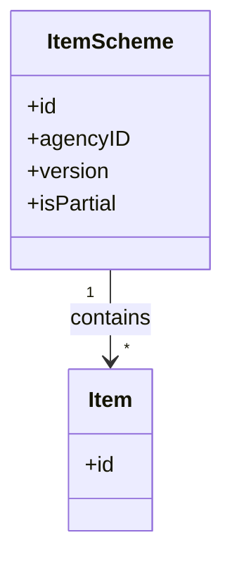
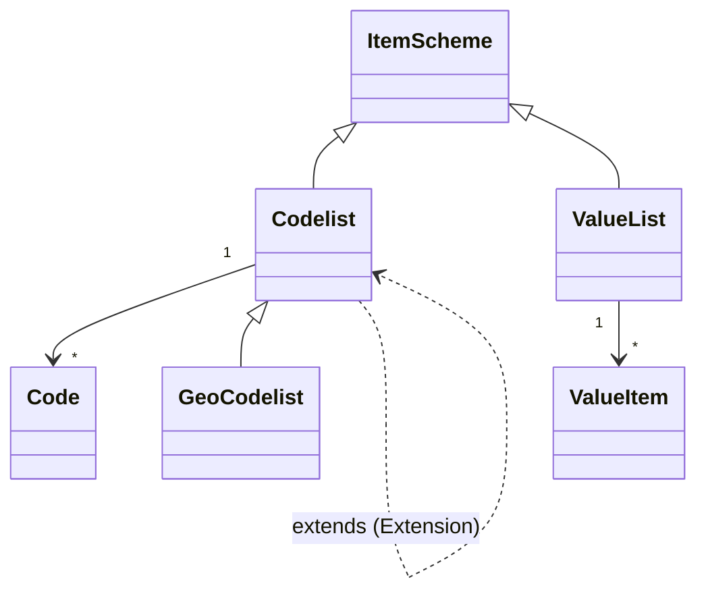
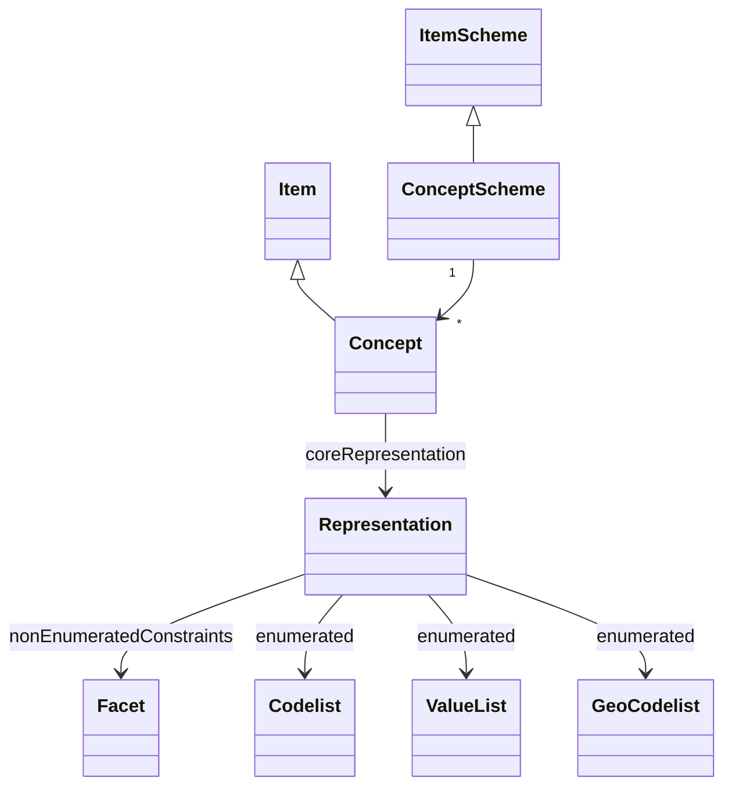
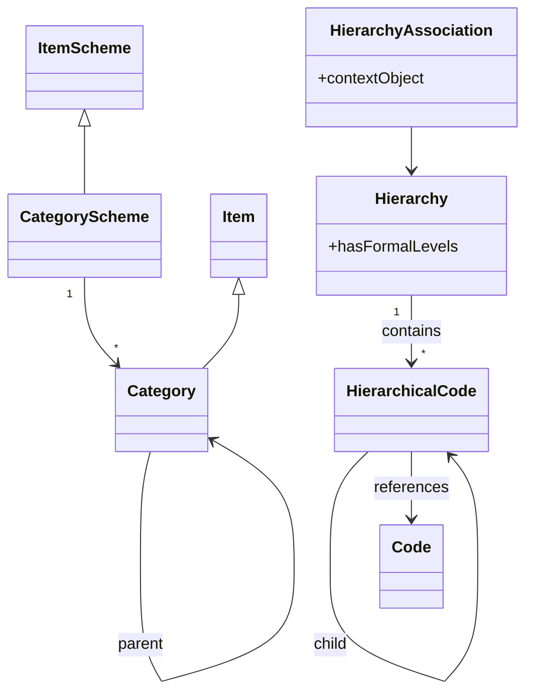
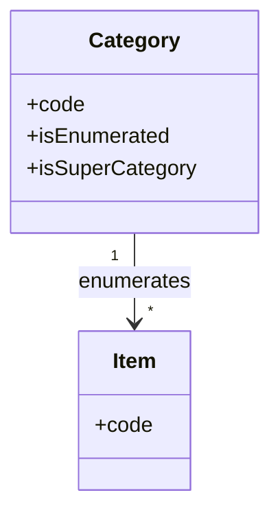
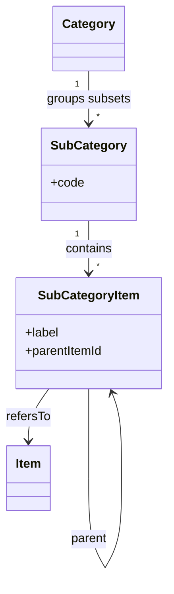
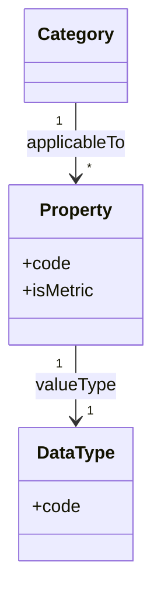
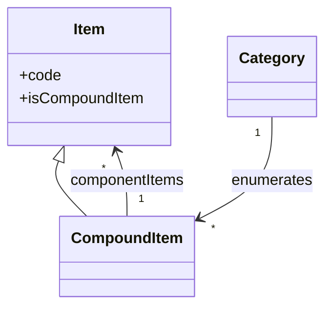
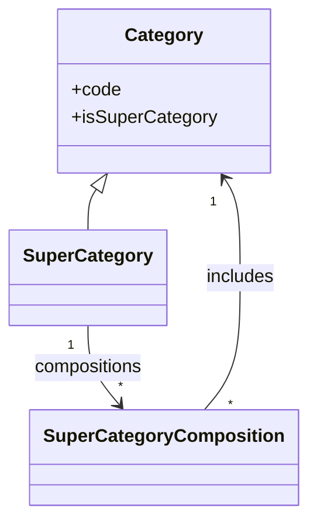

# 2. Vocabulary overview

This chapter introduces the “glossary” parts of the two metamodels used in this work: SDMX and DPM. It focuses on the artefacts that define and organise concepts, categories and value domains, i.e. the vocabulary that is later reused by structures (DSDs, tables, variables, etc.) but is itself independent from any particular data exchange syntax or physical implementation.

## 2.1 SDMX vocabulary artefacts

The SDMX glossary is built around maintained lists (“schemes”) and their items. Each scheme is owned by an agency and versioned. Below are the artefacts that matter for understanding how SDMX names and constrains glossary content. (Mapping artefacts, organisation schemes, and constraints are intentionally out of scope here.) The goal is to show how SDMX structures the vocabulary that later feeds structures like DSDs, without getting into data exchange syntax.

### Item schemes and items

- **ItemScheme / Item**  
  Pattern for any maintained list (scheme) and its entries (items). ItemSchemes are maintainable and can be partial (i.e. disseminate only a subset of items). Items are nameable, can carry descriptions and annotations, and can be organised hierarchically if the concrete scheme supports it.

### Value domains (enumerated)

- **Codelist**  
  Enumerated value domain for coded concepts (e.g. `FREQ`). Contains **Code** items. Can be partial and supports single-parent code hierarchies (lightweight trees directly inside the codelist).
  - *Example*: a codelist `CL_AREA_ISO` containing ISO country codes (`ES`, `FR`, `DE`, …) and another codelist `CL_AREA_NUTS` containing EU NUTS region codes (`ES300`, `ES302`, …). Both can be used to represent geographical areas in different levels of detail.

- **Extended Codelist**  
  Mechanism to restrict or extend a base codelist (e.g. add partner-specific codes or trim to a subset). Extension order matters when resolving code conflicts.
  - *Example*: an extended codelist `CL_GEO_AREA` that combines `CL_AREA_ISO` (countries) and `CL_AREA_NUTS` (regions) so that a single representation can be used for the concept “Geographical area” while reusing existing code sets.

- **GeoCodelist**  
  Codelist specialised for geospatial identifiers (e.g. geographic features or grids), with codes that reference geometries.

- **ValueList**  
  Lightweight enumerated value domain without “code” semantics (useful for short pick-lists). Contains **ValueItem** entries.

### Semantics

- **ConceptScheme**  
  Container that groups **Concepts** for a domain (e.g. all concepts for a subject area). It is the anchor for semantic definitions and is maintainable/versioned like other schemes.

- **Concept**  
  Semantic definition of a business characteristic (can serve as dimension, attribute, or measure in a DSD). Each concept has a **core representation**: either enumerated (via Codelist/ValueList/GeoCodelist) or non-enumerated (via data type and **Facet** constraints). Structural artefacts (e.g. a Dimension) can override this with a local representation.
  - *Examples*:
    - `RESIDENCE` and `BIRTH_LOC` concepts with an enumerated representation using `CL_GEO_AREA` (extended codelist over ISO countries and NUTS regions).
    - `NBIRTHS` (Number of births) concept with a non-enumerated integer representation (e.g. constrained to non‑negative values).
    - `FAIR_VAL` (Fair value) concept with a decimal representation (e.g. currency amounts, possibly constrained by scale or range facets).

- **Representation / Facet / FacetValueType**  
  Representation captures the allowable values. Facets (min/max, pattern, length, etc.) constrain non-enumerated types; enumerated representations point to a codelist or valuelist. Facets are reusable constraints that keep non-enumerated concepts precise.

### Grouping and hierarchy

- **CategoryScheme**  
  Scheme for organising **Categories** (e.g. subject domains, reporting taxonomies). Categories can be hierarchical (single-parent). Categorisations (not covered here) link categories to structural artefacts such as dataflows.

- **Category**  
  Item that labels a grouping; can be nested to build a taxonomy.

- **Hierarchy**  
  Maintained artefact defining parent–child relationships among codes, possibly across multiple codelists and with multiple parents (richer than the single-parent trees inside a codelist). **HierarchicalCode** nodes reference codes rather than duplicating them. **HierarchyAssociation** applies a hierarchy within a context (e.g. a dataflow) so different contexts can reuse or tailor the same structure.
  - *Example*: a “Geographical hierarchy” where a parent node `EU` groups all EU country codes (`ES`, `FR`, …) and where NUTS codes (e.g. `ES300`) are children of their corresponding country. The hierarchy can reference codes from both `CL_AREA_ISO` and `CL_AREA_NUTS`.

## 2.2 DPM glossary artefacts

The DPM glossary component provides a cross-domain vocabulary used to describe information requirements and variables. It defines categories, their items, subsets, and semantic properties that are later reused in the rendering and variable components. The focus here is on how the DPM glossary organises and constrains terms, not on tables, variables or operations.

### Categories and items

- **Category**  
  Value-domain container for related items. A Category can be:
  - **Enumerated** (`IsEnumerated = TRUE`): the possible values are explicitly listed as Items (similar to a code list).
  - **Non-enumerated** (`IsEnumerated = FALSE`): the possible values are not listed individually (e.g. instrument identifiers, free-form codes, or highly volatile lists).  
  Categories can be linked to external reference data, may be deactivated, and can be flagged as Super Categories.
  - *Examples*:
    - Enumerated Categories: `COUNTRY` containing ISO country Items (`ES`, `FR`, `DE`, …) and `NUTS_REGION` containing EU NUTS Items (`ES300`, `ES302`, …).
    - Non-enumerated Categories: an “Instrument identifier” Category where values are ISINs or LEIs that are not individually listed as Items.

- **Item**  
  Individual value in an enumerated Category. Items have a code, name and description, and are linked to Categories in a release-aware way (via `ItemCategory`). A Category can designate one Item as its default, which is implicitly assumed whenever a Property of that Category is used without stating an explicit Item.

### Subsets and hierarchies

- **SubCategory**  
  Artefact that defines a subset of Items for a given Category and optionally organises them. SubCategories are typically used to:
  - create smaller, thematic subsets of a large Category, and
  - specify which options appear in dropdowns for tables or variables.
  - *Examples*:
    - A SubCategory “EU Member States” over the `COUNTRY` Category, listing only EU countries for a particular regulation.
    - A hierarchical SubCategory over `NUTS_REGION` where NUTS-0 country items are parents of NUTS-1/NUTS-2/NUTS-3 region items.

- **SubCategoryItem**  
  Link between a SubCategory and the Items it contains. It supports:
  - hierarchical ordering via parent–child relationships between SubCategoryItems, and
  - local labels for Items when used within a particular SubCategory (e.g. regulation-specific wording in dropdowns).

### Semantic properties and metrics

- **Property**  
  Semantic characteristic used to define information requirements and variables. A Property always refers to one or more Categories and provides a “perspective” under which Items of those Categories are used (e.g. “Issuer residence”, “Instrument type”). Properties can be:
  - **Qualitative** (`IsMetric = FALSE`): descriptive characteristics that classify or qualify observations.
  - **Quantitative** (`IsMetric = TRUE`): characteristics that identify “what is measured”. These refer to a `DataType` and indicate whether values are reported at a point in time or over a period.  
  In the DPM glossary, Properties are the counterparts of SDMX Concepts and play the role of dimensions, attributes or measures when used in variables.
  - *Examples*:
    - Qualitative Properties `RESIDENCE` and `BIRTH_LOC` referring to a `GEO_AREA` Super Category, so that both countries and regions can be used as values.
    - A qualitative Property “Type of financial instrument” referring to an “Instrument type” Category that includes Items like “Debt security”.

- **Metric**  
  Informal term for a quantitative Property (`IsMetric = TRUE`) used for numerical values (e.g. amounts, ratios, counts). Metrics are not a separate artefact in the metamodel, but it is useful to distinguish them conceptually from qualitative Properties when discussing the glossary.
  - *Examples*:
    - Metric `NBIRTHS` (Number of births) with an integer data type and, typically, a non‑negative constraint.
    - Metric `FAIR_VAL` (Fair value) with a decimal data type, representing monetary amounts (e.g. in EUR).

- **DataType**  
  Predefined list of value types that can be used by Properties (e.g. integer, decimal, boolean, date, text, Enumeration). For Properties linked to enumerated Categories, the `DataType` is typically set to `Enumeration`, meaning that the allowed values are governed by the Items (and SubCategories) of those Categories. For Properties not backed by an enumerated Category, the `DataType` directly constrains the shape of admissible values (e.g. numeric ranges, dates).

### Composite and cross-category value domains

- **Compound Item**  
  An Item that encodes a composition of other Items across Properties (e.g. a “Treasury bill” defined as a particular instrument type, issuer sector and maturity bucket). Compound Items simplify modelling of complex terms: they can be used as a single dropdown option while still being decomposable into their underlying Property–Item pairs for analysis.
  - *Example*: a Compound Item “Treasury bill” in an “Instrument” Category composed of:
    - Type of financial instrument = “Debt security”,
    - Sector of the issuer = “General governments”,
    - Original maturity = “Up to 18 months”.

- **Super Category**  
  Category flagged as `IsSuperCategory = TRUE`. A Super Category brings together other Categories via compositions so that:
  - Items from several Categories can appear as a single, unified value domain, and
  - Properties defined for the Super Category can apply across its constituent Categories.  
  Conceptually, Super Categories play a similar role to SDMX Extended Codelists, providing higher-level groupings and mixed dropdowns over multiple base Categories.

In typical DPM 2.0 implementations (e.g. ECB CDM), these glossary artefacts are consolidated into a single cross-domain glossary, whereas SDMX often uses multiple concept schemes per domain.
