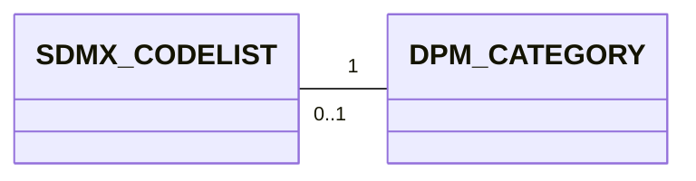
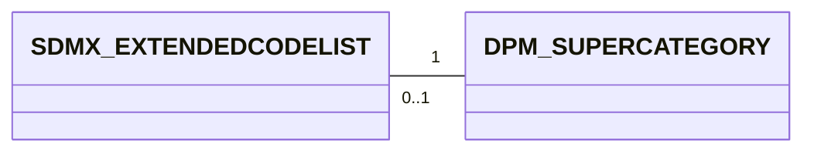
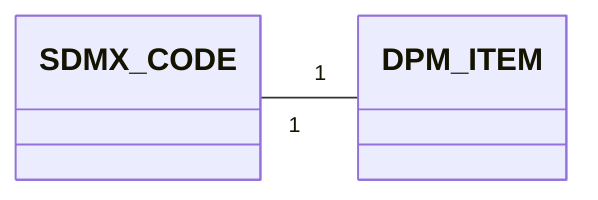

# 3. Detailed mapping rules

> **NOTE:**

> - Add coding/naming issues here for each mapping
> - Explain the constraints under which a mapping is simple (e.g., an organisation that uses only one Concept Scheme, vs many Concept Schemes), and proposed conventions if simple mapping is not possible.
> - Shall we add here something about versioning and extensibility? Or as a separate chapter?


This chapter provides the detailed rules for each of the high-level correspondences described in chapter 3.

## 3.1 Codelist ↔ Category
An SDMX CodeList is a structural component of the SDMX standard that defines a **set of coded values** that can be used as a representation for concepts or components.

A CodeList is a collection of Codes. Therefore, the SDMX representation of the CodeLists includes always its Codes.

**Example Codelist**
```xml
<Codelist id="CL_COUNTRY" agencyID="ECB" version="1.0">
  <Name xml:lang="en">Country</Name>
  <Description xml:lang="en">List of countries for ECB reporting (from SDMX CodeList CL_COUNTRY)</Description>
  <Code id="ES">
    <Name xml:lang="en">Spain</Name>
  </Code>
  <Code id="FR">
    <Name xml:lang="en">France</Name>
  </Code>
</Codelist>
```

The equivalent artefact in the DPM is the Category.

**Example Category**

| CategoryID | Code | Name | Description | IsEnumerated | IsActive | IsExternalRefData | RefDataSource | RowGUID | CreatedRelease |
| ---------- | ---- | ---- | ----------- | ------------ | -------- | ----------------- | ------------- | ------- | -------------- |
| 110        | BA   | Base items    | Defines the basic conceptual meaning... | -1| -1  | 0    |      | {0E40D86D-889C-498E-AE66-46398E615CEE} | 1     |
| 120        | MC   | Main category | Specifies the natu... | -1  | -1   | 0    |     | {6006CB2B-1EA7-494D-A09D-C33C30EB1856} | 1      |
| 130        | AP   | Approach      | Approach used for the calculation of capital requirements... | -1| -1| 0  |  | {D2F44CAE-72B1-4E06-BECA-81F2187324E0} | 1  |
| 140        | BT   | Boolean total | Dimensions having only two values... | -1  | -1 | 0  |   | {3DEB1863-B1F0-4741-95A0-44ED72734CDD} | 1              |


### 3.1.1 Mapping cardinality




- From SDMX to DPM: One Codelist is always mapped to one Category.
- From DPM to SDMX: One Category may be mapped to one CodeList or no CodeList. Concretely, non-enumerated categories are not mapped to any CodeList.This shall be considered when mapping the properties that are associated to non-enumerated Categories.


### 3.1.2 Attributes equivalence

#### 3.1.2.1 SDMX Codelist attributes
- maintainable artefact attributes (see [Identification mapping rules](../00_basics/02_detailed_mapping_rules.md#22-identification-dpm-ids-vs-sdmx-urns))
    - `id`
    - `agencyID`
    - `version`
- `is_external_reference`

#### 3.1.2.2 DPM Category attributes
- Concept attributes
    - `Owner`    
- `IsSuperCategory`
- `IsActive`
- `IsExternalRefData`
- `RefDataSource`
- `RowGUID`


#### 3.1.2.3 Mapping details

| SDMX                      | DPM                       |
|---------------------------|---------------------------|
| id                        | Code                      |
|     -not applicable-      | IsEnumerated = TRUE       |
|     -not applicable-      | IsActive = TRUE           |
| isExternalReference       | IsExternalRefData         |
|     -not applicable-      | RefDataSource = NULL      |


### 3.1.3 Example Mapping SDMX ==> DPM

```xml
<Codelist id="CL_COUNTRY" agencyID="ECB" version="1.0">
  <Name xml:lang="en">Country</Name>
  <Description xml:lang="en">List of countries for ECB reporting (from SDMX CodeList CL_COUNTRY)</Description>
  <Code id="ES">
    <Name xml:lang="en">Spain</Name>
  </Code>
  <Code id="FR">
    <Name xml:lang="en">France</Name>
  </Code>
</Codelist>
```

| CategoryID | Code | Name | Description | IsEnumerated | IsActive | IsExternalRefData | RefDataSource | RowGUID | CreatedRelease |
| ---------- | ---- | ---- | ----------- | ------------ | -------- | ----------------- | ------------- | ------- | -------------- |
| 111000001 | CL_COUNTRY | Country | List of countries for ECB reporting (from SDMX CodeList CL_COUNTRY) | -1 | -1 | 0 | | {0E40D86D-889C-498E-AE66-46398E615CEE} | 1 |


### 3.1.4 Example Mapping DPM ==> SDMX

| CategoryID | Code | Name | Description | IsEnumerated | IsActive | IsExternalRefData | RefDataSource | RowGUID | CreatedRelease |
| ---------- | ---- | ---- | ----------- | ------------ | -------- | ----------------- | ------------- | ------- | -------------- |
| 110        | BA   | Base items    | Defines the basic conceptual meaning... | -1   | -1   | 0    |   | {0E40D86D-889C-498E-AE66-46398E615CEE} | 1  |


```xml
<Codelist id="BA" agencyID="ECB" version="1.0">
  <Name xml:lang="en">Base items  </Name>
  <Description xml:lang="en">Defines the basic conceptual meaning...</Description>
</Codelist>
```
### 3.1.5 SDMX Geospatial Codelists
A Geospatial Codelist is a codelist whose codes represent geographic or spatial entities.
In SDMX, it is simply a codelist where every code corresponds to a location or a geographically‑defined object.

In the DPM metamodel, a geospatial codelist typically maps to a Category (e.g., COUNTRY, REGION)
  - Note that geospatial aspects (geometry, CRS, etc.) have no direct slot in DPM; they must be handled via:
    - naming conventions,
    - external metadata, or
    - extended attributes in implementations.


## 3.2 Extended Codelist ↔ Super Category

An **SDMX Codelist** may extend other Codelists via the CodelistExtension class.
The extension indicates the order of precedence of the extended Codelists for conflict resolution of Codes.
InclusiveCodeSelection and ExclusiveCodeSelection allow including or excluding subsets of Codes from the extended Codelists.
A MemberValue may specify a Code, including its children through the cascadeValues property, or include wildcard characters (‘%’) to select a set of Codes.

An SDMX Extended Codelist is a codelist that derives from one or more existing codelists, selectively including or excluding codes, optionally using wildcards, and resolving conflicts with prefixes and sequence order. 

**Example Extended Codelist**

The example illustrates how an Extended Codelist is created by combining and filtering codes from multiple existing codelists.

Starting from two base codelists:
- **CL_COUNTRY** (BE, FR, DE, IT, ES, PT)
- **CL_EXT_REGIONS** (EU, EU_W, EU_S)

A new codelist, **CL_EU_REPORTING**, is defined using CodelistExtension, with the following logic:
1. Inherit and filter codes: The extended codelist inherits all codes from CL_COUNTRY, but excludes ES and PT using ExclusiveCodeSelection.
2. Add selected codes from another codelist: From CL_EXT_REGIONS, only the codes matching the pattern EU_% are included (EU, EU_W, EU_S), using InclusiveCodeSelection and wildcard matching. A prefix REG_ is added to these codes to avoid conflicts (e.g., REG_EU, REG_EU_W).
3. Add new local codes: The extended codelist defines an additional local code, EU_CORE – Core EU reporting zone.

The resulting extended codelist includes:
•	BE, FR, DE, IT (ES and PT excluded)
•	REG_EU, REG_EU_W, REG_EU_S
•	EU_CORE (new)

```xml
<!-- Extended Codelist Example -->
<Codelist id="CL_EU_REPORTING" agencyID="ECB" version="1.0">

    <!-- 1. Extend CL_COUNTRY, excluding ES and PT -->
    <CodelistExtension codelistRef="CL_COUNTRY" sequence="1">
        <ExclusiveCodeSelection>
            <MemberValue value="ES"/>
            <MemberValue value="PT"/>
        </ExclusiveCodeSelection>
    </CodelistExtension>

    <!-- 2. Extend CL_EXT_REGIONS, include only codes matching EU_% -->
    <CodelistExtension codelistRef="CL_EXT_REGIONS" sequence="2" prefix="REG_">
        <InclusiveCodeSelection>
            <MemberValue value="EU_%"/>
        </InclusiveCodeSelection>
    </CodelistExtension>

    <!-- 3. Add a locally-defined code -->
    <Code id="EU_CORE">
        <Name xml:lang="en">Core EU reporting zone</Name>
    </Code>

</Codelist>
```
The equivalent artefact in the DPM is the SuperCategory.

A **DPM Super Category** is a Category marked with IsSuperCategory = TRUE, representing the union of multiple Categories listed through SuperCategoryComposition. 

**Example Super Category**

*Table Category*

| CategoryID | Code   | Name                     | Description                                                       | IsEnumerated | IsActive | IsExternalRefData | RefDataSource | RowGUID                                 | CreatedRelease |
| ---------- | ------ | ------------------------ | ----------------------------------------------------------------- | ------------ | -------- | ----------------- | ------------- | ---------------------------------------- | -------------- |
| 200        | GEO_SC | Geography SuperCategory  | Union of multiple geography-related categories.                   | -1           | -1       | 0                 |               | {A1B2C3D4-1111-2222-3333-444455556666}   | 1              |
| 210        | COUNTRY| Country Codes            | List of national codes.                                           | -1           | -1       | 0                 |               | {BBBBBBBB-AAAA-4444-9999-111111111111}   | 1              |
| 220        | REGION | Regions                  | List of administrative regions.                                   | -1           | -1       | 0                 |               | {CCCCCCCC-BBBB-5555-8888-222222222222}   | 1              |
| 230        | ECON   | Economic Areas           | Economic/geopolitical groupings.                                  | -1           | -1       | 0                 |               | {DDDDDDDD-CCCC-6666-7777-333333333333}   | 1              |

*Table SuperCategoryComposition*

| SuperCategoryID | CategoryID | StartReleaseID | EndReleaseID | RowGUID                                   |
| ---------------- |------------|----------------|--------------|-------------------------------------------- |
| 200              | 210        | 1              | NULL         | {E1000000-0000-0000-0000-000000000001}      |
| 200              | 220        | 1              | NULL         | {E2000000-0000-0000-0000-000000000002}      |
| 200              | 230        | 1              | NULL         | {E3000000-0000-0000-0000-000000000003}      |

### 3.2.1 Mapping cardinality



- From SDMX to DPM: An Extended Codelist can be mapped to a SuperCategory when it is simply the composition of multiple Codelists(mapped as Category); it may also be mapped to a SubCategory if it results from filtering the items of a single Category, or to a newly created Category when it represents the union of SubCategory and additional codes.
- From DPM to SDMX: One SuperCategory can be expressed as an Extended Codelist (grouping codes from a base codelist) 

### 3.2.2 Attributes equivalence

#### 3.2.2.1 SDMX Extended Codelist attributes
- maintainable artefact attributes (see [Identification mapping rules](../00_basics/02_detailed_mapping_rules.md#22-identification-dpm-ids-vs-sdmx-urns))
  Codelist attributes plus:
    - `idcodelistRef`
    - `sequence`
    - `prefix`
    - `inclusiveCodeSelectionList`
    - `exclusiveCodeSelectionList`
    - `idCode`

#### 3.2.2.2 SuperCategory attributes
  Category attributes plus:
    - `categoryId`

#### 3.2.2.3 Mapping details

| SDMX                      | DPM                       |
|---------------------------|---------------------------|
| idcodelistRef             | categoryId                |
| sequence                  | -not applicable-          |
| prefix                    | -not applicable-          |
| inclusiveCodeSelectionList| -not applicable-          |
| exclusiveCodeSelectionList| -not applicable-          |
| idCode                    | -not applicable-          |

### 3.2.3 Example Mapping SDMX ==> DPM

```xml
<!-- Extended Codelist Example -->
<Codelist id="CL_EU_REPORTING" agencyID="ECB" version="1.0">

    <!-- 1. Extend CL_COUNTRY, excluding ES and PT -->
    <CodelistExtension codelistRef="CL_COUNTRY" sequence="1">
        <ExclusiveCodeSelection>
            <MemberValue value="ES"/>
            <MemberValue value="PT"/>
        </ExclusiveCodeSelection>
    </CodelistExtension>

    <!-- 2. Extend CL_EXT_REGIONS, include only codes matching EU_% -->
    <CodelistExtension codelistRef="CL_EXT_REGIONS" sequence="2" prefix="REG_">
        <InclusiveCodeSelection>
            <MemberValue value="EU_%"/>
        </InclusiveCodeSelection>
    </CodelistExtension>

    <!-- 3. Add a locally-defined code -->
    <Code id="EU_CORE">
        <Name xml:lang="en">Core EU reporting zone</Name>
    </Code>

</Codelist>
```

*Definition of Categories*

| CategoryID | Code   | Name                     | Description                                                       | IsEnumerated | IsActive | IsExternalRefData | RefDataSource | RowGUID                                 | CreatedRelease |
| ---------- | ------ | ------------------------ | ----------------------------------------------------------------- | ------------ | -------- | ----------------- | ------------- | ---------------------------------------- | -------------- |
| 200        | CL_EU_UNION | SuperCategory  | Union of multiple geography-related categories.                   | -1           | -1       | 0                 |               | {A1B2C3D4-1111-2222-3333-444455556666}   | 1              |
| 210        | CL_COUNTRY| Country Codes            | List of national codes.                                           | -1           | -1       | 0                 |               | {BBBBBBBB-AAAA-4444-9999-111111111111}   | 1              |
| 220        | CL_EXT_REGIONS | Regions                  | List of administrative regions.                                   | -1           | -1       | 0                 |               | {CCCCCCCC-BBBB-5555-8888-222222222222}   | 1              |
| 230        | EU_CORE   | EU_CORE Codes           | List of codes.                                  | -1           | -1       | 0                 |               | {DDDDDDDD-CCCC-6666-7777-333333333333}   | 1              |

*Definition of SuperCategory*

| SuperCategoryID | CategoryID | StartReleaseID | EndReleaseID | RowGUID                                   |
| ---------------- |------------|----------------|--------------|-------------------------------------------- |
| 200              | 210        | 1              | NULL         | {E1000000-0000-0000-0000-000000000001}      |
| 200              | 220        | 1              | NULL         | {E2000000-0000-0000-0000-000000000002}      |
| 200              | 230        | 1              | NULL         | {E3000000-0000-0000-0000-000000000003}      |

*Definition of SubCategory*

| SubCategoryID | CategoryID | Code | Name                                         | Description                                                             | RowGUID                                   |
|---------------|------------|------|----------------------------------------------|-------------------------------------------------------------------------|--------------------------------------------|
| 20010         | 200        | CL_EU_REPORTING  | Reporting Countries     | Reporting Countries  | {5F6F7F44-FB94-4EC1-95F3-711DD9FA8F1B}     |

*Definition of SubCategory Composition*

| ItemID | SubCategoryVID | Order | Label | ParentItemID | ComparisonOperatorID | ArithmeticOperatorID | RowGUID                                   |
|--------|-----------------|-------|-------|---------------|------------------------|------------------------|--------------------------------------------|
| 1000   | 20010             | 1    |       |           |                        |                       | {76FD1DFC-DA28-4AB2-ABE5-EA5B1191450A}     |
| 1006   | 20010              | 2    |       |           |                        |                       | {C4DC92DB-ED65-4FDB-8B1C-D70644D4C15E}     |
| 1007   | 20010              | 3    |       |           |                        |                       | {C1099C3F-1FBC-4F79-9DB0-891CFC664FAD}     |
| 1008   | 20010              | 4    |       |           |                        |                       | {C3AAC52B-9054-4C03-8A31-BD41A055338F}     |
| 1009   | 20010           | 5     |       |               |                        |                        | {B4CA88A9-A1C9-494E-A42C-80BCE3F0BF32}     |

### 3.2.4 Example Mapping DPM ==> SDMX

*Table Category*

| CategoryID | Code   | Name                     | Description                                                       | IsEnumerated | IsActive | IsExternalRefData | RefDataSource | RowGUID                                 | CreatedRelease |
| ---------- | ------ | ------------------------ | ----------------------------------------------------------------- | ------------ | -------- | ----------------- | ------------- | ---------------------------------------- | -------------- |
| 200        | GEO_SC | Geography SuperCategory  | Union of multiple geography-related categories.                   | -1           | -1       | 0                 |               | {A1B2C3D4-1111-2222-3333-444455556666}   | 1              |
| 210        | COUNTRY| Country Codes            | List of national codes.                                           | -1           | -1       | 0                 |               | {BBBBBBBB-AAAA-4444-9999-111111111111}   | 1              |
| 220        | REGION | Regions                  | List of administrative regions.                                   | -1           | -1       | 0                 |               | {CCCCCCCC-BBBB-5555-8888-222222222222}   | 1              |
| 230        | ECON   | Economic Areas           | Economic/geopolitical groupings.                                  | -1           | -1       | 0                 |               | {DDDDDDDD-CCCC-6666-7777-333333333333}   | 1              |

*Table SuperCategoryComposition*

| SuperCategoryID | CategoryID | StartReleaseID | EndReleaseID | RowGUID                                   |
| ---------------- |------------|----------------|--------------|-------------------------------------------- |
| 200              | 210        | 1              | NULL         | {E1000000-0000-0000-0000-000000000001}      |
| 200              | 220        | 1              | NULL         | {E2000000-0000-0000-0000-000000000002}      |
| 200              | 230        | 1              | NULL         | {E3000000-0000-0000-0000-000000000003}      |

```xml
<!-- Extended Codelist Example -->
<Codelist id="GEO_SC" agencyID="ECB" version="1.0">

    <!-- 1. Extend COUNTRY -->
    <CodelistExtension codelistRef="COUNTRY" sequence="1">
    </CodelistExtension>

    <!-- 2. Extend REGION -->
    <CodelistExtension codelistRef="REGION" sequence="2" prefix="REG_">
    </CodelistExtension>

    <!-- 3. Extend ECON -->
   <CodelistExtension codelistRef="ECON" sequence="3" prefix="ECON_">
   </CodelistExtension>

</Codelist>
```

## 3.3 Code ↔ Category Item

An **SDMX Code** is the atomic element of a Codelist. Codes may participate in hierarchical structures as defined by the SDMX Item Scheme pattern. They inherit their identification and naming attributes from the SDMX artefact hierarchy (IdentifiableArtefact → NameableArtefact) .

The equivalent artefact in the DPM is the **Category Item**.  
A DPM Item represents one enumerated value of a Category. Items may take part in parent–child relationships.

**Example Code**

```xml
<Code id="ES">
  <Name xml:lang="en">Spain</Name>
</Code>
```

**Example Item**

| ItemID | CategoryID | Code | Name  | Description             | RowGUID                                   |
|--------|------------|------|--------|-------------------------|--------------------------------------------|
| 5001   | 210        | ES   | Spain  | Member state of the EU | {AABBCCDD-1111-2222-3333-444455556666}     |

### 3.3.1 Mapping cardinality

From SDMX to DPM: One SDMX Code is always mapped to one DPM Item belonging to the mapped Category.
From DPM to SDMX: One DPM Item is always mapped to an SDMX Code if its Category is mapped to a Codelist. 

### 3.3.2 Attributes equivalence

#### 3.3.2.1 Code attributes
-
    - `id`
    - `name`
    - `description`
    - `hierarchy`

#### 3.3.2.2 Item attributes
-
    - `Code`
    - `Name`
    - `Description`
    - `CategoryID`
    - `RowGUID`
    - `ParentItemID`  

#### 3.3.2.3 Mapping details

| SDMX        | DPM          |
|-------------|--------------|
| id          | Code         |
| name        | Name         |
| description | Description  |
| -not applicable-          | CategoryID   |
| -not applicable-         | RowGUID      |
| hierarchy   | ParentItemID |

### 3.3.3 Example Mapping SDMX ==> DPM
```xml
<Code id="ES">
  <Name xml:lang="en">Spain</Name>
</Code>
```

| ItemID | CategoryID | Code | Name  | Description             | RowGUID                                   |
|--------|------------|------|--------|-------------------------|--------------------------------------------|
| 5001   | 210        | ES   | Spain  | Member state of the EU | {AABBCCDD-1111-2222-3333-444455556666}     |

### 3.3.4 Example Mapping DPM ==> SDMX

| ItemID | CategoryID | Code | Name  | Description             | RowGUID                                   |
|--------|------------|------|--------|-------------------------|--------------------------------------------|
| 5001   | 210        | ES   | Spain  | Member state of the 

```xml
<Code id="ES">
  <Name xml:lang="en">Spain</Name>
</Code>
```
### 3.3.5 Compound Item

- **DPM Compound Category Item** encodes a composition of multiple items across categories (e.g. the “Treasury bill” example in the report).

- **DPM → SDMX**:
  - Map Compound Category Item → **Code**:
    - one Code in SDMX represents the compound item;
    - the internal structure (links to other Category Items) is not represented in core SDMX.
  - This mapping is lossy: composition information is lost unless captured via annotations or external documentation.

- **SDMX → DPM** (creating compound items):
  - If a particular Code is known (from business rules or external documentation) to represent a combination of other dimensions/categories, it can be modelled as a Compound Item in DPM with explicit links to its constituent Property–Item pairs — even though SDMX does not encode that composition explicitly. This is a design choice on the DPM side; SDMX does not force it.
  - *Example*: an SDMX codelist `CL_INSTRUMENT` contains a flat Code `TBILL` ("Treasury bill") with no internal structure:
    ```xml
    <Codelist id="CL_INSTRUMENT" agencyID="ECB" version="1.0">
      <Code id="TBILL">
        <Name xml:lang="en">Treasury bill</Name>
      </Code>
    </Codelist>
    ```
    In DPM, business knowledge tells us that "Treasury bill" is actually a combination of three characteristics. We model it as a Compound Item in an "Instrument" Category, referencing a Context with the following ContextCompositions:
    - Type of financial instrument (Property) = "Debt security" (Item),
    - Sector of the issuer (Property) = "General governments" (Item),
    - Original maturity (Property) = "Up to 18 months" (Item).

    The flat SDMX Code `TBILL` becomes a single DPM Item that is decomposable into its underlying Property–Item pairs for analysis, validation, and reuse across tables.

## 3.2 Subsets and hierarchies

### 3.2.1 Subsets (constraints and partial codelists)

Here’s how you define a subset of codes in SDMX, with examples:

- **Option 1**: Partial Codelist using isPartial
If you want to publish a reduced version of a maintained Codelist:
Key points:
The Codelist keeps the same agencyID, id, and version as the full list.
Add isPartial="true" in the Codelist header.
Include only the codes you need.

- **Option 2**: Using a Constraint
For dynamic subsets or validation rules, use ContentConstraint or AttachmentConstraint.
Key points:
Define a CubeRegion for data or MetadataTargetRegion for metadata.
Use MemberSelection to include/exclude codes.
Support for cascadeValues and wildcard %.

#### 3.2.2 Mapping details
Partial Codelist → DPM SubCategory

The subset of codes is modeled as a SubCategory of that Category.
SubCategory groups selected Items (codes) and can be versioned via SubCategoryVersion (linked to a Release).
Versioning
DPM supports historization: SubCategoryVersion refers to a Release, similar to SDMX versioning.
This allows tracking changes over time (e.g., adding/removing codes).

- Each SubCategory groups Items- Each SubCategory groups Items from the Category `{agencyID}.{ConceptSchemeId}.{CodelistId}`.
- Use SubCategoryVersion for historization.


#### DPM SubCategory Mapping Details

| Attribute           | Value |
|---------------------|-------|
| SubCategoryIDsystem-generated, e.g., 7001 |
| Code                | EU_COUNTRIES |
| Name                | European Union Countries |
| Description         | Subset of EU member states within CL_COUNTRY |
| Owner               | ECB |
| IsActive            | TRUE |
| RowGUID             | (system-generated UUID) |

#### SubCategoryVersion
| Attribute           | Value |
|---------------------|-------|
| SubCategoryVID      | (system-generated, e.g., 7101) |
| SubCategoryID       | 7001 |
| StartReleaseID      | 3001 (e.g., Release "2025-Q1") |
| EndReleaseID        | NULL |
| RowGUID             | (system-generated UUID) |


#### DPM SubCategory Examples (Partial Codelist Mapping)

#### SubCategory: EU_COUNTRIES
| Attribute           | Value |
|---------------------|-------|
| SubCategoryID       | 7001 |
| Code                | EU_COUNTRIES |
| Name                | European Union Countries |
| Description         | Subset of EU member states within CL_COUNTRY |
| RowGUID             | (system-generated UUID) |

#### SubCategoryVersion
| Attribute           | Value |
|---------------------|-------|
| SubCategoryVID      | 7101 |
| SubCategoryID       | 7001 |
| StartReleaseID      | 3001 |
| EndReleaseID        | NULL |

#### SubCategoryItems (Members of EU_COUNTRIES)
| Attribute           | Value |
|---------------------|-------|
| SubCategoryVID      | 7101 |
| ItemID              | 5001 |
| Label               | France |
| ParentItemID        | NULL |
| RowGUID             | (system-generated UUID) |

| Attribute           | Value |
|---------------------|-------|
| SubCategoryVID      | 7101 |
| ItemID              | 5002 |
| Label               | Germany |
| ParentItemID        | NULL |
| RowGUID             | (system-generated UUID) |

| Attribute           | Value |
|---------------------|-------|
| SubCategoryVID      | 7101 |
| ItemID              | 5003 |
| Label               | Italy |
| ParentItemID        | NULL |
| RowGUID             | (system-generated UUID) |


### 3.2.2 Hierarchies

- **Hierarchy over a single codelist**:
  - When an SDMX Hierarchy only includes codes from one codelist:
    - map the codelist to a Category,
    - represent the hierarchy using a Subcategory that carries parent–child relationships between Category Items.

- **Hierarchy over multiple codelists**:
  - DPM Subcategories must draw items from a single Category; they cannot directly represent a hierarchy that mixes items from multiple categories.
  - In such cases:
    - the mapping to DPM is not direct and is generally considered **out of scope** for strict interoperability;
    - the hierarchy should be handled via:
      - separate hierarchies per Category, and/or
      - external documentation.


## 3.1 ConceptSchema ↔ DPM Glossary
In the Data Point Model (DPM), there is no construct equivalent to the SDMX `ConceptScheme`.  
In SDMX, each `ConceptScheme` has its own identification space (defined by `agencyId`, `id`, and `version`).  
If concepts from multiple `ConceptSchemes` are combined into a single DPM glossary, identifier collisions may occur (for example, two concepts with the same name, such as `COUNTRY`, but with different meanings). 

### 3.1.1 Basic mapping

To resolve this issue, a namespace can be created for each `ConceptScheme` by adopting an approach based on **composite keys** in the DPM glossary:

---

### Glossary with Composite Keys
In the DPM glossary, define each concept using a composite key in the following format:

```
{agencyID}.{ConceptSchemeId}.{ConceptId}
```

*Example:*
```
ECB.CL_COUNTRY.COUNTRY
```

This ensures uniqueness without renaming the concepts.

---

### *Example ConceptScheme*
```xml
<ConceptScheme id="CL_CONCEPTS" agencyID="ECB" version="1.0">
    <Name xml:lang="en">Statistical Concepts</Name>
    <Description xml:lang="en">Concepts used for macroeconomic indicators</Description>
    <Concept id="FREQ">
        <Name xml:lang="en">Frequency</Name>
        <Description xml:lang="en">Reporting frequency</Description>
        <Representation>
            <CodelistRef id="CL_FREQ" agencyID="ECB" version="1.0"/>
        </Representation>
    </Concept>
    <Concept id="REF_AREA">
        <Name xml:lang="en">Reference Area</Name>
        <Description xml:lang="en">Geographical coverage</Description>
        <Representation>
            <CodelistRef id="CL_AREA" agencyID="ECB" version="1.0"/>
        </Representation>
    </Concept>
    <Codelist id="CL_FREQ" agencyID="ECB" version="1.0">
        <Name xml:lang="en">Frequency</Name>
        <Description xml:lang="en">Reporting frequency codes</Description>
        <Code id="A">
            <Name xml:lang="en">Annual</Name>
        </Code>
        <Code id="Q">
            <Name xml:lang="en">Quarterly</Name>
        </Code>
        <Code id="M">
            <Name xml:lang="en">Monthly</Name>
        </Code>
    </Codelist>
</ConceptScheme>
```

---

### **Example: SDMX ConcepSchema → DPM Glossary**

### **Concepts**
| SDMX Concept | Composite Key in DPM Glossary | Description            |
|--------------|--------------------------------|------------------------|
| FREQ         | ECB.CL_CONCEPTS.FREQ          | Reporting frequency    |
| REF_AREA     | ECB.CL_CONCEPTS.REF_AREA      | Geographical coverage  |

### **Codelist for FREQ**
| SDMX Code | Composite Key in DPM Glossary | Description |
|-----------|--------------------------------|-------------|
| A         | ECB.CL_FREQ.A                 | Annual      |
| Q         | ECB.CL_FREQ.Q                 | Quarterly   |
| M         | ECB.CL_FREQ.M                 | Monthly     |


## 3.3 Concept ↔ Property / Metric

### 3.3.2 DPM → SDMX
### SDMX Concept → DPM Property Mapping

This template maps **SDMX Concepts** (which can play the role of **dimension**, **attribute**, or **measure**) to **DPM Properties** (and shows how they are later used by Variables).

---

### Mapping details

| Attribute        | Value / Guidance |
|------------------|------------------|
| **PropertyID**   | (system-generated, e.g., 7001) |
| **Code**         | `{agencyID}.{ConceptSchemeId}.{ConceptId}` |
| **Name**         | `Concept.Name` |
| **Description**  | `Concept.Description` (multilingual as needed) |
| **IsMetric**     | `TRUE` if the SDMX Concept is a **measure**; otherwise `FALSE` |
| **DataType**     | Choose from DPM DataType set (e.g., `integer`, `decimal`, `string`, `date`, `boolean`, `enumeration`) |
| **PeriodType**   | `stock` (instant) or `flow` (duration); *only for quantitative metrics where relevant* |
| **IsComposite**  | `TRUE` if this Property represents a composite semantic (rare); otherwise `FALSE` |
| **RowGUID**      | (system-generated UUID) |

---

### Example A — SDMX **Dimension** Concept → DPM Property (+ Key Variable)

**SDMX**
- Concept ID: `COUNTRY`
- Role: **dimension**
- Representation: CodeList of countries (e.g., ISO 3166)

**DPM mapping**
- **Property**
  - `Code`: `EBA.CS_GEO.COUNTRY`
  - `Name`: `Country`
  - `Description`: `Reporting country`
  - `IsMetric`: `FALSE`
  - `DataType`: `enumeration`
  - (Optionally) `IsComposite`: `FALSE`
- **Category** (e.g., `Countries`), with **Items** like `IT`, `ES`, `FR`, …
- **Key Variable** (used when table is open by country)
  - References **Property** = `Country`
  - If needed, restrict selectable values with a **SubCategory** (e.g., `EU_Members`)


---

### Example B — SDMX **Attribute** Concept → DPM Property (+ Attribute Variable)

**SDMX**
- Concept ID: `OBS_STATUS`
- Role: **attribute** (e.g., A – provisional, F – forecast, E – estimated)
- Representation: CodeList of status codes

**DPM mapping**
- **Property**
  - `Code`: `EIOPA.CS_META.OBS_STATUS`
  - `Name`: `Observation status`
  - `Description`: `Quality/status flag of an observation`
  - `IsMetric`: `FALSE`
  - `DataType`: `enumeration`
- **Category** (e.g., `ObservationStatus`), with **Items** like `A`, `E`, `F`, …
- **Attribute Variable**
  - References **Property** = `Observation status`
  - Typically linked to **Fact Variables** that need the status annotation

---

### Example C — SDMX **Measure** Concept → DPM Property (+ Fact Variable)

**SDMX**
- Concept ID: `OBS_VALUE`
- Role: **measure** (e.g., monetary amount)
- Representation: numeric

**DPM mapping**
- **Property**
  - `Code`: `EBA.CS_MEASURE.OBS_VALUE`
  - `Name`: `Observed value`
  - `Description`: `Primary measure/observation value`
  - `IsMetric`: `TRUE`
  - `DataType`: `decimal` (or `integer` as appropriate)
  - `PeriodType`: `stock` (instant) **or** `flow` (duration), depending on the phenomenon
- **Fact Variable**
  - References **Property** = `Observed value`
  - May carry **Context** (e.g., Unit of measure, Currency) through additional Properties/Variables


### 3.5.2 DPM → SDMX

- **Metric → Concept used as measure**:
  - For each DPM Metric:
    - create an SDMX Concept in a dedicated Concept Scheme (e.g. “Metrics”),
    - set its representation according to the Metric’s data type,
    - use it as a measure in DSDs.

- **Property → Concept used as dimension/attribute**:
  - For each DPM Property:
    - create an SDMX Concept in a Concept Scheme (e.g. “Properties”),
    - set its representation:
      - enumerated (codelist) if linked to a Category/Subcategory, or
      - non-enumerated (facet-based) otherwise,
    - use it as a dimension or attribute in DSDs.


