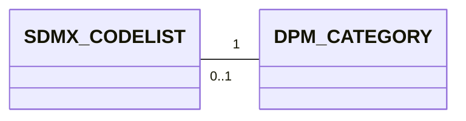
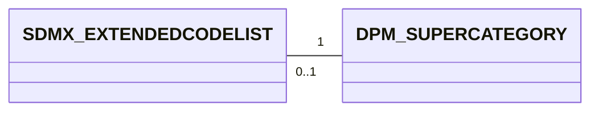
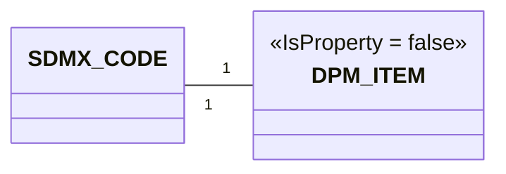
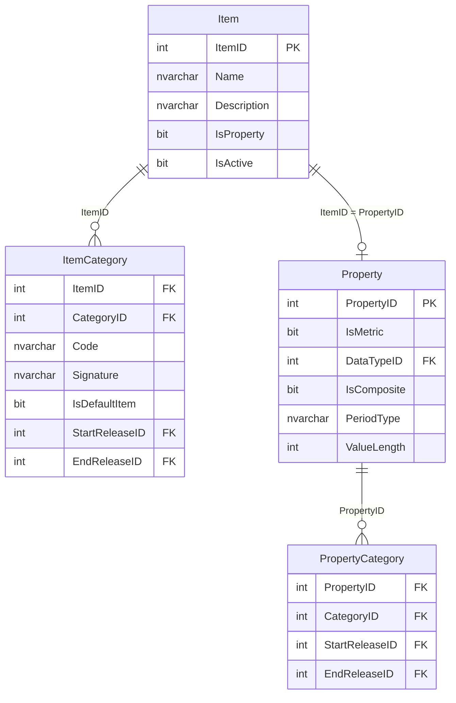
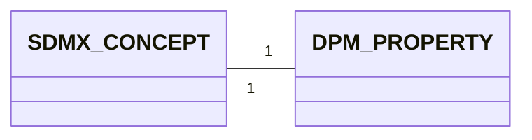

# 3. Detailed mapping rules

> **NOTE:**

> - Add coding/naming issues here for each mapping
> - Explain the constraints under which a mapping is simple (e.g., an organisation that uses only one Concept Scheme, vs many Concept Schemes), and proposed conventions if simple mapping is not possible.
> - Shall we add here something about versioning and extensibility? Or as a separate chapter?


This chapter provides the detailed rules for each of the high-level correspondences described in chapter 3.

## 3.1 Codelist ↔ Category
An SDMX CodeList is a structural component of the SDMX standard that defines a **set of coded values** that can be used as a representation for concepts or components.

A CodeList is a collection of Codes. Therefore, the SDMX representation of the CodeLists includes always its Codes.

**Example Codelist**
```xml
<Codelist id="CL_COUNTRY" agencyID="ECB" version="1.0">
  <Name xml:lang="en">Country</Name>
  <Description xml:lang="en">List of countries for ECB reporting (from SDMX CodeList CL_COUNTRY)</Description>
  <Code id="ES">
    <Name xml:lang="en">Spain</Name>
  </Code>
  <Code id="FR">
    <Name xml:lang="en">France</Name>
  </Code>
</Codelist>
```

The equivalent artefact in the DPM is the Category.

**Example Category**

| CategoryID | Code | Name | Description | IsEnumerated | IsActive | IsExternalRefData | RefDataSource | RowGUID | CreatedRelease |
| ---------- | ---- | ---- | ----------- | ------------ | -------- | ----------------- | ------------- | ------- | -------------- |
| 110        | BA   | Base items    | Defines the basic conceptual meaning... | -1| -1  | 0    |      | {0E40D86D-889C-498E-AE66-46398E615CEE} | 1     |
| 120        | MC   | Main category | Specifies the natu... | -1  | -1   | 0    |     | {6006CB2B-1EA7-494D-A09D-C33C30EB1856} | 1      |
| 130        | AP   | Approach      | Approach used for the calculation of capital requirements... | -1| -1| 0  |  | {D2F44CAE-72B1-4E06-BECA-81F2187324E0} | 1  |
| 140        | BT   | Boolean total | Dimensions having only two values... | -1  | -1 | 0  |   | {3DEB1863-B1F0-4741-95A0-44ED72734CDD} | 1              |


### 3.1.1 Mapping cardinality




- From SDMX to DPM: One Codelist is always mapped to one Category.
- From DPM to SDMX: One Category may be mapped to one CodeList or no CodeList. Concretely, non-enumerated categories are not mapped to any CodeList.This shall be considered when mapping the properties that are associated to non-enumerated Categories.


### 3.1.2 Attributes equivalence

#### 3.1.2.1 SDMX Codelist attributes
- maintainable artefact attributes (see [Identification mapping rules](../00_basics/02_detailed_mapping_rules.md#22-identification-dpm-ids-vs-sdmx-urns))
    - `id`
    - `agencyID`
    - `version`
- `is_external_reference`

#### 3.1.2.2 DPM Category attributes
- Concept attributes
    - `Owner`    
- `IsSuperCategory`
- `IsActive`
- `IsExternalRefData`
- `RefDataSource`
- `RowGUID`


#### 3.1.2.3 Mapping details

| SDMX                      | DPM                       |
|---------------------------|---------------------------|
| id                        | Code                      |
|     -not applicable-      | IsEnumerated = TRUE       |
|     -not applicable-      | IsActive = TRUE           |
|     -not applicable-      | IsExternalRefData         |
|     -not applicable-      | RefDataSource = NULL      |

> **Note**: SDMX `isExternalReference` is a **transmission flag** indicating that the artefact is sent as a stub whose full content can be resolved via `structureURL` or `serviceURL`. It has no semantic equivalent in DPM. Conversely, DPM `IsExternalRefData` is a **domain property** indicating that a Category refers to external reference data (e.g. master data, LEI registries). These are not equivalent despite the similar naming.

> **Note**: The mapping of multilingual `Name` and `Description` attributes (SDMX `InternationalString` with `xml:lang` → DPM `Concept.Name`/`Description` + `Translation` entities) follows the general rules described in [Multilingual support](../00_basics/02_detailed_mapping_rules.md#23-multilingual-support-internationalstring-vs-translations).


### 3.1.3 Example Mapping SDMX ==> DPM

```xml
<Codelist id="CL_COUNTRY" agencyID="ECB" version="1.0">
  <Name xml:lang="en">Country</Name>
  <Description xml:lang="en">List of countries for ECB reporting (from SDMX CodeList CL_COUNTRY)</Description>
  <Code id="ES">
    <Name xml:lang="en">Spain</Name>
  </Code>
  <Code id="FR">
    <Name xml:lang="en">France</Name>
  </Code>
</Codelist>
```

| CategoryID | Code | Name | Description | IsEnumerated | IsActive | IsExternalRefData | RefDataSource | RowGUID | CreatedRelease |
| ---------- | ---- | ---- | ----------- | ------------ | -------- | ----------------- | ------------- | ------- | -------------- |
| 111000001 | CL_COUNTRY | Country | List of countries for ECB reporting (from SDMX CodeList CL_COUNTRY) | -1 | -1 | 0 | | {0E40D86D-889C-498E-AE66-46398E615CEE} | 1 |


### 3.1.4 Example Mapping DPM ==> SDMX

| CategoryID | Code | Name | Description | IsEnumerated | IsActive | IsExternalRefData | RefDataSource | RowGUID | CreatedRelease |
| ---------- | ---- | ---- | ----------- | ------------ | -------- | ----------------- | ------------- | ------- | -------------- |
| 110        | BA   | Base items    | Defines the basic conceptual meaning... | -1   | -1   | 0    |   | {0E40D86D-889C-498E-AE66-46398E615CEE} | 1  |


```xml
<Codelist id="BA" agencyID="ECB" version="1.0">
  <Name xml:lang="en">Base items  </Name>
  <Description xml:lang="en">Defines the basic conceptual meaning...</Description>
</Codelist>
```
### 3.1.5 SDMX Geospatial Codelists
A Geospatial Codelist is a codelist whose codes represent geographic or spatial entities.
In SDMX, it is simply a codelist where every code corresponds to a location or a geographically‑defined object.

In the DPM metamodel, a geospatial codelist typically maps to a Category (e.g., COUNTRY, REGION).

Geospatial aspects (geometry, CRS, etc.) have no direct slot in DPM; they must be handled via:

- naming conventions,
- external metadata, or
- extended attributes in implementations.


## 3.2 Extended Codelist ↔ Super Category

An **SDMX Codelist** may extend other Codelists via the CodelistExtension class.
The extension indicates the order of precedence of the extended Codelists for conflict resolution of Codes.
InclusiveCodeSelection and ExclusiveCodeSelection allow including or excluding subsets of Codes from the extended Codelists.
A MemberValue may specify a Code, including its children through the cascadeValues property, or include wildcard characters (‘%’) to select a set of Codes.

An SDMX Extended Codelist is a codelist that derives from one or more existing codelists, selectively including or excluding codes, optionally using wildcards, and resolving conflicts with prefixes and sequence order. An Extended Codelist can also define its own locally-defined Codes in addition to those inherited from source codelists.

**Example Extended Codelist**

The example illustrates how an Extended Codelist is created by combining and filtering codes from multiple existing codelists.

Starting from two base codelists:
- **CL_COUNTRY** (BE, FR, DE, IT, ES, PT)
- **CL_EXT_REGIONS** (EU, EU_W, EU_S)

A new codelist, **CL_EU_REPORTING**, is defined using CodelistExtension, with the following logic:

1. Inherit and filter codes: The extended codelist inherits all codes from CL_COUNTRY, but excludes ES and PT using ExclusiveCodeSelection.
2. Add selected codes from another codelist: From CL_EXT_REGIONS, only the codes matching the pattern EU_% are included (EU, EU_W, EU_S), using InclusiveCodeSelection and wildcard matching. A prefix REG_ is added to these codes to avoid conflicts (e.g., REG_EU, REG_EU_W).
3. Add new local codes: The extended codelist defines an additional local code, EU_CORE – Core EU reporting zone.

The resulting extended codelist includes:
- BE, FR, DE, IT (ES and PT excluded)
- REG_EU, REG_EU_W, REG_EU_S
- EU_CORE (new)

```xml
<!-- Extended Codelist Example -->
<Codelist id="CL_EU_REPORTING" agencyID="ECB" version="1.0">

    <!-- 1. Extend CL_COUNTRY, excluding ES and PT -->
    <CodelistExtension codelistRef="CL_COUNTRY" sequence="1">
        <ExclusiveCodeSelection>
            <MemberValue value="ES"/>
            <MemberValue value="PT"/>
        </ExclusiveCodeSelection>
    </CodelistExtension>

    <!-- 2. Extend CL_EXT_REGIONS, include only codes matching EU_% -->
    <CodelistExtension codelistRef="CL_EXT_REGIONS" sequence="2" prefix="REG_">
        <InclusiveCodeSelection>
            <MemberValue value="EU_%"/>
        </InclusiveCodeSelection>
    </CodelistExtension>

    <!-- 3. Add a locally-defined code -->
    <Code id="EU_CORE">
        <Name xml:lang="en">Core EU reporting zone</Name>
    </Code>

</Codelist>
```
The equivalent artefact in the DPM is the SuperCategory.

A **DPM Super Category** is a Category marked with IsSuperCategory = TRUE, representing the union of multiple Categories listed through SuperCategoryComposition. A Super Category can also have its own direct Items and Properties, in addition to those inherited indirectly from its composed Categories.

**Example Super Category**

*Table Category*

| CategoryID | Code   | Name                     | Description                                                       | IsEnumerated | IsActive | IsExternalRefData | RefDataSource | RowGUID                                 | CreatedRelease |
| ---------- | ------ | ------------------------ | ----------------------------------------------------------------- | ------------ | -------- | ----------------- | ------------- | ---------------------------------------- | -------------- |
| 200        | GEO_SC | Geography SuperCategory  | Union of multiple geography-related categories.                   | -1           | -1       | 0                 |               | {A1B2C3D4-1111-2222-3333-444455556666}   | 1              |
| 210        | COUNTRY| Country Codes            | List of national codes.                                           | -1           | -1       | 0                 |               | {BBBBBBBB-AAAA-4444-9999-111111111111}   | 1              |
| 220        | REGION | Regions                  | List of administrative regions.                                   | -1           | -1       | 0                 |               | {CCCCCCCC-BBBB-5555-8888-222222222222}   | 1              |
| 230        | ECON   | Economic Areas           | Economic/geopolitical groupings.                                  | -1           | -1       | 0                 |               | {DDDDDDDD-CCCC-6666-7777-333333333333}   | 1              |

*Table SuperCategoryComposition*

| SuperCategoryID | CategoryID | StartReleaseID | EndReleaseID | RowGUID                                   |
| ---------------- |------------|----------------|--------------|-------------------------------------------- |
| 200              | 210        | 1              | NULL         | {E1000000-0000-0000-0000-000000000001}      |
| 200              | 220        | 1              | NULL         | {E2000000-0000-0000-0000-000000000002}      |
| 200              | 230        | 1              | NULL         | {E3000000-0000-0000-0000-000000000003}      |

### 3.2.1 Mapping cardinality



- From SDMX to DPM: An Extended Codelist can be mapped to a SuperCategory when it composes multiple Codelists (mapped as Categories). Locally-defined Codes within the Extended Codelist map to direct Items of the SuperCategory. An Extended Codelist may also be mapped to a SubCategory if it results from filtering the items of a single Category, or to a newly created Category when it represents the union of a SubCategory and additional codes.
- From DPM to SDMX: One SuperCategory can be expressed as an Extended Codelist (grouping codes from composed Categories, plus any direct Items as locally-defined Codes).

### 3.2.2 Attributes equivalence

#### 3.2.2.1 SDMX Extended Codelist attributes
- maintainable artefact attributes (see [Identification mapping rules](../00_basics/02_detailed_mapping_rules.md#22-identification-dpm-ids-vs-sdmx-urns))
  Codelist attributes plus:
    - `idcodelistRef`
    - `sequence`
    - `prefix`
    - `inclusiveCodeSelectionList`
    - `exclusiveCodeSelectionList`
    - `idCode`

#### 3.2.2.2 SuperCategory attributes
  Category attributes plus:
    - `categoryId`

#### 3.2.2.3 Mapping details

| SDMX                      | DPM                       |
|---------------------------|---------------------------|
| idcodelistRef             | categoryId                |
| sequence                  | -not applicable-          |
| prefix                    | -not applicable-          |
| inclusiveCodeSelectionList| -not applicable-          |
| exclusiveCodeSelectionList| -not applicable-          |
| idCode                    | -not applicable-          |

> **Note — out-of-scope features**: The following SDMX Extended Codelist features have no equivalent in DPM and are currently out of scope for mapping. Mapping will fail for Extended Codelists that rely on these mechanisms:
>
> - **`sequence`**: Controls precedence for conflict resolution when the same code appears in multiple source codelists. DPM `SuperCategoryComposition` has no ordering or conflict-resolution mechanism.
> - **`prefix`**: Used to disambiguate overlapping codes when combining codelists (discriminated-union use case). DPM Items retain their original codes; there is no prefixing mechanism.
> - **`inclusiveCodeSelectionList` / `exclusiveCodeSelectionList` / wildcards**: DPM `SuperCategoryComposition` always includes *all* Items from each composed Category — there is no subset-selection at the composition level. Filtering the Items of a *single* base Category can be approximated via a SubCategory (see section 3.2.1), but cross-Category filtering and wildcard patterns (`%`) are out of scope.
> - **`idCode`**: No DPM equivalent.

### 3.2.3 Mapping SDMX ==> DPM

#### Generic pattern

Mapping an SDMX Extended Codelist to DPM can produce up to three artefacts, depending on whether the Extended Codelist filters codes or only unions them:

| SDMX feature | DPM artefact | When created |
|--------------|--------------|--------------|
| Extended Codelist itself | **SuperCategory** (`IsSuperCategory = TRUE`) | Always — one SuperCategory per Extended Codelist |
| Each `CodelistExtension` reference | **SuperCategoryComposition** entry | Always — one row per base Codelist |
| Locally-defined `<Code>` elements | **Direct Items** of the SuperCategory | Only if the Extended Codelist defines its own codes |
| `InclusiveCodeSelection` / `ExclusiveCodeSelection` | **SubCategory** of the SuperCategory | Only if the Extended Codelist filters codes from a base Codelist |

The mapping proceeds in four steps:

1. **Create a SuperCategory** for the Extended Codelist, using the Extended Codelist's `id` as the Category Code, with `IsSuperCategory = TRUE`.
2. **For each `CodelistExtension`**: map the referenced source Codelist to a DPM Category (section 3.1) and register it in `SuperCategoryComposition`.
3. **For each locally-defined `<Code>`**: create a direct Item of the SuperCategory (with `CategoryID` pointing to the SuperCategory itself).
4. **If code selection is present**: create a SubCategory of the SuperCategory containing only the Items that survive the inclusion/exclusion filters. The SubCategory captures the *effective membership* of the Extended Codelist — the actual subset of codes available after filtering.

> **Note:** SDMX features such as `prefix`, `sequence`, and wildcard patterns (`%`) have no DPM equivalent and are out of scope (see section 3.2.2.3). When code selections use these features, the filter must be evaluated at conversion time to produce a flat list of Items for the SubCategory.

**When is step 4 needed?**

- **No filtering** (all `CodelistExtension` entries include all codes from their base Codelists): The SuperCategory alone is sufficient — it already represents the union of all base Categories. No SubCategory is needed.
- **Filtering present** (at least one `CodelistExtension` uses `InclusiveCodeSelection` or `ExclusiveCodeSelection`): A SubCategory must be created to record which Items are actually included. Without it, the SuperCategory would imply all Items from all base Categories are available, which is incorrect.

#### Worked example

The `CL_EU_REPORTING` Extended Codelist combines two base Codelists with filtering and adds a locally-defined code:

- **CL_COUNTRY** (BE, FR, DE, IT, ES, PT) — excludes ES and PT
- **CL_EXT_REGIONS** (EU, EU_W, EU_S) — includes only codes matching `EU_%`
- **EU_CORE** — locally-defined code

```xml
<Codelist id="CL_EU_REPORTING" agencyID="ECB" version="1.0">
    <CodelistExtension codelistRef="CL_COUNTRY" sequence="1">
        <ExclusiveCodeSelection>
            <MemberValue value="ES"/>
            <MemberValue value="PT"/>
        </ExclusiveCodeSelection>
    </CodelistExtension>
    <CodelistExtension codelistRef="CL_EXT_REGIONS" sequence="2" prefix="REG_">
        <InclusiveCodeSelection>
            <MemberValue value="EU_%"/>
        </InclusiveCodeSelection>
    </CodelistExtension>
    <Code id="EU_CORE">
        <Name xml:lang="en">Core EU reporting zone</Name>
    </Code>
</Codelist>
```

**Step 1 — SuperCategory** (the Extended Codelist itself):

| CategoryID | Code | Name | IsSuperCategory |
|------------|------|------|-----------------|
| 200 | CL_EU_REPORTING | EU Reporting | TRUE |

**Step 2 — SuperCategoryComposition** (one row per base Codelist):

| SuperCategoryID | CategoryID | Category Code | Note |
|-----------------|------------|---------------|------|
| 200 | 210 | CL_COUNTRY | All 6 country codes are in the Category |
| 200 | 220 | CL_EXT_REGIONS | All 3 region codes are in the Category |

The SuperCategory now represents the **full union** of both Categories (9 Items total). The filtering has not been applied yet.

**Step 3 — Direct Items** (locally-defined codes):

| ItemID | CategoryID | Code | Name |
|--------|------------|------|------|
| 5100 | 200 (SuperCategory) | EU_CORE | Core EU reporting zone |

**Step 4 — SubCategory** (filtered subset):

Because `CL_EU_REPORTING` uses `ExclusiveCodeSelection` (excluding ES, PT) and `InclusiveCodeSelection` (including only `EU_%`), the effective membership is only 8 of the 10 total Items (9 from base Categories + 1 direct). A SubCategory records this:

*SubCategory*

| SubCategoryID | CategoryID | Code | Name |
|---------------|------------|------|------|
| 20010 | 200 | CL_EU_REPORTING_SUBSET | Reporting Countries |

*SubCategoryItems* (the Items that survive filtering + the direct Item):

| SubCategoryVID | ItemID | Code | Source | Note |
|----------------|--------|------|--------|------|
| 20010 | 3001 | BE | CL_COUNTRY | Included (not excluded) |
| 20010 | 3002 | FR | CL_COUNTRY | Included (not excluded) |
| 20010 | 3003 | DE | CL_COUNTRY | Included (not excluded) |
| 20010 | 3004 | IT | CL_COUNTRY | Included (not excluded) |
| 20010 | 4001 | EU | CL_EXT_REGIONS | Matches `EU_%` |
| 20010 | 4002 | EU_W | CL_EXT_REGIONS | Matches `EU_%` |
| 20010 | 4003 | EU_S | CL_EXT_REGIONS | Matches `EU_%` |
| 20010 | 5100 | EU_CORE | Direct Item | Locally-defined |

Items ES (3005) and PT (3006) from CL_COUNTRY are **not** in the SubCategory — they were excluded by `ExclusiveCodeSelection`.

### 3.2.4 Example Mapping DPM ==> SDMX

*Table Category*

| CategoryID | Code   | Name                     | Description                                                       | IsEnumerated | IsActive | IsExternalRefData | RefDataSource | RowGUID                                 | CreatedRelease |
| ---------- | ------ | ------------------------ | ----------------------------------------------------------------- | ------------ | -------- | ----------------- | ------------- | ---------------------------------------- | -------------- |
| 200        | GEO_SC | Geography SuperCategory  | Union of multiple geography-related categories.                   | -1           | -1       | 0                 |               | {A1B2C3D4-1111-2222-3333-444455556666}   | 1              |
| 210        | COUNTRY| Country Codes            | List of national codes.                                           | -1           | -1       | 0                 |               | {BBBBBBBB-AAAA-4444-9999-111111111111}   | 1              |
| 220        | REGION | Regions                  | List of administrative regions.                                   | -1           | -1       | 0                 |               | {CCCCCCCC-BBBB-5555-8888-222222222222}   | 1              |
| 230        | ECON   | Economic Areas           | Economic/geopolitical groupings.                                  | -1           | -1       | 0                 |               | {DDDDDDDD-CCCC-6666-7777-333333333333}   | 1              |

*Table SuperCategoryComposition*

| SuperCategoryID | CategoryID | StartReleaseID | EndReleaseID | RowGUID                                   |
| ---------------- |------------|----------------|--------------|-------------------------------------------- |
| 200              | 210        | 1              | NULL         | {E1000000-0000-0000-0000-000000000001}      |
| 200              | 220        | 1              | NULL         | {E2000000-0000-0000-0000-000000000002}      |
| 200              | 230        | 1              | NULL         | {E3000000-0000-0000-0000-000000000003}      |

*Direct Items of SuperCategory*

| ItemID | CategoryID | Code   | Name   | Description         | RowGUID                                   |
|--------|------------|--------|--------|---------------------|------------------------------------------- |
| 5200   | 200        | GLOBAL | Global | Worldwide aggregate | {EEEEEEEE-1111-2222-3333-444455556666}    |

```xml
<!-- Extended Codelist Example -->
<Codelist id="GEO_SC" agencyID="ECB" version="1.0">

    <!-- 1. Extend COUNTRY -->
    <CodelistExtension codelistRef="COUNTRY" sequence="1">
    </CodelistExtension>

    <!-- 2. Extend REGION -->
    <CodelistExtension codelistRef="REGION" sequence="2" prefix="REG_">
    </CodelistExtension>

    <!-- 3. Extend ECON -->
   <CodelistExtension codelistRef="ECON" sequence="3" prefix="ECON_">
   </CodelistExtension>

    <!-- 4. Direct Items of the SuperCategory become locally-defined Codes -->
    <Code id="GLOBAL">
        <Name xml:lang="en">Global</Name>
    </Code>

</Codelist>
```

## 3.3 Code ↔ Category Item

An **SDMX Code** is the atomic element of a Codelist. Codes may participate in hierarchical structures as defined by the SDMX Item Scheme pattern. They inherit their identification and naming attributes from the SDMX artefact hierarchy (IdentifiableArtefact → NameableArtefact) .

The equivalent artefact in the DPM is the **Category Item**.
A DPM Item represents one enumerated value of a Category. The DPM uses two tables for this: the `Item` table stores the item's identity (`ItemID`), display name (`Name`), description (`Description`), and the `IsProperty` flag; the `ItemCategory` table is the join between an `Item` and the `Category` it belongs to, and it is where the `Code` and the `CategoryID` foreign key are stored. Items may take part in parent–child relationships. Only Items with `IsProperty = false` are candidates for mapping to SDMX Codes; Items with `IsProperty = true` serve as counterparts to Properties and are mapped to SDMX Concepts instead (see [section 3.5](#35-concept--property)).

**Example Code**

```xml
<Code id="ES">
  <Name xml:lang="en">Spain</Name>
</Code>
```

**Example Item**

*Table Item*

| ItemID | Name  | Description             | IsProperty | RowGUID                                   |
|--------|-------|-------------------------|------------|-------------------------------------------|
| 5001   | Spain | Member state of the EU  | 0          | {AABBCCDD-1111-2222-3333-444455556666}    |

*Table ItemCategory*

| ItemID | CategoryID | Code | StartReleaseID | RowGUID                                   |
|--------|------------|------|----------------|-------------------------------------------|
| 5001   | 210        | ES   | 1              | {BBCCDDEE-2222-3333-4444-555566667777}    |

### 3.3.1 Mapping cardinality


- **From SDMX to DPM:** One SDMX Code maps to one DPM Item with `IsProperty = false`, belonging to the mapped Category.
- **From DPM to SDMX:** One DPM Item maps to an SDMX Code only if `IsProperty = false` and its Category is mapped to a Codelist. Items with `IsProperty = true` are not mapped as Codes — they correspond to Properties (see [section 3.5](#35-concept--property)).

### 3.3.2 Attributes equivalence

#### 3.3.2.1 Code attributes
-
    - `id`
    - `name`
    - `description`
    - `hierarchy`

#### 3.3.2.2 Item attributes

`Item` table:

- `Name`
- `Description`
- `IsProperty`

`ItemCategory` table (join between Item and Category):

- `Code`
- `CategoryID`
- `Signature` (computed business key — see section 3.3.2.4)
- `IsDefaultItem` (XBRL default member flag — see section 3.3.2.5)

#### 3.3.2.3 Mapping details

| SDMX             | DPM                            |
|------------------|--------------------------------|
| id               | `ItemCategory.Code`            |
| name             | `Item.Name`                    |
| description      | `Item.Description`             |
| -not applicable- | `ItemCategory.CategoryID`      |
| hierarchy        | `Item.ParentItemID`            |
| -not applicable- | `ItemCategory.IsDefaultItem`   |

#### 3.3.2.4 Signature — DPM business key

The `Signature` field in `ItemCategory` is a computed business key that uniquely identifies an item within a release. It serves a role analogous to an SDMX URN: a structured, human-readable string used as a stable reference in DPM tooling and XBRL taxonomy generation.

**Construction rule:**

```
{OwnerAcronym}_{CategoryCode}:{ItemCode}
```

| Component      | Description                                                          | Example |
|----------------|----------------------------------------------------------------------|---------|
| `OwnerAcronym` | Lowercase acronym of the organisation that owns the Category         | `eba`   |
| `CategoryCode` | Code of the Category the item belongs to (`ItemCategory.CategoryID` → `Category.Code`) | `BA` |
| `ItemCode`     | Code of the item within that Category (`ItemCategory.Code`)          | `x6`    |

**Example:**

| Owner | Category | Item Code | Signature   |
|-------|----------|-----------|-------------|
| EBA   | BA       | x6        | `eba_BA:x6` |

**Role:**

- Used operationally in DPM Studio and internal tooling as a collision-free, stable reference across releases.
- Used when generating XBRL taxonomies, particularly for open-key element naming.
- Has no direct SDMX equivalent; when round-tripping DPM→SDMX, the signature can be preserved via an SDMX annotation (see [issue #62](https://github.com/sdmx-twg/wp-sdmx-dpm/issues/62)).

#### 3.3.2.5 IsDefaultItem — XBRL default member

The `IsDefaultItem` field in `ItemCategory` is a boolean flag (DPM convention: `-1` = true, `0` = false) that marks one item per Category as the **default member**. In EBA DPM, the default item always carries Code `x0`.

**Purpose:** This is an XBRL-specific workaround. XBRL formula and validation engines require every dimension to have a nominated default member so that formulas can be evaluated even when a dimension value is not specified. Default members are never actually reported in datasets — they are internal machinery.

**Mapping:**

| Direction    | Rule                                                                                          |
|--------------|-----------------------------------------------------------------------------------------------|
| DPM → SDMX  | `IsDefaultItem` is **discarded**. No information is lost: SDMX always requires explicit dimension values, so there is no concept of a default member. |
| SDMX → DPM  | No incoming SDMX artefact carries default-member information. A default item may need to be generated when creating a DPM database for XBRL use — see [section 3.3.2.6](#3326-sdmxdpm-generating-default-items) for the proposed strategy. |

#### 3.3.2.6 SDMX→DPM: generating default items

When converting SDMX→DPM for XBRL taxonomy generation, a default member (`IsDefaultItem = -1`) must be designated for every Category. No SDMX artefact carries this information natively. Four options were considered at the interoperability meeting (24 February 2026):

| Option | Description | Pros | Cons |
|--------|-------------|------|------|
| **1. Synthetic `x0`** | Always generate a new item with Code `x0` and Name "[Default]" | Deterministic; consistent with EBA DPM convention | Introduces a code absent from the source SDMX; appears if the taxonomy is round-tripped back |
| **2. Known conventions** | Reuse a code matching established patterns (`_T`, `_SET`, `_X`) if present | Uses a semantically meaningful code already in the source | Not all codelists follow these conventions; lookup can be ambiguous |
| **3. First code in list** | Designate the first code as the default | Simple; no annotation needed | Arbitrary — the first code has no special meaning in most contexts |
| **4. Manual mapping** | Require the implementer to designate the default item explicitly | Always correct | Not scalable; blocks automated pipelines |

> Katrin Heinze (meeting, 24 Feb 2026): *"Any automatic choice can be wrong."* Human review is therefore required whenever automatic selection is used.

**Recommended tiered strategy:**

1. **Check for a `DPM_DEFAULT_ITEM` annotation** on any incoming SDMX `Code`. If present, use that code as the default item. This annotation type follows the same convention as `DPM_SIGNATURE` (see [section 2.6.1](../00_basics/02_detailed_mapping_rules.md#261-dpm-signature-annotation)) and allows round-trip fidelity.
2. **Check for known SDMX conventions.** If a code matching `_T`, `_SET`, or `_X` exists in the Codelist, use it as the default item.
3. **Generate a synthetic `x0` item** with Name "[Default]" as a last resort. Mark it clearly as auto-generated.
4. **Flag all automatically selected default items** in the conversion output for human review. Never silently commit an automatic choice without logging it.

> **Note — manual intervention cases**: Automatic selection is unavoidable when none of the above signals are present. Implementers must review flagged items before using the DPM database for XBRL validation.

### 3.3.3 Example Mapping SDMX ==> DPM
```xml
<Code id="ES">
  <Name xml:lang="en">Spain</Name>
</Code>
```

*Table Item*

| ItemID | Name  | Description             | IsProperty | RowGUID                                   |
|--------|-------|-------------------------|------------|-------------------------------------------|
| 5001   | Spain | Member state of the EU  | 0          | {AABBCCDD-1111-2222-3333-444455556666}    |

*Table ItemCategory*

| ItemID | CategoryID | Code | StartReleaseID | RowGUID                                   |
|--------|------------|------|----------------|-------------------------------------------|
| 5001   | 210        | ES   | 1              | {BBCCDDEE-2222-3333-4444-555566667777}    |

### 3.3.4 Example Mapping DPM ==> SDMX

*Table Item*

| ItemID | Name  | Description             | IsProperty | RowGUID                                   |
|--------|-------|-------------------------|------------|-------------------------------------------|
| 5001   | Spain | Member state of the EU  | 0          | {AABBCCDD-1111-2222-3333-444455556666}    |

*Table ItemCategory*

| ItemID | CategoryID | Code | StartReleaseID | RowGUID                                   |
|--------|------------|------|----------------|-------------------------------------------|
| 5001   | 210        | ES   | 1              | {BBCCDDEE-2222-3333-4444-555566667777}    |

```xml
<Code id="ES">
  <Name xml:lang="en">Spain</Name>
</Code>
```
### 3.3.5 Compound Item — known limitation

A **DPM Compound Category Item** explicitly encodes that one item is composed of other items (e.g. a “Treasury bill” composed of instrument type, issuer sector, and original maturity). This composition is useful for slicing, aggregation, and reuse across tables. **SDMX has no equivalent construct.**

> **Known limitation**: Compound item semantics cannot be represented in core SDMX. This is a structural gap between the two standards.

**DPM → SDMX:**

A Compound Category Item maps to an **ordinary SDMX Code**. The composition structure (links to constituent Property–Item pairs) is lost. The resulting Code is indistinguishable from any other Code in the Codelist.

Annotations may be used for documentation purposes — the compound semantics can be described in an annotation on the Code to preserve human-readable information, though the structure cannot be recovered automatically. See [section 3.3.6](#336-sdmx-workarounds-for-compound-item-semantics) for exploration of SDMX options (hierarchies, representation maps, annotations) to partially preserve compound semantics.

**SDMX → DPM:**

Nothing special can be inferred from a plain SDMX Code about compound semantics. By default, every incoming Code maps to a simple DPM Item. A Compound Item can only be created if **explicit external business knowledge** identifies that a particular Code represents a composition — this is outside the scope of automated mapping and requires manual modelling.

*Example*: an SDMX codelist `CL_INSTRUMENT` contains a flat Code `TBILL` (“Treasury bill”) with no internal structure:

```xml
<Codelist id=”CL_INSTRUMENT” agencyID=”ECB” version=”1.0”>
  <Code id=”TBILL”>
    <Name xml:lang=”en”>Treasury bill</Name>
  </Code>
</Codelist>
```

In automated mapping, `TBILL` becomes a simple DPM Item. Only if domain knowledge confirms that “Treasury bill” is a combination of three characteristics (instrument type = “Debt security”, issuer sector = “General governments”, original maturity = “Up to 18 months”) can it be manually re-modelled as a Compound Item with the corresponding ContextCompositions.

### 3.3.6 SDMX workarounds for compound item semantics

Although SDMX has no explicit compound item construct, three mechanisms can partially preserve compound semantics when converting DPM→SDMX. None is a complete solution; they should be considered documentation or interoperability aids rather than faithful representations.

| Option | Feasibility | Fidelity | Summary |
|--------|-------------|----------|---------|
| **Hierarchies** | Medium | Low | Can express aggregation structure but cannot capture cross-category composition |
| **Representation maps** | Low | Low | Designed for code equivalence between codelists; does not fit composition semantics |
| **Annotations** | High | Medium | Flexible and machine-readable if format is standardised; **recommended** |

#### Hierarchies

SDMX hierarchies (`Hierarchy` in SDMX 3.x, `HierarchicalCodelist` in SDMX 2.1) express parent–child relationships *within a single codelist*, while DPM compound items span multiple Properties across different categories. A hierarchy can at best hint at aggregation, cannot capture cross-category composition, and gives the reader no way to distinguish a genuine sub-type hierarchy from a compound-item workaround.

#### Representation maps

SDMX `RepresentationMap` artefacts express *equivalence* between codes in two codelists, not *composition* across dimensions, so they do not fit compound-item semantics.

#### Annotations (recommended)

An annotation on the SDMX `Code` can document the compound structure in a standardised, machine-readable format. Following the convention established for `DPM_SIGNATURE` (see [section 2.6.1](../00_basics/02_detailed_mapping_rules.md#261-dpm-signature-annotation)), a dedicated annotation type is proposed:

| Property         | Value                                                                 |
|------------------|-----------------------------------------------------------------------|
| Attached to      | SDMX `Code`                                                           |
| `AnnotationType` | `DPM_COMPOUND_COMPONENTS`                                             |
| `AnnotationText` | Semicolon-separated list of `PropertyCode=ItemCode` pairs            |

**Example** — the `TBILL` compound item with three components:

```xml
<Code id="TBILL">
  <Name xml:lang="en">Treasury bill</Name>
  <Annotations>
    <Annotation>
      <AnnotationTitle>DPM Compound Components</AnnotationTitle>
      <AnnotationType>DPM_COMPOUND_COMPONENTS</AnnotationType>
      <AnnotationText xml:lang="en">InstrumentType=DebtSecurity;IssuerSector=GeneralGovernments;Maturity=UpTo18Months</AnnotationText>
    </Annotation>
  </Annotations>
</Code>
```

> **Note — SDMX→DPM direction**: If a `DPM_COMPOUND_COMPONENTS` annotation is present on an incoming Code, it can be used to reconstruct the compound item structure instead of creating a simple Item. This enables round-trip fidelity when the annotation is preserved.

## 3.4 Subsets and hierarchies

Subset and hierarchy mapping is one of the trickier areas because SDMX uses two fundamentally different mechanisms that operate at different levels:

| SDMX mechanism | Attached to | Mapping level | DPM target |
|----------------|-------------|---------------|------------|
| **Codelist Extension** (InclusiveCodeSelection / ExclusiveCodeSelection) | Codelist | Glossary | SubCategory (see also section 3.2) |
| **ContentConstraint** (CubeRegion / MemberSelection) | Dataflow / ProvisionAgreement / DSD | Data-definition | SubCategory (at Variable/Table level) |

The DPM target in both cases is the **SubCategory** — a named, versioned subset of Items within a Category, which is itself a **glossary-level** DPM artefact. However, the *trigger* for creating the SubCategory differs: Codelist Extensions are glossary-level artefacts and are handled here at the glossary mapping stage; Constraints are structural-context artefacts and are deferred to the data-definition mapping chapter.

> **Note — cross-cutting dependency**: Glossary mapping cannot be fully completed in a single pass. Some SubCategories arise purely from the glossary — those generated by Codelist Extensions (section 3.4.1) and by single-Codelist Hierarchies (section 3.4.3). Additional SubCategories may then be added by Constraints during data-definition mapping (section 3.4.2); these back-propagate into the glossary even though their trigger is structural. Implementations should therefore treat the glossary as provisionally complete after the glossary stage and finalised only after the data-definition stage has been processed.

> **Note**: Partial codelists (`isPartial = true`) are excluded — as discussed in section 1.1, they are strictly a dissemination mechanism and do not create independent subsets.

### 3.4.1 Subsets from Codelist Extensions (glossary level)

When an SDMX Codelist Extension filters a base Codelist using InclusiveCodeSelection or ExclusiveCodeSelection, the filtered result maps to a DPM **SubCategory** of the Category mapped from the base Codelist. This is already illustrated in the Extended Codelist mapping (section 3.2.3), where the `CL_EU_REPORTING` example produces a SubCategory containing only the included Items.

The general rule:

1. Map the base Codelist to a DPM Category (section 3.1).
2. Create a SubCategory of that Category.
3. Populate the SubCategory with the Items that survive the inclusion/exclusion filters.

> **Note**: SDMX wildcard patterns (`%`) and `cascadeValues` in code selections have no DPM equivalent. When these are present, the filter must be evaluated at conversion time to produce a flat list of Items for the SubCategory. See section 3.2.2.3 for the full list of out-of-scope features.

### 3.4.2 Subsets from Constraints (data-definition level)

SDMX ContentConstraints restrict allowable values for a Dataflow, ProvisionAgreement, or DSD component. They use CubeRegion with MemberSelection entries to include or exclude codes, optionally with `cascadeValues` and wildcards.

Constraints are **not glossary-level triggers** — they are attached to structural contexts (which Dataflow, which component). The SubCategory they produce is still a glossary-level artefact, but it is **associated with** a specific Variable or Table rather than arising from the glossary mapping itself.

**Mapping approach:**

- When a Constraint restricts a single component's values to a subset of a Codelist, the resulting SubCategory is associated with the corresponding DPM Variable or Table (data-definition level), not with the Property itself.
- The Property's `PropertyCategory` still points to the full Category (the broadest domain), consistent with the core representation design decision (section 3.5.7).
- The SubCategory rows themselves are written into the same glossary tables (`SubCategory`, `SubCategoryVersion`, `SubCategoryItems`) as the Codelist-Extension- and Hierarchy-driven SubCategories — only the *association* (SubCategory ↔ Variable/Table) is added at the data-definition level. This is the back-propagation flagged in the section 3.4 cross-cutting note.
- Detailed rules for Constraint→SubCategory mapping at the Variable/Table level are deferred to the data-definition mapping chapter.

**Example** — an SDMX Constraint restricting `REF_AREA` to EU countries in a specific Dataflow:

```xml
<ContentConstraint id="CC_EU_REPORTING" agencyID="ECB" version="1.0"
    type="Allowed">
  <ConstraintAttachment>
    <Dataflow>
      <Ref id="DF_MACRO" agencyID="ECB" version="1.0"/>
    </Dataflow>
  </ConstraintAttachment>
  <CubeRegion include="true">
    <MemberSelection id="REF_AREA">
      <MemberValue value="FR"/>
      <MemberValue value="DE"/>
      <MemberValue value="IT"/>
    </MemberSelection>
  </CubeRegion>
</ContentConstraint>
```

This Constraint does not affect the glossary-level mapping of `CL_COUNTRY` → Category. Instead, it produces a SubCategory `EU_COUNTRIES` containing Items `FR`, `DE`, `IT`, associated with the Variable that uses the `REF_AREA` Property in the corresponding DPM Table.

**DPM SubCategory** (created at data-definition mapping stage):

*SubCategory*

| SubCategoryID | Code | Name | Description |
|---------------|------|------|-------------|
| 7001 | EU_COUNTRIES | European Union Countries | Subset of EU member states within CL_COUNTRY |

*SubCategoryVersion*

| SubCategoryVID | SubCategoryID | StartReleaseID | EndReleaseID |
|----------------|---------------|----------------|--------------|
| 7101 | 7001 | 3001 | NULL |

*SubCategoryItems*

| SubCategoryVID | ItemID | Label | ParentItemID |
|----------------|--------|-------|--------------|
| 7101 | 5001 | France | NULL |
| 7101 | 5002 | Germany | NULL |
| 7101 | 5003 | Italy | NULL |

### 3.4.3 Hierarchies

SDMX Hierarchies (SDMX 3.x `Hierarchy`, SDMX 2.1 `HierarchicalCodelist`) define parent–child relationships between codes for aggregation, navigation, or reporting structure purposes.

#### Hierarchy over a single Codelist (glossary level)

When an SDMX Hierarchy includes codes from only one Codelist, it maps cleanly to a DPM SubCategory that carries parent–child relationships via `ParentItemID`:

1. Map the Codelist to a DPM Category (section 3.1).
2. Create a SubCategory of that Category.
3. Populate the SubCategory with the hierarchy's codes as Items, setting `ParentItemID` to reflect the parent–child structure.

*Example*: A geographic hierarchy within `CL_COUNTRY` grouping countries under regions:

*SubCategoryItems*

| SubCategoryVID | ItemID | Label | ParentItemID |
|----------------|--------|-------|--------------|
| 7201 | 6000 | Western Europe | NULL |
| 7201 | 5001 | France | 6000 |
| 7201 | 5002 | Germany | 6000 |
| 7201 | 6001 | Southern Europe | NULL |
| 7201 | 5003 | Italy | 6001 |
| 7201 | 5004 | Spain | 6001 |

#### Hierarchy over multiple Codelists (via SuperCategory)

DPM SubCategories draw Items from a **single Category** — directly, they cannot represent a hierarchy that mixes Items from different Categories. The mapping is nevertheless achieved by introducing a **SuperCategory** that unions the involved Categories: once all base Items live under the SuperCategory's namespace, a SubCategory of the SuperCategory can carry the hierarchy's parent–child relationships across original-Codelist boundaries.

**Recommended approach:**

1. Map each base Codelist to a DPM Category (section 3.1).
2. Create (or reuse) a SuperCategory unioning those Categories via `SuperCategoryComposition` (section 3.2).
3. Create a SubCategory of the SuperCategory; populate it with the hierarchy's codes as Items, setting `ParentItemID` to reflect the parent–child structure. Parent and child Items may come from different base Categories.

This is consistent with the SuperCategory pattern already used at the Property-representation level (see section 3.5.7, "Representation mapping (Core vs Local)") to handle Concepts whose enumeration spans multiple Codelists across DSDs.

> **Fallback**: When no SuperCategory can reasonably be defined (for example, base Codelists owned by different agencies with no aggregating Extended Codelist), create separate SubCategory hierarchies per Category, each reflecting the portion of the cross-codelist hierarchy that falls within that Category. The cross-Category linkage is then lost from the model.


## 3.5 Concept ↔ Property

An SDMX **Concept** is a semantic definition of a business characteristic. Concepts are the building blocks of structural artefacts: each dimension, attribute, or measure in a Data Structure Definition references a Concept that defines its meaning. A Concept may carry a **core representation** — either enumerated (referencing a Codelist) or non-enumerated (specifying a data type with optional Facet constraints).

**Example Concept** (from the BIS SDMX repository — `BIS:STANDALONE_CONCEPT_SCHEME(1.0)`)
```xml
<Concept id="REF_AREA">
  <Name xml:lang="en">Reference area</Name>
</Concept>
```

In SDMX, the representation of a Concept can be defined at two levels: as a **CoreRepresentation** on the Concept itself, or as a **LocalRepresentation** on the DSD component that references it. In the BIS, representations are defined at the component level — the Dimension in the DSD provides the Codelist reference:

```xml
<!-- From DSD BIS:BIS_XR(1.0) -->
<Dimension id="REF_AREA" position="2">
  <ConceptIdentity>
    urn:sdmx:org.sdmx.infomodel.conceptscheme.Concept=BIS:STANDALONE_CONCEPT_SCHEME(1.0).REF_AREA
  </ConceptIdentity>
  <LocalRepresentation>
    <Enumeration>
      urn:sdmx:org.sdmx.infomodel.codelist.Codelist=BIS:CL_BIS_IF_REF_AREA(1.0)
    </Enumeration>
  </LocalRepresentation>
</Dimension>
```

The equivalent artefact in the DPM is the **Property**.

A DPM Property defines a semantic characteristic that is later used to build variables. It refers to one or more Categories (via PropertyCategory) and carries a DataType. A Property with `IsMetric = TRUE` is informally called a **Metric** and indicates the Property is quantitative (e.g. amounts, ratios, counts); `IsMetric = FALSE` indicates a qualitative Property. The `IsMetric` flag says nothing about the component role — a qualitative Property can be used as a measure and a quantitative Property can appear as a dimension or attribute.

In the DPM, a Property does not directly carry a `Code` attribute. Instead, each Property has a counterpart **Item** (with `IsProperty = TRUE`) that belongs to a dedicated Category (typically coded `_PR` — "Properties"). The Property receives its code, name, description, and owner from that Item through the **ItemCategory** association — just like any other Item (see section [1.2](01_glossary_overview.md#12-dpm-glossary-artefacts)).

**Example Property** (from the EBA DPM)

**Item**

| ItemID | Name | Description | IsProperty | IsActive |
| ------ | ---- | ----------- | ---------- | -------- |
| 1012400535 | Residence of counterparty | Defines the geographical area where the counterparty of the contract or transaction resides. | TRUE | TRUE |

**ItemCategory**

| ItemID | Code | CategoryID | Signature | IsDefaultItem | StartRelease | EndRelease |
| ------ | ---- | ---------- | --------- | ------------- | ------------ | ---------- |
| 1012400535 | `RCP` | 1002 – `_PR` (Properties) | `eba:RCP` | FALSE | 3.4 | – |

**Property**

| PropertyID | IsMetric | DataTypeID | IsComposite | PeriodType | ValueLength |
| ---------- | -------- | ---------- | ----------- | ---------- | ----------- |
| 1012400535 | FALSE | 8 – Enumeration | FALSE | stock | – |

**PropertyCategory**

| PropertyID | CategoryID | StartRelease | EndRelease |
| ---------- | ---------- | ------------ | ---------- |
| 1012400535 | 250 – `GA` (Geographical area) | 3.4 | – |

### 3.5.1 DPM table structure and join path

A DPM Property is not stored in a single table. Its attributes are spread across four tables that must be joined to obtain the complete picture:



**Key relationships**:

- **Item ↔ Property**: `Property.PropertyID = Item.ItemID`. Every Property row has the same primary key as its counterpart Item row — they share the identity. The Item provides the name, description, and `IsProperty = TRUE` flag.
- **Item → ItemCategory**: `ItemCategory.ItemID = Item.ItemID` with `ItemCategory.CategoryID` pointing to the `_PR` (Properties) Category. This association provides the Property's `Code` and `Signature`.
- **Property → PropertyCategory**: `PropertyCategory.PropertyID = Property.PropertyID`. This links the Property to the Category that defines its allowed values (the "core category"). For non-enumerated Properties, the core category is `_NA` (Not applicable).

**Join path** to retrieve all Property attributes:

```
Item (IsProperty = TRUE)
 ├─ ItemCategory    ON ItemCategory.ItemID = Item.ItemID
 │                  AND ItemCategory.CategoryID = <_PR category>
 ├─ Property        ON Property.PropertyID = Item.ItemID
 └─ PropertyCategory ON PropertyCategory.PropertyID = Property.PropertyID
```

**Joined result** for Property `RCP` (Residence of counterparty) from the EBA DPM:

| Source table | Attribute | Value |
|--------------|-----------|-------|
| Item | Name | Residence of counterparty |
| Item | Description | Defines the geographical area where the counterparty… |
| Item | IsProperty | TRUE |
| ItemCategory | Code | `RCP` |
| ItemCategory | Signature | `eba:RCP` |
| ItemCategory | CategoryID | 1002 – `_PR` (Properties) |
| Property | IsMetric | FALSE |
| Property | DataTypeID | 8 – Enumeration |
| Property | IsComposite | FALSE |
| Property | PeriodType | stock |
| PropertyCategory | CategoryID | 250 – `GA` (Geographical area) |

> **Note**: The ItemCategory row shown here is the one linking the Property's counterpart Item to the `_PR` Category. The same Item may have additional ItemCategory rows if it belongs to other Categories, but the `_PR` association is the one that provides the Property's code and signature.

> **Note — `IsMetric`**: SDMX Concepts carry no equivalent quantitative/qualitative marker. When mapping SDMX → DPM, the `IsMetric` value shown in the joined result is **derived**, not retrieved directly. The DataType of the SDMX Concept's representation is one of several heuristics used; the full derivation rules (annotation, DataType, naming convention, default) are detailed in [section 3.5.3.4](#3534-ismetric-flag-mapping).

### 3.5.2 Mapping cardinality



- From SDMX to DPM: One Concept is always mapped to one Property. The `IsMetric` flag is set based on whether the Concept is quantitative (`TRUE`) or qualitative (`FALSE`), independent of its role (dimension, attribute or measure) in any particular DSD.
- From DPM to SDMX: One Property is always mapped to one Concept. Whether the resulting Concept is used as a dimension, attribute, or measure in a DSD depends on how the Property is used in Variables (see chapter on Variables mapping), not on the `IsMetric` flag.


### 3.5.3 Attributes equivalence

#### 3.5.3.1 SDMX Concept attributes
- IdentifiableArtefact attributes
    - `id`
    - `name`
    - `description`
- `coreRepresentation`

#### 3.5.3.2 DPM Property attributes
- `Code` (via counterpart Item in the `_PR` Category)
- `Name` (via counterpart Item)
- `Description` (via counterpart Item)
- `IsMetric`
- `DataType`
- `Owner`

#### 3.5.3.3 Mapping details

| SDMX                                    | DPM                                      |
|-----------------------------------------|------------------------------------------|
| id                                      | Code                                     |
| name                                    | Name                                     |
| description                             | Description                              |
| coreRepresentation (enumerated)         | DataType = Enumeration + PropertyCategory → Category |
| coreRepresentation (non-enumerated)     | DataType (Integer, Decimal, Date, etc.)  |
| -not applicable-                        | IsMetric (qualitative / quantitative)    |
| -not applicable-                        | Owner                                    |

> **Note**: The component role (dimension, attribute, or measure) is not encoded in the Property itself. In SDMX, the role is determined by the Component in a DSD; in DPM, it is determined by the type of Variable (KeyVariable, AttributeVariable, FactVariable) that references the Property. The `IsMetric` flag only indicates whether a Property is quantitative or qualitative and does not determine its role.

#### 3.5.3.4 `IsMetric` flag mapping

The DPM `IsMetric` flag classifies a Property at the **glossary level** as either:

- **Metric** (`IsMetric = TRUE`) — the Property represents a quantitative measurement (amounts, ratios, percentages, counts). In the EBA DPM these Properties typically use DataTypes such as `Monetary`, `Decimal`, `Integer`, or `Percentage`.
- **Non-metric** (`IsMetric = FALSE`) — the Property represents a qualitative characteristic (a classifier, category, or descriptive attribute). These Properties typically use `Enumeration` (referencing a Category of allowed values) or `String`.

The flag is a **glossary-level** classification that exists only in DPM. SDMX has no equivalent attribute on Concepts — the quantitative/qualitative distinction is not formally modelled in SDMX at the concept level.

**SDMX → DPM**

When creating a DPM Property from an SDMX Concept, the `IsMetric` flag must be inferred because SDMX does not provide it.

**Annotation override** — if the Concept carries a `DPM_IS_METRIC` annotation (e.g. from a prior DPM→SDMX round-trip), use its value directly: it overrides all heuristics below. In practice the annotation is rarely available, so the following heuristics typically apply, in suggested order of application:

1. **DSD/dataflow usage**: if the Concept is used as a **measure** in any available DSD or dataflow, set `IsMetric = TRUE`. Measure usage is a strong indicator that the underlying Property is metric in nature, even though the component role itself is a data-definition-level concern (see "Relationship to component role" below).
2. **DataType hint**: if the Concept's representation uses a numeric type (`Decimal`, `Integer`, `Float`) without an enumerated Codelist, `IsMetric = TRUE` is likely appropriate.
3. **Semantic convention**: Concepts whose `id` follows known metric naming patterns (e.g. `OBS_VALUE`, or EBA-style `mi*` prefixes) can be classified as metric.
4. **Default**: when none of the above apply, set `IsMetric = FALSE`. Qualitative is the safe default — it is always correct for enumerated Concepts, for free-text attributes, and for Concepts that mainly carry additional metadata.

> **Note**: The heuristics above are guidelines, not rules. In practice, `IsMetric` often requires human judgement or a mapping configuration table that assigns the flag per Concept.

**DPM → SDMX**

`IsMetric` has no target in SDMX at the Concept level. The flag is **not preserved** in the generated Concept — SDMX Concepts carry no quantitative/qualitative marker.

However, the flag can optionally be preserved as a round-trip annotation:

| Property         | Value |
|------------------|-------|
| Attached to      | SDMX `Concept` |
| `AnnotationType` | `DPM_IS_METRIC` |
| `AnnotationText` | `true` or `false` |

This annotation enables faithful rehydration of the flag when converting back to DPM.

**Relationship to component role**

The `IsMetric` flag does **not** determine whether a Property becomes a dimension, attribute, or measure. That mapping occurs at the data-definition level:

| DPM Variable type | SDMX component role | `IsMetric` relevance |
|--------------------|---------------------|----------------------|
| FactVariable | Measure | Typically `TRUE`, but not required |
| KeyVariable | Dimension | Typically `FALSE`, but not required |
| AttributeVariable | Attribute | Either value possible |

A qualitative Property (`IsMetric = FALSE`) can be used as a FactVariable (measure), and a quantitative Property (`IsMetric = TRUE`) can appear as a KeyVariable (dimension). The flag describes the *nature* of the Property, not its *role* in a specific table or DSD.

#### 3.5.3.5 Data type mapping

Every DPM Property carries a `DataTypeID` that determines whether the Property is **enumerated** (values drawn from a Category) or **open** (free-form values of a specified type). The full DPM DataType catalogue is:

| DataTypeID | Code | Name | Parent | Classification |
|------------|------|------|--------|----------------|
| 8 | `e` | Enumeration | String | **Enumerated** |
| 1 | `i` | Integer | – | Open (numeric) |
| 2 | `r` | Decimal | – | Open (numeric) |
| 9 | `m` | Monetary | – | Open (numeric) |
| 10 | `p` | Percentage | – | Open (numeric) |
| 12 | `o` | Ordinals | – | Open (numeric) |
| 3 | `s` | String (non empty) | – | Open (text) |
| 13 | `es` | String (including empty string) | – | Open (text) |
| 11 | `u` | URI | – | Open (text) |
| 4 | `b` | Boolean | – | Open (logical) |
| 5 | `t` | True | Boolean | Open (logical) |
| 6 | `dt` | Date time | – | Open (temporal) |
| 7 | `d` | Date | Date time | Open (temporal) |

> **Note**: The `Parent` column reflects the DPM DataType hierarchy (e.g. `Date` is a child of `Date time`, `Enumeration` is a child of `String`). This hierarchy is used internally for type compatibility checks; it does not affect the mapping rules below.

**Enumerated properties**

When `DataTypeID = 8` (Enumeration), the Property's allowed values come from the Category linked via `PropertyCategory`. The mapping is:

- **DPM → SDMX**: The Concept receives a `CoreRepresentation` with an `<Enumeration>` referencing the Codelist mapped from the PropertyCategory's Category (see section 3.1).
- **SDMX → DPM**: A Concept with an enumerated representation (Codelist reference) produces `DataType = Enumeration` and a PropertyCategory pointing to the Category mapped from that Codelist.

**Open properties — type correspondence**

For non-enumerated Properties, the DPM DataType maps to an SDMX `textType` within a `<TextFormat>` element:

| DPM DataType | SDMX `textType` | Notes |
|--------------|-----------------|-------|
| Integer (`i`) | `Integer` | Direct mapping |
| Decimal (`r`) | `Decimal` | Direct mapping |
| Monetary (`m`) | `Decimal` | SDMX has no monetary type; semantic distinction lost |
| Percentage (`p`) | `Decimal` | SDMX has no percentage type; semantic distinction lost |
| Ordinals (`o`) | `Integer` | Ordinal values are integers in SDMX |
| String non empty (`s`) | `String` | Direct mapping |
| String incl. empty (`es`) | `String` | Empty-string distinction not expressible in SDMX |
| URI (`u`) | `URI` | Direct mapping |
| Boolean (`b`) | `Boolean` | Direct mapping |
| True (`t`) | `Boolean` | Subtype collapsed to Boolean |
| Date time (`dt`) | `DateTime` | Direct mapping |
| Date (`d`) | `ObservationalTimePeriod` | Or `BasicTimePeriod` depending on context |

> **Note**: `Monetary` and `Percentage` both map to SDMX `Decimal`. When converting back (SDMX → DPM), the distinction cannot be recovered from the `textType` alone — it requires semantic inference from the Concept's name, annotations, or a mapping configuration table.

**Facet handling**

DPM Properties can carry a `ValueLength` attribute that constrains the maximum length of open values. This maps to the SDMX `maxLength` Facet:

| DPM | SDMX | Direction |
|-----|------|-----------|
| `ValueLength` (integer) | `maxLength` in `<TextFormat>` | Bidirectional |
| – | `minLength` | No DPM equivalent |
| – | `minValue` / `maxValue` | No DPM equivalent |
| – | `pattern` (regex) | No DPM equivalent |
| – | `decimals` | No DPM equivalent |

When converting SDMX → DPM, only `maxLength` can be preserved in `ValueLength`. All other Facet constraints are documented in the Property description but not enforced at the schema level.

**SDMX → DPM type selection**

When an SDMX Concept has a non-enumerated representation, the DPM DataType is selected based on the `textType`:

| SDMX `textType` | DPM DataType | Condition |
|------------------|--------------|-----------|
| `Integer` / `Long` / `Short` | Integer (`i`) | – |
| `Decimal` / `Float` / `Double` | Decimal (`r`) | Always — see note for Monetary / Percentage upgrade |
| `String` | String non empty (`s`) | Default for text |
| `String` | String incl. empty (`es`) | Only if empty values are explicitly allowed |
| `URI` | URI (`u`) | – |
| `Boolean` | Boolean (`b`) | – |
| `DateTime` | Date time (`dt`) | – |
| `ObservationalTimePeriod` / `BasicTimePeriod` | Date (`d`) | – |
| `ReportingTimePeriod` | Date (`d`) | Reporting periods normalised to dates |

> **Note — Monetary / Percentage upgrade**: SDMX has no `textType` value distinguishing monetary or percentage Decimals from plain Decimals. The default automatic mapping therefore selects DPM `Decimal` (`r`) for every `Decimal` / `Float` / `Double` SDMX representation. When a Property is known to be a monetary amount or a percentage/ratio, the `DataTypeID` should be **manually updated** to `Monetary` (`m`) or `Percentage` (`p`) respectively as a post-mapping step (a per-Concept configuration table can support this when bulk-processing). Concept name analysis is **not** used in the automatic mapping because it is unreliable.

### 3.5.4 Example Mapping SDMX ==> DPM

The SDMX side uses real Concepts from the BIS repository (`BIS:STANDALONE_CONCEPT_SCHEME(1.0)`) and their representations from the Exchange Rates DSD (`BIS:BIS_XR(1.0)`). The DPM side uses real Properties from the EBA DPM database, showing how data is distributed across the Item, ItemCategory, Property, and PropertyCategory tables.

#### Qualitative Concept with enumerated representation

**SDMX Concept** — `REF_AREA` (Reference area), used as a dimension in the Exchange Rates DSD with an enumerated local representation referencing Codelist `BIS:CL_BIS_IF_REF_AREA(1.0)`:

```xml
<!-- Concept definition (from ConceptScheme) -->
<Concept id="REF_AREA">
  <Name xml:lang="en">Reference area</Name>
</Concept>

<!-- Component definition (from DSD BIS:BIS_XR) -->
<Dimension id="REF_AREA" position="2">
  <ConceptIdentity>
    urn:sdmx:org.sdmx.infomodel.conceptscheme.Concept=BIS:STANDALONE_CONCEPT_SCHEME(1.0).REF_AREA
  </ConceptIdentity>
  <LocalRepresentation>
    <Enumeration>
      urn:sdmx:org.sdmx.infomodel.codelist.Codelist=BIS:CL_BIS_IF_REF_AREA(1.0)
    </Enumeration>
  </LocalRepresentation>
</Dimension>
```

**Item** *(generated)*

| ItemID | Name | Description | IsProperty | IsActive |
| ------ | ---- | ----------- | ---------- | -------- |
| *(gen)* | Reference area | – | TRUE | TRUE |

**ItemCategory** *(generated)*

| ItemID | Code | CategoryID | Signature | IsDefaultItem | StartRelease | EndRelease |
| ------ | ---- | ---------- | --------- | ------------- | ------------ | ---------- |
| *(gen)* | `REF_AREA` | `_PR` (Properties) | `REF_AREA` | FALSE | *(current)* | – |

**Property** *(generated)*

| PropertyID | IsMetric | DataTypeID | IsComposite | PeriodType | ValueLength |
| ---------- | -------- | ---------- | ----------- | ---------- | ----------- |
| *(gen)* | FALSE | Enumeration | FALSE | – | – |

**PropertyCategory** *(generated)*

| PropertyID | CategoryID | StartRelease | EndRelease |
| ---------- | ---------- | ------------ | ---------- |
| *(gen)* | Category mapped from `CL_BIS_IF_REF_AREA` (broadest Codelist across DSDs — see note) | *(current)* | – |

The Concept `id` becomes the ItemCategory `Code` within the `_PR` Category. The Concept `Name` becomes the Item `Name`. The DataType is set to `Enumeration`.

The PropertyCategory association is mapped from the Concept's **CoreRepresentation**, not from the LocalRepresentation on the DSD's Dimension — this follows the design decision in [section 3.5.7](#357-representation-mapping-core-vs-local). In this BIS example the Concept `REF_AREA` has **no CoreRepresentation defined**; it is used with different Codelists across DSDs (`CL_BIS_IF_REF_AREA` in `BIS_XR` and `BIS_CBS`, the narrower `CL_AREA` in `BIS_EER`). Per the multi-DSD rule in 3.5.7, the broadest Codelist (`CL_BIS_IF_REF_AREA`) is therefore used as the de facto core, and the PropertyCategory points to the Category mapped from it (see section 3.1). Narrower LocalRepresentations from other DSDs (e.g. `CL_AREA` in `BIS_EER`) become **SubCategories** of this Category, associated with the relevant Variable or Table at data-definition mapping time — these SubCategories do not appear in this glossary-level example.

#### Qualitative Concept with non-enumerated representation

**SDMX Concept** — `TITLE` (Title), used as an attribute in the Exchange Rates DSD with a non-enumerated local representation (String, max 255 characters):

```xml
<!-- Concept definition (from ConceptScheme) -->
<Concept id="TITLE">
  <Name xml:lang="en">Title</Name>
</Concept>

<!-- Component definition (from DSD BIS:BIS_XR) -->
<Attribute id="TITLE" usage="optional">
  <ConceptIdentity>
    urn:sdmx:org.sdmx.infomodel.conceptscheme.Concept=BIS:STANDALONE_CONCEPT_SCHEME(1.0).TITLE
  </ConceptIdentity>
  <LocalRepresentation>
    <TextFormat textType="String" maxLength="255"/>
  </LocalRepresentation>
</Attribute>
```

**Item** *(generated)*

| ItemID | Name | Description | IsProperty | IsActive |
| ------ | ---- | ----------- | ---------- | -------- |
| *(gen)* | Title | – | TRUE | TRUE |

**ItemCategory** *(generated)*

| ItemID | Code | CategoryID | Signature | IsDefaultItem | StartRelease | EndRelease |
| ------ | ---- | ---------- | --------- | ------------- | ------------ | ---------- |
| *(gen)* | `TITLE` | `_PR` (Properties) | `TITLE` | FALSE | *(current)* | – |

**Property** *(generated)*

| PropertyID | IsMetric | DataTypeID | IsComposite | PeriodType | ValueLength |
| ---------- | -------- | ---------- | ----------- | ---------- | ----------- |
| *(gen)* | FALSE | String | FALSE | – | 255 |

**PropertyCategory** *(generated)*

| PropertyID | CategoryID | StartRelease | EndRelease |
| ---------- | ---------- | ------------ | ---------- |
| *(gen)* | `_NA` (Not applicable) | *(current)* | – |

When the Concept has a non-enumerated representation (free-form text), the DPM DataType is set to the corresponding type (`String`) and the PropertyCategory points to the `_NA` Category, which in the DPM indicates that no specific enumerated domain applies. The `maxLength` Facet from the SDMX representation can be preserved in the `ValueLength` field.

#### Quantitative Concept (measure)

**SDMX Concept** — `OBS_VALUE` (Observation Value), used as the measure in the Exchange Rates DSD:

```xml
<!-- Concept definition (from ConceptScheme) -->
<Concept id="OBS_VALUE">
  <Name xml:lang="en">Observation Value</Name>
</Concept>

<!-- Component definition (from DSD BIS:BIS_XR) -->
<Measure id="OBS_VALUE" usage="optional">
  <ConceptIdentity>
    urn:sdmx:org.sdmx.infomodel.conceptscheme.Concept=BIS:STANDALONE_CONCEPT_SCHEME(1.0).OBS_VALUE
  </ConceptIdentity>
</Measure>
```

**Item** *(generated)*

| ItemID | Name | Description | IsProperty | IsActive |
| ------ | ---- | ----------- | ---------- | -------- |
| *(gen)* | Observation Value | – | TRUE | TRUE |

**ItemCategory** *(generated)*

| ItemID | Code | CategoryID | Signature | IsDefaultItem | StartRelease | EndRelease |
| ------ | ---- | ---------- | --------- | ------------- | ------------ | ---------- |
| *(gen)* | `OBS_VALUE` | `_PR` (Properties) | `OBS_VALUE` | FALSE | *(current)* | – |

**Property** *(generated)*

| PropertyID | IsMetric | DataTypeID | IsComposite | PeriodType | ValueLength |
| ---------- | -------- | ---------- | ----------- | ---------- | ----------- |
| *(gen)* | TRUE | Decimal | FALSE | – | – |

**PropertyCategory** *(generated)*

| PropertyID | CategoryID | StartRelease | EndRelease |
| ---------- | ---------- | ------------ | ---------- |
| *(gen)* | `_NA` (Not applicable) | *(current)* | – |

The BIS `OBS_VALUE` Concept has no explicit representation, but it is used as the primary measure for exchange rate observations (numeric values). The resulting Property receives `IsMetric = TRUE` because it represents a quantitative measurement, and the DataType is set to `Decimal`. Like all non-enumerated Properties, the PropertyCategory points to `_NA`.


### 3.5.5 Example Mapping DPM ==> SDMX

#### Qualitative Property (enumerated)

**Item**

| ItemID | Name | Description | IsProperty | IsActive |
| ------ | ---- | ----------- | ---------- | -------- |
| 1012400535 | Residence of counterparty | Defines the geographical area where the counterparty of the contract or transaction resides. | TRUE | TRUE |

**ItemCategory**

| ItemID | Code | CategoryID | Signature | IsDefaultItem | StartRelease | EndRelease |
| ------ | ---- | ---------- | --------- | ------------- | ------------ | ---------- |
| 1012400535 | `RCP` | 1002 – `_PR` (Properties) | `eba:RCP` | FALSE | 3.4 | – |

**Property**

| PropertyID | IsMetric | DataTypeID | IsComposite | PeriodType | ValueLength |
| ---------- | -------- | ---------- | ----------- | ---------- | ----------- |
| 1012400535 | FALSE | 8 – Enumeration | FALSE | stock | – |

**PropertyCategory**

| PropertyID | CategoryID | StartRelease | EndRelease |
| ---------- | ---------- | ------------ | ---------- |
| 1012400535 | 250 – `GA` (Geographical area) | 3.4 | – |

```xml
<Concept id="RCP">
  <Name xml:lang="en">Residence of counterparty</Name>
  <Description xml:lang="en">Defines the geographical area where the
    counterparty of the contract or transaction resides.</Description>
  <CoreRepresentation>
    <Enumeration>
      <Ref id="CL_GA" class="Codelist" agencyID="EBA" version="1.0"/>
    </Enumeration>
  </CoreRepresentation>
</Concept>
```

The ItemCategory `Code` becomes the Concept `id`. The `CoreRepresentation` references the Codelist mapped from the `GA` Category associated with the Property (see section 3.1).

#### Qualitative Property (typed)

**Item**

| ItemID | Name | Description | IsProperty | IsActive |
| ------ | ---- | ----------- | ---------- | -------- |
| 6454 | Identifier of the security | – | TRUE | TRUE |

**ItemCategory**

| ItemID | Code | CategoryID | Signature | IsDefaultItem | StartRelease | EndRelease |
| ------ | ---- | ---------- | --------- | ------------- | ------------ | ---------- |
| 6454 | `si615` | 1002 – `_PR` (Properties) | `si615` | FALSE | 3.4 | – |

**Property**

| PropertyID | IsMetric | DataTypeID | IsComposite | PeriodType | ValueLength |
| ---------- | -------- | ---------- | ----------- | ---------- | ----------- |
| 6454 | FALSE | 3 – String | FALSE | stock | – |

**PropertyCategory**

| PropertyID | CategoryID | StartRelease | EndRelease |
| ---------- | ---------- | ------------ | ---------- |
| 6454 | 1003 – `_NA` (Not applicable) | 3.4 | – |

```xml
<Concept id="si615">
  <Name xml:lang="en">Identifier of the security</Name>
  <CoreRepresentation>
    <TextFormat textType="String"/>
  </CoreRepresentation>
</Concept>
```

When the Property has a non-enumeration DataType and its PropertyCategory points to `_NA`, the SDMX Concept receives a non-enumerated `CoreRepresentation` with the corresponding `textType`.

#### Metric (quantitative Property)

**Item**

| ItemID | Name | Description | IsProperty | IsActive |
| ------ | ---- | ----------- | ---------- | -------- |
| 1268 | Fair value | – | TRUE | TRUE |

**ItemCategory**

| ItemID | Code | CategoryID | Signature | IsDefaultItem | StartRelease | EndRelease |
| ------ | ---- | ---------- | --------- | ------------- | ------------ | ---------- |
| 1268 | `mi129` | 1002 – `_PR` (Properties) | `mi129` | FALSE | 3.4 | – |

**Property**

| PropertyID | IsMetric | DataTypeID | IsComposite | PeriodType | ValueLength |
| ---------- | -------- | ---------- | ----------- | ---------- | ----------- |
| 1268 | TRUE | 9 – Monetary | FALSE | stock | – |

**PropertyCategory**

| PropertyID | CategoryID | StartRelease | EndRelease |
| ---------- | ---------- | ------------ | ---------- |
| 1268 | 1003 – `_NA` (Not applicable) | 3.4 | – |

```xml
<Concept id="mi129">
  <Name xml:lang="en">Fair value</Name>
  <CoreRepresentation>
    <TextFormat textType="Decimal"/>
  </CoreRepresentation>
</Concept>
```

The DPM `Monetary` DataType maps to the SDMX `Decimal` text type. The `IsMetric = TRUE` flag does not affect the Concept itself — it only indicates the Property is quantitative. The component role (measure, dimension, or attribute) is determined by Variable usage, not by `IsMetric`.


### 3.5.6 ConceptScheme handling

In SDMX, Concepts are always contained in a **ConceptScheme**. DPM has no equivalent container: Properties live in a single cross-domain glossary and are organised by ownership and releases.

#### SDMX → DPM

The DPM Property `Code` is derived from the SDMX Concept `id`. The ConceptScheme container is used only as a disambiguation prefix when needed — the goal is to keep Property Codes as short and readable as possible while guaranteeing uniqueness within the DPM glossary.

**Single ConceptScheme per organisation (common case)**

Most SDMX organisations maintain a single ConceptScheme (or a small number of closely related schemes with disjoint Concept IDs). When this is the case, the ConceptScheme can be ignored during the mapping — each Concept maps directly to a Property using its `id` as the Property `Code`:

```
Property Code = {ConceptId}
```

*Example*: Concept `REF_AREA` in ConceptScheme `BIS:STANDALONE_CONCEPT_SCHEME(1.0)` becomes Property Code `REF_AREA`. The scheme container is not reflected in the code.

**Multiple ConceptSchemes per organisation**

When an organisation uses multiple ConceptSchemes and two or more Concepts share the same `id` but have different meanings (a collision), the ConceptScheme `id` must be used as a prefix to disambiguate:

```
Property Code = {ConceptSchemeId}_{ConceptId}
```

The separator is an underscore (`_`) to avoid confusion with the dot used in versioned URNs and to stay within typical DPM Code character constraints.

*Example*: Two ConceptSchemes both contain a Concept with `id="COUNTRY"` but with different semantics:

| ConceptScheme | Concept id | Property Code |
|---------------|------------|---------------|
| `CS_MACRO` | `COUNTRY` | `CS_MACRO_COUNTRY` |
| `CS_MICRO` | `COUNTRY` | `CS_MICRO_COUNTRY` |

Without the prefix, both would generate the same Property Code `COUNTRY`, causing a collision. With the prefix, they are distinct.

**Applying the prefix consistently**

The prefix rule is triggered by collision risk, not applied universally. Two approaches are possible:

| Approach | Description | Trade-off |
|----------|-------------|-----------|
| **On-demand** (recommended) | Apply the prefix only for Concepts whose `id` collides with another Concept from a different scheme | Shorter codes; requires a pre-scan of all Concept IDs before mapping |
| **Always-prefix** | Apply the prefix to every Concept regardless of collision | Consistent, no pre-scan needed; produces longer codes even when unnecessary |

The on-demand approach is recommended for readability. Implementers who prefer consistency or are operating in automated pipelines without a pre-scan step may apply the always-prefix approach.

#### DPM → SDMX

When mapping DPM Properties to SDMX, one ConceptScheme is created per Owner with conventional attributes:

- `id`: a conventional identifier based on the Owner's code (e.g. `CS_ECB`)
- `agencyID`: the Owner mapped to an SDMX Agency (see [Identification mapping rules](../00_basics/02_detailed_mapping_rules.md#22-identification-dpm-ids-vs-sdmx-urns))
- `version`: aligned with the Release version

All Properties belonging to that Owner are placed in the ConceptScheme as Concepts.

### 3.5.7 Representation mapping (Core vs Local)

In SDMX, the representation of a Concept can be defined at two levels:

- **CoreRepresentation**: defined on the Concept itself, expressing the default or broadest value domain.
- **LocalRepresentation**: defined on each DSD component (Dimension, Attribute, Measure) that references the Concept, potentially overriding or narrowing the core representation for a specific structural context.

A single Concept may therefore participate in multiple DSDs with different local representations. For example, the BIS Concept `REF_AREA` (Reference area) has no CoreRepresentation but is used with different Codelists across DSDs:

| DSD | Component | Codelist |
| --- | --------- | -------- |
| `BIS:BIS_XR` (Exchange rates) | Dimension | `CL_BIS_IF_REF_AREA` |
| `BIS:BIS_EER` (Effective exchange rates) | Dimension | `CL_AREA` |
| `BIS:BIS_CBS` (Consolidated banking statistics) | Dimension (`L_REP_CTY`) | `CL_BIS_IF_REF_AREA` |

In the DPM, this split does not exist. Every Property has exactly **one** representation: a DataType and a PropertyCategory pointing to a single Category. Narrower value domains for specific tables or variables are expressed through **SubCategories** (see section 3.3), not through alternative Property definitions.

#### Design decision — PropertyCategory as core representation

> **Decision:** *The DPM link between a Property and its Category (via `PropertyCategory`) shall be mapped to the SDMX Concept's **CoreRepresentation**. Local representations on DSD components are handled at the data-definition mapping stage, not at the glossary level.

**Rationale:**

- **Information preservation**: The DPM PropertyCategory captures the broadest value domain for a Property — exactly the semantics of SDMX CoreRepresentation. Mapping it to a LocalRepresentation on one particular DSD component would lose the property-level scope and bind it to a single structural context.
- **Alignment with common practice**: Eurostat and DDI-based frameworks treat the concept-level representation as the canonical value domain. SDMX organisations that populate CoreRepresentation (e.g. Eurostat's concept schemes) follow the same pattern. Mapping PropertyCategory to CoreRepresentation aligns DPM output with these established practices.
- **Clean separation of concerns**: Glossary-level mapping (Concept ↔ Property) produces the core representation. Data-definition-level mapping (DSD components ↔ Variables/Tables) produces local representations that may narrow the core. This separation mirrors the DPM architecture, where SubCategories narrow the PropertyCategory's Category for specific tables.

**Superset assumption:** SDMX does not formally enforce that the CoreRepresentation must be a superset of all LocalRepresentations used across DSDs. However, this mapping **conceptually treats it as such** — the Property's Category is always the broadest domain, and any DSD-level narrowing is expressed through SubCategories mapped to LocalRepresentations. Implementers should be aware that SDMX validators will not flag a LocalRepresentation that is broader than the CoreRepresentation.

#### SDMX → DPM

When mapping a Concept that is used across multiple DSDs with different representations, the Property must receive the **broadest representation** — the superset that covers all DSD-level usages.

**Enumerated representations**

1. **Same Codelist everywhere** (common case): The Concept's CoreRepresentation and all LocalRepresentations reference the same Codelist. The Property simply references the corresponding Category (mapped from that Codelist; see section 3.1).

2. **Different Codelists across DSDs**: The Concept is used with different Codelists in different DSDs (as in the `REF_AREA` example above). Two approaches are possible depending on the relationship between the Codelists:

    - If one Codelist is a subset of another (e.g. `CL_AREA` ⊂ `CL_BIS_IF_REF_AREA`), the Property references the Category mapped from the **broader** Codelist. The narrower usages become SubCategories.
    - If the Codelists overlap or are disjoint, the Property references a **SuperCategory** that unions the Categories mapped from all involved Codelists (see section 3.4).

    In both cases, each DSD-level restriction is captured as a SubCategory associated to the Category or SuperCategory, preserving the narrower scope for specific tables or variables.

**Non-enumerated representations**

When a Concept uses non-enumerated representations (e.g. `String`, `Decimal`) that differ in their Facet constraints across DSDs (different `maxLength`, `minValue`, etc.), the Property receives the **least restrictive** DataType. Since DPM DataTypes do not carry Facet-level constraints (see section [1.2](01_glossary_overview.md#12-dpm-glossary-artefacts)), the mapping simply selects the appropriate DPM DataType and any Facet details are documented but not enforced at the Property level.

#### DPM → SDMX

The reverse mapping is straightforward:

- The Property's DataType and PropertyCategory produce the **CoreRepresentation** on the generated Concept (enumerated → Codelist reference; non-enumerated → TextFormat).
- When a Variable or Table constrains the Property's values through a **SubCategory**, the corresponding DSD component can be given a **LocalRepresentation** that references the Codelist mapped from that SubCategory (see section 3.3), narrowing the core representation for that specific structural context.

```xml
<ConceptScheme id="CS_EBA" agencyID="EBA" version="4.2">
  <Name xml:lang="en">EBA Concepts</Name>
  <Concept id="RCP">
    <Name xml:lang="en">Residence of counterparty</Name>
    <Description xml:lang="en">Defines the geographical area where the
      counterparty of the contract or transaction resides.</Description>
    <CoreRepresentation>
      <Enumeration>
        <Ref id="CL_GA" class="Codelist" agencyID="EBA" version="4.2"/>
      </Enumeration>
    </CoreRepresentation>
  </Concept>
  <Concept id="si615">
    <Name xml:lang="en">Identifier of the security</Name>
    <CoreRepresentation>
      <TextFormat textType="String"/>
    </CoreRepresentation>
  </Concept>
  <Concept id="mi129">
    <Name xml:lang="en">Fair value</Name>
    <CoreRepresentation>
      <TextFormat textType="Decimal"/>
    </CoreRepresentation>
  </Concept>
</ConceptScheme>
```


