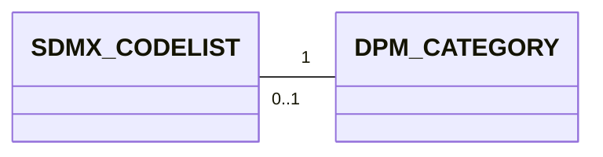
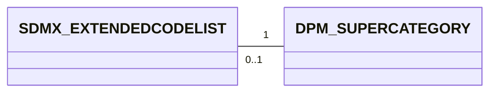
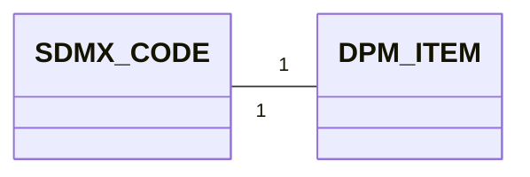
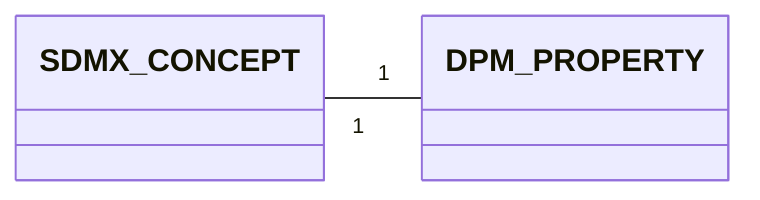

# 3. Detailed mapping rules

> **NOTE:**

> - Add coding/naming issues here for each mapping
> - Explain the constraints under which a mapping is simple (e.g., an organisation that uses only one Concept Scheme, vs many Concept Schemes), and proposed conventions if simple mapping is not possible.
> - Shall we add here something about versioning and extensibility? Or as a separate chapter?


This chapter provides the detailed rules for each of the high-level correspondences described in chapter 3.

## 3.1 Codelist ↔ Category
An SDMX CodeList is a structural component of the SDMX standard that defines a **set of coded values** that can be used as a representation for concepts or components.

A CodeList is a collection of Codes. Therefore, the SDMX representation of the CodeLists includes always its Codes.

**Example Codelist**
```xml
<Codelist id="CL_COUNTRY" agencyID="ECB" version="1.0">
  <Name xml:lang="en">Country</Name>
  <Description xml:lang="en">List of countries for ECB reporting (from SDMX CodeList CL_COUNTRY)</Description>
  <Code id="ES">
    <Name xml:lang="en">Spain</Name>
  </Code>
  <Code id="FR">
    <Name xml:lang="en">France</Name>
  </Code>
</Codelist>
```

The equivalent artefact in the DPM is the Category.

**Example Category**

| CategoryID | Code | Name | Description | IsEnumerated | IsActive | IsExternalRefData | RefDataSource | RowGUID | CreatedRelease |
| ---------- | ---- | ---- | ----------- | ------------ | -------- | ----------------- | ------------- | ------- | -------------- |
| 110        | BA   | Base items    | Defines the basic conceptual meaning... | -1| -1  | 0    |      | {0E40D86D-889C-498E-AE66-46398E615CEE} | 1     |
| 120        | MC   | Main category | Specifies the natu... | -1  | -1   | 0    |     | {6006CB2B-1EA7-494D-A09D-C33C30EB1856} | 1      |
| 130        | AP   | Approach      | Approach used for the calculation of capital requirements... | -1| -1| 0  |  | {D2F44CAE-72B1-4E06-BECA-81F2187324E0} | 1  |
| 140        | BT   | Boolean total | Dimensions having only two values... | -1  | -1 | 0  |   | {3DEB1863-B1F0-4741-95A0-44ED72734CDD} | 1              |


### 3.1.1 Mapping cardinality




- From SDMX to DPM: One Codelist is always mapped to one Category.
- From DPM to SDMX: One Category may be mapped to one CodeList or no CodeList. Concretely, non-enumerated categories are not mapped to any CodeList.This shall be considered when mapping the properties that are associated to non-enumerated Categories.


### 3.1.2 Attributes equivalence

#### 3.1.2.1 SDMX Codelist attributes
- maintainable artefact attributes (see [Identification mapping rules](../00_basics/02_detailed_mapping_rules.md#22-identification-dpm-ids-vs-sdmx-urns))
    - `id`
    - `agencyID`
    - `version`
- `is_external_reference`

#### 3.1.2.2 DPM Category attributes
- Concept attributes
    - `Owner`    
- `IsSuperCategory`
- `IsActive`
- `IsExternalRefData`
- `RefDataSource`
- `RowGUID`


#### 3.1.2.3 Mapping details

| SDMX                      | DPM                       |
|---------------------------|---------------------------|
| id                        | Code                      |
|     -not applicable-      | IsEnumerated = TRUE       |
|     -not applicable-      | IsActive = TRUE           |
|     -not applicable-      | IsExternalRefData         |
|     -not applicable-      | RefDataSource = NULL      |

> **Note**: SDMX `isExternalReference` is a **transmission flag** indicating that the artefact is sent as a stub whose full content can be resolved via `structureURL` or `serviceURL`. It has no semantic equivalent in DPM. Conversely, DPM `IsExternalRefData` is a **domain property** indicating that a Category refers to external reference data (e.g. master data, LEI registries). These are not equivalent despite the similar naming.


### 3.1.3 Example Mapping SDMX ==> DPM

```xml
<Codelist id="CL_COUNTRY" agencyID="ECB" version="1.0">
  <Name xml:lang="en">Country</Name>
  <Description xml:lang="en">List of countries for ECB reporting (from SDMX CodeList CL_COUNTRY)</Description>
  <Code id="ES">
    <Name xml:lang="en">Spain</Name>
  </Code>
  <Code id="FR">
    <Name xml:lang="en">France</Name>
  </Code>
</Codelist>
```

| CategoryID | Code | Name | Description | IsEnumerated | IsActive | IsExternalRefData | RefDataSource | RowGUID | CreatedRelease |
| ---------- | ---- | ---- | ----------- | ------------ | -------- | ----------------- | ------------- | ------- | -------------- |
| 111000001 | CL_COUNTRY | Country | List of countries for ECB reporting (from SDMX CodeList CL_COUNTRY) | -1 | -1 | 0 | | {0E40D86D-889C-498E-AE66-46398E615CEE} | 1 |


### 3.1.4 Example Mapping DPM ==> SDMX

| CategoryID | Code | Name | Description | IsEnumerated | IsActive | IsExternalRefData | RefDataSource | RowGUID | CreatedRelease |
| ---------- | ---- | ---- | ----------- | ------------ | -------- | ----------------- | ------------- | ------- | -------------- |
| 110        | BA   | Base items    | Defines the basic conceptual meaning... | -1   | -1   | 0    |   | {0E40D86D-889C-498E-AE66-46398E615CEE} | 1  |


```xml
<Codelist id="BA" agencyID="ECB" version="1.0">
  <Name xml:lang="en">Base items  </Name>
  <Description xml:lang="en">Defines the basic conceptual meaning...</Description>
</Codelist>
```
### 3.1.5 SDMX Geospatial Codelists
A Geospatial Codelist is a codelist whose codes represent geographic or spatial entities.
In SDMX, it is simply a codelist where every code corresponds to a location or a geographically‑defined object.

In the DPM metamodel, a geospatial codelist typically maps to a Category (e.g., COUNTRY, REGION)
  - Note that geospatial aspects (geometry, CRS, etc.) have no direct slot in DPM; they must be handled via:
    - naming conventions,
    - external metadata, or
    - extended attributes in implementations.


## 3.2 Extended Codelist ↔ Super Category

An **SDMX Codelist** may extend other Codelists via the CodelistExtension class.
The extension indicates the order of precedence of the extended Codelists for conflict resolution of Codes.
InclusiveCodeSelection and ExclusiveCodeSelection allow including or excluding subsets of Codes from the extended Codelists.
A MemberValue may specify a Code, including its children through the cascadeValues property, or include wildcard characters (‘%’) to select a set of Codes.

An SDMX Extended Codelist is a codelist that derives from one or more existing codelists, selectively including or excluding codes, optionally using wildcards, and resolving conflicts with prefixes and sequence order. 

**Example Extended Codelist**

The example illustrates how an Extended Codelist is created by combining and filtering codes from multiple existing codelists.

Starting from two base codelists:
- **CL_COUNTRY** (BE, FR, DE, IT, ES, PT)
- **CL_EXT_REGIONS** (EU, EU_W, EU_S)

A new codelist, **CL_EU_REPORTING**, is defined using CodelistExtension, with the following logic:
1. Inherit and filter codes: The extended codelist inherits all codes from CL_COUNTRY, but excludes ES and PT using ExclusiveCodeSelection.
2. Add selected codes from another codelist: From CL_EXT_REGIONS, only the codes matching the pattern EU_% are included (EU, EU_W, EU_S), using InclusiveCodeSelection and wildcard matching. A prefix REG_ is added to these codes to avoid conflicts (e.g., REG_EU, REG_EU_W).
3. Add new local codes: The extended codelist defines an additional local code, EU_CORE – Core EU reporting zone.

The resulting extended codelist includes:
•	BE, FR, DE, IT (ES and PT excluded)
•	REG_EU, REG_EU_W, REG_EU_S
•	EU_CORE (new)

```xml
<!-- Extended Codelist Example -->
<Codelist id="CL_EU_REPORTING" agencyID="ECB" version="1.0">

    <!-- 1. Extend CL_COUNTRY, excluding ES and PT -->
    <CodelistExtension codelistRef="CL_COUNTRY" sequence="1">
        <ExclusiveCodeSelection>
            <MemberValue value="ES"/>
            <MemberValue value="PT"/>
        </ExclusiveCodeSelection>
    </CodelistExtension>

    <!-- 2. Extend CL_EXT_REGIONS, include only codes matching EU_% -->
    <CodelistExtension codelistRef="CL_EXT_REGIONS" sequence="2" prefix="REG_">
        <InclusiveCodeSelection>
            <MemberValue value="EU_%"/>
        </InclusiveCodeSelection>
    </CodelistExtension>

    <!-- 3. Add a locally-defined code -->
    <Code id="EU_CORE">
        <Name xml:lang="en">Core EU reporting zone</Name>
    </Code>

</Codelist>
```
The equivalent artefact in the DPM is the SuperCategory.

A **DPM Super Category** is a Category marked with IsSuperCategory = TRUE, representing the union of multiple Categories listed through SuperCategoryComposition. 

**Example Super Category**

*Table Category*

| CategoryID | Code   | Name                     | Description                                                       | IsEnumerated | IsActive | IsExternalRefData | RefDataSource | RowGUID                                 | CreatedRelease |
| ---------- | ------ | ------------------------ | ----------------------------------------------------------------- | ------------ | -------- | ----------------- | ------------- | ---------------------------------------- | -------------- |
| 200        | GEO_SC | Geography SuperCategory  | Union of multiple geography-related categories.                   | -1           | -1       | 0                 |               | {A1B2C3D4-1111-2222-3333-444455556666}   | 1              |
| 210        | COUNTRY| Country Codes            | List of national codes.                                           | -1           | -1       | 0                 |               | {BBBBBBBB-AAAA-4444-9999-111111111111}   | 1              |
| 220        | REGION | Regions                  | List of administrative regions.                                   | -1           | -1       | 0                 |               | {CCCCCCCC-BBBB-5555-8888-222222222222}   | 1              |
| 230        | ECON   | Economic Areas           | Economic/geopolitical groupings.                                  | -1           | -1       | 0                 |               | {DDDDDDDD-CCCC-6666-7777-333333333333}   | 1              |

*Table SuperCategoryComposition*

| SuperCategoryID | CategoryID | StartReleaseID | EndReleaseID | RowGUID                                   |
| ---------------- |------------|----------------|--------------|-------------------------------------------- |
| 200              | 210        | 1              | NULL         | {E1000000-0000-0000-0000-000000000001}      |
| 200              | 220        | 1              | NULL         | {E2000000-0000-0000-0000-000000000002}      |
| 200              | 230        | 1              | NULL         | {E3000000-0000-0000-0000-000000000003}      |

### 3.2.1 Mapping cardinality



- From SDMX to DPM: An Extended Codelist can be mapped to a SuperCategory when it is simply the composition of multiple Codelists(mapped as Category); it may also be mapped to a SubCategory if it results from filtering the items of a single Category, or to a newly created Category when it represents the union of SubCategory and additional codes.
- From DPM to SDMX: One SuperCategory can be expressed as an Extended Codelist (grouping codes from a base codelist) 

### 3.2.2 Attributes equivalence

#### 3.2.2.1 SDMX Extended Codelist attributes
- maintainable artefact attributes (see [Identification mapping rules](../00_basics/02_detailed_mapping_rules.md#22-identification-dpm-ids-vs-sdmx-urns))
  Codelist attributes plus:
    - `idcodelistRef`
    - `sequence`
    - `prefix`
    - `inclusiveCodeSelectionList`
    - `exclusiveCodeSelectionList`
    - `idCode`

#### 3.2.2.2 SuperCategory attributes
  Category attributes plus:
    - `categoryId`

#### 3.2.2.3 Mapping details

| SDMX                      | DPM                       |
|---------------------------|---------------------------|
| idcodelistRef             | categoryId                |
| sequence                  | -not applicable-          |
| prefix                    | -not applicable-          |
| inclusiveCodeSelectionList| -not applicable-          |
| exclusiveCodeSelectionList| -not applicable-          |
| idCode                    | -not applicable-          |

### 3.2.3 Example Mapping SDMX ==> DPM

```xml
<!-- Extended Codelist Example -->
<Codelist id="CL_EU_REPORTING" agencyID="ECB" version="1.0">

    <!-- 1. Extend CL_COUNTRY, excluding ES and PT -->
    <CodelistExtension codelistRef="CL_COUNTRY" sequence="1">
        <ExclusiveCodeSelection>
            <MemberValue value="ES"/>
            <MemberValue value="PT"/>
        </ExclusiveCodeSelection>
    </CodelistExtension>

    <!-- 2. Extend CL_EXT_REGIONS, include only codes matching EU_% -->
    <CodelistExtension codelistRef="CL_EXT_REGIONS" sequence="2" prefix="REG_">
        <InclusiveCodeSelection>
            <MemberValue value="EU_%"/>
        </InclusiveCodeSelection>
    </CodelistExtension>

    <!-- 3. Add a locally-defined code -->
    <Code id="EU_CORE">
        <Name xml:lang="en">Core EU reporting zone</Name>
    </Code>

</Codelist>
```

*Definition of Categories*

| CategoryID | Code   | Name                     | Description                                                       | IsEnumerated | IsActive | IsExternalRefData | RefDataSource | RowGUID                                 | CreatedRelease |
| ---------- | ------ | ------------------------ | ----------------------------------------------------------------- | ------------ | -------- | ----------------- | ------------- | ---------------------------------------- | -------------- |
| 200        | CL_EU_UNION | SuperCategory  | Union of multiple geography-related categories.                   | -1           | -1       | 0                 |               | {A1B2C3D4-1111-2222-3333-444455556666}   | 1              |
| 210        | CL_COUNTRY| Country Codes            | List of national codes.                                           | -1           | -1       | 0                 |               | {BBBBBBBB-AAAA-4444-9999-111111111111}   | 1              |
| 220        | CL_EXT_REGIONS | Regions                  | List of administrative regions.                                   | -1           | -1       | 0                 |               | {CCCCCCCC-BBBB-5555-8888-222222222222}   | 1              |
| 230        | EU_CORE   | EU_CORE Codes           | List of codes.                                  | -1           | -1       | 0                 |               | {DDDDDDDD-CCCC-6666-7777-333333333333}   | 1              |

*Definition of SuperCategory*

| SuperCategoryID | CategoryID | StartReleaseID | EndReleaseID | RowGUID                                   |
| ---------------- |------------|----------------|--------------|-------------------------------------------- |
| 200              | 210        | 1              | NULL         | {E1000000-0000-0000-0000-000000000001}      |
| 200              | 220        | 1              | NULL         | {E2000000-0000-0000-0000-000000000002}      |
| 200              | 230        | 1              | NULL         | {E3000000-0000-0000-0000-000000000003}      |

*Definition of SubCategory*

| SubCategoryID | CategoryID | Code | Name                                         | Description                                                             | RowGUID                                   |
|---------------|------------|------|----------------------------------------------|-------------------------------------------------------------------------|--------------------------------------------|
| 20010         | 200        | CL_EU_REPORTING  | Reporting Countries     | Reporting Countries  | {5F6F7F44-FB94-4EC1-95F3-711DD9FA8F1B}     |

*Definition of SubCategory Composition*

| ItemID | SubCategoryVID | Order | Label | ParentItemID | ComparisonOperatorID | ArithmeticOperatorID | RowGUID                                   |
|--------|-----------------|-------|-------|---------------|------------------------|------------------------|--------------------------------------------|
| 1000   | 20010             | 1    |       |           |                        |                       | {76FD1DFC-DA28-4AB2-ABE5-EA5B1191450A}     |
| 1006   | 20010              | 2    |       |           |                        |                       | {C4DC92DB-ED65-4FDB-8B1C-D70644D4C15E}     |
| 1007   | 20010              | 3    |       |           |                        |                       | {C1099C3F-1FBC-4F79-9DB0-891CFC664FAD}     |
| 1008   | 20010              | 4    |       |           |                        |                       | {C3AAC52B-9054-4C03-8A31-BD41A055338F}     |
| 1009   | 20010           | 5     |       |               |                        |                        | {B4CA88A9-A1C9-494E-A42C-80BCE3F0BF32}     |

### 3.2.4 Example Mapping DPM ==> SDMX

*Table Category*

| CategoryID | Code   | Name                     | Description                                                       | IsEnumerated | IsActive | IsExternalRefData | RefDataSource | RowGUID                                 | CreatedRelease |
| ---------- | ------ | ------------------------ | ----------------------------------------------------------------- | ------------ | -------- | ----------------- | ------------- | ---------------------------------------- | -------------- |
| 200        | GEO_SC | Geography SuperCategory  | Union of multiple geography-related categories.                   | -1           | -1       | 0                 |               | {A1B2C3D4-1111-2222-3333-444455556666}   | 1              |
| 210        | COUNTRY| Country Codes            | List of national codes.                                           | -1           | -1       | 0                 |               | {BBBBBBBB-AAAA-4444-9999-111111111111}   | 1              |
| 220        | REGION | Regions                  | List of administrative regions.                                   | -1           | -1       | 0                 |               | {CCCCCCCC-BBBB-5555-8888-222222222222}   | 1              |
| 230        | ECON   | Economic Areas           | Economic/geopolitical groupings.                                  | -1           | -1       | 0                 |               | {DDDDDDDD-CCCC-6666-7777-333333333333}   | 1              |

*Table SuperCategoryComposition*

| SuperCategoryID | CategoryID | StartReleaseID | EndReleaseID | RowGUID                                   |
| ---------------- |------------|----------------|--------------|-------------------------------------------- |
| 200              | 210        | 1              | NULL         | {E1000000-0000-0000-0000-000000000001}      |
| 200              | 220        | 1              | NULL         | {E2000000-0000-0000-0000-000000000002}      |
| 200              | 230        | 1              | NULL         | {E3000000-0000-0000-0000-000000000003}      |

```xml
<!-- Extended Codelist Example -->
<Codelist id="GEO_SC" agencyID="ECB" version="1.0">

    <!-- 1. Extend COUNTRY -->
    <CodelistExtension codelistRef="COUNTRY" sequence="1">
    </CodelistExtension>

    <!-- 2. Extend REGION -->
    <CodelistExtension codelistRef="REGION" sequence="2" prefix="REG_">
    </CodelistExtension>

    <!-- 3. Extend ECON -->
   <CodelistExtension codelistRef="ECON" sequence="3" prefix="ECON_">
   </CodelistExtension>

</Codelist>
```

## 3.3 Code ↔ Category Item

An **SDMX Code** is the atomic element of a Codelist. Codes may participate in hierarchical structures as defined by the SDMX Item Scheme pattern. They inherit their identification and naming attributes from the SDMX artefact hierarchy (IdentifiableArtefact → NameableArtefact) .

The equivalent artefact in the DPM is the **Category Item**.  
A DPM Item represents one enumerated value of a Category. Items may take part in parent–child relationships.

**Example Code**

```xml
<Code id="ES">
  <Name xml:lang="en">Spain</Name>
</Code>
```

**Example Item**

| ItemID | CategoryID | Code | Name  | Description             | RowGUID                                   |
|--------|------------|------|--------|-------------------------|--------------------------------------------|
| 5001   | 210        | ES   | Spain  | Member state of the EU | {AABBCCDD-1111-2222-3333-444455556666}     |

### 3.3.1 Mapping cardinality

From SDMX to DPM: One SDMX Code is always mapped to one DPM Item belonging to the mapped Category.
From DPM to SDMX: One DPM Item is always mapped to an SDMX Code if its Category is mapped to a Codelist. 

### 3.3.2 Attributes equivalence

#### 3.3.2.1 Code attributes
-
    - `id`
    - `name`
    - `description`
    - `hierarchy`

#### 3.3.2.2 Item attributes
-
    - `Code`
    - `Name`
    - `Description`
    - `CategoryID`
    - `RowGUID`
    - `ParentItemID`  

#### 3.3.2.3 Mapping details

| SDMX        | DPM          |
|-------------|--------------|
| id          | Code         |
| name        | Name         |
| description | Description  |
| -not applicable-          | CategoryID   |
| -not applicable-         | RowGUID      |
| hierarchy   | ParentItemID |

### 3.3.3 Example Mapping SDMX ==> DPM
```xml
<Code id="ES">
  <Name xml:lang="en">Spain</Name>
</Code>
```

| ItemID | CategoryID | Code | Name  | Description             | RowGUID                                   |
|--------|------------|------|--------|-------------------------|--------------------------------------------|
| 5001   | 210        | ES   | Spain  | Member state of the EU | {AABBCCDD-1111-2222-3333-444455556666}     |

### 3.3.4 Example Mapping DPM ==> SDMX

| ItemID | CategoryID | Code | Name  | Description             | RowGUID                                   |
|--------|------------|------|--------|-------------------------|--------------------------------------------|
| 5001   | 210        | ES   | Spain  | Member state of the 

```xml
<Code id="ES">
  <Name xml:lang="en">Spain</Name>
</Code>
```
### 3.3.5 Compound Item

- **DPM Compound Category Item** encodes a composition of multiple items across categories (e.g. the “Treasury bill” example in the report).

- **DPM → SDMX**:
  - Map Compound Category Item → **Code**:
    - one Code in SDMX represents the compound item;
    - the internal structure (links to other Category Items) is not represented in core SDMX.
  - This mapping is lossy: composition information is lost unless captured via annotations or external documentation.

- **SDMX → DPM** (creating compound items):
  - If a particular Code is known (from business rules or external documentation) to represent a combination of other dimensions/categories, it can be modelled as a Compound Item in DPM with explicit links to its constituent Property–Item pairs — even though SDMX does not encode that composition explicitly. This is a design choice on the DPM side; SDMX does not force it.
  - *Example*: an SDMX codelist `CL_INSTRUMENT` contains a flat Code `TBILL` ("Treasury bill") with no internal structure:
    ```xml
    <Codelist id="CL_INSTRUMENT" agencyID="ECB" version="1.0">
      <Code id="TBILL">
        <Name xml:lang="en">Treasury bill</Name>
      </Code>
    </Codelist>
    ```
    In DPM, business knowledge tells us that "Treasury bill" is actually a combination of three characteristics. We model it as a Compound Item in an "Instrument" Category, referencing a Context with the following ContextCompositions:
    - Type of financial instrument (Property) = "Debt security" (Item),
    - Sector of the issuer (Property) = "General governments" (Item),
    - Original maturity (Property) = "Up to 18 months" (Item).

    The flat SDMX Code `TBILL` becomes a single DPM Item that is decomposable into its underlying Property–Item pairs for analysis, validation, and reuse across tables.

## 3.4 Subsets and hierarchies

### 3.4.1 Subsets (constraints and codelist extensions)

SDMX provides two main mechanisms for defining subsets of codes:

- **Constraints**: use ContentConstraint to restrict allowable values for a Dataflow or ProvisionAgreement. Define a CubeRegion with MemberSelection entries to include/exclude codes. Supports `cascadeValues` and the `%` wildcard.
- **Codelist extensions**: use CodelistExtension with InclusiveCodeSelection or ExclusiveCodeSelection to create a derived codelist that includes only a subset of codes from a base codelist (see section 1.1 for details).

Note: partial codelists (`isPartial = true`) are excluded here — as discussed in section 1.1, they are strictly a dissemination mechanism and do not create independent subsets.

### 3.4.2 Mapping details
Constraint / Codelist Extension → DPM SubCategory

The subset of codes is modelled as a SubCategory of that Category. Each SubCategory groups Items from the corresponding Category and can be versioned via SubCategoryVersion (linked to a Release), allowing tracking of changes over time (e.g. adding/removing codes).

#### DPM SubCategory Example

#### SubCategory: EU_COUNTRIES
| Attribute           | Value |
|---------------------|-------|
| SubCategoryID       | 7001 |
| Code                | EU_COUNTRIES |
| Name                | European Union Countries |
| Description         | Subset of EU member states within CL_COUNTRY |
| RowGUID             | (system-generated UUID) |

#### SubCategoryVersion
| Attribute           | Value |
|---------------------|-------|
| SubCategoryVID      | 7101 |
| SubCategoryID       | 7001 |
| StartReleaseID      | 3001 |
| EndReleaseID        | NULL |

#### SubCategoryItems (Members of EU_COUNTRIES)
| Attribute           | Value |
|---------------------|-------|
| SubCategoryVID      | 7101 |
| ItemID              | 5001 |
| Label               | France |
| ParentItemID        | NULL |
| RowGUID             | (system-generated UUID) |

| Attribute           | Value |
|---------------------|-------|
| SubCategoryVID      | 7101 |
| ItemID              | 5002 |
| Label               | Germany |
| ParentItemID        | NULL |
| RowGUID             | (system-generated UUID) |

| Attribute           | Value |
|---------------------|-------|
| SubCategoryVID      | 7101 |
| ItemID              | 5003 |
| Label               | Italy |
| ParentItemID        | NULL |
| RowGUID             | (system-generated UUID) |


### 3.4.3 Hierarchies

- **Hierarchy over a single codelist**:
  - When an SDMX Hierarchy only includes codes from one codelist:
    - map the codelist to a Category,
    - represent the hierarchy using a Subcategory that carries parent–child relationships between Category Items.

- **Hierarchy over multiple codelists**:
  - DPM Subcategories must draw items from a single Category; they cannot directly represent a hierarchy that mixes items from multiple categories.
  - In such cases:
    - the mapping to DPM is not direct and is generally considered **out of scope** for strict interoperability;
    - the hierarchy should be handled via:
      - separate hierarchies per Category, and/or
      - external documentation.


## 3.5 Concept ↔ Property

An SDMX **Concept** is a semantic definition of a business characteristic. Concepts are the building blocks of structural artefacts: each dimension, attribute, or measure in a Data Structure Definition references a Concept that defines its meaning. A Concept may carry a **core representation** — either enumerated (referencing a Codelist) or non-enumerated (specifying a data type with optional Facet constraints).

**Example Concept** (from the BIS SDMX repository — `BIS:STANDALONE_CONCEPT_SCHEME(1.0)`)
```xml
<Concept id="REF_AREA">
  <Name xml:lang="en">Reference area</Name>
</Concept>
```

In SDMX, the representation of a Concept can be defined at two levels: as a **CoreRepresentation** on the Concept itself, or as a **LocalRepresentation** on the DSD component that references it. In the BIS, representations are defined at the component level — the Dimension in the DSD provides the Codelist reference:

```xml
<!-- From DSD BIS:BIS_XR(1.0) -->
<Dimension id="REF_AREA" position="2">
  <ConceptIdentity>
    urn:sdmx:org.sdmx.infomodel.conceptscheme.Concept=BIS:STANDALONE_CONCEPT_SCHEME(1.0).REF_AREA
  </ConceptIdentity>
  <LocalRepresentation>
    <Enumeration>
      urn:sdmx:org.sdmx.infomodel.codelist.Codelist=BIS:CL_BIS_IF_REF_AREA(1.0)
    </Enumeration>
  </LocalRepresentation>
</Dimension>
```

The equivalent artefact in the DPM is the **Property**.

A DPM Property defines a semantic characteristic that is later used to build variables. It refers to one or more Categories (via PropertyCategory) and carries a DataType. A Property with `IsMetric = TRUE` is informally called a **Metric** and indicates the Property is quantitative (e.g. amounts, ratios, counts); `IsMetric = FALSE` indicates a qualitative Property. The `IsMetric` flag says nothing about the component role — a qualitative Property can be used as a measure and a quantitative Property can appear as a dimension or attribute.

In the DPM, a Property does not directly carry a `Code` attribute. Instead, each Property has a counterpart **Item** (with `IsProperty = TRUE`) that belongs to a dedicated Category (typically coded `_PR` — "Properties"). The Property receives its code, name, description, and owner from that Item through the **ItemCategory** association — just like any other Item (see section [1.2](01_glossary_overview.md#12-dpm-glossary-artefacts)).

**Example Property** (from the EBA DPM)

**Item**

| ItemID | Name | Description | IsProperty | IsActive |
| ------ | ---- | ----------- | ---------- | -------- |
| 1012400535 | Residence of counterparty | Defines the geographical area where the counterparty of the contract or transaction resides. | TRUE | TRUE |

**ItemCategory**

| ItemID | Code | CategoryID | Signature | IsDefaultItem | StartRelease | EndRelease |
| ------ | ---- | ---------- | --------- | ------------- | ------------ | ---------- |
| 1012400535 | `RCP` | 1002 – `_PR` (Properties) | `eba:RCP` | FALSE | 3.4 | – |

**Property**

| PropertyID | IsMetric | DataTypeID | IsComposite | PeriodType | ValueLength |
| ---------- | -------- | ---------- | ----------- | ---------- | ----------- |
| 1012400535 | FALSE | 8 – Enumeration | FALSE | stock | – |

**PropertyCategory**

| PropertyID | CategoryID | StartRelease | EndRelease |
| ---------- | ---------- | ------------ | ---------- |
| 1012400535 | 250 – `GA` (Geographical area) | 3.4 | – |

### 3.5.1 Mapping cardinality



- From SDMX to DPM: One Concept is always mapped to one Property. The `IsMetric` flag is set based on whether the Concept is quantitative (`TRUE`) or qualitative (`FALSE`), independent of its role (dimension, attribute or measure) in any particular DSD.
- From DPM to SDMX: One Property is always mapped to one Concept. Whether the resulting Concept is used as a dimension, attribute, or measure in a DSD depends on how the Property is used in Variables (see chapter on Variables mapping), not on the `IsMetric` flag.


### 3.5.2 Attributes equivalence

#### 3.5.2.1 SDMX Concept attributes
- IdentifiableArtefact attributes
    - `id`
    - `name`
    - `description`
- `coreRepresentation`

#### 3.5.2.2 DPM Property attributes
- `Code` (via counterpart Item in the `_PR` Category)
- `Name` (via counterpart Item)
- `Description` (via counterpart Item)
- `IsMetric`
- `DataType`
- `Owner`

#### 3.5.2.3 Mapping details

| SDMX                                    | DPM                                      |
|-----------------------------------------|------------------------------------------|
| id                                      | Code                                     |
| name                                    | Name                                     |
| description                             | Description                              |
| coreRepresentation (enumerated)         | DataType = Enumeration + PropertyCategory → Category |
| coreRepresentation (non-enumerated)     | DataType (Integer, Decimal, Date, etc.)  |
| -not applicable-                        | IsMetric (qualitative / quantitative)    |
| -not applicable-                        | Owner                                    |

> **Note**: The component role (dimension, attribute, or measure) is not encoded in the Property itself. In SDMX, the role is determined by the Component in a DSD; in DPM, it is determined by the type of Variable (KeyVariable, AttributeVariable, FactVariable) that references the Property. The `IsMetric` flag only indicates whether a Property is quantitative or qualitative and does not determine its role.


### 3.5.3 Example Mapping SDMX ==> DPM

The SDMX side uses real Concepts from the BIS repository (`BIS:STANDALONE_CONCEPT_SCHEME(1.0)`) and their representations from the Exchange Rates DSD (`BIS:BIS_XR(1.0)`). The DPM side uses real Properties from the EBA DPM database, showing how data is distributed across the Item, ItemCategory, Property, and PropertyCategory tables.

#### Qualitative Concept with enumerated representation

**SDMX Concept** — `REF_AREA` (Reference area), used as a dimension in the Exchange Rates DSD with an enumerated local representation referencing Codelist `BIS:CL_BIS_IF_REF_AREA(1.0)`:

```xml
<!-- Concept definition (from ConceptScheme) -->
<Concept id="REF_AREA">
  <Name xml:lang="en">Reference area</Name>
</Concept>

<!-- Component definition (from DSD BIS:BIS_XR) -->
<Dimension id="REF_AREA" position="2">
  <ConceptIdentity>
    urn:sdmx:org.sdmx.infomodel.conceptscheme.Concept=BIS:STANDALONE_CONCEPT_SCHEME(1.0).REF_AREA
  </ConceptIdentity>
  <LocalRepresentation>
    <Enumeration>
      urn:sdmx:org.sdmx.infomodel.codelist.Codelist=BIS:CL_BIS_IF_REF_AREA(1.0)
    </Enumeration>
  </LocalRepresentation>
</Dimension>
```

**Item** *(generated)*

| ItemID | Name | Description | IsProperty | IsActive |
| ------ | ---- | ----------- | ---------- | -------- |
| *(gen)* | Reference area | – | TRUE | TRUE |

**ItemCategory** *(generated)*

| ItemID | Code | CategoryID | Signature | IsDefaultItem | StartRelease | EndRelease |
| ------ | ---- | ---------- | --------- | ------------- | ------------ | ---------- |
| *(gen)* | `REF_AREA` | `_PR` (Properties) | `REF_AREA` | FALSE | *(current)* | – |

**Property** *(generated)*

| PropertyID | IsMetric | DataTypeID | IsComposite | PeriodType | ValueLength |
| ---------- | -------- | ---------- | ----------- | ---------- | ----------- |
| *(gen)* | FALSE | Enumeration | FALSE | – | – |

**PropertyCategory** *(generated)*

| PropertyID | CategoryID | StartRelease | EndRelease |
| ---------- | ---------- | ------------ | ---------- |
| *(gen)* | Category mapped from `CL_BIS_IF_REF_AREA` | *(current)* | – |

The Concept `id` becomes the ItemCategory `Code` within the `_PR` Category. The Concept `Name` becomes the Item `Name`. The enumerated representation (Codelist `CL_BIS_IF_REF_AREA`) maps to a PropertyCategory association pointing to the Category mapped from that Codelist (see section 3.1), and the DataType is set to `Enumeration`.

#### Qualitative Concept with non-enumerated representation

**SDMX Concept** — `TITLE` (Title), used as an attribute in the Exchange Rates DSD with a non-enumerated local representation (String, max 255 characters):

```xml
<!-- Concept definition (from ConceptScheme) -->
<Concept id="TITLE">
  <Name xml:lang="en">Title</Name>
</Concept>

<!-- Component definition (from DSD BIS:BIS_XR) -->
<Attribute id="TITLE" usage="optional">
  <ConceptIdentity>
    urn:sdmx:org.sdmx.infomodel.conceptscheme.Concept=BIS:STANDALONE_CONCEPT_SCHEME(1.0).TITLE
  </ConceptIdentity>
  <LocalRepresentation>
    <TextFormat textType="String" maxLength="255"/>
  </LocalRepresentation>
</Attribute>
```

**Item** *(generated)*

| ItemID | Name | Description | IsProperty | IsActive |
| ------ | ---- | ----------- | ---------- | -------- |
| *(gen)* | Title | – | TRUE | TRUE |

**ItemCategory** *(generated)*

| ItemID | Code | CategoryID | Signature | IsDefaultItem | StartRelease | EndRelease |
| ------ | ---- | ---------- | --------- | ------------- | ------------ | ---------- |
| *(gen)* | `TITLE` | `_PR` (Properties) | `TITLE` | FALSE | *(current)* | – |

**Property** *(generated)*

| PropertyID | IsMetric | DataTypeID | IsComposite | PeriodType | ValueLength |
| ---------- | -------- | ---------- | ----------- | ---------- | ----------- |
| *(gen)* | FALSE | String | FALSE | – | 255 |

**PropertyCategory** *(generated)*

| PropertyID | CategoryID | StartRelease | EndRelease |
| ---------- | ---------- | ------------ | ---------- |
| *(gen)* | `_NA` (Not applicable) | *(current)* | – |

When the Concept has a non-enumerated representation (free-form text), the DPM DataType is set to the corresponding type (`String`) and the PropertyCategory points to the `_NA` Category, which in the DPM indicates that no specific enumerated domain applies. The `maxLength` Facet from the SDMX representation can be preserved in the `ValueLength` field.

#### Quantitative Concept (measure)

**SDMX Concept** — `OBS_VALUE` (Observation Value), used as the measure in the Exchange Rates DSD:

```xml
<!-- Concept definition (from ConceptScheme) -->
<Concept id="OBS_VALUE">
  <Name xml:lang="en">Observation Value</Name>
</Concept>

<!-- Component definition (from DSD BIS:BIS_XR) -->
<Measure id="OBS_VALUE" usage="optional">
  <ConceptIdentity>
    urn:sdmx:org.sdmx.infomodel.conceptscheme.Concept=BIS:STANDALONE_CONCEPT_SCHEME(1.0).OBS_VALUE
  </ConceptIdentity>
</Measure>
```

**Item** *(generated)*

| ItemID | Name | Description | IsProperty | IsActive |
| ------ | ---- | ----------- | ---------- | -------- |
| *(gen)* | Observation Value | – | TRUE | TRUE |

**ItemCategory** *(generated)*

| ItemID | Code | CategoryID | Signature | IsDefaultItem | StartRelease | EndRelease |
| ------ | ---- | ---------- | --------- | ------------- | ------------ | ---------- |
| *(gen)* | `OBS_VALUE` | `_PR` (Properties) | `OBS_VALUE` | FALSE | *(current)* | – |

**Property** *(generated)*

| PropertyID | IsMetric | DataTypeID | IsComposite | PeriodType | ValueLength |
| ---------- | -------- | ---------- | ----------- | ---------- | ----------- |
| *(gen)* | TRUE | Decimal | FALSE | – | – |

**PropertyCategory** *(generated)*

| PropertyID | CategoryID | StartRelease | EndRelease |
| ---------- | ---------- | ------------ | ---------- |
| *(gen)* | `_NA` (Not applicable) | *(current)* | – |

The BIS `OBS_VALUE` Concept has no explicit representation, but it is used as the primary measure for exchange rate observations (numeric values). The resulting Property receives `IsMetric = TRUE` because it represents a quantitative measurement, and the DataType is set to `Decimal`. Like all non-enumerated Properties, the PropertyCategory points to `_NA`.


### 3.5.4 Example Mapping DPM ==> SDMX

#### Qualitative Property (enumerated)

**Item**

| ItemID | Name | Description | IsProperty | IsActive |
| ------ | ---- | ----------- | ---------- | -------- |
| 1012400535 | Residence of counterparty | Defines the geographical area where the counterparty of the contract or transaction resides. | TRUE | TRUE |

**ItemCategory**

| ItemID | Code | CategoryID | Signature | IsDefaultItem | StartRelease | EndRelease |
| ------ | ---- | ---------- | --------- | ------------- | ------------ | ---------- |
| 1012400535 | `RCP` | 1002 – `_PR` (Properties) | `eba:RCP` | FALSE | 3.4 | – |

**Property**

| PropertyID | IsMetric | DataTypeID | IsComposite | PeriodType | ValueLength |
| ---------- | -------- | ---------- | ----------- | ---------- | ----------- |
| 1012400535 | FALSE | 8 – Enumeration | FALSE | stock | – |

**PropertyCategory**

| PropertyID | CategoryID | StartRelease | EndRelease |
| ---------- | ---------- | ------------ | ---------- |
| 1012400535 | 250 – `GA` (Geographical area) | 3.4 | – |

```xml
<Concept id="RCP">
  <Name xml:lang="en">Residence of counterparty</Name>
  <Description xml:lang="en">Defines the geographical area where the
    counterparty of the contract or transaction resides.</Description>
  <CoreRepresentation>
    <Enumeration>
      <Ref id="CL_GA" class="Codelist" agencyID="EBA" version="1.0"/>
    </Enumeration>
  </CoreRepresentation>
</Concept>
```

The ItemCategory `Code` becomes the Concept `id`. The `CoreRepresentation` references the Codelist mapped from the `GA` Category associated with the Property (see section 3.1).

#### Qualitative Property (typed)

**Item**

| ItemID | Name | Description | IsProperty | IsActive |
| ------ | ---- | ----------- | ---------- | -------- |
| 6454 | Identifier of the security | – | TRUE | TRUE |

**ItemCategory**

| ItemID | Code | CategoryID | Signature | IsDefaultItem | StartRelease | EndRelease |
| ------ | ---- | ---------- | --------- | ------------- | ------------ | ---------- |
| 6454 | `si615` | 1002 – `_PR` (Properties) | `si615` | FALSE | 3.4 | – |

**Property**

| PropertyID | IsMetric | DataTypeID | IsComposite | PeriodType | ValueLength |
| ---------- | -------- | ---------- | ----------- | ---------- | ----------- |
| 6454 | FALSE | 3 – String | FALSE | stock | – |

**PropertyCategory**

| PropertyID | CategoryID | StartRelease | EndRelease |
| ---------- | ---------- | ------------ | ---------- |
| 6454 | 1003 – `_NA` (Not applicable) | 3.4 | – |

```xml
<Concept id="si615">
  <Name xml:lang="en">Identifier of the security</Name>
  <CoreRepresentation>
    <TextFormat textType="String"/>
  </CoreRepresentation>
</Concept>
```

When the Property has a non-enumeration DataType and its PropertyCategory points to `_NA`, the SDMX Concept receives a non-enumerated `CoreRepresentation` with the corresponding `textType`.

#### Metric (quantitative Property)

**Item**

| ItemID | Name | Description | IsProperty | IsActive |
| ------ | ---- | ----------- | ---------- | -------- |
| 1268 | Fair value | – | TRUE | TRUE |

**ItemCategory**

| ItemID | Code | CategoryID | Signature | IsDefaultItem | StartRelease | EndRelease |
| ------ | ---- | ---------- | --------- | ------------- | ------------ | ---------- |
| 1268 | `mi129` | 1002 – `_PR` (Properties) | `mi129` | FALSE | 3.4 | – |

**Property**

| PropertyID | IsMetric | DataTypeID | IsComposite | PeriodType | ValueLength |
| ---------- | -------- | ---------- | ----------- | ---------- | ----------- |
| 1268 | TRUE | 9 – Monetary | FALSE | stock | – |

**PropertyCategory**

| PropertyID | CategoryID | StartRelease | EndRelease |
| ---------- | ---------- | ------------ | ---------- |
| 1268 | 1003 – `_NA` (Not applicable) | 3.4 | – |

```xml
<Concept id="mi129">
  <Name xml:lang="en">Fair value</Name>
  <CoreRepresentation>
    <TextFormat textType="Decimal"/>
  </CoreRepresentation>
</Concept>
```

The DPM `Monetary` DataType maps to the SDMX `Decimal` text type. The `IsMetric = TRUE` flag does not affect the Concept itself — it only indicates the Property is quantitative. The component role (measure, dimension, or attribute) is determined by Variable usage, not by `IsMetric`.


### 3.5.5 ConceptScheme handling

In SDMX, Concepts are always contained in a **ConceptScheme**. DPM has no equivalent container: Properties live in a single cross-domain glossary and are organised by ownership and releases.

#### SDMX → DPM

**Single ConceptScheme per organisation (common case)**

Most SDMX organisations maintain a single ConceptScheme (or a small number of closely related schemes). When this is the case, the ConceptScheme can simply be ignored during the mapping — each Concept maps directly to a Property using its `id` as the Property `Code`, with no risk of identifier collisions.

**Multiple ConceptSchemes per organisation**

When an organisation uses multiple ConceptSchemes whose Concepts may share the same `id` (e.g. two Concepts with `id="COUNTRY"` in different schemes but with different meanings), the ConceptScheme `id` should be used as a namespace prefix to avoid collisions in the DPM glossary:

```
{ConceptSchemeId}.{ConceptId}
```

*Example*: Concept `FREQ` in ConceptScheme `CS_MACRO` becomes Property Code `CS_MACRO.FREQ`.

This convention ensures uniqueness while keeping the Property Code readable and traceable back to its SDMX origin.

#### DPM → SDMX

When mapping DPM Properties to SDMX, one ConceptScheme is created per Owner with conventional attributes:

- `id`: a conventional identifier based on the Owner's code (e.g. `CS_ECB`)
- `agencyID`: the Owner mapped to an SDMX Agency (see [Identification mapping rules](../00_basics/02_detailed_mapping_rules.md#22-identification-dpm-ids-vs-sdmx-urns))
- `version`: aligned with the Release version

All Properties belonging to that Owner are placed in the ConceptScheme as Concepts.

### 3.5.6 Representation mapping (Core vs Local)

In SDMX, the representation of a Concept can be defined at two levels:

- **CoreRepresentation**: defined on the Concept itself, expressing the default or broadest value domain.
- **LocalRepresentation**: defined on each DSD component (Dimension, Attribute, Measure) that references the Concept, potentially overriding or narrowing the core representation for a specific structural context.

A single Concept may therefore participate in multiple DSDs with different local representations. For example, the BIS Concept `REF_AREA` (Reference area) has no CoreRepresentation but is used with different Codelists across DSDs:

| DSD | Component | Codelist |
| --- | --------- | -------- |
| `BIS:BIS_XR` (Exchange rates) | Dimension | `CL_BIS_IF_REF_AREA` |
| `BIS:BIS_EER` (Effective exchange rates) | Dimension | `CL_AREA` |
| `BIS:BIS_CBS` (Consolidated banking statistics) | Dimension (`L_REP_CTY`) | `CL_BIS_IF_REF_AREA` |

In the DPM, this split does not exist. Every Property has exactly **one** representation: a DataType and a PropertyCategory pointing to a single Category. Narrower value domains for specific tables or variables are expressed through **SubCategories** (see section 3.3), not through alternative Property definitions.

#### SDMX → DPM

When mapping a Concept that is used across multiple DSDs with different representations, the Property must receive the **broadest representation** — the superset that covers all DSD-level usages.

**Enumerated representations**

1. **Same Codelist everywhere** (common case): The Concept's CoreRepresentation and all LocalRepresentations reference the same Codelist. The Property simply references the corresponding Category (mapped from that Codelist; see section 3.1).

2. **Different Codelists across DSDs**: The Concept is used with different Codelists in different DSDs (as in the `REF_AREA` example above). Two approaches are possible depending on the relationship between the Codelists:

    - If one Codelist is a subset of another (e.g. `CL_AREA` ⊂ `CL_BIS_IF_REF_AREA`), the Property references the Category mapped from the **broader** Codelist. The narrower usages become SubCategories.
    - If the Codelists overlap or are disjoint, the Property references a **SuperCategory** that unions the Categories mapped from all involved Codelists (see section 3.4).

    In both cases, each DSD-level restriction is captured as a SubCategory associated to the Category or SuperCategory, preserving the narrower scope for specific tables or variables.

**Non-enumerated representations**

When a Concept uses non-enumerated representations (e.g. `String`, `Decimal`) that differ in their Facet constraints across DSDs (different `maxLength`, `minValue`, etc.), the Property receives the **least restrictive** DataType. Since DPM DataTypes do not carry Facet-level constraints (see section [1.2](01_glossary_overview.md#12-dpm-glossary-artefacts)), the mapping simply selects the appropriate DPM DataType and any Facet details are documented but not enforced at the Property level.

#### DPM → SDMX

The reverse mapping is straightforward:

- The Property's DataType and PropertyCategory produce the **CoreRepresentation** on the generated Concept (enumerated → Codelist reference; non-enumerated → TextFormat).
- When a Variable or Table constrains the Property's values through a **SubCategory**, the corresponding DSD component can be given a **LocalRepresentation** that references the Codelist mapped from that SubCategory (see section 3.3), narrowing the core representation for that specific structural context.

```xml
<ConceptScheme id="CS_EBA" agencyID="EBA" version="4.2">
  <Name xml:lang="en">EBA Concepts</Name>
  <Concept id="RCP">
    <Name xml:lang="en">Residence of counterparty</Name>
    <Description xml:lang="en">Defines the geographical area where the
      counterparty of the contract or transaction resides.</Description>
    <CoreRepresentation>
      <Enumeration>
        <Ref id="CL_GA" class="Codelist" agencyID="EBA" version="4.2"/>
      </Enumeration>
    </CoreRepresentation>
  </Concept>
  <Concept id="si615">
    <Name xml:lang="en">Identifier of the security</Name>
    <CoreRepresentation>
      <TextFormat textType="String"/>
    </CoreRepresentation>
  </Concept>
  <Concept id="mi129">
    <Name xml:lang="en">Fair value</Name>
    <CoreRepresentation>
      <TextFormat textType="Decimal"/>
    </CoreRepresentation>
  </Concept>
</ConceptScheme>
```


