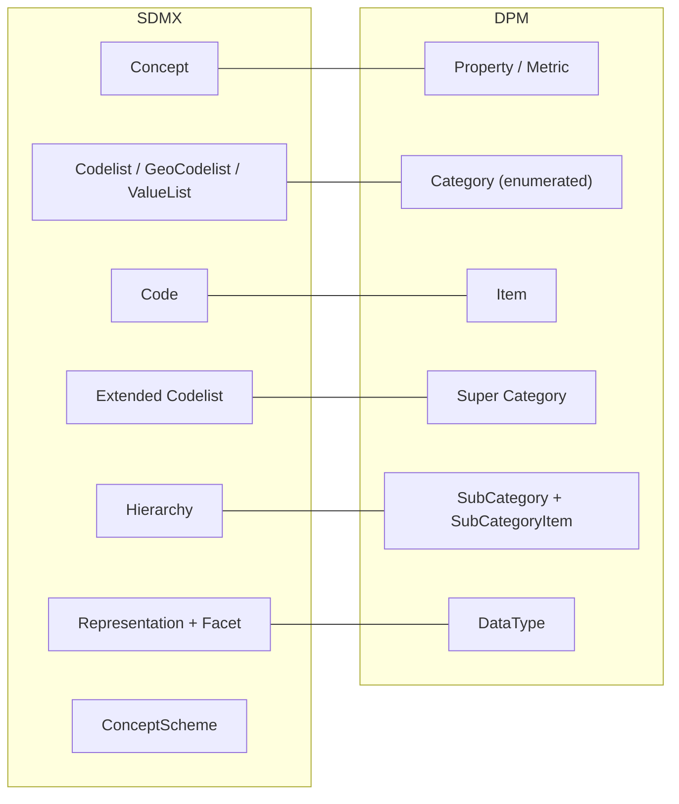

# 3. High-level mapping summary

This chapter gives a compact view of how the SDMX and DPM glossary artefacts relate to each other. It complements the detailed descriptions in sections 2.1 and 2.2 and the rule-based mappings in the next chapter.

## 3.1 Tabular mapping

The table below summarises the main correspondences at glossary level. It is intentionally high level; edge cases and technical details are covered later.

| SDMX glossary artefact | DPM glossary artefact | Mapping notes |
| --- | --- | --- |
| Concept (qualitative & quantitative) | Property / Metric | Both define business characteristics used as dimensions, attributes or measures. DPM distinguishes quantitative Properties via `IsMetric = TRUE` (Metric). |
| Codelist, GeoCodelist, ValueList | Category (enumerated) | All provide enumerated value domains. GeoCodelist may correspond to a Category with external geospatial semantics; ValueList to lightweight Categories. |
| Code | Item (simple) | One-to-one mapping of individual values (code, label, description, status). |
| Extended Codelist (subset of one Codelist) | SubCategory over a Category | Restrictive Extended Codelists map naturally to SubCategories that select a subset of Items from a Category. |
| Extended Codelist (across Codelists) | Super Category over multiple Categories | Extended Codelists that merge several Codelists align with Super Categories that compose multiple Categories into one value domain. |
| Hierarchy (within a Codelist) | SubCategory + SubCategoryItem hierarchy | Hierarchical structures over a single Codelist can be represented as parent–child relations among SubCategoryItems. |
| Representation + Facet / FacetValueType | DataType + Category / Item / SubCategory | SDMX representations map to DPM DataTypes; enumerated representations additionally use Categories, Items and SubCategories to restrict values. |
| ConceptScheme | – | SDMX groups concepts into ConceptSchemes; DPM uses a single cross-domain glossary of Properties/Metrics without an explicit scheme container. |
| CategoryScheme / Category (subject-domain) | – (glossary layer) | SDMX CategorySchemes organise subject domains; the closest DPM concepts live in the rendering/packaging layer (Frameworks/Modules), not in the glossary. |
| – | Compound Item | DPM Compound Items bundle multiple Property–Item pairs into a single Item. SDMX has no dedicated compound-code artefact; similar semantics must be modelled using multiple dimensions or structured Codes. |

## 3.2 Graphical mapping overview

The diagram below shows the main glossary artefacts on each side and their high-level correspondences.

The arrows indicate “primary” correspondences used throughout this document; they do not exclude alternative modelling choices in specific implementations.

## 3.3 Artefacts without a direct counterpart

Not all glossary artefacts have a clean one-to-one mapping. This section highlights the main “asymmetric” cases so that readers are aware of where modelling choices or simplifications are needed.

### 3.3.1 SDMX-only (at glossary level)

- **ConceptScheme**  
  Container for concepts in SDMX. DPM does not have an explicit concept-scheme artefact; instead, Properties and Metrics live in a single cross-domain glossary and are organised via Categories, ownership and releases.

- **CategoryScheme / Category (subject-domain taxonomy)**  
  SDMX CategorySchemes organise subject domains and can categorise structural artefacts such as dataflows. DPM achieves similar grouping via Frameworks and Modules (in the rendering/packaging components), which sit outside the glossary.

- **Complex cross-Codelist Hierarchies**  
  SDMX Hierarchies can mix Codes from different Codelists and support multiple parents. DPM SubCategory hierarchies cover many practical cases but are limited to Items of a single Category, so some SDMX hierarchies cannot be reproduced exactly.

### 3.3.2 DPM-only (at glossary level)

- **Compound Item**  
  A single Item whose meaning is defined by several Property–Item pairs (e.g. “Treasury bill” as a composition of instrument type, issuer sector and maturity). SDMX has no dedicated compound-code artefact; equivalent semantics must be expressed using multiple dimensions, attributes or structured Codes.

- **Super Category (as union across Categories)**  
  Although SDMX Extended Codelists can approximate Super Categories, DPM’s Super Category explicitly unites several Categories into a single value domain and is tightly integrated with SubCategories and Properties. There is no explicit SDMX artefact that plays this exact cross-category role.  

These asymmetries are important when designing lossless transformations. Later chapters discuss how to document or constrain mappings in such cases. 
