# 1. Data Definition overview

This chapter introduces the "data definition" parts of the two metamodels used in this work: SDMX and DPM. It focuses on the artefacts that define data structures, components, variables and tables, i.e. how collected data points are organised, identified and constrained. These artefacts reuse the glossary (concepts, categories, codelists, properties) but add structural semantics: what constitutes a key, what is being measured, and how observations relate to each other.

## 1.1 SDMX Data Definition artefacts

The SDMX data definition layer is built around **Data Structure Definitions (DSDs)** and their usage via **Dataflows**. A DSD specifies the components (dimensions, measures, attributes) that describe a statistical domain; a Dataflow applies a DSD to a particular data exchange context. Below are the artefacts that matter for understanding how SDMX structures data, without getting into exchange formats or REST APIs.

### Data Structure Definition (DSD)

- **DataStructureDefinition**
  Maintainable artefact that defines the complete structure for a statistical dataset. A DSD specifies which dimensions identify observations, what measures are collected, and what attributes describe the data. DSDs are versioned and owned by an Agency.
  - *evolvingStructure*: When `true`, allows adding Dimensions without a major version change (useful for growing classifications).

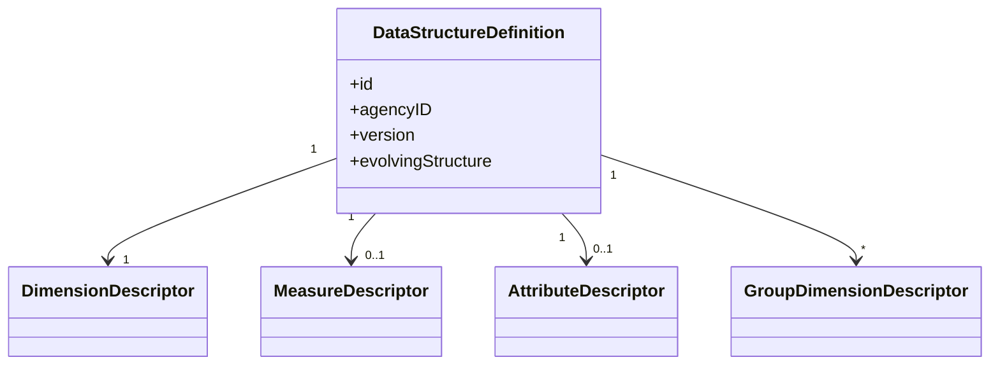

### Components

Components are the building blocks of a DSD. Each component references a **Concept** (from the glossary) for its semantic identity and may override the concept's core representation with a local representation.

- **Dimension**
  Component that identifies observations. The ordered set of all dimension values forms the **series key** (or observation key in flat datasets). Dimensions reference Concepts and have an enumerated representation (Codelist) or non-enumerated representation (Facet constraints).
  - *Example*: Dimensions `FREQ` (frequency), `REF_AREA` (reference area), and `INDICATOR` together form a key like `A.ES.GDP` (Annual, Spain, GDP).

- **TimeDimension**
  Special dimension for time periods (at most one per DSD). Uses time-related FacetValueTypes (`observationalTimePeriod`, `reportingTimePeriod`, etc.) rather than Codelists.
  - *Example*: A TimeDimension with representation `observationalTimePeriod` accepting values like `2024`, `2024-Q1`, `2024-01`.

- **Measure**
  Component representing the observed phenomenon (the "what is measured"). DSDs can have single or multiple measures. Each Measure has `minOccurs`, `maxOccurs`, and `usage` (mandatory/optional) to control cardinality.
  - *Example*: A single Measure `OBS_VALUE` representing the observation value, or multiple Measures like `IMPORTS` and `EXPORTS` in a trade DSD.

- **DataAttribute**
  Component providing additional characteristics of the data (metadata about the data). Attributes do not identify observations but describe them. Each attribute has an **AttributeRelationship** specifying its attachment level.

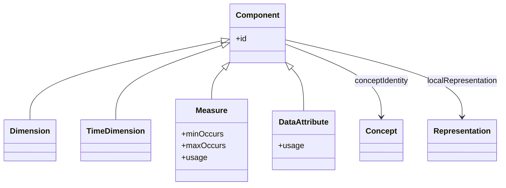

### Attribute relationships

DataAttributes attach to different levels of the data structure:

| Relationship | Attachment Level | Example |
|--------------|------------------|---------|
| DataflowRelationship | Entire dataset | Dataset title, source agency |
| DimensionRelationship | Specific dimension(s) | Country-level footnote |
| GroupRelationship | GroupDimensionDescriptor | Group-level status |
| ObservationRelationship | Individual observation | Observation status, confidentiality |
| MeasureRelationship | Specific measure(s) | Unit of measure for a specific measure |

### Groups

- **GroupDimensionDescriptor**
  Defines a partial key (subset of dimensions) for attaching attributes at an intermediate level between dataset and observation. Groups are useful for attributes that apply to a "slice" of the data cube.
  - *Example*: A group on `REF_AREA` and `INDICATOR` to attach a revision policy attribute to all time periods for a given country/indicator combination.

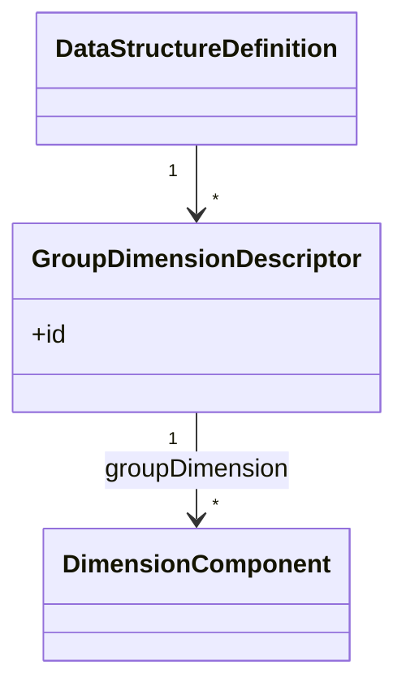

### Dataflows

- **Dataflow**
  Structure usage that applies a DSD to a specific data exchange context. Dataflows are the primary artefact referenced in data queries and provision agreements. Multiple Dataflows can share the same DSD.
  - *Example*: A DSD for balance of payments data may be used by Dataflows `DF_BOP_QUARTERLY` and `DF_BOP_ANNUAL` with different constraints.

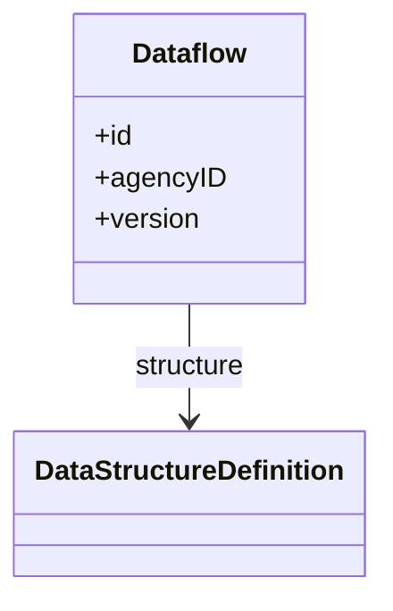

### Constraints

Constraints restrict the allowable or actual content for a Dataflow, DataProvider, or ProvisionAgreement.

- **DataConstraint**
  Specifies allowable (`allowableContent`) or actual (`actualContent`) data. Two specification methods:
  - **CubeRegion**: Defines subsets of component values (e.g. only certain codes from a dimension's Codelist).
  - **DataKeySet**: Enumerates specific key combinations (include/exclude explicit series).

- **MemberSelection**
  Within a CubeRegion, selects specific values for a component. The `cascadeValues` option allows including child codes in hierarchies.
  - *Example*: A constraint on `REF_AREA` allowing only EU member states (via a MemberSelection with cascadeValues from an EU parent code).

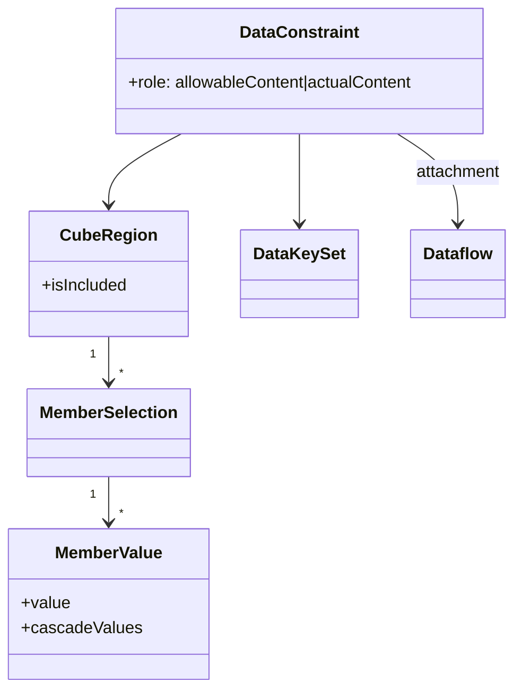

### Observation structure

In SDMX, a dataset contains **Series** (or observations in flat mode). Each series is identified by a **SeriesKey** (values for all dimensions except the observation dimension). Within a series, **Observations** are identified by the observation dimension (typically time).

- **Key**: Combination of dimension values that uniquely identifies a series or observation.
- **KeyValue**: A single dimension–value pair within a key (can be CodedKeyValue, UncodedKeyValue, or TimeKeyValue).
- **ObservationValue**: The measured value(s) for an observation.

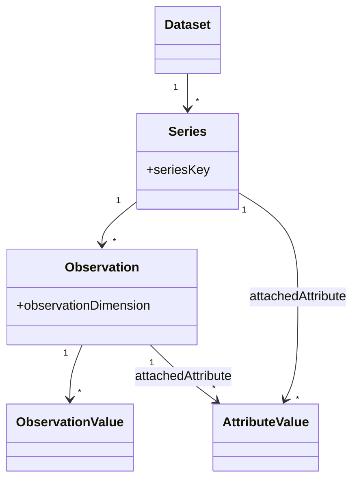

## 1.2 DPM Data Definition artefacts

The DPM data definition layer is built around **Tables** (rendering), **Variables** (data model), and how they connect to the **Glossary** (Properties, Categories). Tables define the visual/logical presentation of data collection forms; Variables define the underlying data points that can be collected. Together they specify what data is requested, how it is identified, and how it appears in reporting templates.

### Tables and versioning

- **Table**
  Maintainable artefact representing a data collection form. Tables have multiple **TableVersions** to support evolution over time without breaking references. Each version defines the headers (axes) and cells of the table.
  - *Example*: Table `T01` with versions `1.0` (2023 reporting) and `2.0` (2024 reporting with an additional breakdown).

- **TableVersion**
  Specific version of a Table, defining its structure via headers on the X, Y, and optionally Z axes.

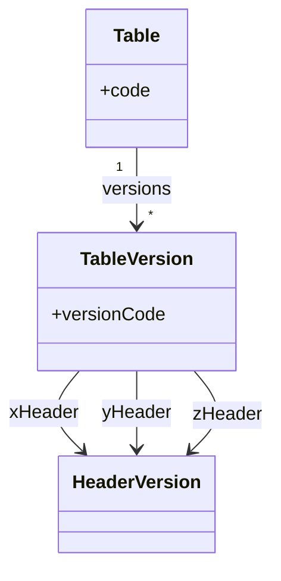

### Headers and cells

- **Header / HeaderVersion**
  Individual position within a table axis (row, column, or sheet). Each HeaderVersion links to glossary terms that give it meaning: always a **Property**, and optionally **Context** (Property–Item pairs for fixed values) or a **SubCategory** (to narrow selectable Items). Headers can be nested (parent–child) to form grouped structures (e.g. a "Total" header with "Male" and "Female" children). A Header flagged `IsKey` defines an open-axis key (e.g. reporting entity, time period).

- **Cell**
  Intersection of leaf-level Headers from different axes within a **Table**. A Cell references its constituent Headers (column, row, and optionally sheet) and, via **TableVersionCell**, links to a **VariableVersion**. The Cell's semantic meaning is inherited from the glossary terms on its constituent Headers. Key Headers do not result in Cells.

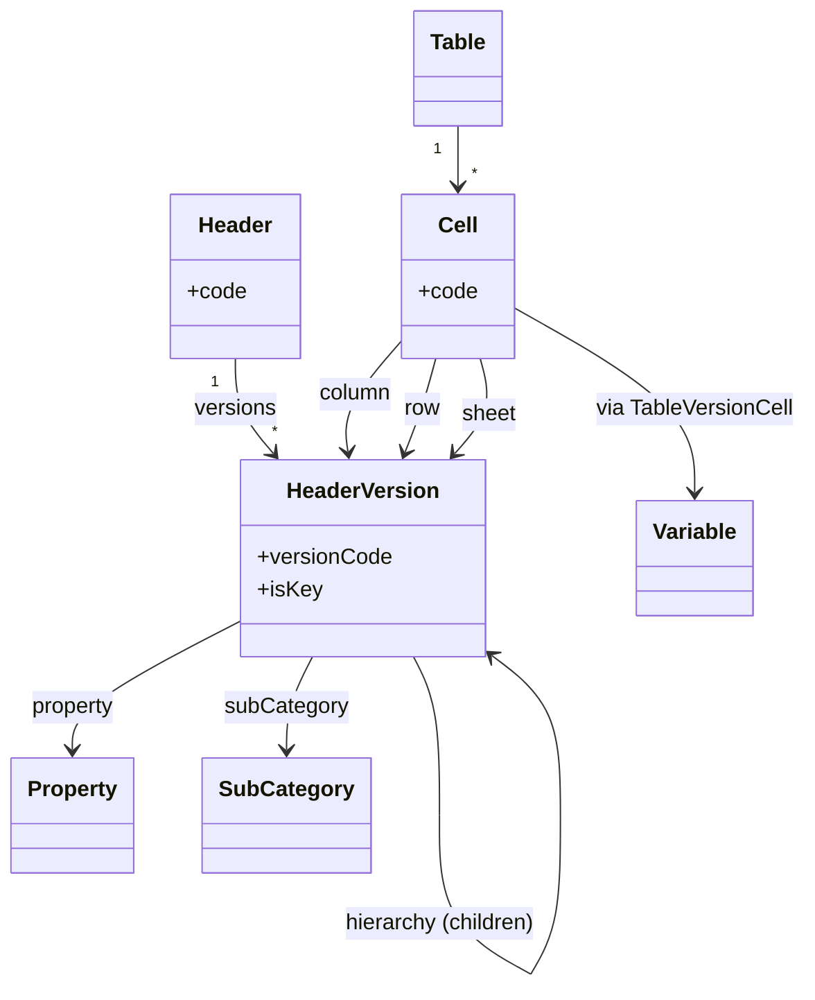

### Table patterns

DPM supports different table patterns depending on how Headers define the axes:

| Pattern | Description | Header characteristics | Interoperability |
|---------|-------------|------------------------|------------------|
| **Closed table** | All data points are pre-defined; each Cell corresponds to exactly one Variable. | Headers carry fixed Context (Property–Item pairs) | High (direct cell-to-variable mapping) |
| **Open table** | Some axes allow user-selected values from a Property's domain (e.g. pick countries from a list). | Key Headers on open axes (`HasOpenRows`, `HasOpenColumns`) | Medium (variable determined at runtime) |
| **SDMX-like table** | Headers represent dimension breakdowns; similar to SDMX series keys. | Headers reference enumerated Properties with SubCategories | High (maps naturally to SDMX DSDs) |

- *Example*: A closed table where row Headers are fixed asset types (each with a Context pinning one Item) and column Headers are fixed time periods — each Cell is a known Variable. An open table where rows are selected countries (Key Header with Property "Residence" and a SubCategory listing EU members) and columns are indicators.

### Variables

Variables define the data points that can be collected, independent of their visual rendering in tables. Each **VariableVersion** must indicate a **Property** (for its semantic meaning) and optionally a **SubCategory** (to constrain selectable Items) or a **Context** (Property–Item pairs that further describe the variable's meaning).

- **Variable / VariableVersion**
  Abstract base for all variable types. Variables are versioned (VariableVersion per Release). Each VariableVersion indicates a Property and optionally a SubCategory. Variables are related to one another via **ConceptRelations** (e.g. `factVariable_keyVariable`, `variable_attribute`).

- **FactVariable**
  Variable representing a measured value (the "fact" being reported). The data type (Monetary, Percentage, Integer, Decimal, Boolean, Date, String) is determined by the Property's DataType. A FactVariable may refer to a **Context** when the Property alone is insufficient to describe its meaning. Additional characteristics such as unit of measure are modelled as AttributeVariables.
  - *Example*: `FAIR_VALUE` as a Monetary FactVariable, or `NUMBER_OF_EMPLOYEES` as an Integer FactVariable.

- **KeyVariable**
  Variable that explicitly and uniquely identifies an exchanged observation. KeyVariables result from Key Headers in open tables and are gathered into a **CompoundKey** via **KeyComposition**. 
  - *Example*: `COUNTRY` and `INSTRUMENT_TYPE` as KeyVariables gathered in a CompoundKey that identifies FactVariable observations.

- **AttributeVariable**
  Variable providing additional information about an observation (e.g. unit of measure, accuracy, confidentiality). Linked to a FactVariable or KeyVariable via a ConceptRelation of type `variable_attribute`.
  - *Example*: `CONFIDENTIALITY_STATUS` as an AttributeVariable linked to a FactVariable.

- **FilingIndicatorVariable**
  Special variable indicating whether a reporting unit (e.g. TableGroup or Table) should be reported. Has `isOpenTable` flag for extensible reporting scope.

- **CompoundKey / KeyComposition**
  A CompoundKey gathers all KeyVariables applicable to a TableVersion or ModuleVersion via KeyComposition entries. It is referenced by TableVersions, ModuleVersions, and individual FactVariableVersions that need those keys for identification.

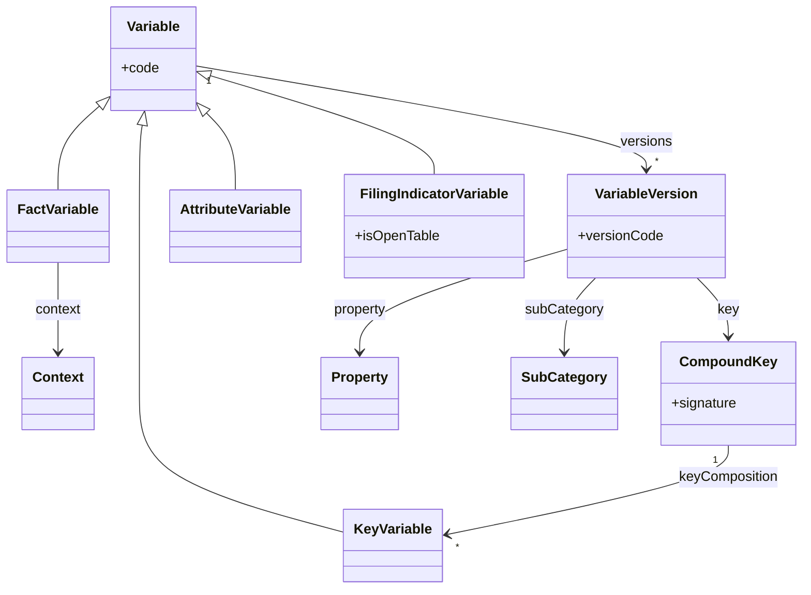

### Relationship between tables and variables

In DPM, the connection between rendering (Tables) and data model (Variables) is established through:

1. **Header–Property alignment**: Headers reference Properties; VariableVersions indicate the same Properties.
2. **Coordinate derivation**: A Cell — the intersection of leaf-level Headers — inherits the Property–Item pairs from its constituent Headers, yielding the VariableVersion's Context.
3. **Filing indicators**: FilingIndicatorVariables control whether a table (or parts of it) should be reported.

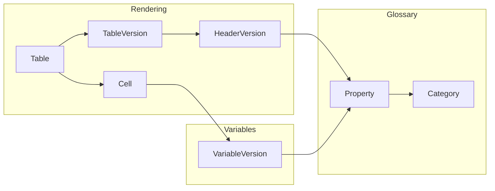

### Modules and ModuleVersions

Modules are the primary unit of organisation for DPM data definitions. They group related Variables, Tables, and Operations into coherent packages that can be versioned and released together. In this sense, Modules play a role analogous to SDMX Dataflows: they define what data is requested in a particular reporting context.

- **Module**
  Maintainable artefact representing a coherent package of reporting requirements (e.g. a regulation annex, a statistical domain). Modules have multiple **ModuleVersions** to support evolution over time.
  - *Example*: Module `FINREP` for financial reporting, with versions `3.0`, `3.1`, `3.2` tracking regulatory changes.

- **ModuleVersion**
  Specific version of a Module, containing:
  - **Variables**: The data points that can be collected.
  - **Tables**: The visual/logical presentation of data collection forms.
  - **Operations**: Validation and calculation rules.
  - **Glossary roots**: References to Categories and Properties used by this module.
  - **Dependencies**: References to other ModuleVersions that this version depends on (e.g. a common glossary module).

  ModuleVersions are the unit of deployment: a reporting obligation typically references one or more ModuleVersions.
  - *Example*: `FINREP v3.2` depending on `COMMON_GLOSSARY v2.0` for shared Categories and Properties.

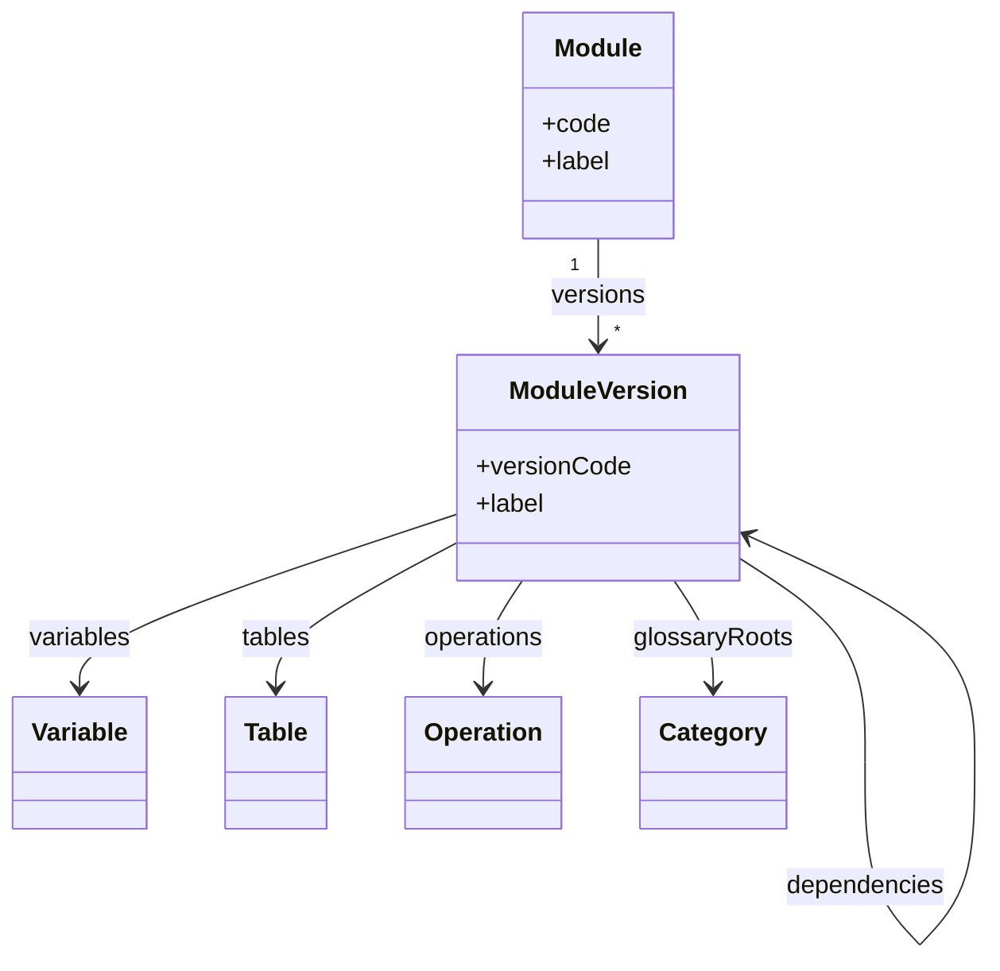

### Frameworks and Releases

Modules are organised into Frameworks and published via Releases.

- **Framework**
  Top-level container for a reporting domain. A Framework groups related Modules and is owned by an Organisation.
  - *Example*: Framework `EBA_REPORTING` containing Modules `FINREP`, `COREP`, `LIQUIDITY`.

- **Release**
  Publication milestone that bundles specific ModuleVersions for a reporting period. Releases have:
  - **releaseDate**: When the release is published.
  - **applicationDate**: When reporting obligations begin (the "as-of" date for data collection).

  Releases enable temporal management: reporters know which ModuleVersions apply for a given reference date.
  - *Example*: Release `2024-Q1` with `applicationDate = 2024-01-01`, including `FINREP v3.2` and `COREP v3.1`.

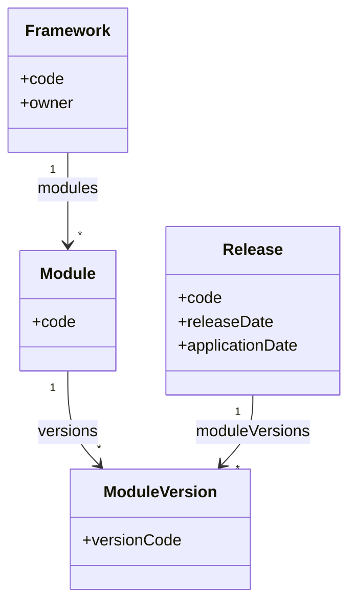

### Module dependencies and glossary sharing

A key feature of DPM Modules is explicit dependency management. A ModuleVersion can declare dependencies on other ModuleVersions, enabling:

1. **Glossary sharing**: A common glossary module defines Categories and Properties reused across multiple reporting modules.
2. **Layered definitions**: Base modules define core variables; extension modules add domain-specific variables.
3. **Version alignment**: Dependencies specify exact versions, ensuring consistency across a release.

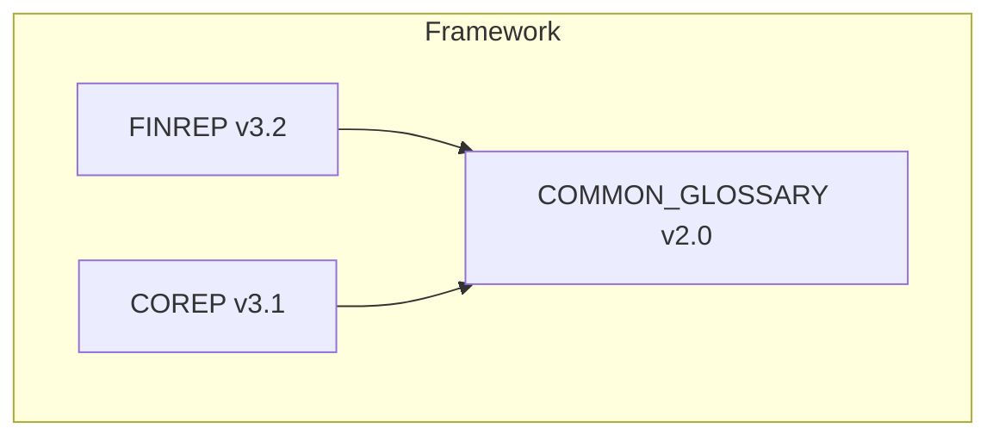
