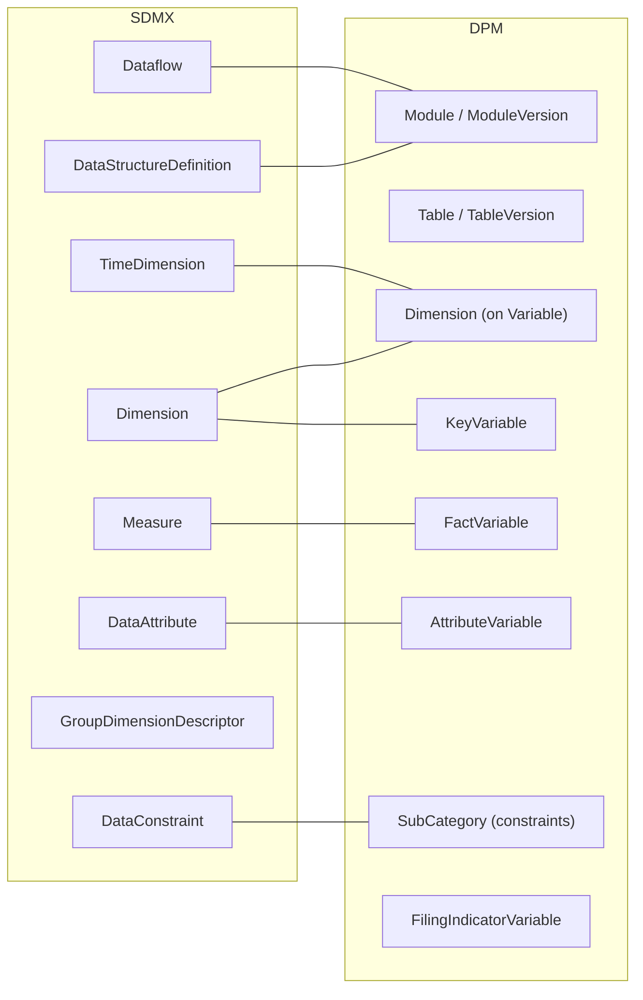

# 2. High-level mapping summary

This chapter gives a compact view of how the SDMX and DPM data definition artefacts relate to each other. It complements the detailed descriptions in sections 2.1 and 2.2 and the rule-based mappings in the next chapter.

## 2.1 Tabular mapping

The table below summarises the main correspondences at data definition level. It is intentionally high level; edge cases and technical details are covered later.

| SDMX data definition artefact | DPM data definition artefact | Mapping notes |
| --- | --- | --- |
| DataStructureDefinition (DSD) | Module | Both define the structural metadata for a reporting domain. A DSD specifies components; a Module groups Variables, Tables, and Operations. |
| Dataflow | ModuleVersion | Both represent structure usage in a specific context. A Dataflow applies a DSD; a ModuleVersion is a deployable version of a Module with concrete artefacts. |
| Dataflow + DSD (convention) | Table | One SDMX Dataflow plus its DSD can correspond to one DPM Table. This is a practical convention, not a strict equivalence. |
| Dimension | Dimension (on Variable) / KeyVariable | SDMX Dimensions identify observations; DPM Dimensions on Variables serve the same role. KeyVariables are variables that act as identifiers. |
| TimeDimension | Dimension with time-related Property | SDMX has a dedicated TimeDimension type; DPM uses a regular Dimension referencing a time-related Property (e.g. `REFERENCE_PERIOD`). |
| Measure | FactVariable | Both represent the observed/measured value. SDMX Measures have cardinality controls; DPM FactVariables have a `dataType`. |
| DataAttribute | AttributeVariable | Both provide metadata about observations. DPM AttributeVariables explicitly reference a `subject` Variable. |
| AttributeRelationship | (implicit in Variable scope) | SDMX explicitly defines attachment levels; DPM attachment is implicit in how AttributeVariables reference their subject. |
| GroupDimensionDescriptor | – | SDMX partial-key groups have no direct DPM equivalent. Similar semantics may be achieved via Variable scoping or Operations. |
| DataConstraint / CubeRegion | SubCategory (on Dimensions) | SDMX constraints restrict allowable values; DPM uses SubCategories to define allowed Items for a Dimension's Property. |
| Series / Observation | Variable instance (data point) | An SDMX series key maps to a DPM Variable's dimensional signature; observations map to reported values for that Variable. |
| – | Table / TableVersion | DPM Tables define visual/logical rendering; SDMX has no equivalent (presentation is outside the information model). |
| – | Header / Cell | DPM cell structure for table axes; no SDMX counterpart. |
| – | FilingIndicatorVariable | DPM-specific artefact indicating whether a table should be reported; no direct SDMX equivalent. |
| – | Framework / Release | DPM packaging and temporal publication; SDMX uses ProvisionAgreements and versioning but lacks explicit release milestones. |

## 2.2 Graphical mapping overview

The diagram below shows the main data definition artefacts on each side and their high-level correspondences.

The lines indicate "primary" correspondences used throughout this document; they do not exclude alternative modelling choices in specific implementations.

## 2.3 Artefacts without a direct counterpart

Not all data definition artefacts have a clean one-to-one mapping. This section highlights the main "asymmetric" cases so that readers are aware of where modelling choices or simplifications are needed.

### 2.3.1 SDMX-only (at data definition level)

- **TimeDimension**
  SDMX has a dedicated component type for time with specific FacetValueTypes (`observationalTimePeriod`, `reportingTimePeriod`, etc.). DPM uses a regular Dimension referencing a time-related Property; the time semantics are implicit in the Property definition rather than enforced by a special component type.

- **GroupDimensionDescriptor**
  SDMX Groups define partial keys for attaching attributes at intermediate levels (e.g. all observations for a country regardless of time). DPM has no direct equivalent; similar requirements are handled through Variable scoping, Operations, or by defining separate AttributeVariables.

- **AttributeRelationship (explicit attachment levels)**
  SDMX explicitly models where attributes attach (dataset, dimension, group, observation, measure). DPM attachment is implicit: an AttributeVariable references its subject Variable, but the "level" is not formally specified in the same way.

- **CategoryScheme / Categorisation**
  SDMX CategorySchemes organise subject domains and Categorisations link Categories to structural artefacts such as Dataflows. DPM achieves similar grouping via Frameworks and Modules, but has no direct counterpart to the Categorisation mechanism that explicitly links a subject-domain category to a data exchange definition.

- **DataConstraint with DataKeySet**
  SDMX DataKeySet enumerates explicit key combinations (specific series). DPM constraints operate at the value-domain level (SubCategories) rather than at the key-combination level; enumerating specific variable instances requires different mechanisms.

### 2.3.2 DPM-only (at data definition level)

- **Table / TableVersion / Header / Cell**
  DPM has a complete rendering layer defining how data collection forms are visually structured. SDMX intentionally excludes presentation concerns from the information model; table layouts are left to implementations or external specifications.

- **FilingIndicatorVariable**
  DPM-specific artefact that indicates whether a table (or parts of it) should be reported. Supports `isOpenTable` for extensible reporting scope. SDMX has no equivalent; similar semantics might be conveyed through constraints or provision agreements but without a dedicated artefact.

- **Open table / Closed table patterns**
  DPM explicitly supports different table patterns (closed, open, SDMX-like) with distinct cell types and rendering rules. SDMX does not model table patterns; the concept of "open" vs "closed" cells is specific to DPM's rendering layer.

- **Framework / Release**
  DPM Frameworks group Modules into reporting domains; Releases bundle ModuleVersions with explicit `applicationDate` for temporal management. SDMX uses Agency ownership and versioning but lacks a dedicated "release" artefact that ties multiple structures to a reporting period.

- **Module dependencies**
  DPM ModuleVersions can explicitly declare dependencies on other ModuleVersions (e.g. for glossary sharing). SDMX structures reference shared artefacts (ConceptSchemes, Codelists) but do not have a formal "module dependency" mechanism at the structure level.

These asymmetries are important when designing transformations between the two models. Later chapters discuss how to handle these cases in practice.
