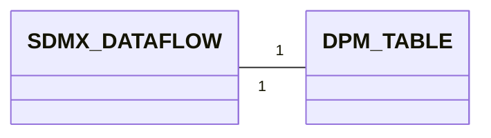
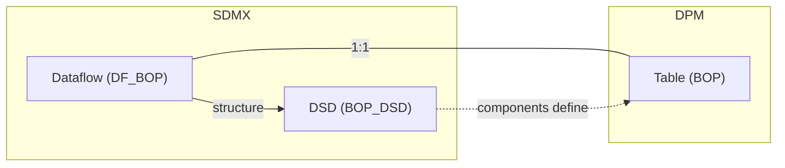
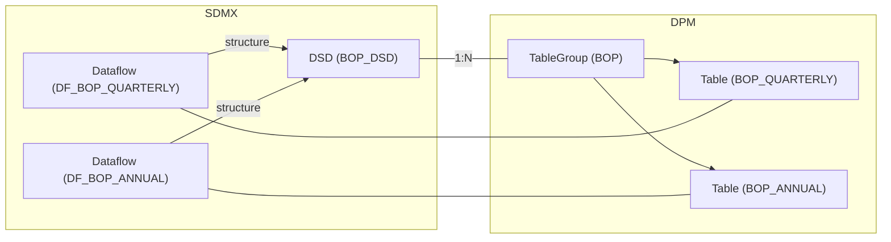
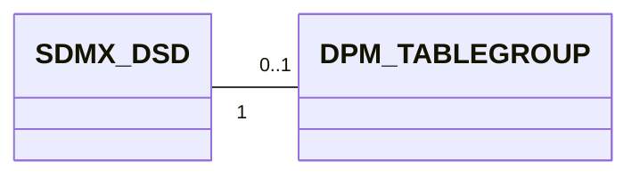
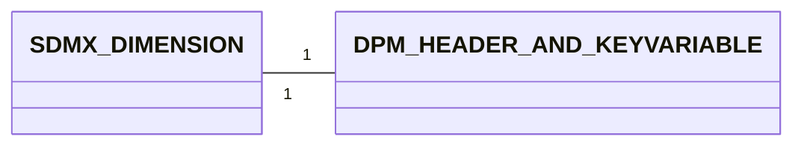
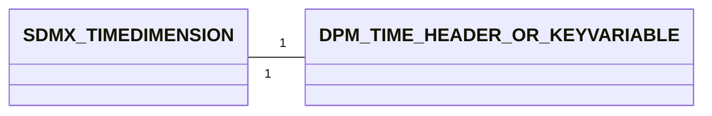
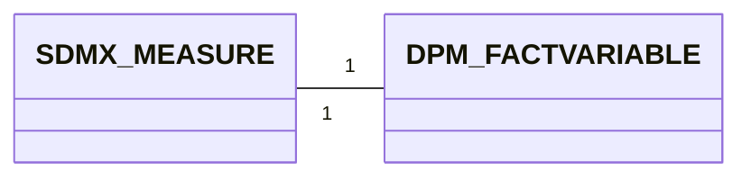
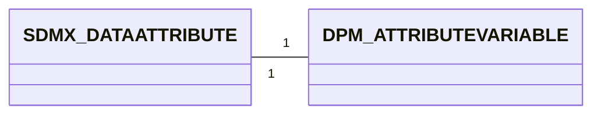
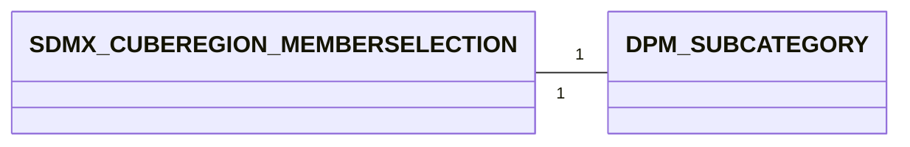

# 3. Detailed mapping rules

This chapter provides the detailed rules for each of the high-level correspondences described in chapter 2. It follows the same format as the [glossary detailed mapping rules](../01_glossary/03_detailed_mapping_rules.md): for each mapping pair, we describe both artefacts, show examples, present the mapping cardinality and attributes equivalence, and provide bidirectional example transformations.

Throughout this chapter, a running example based on a balance-of-payments (BOP) statistical domain is used. The SDMX side defines a DSD with dimensions, a measure, and attributes, applied via Dataflows. The DPM side defines Tables with Headers, Variables, and Dimensions referencing the glossary.

> **Cross-references**: Identification, multilingual, and naming rules follow the general principles established in [Basics — Detailed Mapping Rules](../00_basics/02_detailed_mapping_rules.md). This chapter focuses on the structural and semantic aspects specific to data definition artefacts.

## 3.1 Dataflow ↔ Table

An SDMX **Dataflow** is a structure usage that applies a Data Structure Definition (DSD) to a specific data exchange context. Dataflows are the primary artefact referenced in data queries, provision agreements, and data submissions. Reporters submit data *against* a Dataflow.

**Example Dataflow**
```xml
<Dataflow id="DF_BOP_QUARTERLY" agencyID="ECB" version="1.0">
  <Name xml:lang="en">Balance of Payments — Quarterly</Name>
  <Description xml:lang="en">Quarterly balance of payments data collection</Description>
  <Structure>
    <Ref id="BOP_DSD" agencyID="ECB" version="1.0" class="DataStructureDefinition"/>
  </Structure>
</Dataflow>
```

The equivalent artefact in the DPM is the **Table** (and its **TableVersion**).

A DPM Table represents a data collection form — the unit against which reporters provide data. Tables are versioned via TableVersion to support evolution over time. Each TableVersion defines the headers (on X, Y, and optionally Z axes) and the cells that constitute the data points.

The `Table.IsFlat` flag is critical for interoperability:

- **`IsFlat = TRUE`**: The Table uses Properties only (no Contexts). Headers reference Properties directly, and each cell intersection maps to a FactVariable identified by Property–Item pairs. This pattern is structurally very close to an SDMX DSD+Dataflow — dimensions are represented as key Headers, and the table behaves like a flat SDMX dataset.
- **`IsFlat = FALSE`**: The Table uses Contexts to group Property–Item pairs. This is the traditional DPM pattern, where each cell's variable is identified through a Context (dimensional signature). This pattern has no direct SDMX counterpart.

Tables also have flags that relate to open Dataflow dimensions:

- **`HasOpenColumns`** / **`HasOpenRows`** / **`HasOpenSheets`**: When `TRUE`, the corresponding axis allows reporters to add rows/columns/sheets from a Property's domain — similar to how an SDMX Dataflow allows any valid key combination within a DSD's dimensions.

**Example Table**

*Table*

| TableID | IsAbstract | HasOpenColumns | HasOpenRows | HasOpenSheets | IsNormalised | IsFlat |
| ------- | ---------- | -------------- | ----------- | ------------- | ------------ | ------ |
| 5001    | FALSE      | FALSE          | TRUE        | FALSE         | FALSE        | TRUE   |

*TableVersion*

| TableVID | TableID | KeyID | Code            | Name                              | StartReleaseID | EndReleaseID |
| -------- | ------- | ----- | --------------- | --------------------------------- | -------------- | ------------ |
| 5101     | 5001    | 8001  | BOP_QUARTERLY   | Balance of Payments — Quarterly   | 1              | NULL         |

### 3.1.1 Mapping cardinality



- From SDMX to DPM: One Dataflow maps to one Table (with a corresponding TableVersion). The DSD components define the Table's Headers and cells (see sections 3.3–3.6).
- From DPM to SDMX: One Table maps to one Dataflow. The Table's structural properties (Headers, cells, Variables) determine the DSD components referenced by the Dataflow.

### 3.1.2 Attributes equivalence

#### 3.1.2.1 SDMX Dataflow attributes
- Maintainable artefact attributes (see [Identification mapping rules](../00_basics/02_detailed_mapping_rules.md#22-identification-dpm-ids-vs-sdmx-urns))
    - `id`
    - `agencyID`
    - `version`
- `structure` (reference to a DSD)

#### 3.1.2.2 DPM Table/TableVersion attributes
- `TableID`
- `Code` (on TableVersion)
- `Name` (on TableVersion)
- `Description` (on TableVersion)
- `IsFlat`
- `HasOpenColumns`, `HasOpenRows`, `HasOpenSheets`
- `KeyID` (on TableVersion, references CompoundKey)
- `StartReleaseID`, `EndReleaseID`

#### 3.1.2.3 Mapping details

| SDMX                  | DPM                                   |
|-----------------------|---------------------------------------|
| id                    | TableVersion.Code                     |
| agencyID              | Owner (see basics)                    |
| version               | Release (StartReleaseID)              |
| structure (DSD ref)   | (implicit in Table's Headers/cells)   |
| -not applicable-      | IsFlat                                |
| -not applicable-      | HasOpenColumns / HasOpenRows / HasOpenSheets |
| -not applicable-      | KeyID (CompoundKey)                   |

> **Note**: The mapping of multilingual `Name` and `Description` attributes follows the general rules described in [Multilingual support](../00_basics/02_detailed_mapping_rules.md#23-multilingual-support-internationalstring-vs-translations).

> **Note**: The SDMX `structure` reference (pointing to a DSD) has no single DPM counterpart. The structural information carried by the DSD is distributed across the Table's Headers, cells, Variables, and their associated Properties. See section 3.2 for the DSD-level mapping.

### 3.1.3 Example Mapping SDMX → DPM

```xml
<Dataflow id="DF_BOP_QUARTERLY" agencyID="ECB" version="1.0">
  <Name xml:lang="en">Balance of Payments — Quarterly</Name>
  <Description xml:lang="en">Quarterly balance of payments data collection</Description>
  <Structure>
    <Ref id="BOP_DSD" agencyID="ECB" version="1.0" class="DataStructureDefinition"/>
  </Structure>
</Dataflow>
```

*Table (generated)*

| TableID | IsAbstract | HasOpenColumns | HasOpenRows | HasOpenSheets | IsNormalised | IsFlat |
| ------- | ---------- | -------------- | ----------- | ------------- | ------------ | ------ |
| *(gen)* | FALSE      | FALSE          | TRUE        | FALSE         | FALSE        | TRUE   |

*TableVersion (generated)*

| TableVID | TableID | KeyID   | Code              | Name                              | StartReleaseID | EndReleaseID |
| -------- | ------- | ------- | ----------------- | --------------------------------- | -------------- | ------------ |
| *(gen)*  | *(gen)* | *(gen)* | DF_BOP_QUARTERLY  | Balance of Payments — Quarterly   | *(current)*    | NULL         |

The Dataflow `id` becomes the TableVersion `Code`. `IsFlat` is set to `TRUE` because the SDMX structure is naturally flat (Properties only, no Contexts). `HasOpenRows` is set to `TRUE` because reporters can submit any valid key combination — similar to the Dataflow accepting any observation matching the DSD's dimensions.

### 3.1.4 Example Mapping DPM → SDMX

*Table*

| TableID | IsAbstract | HasOpenColumns | HasOpenRows | HasOpenSheets | IsNormalised | IsFlat |
| ------- | ---------- | -------------- | ----------- | ------------- | ------------ | ------ |
| 5001    | FALSE      | FALSE          | TRUE        | FALSE         | FALSE        | TRUE   |

*TableVersion*

| TableVID | TableID | KeyID | Code            | Name                              | StartReleaseID | EndReleaseID |
| -------- | ------- | ----- | --------------- | --------------------------------- | -------------- | ------------ |
| 5101     | 5001    | 8001  | BOP_QUARTERLY   | Balance of Payments — Quarterly   | 1              | NULL         |

```xml
<Dataflow id="BOP_QUARTERLY" agencyID="ECB" version="1.0">
  <Name xml:lang="en">Balance of Payments — Quarterly</Name>
  <Structure>
    <Ref id="DSD_BOP_QUARTERLY" agencyID="ECB" version="1.0"
         class="DataStructureDefinition"/>
  </Structure>
</Dataflow>
```

The TableVersion `Code` becomes the Dataflow `id`. The DSD referenced by the Dataflow is generated from the Table's structural content (Headers, cells, Variables) — see section 3.2.


## 3.2 DSD ↔ TableGroup / Table

An SDMX **Data Structure Definition (DSD)** specifies the complete structure for a statistical dataset: which dimensions identify observations, what measures are collected, and what attributes describe the data. A DSD is referenced by one or more Dataflows.

The DPM counterpart depends on the DSD-to-Dataflow cardinality:

### 3.2.1 One DSD, one Dataflow (1:1 case)

When a DSD is referenced by exactly one Dataflow, the DSD structural definition is **subsumed into the Table mapping** (section 3.1). The DSD components (Dimensions, Measures, Attributes) map to the Table's Headers, cells, and Variables. There is no separate DPM artefact for the DSD itself.



In this case, the DSD's components directly define the Table's structure:

- DSD Dimensions → Table Headers referencing Properties (see section 3.3)
- DSD Measures → FactVariables linked to cells (see section 3.5)
- DSD Attributes → AttributeVariables (see section 3.6)

### 3.2.2 One DSD, multiple Dataflows (1:N case)

When a DSD is shared across multiple Dataflows, the DSD maps to a **TableGroup** containing the corresponding Tables (one per Dataflow).

**Example**: One DSD `BOP_DSD` used by two Dataflows (`DF_BOP_QUARTERLY` and `DF_BOP_ANNUAL`):



**Example DSD**
```xml
<DataStructureDefinition id="BOP_DSD" agencyID="ECB" version="1.0">
  <Name xml:lang="en">Balance of Payments</Name>
  <DataStructureComponents>
    <DimensionList id="DimensionDescriptor">
      <Dimension id="FREQ" position="1"><!-- ... --></Dimension>
      <Dimension id="REF_AREA" position="2"><!-- ... --></Dimension>
      <Dimension id="BOP_ITEM" position="3"><!-- ... --></Dimension>
      <TimeDimension id="TIME_PERIOD"><!-- ... --></TimeDimension>
    </DimensionList>
    <MeasureList id="MeasureDescriptor">
      <Measure id="OBS_VALUE" usage="mandatory"><!-- ... --></Measure>
    </MeasureList>
    <AttributeList id="AttributeDescriptor">
      <Attribute id="OBS_STATUS" usage="conditional"><!-- ... --></Attribute>
    </AttributeList>
  </DataStructureComponents>
</DataStructureDefinition>
```

**Example TableGroup**

*TableGroup*

| TableGroupID | Code | Name                 | Type           | ParentTableGroupID |
| ------------ | ---- | -------------------- | -------------- | ------------------ |
| 9001         | BOP  | Balance of Payments  | template       | NULL               |

*TableGroupComposition*

| TableGroupID | TableID | Order | StartReleaseID | EndReleaseID |
| ------------ | ------- | ----- | -------------- | ------------ |
| 9001         | 5001    | 1     | 1              | NULL         |
| 9001         | 5002    | 2     | 1              | NULL         |

The `TableGroup.Type` field classifies the organisational role:

| Type              | Description |
|-------------------|-------------|
| `template`        | A reusable structural pattern shared by the grouped Tables |
| `templateVariant` | A variant of a template with minor differences |
| `templateGroup`   | A higher-level grouping of templates |
| `templateScope`   | Defines the scope/applicability of a template |

For the DSD↔TableGroup mapping, `template` is the most natural `Type` value, as it represents a shared structural pattern (the DSD) applied across multiple Tables (Dataflows).

### 3.2.3 Mapping cardinality



- From SDMX to DPM: A DSD maps to a TableGroup only when it is shared across multiple Dataflows (1:N). When a DSD has exactly one Dataflow (1:1), the DSD has no separate DPM counterpart — its structure is captured in the Table.
- From DPM to SDMX: A TableGroup maps to a DSD when the grouped Tables share a common structural pattern. If a Table stands alone (no TableGroup), a DSD is still generated from its Headers and Variables, but there is no TableGroup source.

> **Note**: TableGroup is purely organisational — it does not carry structural definitions. The shared structure across Tables lives in reusable Headers and glossary Properties. When generating SDMX from a TableGroup, the DSD components are derived from the common structure of the grouped Tables.


## 3.3 Dimension ↔ Dimension (on Variable) + Header

An SDMX **Dimension** is a component in the DimensionDescriptor of a DSD. Dimensions identify observations: the ordered set of all dimension values forms the series key (or observation key in flat datasets). Each Dimension references a Concept and has a representation (enumerated via a Codelist, or non-enumerated via Facet constraints).

**Example Dimension**
```xml
<Dimension id="REF_AREA" position="2">
  <ConceptIdentity>
    <Ref id="REF_AREA" maintainableParentID="STANDALONE_CONCEPT_SCHEME"
         agencyID="ECB" maintainableParentVersion="1.0" class="Concept"/>
  </ConceptIdentity>
  <LocalRepresentation>
    <Enumeration>
      <Ref id="CL_COUNTRY" agencyID="ECB" version="1.0" class="Codelist"/>
    </Enumeration>
  </LocalRepresentation>
</Dimension>
```

In DPM, the mapping target depends on the `Table.IsFlat` flag:

**When `IsFlat = TRUE` (SDMX-like tables)**: The SDMX Dimension maps to a **Header** (with `IsKey = TRUE`) referencing a Property. The Header appears on one of the Table's axes (typically Y for row dimensions, X for column dimensions). The Property referenced by the Header corresponds to the SDMX Concept (see [glossary mapping 3.5](../01_glossary/03_detailed_mapping_rules.md#35-concept-property)), and the Property's Category corresponds to the SDMX Codelist (see [glossary mapping 3.1](../01_glossary/03_detailed_mapping_rules.md#31-codelist-category)).

Additionally, when `IsKey = TRUE`, the Header links to a **KeyVariable** via `HeaderVersion.KeyVariableVID`. The KeyVariable is part of the Table's CompoundKey (referenced by `TableVersion.KeyID`), which defines the set of key dimensions for all FactVariables in the Table.

**When `IsFlat = FALSE` (context-based tables)**: The SDMX Dimension maps to a **Dimension on a Variable** — an entity that references a Property and may be typed or enumerated. The Dimension appears in the Variable's dimensional signature (Context). This pattern is DPM-specific and has no direct structural equivalent in SDMX.

This chapter focuses on the `IsFlat = TRUE` case, which provides the most natural interoperability path.

**Example Header (IsFlat = TRUE)**

*Header*

| HeaderID | TableID | Direction |
| -------- | ------- | --------- |
| 6001     | 5001    | Row       |

*HeaderVersion*

| HeaderVID | HeaderID | Code     | Label          | PropertyID | SubCategoryVID | IsKey | KeyVariableVID | StartReleaseID | EndReleaseID |
| --------- | -------- | -------- | -------------- | ---------- | -------------- | ----- | -------------- | -------------- | ------------ |
| 6101      | 6001     | REF_AREA | Reference area | 3001       | NULL           | TRUE  | 7101           | 1              | NULL         |

*Variable (Key)*

| VariableID | Type |
| ---------- | ---- |
| 7001       | key  |

*VariableVersion*

| VariableVID | VariableID | Code     | Name           | PropertyID | SubCategoryVID | StartReleaseID | EndReleaseID |
| ----------- | ---------- | -------- | -------------- | ---------- | -------------- | -------------- | ------------ |
| 7101        | 7001       | REF_AREA | Reference area | 3001       | NULL           | 1              | NULL         |

### 3.3.1 Mapping cardinality



- From SDMX to DPM (IsFlat tables): One Dimension maps to one Header (with `IsKey = TRUE`) and one KeyVariable. The Header is placed on the appropriate axis (Row or Column) based on the Dimension's position in the DSD.
- From DPM to SDMX: One Header with `IsKey = TRUE` and its linked KeyVariable map to one Dimension in the DSD's DimensionDescriptor.

### 3.3.2 Attributes equivalence

#### 3.3.2.1 SDMX Dimension attributes
- `id`
- `position`
- `conceptIdentity` (reference to a Concept)
- `localRepresentation` (Codelist or Facet)

#### 3.3.2.2 DPM Header/KeyVariable attributes
- `HeaderVersion.Code`
- `HeaderVersion.Label`
- `HeaderVersion.PropertyID`
- `HeaderVersion.SubCategoryVID`
- `HeaderVersion.IsKey`
- `Header.Direction`
- `VariableVersion.Code`, `Name`, `PropertyID`
- `KeyComposition` (links KeyVariable to CompoundKey)

#### 3.3.2.3 Mapping details

| SDMX                          | DPM                                          |
|-------------------------------|-----------------------------------------------|
| id                            | HeaderVersion.Code / VariableVersion.Code     |
| position                      | TableVersionHeader.Order                      |
| conceptIdentity               | HeaderVersion.PropertyID (via Property ↔ Concept mapping) |
| localRepresentation (enumerated) | Property.CategoryID + optional SubCategoryVID |
| localRepresentation (non-enumerated) | Property.DataType                      |
| -not applicable-              | HeaderVersion.IsKey = TRUE                    |
| -not applicable-              | Header.Direction (Row / Column)               |

> **Note**: The SDMX Dimension `position` determines the order within the DimensionDescriptor. In DPM, the equivalent ordering is captured via `TableVersionHeader.Order` and the Header's `Direction` (which axis the dimension appears on).

### 3.3.3 Example Mapping SDMX → DPM

```xml
<Dimension id="REF_AREA" position="2">
  <ConceptIdentity>
    <Ref id="REF_AREA" maintainableParentID="CS_ECB"
         agencyID="ECB" maintainableParentVersion="1.0" class="Concept"/>
  </ConceptIdentity>
  <LocalRepresentation>
    <Enumeration>
      <Ref id="CL_COUNTRY" agencyID="ECB" version="1.0" class="Codelist"/>
    </Enumeration>
  </LocalRepresentation>
</Dimension>
```

*Header (generated)*

| HeaderID | TableID | Direction |
| -------- | ------- | --------- |
| *(gen)*  | *(gen)* | Row       |

*HeaderVersion (generated)*

| HeaderVID | HeaderID | Code     | Label          | PropertyID                          | SubCategoryVID | IsKey | KeyVariableVID | StartReleaseID | EndReleaseID |
| --------- | -------- | -------- | -------------- | ----------------------------------- | -------------- | ----- | -------------- | -------------- | ------------ |
| *(gen)*   | *(gen)*  | REF_AREA | Reference area | Property mapped from Concept `REF_AREA` | NULL       | TRUE  | *(gen)*        | *(current)*    | NULL         |

*Variable (generated)*

| VariableID | Type |
| ---------- | ---- |
| *(gen)*    | key  |

*VariableVersion (generated)*

| VariableVID | VariableID | Code     | Name           | PropertyID                          | SubCategoryVID | StartReleaseID | EndReleaseID |
| ----------- | ---------- | -------- | -------------- | ----------------------------------- | -------------- | -------------- | ------------ |
| *(gen)*     | *(gen)*    | REF_AREA | Reference area | Property mapped from Concept `REF_AREA` | NULL       | *(current)*    | NULL         |

The Dimension `id` becomes the HeaderVersion `Code` and VariableVersion `Code`. The `conceptIdentity` maps to the Property (via the Concept ↔ Property mapping from [glossary section 3.5](../01_glossary/03_detailed_mapping_rules.md#35-concept-property)). The LocalRepresentation Codelist maps to the Property's Category (via the Codelist ↔ Category mapping from [glossary section 3.1](../01_glossary/03_detailed_mapping_rules.md#31-codelist-category)). `IsKey` is set to `TRUE` because this is a dimension (identifier), and the KeyVariable is registered in the Table's CompoundKey.

### 3.3.4 Example Mapping DPM → SDMX

*HeaderVersion*

| HeaderVID | HeaderID | Code     | Label          | PropertyID | SubCategoryVID | IsKey | KeyVariableVID | StartReleaseID | EndReleaseID |
| --------- | -------- | -------- | -------------- | ---------- | -------------- | ----- | -------------- | -------------- | ------------ |
| 6101      | 6001     | REF_AREA | Reference area | 3001       | NULL           | TRUE  | 7101           | 1              | NULL         |

*VariableVersion*

| VariableVID | VariableID | Code     | Name           | PropertyID | SubCategoryVID | StartReleaseID | EndReleaseID |
| ----------- | ---------- | -------- | -------------- | ---------- | -------------- | -------------- | ------------ |
| 7101        | 7001       | REF_AREA | Reference area | 3001       | NULL           | 1              | NULL         |

```xml
<Dimension id="REF_AREA" position="2">
  <ConceptIdentity>
    <Ref id="REF_AREA" maintainableParentID="CS_ECB"
         agencyID="ECB" maintainableParentVersion="1.0" class="Concept"/>
  </ConceptIdentity>
  <LocalRepresentation>
    <Enumeration>
      <Ref id="CL_COUNTRY" agencyID="ECB" version="1.0" class="Codelist"/>
    </Enumeration>
  </LocalRepresentation>
</Dimension>
```

The HeaderVersion `Code` becomes the Dimension `id`. The Property (ID 3001) maps to the Concept (via Property ↔ Concept). If the Property has an enumerated Category, the Category maps to a Codelist for the LocalRepresentation. The `position` is derived from the `TableVersionHeader.Order`.


## 3.4 TimeDimension ↔ Dimension with time-related Property

An SDMX **TimeDimension** is a special dimension type for time periods (at most one per DSD). It uses time-related FacetValueTypes (`observationalTimePeriod`, `reportingTimePeriod`, etc.) rather than Codelists.

**Example TimeDimension**
```xml
<TimeDimension id="TIME_PERIOD">
  <ConceptIdentity>
    <Ref id="TIME_PERIOD" maintainableParentID="STANDALONE_CONCEPT_SCHEME"
         agencyID="ECB" maintainableParentVersion="1.0" class="Concept"/>
  </ConceptIdentity>
  <LocalRepresentation>
    <TextFormat textType="ObservationalTimePeriod"/>
  </LocalRepresentation>
</TimeDimension>
```

DPM has no dedicated time dimension type. Instead, time is represented as a regular **Dimension** (Header or Variable Dimension) referencing a **time-related Property** (e.g. `REFERENCE_PERIOD`). The time semantics are implicit in the Property definition rather than enforced by a special component type.

In practice, time in DPM is often handled at the **Module level** rather than per-Table: the `ModuleVersion` may include a time-related KeyVariable (e.g. `REFERENCE_PERIOD`) in its CompoundKey, meaning it applies to all FactVariables in the module. However, it can also appear as a per-Table Header when the time granularity varies between Tables.

**Example Header for time dimension**

*HeaderVersion (generated)*

| HeaderVID | HeaderID | Code          | Label            | PropertyID                                    | SubCategoryVID | IsKey | KeyVariableVID | StartReleaseID | EndReleaseID |
| --------- | -------- | ------------- | ---------------- | --------------------------------------------- | -------------- | ----- | -------------- | -------------- | ------------ |
| *(gen)*   | *(gen)*  | TIME_PERIOD   | Reference period | Property for `REFERENCE_PERIOD` (DataType=Date) | NULL         | TRUE  | *(gen)*        | *(current)*    | NULL         |

### 3.4.1 Mapping cardinality



- From SDMX to DPM: One TimeDimension maps to one Header/KeyVariable referencing a time-related Property. The `FacetValueType` maps to the Property's DataType.
- From DPM to SDMX: A Header/KeyVariable referencing a time-related Property maps to a TimeDimension when the Property's DataType corresponds to a time type.

### 3.4.2 Attributes equivalence

#### 3.4.2.1 Mapping details

| SDMX                                        | DPM                                     |
|----------------------------------------------|------------------------------------------|
| id                                           | HeaderVersion.Code / VariableVersion.Code |
| conceptIdentity                              | PropertyID (time-related Property)       |
| textType = `ObservationalTimePeriod`         | Property.DataType = Date                 |
| textType = `ReportingTimePeriod`             | Property.DataType = Date                 |
| textType = `StandardTimePeriod`              | Property.DataType = Date                 |
| textType = `GregorianTimePeriod`             | Property.DataType = Date                 |
| -not applicable-                             | Property.PeriodType (stock/flow)         |

> **Note**: SDMX distinguishes multiple time-related FacetValueTypes (observational, reporting, standard, Gregorian), each with different granularity and format rules. DPM collapses these into a single `Date` DataType on the Property. The fine-grained time type distinctions are lost in translation unless captured via conventions or annotations.

> **Note**: The DPM `PeriodType` attribute on the Property (`stock` or `flow`) captures whether the time dimension represents a point-in-time snapshot or a period aggregate. This distinction is not modelled in SDMX at the component level, though it may be conveyed through conventions or observation-level attributes.

### 3.4.3 Example Mapping SDMX → DPM

```xml
<TimeDimension id="TIME_PERIOD">
  <ConceptIdentity>
    <Ref id="TIME_PERIOD" maintainableParentID="CS_ECB"
         agencyID="ECB" maintainableParentVersion="1.0" class="Concept"/>
  </ConceptIdentity>
  <LocalRepresentation>
    <TextFormat textType="ObservationalTimePeriod"/>
  </LocalRepresentation>
</TimeDimension>
```

*HeaderVersion (generated)*

| HeaderVID | HeaderID | Code        | Label            | PropertyID                      | IsKey | KeyVariableVID | StartReleaseID | EndReleaseID |
| --------- | -------- | ----------- | ---------------- | ------------------------------- | ----- | -------------- | -------------- | ------------ |
| *(gen)*   | *(gen)*  | TIME_PERIOD | Reference period | Property for `TIME_PERIOD` (DataType=Date) | TRUE  | *(gen)*        | *(current)*    | NULL         |

The TimeDimension maps like a regular Dimension (section 3.3), but the Property receives a `Date` DataType instead of an enumerated Category. The `ObservationalTimePeriod` FacetValueType maps to `Date` since DPM does not distinguish between time period formats at the Property level.

### 3.4.4 Example Mapping DPM → SDMX

*VariableVersion*

| VariableVID | VariableID | Code          | Name             | PropertyID | StartReleaseID | EndReleaseID |
| ----------- | ---------- | ------------- | ---------------- | ---------- | -------------- | ------------ |
| 7201        | 7002       | TIME_PERIOD   | Reference period | 3005       | 1              | NULL         |

*Property (ID 3005)*

| PropertyID | IsMetric | DataTypeID | PeriodType |
| ---------- | -------- | ---------- | ---------- |
| 3005       | FALSE    | Date       | stock      |

```xml
<TimeDimension id="TIME_PERIOD">
  <ConceptIdentity>
    <Ref id="TIME_PERIOD" maintainableParentID="CS_ECB"
         agencyID="ECB" maintainableParentVersion="1.0" class="Concept"/>
  </ConceptIdentity>
  <LocalRepresentation>
    <TextFormat textType="ObservationalTimePeriod"/>
  </LocalRepresentation>
</TimeDimension>
```

When the Property has a `Date` DataType, the reverse mapping produces a TimeDimension (rather than a regular Dimension). The FacetValueType defaults to `ObservationalTimePeriod` unless conventions specify otherwise.


## 3.5 Measure ↔ FactVariable

An SDMX **Measure** is a component in the MeasureDescriptor of a DSD, representing the observed phenomenon. Measures have `minOccurs`, `maxOccurs`, and `usage` (mandatory/optional) to control cardinality. A DSD may have a single measure (the common case) or multiple measures.

**Example Measure**
```xml
<Measure id="OBS_VALUE" usage="mandatory">
  <ConceptIdentity>
    <Ref id="OBS_VALUE" maintainableParentID="STANDALONE_CONCEPT_SCHEME"
         agencyID="ECB" maintainableParentVersion="1.0" class="Concept"/>
  </ConceptIdentity>
  <LocalRepresentation>
    <TextFormat textType="Decimal"/>
  </LocalRepresentation>
</Measure>
```

The equivalent artefact in the DPM is the **FactVariable**. A FactVariable represents the measured/reported value — the "fact" being collected. It has a `dataType` (Monetary, Percentage, Integer, Decimal, Boolean, Date, String) and references a Property (see [glossary section 3.5](../01_glossary/03_detailed_mapping_rules.md#35-concept-property)) that defines its semantic meaning. FactVariables may reference a CompoundKey (via the Table or Module) that identifies the observation context.

**Example FactVariable**

*Variable*

| VariableID | Type |
| ---------- | ---- |
| 8001       | fact |

*VariableVersion*

| VariableVID | VariableID | Code      | Name              | PropertyID | ContextID | StartReleaseID | EndReleaseID |
| ----------- | ---------- | --------- | ----------------- | ---------- | --------- | -------------- | ------------ |
| 8101        | 8001       | OBS_VALUE | Observation value | 4001       | NULL      | 1              | NULL         |

### 3.5.1 Mapping cardinality



- From SDMX to DPM: One Measure maps to one FactVariable. The Measure's Concept maps to the FactVariable's Property; the representation maps to the Property's DataType.
- From DPM to SDMX: One FactVariable maps to one Measure in the DSD's MeasureDescriptor.

### 3.5.2 Attributes equivalence

#### 3.5.2.1 SDMX Measure attributes
- `id`
- `usage` (mandatory / optional)
- `minOccurs`, `maxOccurs`
- `conceptIdentity`
- `localRepresentation`

#### 3.5.2.2 DPM FactVariable attributes
- `VariableVersion.Code`
- `VariableVersion.Name`
- `VariableVersion.PropertyID`
- `Property.DataType` (via PropertyID)
- `Property.IsMetric`
- `VariableVersion.ContextID`

#### 3.5.2.3 Mapping details

| SDMX                              | DPM                                              |
|------------------------------------|---------------------------------------------------|
| id                                 | VariableVersion.Code                              |
| conceptIdentity                    | PropertyID (via Concept ↔ Property mapping)       |
| usage = mandatory                  | Cell.IsNullable = FALSE                           |
| usage = optional                   | Cell.IsNullable = TRUE                            |
| localRepresentation (Decimal)      | Property.DataType = Decimal / Monetary            |
| localRepresentation (Codelist)     | Property.DataType = Enumeration + SubCategoryVID  |
| minOccurs / maxOccurs              | -not applicable- (DPM does not model measure cardinality) |
| -not applicable-                   | Property.IsMetric = TRUE (for quantitative measures) |
| -not applicable-                   | ContextID (dimensional signature)                 |

> **Note**: DPM FactVariables always have `Property.IsMetric = TRUE` for quantitative measures (Monetary, Decimal, Percentage, Integer). However, a FactVariable can also be non-metric (e.g. a reported String or Enumeration value). In SDMX, all Measures are simply components in the MeasureDescriptor regardless of their quantitative/qualitative nature.

### 3.5.3 Single-measure vs multi-measure mapping

**Single measure (common case)**: Most SDMX DSDs have a single Measure (`OBS_VALUE`). In DPM, this maps to a single FactVariable. In an `IsFlat = TRUE` table, the FactVariable corresponds to the cell value at each key intersection.

**Multiple measures**: SDMX DSDs with multiple Measures (e.g. `IMPORTS`, `EXPORTS`, `NET_BALANCE`) map to multiple FactVariables. In an `IsFlat = TRUE` DPM table, each Measure becomes a separate column Header (with `IsKey = FALSE`) referencing a Property, and each cell under that column links to the corresponding FactVariable.

### 3.5.4 Example Mapping SDMX → DPM

```xml
<Measure id="OBS_VALUE" usage="mandatory">
  <ConceptIdentity>
    <Ref id="OBS_VALUE" maintainableParentID="CS_ECB"
         agencyID="ECB" maintainableParentVersion="1.0" class="Concept"/>
  </ConceptIdentity>
  <LocalRepresentation>
    <TextFormat textType="Decimal"/>
  </LocalRepresentation>
</Measure>
```

*Variable (generated)*

| VariableID | Type |
| ---------- | ---- |
| *(gen)*    | fact |

*VariableVersion (generated)*

| VariableVID | VariableID | Code      | Name              | PropertyID                          | ContextID | StartReleaseID | EndReleaseID |
| ----------- | ---------- | --------- | ----------------- | ----------------------------------- | --------- | -------------- | ------------ |
| *(gen)*     | *(gen)*    | OBS_VALUE | Observation value | Property for `OBS_VALUE` (IsMetric=TRUE, DataType=Decimal) | NULL | *(current)* | NULL |

The Measure `id` becomes the VariableVersion `Code`. The Concept `OBS_VALUE` maps to a Property with `IsMetric = TRUE` and `DataType = Decimal` (via the Concept ↔ Property mapping). The `usage = mandatory` attribute is reflected in the corresponding cell's `IsNullable = FALSE`.

### 3.5.5 Example Mapping DPM → SDMX

*VariableVersion*

| VariableVID | VariableID | Code      | Name              | PropertyID | ContextID | StartReleaseID | EndReleaseID |
| ----------- | ---------- | --------- | ----------------- | ---------- | --------- | -------------- | ------------ |
| 8101        | 8001       | OBS_VALUE | Observation value | 4001       | NULL      | 1              | NULL         |

*Property (ID 4001)*

| PropertyID | IsMetric | DataTypeID | PeriodType |
| ---------- | -------- | ---------- | ---------- |
| 4001       | TRUE     | Decimal    | –          |

```xml
<Measure id="OBS_VALUE" usage="mandatory">
  <ConceptIdentity>
    <Ref id="OBS_VALUE" maintainableParentID="CS_ECB"
         agencyID="ECB" maintainableParentVersion="1.0" class="Concept"/>
  </ConceptIdentity>
  <LocalRepresentation>
    <TextFormat textType="Decimal"/>
  </LocalRepresentation>
</Measure>
```

The VariableVersion `Code` becomes the Measure `id`. The Property (with `IsMetric = TRUE`, `DataType = Decimal`) maps to the Concept and its `Decimal` CoreRepresentation. The `usage` defaults to `mandatory` unless the cell's `IsNullable` flag indicates otherwise.


## 3.6 DataAttribute ↔ AttributeVariable

An SDMX **DataAttribute** is a component in the AttributeDescriptor of a DSD. Attributes provide additional metadata about observations, series, or datasets — they describe the data without identifying it. Each DataAttribute has a `usage` (mandatory / conditional) and an **AttributeRelationship** specifying its attachment level.

**Example DataAttribute**
```xml
<Attribute id="OBS_STATUS" usage="conditional">
  <ConceptIdentity>
    <Ref id="OBS_STATUS" maintainableParentID="CS_ECB"
         agencyID="ECB" maintainableParentVersion="1.0" class="Concept"/>
  </ConceptIdentity>
  <LocalRepresentation>
    <Enumeration>
      <Ref id="CL_OBS_STATUS" agencyID="ECB" version="1.0" class="Codelist"/>
    </Enumeration>
  </LocalRepresentation>
  <AttributeRelationship>
    <Observation/>
  </AttributeRelationship>
</Attribute>
```

The equivalent artefact in the DPM is the **AttributeVariable**. An AttributeVariable references a `subject` Variable — the FactVariable or KeyVariable it describes. It has a `dataType` inherited from its Property and may be enumerated (referencing a SubCategory) or typed (free-form values).

**Example AttributeVariable**

*Variable*

| VariableID | Type      |
| ---------- | --------- |
| 9001       | attribute |

*VariableVersion*

| VariableVID | VariableID | Code       | Name              | PropertyID | SubCategoryVID | StartReleaseID | EndReleaseID |
| ----------- | ---------- | ---------- | ----------------- | ---------- | -------------- | -------------- | ------------ |
| 9101        | 9001       | OBS_STATUS | Observation status| 5001       | NULL           | 1              | NULL         |

The relationship between an AttributeVariable and its subject is modelled via a **ConceptRelation** of type `variable_attribute`:

| FromVariableVID | ToVariableVID | RelationType        |
| --------------- | ------------- | ------------------- |
| 9101            | 8101          | variable_attribute  |

### 3.6.1 Mapping cardinality



- From SDMX to DPM: One DataAttribute maps to one AttributeVariable. The AttributeRelationship determines the subject reference.
- From DPM to SDMX: One AttributeVariable maps to one DataAttribute. The subject reference determines the AttributeRelationship.

### 3.6.2 AttributeRelationship mapping

The SDMX explicit attachment levels map to DPM implicit relationships as follows:

| SDMX AttributeRelationship    | DPM equivalent                                           |
|--------------------------------|-----------------------------------------------------------|
| **ObservationRelationship**    | AttributeVariable with subject = FactVariable             |
| **DimensionRelationship**      | AttributeVariable with subject = KeyVariable(s) for specified dimensions |
| **DataflowRelationship**       | Module-level parameter (ModuleVersion attribute) or AttributeVariable with no per-cell subject |
| **MeasureRelationship**        | AttributeVariable with subject = specific FactVariable (in multi-measure DSDs) |
| **GroupRelationship**          | No direct DPM equivalent — must be modelled as AttributeVariable with subject = relevant KeyVariable(s) |

> **Note**: The SDMX GroupRelationship references a GroupDimensionDescriptor, which defines a partial key (subset of dimensions). DPM has no equivalent of groups. When mapping, the group-attached attribute can be modelled as an AttributeVariable that references the relevant KeyVariables, though the partial-key semantics are not preserved.

### 3.6.3 Attributes equivalence

#### 3.6.3.1 SDMX DataAttribute attributes
- `id`
- `usage` (mandatory / conditional)
- `conceptIdentity`
- `localRepresentation`
- `attributeRelationship`

#### 3.6.3.2 DPM AttributeVariable attributes
- `VariableVersion.Code`
- `VariableVersion.Name`
- `VariableVersion.PropertyID`
- `VariableVersion.SubCategoryVID`
- ConceptRelation (subject reference)

#### 3.6.3.3 Mapping details

| SDMX                                  | DPM                                                    |
|-----------------------------------------|----------------------------------------------------------|
| id                                      | VariableVersion.Code                                    |
| conceptIdentity                         | PropertyID (via Concept ↔ Property mapping)             |
| usage = mandatory                       | (conveyed via Operations or conventions)                |
| usage = conditional                     | (default — no explicit DPM flag)                        |
| localRepresentation (Codelist)          | Property.DataType = Enumeration + SubCategoryVID        |
| localRepresentation (TextFormat)        | Property.DataType (String, Integer, etc.)               |
| attributeRelationship (Observation)     | ConceptRelation → subject FactVariable                  |
| attributeRelationship (Dimension)       | ConceptRelation → subject KeyVariable(s)                |
| attributeRelationship (Dataflow)        | Module-level parameter                                  |
| attributeRelationship (Group)           | -no direct equivalent-                                  |
| attributeRelationship (Measure)         | ConceptRelation → specific FactVariable                 |

> **Note**: SDMX `usage` values (mandatory/conditional) have no direct counterpart in DPM AttributeVariables. In DPM, whether an attribute is required is typically enforced through **Operations** (validation rules) rather than declared on the variable itself.

### 3.6.4 Example Mapping SDMX → DPM

```xml
<Attribute id="OBS_STATUS" usage="conditional">
  <ConceptIdentity>
    <Ref id="OBS_STATUS" maintainableParentID="CS_ECB"
         agencyID="ECB" maintainableParentVersion="1.0" class="Concept"/>
  </ConceptIdentity>
  <LocalRepresentation>
    <Enumeration>
      <Ref id="CL_OBS_STATUS" agencyID="ECB" version="1.0" class="Codelist"/>
    </Enumeration>
  </LocalRepresentation>
  <AttributeRelationship>
    <Observation/>
  </AttributeRelationship>
</Attribute>
```

*Variable (generated)*

| VariableID | Type      |
| ---------- | --------- |
| *(gen)*    | attribute |

*VariableVersion (generated)*

| VariableVID | VariableID | Code       | Name               | PropertyID                              | SubCategoryVID | StartReleaseID | EndReleaseID |
| ----------- | ---------- | ---------- | ------------------ | --------------------------------------- | -------------- | -------------- | ------------ |
| *(gen)*     | *(gen)*    | OBS_STATUS | Observation status | Property for `OBS_STATUS` (Enumeration) | SubCategory from `CL_OBS_STATUS` | *(current)* | NULL |

*ConceptRelation (generated)*

| FromVariableVID | ToVariableVID        | RelationType       |
| --------------- | -------------------- | ------------------ |
| *(gen)*         | FactVariable for `OBS_VALUE` | variable_attribute |

The DataAttribute `id` becomes the VariableVersion `Code`. The `ObservationRelationship` means the attribute attaches to observations, so the subject is the Table's FactVariable. The enumerated representation maps to a SubCategory derived from the Codelist `CL_OBS_STATUS`.

### 3.6.5 Example Mapping DPM → SDMX

*VariableVersion*

| VariableVID | VariableID | Code       | Name               | PropertyID | SubCategoryVID | StartReleaseID | EndReleaseID |
| ----------- | ---------- | ---------- | ------------------ | ---------- | -------------- | -------------- | ------------ |
| 9101        | 9001       | OBS_STATUS | Observation status | 5001       | 2001           | 1              | NULL         |

*ConceptRelation*

| FromVariableVID | ToVariableVID | RelationType       |
| --------------- | ------------- | ------------------ |
| 9101            | 8101 (FactVariable) | variable_attribute |

```xml
<Attribute id="OBS_STATUS" usage="conditional">
  <ConceptIdentity>
    <Ref id="OBS_STATUS" maintainableParentID="CS_ECB"
         agencyID="ECB" maintainableParentVersion="1.0" class="Concept"/>
  </ConceptIdentity>
  <LocalRepresentation>
    <Enumeration>
      <Ref id="CL_OBS_STATUS" agencyID="ECB" version="1.0" class="Codelist"/>
    </Enumeration>
  </LocalRepresentation>
  <AttributeRelationship>
    <Observation/>
  </AttributeRelationship>
</Attribute>
```

The VariableVersion `Code` becomes the DataAttribute `id`. The ConceptRelation pointing to a FactVariable implies an `ObservationRelationship`. The Property's enumerated Category maps to a Codelist for the LocalRepresentation. The `usage` defaults to `conditional` since DPM does not explicitly model attribute mandatoriness.


## 3.7 DataConstraint / CubeRegion ↔ SubCategory

An SDMX **DataConstraint** restricts the allowable or actual content for a Dataflow, DataProvider, or ProvisionAgreement. Two specification methods exist:

- **CubeRegion**: Defines subsets of component values via MemberSelection entries. Each MemberSelection targets a component (dimension or attribute) and specifies which values are allowed or excluded. The `cascadeValues` option includes child codes in hierarchies.
- **DataKeySet**: Enumerates specific key combinations (include/exclude explicit series).

**Example DataConstraint with CubeRegion**
```xml
<DataConstraint id="CON_BOP_QUARTERLY" agencyID="ECB" version="1.0"
                type="Allowed">
  <ConstraintAttachment>
    <Dataflow>
      <Ref id="DF_BOP_QUARTERLY" agencyID="ECB" version="1.0"/>
    </Dataflow>
  </ConstraintAttachment>
  <CubeRegion include="true">
    <MemberSelection id="REF_AREA">
      <MemberValue>
        <Value>ES</Value>
      </MemberValue>
      <MemberValue>
        <Value>FR</Value>
      </MemberValue>
      <MemberValue>
        <Value>DE</Value>
      </MemberValue>
    </MemberSelection>
    <MemberSelection id="FREQ">
      <MemberValue>
        <Value>Q</Value>
      </MemberValue>
    </MemberSelection>
  </CubeRegion>
</DataConstraint>
```

The equivalent mechanism in the DPM is the **SubCategory**. A SubCategory restricts the Items of a Category (mapped from a Codelist) for a given context. SubCategories are versioned via SubCategoryVersion and contain SubCategoryItems that enumerate the allowed values.

**Example SubCategory**

*SubCategory*

| SubCategoryID | Code                | Name                       | Description                         |
| ------------- | ------------------- | -------------------------- | ----------------------------------- |
| 2001          | BOP_Q_REF_AREA      | BOP Quarterly — Countries  | Allowed countries for quarterly BOP |

*SubCategoryVersion*

| SubCategoryVID | SubCategoryID | StartReleaseID | EndReleaseID |
| -------------- | ------------- | -------------- | ------------ |
| 2101           | 2001          | 1              | NULL         |

*SubCategoryItem*

| SubCategoryVID | ItemID | Label   |
| -------------- | ------ | ------- |
| 2101           | 5001   | Spain   |
| 2101           | 5002   | France  |
| 2101           | 5003   | Germany |

### 3.7.1 Mapping cardinality



- From SDMX to DPM: Each MemberSelection within a CubeRegion maps to one SubCategory. The MemberValues become SubCategoryItems referencing the corresponding Category Items.
- From DPM to SDMX: One SubCategory maps to a MemberSelection within a CubeRegion attached to the relevant Dataflow's DataConstraint.

> **Note**: A DataConstraint may contain multiple CubeRegions (combined with AND/OR logic). Each CubeRegion contains multiple MemberSelections. The overall constraint translates to a set of SubCategories, one per MemberSelection, associated with the relevant Headers or Variables.

### 3.7.2 Attributes equivalence

#### 3.7.2.1 SDMX DataConstraint/CubeRegion attributes
- DataConstraint: `id`, `agencyID`, `version`, `type` (Allowed/Actual)
- CubeRegion: `include` (true/false)
- MemberSelection: `id` (component reference)
- MemberValue: `value`, `cascadeValues`

#### 3.7.2.2 DPM SubCategory attributes
- `SubCategoryID`
- `Code`
- `Name`, `Description`
- SubCategoryVersion: `StartReleaseID`, `EndReleaseID`
- SubCategoryItem: `ItemID`, `Label`, `ParentItemID`

#### 3.7.2.3 Mapping details

| SDMX                                   | DPM                                          |
|------------------------------------------|------------------------------------------------|
| MemberSelection.id                       | SubCategory associated to the relevant Header/Variable |
| MemberValue.value                        | SubCategoryItem.ItemID (referencing corresponding Item) |
| MemberValue.cascadeValues = true         | SubCategoryItem includes Item and all child Items in hierarchy |
| CubeRegion.include = true                | SubCategory is used as allowable values (inclusive) |
| CubeRegion.include = false               | -no direct equivalent- (requires convention)   |
| DataConstraint.type = Allowed            | SubCategory defines allowable values           |
| DataConstraint.type = Actual             | -no direct equivalent- (SubCategory is always "allowed") |

> **Note**: DPM SubCategories always represent *allowable* values — there is no distinction between "allowed" and "actual" content as in SDMX. The SDMX `type = Actual` constraint (describing what data exists) has no direct DPM counterpart and is typically not mapped.

### 3.7.3 CubeRegion vs DataKeySet

CubeRegion-based constraints have a natural mapping to SubCategories because both restrict values *per component*. DataKeySet-based constraints enumerate specific key combinations (explicit series), which has **no direct DPM equivalent**:

| SDMX mechanism | DPM mapping | Notes |
|----------------|-------------|-------|
| CubeRegion + MemberSelection | SubCategory per dimension | Natural fit |
| DataKeySet | -no direct equivalent- | Must be modelled differently (e.g. via Operations or external documentation) |

### 3.7.4 cascadeValues mapping

The SDMX `cascadeValues` option on MemberValues includes child codes from hierarchies. In DPM, this maps to SubCategoryItem entries that include the specified Item and all its child Items (via `ParentItemID` in the Category's Item hierarchy). The expansion must be performed at mapping time — DPM SubCategoryItems are flat (each member is explicitly listed).

### 3.7.5 Example Mapping SDMX → DPM

```xml
<DataConstraint id="CON_BOP_QUARTERLY" agencyID="ECB" version="1.0"
                type="Allowed">
  <ConstraintAttachment>
    <Dataflow>
      <Ref id="DF_BOP_QUARTERLY" agencyID="ECB" version="1.0"/>
    </Dataflow>
  </ConstraintAttachment>
  <CubeRegion include="true">
    <MemberSelection id="REF_AREA">
      <MemberValue>
        <Value>ES</Value>
      </MemberValue>
      <MemberValue>
        <Value>FR</Value>
      </MemberValue>
      <MemberValue>
        <Value>DE</Value>
      </MemberValue>
    </MemberSelection>
  </CubeRegion>
</DataConstraint>
```

*SubCategory (generated)*

| SubCategoryID | Code            | Name                      | Description                         |
| ------------- | --------------- | ------------------------- | ----------------------------------- |
| *(gen)*       | BOP_Q_REF_AREA  | BOP Quarterly — Countries | Allowed countries for quarterly BOP |

*SubCategoryVersion (generated)*

| SubCategoryVID | SubCategoryID | StartReleaseID | EndReleaseID |
| -------------- | ------------- | -------------- | ------------ |
| *(gen)*        | *(gen)*       | *(current)*    | NULL         |

*SubCategoryItem (generated)*

| SubCategoryVID | ItemID                          | Label   |
| -------------- | ------------------------------- | ------- |
| *(gen)*        | Item for Code `ES` in Category `CL_COUNTRY` | Spain   |
| *(gen)*        | Item for Code `FR` in Category `CL_COUNTRY` | France  |
| *(gen)*        | Item for Code `DE` in Category `CL_COUNTRY` | Germany |

Each MemberValue's `Value` is resolved to the corresponding Item in the Category mapped from the dimension's Codelist (see [glossary section 3.3](../01_glossary/03_detailed_mapping_rules.md#33-code-category-item)). The SubCategory is then associated with the relevant HeaderVersion (via `SubCategoryVID`) to restrict the allowable values for that dimension in the Table.

### 3.7.6 Example Mapping DPM → SDMX

*SubCategory*

| SubCategoryID | Code            | Name                      |
| ------------- | --------------- | ------------------------- |
| 2001          | BOP_Q_REF_AREA  | BOP Quarterly — Countries |

*SubCategoryVersion*

| SubCategoryVID | SubCategoryID | StartReleaseID | EndReleaseID |
| -------------- | ------------- | -------------- | ------------ |
| 2101           | 2001          | 1              | NULL         |

*SubCategoryItem*

| SubCategoryVID | ItemID | Label   |
| -------------- | ------ | ------- |
| 2101           | 5001   | Spain   |
| 2101           | 5002   | France  |
| 2101           | 5003   | Germany |

```xml
<DataConstraint id="CON_BOP_Q_REF_AREA" agencyID="ECB" version="1.0"
                type="Allowed">
  <ConstraintAttachment>
    <Dataflow>
      <Ref id="DF_BOP_QUARTERLY" agencyID="ECB" version="1.0"/>
    </Dataflow>
  </ConstraintAttachment>
  <CubeRegion include="true">
    <MemberSelection id="REF_AREA">
      <MemberValue>
        <Value>ES</Value>
      </MemberValue>
      <MemberValue>
        <Value>FR</Value>
      </MemberValue>
      <MemberValue>
        <Value>DE</Value>
      </MemberValue>
    </MemberSelection>
  </CubeRegion>
</DataConstraint>
```

The SubCategory `Code` is used to derive the DataConstraint `id`. Each SubCategoryItem maps to a MemberValue within a MemberSelection targeting the component associated with the SubCategory's Header/Variable. The DataConstraint is attached to the Dataflow mapped from the Table (see section 3.1).
