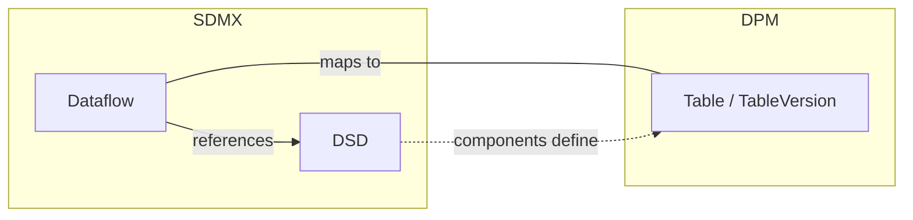
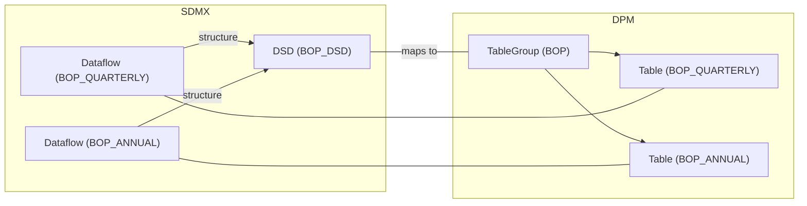
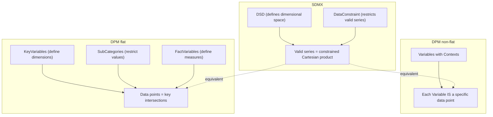

# 3. Detailed mapping rules

This chapter provides the detailed rules for each of the high-level correspondences described in chapter 2. Rather than mapping individual components one by one, the rules are organised around three conceptual levels:

1. **Container equivalence** — how the SDMX Dataflow + DSD pair maps to a DPM Table
2. **Structural composition** — how the DSD's components (dimensions, measures, attributes) relate to the Table's components (headers and variables)
3. **Data space definition** — how SDMX series constraints relate to DPM variables, with fundamentally different mechanisms for flat and non-flat tables

Throughout this chapter, a running example based on a balance-of-payments (BOP) statistical domain is used. The SDMX side defines a DSD with dimensions, a measure, and attributes, applied via Dataflows. The DPM side defines Tables with Headers, Variables, and Dimensions referencing the glossary.

> **Cross-references**: Identification, multilingual, and naming rules follow the general principles established in [Basics — Detailed Mapping Rules](../00_basics/02_detailed_mapping_rules.md). This chapter focuses on the structural and semantic aspects specific to data definition artefacts.


## 3.1 Dataflow + DSD ↔ Table

In SDMX, defining a data collection requires two artefacts working together:

- A **Data Structure Definition (DSD)** specifies the complete structure: which dimensions identify observations, what measures are collected, and what attributes describe the data.
- A **Dataflow** applies that DSD to a specific exchange context. Reporters submit data *against* a Dataflow, not directly against a DSD.

In the DPM, a single artefact — the **Table** (with its **TableVersion**) — serves both roles. A Table defines both the structural content (headers, cells, variables) and the exchange context (what reporters submit).



**Example**

*SDMX side*: A Dataflow `DF_BOP_QUARTERLY` references DSD `BOP_DSD`, which defines dimensions (FREQ, REF_AREA, BOP_ITEM, TIME_PERIOD), a measure (OBS_VALUE), and an attribute (OBS_STATUS).

```xml
<Dataflow id="DF_BOP_QUARTERLY" agencyID="ECB" version="1.0">
  <Name xml:lang="en">Balance of Payments — Quarterly</Name>
  <Structure>
    <Ref id="BOP_DSD" agencyID="ECB" version="1.0" class="DataStructureDefinition"/>
  </Structure>
</Dataflow>
```

*DPM side*: A single Table captures both the exchange context and the structural definition.

*Table*

| TableID | IsAbstract | HasOpenColumns | HasOpenRows | HasOpenSheets | IsNormalised | IsFlat |
| ------- | ---------- | -------------- | ----------- | ------------- | ------------ | ------ |
| 5001    | FALSE      | FALSE          | TRUE        | FALSE         | FALSE        | TRUE   |

*TableVersion*

| TableVID | TableID | KeyID | Code            | Name                              | StartReleaseID | EndReleaseID |
| -------- | ------- | ----- | --------------- | --------------------------------- | -------------- | ------------ |
| 5101     | 5001    | 8001  | BOP_QUARTERLY   | Balance of Payments — Quarterly   | 1              | NULL         |

The Dataflow `id` maps to `TableVersion.Code`. The DSD structural information is distributed across the Table's Headers, cells, and Variables (see section 3.2).

### 3.1.1 The `IsFlat` flag

The `Table.IsFlat` flag determines how the DSD structural information is captured and, consequently, the degree of interoperability with SDMX:

| IsFlat  | Description                                                                 | SDMX interoperability          |
|---------|-----------------------------------------------------------------------------|--------------------------------|
| `TRUE`  | Headers reference Properties directly. No Contexts. SDMX-like flat structure. | Natural mapping path           |
| `FALSE` | Variables identified through Contexts (dimensional signatures). Traditional DPM pattern. | No direct SDMX structural equivalent |

This distinction is fundamental and affects how components map in sections 3.2 and 3.3.

### 3.1.2 The 1:N case — one DSD, multiple Dataflows

When a DSD is shared across multiple Dataflows, the DSD maps to a **TableGroup** (with `Type = template`) containing the corresponding Tables:



*TableGroup*

| TableGroupID | Code | Name                 | Type           | ParentTableGroupID |
| ------------ | ---- | -------------------- | -------------- | ------------------ |
| 9001         | BOP  | Balance of Payments  | template       | NULL               |

*TableGroupComposition*

| TableGroupID | TableID | Order | StartReleaseID | EndReleaseID |
| ------------ | ------- | ----- | -------------- | ------------ |
| 9001         | 5001    | 1     | 1              | NULL         |
| 9001         | 5002    | 2     | 1              | NULL         |

The TableGroup is purely organisational — it does not carry structural definitions. The shared structure across Tables lives in reusable Headers and glossary Properties. When generating SDMX from a TableGroup, the DSD components are derived from the common structure of the grouped Tables.


## 3.2 DSD ↔ Table as structural collections

Both the DSD and the Table are **collections of typed components**. The structural parallel becomes clear when we examine what each contains.

### 3.2.1 DSD components

An SDMX DSD organises its components in three descriptors:

```
DSD
├── DimensionDescriptor
│   ├── Dimension(s)        — identify observations (series key)
│   └── TimeDimension       — special time identifier (at most one)
├── MeasureDescriptor
│   └── Measure(s)          — the observed/measured values
└── AttributeDescriptor
    └── DataAttribute(s)    — metadata describing the data
```

Each component references a **Concept** (semantic meaning) and has a **Representation** (enumerated via Codelist or non-enumerated via Facet).

**Example BOP DSD**

```xml
<DataStructureDefinition id="BOP_DSD" agencyID="ECB" version="1.0">
  <DataStructureComponents>
    <DimensionList id="DimensionDescriptor">
      <Dimension id="FREQ" position="1">
        <ConceptIdentity>
          <Ref id="FREQ" maintainableParentID="CS_ECB" agencyID="ECB"
               maintainableParentVersion="1.0" class="Concept"/>
        </ConceptIdentity>
        <LocalRepresentation>
          <Enumeration>
            <Ref id="CL_FREQ" agencyID="ECB" version="1.0" class="Codelist"/>
          </Enumeration>
        </LocalRepresentation>
      </Dimension>
      <Dimension id="REF_AREA" position="2">
        <ConceptIdentity>
          <Ref id="REF_AREA" maintainableParentID="CS_ECB" agencyID="ECB"
               maintainableParentVersion="1.0" class="Concept"/>
        </ConceptIdentity>
        <LocalRepresentation>
          <Enumeration>
            <Ref id="CL_COUNTRY" agencyID="ECB" version="1.0" class="Codelist"/>
          </Enumeration>
        </LocalRepresentation>
      </Dimension>
      <Dimension id="BOP_ITEM" position="3">
        <ConceptIdentity>
          <Ref id="BOP_ITEM" maintainableParentID="CS_ECB" agencyID="ECB"
               maintainableParentVersion="1.0" class="Concept"/>
        </ConceptIdentity>
        <LocalRepresentation>
          <Enumeration>
            <Ref id="CL_BOP_ITEM" agencyID="ECB" version="1.0" class="Codelist"/>
          </Enumeration>
        </LocalRepresentation>
      </Dimension>
      <TimeDimension id="TIME_PERIOD">
        <ConceptIdentity>
          <Ref id="TIME_PERIOD" maintainableParentID="CS_ECB" agencyID="ECB"
               maintainableParentVersion="1.0" class="Concept"/>
        </ConceptIdentity>
        <LocalRepresentation>
          <TextFormat textType="ObservationalTimePeriod"/>
        </LocalRepresentation>
      </TimeDimension>
    </DimensionList>
    <MeasureList id="MeasureDescriptor">
      <Measure id="OBS_VALUE" usage="mandatory">
        <ConceptIdentity>
          <Ref id="OBS_VALUE" maintainableParentID="CS_ECB" agencyID="ECB"
               maintainableParentVersion="1.0" class="Concept"/>
        </ConceptIdentity>
        <LocalRepresentation>
          <TextFormat textType="Decimal"/>
        </LocalRepresentation>
      </Measure>
    </MeasureList>
    <AttributeList id="AttributeDescriptor">
      <Attribute id="OBS_STATUS" usage="conditional">
        <ConceptIdentity>
          <Ref id="OBS_STATUS" maintainableParentID="CS_ECB" agencyID="ECB"
               maintainableParentVersion="1.0" class="Concept"/>
        </ConceptIdentity>
        <LocalRepresentation>
          <Enumeration>
            <Ref id="CL_OBS_STATUS" agencyID="ECB" version="1.0" class="Codelist"/>
          </Enumeration>
        </LocalRepresentation>
        <AttributeRelationship>
          <Observation/>
        </AttributeRelationship>
      </Attribute>
    </AttributeList>
  </DataStructureComponents>
</DataStructureDefinition>
```

### 3.2.2 Table components

A DPM Table organises its components through Headers linked to Variables. The compositional hierarchy depends on the `IsFlat` flag.

**Flat tables (`IsFlat = TRUE`)**

```
Table / TableVersion
├── Headers (IsKey = TRUE)
│   └── KeyVariable(s)          — identify data points (compound key)
├── Headers (IsKey = FALSE, fact)
│   └── FactVariable(s)         — the measured/reported values
└── Headers (IsAttribute = TRUE)
    └── AttributeVariable(s)    — metadata describing the data
```

Each Header references a **Property** (semantic meaning, via `PropertyID`) and optionally restricts values via a **SubCategory** (`SubCategoryVID`). Variables inherit their semantic meaning from the same Property.

**Non-flat tables (`IsFlat = FALSE`)**

```
Table / TableVersion
├── Headers
│   └── Cells (Category or Property cells)
└── Variables (identified by Context)
    ├── FactVariable(s)       — each with a Context (dimensional signature)
    ├── KeyVariable(s)        — part of CompoundKey
    └── AttributeVariable(s)  — referencing subject Variables
```

In non-flat tables, dimensions are not separate Headers but are embedded in each Variable's **Context** — a set of (Property, Item) pairs that form the Variable's dimensional signature. This difference fundamentally affects the series constraint mapping (section 3.3).

### 3.2.3 Component type correspondence

The parallel between DSD components and Table components (flat case) follows a consistent pattern:

| DSD component  | Table component                               | Semantic link     | Value domain                                 |
|----------------|-----------------------------------------------|-------------------|----------------------------------------------|
| Dimension      | Header (`IsKey=TRUE`) + KeyVariable           | Concept ↔ Property | Codelist ↔ Category + SubCategory            |
| TimeDimension  | Header (`IsKey=TRUE`) + KeyVariable with time Property | Concept ↔ Property | FacetValueType ↔ `Property.DataType = Date`  |
| Measure        | Header (`IsKey=FALSE`) + FactVariable         | Concept ↔ Property | Representation ↔ `Property.DataType`         |
| DataAttribute  | Header (`IsAttribute=TRUE`) + AttributeVariable | Concept ↔ Property | Codelist/Facet ↔ `Property.DataType` + SubCategory |

In all cases, the mapping follows the same two-level pattern:

1. **Semantic level**: The SDMX Concept maps to the DPM Property (see [glossary section 3.5](../01_glossary/03_detailed_mapping_rules.md#35-concept-property))
2. **Value domain level**: The SDMX Codelist/Facet maps to the DPM Category/DataType (see [glossary section 3.1](../01_glossary/03_detailed_mapping_rules.md#31-codelist-category))

> **Note on TimeDimension**: DPM has no dedicated time dimension type. SDMX distinguishes multiple time FacetValueTypes (`ObservationalTimePeriod`, `ReportingTimePeriod`, etc.); DPM collapses these into `Property.DataType = Date`. The DPM `Property.PeriodType` attribute (`stock`/`flow`) captures whether the time represents a point-in-time snapshot or a period aggregate — a distinction not modelled in SDMX at the component level.

> **Note on AttributeRelationship**: SDMX DataAttributes have an explicit `AttributeRelationship` (Observation, Dimension, Dataflow, Group, Measure) specifying the attachment level. In DPM, this relationship is implicit: an AttributeVariable references its subject (a FactVariable or KeyVariable) via a `ConceptRelation` of type `variable_attribute`. The SDMX `GroupRelationship` has no DPM equivalent.

### 3.2.4 Example: BOP DSD ↔ BOP Table (flat)

| Component         | DSD role                        | Table component                                       | Property             |
|-------------------|---------------------------------|-------------------------------------------------------|----------------------|
| FREQ              | Dimension (position 1)          | Header `IsKey=TRUE`, Direction=Row + KeyVariable      | Frequency            |
| REF_AREA          | Dimension (position 2)          | Header `IsKey=TRUE`, Direction=Row + KeyVariable      | Country              |
| BOP_ITEM          | Dimension (position 3)          | Header `IsKey=TRUE`, Direction=Row + KeyVariable      | BOP Item             |
| TIME_PERIOD       | TimeDimension                   | Header `IsKey=TRUE`, Direction=Column + KeyVariable   | Reference period (DataType=Date) |
| OBS_VALUE         | Measure (usage=mandatory)       | Header `IsKey=FALSE` + FactVariable                   | Observation value (IsMetric=TRUE) |
| OBS_STATUS        | DataAttribute (usage=conditional) | Header `IsAttribute=TRUE` + AttributeVariable       | Observation status   |

This shows the structural equivalence: the same information is captured, but organised differently — the DSD groups by component *type* (all dimensions together, all measures together), while the Table arranges by *axis* (row headers, column headers).


## 3.3 Series Constraints ↔ Variables

This section describes how the SDMX concept of *series and their constraints* maps to DPM *Variables*. The mapping has a fundamentally different character depending on whether the DPM table is flat or non-flat.

### 3.3.1 SDMX series and constraints

In SDMX, a **series** is a set of observations sharing the same key values. The **series key** is the ordered combination of all dimension values:

```
Series key = (FREQ=Q, REF_AREA=ES, BOP_ITEM=GOODS)
```

A **DataConstraint** restricts which series are valid within a Dataflow. The most common mechanism is the **CubeRegion**, which specifies allowed values per dimension:

```xml
<DataConstraint id="CON_BOP_QUARTERLY" agencyID="ECB" version="1.0"
                type="Allowed">
  <ConstraintAttachment>
    <Dataflow>
      <Ref id="DF_BOP_QUARTERLY" agencyID="ECB" version="1.0"/>
    </Dataflow>
  </ConstraintAttachment>
  <CubeRegion include="true">
    <MemberSelection id="REF_AREA">
      <MemberValue><Value>ES</Value></MemberValue>
      <MemberValue><Value>FR</Value></MemberValue>
      <MemberValue><Value>DE</Value></MemberValue>
    </MemberSelection>
    <MemberSelection id="FREQ">
      <MemberValue><Value>Q</Value></MemberValue>
    </MemberSelection>
  </CubeRegion>
</DataConstraint>
```

A series constraint is essentially a set of (dimension, code) pairs defining the valid data space. Together with the measure, it identifies what data can be reported.

### 3.3.2 Non-flat tables (`IsFlat = FALSE`): Variable = constrained series

In a non-flat DPM table, each **FactVariable** is identified by its **Context** — a set of (Property, Item) pairs forming the variable's dimensional signature:

```
Variable Context  = {(COUNTRY, ES), (BOP_ITEM, GOODS), (FREQ, Q)}
Variable Property = OBS_VALUE (IsMetric=TRUE)
```

This is structurally equivalent to a constrained series:

| SDMX                                                   | DPM (non-flat)                                           |
|---------------------------------------------------------|----------------------------------------------------------|
| Series key: `(FREQ=Q, REF_AREA=ES, BOP_ITEM=GOODS)`   | Context: `{(FREQ, Q), (COUNTRY, ES), (BOP_ITEM, GOODS)}` |
| Measure: `OBS_VALUE`                                    | Property: `OBS_VALUE` (`IsMetric=TRUE`)                   |
| DataConstraint restricts valid series                   | Each Variable **is** an explicitly defined "series"       |

The fundamental difference is in the approach to defining the data space:

- **SDMX defines an open dimensional space and then constrains it.** The data space is the Cartesian product of all dimension values, filtered by DataConstraints. Series that are not explicitly excluded are implicitly valid.
- **Non-flat DPM explicitly enumerates each valid data point as a Variable.** Each Variable's Context defines one specific point in the dimensional space. Only explicitly defined Variables can be reported.

This means:

- A DataConstraint's CubeRegion (a set of MemberSelections) corresponds to the **set of all Contexts** defined for the table's FactVariables.
- Each MemberValue within a MemberSelection is an Item that appears in at least one Variable's Context for that dimension.
- The total set of Variables defines the complete "valid series" space — there is no need for a separate constraint artefact.

### 3.3.3 Flat tables (`IsFlat = TRUE`): SubCategories as constraints

In a flat DPM table, there are no Contexts. Instead:

- **KeyVariables** define the dimensional space (analogous to SDMX Dimensions)
- **FactVariables** define the measures (analogous to SDMX Measures)
- **SubCategories** on Headers restrict which values are valid per dimension (analogous to SDMX CubeRegion MemberSelections)

| SDMX                          | DPM (flat)                                    |
|-------------------------------|-----------------------------------------------|
| DSD Dimension                 | Header (`IsKey=TRUE`) + KeyVariable           |
| DSD Measure                   | Header (`IsKey=FALSE`) + FactVariable         |
| CubeRegion MemberSelection    | SubCategory on Header                         |
| MemberValue                   | SubCategoryItem                               |
| `cascadeValues`               | Expanded SubCategoryItems (flattened)         |

The series constraint mapping for flat tables is direct and mechanical. Each MemberSelection maps to one SubCategory attached to the corresponding Header via `HeaderVersion.SubCategoryVID`:

**Example**

```
CubeRegion
  MemberSelection(REF_AREA)  →  SubCategory on REF_AREA Header
    MemberValue(ES)          →    SubCategoryItem(ES)
    MemberValue(FR)          →    SubCategoryItem(FR)
    MemberValue(DE)          →    SubCategoryItem(DE)
```

*SubCategory*

| SubCategoryID | Code            | Name                      |
| ------------- | --------------- | ------------------------- |
| 2001          | BOP_Q_REF_AREA  | BOP Quarterly — Countries |

*SubCategoryItem*

| SubCategoryVID | ItemID                                         | Label   |
| -------------- | ---------------------------------------------- | ------- |
| 2101           | Item for Code `ES` in Category `CL_COUNTRY`   | Spain   |
| 2101           | Item for Code `FR` in Category `CL_COUNTRY`   | France  |
| 2101           | Item for Code `DE` in Category `CL_COUNTRY`   | Germany |

Each MemberValue's `Value` is resolved to the corresponding Item in the Category mapped from the dimension's Codelist (see [glossary section 3.3](../01_glossary/03_detailed_mapping_rules.md#33-code-category-item)).

> **Note on `cascadeValues`**: The SDMX `cascadeValues` option includes child codes from hierarchies. In DPM, this maps to SubCategoryItem entries that include the specified Item and all its child Items (via `ParentItemID` in the Category's Item hierarchy). The expansion must be performed at mapping time — DPM SubCategoryItems are flat (each member is explicitly listed).

### 3.3.4 Summary: the dual nature

The mapping between series constraints and variables reveals the fundamental architectural difference between SDMX and DPM:



| Aspect               | SDMX                                      | DPM non-flat                              | DPM flat                                |
|----------------------|-------------------------------------------|-------------------------------------------|-----------------------------------------|
| Data space definition | DSD dimensions + constraints              | Variables with Contexts                   | KeyVariables + SubCategories            |
| Series identification | Series key (dimension values)             | Context (Property-Item pairs)             | Key intersection                        |
| Value restriction    | CubeRegion MemberSelections               | Implicit (each Variable is explicit)      | SubCategories on Headers                |
| Measure              | Measure component                         | Variable Property (`IsMetric`)            | FactVariable Property                   |
| Openness             | Open by default, constrained              | Closed by default, each Variable defined  | Depends on `HasOpenRows`/`Columns`      |

> **Note on DataKeySet**: SDMX also supports DataKeySet-based constraints that enumerate specific key combinations (rather than per-dimension value lists). For non-flat DPM tables, the explicit enumeration of Variables serves a similar purpose. For flat tables, there is no mechanism to specify valid key *combinations* (only per-dimension restrictions via SubCategories). DataKeySets must be handled through Operations or external documentation.

> **Note on `CubeRegion.include = false`**: Exclusion-based constraints (specifying which values are *not* allowed) have no direct DPM equivalent. SubCategories are always inclusive (they list allowed values). Exclusion logic must be handled through conventions or external documentation.
