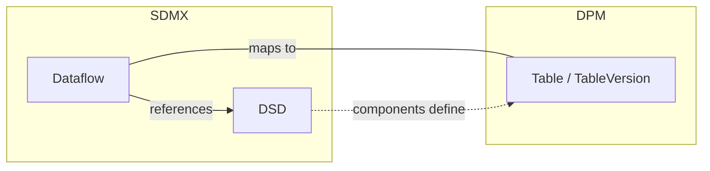
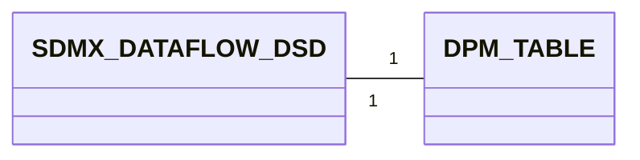
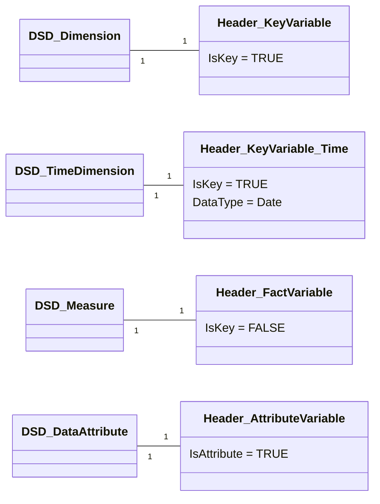
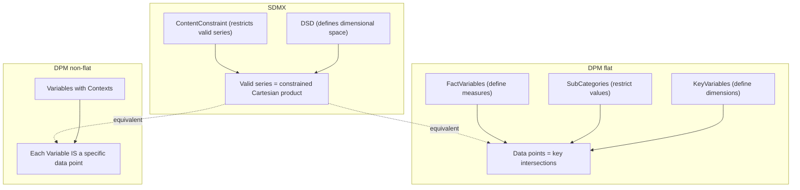
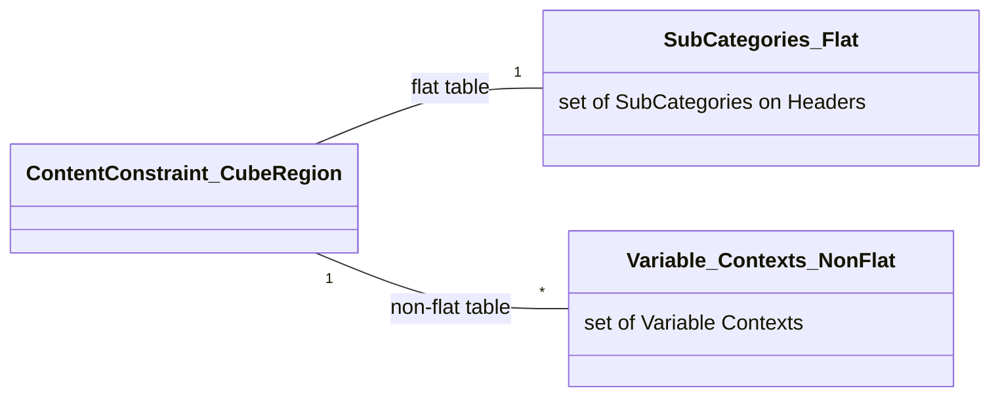

# 3. Detailed mapping rules

This chapter provides the detailed rules for each of the high-level correspondences described in chapter 2. Rather than mapping individual components one by one, the rules are organised around three conceptual levels:

1. **Container equivalence** — how the SDMX Dataflow + DSD pair maps to a DPM Table
2. **Structural composition** — how the DSD's components (dimensions, measures, attributes) relate to the Table's components (headers and variables)
3. **Data space definition** — how SDMX series constraints relate to DPM variables, with fundamentally different mechanisms for flat and non-flat tables

Throughout this chapter, a running example based on real artefacts from European banking supervision is used. The **SDMX side** uses the ECB's Consolidated Banking Data dataflow (`ECB:CBD2`), which transmits data reported under the FINREP framework. The standard SDMX→DPM mapping produces a **flat table** (`IsFlat = TRUE`) that preserves the DSD's dimensional structure directly. For comparison, the EBA's existing FINREP template `F_04.04.1` (*Breakdown of financial assets by instrument and by counterparty sector: financial assets at amortised cost*) is shown as an example of the non-flat approach.

> **Prerequisite — glossary mapping**: This chapter assumes that the glossary-level artefacts have already been mapped following [Glossary — Detailed Mapping Rules](../01_glossary/03_detailed_mapping_rules.md). Concretely, this means that for every DSD component:
>
> - Each **Codelist** has been mapped to a **Category**, and each **Code** to an **Item** within that Category ([glossary 3.1](../01_glossary/03_detailed_mapping_rules.md#31-codelist-category), [3.3](../01_glossary/03_detailed_mapping_rules.md#33-code-category-item)).
> - Each **Concept** has been mapped to a **Property** ([glossary 3.5](../01_glossary/03_detailed_mapping_rules.md#35-concept-property)).
>
> The data definition mapping rules below reference these already-existing Properties, Categories, and Items — they do not create them. For example, when a DSD Dimension references Concept `FREQ` and Codelist `CL_FREQ`, this chapter assumes that Property `FREQ` and Category `CL_FREQ` (with its Items) already exist in the DPM glossary.

> **Cross-references**: Identification, multilingual, and naming rules follow the general principles established in [Basics — Detailed Mapping Rules](../00_basics/02_detailed_mapping_rules.md). This chapter focuses on the structural and semantic aspects specific to data definition artefacts.


## 3.1 Dataflow + DSD ↔ Table

In SDMX, defining a data collection requires two artefacts working together:

- A **Data Structure Definition (DSD)** specifies the complete structure: which dimensions identify observations, what measures are collected, and what attributes describe the data.
- A **Dataflow** applies that DSD to a specific exchange context. Reporters submit data *against* a Dataflow, not directly against a DSD.

In the DPM, a single artefact — the **Table** (with its **TableVersion**) — serves both roles. A Table defines both the structural content (headers, cells, variables) and the exchange context (what reporters submit).



**Example**

*SDMX side*: The ECB publishes a Dataflow `CBD2` referencing DSD `ECB_CBD2`, which defines 16 dimensions (including FREQ, REF_AREA, BS_COUNT_SECTOR, CB_ITEM, CB_PORTFOLIO, etc.), a primary measure (OBS_VALUE), and 19 attributes (including OBS_STATUS, CONF_STATUS, DECIMALS).

```xml
<Dataflow agencyID="ECB" id="CBD2" version="1.0">
  <Name xml:lang="en">Consolidated Banking data</Name>
  <Structure>
    <Ref agencyID="ECB" id="ECB_CBD2" version="1.0" class="DataStructure"/>
  </Structure>
</Dataflow>
```

*DPM side*: The standard mapping produces a flat table where each DSD component becomes a Header + Variable:

*Table*

| TableID | IsAbstract | HasOpenColumns | HasOpenRows | HasOpenSheets | IsNormalised | IsFlat |
| ------- | ---------- | -------------- | ----------- | ------------- | ------------ | ------ |
| 1001    | FALSE      | FALSE          | TRUE        | FALSE         | FALSE        | TRUE   |

*TableVersion*

| TableVID | TableID | KeyID | Code | Name                       | StartReleaseID | EndReleaseID |
| -------- | ------- | ----- | ---- | -------------------------- | -------------- | ------------ |
| 1101     | 1001    | 8001  | CBD2 | Consolidated Banking data  | 1              | NULL         |

The Dataflow `id` maps to `TableVersion.Code`. The DSD structural information is distributed across the Table's Headers and Variables (see section 3.2), with each DSD dimension becoming a key Header + KeyVariable, each measure becoming a fact Header + FactVariable, and each attribute becoming an attribute Header + AttributeVariable.

### 3.1.1 The `IsFlat` flag

The `Table.IsFlat` flag determines how the DSD structural information is captured and, consequently, the degree of interoperability with SDMX:

| IsFlat  | Description                                                                 | SDMX interoperability          |
|---------|-----------------------------------------------------------------------------|--------------------------------|
| `TRUE`  | Headers reference Properties directly. No Contexts. SDMX-like flat structure. | Natural mapping path           |
| `FALSE` | Variables identified through Contexts (dimensional signatures). Traditional DPM pattern. | No direct SDMX structural equivalent |

This distinction is fundamental and affects how components map in sections 3.2 and 3.3.

> **Note**: In the current EBA DPM (v4.2), all 1062 tables use `IsFlat = FALSE`. These tables were designed independently of SDMX, following the traditional DPM pattern where the grid layout and dimensional Contexts carry domain-specific meaning.
>
> The standard mapping path from SDMX to DPM should produce **flat tables** (`IsFlat = TRUE`). The SDMX DSD is inherently flat — dimensions, measures, and attributes are typed components in a single list — and the flat DPM table preserves this structure directly: each DSD component maps 1:1 to a Header + Variable of the corresponding type (key, fact, or attribute). This avoids the need to design header hierarchies, compose Variable Contexts, or define a codification scheme to translate between compositional contexts and flat dimension codes. The flat approach minimises conventions and produces a mechanical, reversible mapping.
>
> This chapter covers both flat and non-flat cases. The flat case is the recommended path for SDMX-originated structures; the non-flat case is documented for interoperability with existing DPM tables.

### 3.1.2 Mapping cardinality



- From SDMX to DPM: One Dataflow (together with its referenced DSD) maps to one Table (with its TableVersion). The DSD alone does not map — it must be applied through a Dataflow.
- From DPM to SDMX: One Table maps to one Dataflow + DSD pair. If multiple Tables share identical structure, they MAY share a single DSD with multiple Dataflows.

### 3.1.3 Attributes equivalence

#### 3.1.3.1 SDMX Dataflow attributes
- maintainable artefact attributes (see [Identification mapping rules](../00_basics/02_detailed_mapping_rules.md#22-identification-dpm-ids-vs-sdmx-urns))
    - `id`
    - `agencyID`
    - `version`
- `Name` (multilingual)
- `Description` (multilingual)
- `Structure` (reference to DSD)

#### 3.1.3.2 SDMX DSD attributes
- maintainable artefact attributes
    - `id`
    - `agencyID`
    - `version`
- `Name` (multilingual)
- `Description` (multilingual)

#### 3.1.3.3 DPM Table / TableVersion attributes
- `Table.TableID`
- `Table.IsAbstract`
- `Table.HasOpenColumns`
- `Table.HasOpenRows`
- `Table.HasOpenSheets`
- `Table.IsNormalised`
- `Table.IsFlat`
- `TableVersion.TableVID`
- `TableVersion.TableID`
- `TableVersion.KeyID`
- `TableVersion.Code`
- `TableVersion.Name`
- `TableVersion.StartReleaseID`, `EndReleaseID`

#### 3.1.3.4 Mapping details

| SDMX                              | DPM                                  | Notes                                                  |
|------------------------------------|--------------------------------------|--------------------------------------------------------|
| Dataflow.`id`                      | TableVersion.`Code`                  | The Dataflow id becomes the Table's identifying code   |
| Dataflow.`Name`                    | TableVersion.`Name`                  | Multilingual mapping via [general rules](../00_basics/02_detailed_mapping_rules.md#23-multilingual-support-internationalstring-vs-translations) |
| Dataflow.`Description`             | — (no direct equivalent)             | May be stored as extended metadata                     |
| Dataflow.`Structure` (DSD ref)     | — (structural content distributed)   | DSD components map to Headers + Variables (section 3.2) |
| DSD.`id`                           | — (no separate artefact)             | Absorbed into Table                                    |
| DSD structural content             | Headers, Variables, CompoundKey      | See section 3.2 for component-level mapping            |
| — (not applicable)                 | Table.`IsFlat` = TRUE                | Standard mapping always produces flat tables           |
| — (not applicable)                 | Table.`HasOpenRows` = TRUE           | SDMX data spaces are open by default                   |
| — (not applicable)                 | Table.`HasOpenColumns`               | DPM-specific flag                                      |
| — (not applicable)                 | Table.`IsNormalised`                 | DPM-specific flag                                      |

> **Note**: The mapping of multilingual `Name` and `Description` attributes follows the general rules described in [Multilingual support](../00_basics/02_detailed_mapping_rules.md#23-multilingual-support-internationalstring-vs-translations).

### 3.1.4 Example Mapping SDMX ==> DPM

Starting from the CBD2 Dataflow and its referenced DSD:

```xml
<Dataflow agencyID="ECB" id="CBD2" version="1.0">
  <Name xml:lang="en">Consolidated Banking data</Name>
  <Structure>
    <Ref agencyID="ECB" id="ECB_CBD2" version="1.0" class="DataStructure"/>
  </Structure>
</Dataflow>
```

The mapping produces the following DPM artefacts:

*Table*

| TableID | IsAbstract | HasOpenColumns | HasOpenRows | HasOpenSheets | IsNormalised | IsFlat |
| ------- | ---------- | -------------- | ----------- | ------------- | ------------ | ------ |
| 1001    | FALSE      | FALSE          | TRUE        | FALSE         | FALSE        | TRUE   |

- `IsFlat = TRUE` because the standard mapping preserves the DSD's flat dimensional structure. Each DSD component becomes a separate Header + Variable.
- `HasOpenRows = TRUE` because the SDMX data space is open by default — new series can be added without changing the structure. The ContentConstraint (section 3.3) restricts which series are valid, but the table structure itself allows growth.

*TableVersion*

| TableVID | TableID | KeyID | Code | Name                       | StartReleaseID | EndReleaseID |
| -------- | ------- | ----- | ---- | -------------------------- | -------------- | ------------ |
| 1101     | 1001    | 8001  | CBD2 | Consolidated Banking data  | 1              | NULL         |

- `Code` = `CBD2` derived from Dataflow.`id`.
- `Name` = Dataflow.`Name`.
- `KeyID` = 8001 references the CompoundKey capturing the DSD's dimension structure.

The DSD's structural components (dimensions, measure, attributes) are mapped to Headers and Variables — see section 3.2.7 for the worked component-level example.

### 3.1.5 Example Mapping DPM ==> SDMX

Starting from the EBA's existing FINREP template F_04.04.1:

*Table*

| TableID | IsAbstract | HasOpenColumns | HasOpenRows | HasOpenSheets | IsNormalised | IsFlat |
| ------- | ---------- | -------------- | ----------- | ------------- | ------------ | ------ |
| 406     | FALSE      | FALSE          | FALSE       | FALSE         | FALSE        | FALSE  |

*TableVersion* (release 4.2)

| TableVID | TableID | KeyID | Code      | Name                                                                                                      | StartReleaseID | EndReleaseID |
| -------- | ------- | ----- | --------- | --------------------------------------------------------------------------------------------------------- | -------------- | ------------ |
| 6476     | 406     | NULL  | F_04.04.1 | Breakdown of financial assets by instrument and by counterparty sector: financial assets at amortised cost | 5 (v4.2)       | NULL         |

The mapping produces the following SDMX artefacts:

```xml
<!-- 1. Generate the DSD from the Table's Variables and Contexts -->
<DataStructureDefinition agencyID="EBA" id="DSD_F_04_04_1" version="1.0">
  <Name xml:lang="en">Breakdown of financial assets by instrument and by
    counterparty sector: financial assets at amortised cost</Name>
  <DataStructureComponents>
    <!-- Components derived from Variable Context properties
         — see section 3.2.8 -->
  </DataStructureComponents>
</DataStructureDefinition>

<!-- 2. Generate the Dataflow referencing the DSD -->
<Dataflow agencyID="EBA" id="DF_F_04_04_1" version="1.0">
  <Name xml:lang="en">Breakdown of financial assets by instrument and by
    counterparty sector: financial assets at amortised cost</Name>
  <Structure>
    <Ref agencyID="EBA" id="DSD_F_04_04_1" version="1.0"
         class="DataStructure"/>
  </Structure>
</Dataflow>
```

- Dataflow.`id` = derived from `TableVersion.Code` = `DF_F_04_04_1`.
- DSD.`id` = `DSD_F_04_04_1` — derived by convention from the Table code.
- Dataflow.`Name` = `TableVersion.Name`.
- Since F_04.04.1 is non-flat, DSD dimensions must be reconstructed from the Context properties across all 180 Variables (section 3.2.8). This requires a codification scheme to consolidate compositional contexts into flat SDMX dimension codes.


## 3.2 DSD ↔ Table as structural collections

Both the DSD and the Table are **collections of typed components**. The structural parallel becomes clear when we examine what each contains.

### 3.2.1 DSD components

An SDMX DSD organises its components in three descriptors:

```
DSD
├── DimensionDescriptor
│   ├── Dimension(s)        — identify observations (series key)
│   └── TimeDimension       — special time identifier (at most one)
├── MeasureDescriptor
│   └── Measure(s)          — the observed/measured values
└── AttributeDescriptor
    └── DataAttribute(s)    — metadata describing the data
```

Each component references a **Concept** (semantic meaning) and has a **Representation** (enumerated via Codelist or non-enumerated via Facet).

**Example: ECB_CBD2 DSD**

The DSD `ECB:ECB_CBD2(1.0)` defines 16 dimensions, a TimeDimension, 1 primary measure, and 19 attributes. The following XML shows a representative subset (6 of 16 dimensions, the TimeDimension, the measure, and 2 attributes):

```xml
<DataStructureDefinition agencyID="ECB" id="ECB_CBD2" version="1.0">
  <Name xml:lang="en">Statistics on Consolidated Banking Data</Name>
  <DataStructureComponents>
    <DimensionList id="DimensionDescriptor">
      <Dimension id="FREQ" position="1">
        <ConceptIdentity>
          <Ref id="FREQ" maintainableParentID="ECB_CONCEPTS"
               agencyID="ECB" maintainableParentVersion="1.0" class="Concept"/>
        </ConceptIdentity>
        <LocalRepresentation>
          <Enumeration>
            <Ref id="CL_FREQ" agencyID="ECB" version="1.0" class="Codelist"/>
          </Enumeration>
        </LocalRepresentation>
      </Dimension>
      <Dimension id="REF_AREA" position="2">
        <ConceptIdentity>
          <Ref id="REF_AREA" maintainableParentID="ECB_CONCEPTS"
               agencyID="ECB" maintainableParentVersion="1.0" class="Concept"/>
        </ConceptIdentity>
        <LocalRepresentation>
          <Enumeration>
            <Ref id="CL_AREA" agencyID="ECB" version="1.0" class="Codelist"/>
          </Enumeration>
        </LocalRepresentation>
      </Dimension>
      <Dimension id="BS_COUNT_SECTOR" position="5">
        <ConceptIdentity>
          <Ref id="BS_COUNT_SECTOR" maintainableParentID="ECB_CONCEPTS"
               agencyID="ECB" maintainableParentVersion="1.0" class="Concept"/>
        </ConceptIdentity>
        <LocalRepresentation>
          <Enumeration>
            <Ref id="CL_SECTOR" agencyID="ECB" version="1.0" class="Codelist"/>
          </Enumeration>
        </LocalRepresentation>
      </Dimension>
      <Dimension id="CB_REP_FRAMEWRK" position="8">
        <ConceptIdentity>
          <Ref id="CB_REP_FRAMEWRK" maintainableParentID="ECB_CONCEPTS"
               agencyID="ECB" maintainableParentVersion="1.0" class="Concept"/>
        </ConceptIdentity>
        <LocalRepresentation>
          <Enumeration>
            <Ref id="CL_CB_REP_FRAMEWRK" agencyID="ECB" version="1.0"
                 class="Codelist"/>
          </Enumeration>
        </LocalRepresentation>
      </Dimension>
      <Dimension id="CB_ITEM" position="9">
        <ConceptIdentity>
          <Ref id="CB_ITEM" maintainableParentID="ECB_CONCEPTS"
               agencyID="ECB" maintainableParentVersion="1.0" class="Concept"/>
        </ConceptIdentity>
        <LocalRepresentation>
          <Enumeration>
            <Ref id="CL_CB_ITEM" agencyID="ECB" version="1.0" class="Codelist"/>
          </Enumeration>
        </LocalRepresentation>
      </Dimension>
      <Dimension id="CB_PORTFOLIO" position="10">
        <ConceptIdentity>
          <Ref id="CB_PORTFOLIO" maintainableParentID="ECB_CONCEPTS"
               agencyID="ECB" maintainableParentVersion="1.0" class="Concept"/>
        </ConceptIdentity>
        <LocalRepresentation>
          <Enumeration>
            <Ref id="CL_CB_PORTFOLIO" agencyID="ECB" version="1.0"
                 class="Codelist"/>
          </Enumeration>
        </LocalRepresentation>
      </Dimension>
      <!-- Dimensions 3,4,6,7,11–16 omitted for brevity -->
      <TimeDimension id="TIME_PERIOD" position="17">
        <ConceptIdentity>
          <Ref id="TIME_PERIOD" maintainableParentID="ECB_CONCEPTS"
               agencyID="ECB" maintainableParentVersion="1.0" class="Concept"/>
        </ConceptIdentity>
        <LocalRepresentation>
          <TextFormat textType="ObservationalTimePeriod"/>
        </LocalRepresentation>
      </TimeDimension>
    </DimensionList>
    <MeasureList id="MeasureDescriptor">
      <Measure id="OBS_VALUE">
        <ConceptIdentity>
          <Ref id="OBS_VALUE" maintainableParentID="ECB_CONCEPTS"
               agencyID="ECB" maintainableParentVersion="1.0" class="Concept"/>
        </ConceptIdentity>
        <LocalRepresentation>
          <TextFormat textType="String" maxLength="30"/>
        </LocalRepresentation>
      </Measure>
    </MeasureList>
    <AttributeList id="AttributeDescriptor">
      <Attribute id="OBS_STATUS" assignmentStatus="Mandatory">
        <ConceptIdentity>
          <Ref id="OBS_STATUS" maintainableParentID="ECB_CONCEPTS"
               agencyID="ECB" maintainableParentVersion="1.0" class="Concept"/>
        </ConceptIdentity>
        <LocalRepresentation>
          <Enumeration>
            <Ref id="CL_OBS_STATUS" agencyID="ECB" version="1.0"
                 class="Codelist"/>
          </Enumeration>
        </LocalRepresentation>
        <AttributeRelationship>
          <PrimaryMeasure><Ref id="OBS_VALUE"/></PrimaryMeasure>
        </AttributeRelationship>
      </Attribute>
      <Attribute id="CONF_STATUS" assignmentStatus="Conditional">
        <ConceptIdentity>
          <Ref id="CONF_STATUS" maintainableParentID="ECB_CONCEPTS"
               agencyID="ECB" maintainableParentVersion="1.0" class="Concept"/>
        </ConceptIdentity>
        <LocalRepresentation>
          <Enumeration>
            <Ref id="CL_CONF_STATUS" agencyID="ECB" version="1.0"
                 class="Codelist"/>
          </Enumeration>
        </LocalRepresentation>
        <AttributeRelationship>
          <PrimaryMeasure><Ref id="OBS_VALUE"/></PrimaryMeasure>
        </AttributeRelationship>
      </Attribute>
      <!-- 17 additional attributes omitted for brevity -->
    </AttributeList>
  </DataStructureComponents>
</DataStructureDefinition>
```

**Complete dimension list** (for reference):

| Position | Dimension ID     | Codelist               | Description                          |
| -------- | ---------------- | ---------------------- | ------------------------------------ |
| 1        | FREQ             | CL_FREQ                | Frequency                            |
| 2        | REF_AREA         | CL_AREA                | Reporting area                       |
| 3        | COUNT_AREA       | CL_AREA                | Counterparty area                    |
| 4        | CB_REP_SECTOR    | CL_CB_REP_SECTOR       | Reporting sector                     |
| 5        | BS_COUNT_SECTOR  | CL_SECTOR              | Counterparty sector                  |
| 6        | BS_NFC_ACTIVITY  | CL_ACTIVITY            | NFC economic activity                |
| 7        | CB_SECTOR_SIZE   | CL_CB_SECTOR_SIZE      | Sector size                          |
| 8        | CB_REP_FRAMEWRK  | CL_CB_REP_FRAMEWRK     | Reporting framework (FINREP/COREP)   |
| 9        | CB_ITEM          | CL_CB_ITEM             | Data item (411 codes)                |
| 10       | CB_PORTFOLIO     | CL_CB_PORTFOLIO        | Accounting portfolio                 |
| 11       | CB_EXP_TYPE      | CL_CB_EXP_TYPE         | Exposure type                        |
| 12       | CB_VAL_METHOD    | CL_CB_VAL_METHOD       | Valuation method                     |
| 13       | MATURITY_RES     | CL_MATURITY            | Residual maturity                    |
| 14       | DATA_TYPE        | CL_FSENTRY             | Data type                            |
| 15       | CURRENCY_TRANS   | CL_CURRENCY            | Currency of transaction              |
| 16       | UNIT_MEASURE     | CL_UNIT                | Unit of measure                      |
| 17       | TIME_PERIOD      | *(ObservationalTimePeriod)* | Time period                      |

### 3.2.2 Table components

A DPM Table organises its components through Headers linked to Variables. The compositional hierarchy depends on the `IsFlat` flag.

**Flat tables (`IsFlat = TRUE`)** — standard mapping from SDMX

```
Table / TableVersion
├── Headers (IsKey = TRUE)
│   └── KeyVariable(s)          — identify data points (compound key)
├── Headers (IsKey = FALSE, fact)
│   └── FactVariable(s)         — the measured/reported values
└── Headers (IsAttribute = TRUE)
    └── AttributeVariable(s)    — metadata describing the data
```

Each Header references a **Property** (semantic meaning, via `PropertyID`) and optionally restricts values via a **SubCategory** (`SubCategoryVID`). Variables inherit their semantic meaning from the same Property.

**Non-flat tables (`IsFlat = FALSE`)** — traditional DPM pattern

```
Table / TableVersion
├── Headers
│   └── Cells (Category or Property cells)
└── Variables (identified by Context)
    ├── FactVariable(s)       — each with a Context (dimensional signature)
    ├── KeyVariable(s)        — part of CompoundKey
    └── AttributeVariable(s)  — referencing subject Variables
```

In non-flat tables, dimensions are not separate Headers but are embedded in each Variable's **Context** — a set of (Property, Item) pairs that form the Variable's dimensional signature. This difference fundamentally affects the series constraint mapping (section 3.3).

### 3.2.3 Component type correspondence

The parallel between DSD components and Table components (flat case) follows a consistent pattern:

| DSD component  | Table component                               | Semantic link     | Value domain                                 |
|----------------|-----------------------------------------------|-------------------|----------------------------------------------|
| Dimension      | Header (`IsKey=TRUE`) + KeyVariable           | Concept ↔ Property | Codelist ↔ Category + SubCategory            |
| TimeDimension  | Header (`IsKey=TRUE`) + KeyVariable with time Property | Concept ↔ Property | FacetValueType ↔ `Property.DataType = Date`  |
| Measure        | Header (`IsKey=FALSE`) + FactVariable         | Concept ↔ Property | Representation ↔ `Property.DataType`         |
| DataAttribute  | Header (`IsAttribute=TRUE`) + AttributeVariable | Concept ↔ Property | Codelist/Facet ↔ `Property.DataType` + SubCategory |

In all cases, the mapping follows the same two-level pattern:

1. **Semantic level**: The SDMX Concept has already been mapped to the DPM Property ([glossary 3.5](../01_glossary/03_detailed_mapping_rules.md#35-concept-property))
2. **Value domain level**: The SDMX Codelist/Facet has already been mapped to the DPM Category/DataType ([glossary 3.1](../01_glossary/03_detailed_mapping_rules.md#31-codelist-category))

> **Note on TimeDimension**: DPM has no dedicated time dimension type. SDMX distinguishes multiple time FacetValueTypes (`ObservationalTimePeriod`, `ReportingTimePeriod`, etc.); DPM collapses these into `Property.DataType = Date`. The DPM `Property.PeriodType` attribute (`stock`/`flow`) captures whether the time represents a point-in-time snapshot or a period aggregate — a distinction not modelled in SDMX at the component level.

> **Note on AttributeRelationship**: SDMX DataAttributes have an explicit `AttributeRelationship` (Observation, Dimension, Dataflow, Group, Measure) specifying the attachment level. In DPM, this relationship is implicit: an AttributeVariable references its subject (a FactVariable or KeyVariable) via a `ConceptRelation` of type `variable_attribute`. The SDMX `GroupRelationship` has no DPM equivalent.

### 3.2.4 Example: ECB_CBD2 DSD ↔ flat Table

In a flat table, each DSD component maps directly to a Header + Variable. The following table shows the correspondence for a representative subset of the CBD2 DSD components:

| Component         | DSD role                        | Table component                                   | Property             |
|-------------------|---------------------------------|---------------------------------------------------|----------------------|
| FREQ              | Dimension (position 1)          | Header `IsKey=TRUE`, Order=1 + KeyVariable        | Frequency            |
| REF_AREA          | Dimension (position 2)          | Header `IsKey=TRUE`, Order=2 + KeyVariable        | Reporting area       |
| BS_COUNT_SECTOR   | Dimension (position 5)          | Header `IsKey=TRUE`, Order=5 + KeyVariable        | Counterparty sector  |
| CB_REP_FRAMEWRK   | Dimension (position 8)          | Header `IsKey=TRUE`, Order=8 + KeyVariable        | Reporting framework  |
| CB_ITEM           | Dimension (position 9)          | Header `IsKey=TRUE`, Order=9 + KeyVariable        | Data item            |
| CB_PORTFOLIO      | Dimension (position 10)         | Header `IsKey=TRUE`, Order=10 + KeyVariable       | Accounting portfolio |
| TIME_PERIOD       | TimeDimension (position 17)     | Header `IsKey=TRUE`, Order=17 + KeyVariable       | Time period (DataType=Date) |
| OBS_VALUE         | Measure                         | Header `IsKey=FALSE` + FactVariable               | Observation value (IsMetric=TRUE) |
| OBS_STATUS        | DataAttribute (Mandatory)       | Header `IsAttribute=TRUE` + AttributeVariable     | Observation status   |
| CONF_STATUS       | DataAttribute (Conditional)     | Header `IsAttribute=TRUE` + AttributeVariable     | Confidentiality status |

This shows the structural equivalence: every DSD component has a 1:1 counterpart in the flat table. The DSD groups by component *type* (all dimensions together, all measures together), while the Table arranges components as Headers in a single flat list.

> **Note on non-flat tables**: In the existing EBA DPM, table F_04.04.1 represents the same data domain using a non-flat structure. The 16 DSD dimensions are not exposed as separate key Headers. Instead, multiple DPM Context properties (e.g., Accounting items, Type of financial instruments, Counterparty sector, Accounting portfolio) encode the dimensional coordinates of each cell. Four metric Properties (Carrying amount, Gross carrying amount, Impairment, Amount of write-offs) replace the single `OBS_VALUE` measure. This non-flat approach requires a codification scheme to map between compositional contexts and flat SDMX dimension codes.

### 3.2.5 Mapping cardinality

Each DSD component type maps 1:1 to its corresponding Table component:



- **Dimension** (1:1) ↔ Header (`IsKey=TRUE`) + KeyVariable. Each DSD Dimension becomes one Header with its associated KeyVariable, and vice versa.
- **TimeDimension** (1:1) ↔ Header (`IsKey=TRUE`) + KeyVariable with a time-typed Property. The SDMX time types (`ObservationalTimePeriod`, etc.) are collapsed to `Property.DataType = Date`.
- **Measure** (1:1) ↔ Header (`IsKey=FALSE`) + FactVariable. The measure's concept and representation map to the FactVariable's Property and DataType.
- **DataAttribute** (1:1) ↔ Header (`IsAttribute=TRUE`) + AttributeVariable. The attribute's attachment level is implicit in DPM (via `ConceptRelation`).

> **Note**: The 1:1 cardinality holds for the flat table case. For non-flat tables, DSD components do not map to separate Headers but instead form part of each Variable's Context (see section 3.3).

### 3.2.6 Attributes equivalence

#### 3.2.6.1 Dimension ↔ Header + KeyVariable

| SDMX Dimension attribute                        | DPM equivalent                              | Notes |
|--------------------------------------------------|---------------------------------------------|-------|
| `id`                                             | Header cell code / KeyVariable.`Code`       | Component identifier |
| `position`                                       | Header cell order                           | Position in the series key |
| `ConceptIdentity` → Concept                      | Header.`PropertyID` → Property              | Already mapped per [glossary 3.5](../01_glossary/03_detailed_mapping_rules.md#35-concept-property) |
| `LocalRepresentation` → Codelist                 | Property.`CategoryID` → Category            | Already mapped per [glossary 3.1](../01_glossary/03_detailed_mapping_rules.md#31-codelist-category) |
| `LocalRepresentation` → Codelist (value subset)  | HeaderVersion.`SubCategoryVID` → SubCategory | Value restriction (see section 3.3) |

#### 3.2.6.2 TimeDimension ↔ Header + KeyVariable

| SDMX TimeDimension attribute                     | DPM equivalent                              | Notes |
|--------------------------------------------------|---------------------------------------------|-------|
| `id` (always `TIME_PERIOD`)                      | Header cell code / KeyVariable.`Code`       | |
| `ConceptIdentity` → Concept                      | Header.`PropertyID` → Property              | Property with `DataType = Date` |
| `LocalRepresentation` → `TextFormat.textType`    | Property.`DataType` = Date                  | All SDMX time types collapse to Date |
| — (not applicable)                               | Property.`PeriodType` (`stock`/`flow`)      | DPM-specific distinction |

#### 3.2.6.3 Measure ↔ Header + FactVariable

| SDMX Measure attribute                           | DPM equivalent                              | Notes |
|--------------------------------------------------|---------------------------------------------|-------|
| `id`                                             | Header cell code / FactVariable.`Code`      | |
| `usage` (`mandatory`/`conditional`)              | — (implicit in DPM)                         | All FactVariables in a flat table are reported |
| `ConceptIdentity` → Concept                      | Header.`PropertyID` → Property              | Property with `IsMetric = TRUE` |
| `LocalRepresentation` → TextFormat               | Property.`DataType`                         | e.g., `Decimal`, `Integer` |

#### 3.2.6.4 DataAttribute ↔ Header + AttributeVariable

| SDMX DataAttribute attribute                     | DPM equivalent                              | Notes |
|--------------------------------------------------|---------------------------------------------|-------|
| `id`                                             | Header cell code / AttributeVariable.`Code` | |
| `usage` (`mandatory`/`conditional`)              | — (conventions may apply)                   | DPM does not enforce attribute optionality at the structural level |
| `ConceptIdentity` → Concept                      | Header.`PropertyID` → Property              | Already mapped per [glossary 3.5](../01_glossary/03_detailed_mapping_rules.md#35-concept-property) |
| `LocalRepresentation` → Codelist                 | Property.`CategoryID` → Category            | Already mapped per [glossary 3.1](../01_glossary/03_detailed_mapping_rules.md#31-codelist-category) |
| `LocalRepresentation` → TextFormat               | Property.`DataType`                         | For non-enumerated attributes |
| `AttributeRelationship` (Observation, Dimension, etc.) | ConceptRelation (`variable_attribute`)  | Attachment level is implicit in DPM |
| `AttributeRelationship` → `GroupRelationship`    | — (no DPM equivalent)                       | |

### 3.2.7 Example Mapping SDMX ==> DPM

Starting from the ECB_CBD2 DSD (section 3.2.1), the standard flat mapping produces the following DPM artefacts. A representative subset of components is shown (6 of 16 dimensions, the TimeDimension, 1 measure, and 2 attributes).

**Step 1 — Create Headers**

Each DSD component becomes a Header:

*Header*

| HeaderID | TableVID | IsKey | IsAttribute |
| -------- | -------- | ----- | ----------- |
| 6001     | 1101     | TRUE  | FALSE       |
| 6002     | 1101     | TRUE  | FALSE       |
| 6005     | 1101     | TRUE  | FALSE       |
| 6008     | 1101     | TRUE  | FALSE       |
| 6009     | 1101     | TRUE  | FALSE       |
| 6010     | 1101     | TRUE  | FALSE       |
| 6017     | 1101     | TRUE  | FALSE       |
| 6018     | 1101     | FALSE | FALSE       |
| 6019     | 1101     | FALSE | TRUE        |
| 6020     | 1101     | FALSE | TRUE        |

*HeaderVersion* (with references to already-mapped Properties and Categories)

| HeaderVID | HeaderID | PropertyID → Property  | SubCategoryVID | Order | Code            | StartReleaseID | EndReleaseID |
| --------- | -------- | ---------------------- | -------------- | ----- | --------------- | -------------- | ------------ |
| 6101      | 6001     | Property `FREQ`        | 2001           | 1     | FREQ            | 1              | NULL         |
| 6102      | 6002     | Property `REF_AREA`    | 2002           | 2     | REF_AREA        | 1              | NULL         |
| 6105      | 6005     | Property `BS_COUNT_SECTOR` | 2005       | 5     | BS_COUNT_SECTOR | 1              | NULL         |
| 6108      | 6008     | Property `CB_REP_FRAMEWRK` | 2008       | 8     | CB_REP_FRAMEWRK | 1              | NULL         |
| 6109      | 6009     | Property `CB_ITEM`     | 2009           | 9     | CB_ITEM         | 1              | NULL         |
| 6110      | 6010     | Property `CB_PORTFOLIO` | 2010          | 10    | CB_PORTFOLIO    | 1              | NULL         |
| 6117      | 6017     | Property `TIME_PERIOD` | NULL           | 17    | TIME_PERIOD     | 1              | NULL         |
| 6118      | 6018     | Property `OBS_VALUE`   | NULL           | 18    | OBS_VALUE       | 1              | NULL         |
| 6119      | 6019     | Property `OBS_STATUS`  | 2019           | 19    | OBS_STATUS      | 1              | NULL         |
| 6120      | 6020     | Property `CONF_STATUS` | NULL           | 20    | CONF_STATUS     | 1              | NULL         |

- `HeaderVersion.Code` = DSD component `id` (e.g., `FREQ`, `OBS_VALUE`).
- `PropertyID` references the Property already mapped from the component's Concept (glossary prerequisite: Concept `FREQ` → Property `FREQ`, Concept `OBS_VALUE` → Property `OBS_VALUE`, etc.).
- `SubCategoryVID` is populated when the ContentConstraint restricts the dimension values (see section 3.3).
- `Order` corresponds to the Dimension `position` attribute.
- The Property's associated Category (already mapped from the Codelist, e.g., Codelist `CL_FREQ` → Category `CL_FREQ`) defines the value domain for enumerated dimensions.

**Step 2 — Create Variables**

Each Variable references the same Property already mapped from the corresponding Concept.

*KeyVariable* (one per Dimension/TimeDimension)

| VariableID | TableVID | Code            | PropertyID → Property      | StartReleaseID | EndReleaseID |
| ---------- | -------- | --------------- | -------------------------- | -------------- | ------------ |
| 7001       | 1101     | FREQ            | Property `FREQ`            | 1              | NULL         |
| 7002       | 1101     | REF_AREA        | Property `REF_AREA`        | 1              | NULL         |
| 7005       | 1101     | BS_COUNT_SECTOR | Property `BS_COUNT_SECTOR` | 1              | NULL         |
| 7008       | 1101     | CB_REP_FRAMEWRK | Property `CB_REP_FRAMEWRK` | 1              | NULL         |
| 7009       | 1101     | CB_ITEM         | Property `CB_ITEM`         | 1              | NULL         |
| 7010       | 1101     | CB_PORTFOLIO    | Property `CB_PORTFOLIO`    | 1              | NULL         |
| 7017       | 1101     | TIME_PERIOD     | Property `TIME_PERIOD`     | 1              | NULL         |

*FactVariable* (one per Measure)

| VariableID | TableVID | Code      | PropertyID → Property | StartReleaseID | EndReleaseID |
| ---------- | -------- | --------- | --------------------- | -------------- | ------------ |
| 7018       | 1101     | OBS_VALUE | Property `OBS_VALUE`  | 1              | NULL         |

*AttributeVariable* (one per DataAttribute)

| VariableID | TableVID | Code        | PropertyID → Property  | StartReleaseID | EndReleaseID |
| ---------- | -------- | ----------- | ---------------------- | -------------- | ------------ |
| 7019       | 1101     | OBS_STATUS  | Property `OBS_STATUS`  | 1              | NULL         |
| 7020       | 1101     | CONF_STATUS | Property `CONF_STATUS` | 1              | NULL         |

**Step 3 — Create CompoundKey**

*CompoundKey*

| KeyID | TableVID | Code     |
| ----- | -------- | -------- |
| 8001  | 1101     | KEY_CBD2 |

*CompoundKeyMember* (excerpt — all 17 key variables participate)

| KeyID | VariableID | Order |
| ----- | ---------- | ----- |
| 8001  | 7001       | 1     |
| 8001  | 7002       | 2     |
| 8001  | 7005       | 5     |
| 8001  | 7008       | 8     |
| 8001  | 7009       | 9     |
| 8001  | 7010       | 10    |
| 8001  | 7017       | 17    |

The CompoundKey members mirror the DSD's DimensionDescriptor: each KeyVariable participates in the key, ordered by the Dimension `position`.

### 3.2.8 Example Mapping DPM ==> SDMX

Starting from the F_04.04.1 non-flat table, the DSD must be reconstructed from the Variables' Context properties and metric Properties.

**Step 1 — Extract dimensions from Context properties**

The union of all Context properties across the table's 180 Variables defines the dimensional space:

| Context Property (DPM)               | Proposed DSD Dimension | Codelist                  |
| ------------------------------------ | ---------------------- | ------------------------- |
| Accounting items (`qCAA`)            | CB_ITEM (partial)      | CL_CB_ITEM                |
| Type of financial instruments (`qAFF`) | CB_ITEM (partial)    | CL_CB_ITEM                |
| Accounting portfolio (`qEEG`)        | CB_PORTFOLIO           | CL_CB_PORTFOLIO           |
| Counterparty sector (`qBBF`)         | BS_COUNT_SECTOR        | CL_SECTOR                 |
| Calculation method (`qAAA`)          | CB_ITEM (partial)      | CL_CB_ITEM                |
| Impaired or not-impaired (`qBUQ`)    | CB_ITEM (partial)      | CL_CB_ITEM                |

> **Note**: Multiple DPM Context properties may map to a single DSD dimension. In the CBD2 case, four Context properties (accounting items, instrument type, calculation method, impaired status) are encoded together in the `CB_ITEM` dimension code. This is because SDMX uses a **flat key** where each dimension has a single code, while DPM uses **compositional contexts** where multiple (Property, Item) pairs contribute to the data point identity.

**Step 2 — Identify metric properties → Measure**

The four metric properties (qCCB Carrying amount, qHNN Gross carrying amount, qIHI Impairment, qAIU Amount of write-offs) all map to a single SDMX measure `OBS_VALUE`. The metric type distinction is absorbed into the `CB_ITEM` dimension coding.

**Step 3 — Generate DSD XML** (abbreviated)

```xml
<DataStructureDefinition agencyID="EBA" id="DSD_F_04_04_1" version="1.0">
  <Name xml:lang="en">Breakdown of financial assets by instrument and by
    counterparty sector: financial assets at amortised cost</Name>
  <DataStructureComponents>
    <DimensionList id="DimensionDescriptor">
      <!-- Context property qBBF (Counterparty sector) → Dimension -->
      <Dimension id="BS_COUNT_SECTOR" position="1">
        <ConceptIdentity>
          <Ref id="BS_COUNT_SECTOR" maintainableParentID="ECB_CONCEPTS"
               agencyID="ECB" maintainableParentVersion="1.0" class="Concept"/>
        </ConceptIdentity>
        <LocalRepresentation>
          <Enumeration>
            <Ref id="CL_SECTOR" agencyID="ECB" version="1.0" class="Codelist"/>
          </Enumeration>
        </LocalRepresentation>
      </Dimension>
      <!-- Context properties qCAA + qAFF + qAAA + qBUQ → CB_ITEM
           (consolidated via codification scheme) -->
      <Dimension id="CB_ITEM" position="2">
        <ConceptIdentity>
          <Ref id="CB_ITEM" maintainableParentID="ECB_CONCEPTS"
               agencyID="ECB" maintainableParentVersion="1.0" class="Concept"/>
        </ConceptIdentity>
        <LocalRepresentation>
          <Enumeration>
            <Ref id="CL_CB_ITEM" agencyID="ECB" version="1.0" class="Codelist"/>
          </Enumeration>
        </LocalRepresentation>
      </Dimension>
      <!-- Context property qEEG (Accounting portfolio) → Dimension -->
      <Dimension id="CB_PORTFOLIO" position="3">
        <ConceptIdentity>
          <Ref id="CB_PORTFOLIO" maintainableParentID="ECB_CONCEPTS"
               agencyID="ECB" maintainableParentVersion="1.0" class="Concept"/>
        </ConceptIdentity>
        <LocalRepresentation>
          <Enumeration>
            <Ref id="CL_CB_PORTFOLIO" agencyID="ECB" version="1.0"
                 class="Codelist"/>
          </Enumeration>
        </LocalRepresentation>
      </Dimension>
    </DimensionList>
    <MeasureList id="MeasureDescriptor">
      <!-- Four metric properties → single OBS_VALUE -->
      <Measure id="OBS_VALUE">
        <ConceptIdentity>
          <Ref id="OBS_VALUE" maintainableParentID="ECB_CONCEPTS"
               agencyID="ECB" maintainableParentVersion="1.0" class="Concept"/>
        </ConceptIdentity>
        <LocalRepresentation>
          <TextFormat textType="String" maxLength="30"/>
        </LocalRepresentation>
      </Measure>
    </MeasureList>
  </DataStructureComponents>
</DataStructureDefinition>
```

Key observations on the non-flat → SDMX mapping:

- **Context property consolidation**: Multiple DPM Context properties (accounting items, instrument type, impairment stage, calculation method) must be consolidated into a single `CB_ITEM` dimension code. This requires a **codification scheme** (e.g., `A1200` for "Debt securities, carrying amount") that maps DPM compositional contexts to single SDMX code values.
- **Metric consolidation**: Four DPM metric Properties (carrying amount, gross carrying amount, impairment, write-offs) map to a single SDMX measure (`OBS_VALUE`). The metric type is encoded in the `CB_ITEM` dimension.
- **Transmission dimensions**: Dimensions like `FREQ`, `REF_AREA`, and `TIME_PERIOD` may need to be added for the SDMX data exchange format — they are not present in the DPM Variable Contexts.

This mapping is **not mechanical** — it requires design decisions about how to consolidate Context properties into SDMX dimensions and which codification scheme to use. This is the main reason why the flat table approach is recommended for new SDMX-originated structures.


## 3.3 Series Constraints ↔ Variables

This section describes how the SDMX concept of *series and their constraints* maps to DPM *Variables*. The mapping has a fundamentally different character depending on whether the DPM table is flat or non-flat.

### 3.3.1 SDMX series and constraints

In SDMX, a **series** is a set of observations sharing the same key values. The **series key** is the ordered combination of all dimension values:

```
Series key = (FREQ=Q, REF_AREA=ES, ..., CB_ITEM=A1200, CB_PORTFOLIO=HAC, ..., TIME_PERIOD=2024-Q4)
```

A **ContentConstraint** restricts which series are valid within a Dataflow. The most common mechanism is the **CubeRegion**, which specifies allowed values per dimension:

```xml
<ContentConstraint agencyID="ECB" id="CBD2_CONSTRAINTS" version="1.0"
                   type="Allowed">
  <Name xml:lang="en">Constraints for the CBD2 dataflow.</Name>
  <ConstraintAttachment>
    <Dataflow>
      <Ref agencyID="ECB" id="CBD2" version="1.0" class="Dataflow"/>
    </Dataflow>
  </ConstraintAttachment>
  <CubeRegion include="true">
    <KeyValue id="FREQ">
      <Value>A</Value>
      <Value>Q</Value>
    </KeyValue>
    <KeyValue id="CB_REP_FRAMEWRK">
      <Value>A</Value>
      <Value>F</Value>
      <Value>I</Value>
    </KeyValue>
    <KeyValue id="BS_COUNT_SECTOR">
      <Value>S11</Value>
      <Value>S121</Value>
      <Value>S122Z</Value>
      <Value>S12V</Value>
      <Value>S13</Value>
      <Value>S1M</Value>
      <Value>S1Q</Value>
      <Value>S1U</Value>
      <Value>S1ZU</Value>
      <Value>_Z</Value>
    </KeyValue>
    <KeyValue id="CB_PORTFOLIO">
      <Value>HAC</Value>
      <Value>HFT</Value>
      <Value>FVO</Value>
      <Value>FVP</Value>
      <Value>AFS</Value>
      <Value>HTM</Value>
      <Value>LAR</Value>
      <Value>MAC</Value>
      <Value>MFP</Value>
      <Value>OTH</Value>
      <Value>AST</Value>
      <Value>LIB</Value>
      <Value>_X</Value>
      <Value>_Z</Value>
    </KeyValue>
    <KeyValue id="CB_ITEM">
      <!-- 411 allowed values — excerpt -->
      <Value>A1200</Value>
      <Value>L5130</Value>
      <Value>P2439</Value>
      <!-- ... -->
    </KeyValue>
    <!-- 11 additional KeyValue entries for remaining dimensions -->
  </CubeRegion>
</ContentConstraint>
```

A series constraint is essentially a set of (dimension, code) pairs defining the valid data space. Together with the measure, it identifies what data can be reported. In CBD2, the `CB_REP_FRAMEWRK=F` value specifically identifies FINREP data.

### 3.3.2 Flat tables (`IsFlat = TRUE`): SubCategories as constraints

In a flat DPM table, there are no Contexts. Instead:

- **KeyVariables** define the dimensional space (analogous to SDMX Dimensions)
- **FactVariables** define the measures (analogous to SDMX Measures)
- **SubCategories** on Headers restrict which values are valid per dimension (analogous to SDMX CubeRegion KeyValues)

| SDMX                          | DPM (flat)                                    |
|-------------------------------|-----------------------------------------------|
| DSD Dimension                 | Header (`IsKey=TRUE`) + KeyVariable           |
| DSD Measure                   | Header (`IsKey=FALSE`) + FactVariable         |
| CubeRegion KeyValue           | SubCategory on Header                         |
| KeyValue Value                | SubCategoryItem                               |
| `cascadeValues`               | Expanded SubCategoryItems (flattened)         |

The series constraint mapping for flat tables is direct and mechanical. Each KeyValue maps to one SubCategory attached to the corresponding Header via `HeaderVersion.SubCategoryVID`:

**Example** — CBD2 counterparty sector constraints:

```
CubeRegion
  KeyValue(BS_COUNT_SECTOR)  →  SubCategory on BS_COUNT_SECTOR Header
    Value(S121)              →    SubCategoryItem(Central banks)
    Value(S13)               →    SubCategoryItem(General governments)
    Value(S122Z)             →    SubCategoryItem(Credit institutions)
    ...
```

*SubCategory*

| SubCategoryID | Code                | Name                          |
| ------------- | ------------------- | ----------------------------- |
| 2005          | CBD2_COUNT_SECTOR   | CBD2 — Counterparty sector    |

*SubCategoryItem*

| SubCategoryVID | ItemID → Item (already in Category `CL_SECTOR`) | Label                      |
| -------------- | ------------------------------------------------ | -------------------------- |
| 2105           | Item `S11`                                       | Non-financial corporations |
| 2105           | Item `S121`                                      | Central banks              |
| 2105           | Item `S122Z`                                     | Credit institutions        |
| 2105           | Item `S13`                                       | General governments        |
| ...            | ...                                              | ...                        |

Each CubeRegion Value references an Item that already exists in the Category mapped from the dimension's Codelist (glossary prerequisite: Code `S121` in Codelist `CL_SECTOR` → Item `S121` in Category `CL_SECTOR`).

> **Note on `cascadeValues`**: The SDMX `cascadeValues` option includes child codes from hierarchies. In DPM, this maps to SubCategoryItem entries that include the specified Item and all its child Items (via `ParentItemID` in the Category's Item hierarchy). The expansion must be performed at mapping time — DPM SubCategoryItems are flat (each member is explicitly listed).

### 3.3.3 Non-flat tables (`IsFlat = FALSE`): Variable = constrained series

In a non-flat DPM table, each **FactVariable** is identified by its **Context** — a set of (Property, Item) pairs forming the variable's dimensional signature.

**Example from F_04.04.1** — cell {r0020, c0010} (Debt securities > Central banks, Carrying amount):

```
Variable Property = Carrying amount (qCCB, IsMetric=TRUE)
Variable Context  = {(Accounting items, Assets),
                     (Type of financial instruments, Debt securities),
                     (Counterparty sector, Central banks),
                     (Accounting portfolio, Financial assets at amortised cost)}
```

This is structurally equivalent to a constrained series:

| SDMX                                                                    | DPM (non-flat)                                                  |
|-------------------------------------------------------------------------|------------------------------------------------------------------|
| Series key: `(..., BS_COUNT_SECTOR=S121, CB_ITEM=A1200, CB_PORTFOLIO=HAC, ...)` | Context: `{(qBBF, Central banks), (qAFF, Debt securities), (qEEG, Amortised cost), ...}` |
| Measure: `OBS_VALUE`                                                     | Property: `qCCB` (Carrying amount, `IsMetric=TRUE`)              |
| ContentConstraint restricts valid series                                 | Each Variable **is** an explicitly defined "series"               |

The fundamental difference is in the approach to defining the data space:

- **SDMX defines an open dimensional space and then constrains it.** The data space is the Cartesian product of all dimension values, filtered by ContentConstraints. Series that are not explicitly excluded are implicitly valid.
- **Non-flat DPM explicitly enumerates each valid data point as a Variable.** Each Variable's Context defines one specific point in the dimensional space. Only explicitly defined Variables can be reported.

This means:

- A ContentConstraint's CubeRegion (a set of KeyValues) corresponds to the **set of all Contexts** defined for the table's FactVariables.
- Each Value within a KeyValue is an Item that appears in at least one Variable's Context for that dimension.
- The total set of Variables defines the complete "valid series" space — there is no need for a separate constraint artefact.

### 3.3.4 Summary: the dual nature

The mapping between series constraints and variables reveals the fundamental architectural difference between SDMX and DPM:



| Aspect               | SDMX                                      | DPM flat                                | DPM non-flat                              |
|----------------------|-------------------------------------------|-----------------------------------------|-------------------------------------------|
| Data space definition | DSD dimensions + constraints              | KeyVariables + SubCategories            | Variables with Contexts                   |
| Series identification | Series key (dimension values)             | Key intersection                        | Context (Property-Item pairs)             |
| Value restriction    | CubeRegion KeyValues                      | SubCategories on Headers                | Implicit (each Variable is explicit)      |
| Measure              | Measure component                         | FactVariable Property                   | Variable Property (`IsMetric`)            |
| Openness             | Open by default, constrained              | Depends on `HasOpenRows`/`Columns`      | Closed by default, each Variable defined  |

> **Note on DataKeySet**: SDMX also supports DataKeySet-based constraints that enumerate specific key combinations (rather than per-dimension value lists). For non-flat DPM tables, the explicit enumeration of Variables serves a similar purpose. For flat tables, there is no mechanism to specify valid key *combinations* (only per-dimension restrictions via SubCategories). DataKeySets must be handled through Operations or external documentation.

> **Note on `CubeRegion.include = false`**: Exclusion-based constraints (specifying which values are *not* allowed) have no direct DPM equivalent. SubCategories are always inclusive (they list allowed values). Exclusion logic must be handled through conventions or external documentation.

### 3.3.5 Mapping cardinality

The constraint mapping cardinality depends on the table type:



- **Flat tables** (standard mapping): One ContentConstraint CubeRegion (1:1) ↔ set of SubCategories on Headers. Each KeyValue maps to one SubCategory on the corresponding Header. The CubeRegion as a whole maps to the complete set of SubCategories attached to the Table's key Headers.
- **Non-flat tables**: One ContentConstraint (1:N) ↔ set of Variable Contexts. Each valid series combination from the constraint becomes an individual Variable with its Context. The number of Variables equals the Cartesian product of the constrained dimension values.
- **DataKeySet**: No direct flat-table DPM equivalent. For non-flat tables, the set of Variables IS the key set (each Variable's Context is one key combination).

### 3.3.6 Attributes equivalence

| SDMX                                    | DPM (flat)                                                | DPM (non-flat)                                          |
|-----------------------------------------|-----------------------------------------------------------|---------------------------------------------------------|
| ContentConstraint.`id`                  | — (no separate artefact; constraints are embedded in SubCategories) | — (no separate artefact; constraints are embedded in Contexts) |
| ContentConstraint.`type` (`Allowed`)    | Implicit (SubCategories are always inclusive)              | Implicit (each Variable is an explicit allowed point)   |
| CubeRegion.`include`                    | Always `TRUE` (SubCategories list allowed values)         | N/A                                                     |
| KeyValue.component ref                  | SubCategory.parent → Category on the corresponding Header | Context.`PropertyID` → Property for that dimension      |
| KeyValue.`Value`                        | SubCategoryItem.`ItemID` → Item in the Category           | ContextMember.`ItemID` → Item in the Category           |
| `cascadeValues`                         | Expanded at mapping time (SubCategoryItems are flat lists) | Expanded at mapping time (Context members are flat)     |
| DataKeySet                              | No direct equivalent (see note below)                     | Variable set IS the key set                              |

> **Note on DataKeySet**: A DataKeySet enumerates specific key combinations (e.g., `(FREQ=Q, BS_COUNT_SECTOR=S121)` as a whole). In DPM flat tables, SubCategories restrict values per dimension independently — they cannot express that only *specific combinations* are valid. For non-flat tables, each Variable's Context IS a specific key combination, making it a natural equivalent. When converting a DataKeySet to a flat DPM table, the individual dimension values must be extracted and listed as SubCategoryItems, losing the combination-level precision.

### 3.3.7 Example Mapping SDMX ==> DPM (flat table)

Starting from the CBD2 ContentConstraint (section 3.3.1), each KeyValue becomes a SubCategory attached to the corresponding Header.

**KeyValue `FREQ` → SubCategory on FREQ Header**

*SubCategory*

| SubCategoryID | Code       | Name                 |
| ------------- | ---------- | -------------------- |
| 2001          | CBD2_FREQ  | CBD2 — Frequency     |

*SubCategoryVersion*

| SubCategoryVID | SubCategoryID | StartReleaseID | EndReleaseID |
| -------------- | ------------- | -------------- | ------------ |
| 2101           | 2001          | 1              | NULL         |

*SubCategoryItem*

| SubCategoryVID | ItemID → Item (already in Category `CL_FREQ`) | Label     |
| -------------- | ---------------------------------------------- | --------- |
| 2101           | Item `A`                                       | Annual    |
| 2101           | Item `Q`                                       | Quarterly |

**KeyValue `BS_COUNT_SECTOR` → SubCategory on BS_COUNT_SECTOR Header**

*SubCategory*

| SubCategoryID | Code                 | Name                        |
| ------------- | -------------------- | --------------------------- |
| 2005          | CBD2_COUNT_SECTOR    | CBD2 — Counterparty sector  |

*SubCategoryVersion*

| SubCategoryVID | SubCategoryID | StartReleaseID | EndReleaseID |
| -------------- | ------------- | -------------- | ------------ |
| 2105           | 2005          | 1              | NULL         |

*SubCategoryItem*

| SubCategoryVID | ItemID → Item (already in Category `CL_SECTOR`) | Label                      |
| -------------- | ------------------------------------------------ | -------------------------- |
| 2105           | Item `S11`                                       | Non-financial corporations |
| 2105           | Item `S121`                                      | Central banks              |
| 2105           | Item `S122Z`                                     | Credit institutions        |
| 2105           | Item `S13`                                       | General governments        |
| ...            | ...                                              | ...                        |

The Headers are then linked to their SubCategories via `HeaderVersion.SubCategoryVID`:

| HeaderVID | HeaderID | Code            | SubCategoryVID |
| --------- | -------- | --------------- | -------------- |
| 6101      | 6001     | FREQ            | 2101           |
| 6105      | 6005     | BS_COUNT_SECTOR | 2105           |
| ...       | ...      | ...             | ...            |

- Each `KeyValue.Value` references the Item already mapped from the corresponding Code in the Codelist (glossary prerequisite).
- Dimensions without a KeyValue in the CubeRegion have no SubCategory on their Header — all Items in the Category are valid.

### 3.3.8 Example Mapping SDMX ==> DPM (non-flat table)

Using the CBD2 ContentConstraint, the non-flat mapping to F_04.04.1 works by expanding the constrained series space into explicit Variables with Contexts.

The CubeRegion defines the allowed data space. For the F_04.04.1 template specifically, the relevant constraint subset is:
- `CB_REP_FRAMEWRK` = {F} (FINREP only)
- `CB_PORTFOLIO` = {HAC} (Financial assets at amortised cost)
- `CB_ITEM` = {A1200, L5130, ...} (specific items for this template)
- `BS_COUNT_SECTOR` = {S121, S13, S122Z, S12V, S1Q, S11, ...}

Each valid combination becomes a FactVariable with its Context. For example, the CB_ITEM code `A1200` with BS_COUNT_SECTOR `S121` maps to:

*FactVariable*

| VariableID | CellCode                   | PropertyID (metric)     | Sign     |
| ---------- | -------------------------- | ----------------------- | -------- |
| 152247     | {F_04.04.1, r0020, c0010} | qCCB (Carrying amount)  | positive |

*Context (from EBA DPM database, ContextID 946999):*

| PropertyCode | Property name                 | ItemCode | Item name                         |
| ------------ | ----------------------------- | -------- | --------------------------------- |
| qCAA         | Accounting items              | qx2017   | Assets                            |
| qAFF         | Type of financial instruments | qx2018   | Debt securities                   |
| qBBF         | Counterparty sector           | qx2012   | Central banks                     |
| qEEG         | Accounting portfolio          | qx2030   | Financial assets at amortised cost |

The mapping from `CB_ITEM=A1200` to the DPM Context is not a simple one-to-one code translation — it requires a **codification scheme** that decomposes a single SDMX code into multiple (Property, Item) pairs. This is the key challenge of the SDMX→DPM mapping for non-flat tables, and the main reason why the flat approach is recommended.

> **Note**: The 180 cells in F_04.04.1 represent 180 specific combinations of dimension values from the CBD2 data space. The ContentConstraint allows far more combinations (the Cartesian product of all allowed values across all dimensions), but only the 180 that correspond to the template's grid intersections are materialised as Variables.

### 3.3.9 Example Mapping DPM ==> SDMX

Starting from the F_04.04.1 FactVariables with Contexts (section 3.3.8), two SDMX constraint representations are possible:

**Option A — CubeRegion (per-dimension value lists)**

Extract the distinct values per dimension from all 180 Variable Contexts:

| Dimension (Property)                  | Distinct Context values                                |
| ------------------------------------- | ------------------------------------------------------ |
| Accounting items (`qCAA`)             | {Assets}                                               |
| Type of financial instruments (`qAFF`) | {Debt securities, Loans and advances, Both}           |
| Counterparty sector (`qBBF`)         | {Central banks, General governments, Credit institutions, Other financial corporations, Non-financial corporations, Households} |
| Accounting portfolio (`qEEG`)        | {Financial assets at amortised cost}                   |
| Calculation method (`qAAA`)          | {Accumulated}                                          |
| Impaired or not-impaired (`qBUQ`)    | {Stage 1, Stage 2, Stage 3, Purchased or originated credit-impaired} |

These are then consolidated into SDMX dimension codes (applying the codification scheme) and expressed as a CubeRegion:

```xml
<ContentConstraint agencyID="ECB" id="CBD2_F0404_CONSTRAINTS" version="1.0"
                   type="Allowed">
  <ConstraintAttachment>
    <Dataflow>
      <Ref agencyID="ECB" id="CBD2" version="1.0" class="Dataflow"/>
    </Dataflow>
  </ConstraintAttachment>
  <CubeRegion include="true">
    <KeyValue id="CB_REP_FRAMEWRK">
      <Value>F</Value>
    </KeyValue>
    <KeyValue id="CB_PORTFOLIO">
      <Value>HAC</Value>
    </KeyValue>
    <KeyValue id="BS_COUNT_SECTOR">
      <Value>S121</Value>
      <Value>S13</Value>
      <Value>S122Z</Value>
      <Value>S12V</Value>
      <Value>S11</Value>
      <Value>S1M</Value>
    </KeyValue>
    <KeyValue id="CB_ITEM">
      <Value>A1200</Value>
      <!-- ... CB_ITEM codes corresponding to
           the template's data points -->
    </KeyValue>
  </CubeRegion>
</ContentConstraint>
```

> **Caveat**: The CubeRegion representation may be *less restrictive* than the original set of Variables. The CubeRegion allows the full Cartesian product of dimension values, but the non-flat table defines only 180 specific combinations. For example, not every counterparty sector appears with every impairment stage.

**Option B — DataKeySet (exact key combinations)**

To preserve the exact set of valid combinations, use a DataKeySet:

```xml
<ContentConstraint agencyID="ECB" id="CBD2_F0404_CONSTRAINTS" version="1.0"
                   type="Allowed">
  <ConstraintAttachment>
    <Dataflow>
      <Ref agencyID="ECB" id="CBD2" version="1.0" class="Dataflow"/>
    </Dataflow>
  </ConstraintAttachment>
  <DataKeySet isIncluded="true">
    <!-- Cell {r0020, c0010}: Debt securities > Central banks,
         Carrying amount -->
    <Key>
      <Component id="CB_REP_FRAMEWRK" value="F"/>
      <Component id="CB_PORTFOLIO" value="HAC"/>
      <Component id="BS_COUNT_SECTOR" value="S121"/>
      <Component id="CB_ITEM" value="A1200"/>
    </Key>
    <!-- Cell {r0030, c0010}: Debt securities > General governments,
         Carrying amount -->
    <Key>
      <Component id="CB_REP_FRAMEWRK" value="F"/>
      <Component id="CB_PORTFOLIO" value="HAC"/>
      <Component id="BS_COUNT_SECTOR" value="S13"/>
      <Component id="CB_ITEM" value="A1200"/>
    </Key>
    <!-- ... 178 additional Key entries for remaining cells -->
  </DataKeySet>
</ContentConstraint>
```

**Which option to choose?**

- Use **CubeRegion** (Option A) when the set of Variables represents the full Cartesian product of constrained dimension values, or when per-dimension restrictions are sufficient.
- Use **DataKeySet** (Option B) when the set of Variables represents a sparse subset of the Cartesian product and combination-level precision is required.
- In practice, for non-flat tables like F_04.04.1, the DataKeySet is the more faithful representation since the 180 cells represent specific combinations, not the full cross-product. However, the CubeRegion is more compact and widely supported.
