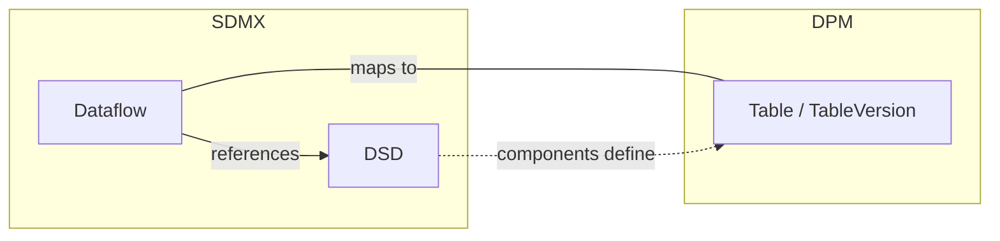
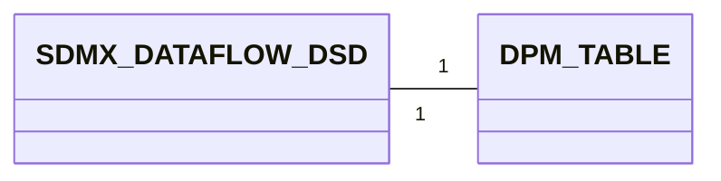
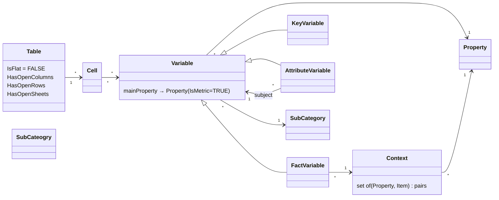
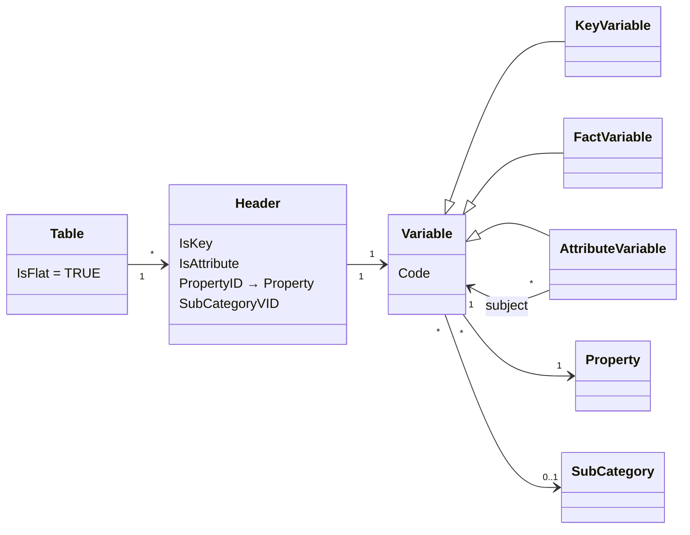
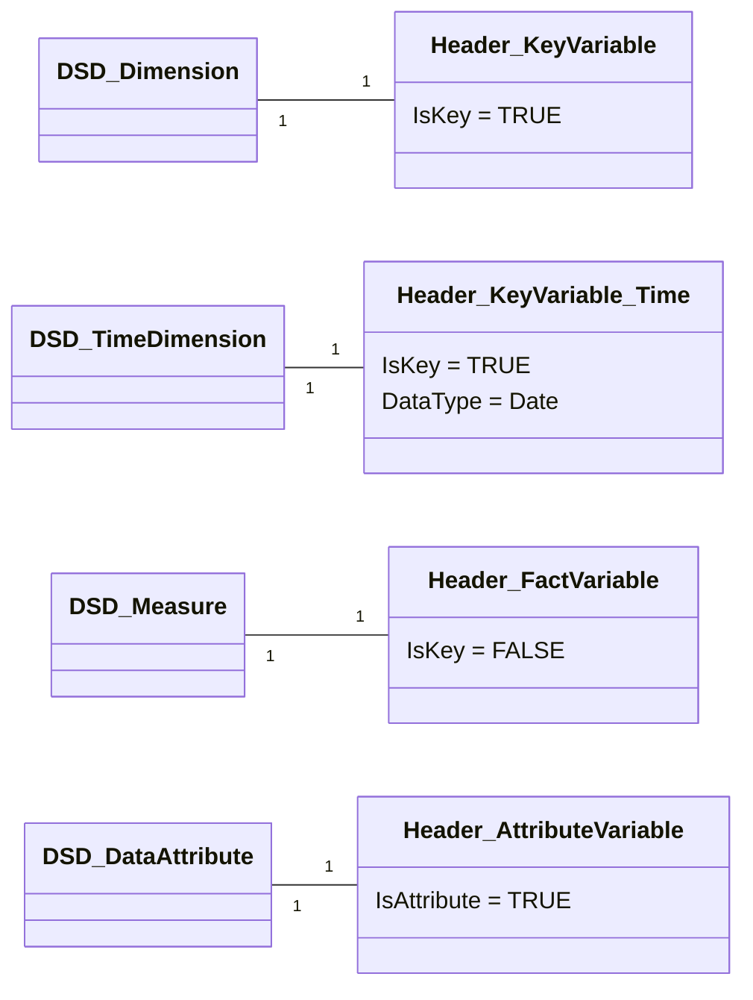
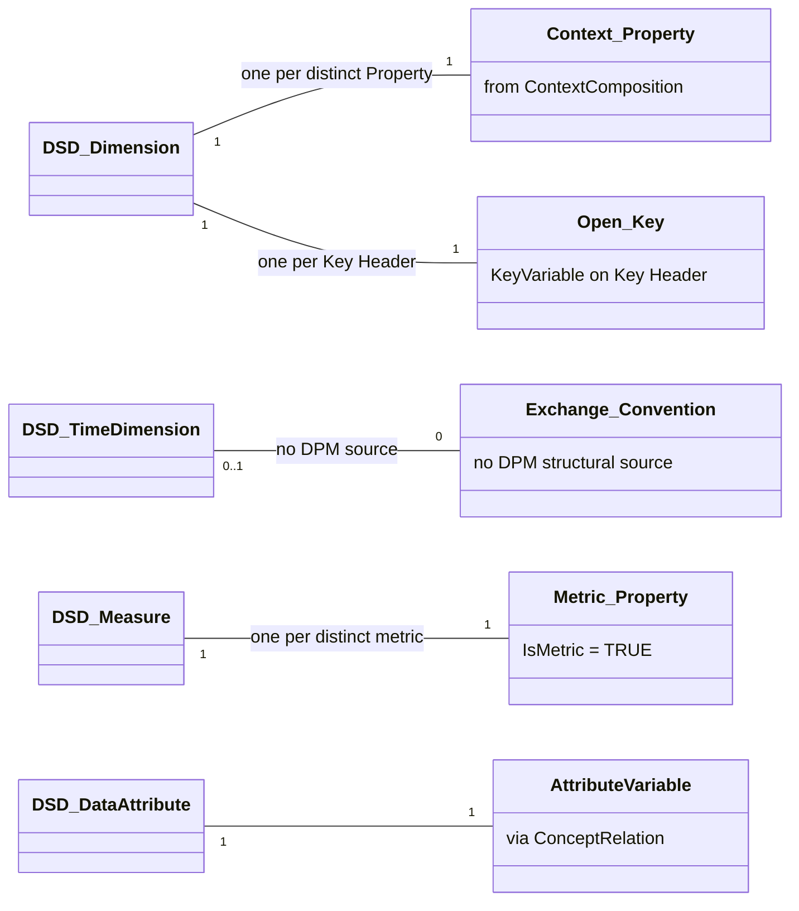
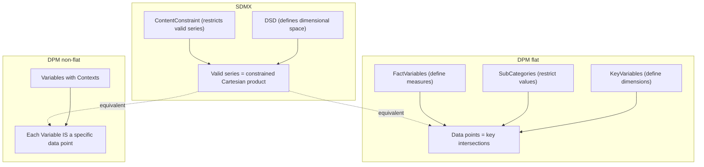
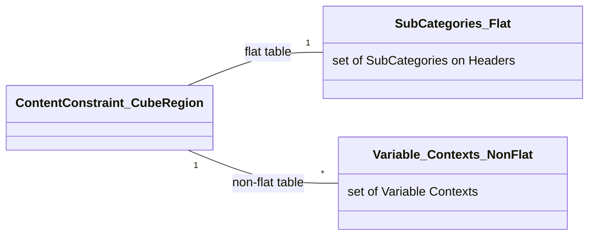

# 3. Detailed mapping rules

This chapter provides the detailed rules for each of the high-level correspondences described in chapter 2. Rather than mapping individual components one by one, the rules are organised around three conceptual levels:

1. **Container equivalence** — how the SDMX Dataflow + DSD pair maps to a DPM Table
2. **Structural composition** — how the DSD's components (dimensions, measures, attributes) relate to the Table's components (headers and variables)
3. **Data space definition** — how SDMX series constraints relate to DPM variables, with fundamentally different mechanisms for flat and non-flat tables

Throughout this chapter, a running example based on real artefacts from European banking supervision is used. The **SDMX side** uses the ECB's Consolidated Banking Data dataflow (`ECB:CBD2`). For the **DPM Side**, the EBA's FINREP template `F_04.04.1` (*Breakdown of financial assets by instrument and by counterparty sector: financial assets at amortised cost*) is shown as an example of the non-flat approach.

> - **Prerequisite — glossary mapping**: This chapter assumes that the glossary-level artefacts have already been mapped following [Glossary — Detailed Mapping Rules](../01_glossary/03_detailed_mapping_rules.md). Concretely, this means that for every DSD component:
>     - Each **Codelist** has been mapped to a **Category**, and each **Code** to an **Item** within that Category ([glossary 3.1](../01_glossary/03_detailed_mapping_rules.md#31-codelist-category), [3.3](../01_glossary/03_detailed_mapping_rules.md#33-code-category-item)).
>     - Each **Concept** has been mapped to a **Property** ([glossary 3.5](../01_glossary/03_detailed_mapping_rules.md#35-concept-property)).
> - The data definition mapping rules below reference these already-existing Properties, Categories, and Items — they do not create them. For example, when a DSD Dimension references Concept `FREQ` and Codelist `CL_FREQ`, this chapter assumes that Property `FREQ` and Category `CL_FREQ` (with its Items) already exist in the DPM glossary.

## 3.1 Dataflow + DSD ↔ Table

In SDMX, defining a data collection normally requires two artefacts working together:

- A **Data Structure Definition (DSD)** specifies the complete structure: which dimensions identify observations, what measures are collected, and what attributes describe the data.
- A **Dataflow** applies that DSD to a specific exchange context. Reporters normally submit data *against* a Dataflow, not directly against a DSD.

In the DPM, a single artefact — the **Table** (with its **TableVersion**) — serves both roles. A Table defines both the structural content (headers, cells, variables) and the exchange context (what reporters submit).



**Example Dataflow + DSD**

The ECB publishes a Dataflow `CBD2` referencing DSD `ECB_CBD2`, which defines 16 dimensions (including FREQ, REF_AREA, BS_COUNT_SECTOR, CB_ITEM, CB_PORTFOLIO, etc.), a primary measure (OBS_VALUE), and 19 attributes (including OBS_STATUS, CONF_STATUS, DECIMALS).

```xml
<Dataflow agencyID="ECB" id="CBD2" version="1.0">
  <Name xml:lang="en">Consolidated Banking data</Name>
  <Structure>
    <Ref agencyID="ECB" id="ECB_CBD2" version="1.0" class="DataStructure"/>
  </Structure>
</Dataflow>
```

**Example Table**

The EBA's FINREP template F_04.04.1 (*Breakdown of financial assets by instrument and by counterparty sector: financial assets at amortised cost*) is a non-flat table with 180 Variables organised through dimensional Contexts:

*Table*

| TableID | IsAbstract | HasOpenColumns | HasOpenRows | HasOpenSheets | IsNormalised | IsFlat |
| ------- | ---------- | -------------- | ----------- | ------------- | ------------ | ------ |
| 406     | FALSE      | FALSE          | FALSE       | FALSE         | FALSE        | FALSE  |

*TableVersion* (release 4.2)

| TableVID | TableID | KeyID | Code      | Name                                                                                                      | StartReleaseID | EndReleaseID |
| -------- | ------- | ----- | --------- | --------------------------------------------------------------------------------------------------------- | -------------- | ------------ |
| 6476     | 406     | NULL  | F_04.04.1 | Breakdown of financial assets by instrument and by counterparty sector: financial assets at amortised cost | 5 (v4.2)       | NULL         |

### 3.1.1 The DPM `IsFlat` flag

The `Table.IsFlat` flag determines how the DSD structural information is captured and, consequently, the degree of interoperability with SDMX:

| IsFlat  | Description                                                                 | SDMX interoperability          |
|---------|-----------------------------------------------------------------------------|--------------------------------|
| `TRUE`  | Headers reference Properties directly. No Contexts. SDMX-like flat structure. | Natural mapping path           |
| `FALSE` | Variables identified through Contexts (dimensional signatures). Traditional DPM pattern. | No direct SDMX structural equivalent |

This distinction is fundamental and affects how components map in sections 3.2 and 3.3.

> **Note**: In the current EBA DPM (v4.2), all 1062 tables use `IsFlat = FALSE`. These tables were designed independently of SDMX, following the traditional DPM pattern where the grid layout and dimensional Contexts carry domain-specific meaning.
>
> The standard mapping path from SDMX to DPM should produce **flat tables** (`IsFlat = TRUE`). The SDMX DSD is inherently flat — dimensions, measures, and attributes are typed components in a single list — and the flat DPM table preserves this structure directly: each DSD component maps 1:1 to a Header + Variable of the corresponding type (key, fact, or attribute). This avoids the need to design header hierarchies, compose Variable Contexts, or define a codification scheme to translate between compositional contexts and flat dimension codes. The flat approach minimises conventions and produces a mechanical, reversible mapping.
>
> This chapter covers both flat and non-flat cases. The flat case is the recommended path for SDMX-originated structures; the non-flat case is documented for interoperability with existing DPM tables.

### 3.1.2 Mapping cardinality



- From SDMX to DPM: One Dataflow (together with its referenced DSD) maps to one Table (with its TableVersion). The DSD alone does not map — it must be applied through a Dataflow.
- From DPM to SDMX: One Table maps to one Dataflow + DSD pair. If multiple Tables share identical structure, they MAY share a single DSD with multiple Dataflows.

### 3.1.3 Attributes equivalence

#### 3.1.3.1 SDMX Dataflow attributes
- maintainable artefact attributes (see [Identification mapping rules](../00_basics/02_detailed_mapping_rules.md#22-identification-dpm-ids-vs-sdmx-urns))
    - `id`
    - `agencyID`
    - `version`
- `Name` (multilingual)
- `Description` (multilingual)
- `Structure` (reference to DSD)

#### 3.1.3.2 SDMX DSD attributes
- maintainable artefact attributes
    - `id`
    - `agencyID`
    - `version`
- `Name` (multilingual)
- `Description` (multilingual)

#### 3.1.3.3 DPM Table / TableVersion attributes
- `Table.TableID`
- `Table.IsAbstract`
- `Table.HasOpenColumns`
- `Table.HasOpenRows`
- `Table.HasOpenSheets`
- `Table.IsNormalised`
- `Table.IsFlat`
- `TableVersion.TableVID`
- `TableVersion.TableID`
- `TableVersion.KeyID`
- `TableVersion.Code`
- `TableVersion.Name`
- `TableVersion.Description`
- `TableVersion.StartReleaseID`, `EndReleaseID`

#### 3.1.3.4 Mapping details

| SDMX                              | DPM                                  | Notes                                                  |
|------------------------------------|--------------------------------------|--------------------------------------------------------|
| Dataflow.`id`                      | TableVersion.`Code`                  | The Dataflow id becomes the Table's identifying code   |
| Dataflow.`Name`                    | TableVersion.`Name`                  | Multilingual mapping via [general rules](../00_basics/02_detailed_mapping_rules.md#23-multilingual-support-internationalstring-vs-translations) |
| Dataflow.`Description`             | TableVersion.`Description`           | Multilingual mapping via [general rules](../00_basics/02_detailed_mapping_rules.md#23-multilingual-support-internationalstring-vs-translations) |
| Dataflow.`Structure` (DSD ref)     | — (structural content distributed)   | DSD components map to Headers + Variables (section 3.2) |
| DSD.`id`                           | — (no separate artefact)             | Absorbed into Table                                    |
| DSD structural content             | Headers, Variables, CompoundKey      | See section 3.2 for component-level mapping            |
| — (not applicable)                 | Table.`IsFlat` = TRUE                | Standard mapping always produces flat tables           |
| — (not applicable)                 | Table.`HasOpenRows` = TRUE           | SDMX data spaces are open by default                   |
| — (not applicable)                 | Table.`HasOpenColumns`               | DPM-specific flag                                      |
| — (not applicable)                 | Table.`IsNormalised`                 | DPM-specific flag                                      |

> **Note**: The mapping of multilingual `Name` and `Description` attributes follows the general rules described in [Multilingual support](../00_basics/02_detailed_mapping_rules.md#23-multilingual-support-internationalstring-vs-translations).

### 3.1.4 Example Mapping SDMX ==> DPM

Starting from the CBD2 Dataflow and its referenced DSD:

```xml
<Dataflow agencyID="ECB" id="CBD2" version="1.0">
  <Name xml:lang="en">Consolidated Banking data</Name>
  <Structure>
    <Ref agencyID="ECB" id="ECB_CBD2" version="1.0" class="DataStructure"/>
  </Structure>
</Dataflow>
```

The mapping produces the following DPM artefacts:

*Table*

| TableID | IsAbstract | HasOpenColumns | HasOpenRows | HasOpenSheets | IsNormalised | IsFlat |
| ------- | ---------- | -------------- | ----------- | ------------- | ------------ | ------ |
| 1001    | FALSE      | FALSE          | TRUE        | FALSE         | FALSE        | TRUE   |

- `IsFlat = TRUE` because the standard mapping preserves the DSD's flat dimensional structure. Each DSD component becomes a separate Header + Variable.
- `HasOpenRows = TRUE` because the SDMX data space is open by default — new series can be added without changing the structure. The ContentConstraint (section 3.3) restricts which series are valid, but the table structure itself allows growth.

*TableVersion*

| TableVID | TableID | KeyID | Code | Name                       | StartReleaseID | EndReleaseID |
| -------- | ------- | ----- | ---- | -------------------------- | -------------- | ------------ |
| 1101     | 1001    | 8001  | CBD2 | Consolidated Banking data  | 1              | NULL         |

- `Code` = `CBD2` derived from Dataflow.`id`.
- `Name` = Dataflow.`Name`.
- `KeyID` = 8001 references the CompoundKey capturing the DSD's dimension structure.

The DSD's structural components (dimensions, measure, attributes) are mapped to Headers and Variables — see section 3.2.6 for the worked component-level example.

### 3.1.5 Example Mapping DPM ==> SDMX

Starting from the EBA's existing FINREP template F_04.04.1:

*Table*

| TableID | IsAbstract | HasOpenColumns | HasOpenRows | HasOpenSheets | IsNormalised | IsFlat |
| ------- | ---------- | -------------- | ----------- | ------------- | ------------ | ------ |
| 406     | FALSE      | FALSE          | FALSE       | FALSE         | FALSE        | FALSE  |

*TableVersion* (release 4.2)

| TableVID | TableID | KeyID | Code      | Name                                                                                                      | StartReleaseID | EndReleaseID |
| -------- | ------- | ----- | --------- | --------------------------------------------------------------------------------------------------------- | -------------- | ------------ |
| 6476     | 406     | NULL  | F_04.04.1 | Breakdown of financial assets by instrument and by counterparty sector: financial assets at amortised cost | 5 (v4.2)       | NULL         |

The mapping produces the following SDMX artefacts:

```xml
<!-- 1. Generate the DSD from the Table's Variables and Contexts -->
<DataStructureDefinition agencyID="EBA" id="DSD_F_04_04_1" version="1.0">
  <Name xml:lang="en">Breakdown of financial assets by instrument and by
    counterparty sector: financial assets at amortised cost</Name>
  <DataStructureComponents>
    <!-- Components derived from Variable Context properties
         — see section 3.2.7 -->
  </DataStructureComponents>
</DataStructureDefinition>

<!-- 2. Generate the Dataflow referencing the DSD -->
<Dataflow agencyID="EBA" id="DF_F_04_04_1" version="1.0">
  <Name xml:lang="en">Breakdown of financial assets by instrument and by
    counterparty sector: financial assets at amortised cost</Name>
  <Structure>
    <Ref agencyID="EBA" id="DSD_F_04_04_1" version="1.0"
         class="DataStructure"/>
  </Structure>
</Dataflow>
```

- Dataflow.`id` = derived from `TableVersion.Code` = `DF_F_04_04_1`.
- DSD.`id` = `DSD_F_04_04_1` — derived by convention from the Table code.
- Dataflow.`Name` = `TableVersion.Name`.
- Since F_04.04.1 is non-flat, DSD dimensions must be reconstructed from the Context properties across all 180 Variables (section 3.2.7). This requires a codification scheme to consolidate compositional contexts into flat SDMX dimension codes.


## 3.2 DSD ↔ Table as structural collections

The DSD is natively a **collection of typed components** — Dimensions, Measures, and Attributes under explicit descriptors. A DPM Table is not: its Headers and Variables signal role through flags, and non-flat Tables embed dimensions inside Variable Contexts. To compare the two, we recast the Table as an equivalent collection of typed components; the structural parallel that follows is that constructed equivalence.

### 3.2.1 DSD components

An SDMX DSD organises its components in three descriptors:

```
DSD
├── DimensionDescriptor
│   ├── Dimension(s)        — identify observations (series key)
│   └── TimeDimension       — special time identifier (at most one)
├── MeasureDescriptor
│   └── Measure(s)          — the observed/measured values
└── AttributeDescriptor
    └── DataAttribute(s)    — metadata describing the data
```

Each component references a **Concept** (semantic meaning) and has a **Representation** (enumerated via Codelist or non-enumerated via Facet).

**Example: ECB_CBD2 DSD**

The DSD `ECB:ECB_CBD2(1.0)` defines 16 dimensions, a TimeDimension, 1 primary measure, and 19 attributes. The following XML shows a representative subset (6 of 16 dimensions, the TimeDimension, the measure, and 2 attributes):

```xml
<DataStructureDefinition agencyID="ECB" id="ECB_CBD2" version="1.0">
  <Name xml:lang="en">Statistics on Consolidated Banking Data</Name>
  <DataStructureComponents>
    <DimensionList id="DimensionDescriptor">
      <Dimension id="FREQ" position="1">
        <ConceptIdentity>
          <Ref id="FREQ" maintainableParentID="ECB_CONCEPTS"
               agencyID="ECB" maintainableParentVersion="1.0" class="Concept"/>
        </ConceptIdentity>
        <LocalRepresentation>
          <Enumeration>
            <Ref id="CL_FREQ" agencyID="ECB" version="1.0" class="Codelist"/>
          </Enumeration>
        </LocalRepresentation>
      </Dimension>
      <Dimension id="REF_AREA" position="2">
        <ConceptIdentity>
          <Ref id="REF_AREA" maintainableParentID="ECB_CONCEPTS"
               agencyID="ECB" maintainableParentVersion="1.0" class="Concept"/>
        </ConceptIdentity>
        <LocalRepresentation>
          <Enumeration>
            <Ref id="CL_AREA" agencyID="ECB" version="1.0" class="Codelist"/>
          </Enumeration>
        </LocalRepresentation>
      </Dimension>
      <Dimension id="BS_COUNT_SECTOR" position="5">
        <ConceptIdentity>
          <Ref id="BS_COUNT_SECTOR" maintainableParentID="ECB_CONCEPTS"
               agencyID="ECB" maintainableParentVersion="1.0" class="Concept"/>
        </ConceptIdentity>
        <LocalRepresentation>
          <Enumeration>
            <Ref id="CL_SECTOR" agencyID="ECB" version="1.0" class="Codelist"/>
          </Enumeration>
        </LocalRepresentation>
      </Dimension>
      <Dimension id="CB_REP_FRAMEWRK" position="8">
        <ConceptIdentity>
          <Ref id="CB_REP_FRAMEWRK" maintainableParentID="ECB_CONCEPTS"
               agencyID="ECB" maintainableParentVersion="1.0" class="Concept"/>
        </ConceptIdentity>
        <LocalRepresentation>
          <Enumeration>
            <Ref id="CL_CB_REP_FRAMEWRK" agencyID="ECB" version="1.0"
                 class="Codelist"/>
          </Enumeration>
        </LocalRepresentation>
      </Dimension>
      <Dimension id="CB_ITEM" position="9">
        <ConceptIdentity>
          <Ref id="CB_ITEM" maintainableParentID="ECB_CONCEPTS"
               agencyID="ECB" maintainableParentVersion="1.0" class="Concept"/>
        </ConceptIdentity>
        <LocalRepresentation>
          <Enumeration>
            <Ref id="CL_CB_ITEM" agencyID="ECB" version="1.0" class="Codelist"/>
          </Enumeration>
        </LocalRepresentation>
      </Dimension>
      <Dimension id="CB_PORTFOLIO" position="10">
        <ConceptIdentity>
          <Ref id="CB_PORTFOLIO" maintainableParentID="ECB_CONCEPTS"
               agencyID="ECB" maintainableParentVersion="1.0" class="Concept"/>
        </ConceptIdentity>
        <LocalRepresentation>
          <Enumeration>
            <Ref id="CL_CB_PORTFOLIO" agencyID="ECB" version="1.0"
                 class="Codelist"/>
          </Enumeration>
        </LocalRepresentation>
      </Dimension>
      <!-- Dimensions 3,4,6,7,11–16 omitted for brevity -->
      <TimeDimension id="TIME_PERIOD" position="17">
        <ConceptIdentity>
          <Ref id="TIME_PERIOD" maintainableParentID="ECB_CONCEPTS"
               agencyID="ECB" maintainableParentVersion="1.0" class="Concept"/>
        </ConceptIdentity>
        <LocalRepresentation>
          <TextFormat textType="ObservationalTimePeriod"/>
        </LocalRepresentation>
      </TimeDimension>
    </DimensionList>
    <MeasureList id="MeasureDescriptor">
      <Measure id="OBS_VALUE">
        <ConceptIdentity>
          <Ref id="OBS_VALUE" maintainableParentID="ECB_CONCEPTS"
               agencyID="ECB" maintainableParentVersion="1.0" class="Concept"/>
        </ConceptIdentity>
        <LocalRepresentation>
          <TextFormat textType="String" maxLength="30"/>
        </LocalRepresentation>
      </Measure>
    </MeasureList>
    <AttributeList id="AttributeDescriptor">
      <Attribute id="OBS_STATUS" assignmentStatus="Mandatory">
        <ConceptIdentity>
          <Ref id="OBS_STATUS" maintainableParentID="ECB_CONCEPTS"
               agencyID="ECB" maintainableParentVersion="1.0" class="Concept"/>
        </ConceptIdentity>
        <LocalRepresentation>
          <Enumeration>
            <Ref id="CL_OBS_STATUS" agencyID="ECB" version="1.0"
                 class="Codelist"/>
          </Enumeration>
        </LocalRepresentation>
        <AttributeRelationship>
          <PrimaryMeasure><Ref id="OBS_VALUE"/></PrimaryMeasure>
        </AttributeRelationship>
      </Attribute>
      <Attribute id="CONF_STATUS" assignmentStatus="Conditional">
        <ConceptIdentity>
          <Ref id="CONF_STATUS" maintainableParentID="ECB_CONCEPTS"
               agencyID="ECB" maintainableParentVersion="1.0" class="Concept"/>
        </ConceptIdentity>
        <LocalRepresentation>
          <Enumeration>
            <Ref id="CL_CONF_STATUS" agencyID="ECB" version="1.0"
                 class="Codelist"/>
          </Enumeration>
        </LocalRepresentation>
        <AttributeRelationship>
          <PrimaryMeasure><Ref id="OBS_VALUE"/></PrimaryMeasure>
        </AttributeRelationship>
      </Attribute>
      <!-- 17 additional attributes omitted for brevity -->
    </AttributeList>
  </DataStructureComponents>
</DataStructureDefinition>
```

**Complete dimension list** (for reference):

| Position | Dimension ID     | Codelist               | Description                          |
| -------- | ---------------- | ---------------------- | ------------------------------------ |
| 1        | FREQ             | CL_FREQ                | Frequency                            |
| 2        | REF_AREA         | CL_AREA                | Reporting area                       |
| 3        | COUNT_AREA       | CL_AREA                | Counterparty area                    |
| 4        | CB_REP_SECTOR    | CL_CB_REP_SECTOR       | Reporting sector                     |
| 5        | BS_COUNT_SECTOR  | CL_SECTOR              | Counterparty sector                  |
| 6        | BS_NFC_ACTIVITY  | CL_ACTIVITY            | NFC economic activity                |
| 7        | CB_SECTOR_SIZE   | CL_CB_SECTOR_SIZE      | Sector size                          |
| 8        | CB_REP_FRAMEWRK  | CL_CB_REP_FRAMEWRK     | Reporting framework (FINREP/COREP)   |
| 9        | CB_ITEM          | CL_CB_ITEM             | Data item (411 codes)                |
| 10       | CB_PORTFOLIO     | CL_CB_PORTFOLIO        | Accounting portfolio                 |
| 11       | CB_EXP_TYPE      | CL_CB_EXP_TYPE         | Exposure type                        |
| 12       | CB_VAL_METHOD    | CL_CB_VAL_METHOD       | Valuation method                     |
| 13       | MATURITY_RES     | CL_MATURITY            | Residual maturity                    |
| 14       | DATA_TYPE        | CL_FSENTRY             | Data type                            |
| 15       | CURRENCY_TRANS   | CL_CURRENCY            | Currency of transaction              |
| 16       | UNIT_MEASURE     | CL_UNIT                | Unit of measure                      |
| 17       | TIME_PERIOD      | *(ObservationalTimePeriod)* | Time period                      |

### 3.2.2 Table components

A DPM Table organises its components through Headers linked to Variables. Unlike the DSD, a Table is not natively a collection of typed components — its dimensional structure may be explicit or implicit depending on the `Table.IsFlat` flag. We describe the general (non-flat) case first, then the SDMX-aligned flat case.

#### 3.2.2.1 Non-flat tables (`IsFlat = FALSE`) — traditional DPM pattern

In the traditional DPM pattern, the table has no typed-component layer. The equivalent of the DSD's Dimensions, Measures, and Attributes must be *reconstructed* from three sources:

> *Conceptual diagram — versioning (Table/TableVersion, Header/HeaderVersion) is omitted for simplicity.*



The three sources are:

1. **Variable Contexts → inner Dimensions.** Each FactVariable carries a **Context**: a set of (Property, Item) pairs that fix its position in the dimensional space. The union of Context Properties across all Variables defines the table's inner dimensional axes; each such Property becomes a DSD Dimension.
2. **Open axes (`HasOpenColumns`, `HasOpenRows`, `HasOpenSheets`) → additional Dimensions.** Open axes represent dimensions whose values are not materialised in the grid but are reported alongside the data — typically reporting entity or currency. Their Properties complete the dimensional key and contribute additional DSD Dimensions. Note that some SDMX exchange-convention dimensions (e.g. `FREQ`, `TIME_PERIOD`) may have no DPM structural source at all and must be added by convention when generating the DSD (see §3.2.7).
3. **Main (metric) Property → Measure(s).** Each FactVariable is associated with a Property marked `IsMetric = TRUE` — its **main Property**. The set of distinct metric Properties across the table's FactVariables yields one DSD Measure per metric.

Attributes are identified separately via AttributeVariables (`IsAttribute = TRUE`) and attach to their subject Variable through a `ConceptRelation` (see §3.2.3 note on AttributeRelationship).


#### 3.2.2.2 Flat tables (`IsFlat = TRUE`) — SDMX-aligned pattern

Flat tables *are* organised as a collection of typed components, mirroring the DSD directly. There are no Contexts: each Header declares its role through flags (`IsKey`, `IsAttribute`) and references a Property via `PropertyID`:

> *Conceptual diagram — versioning (Table/TableVersion, Header/HeaderVersion) is omitted for simplicity.*



Each Header references a **Property** (semantic meaning) and optionally restricts values via a **SubCategory** (`SubCategoryVID`); Variables inherit their semantic meaning from the same Property. The correspondence with DSD components is 1:1 — see §3.2.3.

> **Dual purpose of Tables.** DPM Tables are not purely a rendering artefact — they define the reporting obligation (which Variables reporters must submit). For flat tables the structural and rendering layers coincide almost perfectly: each Header IS a structural component, and the table grid directly reflects the data structure. This is why flat tables map so naturally to SDMX DSDs. See §3.2.6 for a step-by-step SDMX→DPM conversion including a rendered-form illustration.

### 3.2.3 Component type correspondence

The correspondence between DSD components and Table components depends on the `IsFlat` flag.

#### 3.2.3.1 Flat tables (`IsFlat = TRUE`)

| DSD component  | Table component                                        |
|----------------|--------------------------------------------------------|
| Dimension      | Header (`IsKey=TRUE`) + KeyVariable                    |
| TimeDimension  | Header (`IsKey=TRUE`) + KeyVariable with time Property |
| Measure        | Header (`IsKey=FALSE`) + FactVariable                  |
| DataAttribute  | Header (`IsAttribute=TRUE`) + AttributeVariable        |

#### 3.2.3.2 Non-flat tables (`IsFlat = FALSE`)

In non-flat tables, dimensions are not discrete components but emerge from two sources: the Context Properties across all FactVariables, and the open keys (KeyVariables on Key Headers) that identify additional dimensions such as reporting entity or time period:

| DSD component  | Table component                                                                    |
|----------------|------------------------------------------------------------------------------------|
| Dimension      | Context Property (from ContextComposition) or open key (KeyVariable on Key Header) |
| TimeDimension  | No direct equivalent (exchange-convention dimension, added by convention for SDMX)  |
| Measure        | VariableVersion.PropertyID where Property is metric                                |
| DataAttribute  | VariableVersion linked via ConceptRelation `variable_attribute`                     |

In both cases, the mapping follows the same two-level pattern:

1. **Semantic level**: The SDMX Concept has already been mapped to the DPM Property ([glossary 3.5](../01_glossary/03_detailed_mapping_rules.md#35-concept-property))
2. **Value domain level**: The SDMX `LocalRepresentation` has been mapped to the DPM value domain — these are mutually exclusive alternatives: a **Codelist** maps to a Category (with optional SubCategory for value subsets); a **Facet** (TextFormat) maps to Property.DataType ([glossary 3.1](../01_glossary/03_detailed_mapping_rules.md#31-codelist-category))

> **Note on TimeDimension**: DPM has no dedicated time dimension type. SDMX distinguishes multiple time FacetValueTypes (`ObservationalTimePeriod`, `ReportingTimePeriod`, etc.); DPM collapses these into `Property.DataType = Date`. The DPM `Property.PeriodType` attribute (`stock`/`flow`) captures whether the time represents a point-in-time snapshot or a period aggregate — a distinction not modelled in SDMX at the component level. In non-flat tables, time is typically absent from Variable Contexts and has no DPM structural source; it must be added by convention when generating the DSD (see §3.2.7).

> **Note on AttributeRelationship**: SDMX DataAttributes have an explicit `AttributeRelationship` (Observation, Dimension, Dataflow, Group, Measure) specifying the attachment level. In DPM, this relationship is implicit: an AttributeVariable references its subject (a FactVariable or KeyVariable) via a `ConceptRelation` of type `variable_attribute`. The SDMX `GroupRelationship` has no DPM equivalent.

### 3.2.4 Mapping cardinality

#### 3.2.4.1 Flat tables (`IsFlat = TRUE`)

Each DSD component type maps 1:1 to its corresponding Table component:



- **Dimension** (1:1) ↔ Header (`IsKey=TRUE`) + KeyVariable. Each DSD Dimension becomes one Header with its associated KeyVariable, and vice versa.
- **TimeDimension** (1:1) ↔ Header (`IsKey=TRUE`) + KeyVariable with a time-typed Property. The SDMX time types (`ObservationalTimePeriod`, etc.) are collapsed to `Property.DataType = Date`.
- **Measure** (1:1) ↔ Header (`IsKey=FALSE`) + FactVariable. The measure's concept and representation map to the FactVariable's Property and DataType.
- **DataAttribute** (1:1) ↔ Header (`IsAttribute=TRUE`) + AttributeVariable. The attribute's attachment level is implicit in DPM (via `ConceptRelation`).

#### 3.2.4.2 Non-flat tables (`IsFlat = FALSE`)

The cardinality is fundamentally different — DSD components are not 1:1 with Table components but are reconstructed from Variable Contexts and open keys:



- **Dimension** (1:1 per distinct source) ↔ Context Property or open key. Each distinct Property in the union of all Contexts becomes one DSD Dimension; each KeyVariable on a Key Header contributes an additional Dimension (e.g., reporting entity, currency).
- **TimeDimension** (0..1) ↔ no direct DPM equivalent. An exchange-convention dimension with no DPM structural source; must be added by convention when generating the DSD.
- **Measure** (1:1 per distinct metric Property) ↔ metric Property. Each distinct metric Property across the table's FactVariables yields one DSD Measure.
- **DataAttribute** (1:1) ↔ AttributeVariable linked via ConceptRelation `variable_attribute`.

### 3.2.5 Attributes equivalence

#### 3.2.5.1 Flat tables (`IsFlat = TRUE`)

**Dimension ↔ Header + KeyVariable**

| SDMX Dimension attribute                        | DPM equivalent                                    | Notes |
|--------------------------------------------------|---------------------------------------------------|-------|
| `id`                                             | HeaderVersion.`Code` / VariableVersion.`Code`     | Component identifier |
| `position`                                       | TableVersionHeader.`Order`                        | Position in the series key |
| `ConceptIdentity` → Concept                      | HeaderVersion.`PropertyID` → Property             | Already mapped per [glossary 3.5](../01_glossary/03_detailed_mapping_rules.md#35-concept-property) |
| `LocalRepresentation` → Codelist                 | PropertyCategory → Category                       | Already mapped per [glossary 3.1](../01_glossary/03_detailed_mapping_rules.md#31-codelist-category) |
| `LocalRepresentation` → Codelist (value subset)  | HeaderVersion.`SubCategoryVID` → SubCategory      | Value restriction (see section 3.3) |
| `role` → Concept[0..*]                           | — (no DPM equivalent)                             | SDMX concept role has no structural DPM mapping |

**TimeDimension ↔ Header + KeyVariable**

| SDMX TimeDimension attribute                     | DPM equivalent                                    | Notes |
|--------------------------------------------------|---------------------------------------------------|-------|
| `id` (always `TIME_PERIOD`)                      | HeaderVersion.`Code` / VariableVersion.`Code`     | |
| `ConceptIdentity` → Concept                      | HeaderVersion.`PropertyID` → Property             | Property with `DataType = Date` |
| `LocalRepresentation` → `TextFormat.textType`    | Property.`DataType` = Date                        | All SDMX time types collapse to Date |
| — (not applicable)                               | Property.`PeriodType` (`stock`/`flow`)            | DPM-specific distinction |

**Measure ↔ Header + FactVariable**

| SDMX Measure attribute                           | DPM equivalent                                    | Notes |
|--------------------------------------------------|---------------------------------------------------|-------|
| `id`                                             | HeaderVersion.`Code` / VariableVersion.`Code`     | |
| `usage` (`mandatory`/`conditional`)              | — (implicit in DPM)                               | All FactVariables in a flat table are reported |
| `ConceptIdentity` → Concept                      | HeaderVersion.`PropertyID` → Property             | Property with `IsMetric = TRUE` |
| `LocalRepresentation` → TextFormat               | Property.`DataType`                               | e.g., `Decimal`, `Integer` |
| `minOccurs`, `maxOccurs`                         | — (no DPM equivalent)                             | SDMX array cardinality has no DPM structural equivalent |
| `role` → Concept[0..*]                           | — (no DPM equivalent)                             | |

**DataAttribute ↔ Header + AttributeVariable**

| SDMX DataAttribute attribute                     | DPM equivalent                                    | Notes |
|--------------------------------------------------|---------------------------------------------------|-------|
| `id`                                             | HeaderVersion.`Code` / VariableVersion.`Code`     | |
| `usage` (`mandatory`/`conditional`)              | — (conventions may apply)                         | DPM does not enforce attribute optionality at the structural level |
| `ConceptIdentity` → Concept                      | HeaderVersion.`PropertyID` → Property             | Already mapped per [glossary 3.5](../01_glossary/03_detailed_mapping_rules.md#35-concept-property) |
| `LocalRepresentation` → Codelist                 | PropertyCategory → Category                       | Already mapped per [glossary 3.1](../01_glossary/03_detailed_mapping_rules.md#31-codelist-category) |
| `LocalRepresentation` → TextFormat               | Property.`DataType`                               | For non-enumerated attributes |
| `AttributeRelationship` (Observation, Dimension, etc.) | ConceptRelation (`variable_attribute`)       | Attachment level is implicit in DPM |
| `AttributeRelationship` → `GroupRelationship`    | — (no DPM equivalent)                             | |
| `minOccurs`, `maxOccurs`                         | — (no DPM equivalent)                             | |
| `role` → Concept[0..*]                           | — (no DPM equivalent)                             | |

#### 3.2.5.2 Non-flat tables (`IsFlat = FALSE`)

In non-flat tables, there are no Headers carrying component semantics. The DPM equivalents come from Variable Contexts, metric Properties, and ConceptRelations instead.

**Dimension ↔ Context Property (ContextComposition)**

| SDMX Dimension attribute                        | DPM equivalent                                              | Notes |
|--------------------------------------------------|-------------------------------------------------------------|-------|
| `id`                                             | — (derived from Property identifier)                        | No direct code; the Property itself carries identity |
| `position`                                       | — (no ordering among Context Properties)                    | Context Properties are unordered; SDMX position must be assigned by convention |
| `ConceptIdentity` → Concept                      | ContextComposition.`PropertyID` → Property                  | Each Context Property was already mapped to a Concept per [glossary 3.5](../01_glossary/03_detailed_mapping_rules.md#35-concept-property) |
| `LocalRepresentation` → Codelist                 | PropertyCategory → Category                                 | Already mapped per [glossary 3.1](../01_glossary/03_detailed_mapping_rules.md#31-codelist-category) |
| `LocalRepresentation` → Codelist (value subset)  | ContextComposition.`ItemID` → Item (per-Variable restriction) | Each Variable's Context fixes a specific Item per Property |
| `role` → Concept[0..*]                           | — (no DPM equivalent)                                       | |

**TimeDimension ↔ (no direct equivalent)**

| SDMX TimeDimension attribute                     | DPM equivalent                                    | Notes |
|--------------------------------------------------|---------------------------------------------------|-------|
| `id`                                             | — (exchange-convention dimension)                 | No DPM structural source; added by convention for SDMX |
| `ConceptIdentity` → Concept                      | — (no Context Property for time)                  | If modelled, would be via a Property with `DataType = Date` |
| `LocalRepresentation` → `TextFormat.textType`    | — (not represented)                               | See §3.2.7 |

**Measure ↔ VariableVersion (metric Property)**

| SDMX Measure attribute                           | DPM equivalent                                              | Notes |
|--------------------------------------------------|-------------------------------------------------------------|-------|
| `id`                                             | — (derived from Property identifier)                        | Each distinct metric Property yields one Measure |
| `usage` (`mandatory`/`conditional`)              | — (implicit)                                                | Each FactVariable is explicitly defined |
| `ConceptIdentity` → Concept                      | VariableVersion.`PropertyID` → Property (`IsMetric = TRUE`) | The metric Property was already mapped to a Concept per [glossary 3.5](../01_glossary/03_detailed_mapping_rules.md#35-concept-property) |
| `LocalRepresentation` → TextFormat               | Property.`DataType`                                         | e.g., `Decimal`, `Integer` |
| `minOccurs`, `maxOccurs`                         | — (no DPM equivalent)                                       | |
| `role` → Concept[0..*]                           | — (no DPM equivalent)                                       | |

**DataAttribute ↔ VariableVersion (via ConceptRelation)**

| SDMX DataAttribute attribute                     | DPM equivalent                                              | Notes |
|--------------------------------------------------|-------------------------------------------------------------|-------|
| `id`                                             | VariableVersion.`Code`                                      | |
| `usage` (`mandatory`/`conditional`)              | — (conventions may apply)                                   | |
| `ConceptIdentity` → Concept                      | VariableVersion.`PropertyID` → Property                     | Already mapped per [glossary 3.5](../01_glossary/03_detailed_mapping_rules.md#35-concept-property) |
| `LocalRepresentation` → Codelist                 | PropertyCategory → Category                                 | |
| `LocalRepresentation` → TextFormat               | Property.`DataType`                                         | |
| `AttributeRelationship` (Observation, Dimension, etc.) | ConceptRelation (`variable_attribute`) → subject Variable | The ConceptRelation source is the subject; target is the attribute |
| `AttributeRelationship` → `GroupRelationship`    | — (no DPM equivalent)                                       | |
| `minOccurs`, `maxOccurs`                         | — (no DPM equivalent)                                       | |
| `role` → Concept[0..*]                           | — (no DPM equivalent)                                       | |

### 3.2.6 Example Mapping SDMX ==> DPM

Starting from the [ECB_CBD2 DSD](#321-dsd-components), the standard flat mapping produces the following DPM artefacts. A representative subset of components is shown (6 of 16 dimensions, the TimeDimension, 1 measure, and 2 attributes).

**Step 1 — Create Headers, HeaderVersions, and TableVersionHeaders**

Each DSD component becomes a Header. The Header itself is linked to the Table (not to a specific TableVersion) so it can be reused across versions; the TableVersion↔Header binding — together with the Order — lives on TableVersionHeader.

*Header* (one row per distinct Header; linked to the Table via `TableID`)

| HeaderID | TableID | Direction | IsKey | IsAttribute |
| -------- | ------- | --------- | ----- | ----------- |
| 6001     | 1001    | column    | TRUE  | FALSE       |
| 6002     | 1001    | column    | TRUE  | FALSE       |
| 6005     | 1001    | column    | TRUE  | FALSE       |
| 6008     | 1001    | column    | TRUE  | FALSE       |
| 6009     | 1001    | column    | TRUE  | FALSE       |
| 6010     | 1001    | column    | TRUE  | FALSE       |
| 6017     | 1001    | column    | TRUE  | FALSE       |
| 6018     | 1001    | column    | FALSE | FALSE       |
| 6019     | 1001    | column    | FALSE | TRUE        |
| 6020     | 1001    | column    | FALSE | TRUE        |

> `IsAttribute` is a convention used in this document to distinguish attribute Headers from fact Headers; the DPM metamodel identifies AttributeVariables through a `ConceptRelation` of type `variable_attribute` rather than a Header-level flag.

*HeaderVersion* (versioned definition — references already-mapped Properties and SubCategories)

| HeaderVID | HeaderID | PropertyID → Property      | SubCategoryVID | Code            | StartReleaseID | EndReleaseID |
| --------- | -------- | -------------------------- | -------------- | --------------- | -------------- | ------------ |
| 6101      | 6001     | Property `FREQ`            | 2001           | FREQ            | 1              | NULL         |
| 6102      | 6002     | Property `REF_AREA`        | 2002           | REF_AREA        | 1              | NULL         |
| 6105      | 6005     | Property `BS_COUNT_SECTOR` | 2005           | BS_COUNT_SECTOR | 1              | NULL         |
| 6108      | 6008     | Property `CB_REP_FRAMEWRK` | 2008           | CB_REP_FRAMEWRK | 1              | NULL         |
| 6109      | 6009     | Property `CB_ITEM`         | 2009           | CB_ITEM         | 1              | NULL         |
| 6110      | 6010     | Property `CB_PORTFOLIO`    | 2010           | CB_PORTFOLIO    | 1              | NULL         |
| 6117      | 6017     | Property `TIME_PERIOD`     | NULL           | TIME_PERIOD     | 1              | NULL         |
| 6118      | 6018     | Property `OBS_VALUE`       | NULL           | OBS_VALUE       | 1              | NULL         |
| 6119      | 6019     | Property `OBS_STATUS`      | 2019           | OBS_STATUS      | 1              | NULL         |
| 6120      | 6020     | Property `CONF_STATUS`     | NULL           | CONF_STATUS     | 1              | NULL         |

*TableVersionHeader* (binds Headers to a specific TableVersion and carries the structural layout that may change between versions)

| TableVID | HeaderID | HeaderVID | Order | IsAbstract | IsUnique |
| -------- | -------- | --------- | ----- | ---------- | -------- |
| 1101     | 6001     | 6101      | 1     | FALSE      | FALSE    |
| 1101     | 6002     | 6102      | 2     | FALSE      | FALSE    |
| 1101     | 6005     | 6105      | 5     | FALSE      | FALSE    |
| 1101     | 6008     | 6108      | 8     | FALSE      | FALSE    |
| 1101     | 6009     | 6109      | 9     | FALSE      | FALSE    |
| 1101     | 6010     | 6110      | 10    | FALSE      | FALSE    |
| 1101     | 6017     | 6117      | 17    | FALSE      | FALSE    |
| 1101     | 6018     | 6118      | 18    | FALSE      | FALSE    |
| 1101     | 6019     | 6119      | 19    | FALSE      | FALSE    |
| 1101     | 6020     | 6120      | 20    | FALSE      | FALSE    |

- `HeaderVersion.Code` = DSD component `id` (e.g., `FREQ`, `OBS_VALUE`).
- `HeaderVersion.PropertyID` (optional) references the Property already mapped from the component's Concept. **Not all HeaderVersions carry a PropertyID** — see the two-layer modelling note below.
- `HeaderVersion.KeyVariableVID` (optional) is populated for Key Headers (`IsKey = TRUE`); it links directly to the KeyVariable for that open axis.
- `HeaderVersion.SubCategoryVID` is populated when the ContentConstraint restricts the dimension values (see section 3.3).
- `TableVersionHeader.Order` corresponds to the Dimension `position` attribute.
- The Property's associated Category (already mapped from the Codelist, e.g., Codelist `CL_FREQ` → Category `CL_FREQ`) defines the value domain for enumerated dimensions.

> **Two-layer modelling — headers and derived variables.** DPM separates the *modelling layer* (Headers) from the *derived layer* (Variables). Headers define the axes of the table; VariableVersions are the Cartesian product of the leaf-level header intersections (Cells) — they are calculated results, not independently authored. The key constraint: **exactly one header per Cell must carry a PropertyID**, and that PropertyID is inherited by the derived VariableVersion. If more than one header in a Cell carried a PropertyID, the variable's semantic identity would be ambiguous. The other constituent headers provide dimensional context (via Context/ContextComposition) or value constraints (via SubCategoryVID) but not a PropertyID. This is why `PropertyID` appears on both HeaderVersions and VariableVersions — it originates in the header and is propagated to the variable at derivation time.

**Step 2 — Create Variables, VariableVersions, and CompoundKey**

Each DSD component also produces a Variable — the maintainable identity — together with a VariableVersion carrying the per-release definition. The Variable's `Type` declares its role (Key / Fact / Attribute / FilingIndicator per §5.3.2); that role is consistently reflected by how the VariableVersion is linked:

- **Key Variable**: referenced by `HeaderVersion.KeyVariableVID` of a Key Header (`IsKey = TRUE`) and gathered in the CompoundKey via KeyComposition.
- **Fact Variable**: references the CompoundKey via `VariableVersion.KeyID`, and is reached from the table grid via `TableVersionCell.VariableVID` (see Step 3).
- **Attribute Variable**: linked to its subject Variable via a `ConceptRelation` of type `variable_attribute`.

*Variable* (maintainable — one row per distinct Variable; `Type` identifies the Variable's role per §5.3.2 of the DPM metamodel, carried in practice via Concept → DPMClass → Type)

| VariableID | Type      |
| ---------- | --------- |
| 7001       | Key       |
| 7002       | Key       |
| 7005       | Key       |
| 7008       | Key       |
| 7009       | Key       |
| 7010       | Key       |
| 7017       | Key       |
| 7018       | Fact      |
| 7019       | Attribute |
| 7020       | Attribute |

*VariableVersion — Key role* (one per Dimension/TimeDimension)

| VariableVID | VariableID | Code            | PropertyID → Property      | SubCategoryVID | StartReleaseID | EndReleaseID |
| ----------- | ---------- | --------------- | -------------------------- | -------------- | -------------- | ------------ |
| 7101        | 7001       | FREQ            | Property `FREQ`            | 2001           | 1              | NULL         |
| 7102        | 7002       | REF_AREA        | Property `REF_AREA`        | 2002           | 1              | NULL         |
| 7105        | 7005       | BS_COUNT_SECTOR | Property `BS_COUNT_SECTOR` | 2005           | 1              | NULL         |
| 7108        | 7008       | CB_REP_FRAMEWRK | Property `CB_REP_FRAMEWRK` | 2008           | 1              | NULL         |
| 7109        | 7009       | CB_ITEM         | Property `CB_ITEM`         | 2009           | 1              | NULL         |
| 7110        | 7010       | CB_PORTFOLIO    | Property `CB_PORTFOLIO`    | 2010           | 1              | NULL         |
| 7117        | 7017       | TIME_PERIOD     | Property `TIME_PERIOD`     | NULL           | 1              | NULL         |

With the KeyVariableVersions in place, the CompoundKey can be created and populated:

*CompoundKey*

| KeyID | Signature |
| ----- | --------- |
| 8001  | CBD2      |

*KeyComposition* (excerpt — all 17 KeyVariableVersions participate)

| KeyID | VariableVID |
| ----- | ----------- |
| 8001  | 7101        |
| 8001  | 7102        |
| 8001  | 7105        |
| 8001  | 7108        |
| 8001  | 7109        |
| 8001  | 7110        |
| 8001  | 7117        |

The FactVariableVersion can now link to this CompoundKey through `VariableVersion.KeyID`:

*VariableVersion — Fact role* (one per Measure)

| VariableVID | VariableID | Code      | PropertyID → Property | KeyID → CompoundKey | StartReleaseID | EndReleaseID |
| ----------- | ---------- | --------- | --------------------- | ------------------- | -------------- | ------------ |
| 7118        | 7018       | OBS_VALUE | Property `OBS_VALUE`  | 8001                | 1              | NULL         |

*VariableVersion — Attribute role* (one per DataAttribute)

| VariableVID | VariableID | Code        | PropertyID → Property  | StartReleaseID | EndReleaseID |
| ----------- | ---------- | ----------- | ---------------------- | -------------- | ------------ |
| 7119        | 7019       | OBS_STATUS  | Property `OBS_STATUS`  | 1              | NULL         |
| 7120        | 7020       | CONF_STATUS | Property `CONF_STATUS` | 1              | NULL         |

- `VariableVersion.Code` = DSD component `id`.
- `VariableVersion.PropertyID` references the Property already mapped from the component's Concept (same Property referenced by the corresponding HeaderVersion — the Header and its Variable share semantic identity).
- `VariableVersion.SubCategoryVID` is populated for KeyVariables when the ContentConstraint restricts the dimension values.
- `VariableVersion.KeyID` on FactVariableVersions points to the CompoundKey gathering the KeyVariableVersions required to identify each observation. The same CompoundKey is referenced at TableVersion level via `TableVersion.KeyID = 8001` (see §3.1.4) — this is the series-key dual pointed out in §3.3.
- AttributeVariableVersions do not carry a CompoundKey; they attach to their subject Variable via ConceptRelation instead.
- In this example, VariableVID values use the pattern 71xx where `xx` matches the corresponding VariableID suffix (e.g., VariableID 7018 → VariableVID 7118).

**Step 3 — Create Cells and link them to VariableVersions**

Non-key Headers result in Cells; the link from a Cell to its VariableVersion is established through `TableVersionCell.VariableVID`. Key Headers do not result in Cells (§5.2.1.3 of the DPM metamodel) — they define the series key via the CompoundKey instead.

*Cell* (one per non-key Header)

| CellID | TableID | ColumnID → Header |
| ------ | ------- | ----------------- |
| 9018   | 1001    | 6018              |
| 9019   | 1001    | 6019              |
| 9020   | 1001    | 6020              |

*TableVersionCell* (links Cell to VariableVersion)

| TableVID | CellID | CellCode    | IsNullable | VariableVID → VariableVersion |
| -------- | ------ | ----------- | ---------- | ----------------------------- |
| 1101     | 9018   | OBS_VALUE   | FALSE      | 7118 (Fact role)              |
| 1101     | 9019   | OBS_STATUS  | TRUE       | 7119 (Attribute role)         |
| 1101     | 9020   | CONF_STATUS | TRUE       | 7120 (Attribute role)         |

- Each Cell references its originating non-key Header via `ColumnID` (here, HeaderIDs 6018–6020 for OBS_VALUE, OBS_STATUS, CONF_STATUS).
- Since `HasOpenRows = TRUE`, `RowID` and `SheetID` are `NULL` — rows are instantiated at runtime from each submitted observation.
- `TableVersionCell.VariableVID` references the VariableVersion rows created in Step 2 (71xx).
- `IsNullable` reflects the SDMX `usage` of the originating component — mandatory measures/attributes map to `FALSE`, conditional ones to `TRUE`.

**Step 4 — Rendered form**

Because `HasOpenRows = TRUE`, the flat CBD2 table renders as a grid where each **row is one observation** and reporters fill in all columns. The key columns identify the observation (forming the series key), the measure column holds the reported value, and the attribute columns carry observation-level metadata.

| FREQ | REF_AREA | BS_COUNT_SECTOR | CB_REP_FRAMEWRK | CB_ITEM | CB_PORTFOLIO | TIME_PERIOD | OBS_VALUE | OBS_STATUS | CONF_STATUS |
|------|----------|-----------------|-----------------|---------|--------------|-------------|-----------|------------|-------------|
| A    | ES       | S1              | FINREP          | A_LOANS | ON_B_S       | 2023        | 1 234 567 | A          | F           |
| A    | ES       | S12             | FINREP          | A_LOANS | ON_B_S       | 2023        |   876 543 | A          | F           |
| A    | DE       | S1              | FINREP          | A_LOANS | ON_B_S       | 2023        | 9 876 543 | P          | C           |

*(Only 6 of the 16 key dimensions are shown; a real CBD2 submission includes all 16.)*

This is structurally identical to an SDMX flat dataset for `ECB:CBD2`: each row maps 1:1 to an SDMX Observation, the key columns map to DimensionValues in the SeriesKey, OBS_VALUE maps to the ObservationValue, and OBS_STATUS / CONF_STATUS map to AttributeValues. The DPM Table is not merely a rendering template — it IS the reporting structure that drives both the collection form and the data exchange.

### 3.2.7 Example Mapping DPM ==> SDMX

Starting from the [F_04.04.1 non-flat table](#315-example-mapping-dpm-sdmx), the DSD must be reconstructed from the Variables' Context properties and metric Properties. The glossary mapping ([chapter 1](../01_glossary/03_detailed_mapping_rules.md)) has already produced an SDMX Concept for each DPM Property and a Codelist for each Category — this step references those artefacts, it does not create them.

**Step 1 — Extract dimensions from Context properties**

The union of all Context properties across the table's Variables defines the dimensional space. Each Property was already mapped to a Concept, and each Category to a Codelist, in the glossary:

| DPM Property (Category)                         | Already-mapped Concept | Already-mapped Codelist |
| ------------------------------------------------ | ---------------------- | ----------------------- |
| Accounting items (`qAI`)                         | ACCOUNTING_ITEMS       | CL_qAI                 |
| Type of financial instruments (`qFI`)            | TYPE_FINANCIAL_INSTR   | CL_qFI                 |
| Accounting portfolio (`qPL`)                     | ACCOUNTING_PORTFOLIO   | CL_qPL                 |
| Counterparty sector (`qSR`)                      | COUNTERPARTY_SECTOR    | CL_qSR                 |
| Calculation method (`qCM`)                       | CALCULATION_METHOD     | CL_qCM                 |
| Impaired or not-impaired (`qIM`)                 | IMPAIRED_STATUS        | CL_qIM                 |
| Regulatory assessment of type of entity (`qOR`)  | REG_ENTITY_TYPE        | CL_qOR                 |
| Type of risk (`qTR`)                             | TYPE_OF_RISK           | CL_qTR                 |
| Type of write-off (`qAI`)                        | *(shares Category with Accounting items)* | CL_qAI  |

Each DPM dimension Property becomes a DSD Dimension that references the corresponding Concept and Codelist from the glossary mapping. Unlike the SDMX → DPM direction, this mapping is **one-to-one**: each Context property produces its own Dimension.

**Step 2 — Identify metric properties → Measure**

The table's four metric Properties — Carrying amount, Gross carrying amount, Impairment, and Amount of write-offs — were each mapped to a Concept in the glossary. In the DSD, each produces a separate Measure:

| DPM Metric Property     | Already-mapped Concept   |
| ----------------------- | ------------------------ |
| Carrying amount         | CARRYING_AMOUNT          |
| Gross carrying amount   | GROSS_CARRYING_AMOUNT    |
| Impairment              | IMPAIRMENT               |
| Amount of write-offs    | AMOUNT_WRITE_OFFS        |

**Step 3 — Generate DSD XML** (abbreviated)

```xml
<DataStructureDefinition agencyID="EBA" id="DSD_F_04_04_1" version="1.0">
  <Name xml:lang="en">Breakdown of financial assets by instrument and by
    counterparty sector: financial assets at amortised cost</Name>
  <DataStructureComponents>
    <DimensionList id="DimensionDescriptor">
      <!-- DPM Property "Counterparty sector" (Category qSR)
           → already-mapped Concept + Codelist -->
      <Dimension id="COUNTERPARTY_SECTOR" position="1">
        <ConceptIdentity>
          <Ref id="COUNTERPARTY_SECTOR" maintainableParentID="EBA_CONCEPTS"
               agencyID="EBA" maintainableParentVersion="1.0" class="Concept"/>
        </ConceptIdentity>
        <LocalRepresentation>
          <Enumeration>
            <Ref id="CL_qSR" agencyID="EBA" version="1.0" class="Codelist"/>
          </Enumeration>
        </LocalRepresentation>
      </Dimension>
      <!-- DPM Property "Accounting items" (Category qAI) -->
      <Dimension id="ACCOUNTING_ITEMS" position="2">
        <ConceptIdentity>
          <Ref id="ACCOUNTING_ITEMS" maintainableParentID="EBA_CONCEPTS"
               agencyID="EBA" maintainableParentVersion="1.0" class="Concept"/>
        </ConceptIdentity>
        <LocalRepresentation>
          <Enumeration>
            <Ref id="CL_qAI" agencyID="EBA" version="1.0" class="Codelist"/>
          </Enumeration>
        </LocalRepresentation>
      </Dimension>
      <!-- DPM Property "Accounting portfolio" (Category qPL) -->
      <Dimension id="ACCOUNTING_PORTFOLIO" position="3">
        <ConceptIdentity>
          <Ref id="ACCOUNTING_PORTFOLIO" maintainableParentID="EBA_CONCEPTS"
               agencyID="EBA" maintainableParentVersion="1.0" class="Concept"/>
        </ConceptIdentity>
        <LocalRepresentation>
          <Enumeration>
            <Ref id="CL_qPL" agencyID="EBA" version="1.0" class="Codelist"/>
          </Enumeration>
        </LocalRepresentation>
      </Dimension>
      <!-- ... remaining dimensions for qFI, qCM, qIM, qOR, qTR -->
    </DimensionList>
    <MeasureList id="MeasureDescriptor">
      <!-- DPM metric Property "Carrying amount" → Measure -->
      <Measure id="CARRYING_AMOUNT">
        <ConceptIdentity>
          <Ref id="CARRYING_AMOUNT" maintainableParentID="EBA_CONCEPTS"
               agencyID="EBA" maintainableParentVersion="1.0" class="Concept"/>
        </ConceptIdentity>
        <LocalRepresentation>
          <TextFormat textType="Decimal"/>
        </LocalRepresentation>
      </Measure>
      <!-- ... remaining measures for GROSS_CARRYING_AMOUNT, IMPAIRMENT,
               AMOUNT_WRITE_OFFS -->
    </MeasureList>
  </DataStructureComponents>
</DataStructureDefinition>
```

Key observations on the non-flat → SDMX mapping:

- **One Property, one Dimension**: Unlike the SDMX → DPM flat case where multiple Context properties might need consolidation, here each DPM Context property maps directly to its own DSD Dimension, referencing the Concept and Codelist already produced by the glossary mapping. No codification scheme is needed in this direction.
- **Multiple Measures**: Each DPM metric Property produces a separate SDMX Measure, referencing its already-mapped Concept. SDMX 3.0 supports multiple measures natively.
- **Exchange-convention dimensions**: Dimensions like `FREQ`, `REF_AREA`, and `TIME_PERIOD` have no DPM structural source — they are not present in Variable Contexts, nor as open keys. They must be added by convention when generating the DSD for SDMX data exchange.

This mapping is **mechanical** in the non-flat → SDMX direction when using the glossary artefacts directly. Design decisions arise only when the target is a *pre-existing* SDMX DSD (like ECB CBD2) that consolidates multiple DPM properties into fewer dimensions — that consolidation requires a codification scheme and is not part of the standard mapping path.


## 3.3 Series Constraints ↔ Variables

This section describes how the SDMX concept of *series and their constraints* maps to DPM *Variables*. The mapping has a fundamentally different character depending on whether the DPM table is flat or non-flat.

### 3.3.1 SDMX series and constraints

In SDMX, a **series** is a set of observations sharing the same key values, except for the Time Dimension. The **series key** is the ordered combination of all dimension values:

```
Series key = (FREQ=Q, REF_AREA=ES, ..., CB_ITEM=A1200, CB_PORTFOLIO=HAC, ..., TIME_PERIOD=2024-Q4)
```

The DSD defines the full dimensional space (the Cartesian product of every dimension's codelist). A **ContentConstraint** then narrows that space to the subset that is actually valid — or actually reported — for a given Dataflow. Its `role` attribute captures this intent:

- `role = "allowableContent"` — the set of series that *may* be reported (structural restriction).
- `role = "actualContent"` — the set of series that *are* reported (data availability).

A ContentConstraint offers two complementary mechanisms to define the subset: a **CubeRegion** and a **DataKeySet**. A single constraint may use one or both.

#### 3.3.1.1 CubeRegion — dimension-wise value lists

A CubeRegion lists the allowed (or excluded) values *per dimension*, independently. The valid series space is the Cartesian product of these per-dimension value sets: any series whose value for each dimension appears in the corresponding list is valid.

```xml
<ContentConstraint agencyID="ECB" id="CBD2_CONSTRAINTS" version="1.0"
                   type="Allowed">
  <Name xml:lang="en">Constraints for the CBD2 dataflow.</Name>
  <ConstraintAttachment>
    <Dataflow>
      <Ref agencyID="ECB" id="CBD2" version="1.0" class="Dataflow"/>
    </Dataflow>
  </ConstraintAttachment>
  <CubeRegion include="true">
    <KeyValue id="FREQ">
      <Value>A</Value>
      <Value>Q</Value>
    </KeyValue>
    <KeyValue id="CB_REP_FRAMEWRK">
      <Value>A</Value>
      <Value>F</Value>
      <Value>I</Value>
    </KeyValue>
    <KeyValue id="BS_COUNT_SECTOR">
      <Value>S11</Value>
      <Value>S121</Value>
      <Value>S122Z</Value>
      <!-- ... 7 more counterparty sector codes -->
    </KeyValue>
    <KeyValue id="CB_PORTFOLIO">
      <Value>HAC</Value>
      <Value>HFT</Value>
      <!-- ... 12 more portfolio codes -->
    </KeyValue>
    <KeyValue id="CB_ITEM">
      <!-- 411 allowed values — excerpt -->
      <Value>A1200</Value>
      <Value>L5130</Value>
      <!-- ... -->
    </KeyValue>
    <!-- 11 additional KeyValue entries for remaining dimensions -->
  </CubeRegion>
</ContentConstraint>
```

In the CBD2 constraint, any series whose dimensions each pick a value from the corresponding `KeyValue` list is valid — e.g., `(FREQ=Q, CB_REP_FRAMEWRK=F, BS_COUNT_SECTOR=S121, CB_PORTFOLIO=HAC, ...)`. The value `CB_REP_FRAMEWRK=F` specifically identifies FINREP data within this constraint.

CubeRegion is well suited when restrictions are naturally dimension-wise ("allow these currencies, these sectors, these portfolios"), but it cannot by itself express *cross-dimension* dependencies (for instance, "allow frequency `Q` only when the framework is `F`"): any combination drawn from the lists is permitted.

#### 3.3.1.2 DataKeySet — explicit key combinations

A DataKeySet enumerates specific valid (or excluded) series keys. Each `Key` pins a value for every dimension of the DSD; only the listed combinations form the valid set.

```xml
<ContentConstraint agencyID="ECB" id="CBD2_KEYSET" version="1.0"
                   type="Allowed">
  <ConstraintAttachment>
    <Dataflow>
      <Ref agencyID="ECB" id="CBD2" version="1.0" class="Dataflow"/>
    </Dataflow>
  </ConstraintAttachment>
  <DataKeySet isIncluded="true">
    <Key>
      <KeyValue id="FREQ"><Value>Q</Value></KeyValue>
      <KeyValue id="CB_REP_FRAMEWRK"><Value>F</Value></KeyValue>
      <KeyValue id="BS_COUNT_SECTOR"><Value>S121</Value></KeyValue>
      <KeyValue id="CB_PORTFOLIO"><Value>HAC</Value></KeyValue>
      <!-- ... complete key per DSD dimensions -->
    </Key>
    <Key>
      <KeyValue id="FREQ"><Value>A</Value></KeyValue>
      <KeyValue id="CB_REP_FRAMEWRK"><Value>F</Value></KeyValue>
      <KeyValue id="BS_COUNT_SECTOR"><Value>S13</Value></KeyValue>
      <KeyValue id="CB_PORTFOLIO"><Value>HAC</Value></KeyValue>
      <!-- ... -->
    </Key>
    <!-- additional Key entries -->
  </DataKeySet>
</ContentConstraint>
```

DataKeySet is more precise than CubeRegion: it can express "these specific series are valid" rather than "any combination from these lists". It is, however, verbose — one entry per series — and is therefore best suited for sparse or explicitly-enumerated constraint spaces, or as a complement to a broader CubeRegion.

#### 3.3.1.3 CubeRegion vs DataKeySet at a glance

| Aspect                        | CubeRegion                                | DataKeySet                                |
|-------------------------------|-------------------------------------------|-------------------------------------------|
| Granularity                   | Per-dimension value lists                 | Explicit per-series keys                  |
| Valid set                     | Cartesian product of per-dimension lists  | Exactly the enumerated keys               |
| Can express cross-dimension dependencies? | No                            | Yes                                       |
| Typical use                   | Broad restriction of a large data space   | Sparse or case-by-case enumeration        |
| Verbosity                     | Compact                                   | One entry per series                      |

The following sections show how each of these maps to DPM: CubeRegion to SubCategories (flat case) or to Variable Contexts (non-flat case), and DataKeySet to explicit Variable definitions (primarily relevant in the non-flat case, where each Variable already represents one specific key combination).

### 3.3.2 Conceptual mapping

Mapping the SDMX constraint mechanisms (§3.3.1) to DPM differs significantly depending on the table type: flat tables carry constraints on their Headers via SubCategories, while non-flat tables express constraints implicitly through the set of Variables themselves. The following subsections describe each case.

#### 3.3.2.1 Flat tables (`IsFlat = TRUE`): SubCategories as constraints

In a flat DPM table, there are no Contexts. Instead:

- **KeyVariables** define the dimensional space (analogous to SDMX Dimensions)
- **FactVariables** define the measures (analogous to SDMX Measures)
- **SubCategories** on Headers restrict which values are valid per dimension (analogous to SDMX CubeRegion KeyValues)

| SDMX                          | DPM (flat)                                    |
|-------------------------------|-----------------------------------------------|
| DSD Dimension                 | Header (`IsKey=TRUE`) + KeyVariable           |
| DSD Measure                   | Header (`IsKey=FALSE`) + FactVariable         |
| CubeRegion KeyValue           | SubCategory on Header                         |
| KeyValue Value                | SubCategoryItem                               |
| `cascadeValues`               | Expanded SubCategoryItems (flattened)         |

The series constraint mapping for flat tables is direct and mechanical. Each KeyValue maps to one SubCategory attached to the corresponding Header via `HeaderVersion.SubCategoryVID`:

**Example** — CBD2 counterparty sector constraints:

```
CubeRegion
  KeyValue(BS_COUNT_SECTOR)  →  SubCategory on BS_COUNT_SECTOR Header
    Value(S121)              →    SubCategoryItem(Central banks)
    Value(S13)               →    SubCategoryItem(General governments)
    Value(S122Z)             →    SubCategoryItem(Credit institutions)
    ...
```

*SubCategory*

| SubCategoryID | Code                | Name                          |
| ------------- | ------------------- | ----------------------------- |
| 2005          | CBD2_COUNT_SECTOR   | CBD2 — Counterparty sector    |

*SubCategoryItem*

| SubCategoryVID | ItemID → Item (already in Category `CL_SECTOR`) | Label                      |
| -------------- | ------------------------------------------------ | -------------------------- |
| 2105           | Item `S11`                                       | Non-financial corporations |
| 2105           | Item `S121`                                      | Central banks              |
| 2105           | Item `S122Z`                                     | Credit institutions        |
| 2105           | Item `S13`                                       | General governments        |
| ...            | ...                                              | ...                        |

Each CubeRegion Value references an Item that already exists in the Category mapped from the dimension's Codelist (glossary prerequisite: Code `S121` in Codelist `CL_SECTOR` → Item `S121` in Category `CL_SECTOR`).

> **Note on `cascadeValues`**: The SDMX `cascadeValues` option includes child codes from hierarchies. In DPM, this maps to SubCategoryItem entries that include the specified Item and all its child Items (via `ParentItemID` in the Category's Item hierarchy). The expansion must be performed at mapping time — DPM SubCategoryItems are flat (each member is explicitly listed).

#### 3.3.2.2 Non-flat tables (`IsFlat = FALSE`): Variable = constrained series

In a non-flat DPM table, each **FactVariable** is identified by its **Context** — a set of (Property, Item) pairs forming the variable's dimensional signature.

**Example from F_04.04.1** — cell {r0020, c0010} (Debt securities > Central banks, Carrying amount):

```
Variable Property = Carrying amount (qCCB, IsMetric=TRUE)
Variable Context  = {(Accounting items, Assets),
                     (Type of financial instruments, Debt securities),
                     (Counterparty sector, Central banks),
                     (Accounting portfolio, Financial assets at amortised cost)}
```

This is structurally equivalent to a constrained series:

| SDMX                                                                    | DPM (non-flat)                                                  |
|-------------------------------------------------------------------------|------------------------------------------------------------------|
| Series key: `(..., BS_COUNT_SECTOR=S121, CB_ITEM=A1200, CB_PORTFOLIO=HAC, ...)` | Context: `{(qBBF, Central banks), (qAFF, Debt securities), (qEEG, Amortised cost), ...}` |
| Measure: `OBS_VALUE`                                                     | Property: `qCCB` (Carrying amount, `IsMetric=TRUE`)              |
| ContentConstraint restricts valid series                                 | Each Variable **is** an explicitly defined "series"               |

The fundamental difference is in the approach to defining the data space:

- **SDMX defines an open dimensional space and then constrains it.** The data space is the Cartesian product of all dimension values, filtered by ContentConstraints. Series that are not explicitly excluded are implicitly valid.
- **Non-flat DPM explicitly enumerates each valid data point as a Variable.** Each Variable's Context defines one specific point in the dimensional space. Only explicitly defined Variables can be reported.

This means:

- A ContentConstraint's CubeRegion (a set of KeyValues) corresponds to the **set of all Contexts** defined for the table's FactVariables.
- Each Value within a KeyValue is an Item that appears in at least one Variable's Context for that dimension.
- The total set of Variables defines the complete "valid series" space — there is no need for a separate constraint artefact.

### 3.3.3 Summary: the dual nature

The mapping between series constraints and variables reveals the fundamental architectural difference between SDMX and DPM:



| Aspect               | SDMX                                      | DPM flat                                | DPM non-flat                              |
|----------------------|-------------------------------------------|-----------------------------------------|-------------------------------------------|
| Data space definition | DSD dimensions + constraints              | KeyVariables + SubCategories            | Variables with Contexts                   |
| Series identification | Series key (dimension values)             | Key intersection                        | Context (Property-Item pairs)             |
| Value restriction    | CubeRegion KeyValues                      | SubCategories on Headers                | Implicit (each Variable is explicit)      |
| Measure              | Measure component                         | FactVariable Property                   | Variable Property (`IsMetric`)            |
| Openness             | Open by default, constrained              | Depends on `HasOpenRows`/`Columns`      | Closed by default, each Variable defined  |

> **Note on DataKeySet**: SDMX also supports DataKeySet-based constraints that enumerate specific key combinations (rather than per-dimension value lists). For non-flat DPM tables, the explicit enumeration of Variables serves a similar purpose. For flat tables, there is no mechanism to specify valid key *combinations* (only per-dimension restrictions via SubCategories). DataKeySets must be handled through Operations or external documentation.

> **Note on `CubeRegion.include = false`**: Exclusion-based constraints (specifying which values are *not* allowed) have no direct DPM equivalent. SubCategories are always inclusive (they list allowed values). Exclusion logic must be handled through conventions or external documentation.

### 3.3.4 Mapping cardinality

The constraint mapping cardinality depends on the table type:



- **Flat tables** (standard mapping): One ContentConstraint CubeRegion (1:1) ↔ set of SubCategories on Headers. Each KeyValue maps to one SubCategory on the corresponding Header. The CubeRegion as a whole maps to the complete set of SubCategories attached to the Table's key Headers.
- **Non-flat tables**: One ContentConstraint (1:N) ↔ set of Variable Contexts. Each valid series combination from the constraint becomes an individual Variable with its Context. The number of Variables equals the Cartesian product of the constrained dimension values.
- **DataKeySet**: No direct flat-table DPM equivalent. For non-flat tables, the set of Variables IS the key set (each Variable's Context is one key combination).

### 3.3.5 Attributes equivalence

| SDMX                                    | DPM (flat)                                                | DPM (non-flat)                                          |
|-----------------------------------------|-----------------------------------------------------------|---------------------------------------------------------|
| ContentConstraint.`id`                  | — (no separate artefact; constraints are embedded in SubCategories) | — (no separate artefact; constraints are embedded in Contexts) |
| ContentConstraint.`type` (`Allowed`)    | Implicit (SubCategories are always inclusive)              | Implicit (each Variable is an explicit allowed point)   |
| CubeRegion.`include`                    | Always `TRUE` (SubCategories list allowed values)         | N/A                                                     |
| KeyValue.component ref                  | SubCategory.parent → Category on the corresponding Header | Context.`PropertyID` → Property for that dimension      |
| KeyValue.`Value`                        | SubCategoryItem.`ItemID` → Item in the Category           | ContextMember.`ItemID` → Item in the Category           |
| `cascadeValues`                         | Expanded at mapping time (SubCategoryItems are flat lists) | Expanded at mapping time (Context members are flat)     |
| DataKeySet                              | No direct equivalent (see note below)                     | Variable set IS the key set                              |

> **Note on DataKeySet**: A DataKeySet enumerates specific key combinations (e.g., `(FREQ=Q, BS_COUNT_SECTOR=S121)` as a whole). In DPM flat tables, SubCategories restrict values per dimension independently — they cannot express that only *specific combinations* are valid. For non-flat tables, each Variable's Context IS a specific key combination, making it a natural equivalent. When converting a DataKeySet to a flat DPM table, the individual dimension values must be extracted and listed as SubCategoryItems, losing the combination-level precision.

### 3.3.6 Example Mapping SDMX ==> DPM (flat table)

Starting from the CBD2 ContentConstraint (section 3.3.1), each KeyValue becomes a SubCategory attached to the corresponding Header.

**KeyValue `FREQ` → SubCategory on FREQ Header**

*SubCategory*

| SubCategoryID | Code       | Name                 |
| ------------- | ---------- | -------------------- |
| 2001          | CBD2_FREQ  | CBD2 — Frequency     |

*SubCategoryVersion*

| SubCategoryVID | SubCategoryID | StartReleaseID | EndReleaseID |
| -------------- | ------------- | -------------- | ------------ |
| 2101           | 2001          | 1              | NULL         |

*SubCategoryItem*

| SubCategoryVID | ItemID → Item (already in Category `CL_FREQ`) | Label     |
| -------------- | ---------------------------------------------- | --------- |
| 2101           | Item `A`                                       | Annual    |
| 2101           | Item `Q`                                       | Quarterly |

**KeyValue `BS_COUNT_SECTOR` → SubCategory on BS_COUNT_SECTOR Header**

*SubCategory*

| SubCategoryID | Code                 | Name                        |
| ------------- | -------------------- | --------------------------- |
| 2005          | CBD2_COUNT_SECTOR    | CBD2 — Counterparty sector  |

*SubCategoryVersion*

| SubCategoryVID | SubCategoryID | StartReleaseID | EndReleaseID |
| -------------- | ------------- | -------------- | ------------ |
| 2105           | 2005          | 1              | NULL         |

*SubCategoryItem*

| SubCategoryVID | ItemID → Item (already in Category `CL_SECTOR`) | Label                      |
| -------------- | ------------------------------------------------ | -------------------------- |
| 2105           | Item `S11`                                       | Non-financial corporations |
| 2105           | Item `S121`                                      | Central banks              |
| 2105           | Item `S122Z`                                     | Credit institutions        |
| 2105           | Item `S13`                                       | General governments        |
| ...            | ...                                              | ...                        |

The Headers are then linked to their SubCategories via `HeaderVersion.SubCategoryVID`:

| HeaderVID | HeaderID | Code            | SubCategoryVID |
| --------- | -------- | --------------- | -------------- |
| 6101      | 6001     | FREQ            | 2101           |
| 6105      | 6005     | BS_COUNT_SECTOR | 2105           |
| ...       | ...      | ...             | ...            |

- Each `KeyValue.Value` references the Item already mapped from the corresponding Code in the Codelist (glossary prerequisite).
- Dimensions without a KeyValue in the CubeRegion have no SubCategory on their Header — all Items in the Category are valid.

### 3.3.7 Example Mapping SDMX ==> DPM (non-flat table)

Using the CBD2 ContentConstraint, the non-flat mapping to F_04.04.1 works by expanding the constrained series space into explicit Variables with Contexts.

The CubeRegion defines the allowed data space. For the F_04.04.1 template specifically, the relevant constraint subset is:
- `CB_REP_FRAMEWRK` = {F} (FINREP only)
- `CB_PORTFOLIO` = {HAC} (Financial assets at amortised cost)
- `CB_ITEM` = {A1200, L5130, ...} (specific items for this template)
- `BS_COUNT_SECTOR` = {S121, S13, S122Z, S12V, S1Q, S11, ...}

Each valid combination becomes a FactVariable with its Context. For example, the CB_ITEM code `A1200` with BS_COUNT_SECTOR `S121` maps to:

*FactVariable*

| VariableID | CellCode                   | PropertyID (metric)     | Sign     |
| ---------- | -------------------------- | ----------------------- | -------- |
| 152247     | {F_04.04.1, r0020, c0010} | qCCB (Carrying amount)  | positive |

*Context (from EBA DPM database, ContextID 946999):*

| PropertyCode | Property name                 | ItemCode | Item name                         |
| ------------ | ----------------------------- | -------- | --------------------------------- |
| qCAA         | Accounting items              | qx2017   | Assets                            |
| qAFF         | Type of financial instruments | qx2018   | Debt securities                   |
| qBBF         | Counterparty sector           | qx2012   | Central banks                     |
| qEEG         | Accounting portfolio          | qx2030   | Financial assets at amortised cost |

The mapping from `CB_ITEM=A1200` to the DPM Context is not a simple one-to-one code translation — it requires a **codification scheme** that decomposes a single SDMX code into multiple (Property, Item) pairs. This is the key challenge of the SDMX→DPM mapping for non-flat tables, and the main reason why the flat approach is recommended.

> **Note**: The 180 cells in F_04.04.1 represent 180 specific combinations of dimension values from the CBD2 data space. The ContentConstraint allows far more combinations (the Cartesian product of all allowed values across all dimensions), but only the 180 that correspond to the template's grid intersections are materialised as Variables.

### 3.3.8 Example Mapping DPM ==> SDMX

Starting from the F_04.04.1 FactVariables with Contexts (section 3.3.7), two SDMX constraint representations are possible:

**Option A — CubeRegion (per-dimension value lists)**

Extract the distinct values per dimension from all 180 Variable Contexts:

| Dimension (Property)                  | Distinct Context values                                |
| ------------------------------------- | ------------------------------------------------------ |
| Accounting items (`qCAA`)             | {Assets}                                               |
| Type of financial instruments (`qAFF`) | {Debt securities, Loans and advances, Both}           |
| Counterparty sector (`qBBF`)         | {Central banks, General governments, Credit institutions, Other financial corporations, Non-financial corporations, Households} |
| Accounting portfolio (`qEEG`)        | {Financial assets at amortised cost}                   |
| Calculation method (`qAAA`)          | {Accumulated}                                          |
| Impaired or not-impaired (`qBUQ`)    | {Stage 1, Stage 2, Stage 3, Purchased or originated credit-impaired} |

These are then consolidated into SDMX dimension codes (applying the codification scheme) and expressed as a CubeRegion:

```xml
<ContentConstraint agencyID="ECB" id="CBD2_F0404_CONSTRAINTS" version="1.0"
                   type="Allowed">
  <ConstraintAttachment>
    <Dataflow>
      <Ref agencyID="ECB" id="CBD2" version="1.0" class="Dataflow"/>
    </Dataflow>
  </ConstraintAttachment>
  <CubeRegion include="true">
    <KeyValue id="CB_REP_FRAMEWRK">
      <Value>F</Value>
    </KeyValue>
    <KeyValue id="CB_PORTFOLIO">
      <Value>HAC</Value>
    </KeyValue>
    <KeyValue id="BS_COUNT_SECTOR">
      <Value>S121</Value>
      <Value>S13</Value>
      <Value>S122Z</Value>
      <Value>S12V</Value>
      <Value>S11</Value>
      <Value>S1M</Value>
    </KeyValue>
    <KeyValue id="CB_ITEM">
      <Value>A1200</Value>
      <!-- ... CB_ITEM codes corresponding to
           the template's data points -->
    </KeyValue>
  </CubeRegion>
</ContentConstraint>
```

> **Caveat**: The CubeRegion representation may be *less restrictive* than the original set of Variables. The CubeRegion allows the full Cartesian product of dimension values, but the non-flat table defines only 180 specific combinations. For example, not every counterparty sector appears with every impairment stage.

**Option B — DataKeySet (exact key combinations)**

To preserve the exact set of valid combinations, use a DataKeySet:

```xml
<ContentConstraint agencyID="ECB" id="CBD2_F0404_CONSTRAINTS" version="1.0"
                   type="Allowed">
  <ConstraintAttachment>
    <Dataflow>
      <Ref agencyID="ECB" id="CBD2" version="1.0" class="Dataflow"/>
    </Dataflow>
  </ConstraintAttachment>
  <DataKeySet isIncluded="true">
    <!-- Cell {r0020, c0010}: Debt securities > Central banks,
         Carrying amount -->
    <Key>
      <Component id="CB_REP_FRAMEWRK" value="F"/>
      <Component id="CB_PORTFOLIO" value="HAC"/>
      <Component id="BS_COUNT_SECTOR" value="S121"/>
      <Component id="CB_ITEM" value="A1200"/>
    </Key>
    <!-- Cell {r0030, c0010}: Debt securities > General governments,
         Carrying amount -->
    <Key>
      <Component id="CB_REP_FRAMEWRK" value="F"/>
      <Component id="CB_PORTFOLIO" value="HAC"/>
      <Component id="BS_COUNT_SECTOR" value="S13"/>
      <Component id="CB_ITEM" value="A1200"/>
    </Key>
    <!-- ... 178 additional Key entries for remaining cells -->
  </DataKeySet>
</ContentConstraint>
```

**Which option to choose?**

- Use **CubeRegion** (Option A) when the set of Variables represents the full Cartesian product of constrained dimension values, or when per-dimension restrictions are sufficient.
- Use **DataKeySet** (Option B) when the set of Variables represents a sparse subset of the Cartesian product and combination-level precision is required.
- In practice, for non-flat tables like F_04.04.1, the DataKeySet is the more faithful representation since the 180 cells represent specific combinations, not the full cross-product. However, the CubeRegion is more compact and widely supported.
