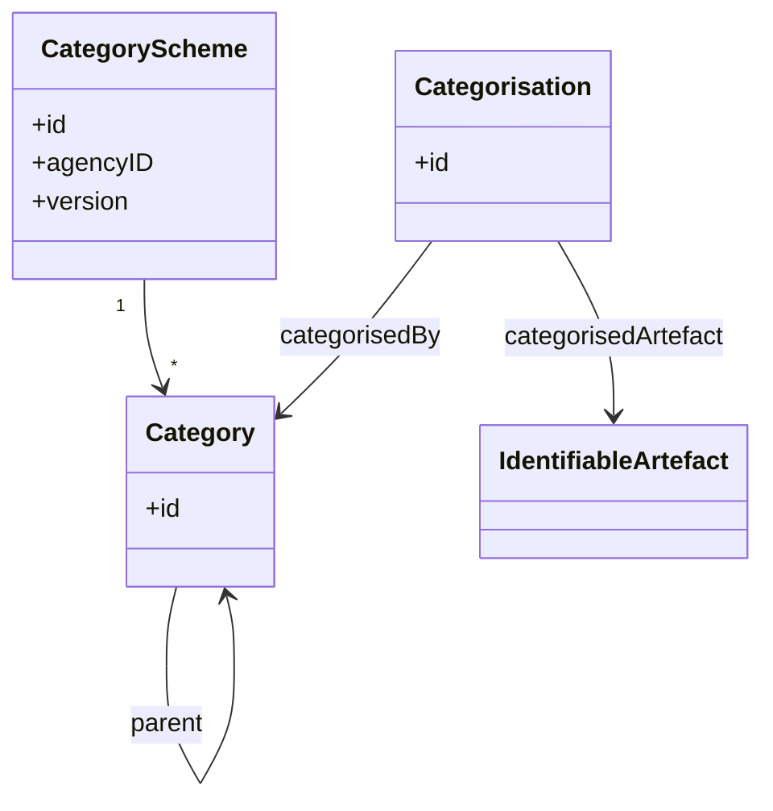
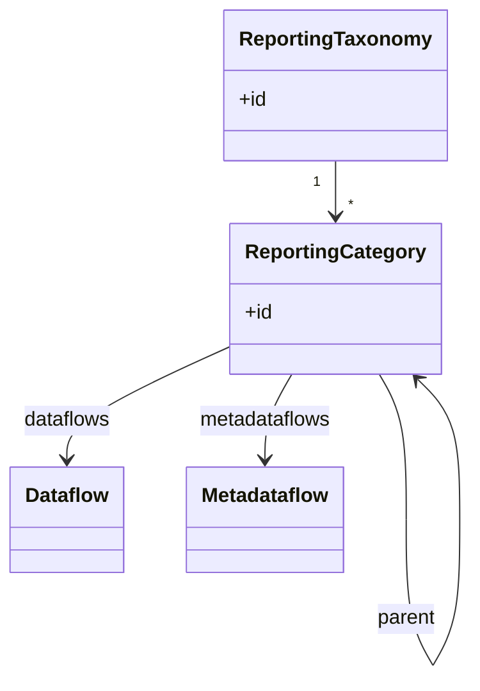
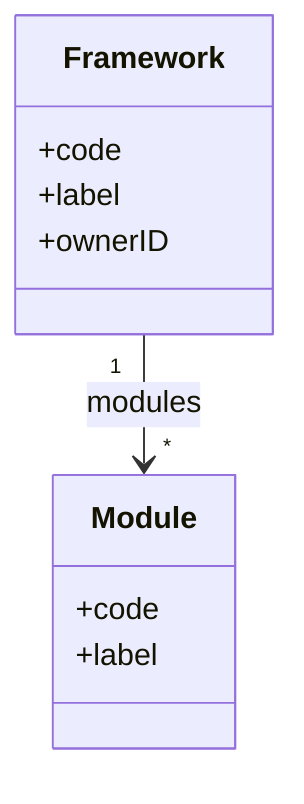
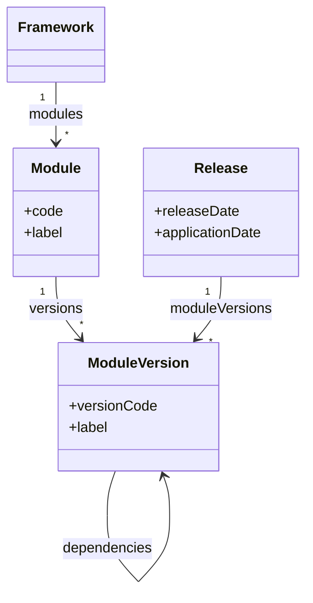

# 1. Other Artefacts overview

This chapter covers the SDMX and DPM artefacts that sit between the glossary (§01) and the data-definition (§02) layers and that have a real cross-model correspondence: **classification** (CategoryScheme/Category ↔ Framework/Module) and **reporting taxonomy** (ReportingTaxonomy/ReportingCategory ↔ ModuleVersion).

## 1.1 SDMX classification and reporting taxonomy artefacts

### CategoryScheme / Category

- **CategoryScheme / Category**
  Scheme for organising subject-domain classifications. Categories are hierarchical (single-parent) and provide a taxonomy for navigating structural artefacts. CategorySchemes are used to build navigation trees and subject-matter groupings.
  - *Example*: A CategoryScheme `DOMAINS` with Categories `ECONOMY`, `POPULATION`, `ENVIRONMENT`, where `ECONOMY` has children `GDP`, `TRADE`, `FINANCE`.

- **Categorisation**
  Maintainable artefact that links any IdentifiableArtefact to a Category. This is the mechanism for placing Dataflows (or other artefacts) into a classification hierarchy.
  - *Example*: A Categorisation linking Dataflow `DF_BOP` to Category `ECONOMY > TRADE`.

### Reporting taxonomy

- **ReportingTaxonomy / ReportingCategory**
  Specialised scheme for organising reporting obligations. Unlike CategorySchemes (general classification), ReportingTaxonomies specifically group Dataflows and Metadataflows for reporting purposes. ReportingCategories can directly reference the flows they contain.
  - *Example*: A ReportingTaxonomy `ANNUAL_REPORTING` with ReportingCategories for each reporting domain, each linking to relevant Dataflows.

### Mapping artefacts in this chapter's territory

SDMX maps that operate over CategorySchemes, ReportingTaxonomies, and OrganisationSchemes are first-class maintainable artefacts:

- **ReportingTaxonomyMap** — version-to-version correspondence between deployable bundles.
- **CategorySchemeMap** — documented in [§05 §2.9](../05_gaps/02_specific_gap_analysis.md#29-categoryschememap-sdmx-feature-without-dpm-equivalent) as a gap, since its DPM image is a workaround (Framework rebrand/merge via ConceptRelation) rather than a structural correspondence.
- **OrganisationSchemeMap** — documented in [§04 §3.3](../04_versioning_and_extensibility/03_detailed_mapping_rules.md#33-organisationschememap), since Organisations live in §04.

## 1.2 DPM classification and reporting taxonomy artefacts

### Framework

- **Framework**
  Top-level container for a reporting domain. A Framework groups related Modules and is owned by an Organisation (the `Owner` field; the Organisation/Agency mapping itself is documented in [§04 §3.1](../04_versioning_and_extensibility/03_detailed_mapping_rules.md#31-agency-organisation-role-owner)). Frameworks provide the highest-level navigation structure.
  - *Example*: Framework `EBA_REPORTING` owned by `EBA`, containing Modules `FINREP`, `COREP`, `LIQUIDITY`.

### Modules and ModuleVersions

- **Module**
  Coherent package of artefacts within a Framework — typically a reporting taxonomy such as `FINREP` or `COREP`. A Module is itself a stable identifier; its content evolves through ModuleVersions. Tables, Variables, Operations, and the glossary roots in scope for a reporting obligation are attached to a *ModuleVersion*, not directly to the Module.

- **ModuleVersion**
  Versioned, deployable bundle of artefacts. A ModuleVersion is the unit reporters submit against: it lists the Variables, Operations, Tables, and glossary roots that are in scope for a particular release of the Module. ModuleVersions can declare dependencies on other ModuleVersions (e.g. a national-extension module depending on a base module). ModuleVersions are pinned to one or more Releases through the Release artefact (see [§04 §3.4](../04_versioning_and_extensibility/03_detailed_mapping_rules.md#34-release-version-validity)).
  - *Example*: ModuleVersion `FINREP:3.2` containing the Tables, Variables, and Operations active in the FINREP 3.2 reporting cycle, depending on `EBA_GLOSSARY:2024-Q1`.

This Module / ModuleVersion split is the structural counterpart to SDMX `ReportingTaxonomy` (the deployable bundle reporters submit against). The detailed correspondence is documented in [§3.2 of the detailed mapping rules](03_detailed_mapping_rules.md#32-reportingtaxonomy-reportingcategory-moduleversion). Versioning behaviour for Module/ModuleVersion is covered in [§04 §1.2](../04_versioning_and_extensibility/01_versioning_overview.md#12-dpm-versioning-model).

