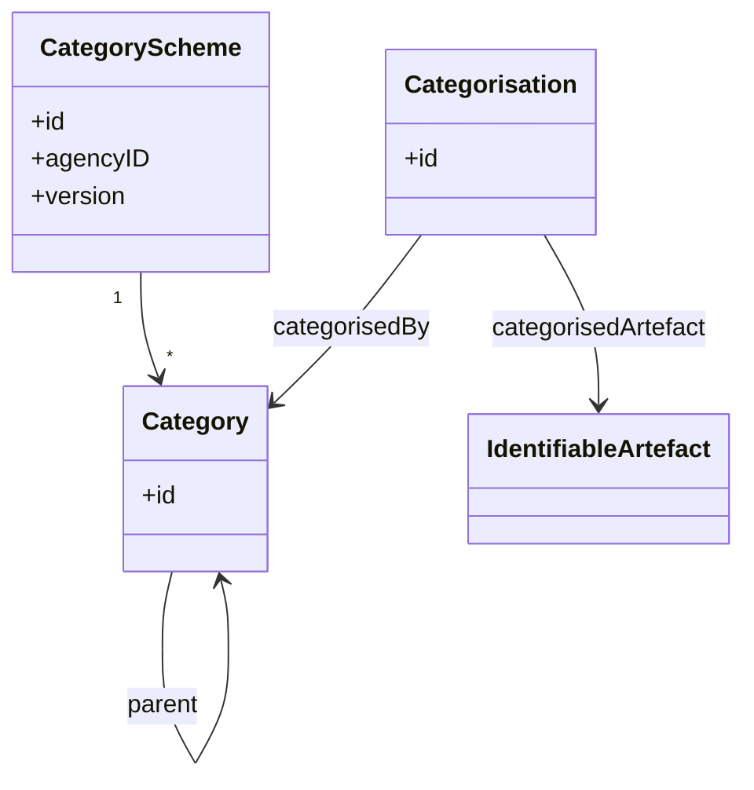
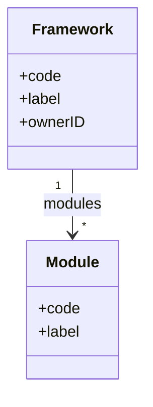

# 1. Other Artefacts overview

This chapter covers the SDMX and DPM artefacts that sit between the glossary (§01) and the data-definition (§02) layers. After the meeting decision to treat **Module/ModuleVersion** as core data-definition concerns, the only correspondence remaining here is **classification** (CategoryScheme/Category ↔ Framework/Module) — the secondary, navigation-level mapping.

> **Moved out of this chapter**: The **primary** Module mapping (ReportingTaxonomy / ReportingCategory ↔ Module / ModuleVersion), the Categorisation rules, and ReportingTaxonomyMap now live in [§02 §3.4](../02_data_definition/03_detailed_mapping_rules.md#34-reporting-bundle-reportingtaxonomy-reportingcategory-moduleversion). Module is mandatory in DPM (every Table belongs to a Module) and therefore belongs to the data-definition layer rather than to "other artefacts".

## 1.1 SDMX classification and reporting taxonomy artefacts

### CategoryScheme / Category

- **CategoryScheme / Category**
  Scheme for organising subject-domain classifications. Categories are hierarchical (single-parent) and provide a taxonomy for navigating structural artefacts. CategorySchemes are used to build navigation trees and subject-matter groupings.
  - *Example*: A CategoryScheme `DOMAINS` with Categories `ECONOMY`, `POPULATION`, `ENVIRONMENT`, where `ECONOMY` has children `GDP`, `TRADE`, `FINANCE`.

- **Categorisation**
  Maintainable artefact that links any IdentifiableArtefact to a Category. This is the mechanism for placing Dataflows (or other artefacts) into a classification hierarchy.
  - *Example*: A Categorisation linking Dataflow `DF_BOP` to Category `ECONOMY > TRADE`.

### Reporting taxonomy — moved to §02

ReportingTaxonomy / ReportingCategory and ReportingTaxonomyMap are documented in [§02 §3.4](../02_data_definition/03_detailed_mapping_rules.md#34-reporting-bundle-reportingtaxonomy-reportingcategory-moduleversion) alongside the Module / ModuleVersion mapping.

### Mapping artefacts in this chapter's territory

- **CategorySchemeMap** — documented in [§05 §2.9](../05_gaps/02_specific_gap_analysis.md#29-categoryschememap-sdmx-feature-without-dpm-equivalent) as a gap, since its DPM image is a workaround (Framework rebrand/merge via ConceptRelation) rather than a structural correspondence.
- **ReportingTaxonomyMap** — moved to [§02 §3.4.7](../02_data_definition/03_detailed_mapping_rules.md#347-reportingtaxonomymap).
- **OrganisationSchemeMap** — documented in [§04 §3.3](../04_versioning_and_extensibility/03_detailed_mapping_rules.md#33-organisationschememap), since Organisations live in §04.

## 1.2 DPM classification and reporting taxonomy artefacts

### Framework

- **Framework**
  Top-level container for a reporting domain. A Framework groups related Modules and is owned by an Organisation (the `Owner` field; the Organisation/Agency mapping itself is documented in [§04 §3.1](../04_versioning_and_extensibility/03_detailed_mapping_rules.md#31-agency-organisation-role-owner)). Frameworks provide the highest-level navigation structure.
  - *Example*: Framework `EBA_REPORTING` owned by `EBA`, containing Modules `FINREP`, `COREP`, `LIQUIDITY`.

### Modules and ModuleVersions — moved to §02

The Module / ModuleVersion artefacts and their mapping to SDMX ReportingTaxonomy / ReportingCategory are documented in [§02 §3.4](../02_data_definition/03_detailed_mapping_rules.md#34-reporting-bundle-reportingtaxonomy-reportingcategory-moduleversion). The Module / ModuleVersion definitions in the §02 overview at [Modules and ModuleVersions](../02_data_definition/01_data_definition_overview.md#modules-and-moduleversions) replace what used to live here.

