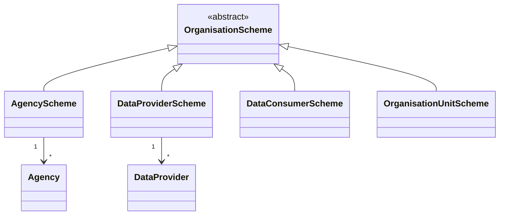
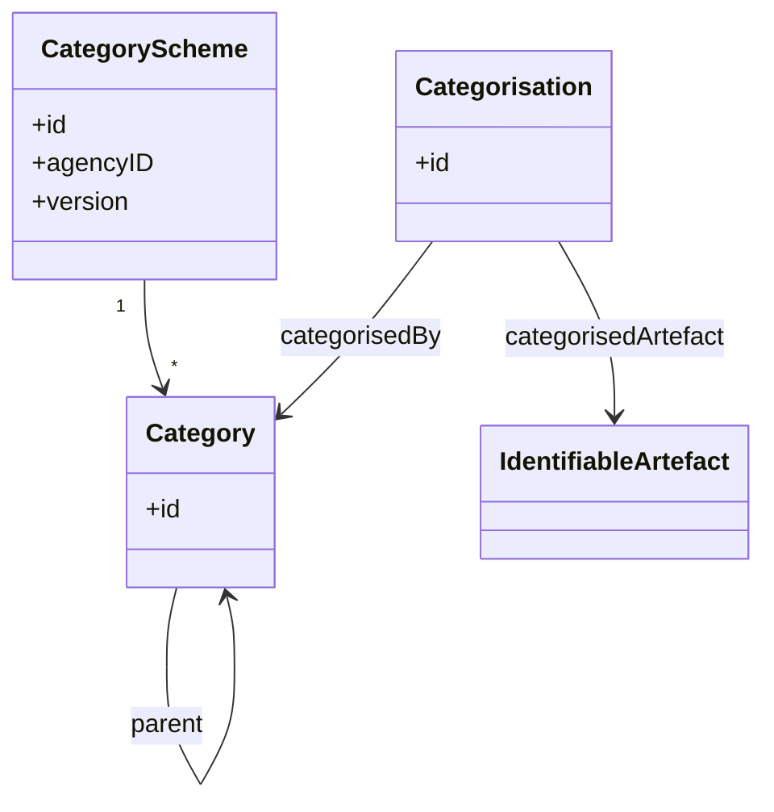
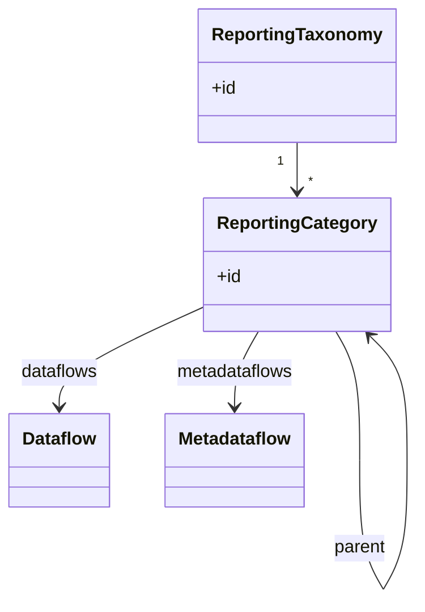
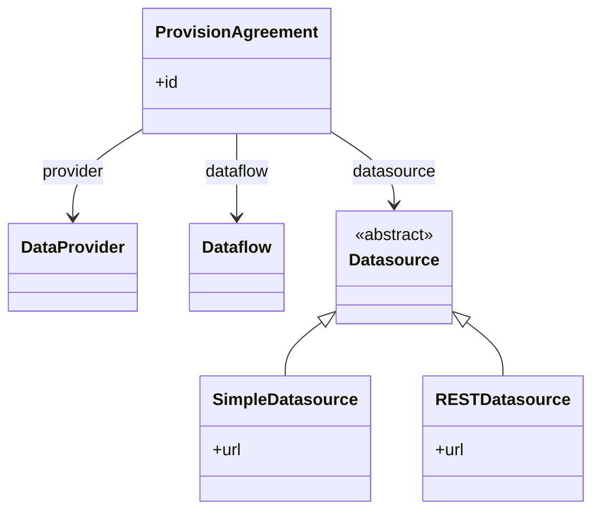
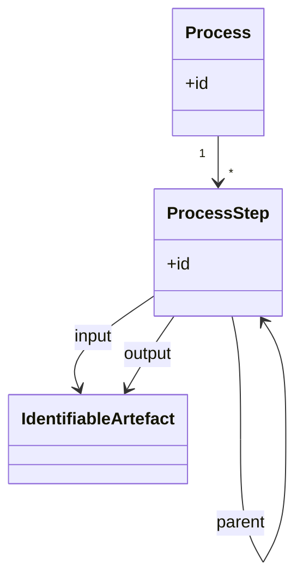
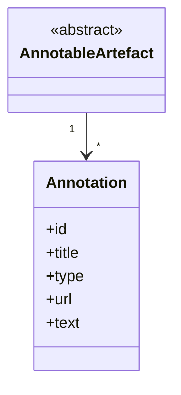
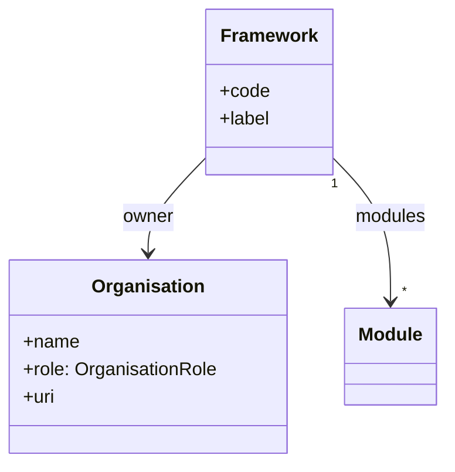
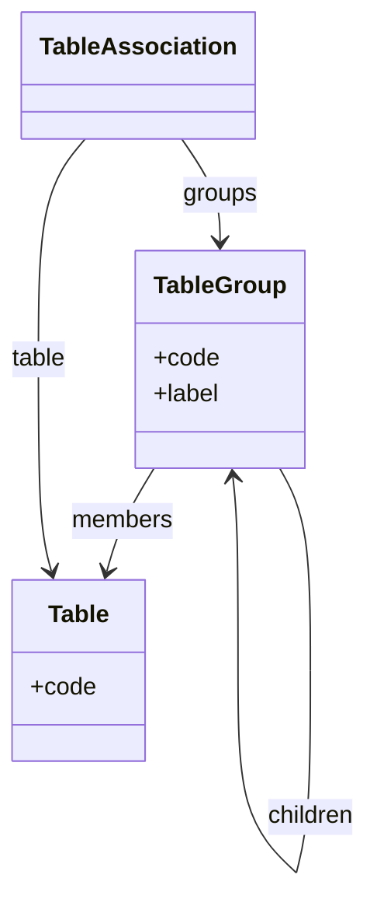
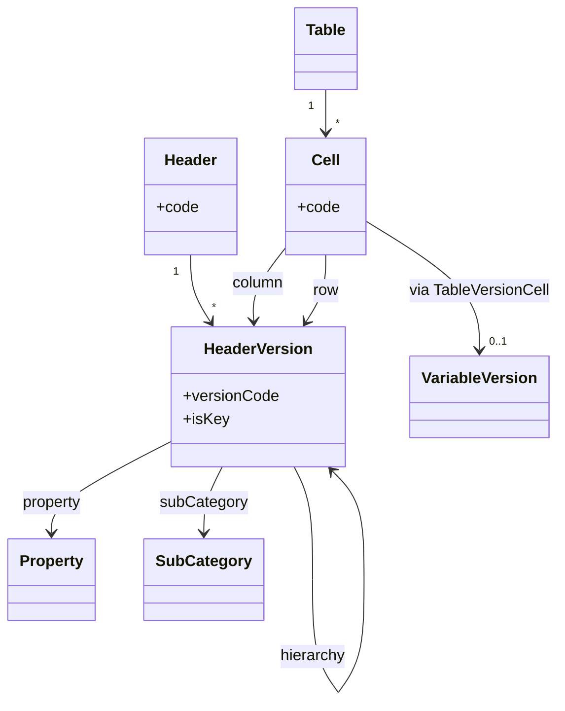
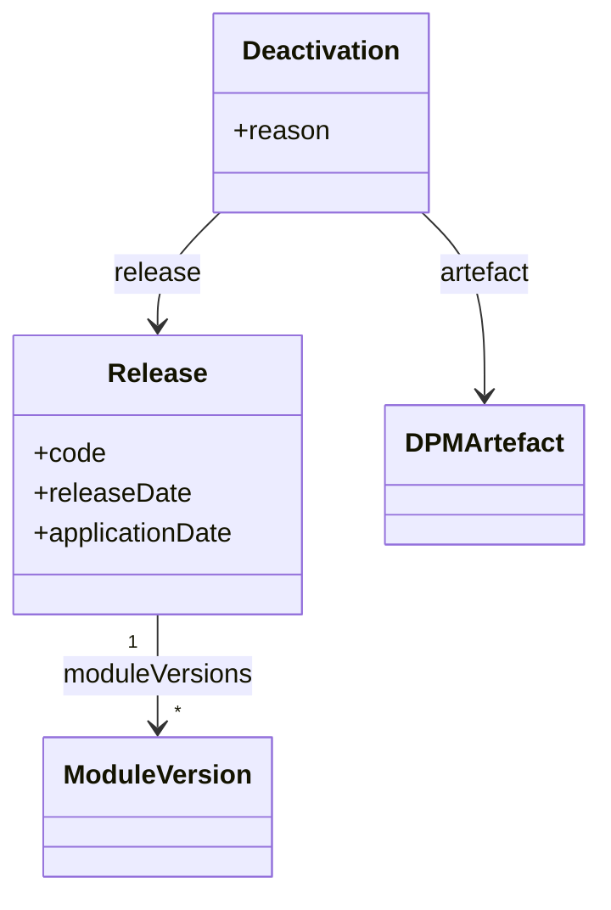

# 1. Other Artefacts overview

This chapter introduces the "other artefacts" of the two metamodels: SDMX and DPM. It covers organisational structures, classification and grouping mechanisms, provisioning, rendering, and lifecycle management. These artefacts support the glossary and data definition layers by providing context, ownership, navigation, and temporal management.

## 1.1 SDMX Organisational and Supporting artefacts

SDMX provides a rich set of artefacts for organising structural metadata, defining ownership, classifying content, and managing data provisioning. These artefacts sit alongside the glossary (Codelists, Concepts) and data definition (DSDs, Dataflows) layers.

### Organisation schemes

SDMX models organisations through specialised ItemSchemes. Each scheme contains items representing different organisational roles.

- **AgencyScheme / Agency**
  Scheme containing Agencies—organisations responsible for maintaining SDMX artefacts. Every MaintainableArtefact references a maintaining Agency. Agencies are hierarchical (an Agency can contain child Agencies).
  - *Example*: `SDMX:AGENCIES` containing `ECB`, `EUROSTAT`, `IMF` as Agencies.

- **DataProviderScheme / DataProvider**
  Scheme containing DataProviders—organisations that supply data. DataProviders are referenced in ProvisionAgreements and can have constraints attached.
  - *Example*: `ECB:DATA_PROVIDERS` containing national central banks as DataProviders.

- **DataConsumerScheme / DataConsumer**
  Scheme containing DataConsumers—organisations that receive data. Less commonly used than DataProviders.

- **OrganisationUnitScheme / OrganisationUnit**
  Generic organisation scheme for units that don't fit the Agency/Provider/Consumer pattern.

### Classification and categorisation

- **CategoryScheme / Category**
  Scheme for organising subject-domain classifications. Categories are hierarchical (single-parent) and provide a taxonomy for navigating structural artefacts. CategorySchemes are used to build navigation trees and subject-matter groupings.
  - *Example*: A CategoryScheme `DOMAINS` with Categories `ECONOMY`, `POPULATION`, `ENVIRONMENT`, where `ECONOMY` has children `GDP`, `TRADE`, `FINANCE`.

- **Categorisation**
  Maintainable artefact that links any IdentifiableArtefact to a Category. This is the mechanism for placing Dataflows (or other artefacts) into a classification hierarchy.
  - *Example*: A Categorisation linking Dataflow `DF_BOP` to Category `ECONOMY > TRADE`.

### Reporting taxonomy

- **ReportingTaxonomy / ReportingCategory**
  Specialised scheme for organising reporting obligations. Unlike CategorySchemes (general classification), ReportingTaxonomies specifically group Dataflows and Metadataflows for reporting purposes. ReportingCategories can directly reference the flows they contain.
  - *Example*: A ReportingTaxonomy `ANNUAL_REPORTING` with ReportingCategories for each reporting domain, each linking to relevant Dataflows.

### Provisioning

- **ProvisionAgreement**
  Maintainable artefact representing a data supply contract between a DataProvider and a Dataflow. It specifies who provides what data and optionally where to retrieve it (Datasource).
  - *Example*: A ProvisionAgreement where `BANCO_DE_ESPANA` (DataProvider) provides data for `DF_BOP_QUARTERLY` (Dataflow).

- **Datasource**
  Specifies where data can be retrieved:
  - **SimpleDatasource**: URL pointing to an SDMX file.
  - **RESTDatasource**: SDMX REST API endpoint (with optional query parameters).

### Process and lineage

- **Process**
  Maintainable artefact describing a workflow or data processing pipeline. Contains **ProcessStep** items that can reference input/output artefacts and transformations. Useful for documenting data lineage and production processes.

### Annotations

- **Annotation**
  Generic extension mechanism available on all AnnotableArtefacts (i.e. almost everything in SDMX). Annotations carry:
  - `id`: Optional identifier.
  - `title`: Human-readable title.
  - `type`: Classification of the annotation (implementation-defined).
  - `url`: Link to external resource.
  - `text`: Multilingual text content.

  Annotations are used for implementation-specific metadata, documentation links, rendering hints, and other extensibility needs.

## 1.2 DPM Organisational and Supporting artefacts

DPM provides artefacts for organising reporting requirements, managing ownership, grouping tables, controlling lifecycle, and defining visual presentation. These complement the glossary (Categories, Properties) and data definition (Variables, Tables) layers.

### Organisation and ownership

- **Organisation**
  Represents an entity involved in the reporting framework. Organisations have roles that define their relationship to artefacts.
  - *OrganisationRole*: `owner` (maintains artefacts), `publisher` (publishes releases), `entry_point` (data submission endpoint), `responsible` (accountable for content).
  - *Example*: Organisation `EBA` with role `owner` for the banking supervision framework.

- **Framework**
  Top-level container for a reporting domain. A Framework groups related Modules and is owned by an Organisation. Frameworks provide the highest-level navigation structure.
  - *Example*: Framework `EBA_REPORTING` owned by `EBA`, containing Modules `FINREP`, `COREP`, `LIQUIDITY`.

### Table grouping

- **TableGroup**
  Artefact for organising Tables into logical groups. TableGroups can be nested (recursive), allowing hierarchical navigation of tables within a Module.
  - *Example*: TableGroup `BALANCE_SHEET` containing Tables `T01_ASSETS`, `T02_LIABILITIES`, with a child TableGroup `OFF_BALANCE` for off-balance-sheet items.

- **TableAssociation**
  Links a Table to one or more TableGroups. This many-to-many relationship allows a Table to appear in multiple groupings (e.g. by subject and by reporting frequency).

### Rendering: Headers and Cells

DPM's rendering component defines how tables are visually structured. This has no direct SDMX equivalent.

- **Header / HeaderVersion**
  Individual position within a table axis (X = columns, Y = rows, Z = sheets/pages). Each HeaderVersion links to glossary terms: always a **Property**, and optionally a **Context** (Property–Item pairs for fixed values) or a **SubCategory** (to narrow selectable Items). Headers can be nested (parent–child) for grouped structures. A Header flagged `IsKey` defines an open-axis key.

- **Cell**
  Intersection of leaf-level Headers from different axes within a **Table**. A Cell references its constituent Headers (column, row, and optionally sheet). Via **TableVersionCell**, it optionally links to a **VariableVersion** — the link is absent when `IsVoid=TRUE`. The Cell's semantics are inherited from its constituent Headers. Key Headers do not result in Cells.

- *Example*: A column Header referencing the "Reference period" Property with a Context fixing Item "2024-Q1", vs a Key Header on the same Property where the reporter selects from allowed periods.

### Lifecycle management

- **Release**
  Publication milestone that bundles ModuleVersions for a reporting period. Releases have temporal semantics:
  - `releaseDate`: When the release is published (available for review).
  - `applicationDate`: When reporting obligations begin (effective date for data collection).
  - *Example*: Release `2024-Q2` with `releaseDate = 2024-03-15` and `applicationDate = 2024-04-01`.

- **Deactivation**
  Soft-delete mechanism for artefacts. Instead of physically removing an artefact, a Deactivation record marks it as inactive from a specific Release. Deactivated artefacts remain for historical reference but are excluded from active use.
  - `artefact`: The deactivated artefact.
  - `release`: The Release from which deactivation applies.
  - `reason`: Optional explanation.
  - *Example*: Table `T05_OLD` deactivated in Release `2024-Q1` with reason "Replaced by T05_NEW".

### Annotations and extensibility

DPM artefacts support multilingual labels (`InternationalString`) and descriptions throughout. While DPM does not have a generic "Annotation" mechanism like SDMX, extensibility is achieved through:

- **Description fields**: All major artefacts have `description: InternationalString`.
- **Custom properties**: Implementation-specific attributes can be added via the metamodel infrastructure.
- **External references**: Artefacts can reference external documentation via URIs.

In practice, implementations often add domain-specific metadata (e.g. legal references, change history) as extended attributes on the relevant artefacts.
