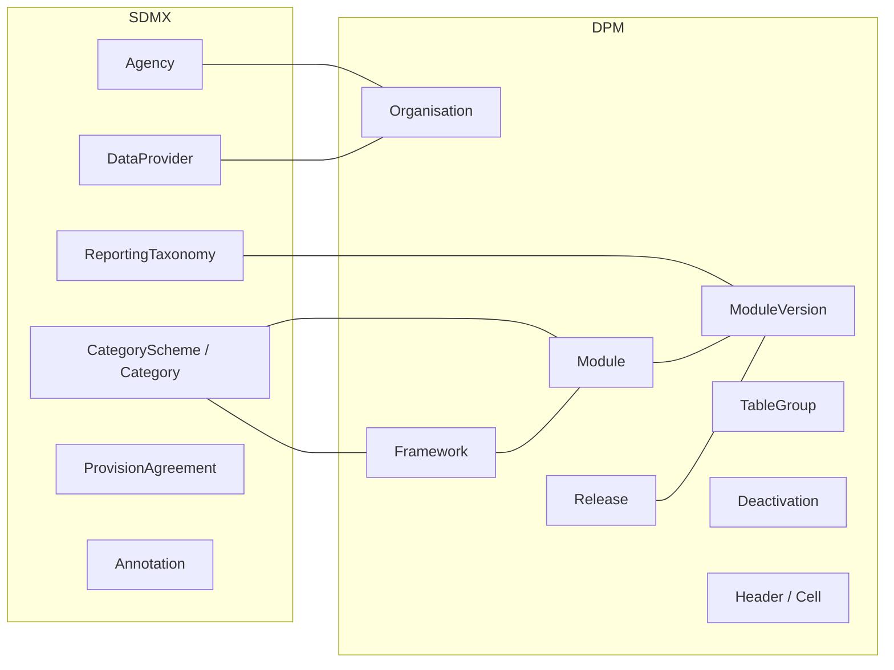

# 2. High-level mapping summary

This chapter gives a compact view of how the SDMX and DPM organisational and supporting artefacts relate to each other. It complements the detailed descriptions in sections 1.1 and 1.2.

## 2.1 Tabular mapping

The table below summarises the main correspondences. It is intentionally high level; edge cases and implementation details are covered in the detailed mapping rules.

| SDMX artefact | DPM artefact | Mapping notes |
| --- | --- | --- |
| Agency | Organisation (role=owner) | Both represent maintaining/owning entities. SDMX Agencies are hierarchical; DPM uses flat Organisations with roles. |
| DataProvider | Organisation (role=entry_point) | Both represent data suppliers. SDMX has dedicated schemes; DPM uses role differentiation. |
| AgencyScheme | – | SDMX groups Agencies into schemes; DPM Organisations are not grouped into schemes. |
| CategoryScheme / Category | Framework / Module | Both provide subject-domain grouping. SDMX Categories classify artefacts; DPM Frameworks/Modules organise reporting domains. Module is the **stable identifier** for a reporting taxonomy; the versioned content sits in ModuleVersion (next row). |
| Categorisation | (implicit in Module membership) | SDMX explicitly links artefacts to Categories; DPM membership is implicit via ModuleVersion contents. |
| ReportingTaxonomy / ReportingCategory | ModuleVersion | Both are the **deployable unit** for reporting obligations — SDMX ReportingCategories link to the Dataflows reporters submit against; DPM ModuleVersions contain the Tables and Variables reporters submit against. The correspondence is partial: ReportingTaxonomy is a navigation wrapper over existing Dataflows, while ModuleVersion contains the structural definitions themselves. ReportingCategory hierarchy → optional TableGroup hierarchy inside the ModuleVersion. |
| ReportingTaxonomyMap | ModuleVersion ↔ ModuleVersion correspondence | SDMX ReportingTaxonomyMap maps a ReportingTaxonomy onto another (e.g. a version bump). DPM expresses the same intent through the relationship between two ModuleVersions of the same Module. |
| ProvisionAgreement | (external to DPM) | SDMX formalises data supply contracts; DPM focuses on requirements, not provisioning. |
| Datasource | (external to DPM) | SDMX specifies data retrieval endpoints; DPM does not model data sources. |
| Process | (external to DPM) | SDMX models workflows and lineage; DPM focuses on reporting requirements, not production processes. |
| Annotation | description / InternationalString | SDMX has generic Annotations; DPM uses typed description fields and multilingual strings. |
| – | TableGroup / TableAssociation | DPM-specific grouping for tables within a Module; no direct SDMX equivalent. |
| – | Header / HeaderVersion / Cell | DPM rendering layer; SDMX does not model presentation. |
| – | Release | DPM publication milestone with temporal semantics; SDMX uses versioning but lacks explicit releases. |
| – | Deactivation | DPM soft-delete mechanism; SDMX uses version validity periods (`validFrom`, `validTo`). |

## 2.2 Graphical mapping overview

The diagram below shows the main organisational and supporting artefacts on each side and their high-level correspondences.

The lines indicate "primary" correspondences; they do not exclude alternative modelling choices.

## 2.3 Artefacts without a direct counterpart

### 2.3.1 SDMX-only

- **AgencyScheme**
  SDMX groups Agencies into maintainable schemes. DPM Organisations are standalone entities without a scheme container.

- **DataProviderScheme / DataConsumerScheme**
  SDMX has dedicated schemes for data providers and consumers. DPM models all organisations uniformly, distinguishing them by `OrganisationRole`.

- **ProvisionAgreement / Datasource**
  SDMX formalises data supply contracts and specifies retrieval endpoints. DPM focuses on defining reporting requirements; the actual data collection and provisioning infrastructure is outside the metamodel.

- **Process**
  SDMX models data production workflows and lineage via Process and ProcessStep. DPM does not have a workflow/lineage artefact; such concerns are handled externally.

- **Annotation (generic)**
  SDMX Annotations provide a flexible key-value extension mechanism on any artefact. DPM uses structured description fields and InternationalString but lacks a generic annotation pattern.

### 2.3.2 DPM-only

- **TableGroup / TableAssociation**
  DPM provides explicit artefacts for grouping Tables within a Module, supporting hierarchical navigation and multiple groupings per Table. SDMX does not have table-level grouping (Dataflows are organised via Categories or ReportingTaxonomies, not grouped directly).

- **Header / HeaderVersion / Cell**
  DPM's rendering layer defines table axes and cell structure for data collection forms. SDMX intentionally excludes presentation concerns; how data is displayed is left to implementations.

- **Cell semantics**
  DPM Cells are intersections of leaf-level Headers; their semantic meaning is inherited from the glossary terms (Property, Context, SubCategory) on the constituent Headers. This rendering-level structure has no SDMX equivalent.

- **Release**
  DPM Releases bundle ModuleVersions with explicit `releaseDate` and `applicationDate`. SDMX uses artefact versioning with optional `validFrom`/`validTo` but lacks a dedicated "release" artefact that groups multiple structures for a reporting period.

- **Deactivation**
  DPM's soft-delete mechanism preserves historical artefacts while marking them inactive. SDMX achieves similar effects via version validity periods, but without a dedicated Deactivation artefact.

- **OrganisationRole**
  DPM explicitly models organisation roles (`owner`, `publisher`, `entry_point`, `responsible`). SDMX distinguishes organisations by scheme type (Agency vs DataProvider vs DataConsumer) rather than by role attribute.

These asymmetries reflect different design philosophies: SDMX focuses on data exchange and structural metadata, while DPM emphasises reporting requirements, rendering, and lifecycle management.
