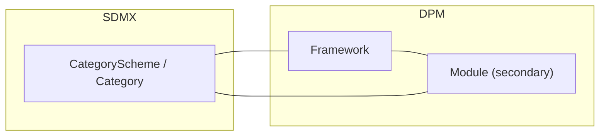

# 2. High-level mapping summary

This chapter gives a compact view of how the SDMX classification and reporting-taxonomy artefacts relate to their DPM counterparts. It complements the detailed descriptions in chapter 1 and the rules in chapter 3.

## 2.1 Tabular mapping

| SDMX artefact                         | DPM artefact                                    | Mapping notes                                                                                                                                                                                                                                                                                    |
| ------------------------------------- | ----------------------------------------------- | ------------------------------------------------------------------------------------------------------------------------------------------------------------------------------------------------------------------------------------------------------------------------------------------------ |
| CategoryScheme / Category             | Framework / Module                              | Both provide subject-domain grouping. SDMX Categories classify artefacts; DPM Frameworks/Modules organise reporting domains. The Category↔Module side of this row is a **secondary** mapping for Module: the **primary** Module mapping is to ReportingTaxonomy, documented in [§02 §3.4](../02_data_definition/03_detailed_mapping_rules.md#34-reporting-bundle-reportingtaxonomy-reportingcategory-moduleversion). |

For mapping artefacts that touch this chapter's territory but are documented elsewhere, see the registry in [§3.5 Cross-reference](03_detailed_mapping_rules.md#34-cross-reference-registry-of-sdmx-mapping-artefacts).

## 2.2 Graphical mapping overview

The lines indicate the secondary CategoryScheme-based correspondence. The primary deployable-bundle mapping (ReportingTaxonomy ↔ Module / ModuleVersion, including Categorisation and ReportingTaxonomyMap) is documented in [§02 §3.4](../02_data_definition/03_detailed_mapping_rules.md#34-reporting-bundle-reportingtaxonomy-reportingcategory-moduleversion).

## 2.3 Asymmetries noted in §05

The following asymmetries surface in this chapter's territory but have their canonical statement elsewhere:

- **TableGroup / TableAssociation** (DPM-only): partial image via ReportingCategory only inside a ReportingTaxonomy. Full gap statement and CategoryScheme proposal in [§05 §2.8](../05_gaps/02_specific_gap_analysis.md#28-tablegroup-tableassociation-dpm-feature-without-sdmx-equivalent).
- **Framework owner**: the SDMX `agencyID` on the CategoryScheme decides the DPM `Framework.OwnerID`. The Agency↔Organisation mapping itself lives in [§04 §3.1](../04_versioning_and_extensibility/03_detailed_mapping_rules.md#31-agency-organisation-role-owner).
