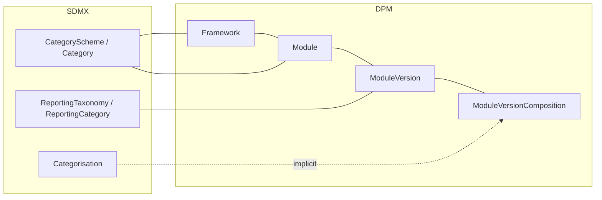

# 2. High-level mapping summary

This chapter gives a compact view of how the SDMX classification and reporting-taxonomy artefacts relate to their DPM counterparts. It complements the detailed descriptions in chapter 1 and the rules in chapter 3.

## 2.1 Tabular mapping

| SDMX artefact                         | DPM artefact                                    | Mapping notes                                                                                                                                                                                                                                                                                    |
| ------------------------------------- | ----------------------------------------------- | ------------------------------------------------------------------------------------------------------------------------------------------------------------------------------------------------------------------------------------------------------------------------------------------------ |
| CategoryScheme / Category             | Framework / Module                              | Both provide subject-domain grouping. SDMX Categories classify artefacts; DPM Frameworks/Modules organise reporting domains. Module is the stable identifier; the versioned content sits in ModuleVersion (next row).                                                                            |
| Categorisation                        | (implicit in Module membership)                 | SDMX explicitly links artefacts to Categories; DPM membership is implicit via ModuleVersion contents. Lossy round-trip — see [§3.1.5](03_detailed_mapping_rules.md#315-categorisation-implicit-in-module-membership).                                                                            |
| ReportingTaxonomy / ReportingCategory | ModuleVersion                                   | The **deployable unit** for reporting obligations — SDMX ReportingCategories link to the Dataflows reporters submit against; DPM ModuleVersions contain the Tables and Variables reporters submit against. ReportingCategory hierarchy → optional TableGroup hierarchy inside the ModuleVersion. |
| ReportingTaxonomyMap                  | ModuleVersion ↔ ModuleVersion correspondence    | Maps a ReportingTaxonomy onto another (e.g. a version bump). DPM expresses the same intent through the relationship between two ModuleVersions of the same Module.                                                                                                                               |

For mapping artefacts that touch this chapter's territory but are documented elsewhere, see the registry in [§3.5 Cross-reference](03_detailed_mapping_rules.md#34-cross-reference-registry-of-sdmx-mapping-artefacts).

## 2.2 Graphical mapping overview

The lines indicate "primary" correspondences; they do not exclude alternative modelling choices.

## 2.3 Asymmetries noted in §05

The following asymmetries surface in this chapter's territory but have their canonical statement elsewhere:

- **TableGroup / TableAssociation** (DPM-only): partial image via ReportingCategory only inside a ReportingTaxonomy. Full gap statement and CategoryScheme proposal in [§05 §2.8](../05_gaps/02_specific_gap_analysis.md#28-tablegroup-tableassociation-dpm-feature-without-sdmx-equivalent).
- **Categorisation lossy round-trip**: SDMX Categorisations are first-class versioned artefacts; DPM membership is implicit. The original Categorisation `id` and `version` can be preserved via the `DPM_CATEGORISATION_ID` annotation (see the marker registry in [§04 §3.6.2](../04_versioning_and_extensibility/03_detailed_mapping_rules.md#362-recognised-dpm-markers-tier-a-canonical-registry)).
- **Framework owner**: the SDMX `agencyID` on the CategoryScheme decides the DPM `Framework.OwnerID`. The Agency↔Organisation mapping itself lives in [§04 §3.1](../04_versioning_and_extensibility/03_detailed_mapping_rules.md#31-agency-organisation-role-owner).
