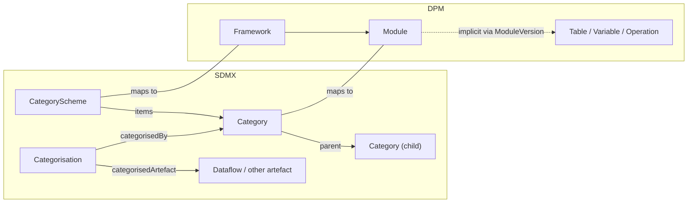
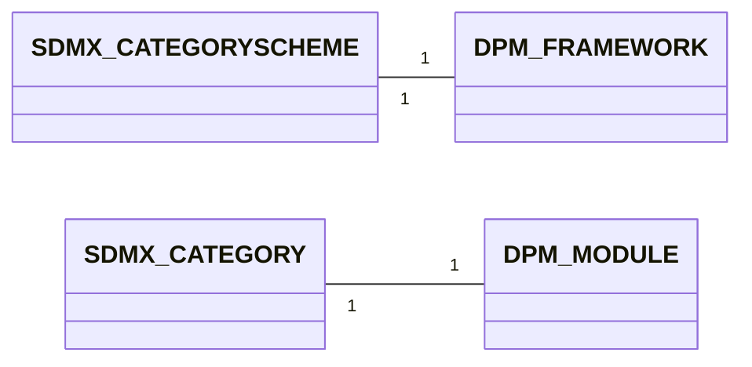
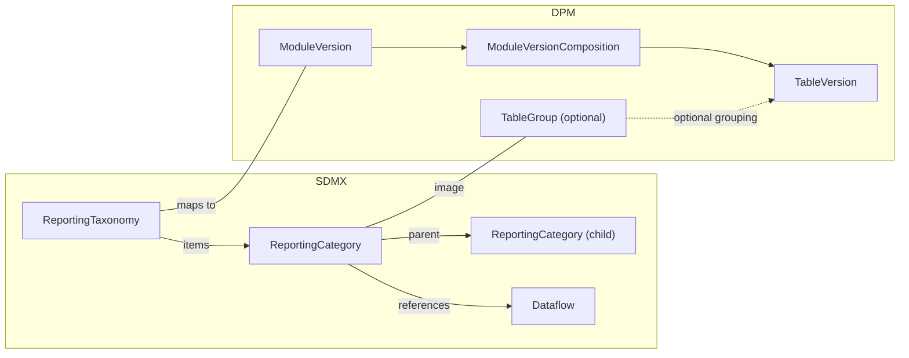
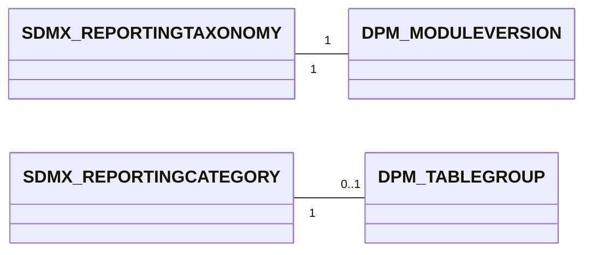

# 3. Detailed mapping rules

This chapter provides the detailed rules for the cross-model correspondences that sit between the glossary (§01) and data-definition (§02) layers and that are not already covered as a versioning/extensibility concern (§04) or as a gap (§05). Concretely, this chapter covers:

- **Classification** (§3.1) — CategoryScheme/Category ↔ Framework/Module, plus Categorisation as implicit Module membership.
- **Reporting taxonomy** (§3.2) — ReportingTaxonomy/ReportingCategory ↔ ModuleVersion (the deployable-unit alignment).
- **Mapping artefacts** within §03 territory (§3.3 ReportingTaxonomyMap), plus a registry of all SDMX maps and where each is documented (§3.4). CategorySchemeMap has been moved to [§05 §2.9](../05_gaps/02_specific_gap_analysis.md#29-categoryschememap-sdmx-feature-without-dpm-equivalent) — it is treated as a gap because its DPM image is a workaround via ConceptRelation rather than a structural correspondence.

> - **Prerequisites**:
>     - The general identification and multilingual rules from [§00 Basics](../00_basics/02_detailed_mapping_rules.md) apply throughout.
>     - The Organisation/Agency mapping that grounds the `Owner` field on Framework lives in [§04 §3.1](../04_versioning_and_extensibility/03_detailed_mapping_rules.md#31-agency-organisation-role-owner). Treating organisations as the foundation for ownership and extensibility is the reason that mapping moved out of this chapter.
>     - Release/Deactivation/Annotation detailed rules — including the canonical registry of recognised annotation markers (`DPM_SIGNATURE`, `DPM_DEFAULT_ITEM`, `DPM_COMPOUND_COMPONENTS`, `DPM_RELEASE_CODE`, `DPM_FROM_REFERENCE_DATE`, `DPM_DEACTIVATION_REASON`, `DPM_PROVISION_AGREEMENT`, `DPM_PROCESS`, `DPM_TABLEGROUP`, etc.) — live in [§04 §3](../04_versioning_and_extensibility/03_detailed_mapping_rules.md).
>     - Artefacts that have no counterpart in the other model (TableGroup, ProvisionAgreement/Datasource, Process/ProcessStep, Header/Cell rendering) are documented in [§05 Gaps §2](../05_gaps/02_specific_gap_analysis.md).
> - **Scope**: only real cross-model correspondences in classification and reporting taxonomy. The chapter is intentionally focused; readers chasing organisational, lifecycle, or annotation rules should jump to §04, and readers chasing gap statements to §05.

## 3.1 CategoryScheme / Category ↔ Framework / Module

In SDMX, a **CategoryScheme** organises subject-domain Categories in a hierarchy (single-parent). **Categorisation** is a separate maintainable artefact that links any IdentifiableArtefact (typically a Dataflow) to a Category. Together they form a navigation tree over the structural metadata.

In DPM, the equivalent navigation is provided by **Framework** (top-level container per regulation / domain) and **Module** (coherent reporting package within a Framework). Membership of a structural artefact in a Module is **implicit**: a Variable, Table, or Operation belongs to a Module by appearing in one of its ModuleVersions (5.2.2 of the DPM metamodel).

The DPM Framework references an `Owner` Organisation; the mapping of that Organisation to the SDMX `agencyID` is documented separately in [§04 §3.1](../04_versioning_and_extensibility/03_detailed_mapping_rules.md#31-agency-organisation-role-owner).



**Example CategoryScheme**

```xml
<CategoryScheme agencyID="EBA" id="EBA_REPORTING" version="1.0" isPartial="false">
  <Name xml:lang="en">EBA reporting domains</Name>
  <Category id="FINREP">
    <Name xml:lang="en">Financial reporting</Name>
  </Category>
  <Category id="COREP">
    <Name xml:lang="en">Common reporting</Name>
    <Category id="COREP_OF">
      <Name xml:lang="en">Own funds</Name>
    </Category>
    <Category id="COREP_LR">
      <Name xml:lang="en">Leverage ratio</Name>
    </Category>
  </Category>
</CategoryScheme>
```

**Example Framework + Modules**

*Framework*

| FrameworkID | Code           | Name                          | OwnerID |
| ----------- | -------------- | ----------------------------- | ------- |
| 100100001   | EBA_REPORTING  | EBA reporting framework       | 1 (EBA) |

*Modules*

| ModuleID    | FrameworkID  | Code      | Name                  |
| ----------- | ------------ | --------- | --------------------- |
| 100200001   | 100100001    | FINREP    | Financial reporting   |
| 100200002   | 100100001    | COREP     | Common reporting      |
| 100200003   | 100100001    | COREP_OF  | Own funds             |
| 100200004   | 100100001    | COREP_LR  | Leverage ratio        |

### 3.1.1 Mapping cardinality



- From SDMX to DPM: one CategoryScheme maps to one Framework; each Category in the scheme maps to one Module under that Framework. The Category hierarchy is **flattened** — DPM Modules are not nested. Where the SDMX hierarchy is meaningful (e.g. a top-level "COREP" with sub-Categories "COREP_OF", "COREP_LR"), each level becomes a separate Module; the parent–child relationship is encoded only in the Module `Code` naming convention (e.g. `COREP_OF` carries the parent's prefix).
- From DPM to SDMX: one Framework maps to one CategoryScheme; each Module maps to one Category. DPM Modules have no hierarchy, so the resulting SDMX Categories are siblings under the scheme — unless naming conventions encode a hierarchy that the mapping can re-materialise.
- **Categorisation**: SDMX Categorisations have no DPM artefact counterpart. Membership is recorded implicitly through `ModuleVersionComposition` (the linkage of TableVersions to a ModuleVersion). See §3.1.5.

### 3.1.2 Attributes equivalence

#### 3.1.2.1 SDMX CategoryScheme attributes
- maintainable artefact attributes
    - `id`, `agencyID`, `version`
- `Name` (multilingual)
- `Description` (multilingual)
- `isPartial`

#### 3.1.2.2 SDMX Category attributes
- itemScheme `Category` attributes
    - `id`, `urn`
- `Name` (multilingual)
- `Description` (multilingual)
- `parent` Category (single)
- child Categories

#### 3.1.2.3 DPM Framework attributes
- `FrameworkID` (system-generated PK)
- `Code`
- `Name`
- `Description`
- `OwnerID` (FK to Organisation)
- References (4.1.3.2)

#### 3.1.2.4 DPM Module attributes
- `ModuleID` (system-generated PK)
- `FrameworkID` (FK)
- `Code`
- `Name`
- `Description`
- inherits Owner from Framework (4.1.2)

#### 3.1.2.5 Mapping details

| SDMX                              | DPM                              | Notes                                                                                                              |
|-----------------------------------|----------------------------------|--------------------------------------------------------------------------------------------------------------------|
| CategoryScheme.`id`               | Framework.`Code`                 |                                                                                                                    |
| CategoryScheme.`agencyID`         | Framework.`OwnerID` (lookup)     | Lookup the Organisation whose `Acronym` equals the `agencyID`. The Agency↔Organisation mapping is in [§04 §3.1](../04_versioning_and_extensibility/03_detailed_mapping_rules.md#31-agency-organisation-role-owner). |
| CategoryScheme.`version`          | — (Framework is unversioned)     | Framework has no version slot. Use ModuleVersion (§3.2) and Release ([§04 §3.4](../04_versioning_and_extensibility/03_detailed_mapping_rules.md#34-release-version-validity)) for temporal evolution. |
| CategoryScheme.`Name`             | Framework.`Name`                 | Multilingual via [§00_basics §2.3](../00_basics/02_detailed_mapping_rules.md#23-multilingual-support-internationalstring-vs-translations).               |
| CategoryScheme.`Description`      | Framework.`Description`          | Multilingual.                                                                                                     |
| CategoryScheme.`isPartial`        | — (no equivalent)                | DPM does not model partial schemes at the Framework level.                                                        |
| Category.`id`                     | Module.`Code`                    |                                                                                                                    |
| Category.`Name`                   | Module.`Name`                    | Multilingual.                                                                                                     |
| Category.`Description`            | Module.`Description`             | Multilingual.                                                                                                     |
| Category.`parent` (hierarchy)     | — (Modules are siblings)         | Hierarchy is flattened; parent encoded only in `Module.Code` by convention (e.g. `COREP_OF` under `COREP`).        |
| — (not applicable)                | Module.`FrameworkID`             | All Modules ingested from one CategoryScheme share the same Framework.                                            |

> **Note — Category hierarchy depth**: SDMX Category trees can be arbitrarily deep. The mapping flattens *all* levels into siblings on the DPM side. If the source uses depth meaningfully (e.g. theme → sub-theme → leaf), the mapping should encode it in the `Module.Code` (dotted or underscored convention) so that DPM → SDMX can rematerialise the hierarchy.

> **Note — Framework owner vs Category owner**: the SDMX `agencyID` on the CategoryScheme decides the DPM Framework owner. Individual Categories in SDMX inherit the scheme's `agencyID` (Categories are not independently versionable). DPM Modules likewise inherit Owner from their Framework (4.1.2). The mapping is therefore consistent on both sides.

### 3.1.3 Example Mapping SDMX ==> DPM

Starting from:

```xml
<CategoryScheme agencyID="EBA" id="EBA_REPORTING" version="1.0" isPartial="false">
  <Name xml:lang="en">EBA reporting domains</Name>
  <Category id="FINREP">
    <Name xml:lang="en">Financial reporting</Name>
  </Category>
  <Category id="COREP">
    <Name xml:lang="en">Common reporting</Name>
    <Category id="COREP_OF">
      <Name xml:lang="en">Own funds</Name>
    </Category>
    <Category id="COREP_LR">
      <Name xml:lang="en">Leverage ratio</Name>
    </Category>
  </Category>
</CategoryScheme>
```

The mapping produces:

*Framework*

| FrameworkID | Code           | Name                       | OwnerID |
| ----------- | -------------- | -------------------------- | ------- |
| 100100001   | EBA_REPORTING  | EBA reporting domains      | 1 (EBA) |

*Modules* (siblings under the Framework — hierarchy flattened, encoded in `Code`)

| ModuleID    | FrameworkID  | Code      | Name                  |
| ----------- | ------------ | --------- | --------------------- |
| 100200001   | 100100001    | FINREP    | Financial reporting   |
| 100200002   | 100100001    | COREP     | Common reporting      |
| 100200003   | 100100001    | COREP_OF  | Own funds             |
| 100200004   | 100100001    | COREP_LR  | Leverage ratio        |

### 3.1.4 Example Mapping DPM ==> SDMX

Starting from the Framework + Modules above (after a Module rename to `COREP_LARGE_EXP`):

| ModuleID    | FrameworkID  | Code              | Name                  |
| ----------- | ------------ | ----------------- | --------------------- |
| 100200005   | 100100001    | COREP_LARGE_EXP   | Large exposures       |

The mapping produces:

```xml
<CategoryScheme agencyID="EBA" id="EBA_REPORTING" version="1.0" isPartial="false">
  <Name xml:lang="en">EBA reporting domains</Name>
  <Category id="COREP">
    <Name xml:lang="en">Common reporting</Name>
    <Category id="COREP_LARGE_EXP">
      <Name xml:lang="en">Large exposures</Name>
    </Category>
  </Category>
</CategoryScheme>
```

- The `Module.Code` `COREP_LARGE_EXP` carries the parent prefix `COREP_`; the mapper rematerialises the parent–child relationship if the convention is documented at the project level.
- If no hierarchy convention is in use, the mapping emits all Modules as direct children of the scheme.

### 3.1.5 Categorisation — implicit in Module membership

SDMX **Categorisation** is a maintainable artefact that links an IdentifiableArtefact (typically a Dataflow) to a Category, e.g.:

```xml
<Categorisation agencyID="EBA" id="CAT_DF_FINREP_F0101" version="1.0">
  <Source>
    <Ref agencyID="EBA" id="DF_FINREP_F_01.01" version="1.0" class="Dataflow"/>
  </Source>
  <Target>
    <Ref agencyID="EBA" id="FINREP" version="1.0" class="Category" maintainableParentID="EBA_REPORTING"/>
  </Target>
</Categorisation>
```

In DPM there is no `Categorisation` artefact. The same statement is encoded by the membership of the corresponding TableVersion in the `FINREP` Module's ModuleVersion (via `ModuleVersionComposition`, see §3.2).

| Direction       | Rule                                                                                                                                                                                                                                                  |
|-----------------|-------------------------------------------------------------------------------------------------------------------------------------------------------------------------------------------------------------------------------------------------------|
| SDMX → DPM      | For each Categorisation linking a Dataflow to a Category: locate the DPM Table that maps to that Dataflow (per [§02 §3.1](../02_data_definition/03_detailed_mapping_rules.md#31-dataflow-dsd-table)) and add it (its TableVersion) to the ModuleVersion of the Module that maps to that Category. The Categorisation itself is not materialised.                                                                                       |
| DPM → SDMX      | For each TableVersion that appears in a ModuleVersion's composition: emit a Categorisation linking the corresponding Dataflow to the Category that maps to the Module. Categorisation `id` is generated (e.g. `CAT_<dataflow-id>_<category-id>`).     |

> **Lossy round-trip**: SDMX Categorisations are first-class, versioned artefacts with their own `id`, `agencyID`, `version`. None of these survive into DPM. On the reverse path, the regenerated Categorisation receives a new identity. If round-trip identity matters, preserve the original Categorisation `id` and `version` via a `DPM_CATEGORISATION_ID` annotation on the Categorisation (see the marker registry in [§04 §3.6.2](../04_versioning_and_extensibility/03_detailed_mapping_rules.md#362-recognised-dpm-markers-tier-a-canonical-registry)). See also [§05 Gaps](../05_gaps/01_gaps_overview.md) for the canonical statement of this loss.

> **Multiple Categorisations of one artefact**: SDMX allows a single Dataflow to be Categorised under multiple Categories (e.g. by subject *and* by frequency). DPM allows a single Table to belong to multiple Modules — but only as separate TableVersion entries in each Module's ModuleVersion. The 1:N relationship is preserved; the *reasoning* (multi-criteria classification vs multi-Module reporting) is not.

## 3.2 ReportingTaxonomy / ReportingCategory ↔ ModuleVersion

This is the structural pair for the **deployable bundle** that reporters submit against:

- In SDMX, a **ReportingTaxonomy** is a maintainable scheme containing **ReportingCategory** items. Each ReportingCategory references the Dataflows (and Metadataflows) that reporters submit against for that taxonomy. Versioning of the taxonomy is the unit of release for a reporting cycle.
- In DPM, a **ModuleVersion** is the versioned, deployable bundle of TableVersions (and Operations, glossary roots) for one reporting cycle of a Module. ModuleVersions carry `FromReferenceDate` / `ToReferenceDate` (4.2.2) that determine for which reference date each version is applicable.

> **Alignment note**: this section reflects the alignment introduced by commit `d8ec4bd` (*"docs: remove incorrect DSD/Dataflow→Module/ModuleVersion mappings and align ReportingTaxonomy"*). The DSD/Dataflow pair is **not** the DPM Module counterpart; it is the Table counterpart (§02 §3.1). The deployable-unit correspondence is ReportingTaxonomy ↔ ModuleVersion.



**Example ReportingTaxonomy**

```xml
<ReportingTaxonomy agencyID="EBA" id="FINREP_3.2" version="1.0" isPartial="false">
  <Name xml:lang="en">FINREP reporting taxonomy 3.2</Name>
  <ReportingCategory id="BALANCE_SHEET">
    <Name xml:lang="en">Balance sheet</Name>
    <Dataflow>
      <Ref agencyID="EBA" id="DF_FINREP_F_01.01" version="1.0"/>
    </Dataflow>
    <Dataflow>
      <Ref agencyID="EBA" id="DF_FINREP_F_01.02" version="1.0"/>
    </Dataflow>
  </ReportingCategory>
  <ReportingCategory id="INCOME_STATEMENT">
    <Name xml:lang="en">Income statement</Name>
    <Dataflow>
      <Ref agencyID="EBA" id="DF_FINREP_F_02.00" version="1.0"/>
    </Dataflow>
  </ReportingCategory>
</ReportingTaxonomy>
```

**Example ModuleVersion**

*ModuleVersion*

| ModuleVID   | ModuleID    | Code   | Name           | FromReferenceDate | ToReferenceDate | StartReleaseID | EndReleaseID |
| ----------- | ----------- | ------ | -------------- | ----------------- | --------------- | -------------- | ------------ |
| 100300001   | 100200001   | 3.2    | FINREP 3.2     | 2024-01-01        | NULL            | 5              | NULL         |

*ModuleVersionComposition* (linkage to TableVersions)

| ModuleVID   | TableVID   | TableGroupID |
| ----------- | ---------- | ------------ |
| 100300001   | 6101       | 200          |
| 100300001   | 6102       | 200          |
| 100300001   | 6200       | 201          |

*TableGroup* (DPM-only — no SDMX equivalent at this level; see [§05 §2.8](../05_gaps/02_specific_gap_analysis.md#28-tablegroup-tableassociation-dpm-feature-without-sdmx-equivalent))

| TableGroupID | Code             | Name              | StartReleaseID |
| ------------ | ---------------- | ----------------- | -------------- |
| 200          | BALANCE_SHEET    | Balance sheet     | 5              |
| 201          | INCOME_STATEMENT | Income statement  | 5              |

### 3.2.1 The deployable-unit alignment

The reasoning behind this pairing (rather than DSD/Dataflow ↔ Module):

1. **Versioning unit**. SDMX ReportingTaxonomy carries the version of the *reporting cycle* (e.g. FINREP 3.2). DPM ModuleVersion carries the version of the *reporting package*. Both bump together when a regulator publishes a new reporting cycle. DSDs and Dataflows can change independently, just as TableVersions can — they are not the deployable unit.
2. **Membership**. Both ReportingCategory and ModuleVersion list the structural artefacts in scope (ReportingCategory.dataflows; ModuleVersionComposition.tableVID). Neither is the structural definition itself.
3. **Reference date**. SDMX uses `validFrom` / `validTo` on the MaintainableArtefact (the ReportingTaxonomy). DPM uses `FromReferenceDate` / `ToReferenceDate` directly on ModuleVersion (4.2.2). The pair aligns at the same level.
4. **Reporter contract**. Reporters submit against the ReportingTaxonomy version (or, transitively, against the Dataflows it lists). They submit DPM data against a specific ModuleVersion. The "what is required this cycle" question lands at this level.

### 3.2.2 Mapping cardinality



- From SDMX to DPM: one ReportingTaxonomy maps to one ModuleVersion (under a Module that maps to a Category covering the same reporting domain — see §3.1 for the Module pairing). Each ReportingCategory maps optionally to a TableGroup that groups the matching TableVersions inside the ModuleVersion. The `dataflows` listed in each ReportingCategory map to the ModuleVersionComposition rows for the corresponding TableVersions.
- From DPM to SDMX: one ModuleVersion maps to one ReportingTaxonomy. TableGroups (if present and used for navigation) map to ReportingCategories; each ReportingCategory references the Dataflows that map to the TableGroup's TableVersions. ModuleVersions whose TableVersion list is not partitioned by TableGroup emit a single (default) ReportingCategory containing all Dataflows.

### 3.2.3 Attributes equivalence

#### 3.2.3.1 SDMX ReportingTaxonomy attributes
- maintainable artefact attributes
    - `id`, `agencyID`, `version`
    - `validFrom`, `validTo`
- `Name` (multilingual)
- `Description` (multilingual)
- `isPartial`

#### 3.2.3.2 SDMX ReportingCategory attributes
- itemScheme `ReportingCategory` attributes
    - `id`, `urn`
- `Name` (multilingual)
- `Description` (multilingual)
- `parent` ReportingCategory
- references to Dataflows / Metadataflows

#### 3.2.3.3 DPM ModuleVersion attributes
- `ModuleVID` (system-generated PK)
- `ModuleID` (FK to Module)
- `Code` (the version code)
- `Name`
- `Description`
- `FromReferenceDate`, `ToReferenceDate` (4.2.2)
- `StartReleaseID`, `EndReleaseID` (4.2.1)
- inherits Owner from Module → Framework

#### 3.2.3.4 DPM TableGroup attributes
- `TableGroupID` (system-generated PK)
- `Code`
- `Name`
- `Description`
- `StartReleaseID` (informational only — see [§04 Versioning](../04_versioning_and_extensibility/01_versioning_overview.md))
- nested via `TableGroupComposition`

#### 3.2.3.5 Mapping details

| SDMX                                       | DPM                                            | Notes                                                                                                            |
|--------------------------------------------|------------------------------------------------|------------------------------------------------------------------------------------------------------------------|
| ReportingTaxonomy.`id`                     | ModuleVersion.`Code` (with Module.`Code`)      | The combined `<Module.Code>:<ModuleVersion.Code>` should map to the ReportingTaxonomy `id` (e.g. `FINREP_3.2`). |
| ReportingTaxonomy.`agencyID`               | Module.Owner (via Framework)                   | The ReportingTaxonomy is owned by the Agency that maps to the Framework's Owner; see [§04 §3.1](../04_versioning_and_extensibility/03_detailed_mapping_rules.md#31-agency-organisation-role-owner). |
| ReportingTaxonomy.`version`                | Release identification                          | The version corresponds to the Release pin (see [§04 §3.4](../04_versioning_and_extensibility/03_detailed_mapping_rules.md#34-release-version-validity)), not directly to ModuleVersion.`Code`. |
| ReportingTaxonomy.`validFrom`              | ModuleVersion.`FromReferenceDate`              | Application date. See [§04 §3.4](../04_versioning_and_extensibility/03_detailed_mapping_rules.md#34-release-version-validity) for nuances when the SDMX validFrom is at the artefact level vs the Release level. |
| ReportingTaxonomy.`validTo`                | ModuleVersion.`ToReferenceDate`                |                                                                                                                  |
| ReportingTaxonomy.`Name`                   | ModuleVersion.`Name`                           | Multilingual.                                                                                                   |
| ReportingTaxonomy.`Description`            | ModuleVersion.`Description`                    | Multilingual.                                                                                                   |
| ReportingTaxonomy.`isPartial`              | — (no equivalent)                              |                                                                                                                  |
| ReportingCategory.`id`                     | TableGroup.`Code`                              | When ReportingCategory is materialised as TableGroup. TableGroup itself has no SDMX equivalent at the artefact level — see [§05 §2.8](../05_gaps/02_specific_gap_analysis.md#28-tablegroup-tableassociation-dpm-feature-without-sdmx-equivalent). |
| ReportingCategory.`Name`                   | TableGroup.`Name`                              |                                                                                                                  |
| ReportingCategory.`parent`                 | TableGroupComposition (parent–child)           | TableGroup nesting captures the hierarchy.                                                                       |
| ReportingCategory.`Dataflow` (references)  | ModuleVersionComposition rows                  | Each referenced Dataflow becomes a ModuleVersionComposition row pointing to the TableVersion that maps to that Dataflow (§02 §3.1). |
| — (not applicable)                         | ModuleVersion.`StartReleaseID` / `EndReleaseID`| Bound by the Release pin, not by SDMX. See [§04 §3.4](../04_versioning_and_extensibility/03_detailed_mapping_rules.md#34-release-version-validity). |

> **Note — Dataflows live in the Tables layer**: ReportingCategory.dataflows references *existing* SDMX Dataflows. Those Dataflows must be mapped to DPM Tables under the same Framework (per [§02 §3.1](../02_data_definition/03_detailed_mapping_rules.md#31-dataflow-dsd-table)) **before** the ModuleVersionComposition rows can be emitted. The taxonomy mapping is therefore a *post-pass* over the data-definition mapping.

> **Note — partial taxonomies**: If a ReportingTaxonomy lists Dataflows that are not in the DPM model, the mapping must either (a) skip those Dataflows with a warning, or (b) trigger the Table mapping for each missing Dataflow first. Implementations should choose (b) when the source repository is authoritative for the structure.

### 3.2.4 ReportingCategory.dataflows — partial correspondence

ReportingCategory's `Dataflow` references identify the Dataflows that reporters submit under that category. The mapping rule is:

| ReportingCategory.Dataflow                  | DPM equivalent                                                                            |
|---------------------------------------------|-------------------------------------------------------------------------------------------|
| `<Ref agencyID=… id=DF_X version=…>`        | The TableVersion that maps to Dataflow `DF_X` (per §02 §3.1.4).                          |
| (Order of references)                       | Order in `ModuleVersionComposition` (preserved if the implementation supports it).        |
| (Reference to Metadataflow)                 | — (no DPM equivalent for reference metadata at this level; see [§05 Gaps](../05_gaps/01_gaps_overview.md) for the open question on Metadataflow handling). |

The correspondence is **partial**: ReportingTaxonomy is a *navigation wrapper* over Dataflows that exist independently in the source repository, while ModuleVersion *contains* the structural definitions through ModuleVersionComposition. Information that lives only on the wrapper side (e.g. ReportingTaxonomy `Description`) is preserved in ModuleVersion fields; information that lives only on the wrapped side (e.g. Dataflow attributes) is preserved per the rules in §02.

### 3.2.5 Example Mapping SDMX ==> DPM

Starting from the ReportingTaxonomy in §3.2 (introductory example) and assuming Dataflows `DF_FINREP_F_01.01`, `DF_FINREP_F_01.02`, and `DF_FINREP_F_02.00` have already been mapped to TableVersions `6101`, `6102`, `6200`:

*ModuleVersion*

| ModuleVID   | ModuleID    | Code   | Name                                | FromReferenceDate | ToReferenceDate | StartReleaseID | EndReleaseID |
| ----------- | ----------- | ------ | ----------------------------------- | ----------------- | --------------- | -------------- | ------------ |
| 100300001   | 100200001   | 3.2    | FINREP reporting taxonomy 3.2       | 2024-01-01        | NULL            | 5              | NULL         |

- `ModuleID = 100200001` — the FINREP Module mapped from Category `FINREP` in §3.1.
- `Code = 3.2` — derived from the ReportingTaxonomy `id` suffix.
- `FromReferenceDate = 2024-01-01` ← `validFrom`.

*TableGroups* (one per ReportingCategory)

| TableGroupID | Code             | Name              | StartReleaseID |
| ------------ | ---------------- | ----------------- | -------------- |
| 200          | BALANCE_SHEET    | Balance sheet     | 5              |
| 201          | INCOME_STATEMENT | Income statement  | 5              |

*TableGroupComposition* (assigning Tables to groups)

| TableGroupID | TableID   |
| ------------ | --------- |
| 200          | (Table for DF_FINREP_F_01.01) |
| 200          | (Table for DF_FINREP_F_01.02) |
| 201          | (Table for DF_FINREP_F_02.00) |

*ModuleVersionComposition*

| ModuleVID   | TableVID   | TableGroupID |
| ----------- | ---------- | ------------ |
| 100300001   | 6101       | 200          |
| 100300001   | 6102       | 200          |
| 100300001   | 6200       | 201          |

### 3.2.6 Example Mapping DPM ==> SDMX

Starting from the ModuleVersion + TableGroup tables above, the mapping produces:

```xml
<ReportingTaxonomy agencyID="EBA" id="FINREP_3.2" version="1.0" isPartial="false"
                   validFrom="2024-01-01">
  <Name xml:lang="en">FINREP reporting taxonomy 3.2</Name>
  <ReportingCategory id="BALANCE_SHEET">
    <Name xml:lang="en">Balance sheet</Name>
    <Dataflow><Ref agencyID="EBA" id="DF_FINREP_F_01.01" version="1.0"/></Dataflow>
    <Dataflow><Ref agencyID="EBA" id="DF_FINREP_F_01.02" version="1.0"/></Dataflow>
  </ReportingCategory>
  <ReportingCategory id="INCOME_STATEMENT">
    <Name xml:lang="en">Income statement</Name>
    <Dataflow><Ref agencyID="EBA" id="DF_FINREP_F_02.00" version="1.0"/></Dataflow>
  </ReportingCategory>
</ReportingTaxonomy>
```

- The ReportingTaxonomy `id` combines `Module.Code` and `ModuleVersion.Code`: `FINREP_3.2`.
- ReportingCategories are emitted in `TableGroup.Code` order, each containing the Dataflows that map to the TableVersions in the group.
- If the ModuleVersionComposition has TableVersion rows with no `TableGroupID`, the mapping emits a single default ReportingCategory (e.g. `id="DEFAULT"`) containing them — or, alternatively, lists those Dataflows directly under the ReportingTaxonomy if the SDMX target supports it.

### 3.2.7 ReportingTaxonomyMap — brief

`ReportingTaxonomyMap` maps a ReportingTaxonomy onto another ReportingTaxonomy, typically across versions of the same reporting cycle. It is detailed in §3.3 below; the key alignment is that a ReportingTaxonomyMap from `FINREP_3.1` to `FINREP_3.2` corresponds to the relationship between two ModuleVersions of the same Module — which DPM expresses through Module.versions and Release composition rather than as a separate map artefact.

## 3.3 ReportingTaxonomyMap

SDMX **ReportingTaxonomyMap** maps a source ReportingTaxonomy onto a target ReportingTaxonomy, e.g. across versions of the same reporting cycle (`FINREP_3.1` → `FINREP_3.2`). It contains **ReportingCategoryMap** items that pair source ReportingCategories with target ReportingCategories.

```xml
<ReportingTaxonomyMap agencyID="EBA" id="MAP_FINREP_3_1_TO_3_2" version="1.0">
  <Source><Ref agencyID="EBA" id="FINREP_3.1" version="1.0"/></Source>
  <Target><Ref agencyID="EBA" id="FINREP_3.2" version="1.0"/></Target>
  <ReportingCategoryMap>
    <Source>BALANCE_SHEET</Source>
    <Target>BALANCE_SHEET</Target>
  </ReportingCategoryMap>
  <ReportingCategoryMap>
    <Source>INCOME</Source>
    <Target>INCOME_STATEMENT</Target>
  </ReportingCategoryMap>
</ReportingTaxonomyMap>
```

In DPM, the equivalent intent is expressed by:

- The two ModuleVersions (`100300000` for FINREP 3.1, `100300001` for FINREP 3.2) being versions of the **same** Module.
- The TableGroups (`BALANCE_SHEET`, `INCOME_STATEMENT`) used in both ModuleVersions retain the same `Code` when they are the same logical group; renames are recorded by the differing `Code` between ModuleVersions.
- ConceptRelation (4.1.4) with type `version_new`/`version_fix` may explicitly link ModuleVersions and TableGroups across versions when needed.

| Direction       | Recipe                                                                                                                                                           |
|-----------------|------------------------------------------------------------------------------------------------------------------------------------------------------------------|
| SDMX → DPM      | Materialise the source and target ReportingTaxonomies as two ModuleVersions of the same Module (per §3.2). Each ReportingCategoryMap pair becomes a TableGroup correspondence: same `Code` if unchanged, ConceptRelation if renamed. |
| DPM → SDMX      | Emit a ReportingTaxonomyMap whenever two consecutive ModuleVersions of the same Module are both being exported. ReportingCategoryMaps reflect the TableGroup mapping (identity by `Code` plus any explicit ConceptRelations). |

> **Cross-reference to §04**: the version-bump semantics (when does a ModuleVersion change require a new ReportingTaxonomy version vs a backwards-compatible update) are covered in [§04 Versioning](../04_versioning_and_extensibility/01_versioning_overview.md).

## 3.4 Cross-reference: registry of SDMX mapping artefacts

The full SDMX map family and where each member is documented:

| SDMX map type            | Source/target layer            | Documented in                                                                                                                       |
|--------------------------|--------------------------------|-------------------------------------------------------------------------------------------------------------------------------------|
| StructureMap             | Data definition (DSD/Dataflow) | [§02 §3.2](../02_data_definition/03_detailed_mapping_rules.md#32-dsd-table-as-structural-collections)                              |
| RepresentationMap        | Glossary / data definition     | [§02 §3.2](../02_data_definition/03_detailed_mapping_rules.md#32-dsd-table-as-structural-collections), [§01 §3.3](../01_glossary/03_detailed_mapping_rules.md#33-code-category-item) |
| ConceptSchemeMap         | Glossary (Concepts/Properties) | [§01 §3.5.6](../01_glossary/03_detailed_mapping_rules.md#356-conceptscheme-handling)                                                |
| CategorySchemeMap        | No DPM equivalent (workaround) | [§05 §2.9](../05_gaps/02_specific_gap_analysis.md#29-categoryschememap-sdmx-feature-without-dpm-equivalent)                          |
| ReportingTaxonomyMap     | §03 (ModuleVersions)           | §3.3 above                                                                                                                          |
| OrganisationSchemeMap    | §04 (Organisations)            | [§04 §3.3](../04_versioning_and_extensibility/03_detailed_mapping_rules.md#33-organisationschememap)                                |
