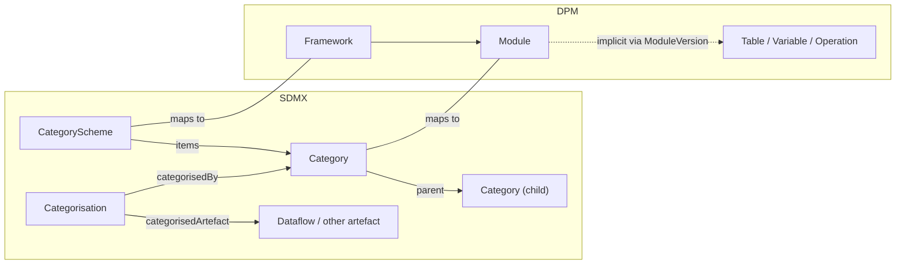
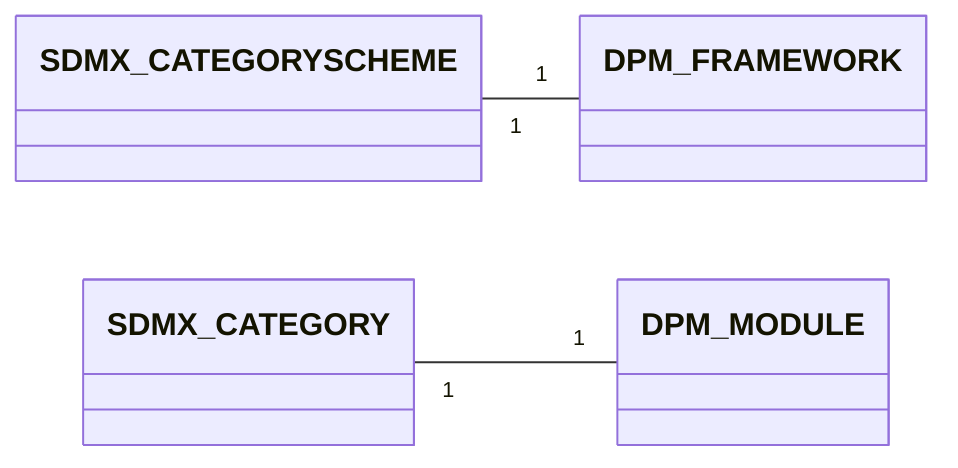

# 3. Detailed mapping rules

This chapter provides the detailed rules for the cross-model correspondences that sit between the glossary (§01) and data-definition (§02) layers and that are not already covered as a versioning/extensibility concern (§04) or as a gap (§05). Concretely, this chapter covers:

- **Classification** (§3.1) — CategoryScheme/Category ↔ Framework/Module.
- **Mapping artefacts** registry (§3.2) — pointers to where each SDMX map type is documented. CategorySchemeMap has been moved to [§05 §2.9](../05_gaps/02_specific_gap_analysis.md#29-categoryschememap-sdmx-feature-without-dpm-equivalent) — it is treated as a gap because its DPM image is a workaround via ConceptRelation rather than a structural correspondence.

> **Moved to §02 Data Definition**: The deployable-bundle pair (**ReportingTaxonomy / ReportingCategory ↔ Module / ModuleVersion**), the **Categorisation** mapping, and **ReportingTaxonomyMap** now live in [§02 §3.4](../02_data_definition/03_detailed_mapping_rules.md#34-reporting-bundle-reportingtaxonomy-reportingcategory-moduleversion). Module is mandatory in DPM and core to the data-definition layer; treating it as an "other artefact" understated its role.

> - **Prerequisites**:
>     - The general identification and multilingual rules from [§00 Basics](../00_basics/02_detailed_mapping_rules.md) apply throughout.
>     - The Organisation/Agency mapping that grounds the `Owner` field on Framework lives in [§04 §3.1](../04_versioning_and_extensibility/03_detailed_mapping_rules.md#31-agency-organisation-role-owner). Treating organisations as the foundation for ownership and extensibility is the reason that mapping moved out of this chapter.
>     - Release/Deactivation/Annotation detailed rules — including the canonical registry of recognised annotation markers (`DPM_SIGNATURE`, `DPM_DEFAULT_ITEM`, `DPM_COMPOUND_COMPONENTS`, `DPM_RELEASE_CODE`, `DPM_FROM_REFERENCE_DATE`, `DPM_DEACTIVATION_REASON`, `DPM_PROVISION_AGREEMENT`, `DPM_PROCESS`, `DPM_TABLEGROUP`, etc.) — live in [§04 §3](../04_versioning_and_extensibility/03_detailed_mapping_rules.md).
>     - Artefacts that have no counterpart in the other model (TableGroup, ProvisionAgreement/Datasource, Process/ProcessStep, Header/Cell rendering) are documented in [§05 Gaps §2](../05_gaps/02_specific_gap_analysis.md).
> - **Scope**: only real cross-model correspondences in classification and reporting taxonomy. The chapter is intentionally focused; readers chasing organisational, lifecycle, or annotation rules should jump to §04, and readers chasing gap statements to §05.

## 3.1 CategoryScheme / Category ↔ Framework / Module

In SDMX, a **CategoryScheme** organises subject-domain Categories in a hierarchy (single-parent). **Categorisation** is a separate maintainable artefact that links any IdentifiableArtefact (typically a Dataflow) to a Category. Together they form a navigation tree over the structural metadata.

In DPM, the equivalent navigation is provided by **Framework** (top-level container per regulation / domain) and **Module** (coherent reporting package within a Framework). Membership of a structural artefact in a Module is **implicit**: a Variable, Table, or Operation belongs to a Module by appearing in one of its ModuleVersions (5.2.2 of the DPM metamodel).

The DPM Framework references an `Owner` Organisation; the mapping of that Organisation to the SDMX `agencyID` is documented separately in [§04 §3.1](../04_versioning_and_extensibility/03_detailed_mapping_rules.md#31-agency-organisation-role-owner).



**Example CategoryScheme**

```xml
<CategoryScheme agencyID="EBA" id="EBA_REPORTING" version="1.0" isPartial="false">
  <Name xml:lang="en">EBA reporting domains</Name>
  <Category id="FINREP">
    <Name xml:lang="en">Financial reporting</Name>
  </Category>
  <Category id="COREP">
    <Name xml:lang="en">Common reporting</Name>
    <Category id="COREP_OF">
      <Name xml:lang="en">Own funds</Name>
    </Category>
    <Category id="COREP_LR">
      <Name xml:lang="en">Leverage ratio</Name>
    </Category>
  </Category>
</CategoryScheme>
```

**Example Framework + Modules**

*Framework*

| FrameworkID | Code           | Name                          | OwnerID |
| ----------- | -------------- | ----------------------------- | ------- |
| 100100001   | EBA_REPORTING  | EBA reporting framework       | 1 (EBA) |

*Modules*

| ModuleID    | FrameworkID  | Code      | Name                  |
| ----------- | ------------ | --------- | --------------------- |
| 100200001   | 100100001    | FINREP    | Financial reporting   |
| 100200002   | 100100001    | COREP     | Common reporting      |
| 100200003   | 100100001    | COREP_OF  | Own funds             |
| 100200004   | 100100001    | COREP_LR  | Leverage ratio        |

### 3.1.1 Mapping cardinality



- From SDMX to DPM: one CategoryScheme maps to one Framework; each Category in the scheme maps to one Module under that Framework. The Category hierarchy is **flattened** — DPM Modules are not nested. Where the SDMX hierarchy is meaningful (e.g. a top-level "COREP" with sub-Categories "COREP_OF", "COREP_LR"), each level becomes a separate Module; the parent–child relationship is encoded only in the Module `Code` naming convention (e.g. `COREP_OF` carries the parent's prefix).
- From DPM to SDMX: one Framework maps to one CategoryScheme; each Module maps to one Category. DPM Modules have no hierarchy, so the resulting SDMX Categories are siblings under the scheme — unless naming conventions encode a hierarchy that the mapping can re-materialise.
- **Categorisation**: SDMX Categorisations have no DPM artefact counterpart. Membership is recorded implicitly through `ModuleVersionComposition` (the linkage of TableVersions to a ModuleVersion). See [§02 §3.4.4](../02_data_definition/03_detailed_mapping_rules.md#344-categorisation-implicit-in-module-membership).

### 3.1.2 Attributes equivalence

#### 3.1.2.1 SDMX CategoryScheme attributes
- maintainable artefact attributes
    - `id`, `agencyID`, `version`
- `Name` (multilingual)
- `Description` (multilingual)
- `isPartial`

#### 3.1.2.2 SDMX Category attributes
- itemScheme `Category` attributes
    - `id`, `urn`
- `Name` (multilingual)
- `Description` (multilingual)
- `parent` Category (single)
- child Categories

#### 3.1.2.3 DPM Framework attributes
- `FrameworkID` (system-generated PK)
- `Code`
- `Name`
- `Description`
- `OwnerID` (FK to Organisation)
- References (4.1.3.2)

#### 3.1.2.4 DPM Module attributes
- `ModuleID` (system-generated PK)
- `FrameworkID` (FK)
- `Code`
- `Name`
- `Description`
- inherits Owner from Framework (4.1.2)

#### 3.1.2.5 Mapping details

| SDMX                              | DPM                              | Notes                                                                                                              |
|-----------------------------------|----------------------------------|--------------------------------------------------------------------------------------------------------------------|
| CategoryScheme.`id`               | Framework.`Code`                 |                                                                                                                    |
| CategoryScheme.`agencyID`         | Framework.`OwnerID` (lookup)     | Lookup the Organisation whose `Acronym` equals the `agencyID`. The Agency↔Organisation mapping is in [§04 §3.1](../04_versioning_and_extensibility/03_detailed_mapping_rules.md#31-agency-organisation-role-owner). |
| CategoryScheme.`version`          | — (Framework is unversioned)     | Framework has no version slot. Use ModuleVersion ([§02 §3.4](../02_data_definition/03_detailed_mapping_rules.md#34-reporting-bundle-reportingtaxonomy-reportingcategory-moduleversion)) and Release ([§04 §3.4](../04_versioning_and_extensibility/03_detailed_mapping_rules.md#34-release-version-validity)) for temporal evolution. |
| CategoryScheme.`Name`             | Framework.`Name`                 | Multilingual via [§00_basics §2.3](../00_basics/02_detailed_mapping_rules.md#23-multilingual-support-internationalstring-vs-translations).               |
| CategoryScheme.`Description`      | Framework.`Description`          | Multilingual.                                                                                                     |
| CategoryScheme.`isPartial`        | — (no equivalent)                | DPM does not model partial schemes at the Framework level.                                                        |
| Category.`id`                     | Module.`Code`                    |                                                                                                                    |
| Category.`Name`                   | Module.`Name`                    | Multilingual.                                                                                                     |
| Category.`Description`            | Module.`Description`             | Multilingual.                                                                                                     |
| Category.`parent` (hierarchy)     | — (Modules are siblings)         | Hierarchy is flattened; parent encoded only in `Module.Code` by convention (e.g. `COREP_OF` under `COREP`).        |
| — (not applicable)                | Module.`FrameworkID`             | All Modules ingested from one CategoryScheme share the same Framework.                                            |

> **Note — Category hierarchy depth**: SDMX Category trees can be arbitrarily deep. The mapping flattens *all* levels into siblings on the DPM side. If the source uses depth meaningfully (e.g. theme → sub-theme → leaf), the mapping should encode it in the `Module.Code` (dotted or underscored convention) so that DPM → SDMX can rematerialise the hierarchy.

> **Note — Framework owner vs Category owner**: the SDMX `agencyID` on the CategoryScheme decides the DPM Framework owner. Individual Categories in SDMX inherit the scheme's `agencyID` (Categories are not independently versionable). DPM Modules likewise inherit Owner from their Framework (4.1.2). The mapping is therefore consistent on both sides.

### 3.1.3 Example Mapping SDMX ==> DPM

Starting from:

```xml
<CategoryScheme agencyID="EBA" id="EBA_REPORTING" version="1.0" isPartial="false">
  <Name xml:lang="en">EBA reporting domains</Name>
  <Category id="FINREP">
    <Name xml:lang="en">Financial reporting</Name>
  </Category>
  <Category id="COREP">
    <Name xml:lang="en">Common reporting</Name>
    <Category id="COREP_OF">
      <Name xml:lang="en">Own funds</Name>
    </Category>
    <Category id="COREP_LR">
      <Name xml:lang="en">Leverage ratio</Name>
    </Category>
  </Category>
</CategoryScheme>
```

The mapping produces:

*Framework*

| FrameworkID | Code           | Name                       | OwnerID |
| ----------- | -------------- | -------------------------- | ------- |
| 100100001   | EBA_REPORTING  | EBA reporting domains      | 1 (EBA) |

*Modules* (siblings under the Framework — hierarchy flattened, encoded in `Code`)

| ModuleID    | FrameworkID  | Code      | Name                  |
| ----------- | ------------ | --------- | --------------------- |
| 100200001   | 100100001    | FINREP    | Financial reporting   |
| 100200002   | 100100001    | COREP     | Common reporting      |
| 100200003   | 100100001    | COREP_OF  | Own funds             |
| 100200004   | 100100001    | COREP_LR  | Leverage ratio        |

### 3.1.4 Example Mapping DPM ==> SDMX

Starting from the Framework + Modules above (after a Module rename to `COREP_LARGE_EXP`):

| ModuleID    | FrameworkID  | Code              | Name                  |
| ----------- | ------------ | ----------------- | --------------------- |
| 100200005   | 100100001    | COREP_LARGE_EXP   | Large exposures       |

The mapping produces:

```xml
<CategoryScheme agencyID="EBA" id="EBA_REPORTING" version="1.0" isPartial="false">
  <Name xml:lang="en">EBA reporting domains</Name>
  <Category id="COREP">
    <Name xml:lang="en">Common reporting</Name>
    <Category id="COREP_LARGE_EXP">
      <Name xml:lang="en">Large exposures</Name>
    </Category>
  </Category>
</CategoryScheme>
```

- The `Module.Code` `COREP_LARGE_EXP` carries the parent prefix `COREP_`; the mapper rematerialises the parent–child relationship if the convention is documented at the project level.
- If no hierarchy convention is in use, the mapping emits all Modules as direct children of the scheme.

> **Categorisation** — moved to [§02 §3.4.4](../02_data_definition/03_detailed_mapping_rules.md#344-categorisation-implicit-in-module-membership). Categorisation links a Dataflow to a Category and in DPM is realised through Module membership; that mapping now sits with the Module/ModuleVersion rules in §02.

## 3.2 Reporting bundle — moved to §02

The detailed mapping rules for **ReportingTaxonomy / ReportingCategory ↔ Module / ModuleVersion**, including **ReportingTaxonomyMap**, now live in [§02 §3.4](../02_data_definition/03_detailed_mapping_rules.md#34-reporting-bundle-reportingtaxonomy-reportingcategory-moduleversion). They moved out of this chapter because Module is core to the DPM data-definition layer (it is mandatory for every Table) rather than an "other" artefact.

## 3.3 Cross-reference: registry of SDMX mapping artefacts

The full SDMX map family and where each member is documented:

| SDMX map type            | Source/target layer            | Documented in                                                                                                                       |
|--------------------------|--------------------------------|-------------------------------------------------------------------------------------------------------------------------------------|
| StructureMap             | Data definition (DSD/Dataflow) | [§02 §3.2](../02_data_definition/03_detailed_mapping_rules.md#32-dsd-table-as-structural-collections)                              |
| RepresentationMap        | Glossary / data definition     | [§02 §3.2](../02_data_definition/03_detailed_mapping_rules.md#32-dsd-table-as-structural-collections), [§01 §3.3](../01_glossary/03_detailed_mapping_rules.md#33-code-category-item) |
| ConceptSchemeMap         | Glossary (Concepts/Properties) | [§01 §3.5.6](../01_glossary/03_detailed_mapping_rules.md#356-conceptscheme-handling)                                                |
| CategorySchemeMap        | No DPM equivalent (workaround) | [§05 §2.9](../05_gaps/02_specific_gap_analysis.md#29-categoryschememap-sdmx-feature-without-dpm-equivalent)                          |
| ReportingTaxonomyMap     | §02 (ModuleVersions)           | [§02 §3.4.7](../02_data_definition/03_detailed_mapping_rules.md#347-reportingtaxonomymap)                                                                                                                          |
| OrganisationSchemeMap    | §04 (Organisations)            | [§04 §3.3](../04_versioning_and_extensibility/03_detailed_mapping_rules.md#33-organisationschememap)                                |
