# 3. Detailed mapping rules

This chapter provides the detailed rules for each of the high-level correspondences described in chapter 2. The artefacts covered here are *organisational, classification, lifecycle, and supporting* — they sit alongside the glossary (§01) and data‑definition (§02) layers and provide ownership, navigation, packaging, and temporal management.

> - **Prerequisites**:
>     - The general identification and multilingual rules from [Basics — Detailed Mapping Rules](../00_basics/02_detailed_mapping_rules.md) apply to all artefacts in this chapter.
>     - Glossary‑level mappings (Codelist ↔ Category, Concept ↔ Property, Code ↔ Item, etc.) follow [Glossary — Detailed Mapping Rules](../01_glossary/03_detailed_mapping_rules.md).
>     - Data‑definition mappings (Dataflow + DSD ↔ Table, DSD components ↔ Headers/Variables, Constraints ↔ SubCategories) follow [Data Definition — Detailed Mapping Rules](../02_data_definition/03_detailed_mapping_rules.md).
>     - Versioning behaviour (how Module/ModuleVersion/TableVersion evolve, Release temporal alignment) is covered in [§04 Versioning](../04_versioning_and_extensibility/01_versioning_overview.md).
>     - Canonical gap statements live in [§05 Gaps](../05_gaps/01_gaps_overview.md).
> - **Scope**: this chapter focuses on artefact identity / structural mapping. It cross‑references §04 and §05 instead of restating them.

The chapter is organised in three groups:

1. **Real correspondences** — pairs where both models have a direct counterpart: §3.1 Agency, §3.2 DataProvider, §3.3 CategoryScheme/Category, §3.4 ReportingTaxonomy.
2. **DPM‑only and external pairs** — §3.5 TableGroup/TableAssociation, §3.6 ProvisionAgreement/Datasource (external to DPM), §3.7 Process/ProcessStep (external to DPM).
3. **Lifecycle, annotations, and adjacent topics** — §3.8 Release, §3.9 Deactivation, §3.10 Annotation, §3.11 Rendering layer (pointer to §02), §3.12 Mapping artefacts whose source/target sit in §03.

## 3.1 Agency ↔ Organisation (role = owner)

In SDMX, every MaintainableArtefact references a maintaining **Agency**. Agencies are organised in **AgencyScheme**s and may be hierarchical (an Agency can contain child Agencies — e.g. `SDMX.ECB` containing `SDMX.ECB.DG-S`).

In DPM, every Concept inherits an **Owner Organisation** (4.1.2 of the DPM metamodel). Organisations are flat (no scheme container, no hierarchy) and are differentiated by `OrganisationRole`. The Owner role corresponds to the SDMX maintaining Agency.

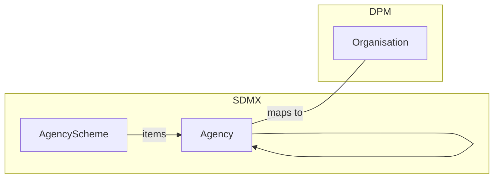

**Example Agency**

```xml
<AgencyScheme agencyID="SDMX" id="AGENCIES" version="1.0" isPartial="false">
  <Name xml:lang="en">SDMX agencies</Name>
  <Agency id="EBA">
    <Name xml:lang="en">European Banking Authority</Name>
    <Contact>
      <Name xml:lang="en">EBA Reporting</Name>
      <URI>https://www.eba.europa.eu/</URI>
    </Contact>
  </Agency>
</AgencyScheme>
```

**Example Organisation**

| OrganisationID | Name                          | Acronym | IDPrefix | Role  | URI                          |
| -------------- | ----------------------------- | ------- | -------- | ----- | ---------------------------- |
| 1              | European Banking Authority    | EBA     | 100      | owner | https://www.eba.europa.eu/   |

### 3.1.1 Mapping cardinality

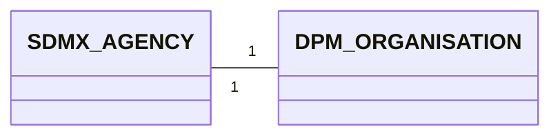

- From SDMX to DPM: One Agency maps to one Organisation with `Role = owner`. The containing AgencyScheme has no DPM counterpart and is not materialised.
- From DPM to SDMX: One Organisation with `Role = owner` maps to one Agency, contained in the AgencyScheme owned by the *maintaining Agency* of the destination repository (typically `SDMX:AGENCIES`).
- **Hierarchical Agencies**: SDMX `Agency.parent` (child Agency relationship) flattens to DPM. Each Agency in the hierarchy becomes a separate Organisation; the parent relationship is lost (or preserved via the `Acronym` naming convention — see §3.1.2.3).

### 3.1.2 Attributes equivalence

#### 3.1.2.1 SDMX Agency attributes
- itemScheme `Agency` attributes (see [Identification mapping rules](../00_basics/02_detailed_mapping_rules.md#22-identification-dpm-ids-vs-sdmx-urns))
    - `id`
    - `urn`
- `Name` (multilingual)
- `Description` (multilingual)
- `Contact` (one or more)
    - `Name`
    - `Department`
    - `Role`
    - `URI`, `Email`, `Telephone`, `Fax`, `X400`

#### 3.1.2.2 DPM Organisation attributes
- `OrganisationID` (system-generated PK)
- `Name`
- `Acronym`
- `IDPrefix`
- `Role` (`owner` | `publisher` | `entry_point` | `responsible`)
- `URI`

#### 3.1.2.3 Mapping details

| SDMX Agency               | DPM Organisation             | Notes                                                                                                                                |
|---------------------------|------------------------------|--------------------------------------------------------------------------------------------------------------------------------------|
| `id`                      | `Acronym`                    | The Agency `id` is short and stable — it maps to the DPM `Acronym`. Examples: `EBA`, `ECB`, `EIOPA`.                                |
| `Name` (multilingual)     | `Name` (translated)          | Multilingual rules per [§00_basics §2.3](../00_basics/02_detailed_mapping_rules.md#23-multilingual-support-internationalstring-vs-translations). |
| `Contact.URI`             | `URI`                        | The first `Contact.URI` is taken; remaining contact details are not mapped (no DPM slot).                                           |
| `Contact.Name`, `Email`, …| — (not mapped)               | DPM has no contact‑detail slot. Optional preservation via Annotation (see §3.10).                                                   |
| AgencyScheme membership   | — (no equivalent)            | DPM Organisations are not grouped into schemes.                                                                                     |
| `Agency.parent`           | — (no equivalent)            | Hierarchy is flattened. Optionally encode in `Acronym` using a dotted convention (e.g. `ECB.DG-S`).                                |
| — (not applicable)        | `IDPrefix`                   | DPM-specific: 3-digit prefix used in primary keys (4.1.2 of the DPM metamodel). When ingesting SDMX, allocate a new prefix.         |
| — (not applicable)        | `Role = owner`               | Fixed on the SDMX→DPM path: the Agency expresses ownership.                                                                          |

> **Note — `IDPrefix` allocation (SDMX → DPM)**: The DPM `IDPrefix` is a 3-digit value that disambiguates primary keys across organisations when models from different owners are merged (see §4.1.2 of the DPM metamodel). It does not exist in SDMX and must be allocated locally when an SDMX Agency is first ingested. The allocation is implementation-specific (free pool, registry, etc.) and is not part of the mapping itself.

> **Note — Hierarchy preservation**: The "flattened" rule loses parent links. When round-tripping SDMX→DPM→SDMX, the original parent can be preserved on the DPM side using a `DPM_AGENCY_PARENT` annotation (see §3.10). This is optional and recommended only when fidelity matters.

### 3.1.3 Example Mapping SDMX ==> DPM

Starting from the SDMX side:

```xml
<AgencyScheme agencyID="SDMX" id="AGENCIES" version="1.0" isPartial="false">
  <Name xml:lang="en">SDMX agencies</Name>
  <Agency id="EBA">
    <Name xml:lang="en">European Banking Authority</Name>
    <Contact>
      <URI>https://www.eba.europa.eu/</URI>
    </Contact>
  </Agency>
  <Agency id="ECB">
    <Name xml:lang="en">European Central Bank</Name>
    <Contact>
      <URI>https://www.ecb.europa.eu/</URI>
    </Contact>
  </Agency>
</AgencyScheme>
```

The mapping produces one DPM Organisation per Agency (the AgencyScheme itself is not materialised):

| OrganisationID | Name                          | Acronym | IDPrefix | Role  | URI                          |
| -------------- | ----------------------------- | ------- | -------- | ----- | ---------------------------- |
| 1              | European Banking Authority    | EBA     | 100      | owner | https://www.eba.europa.eu/   |
| 2              | European Central Bank         | ECB     | 200      | owner | https://www.ecb.europa.eu/   |

- `Acronym` ← Agency `id`.
- `Name` ← Agency `Name` (localised translations stored in the Translation table per [§00_basics §2.3](../00_basics/02_detailed_mapping_rules.md#23-multilingual-support-internationalstring-vs-translations)).
- `URI` ← first Agency `Contact.URI`.
- `IDPrefix` allocated locally (`100`, `200`).
- `Role = owner` because Agency expresses maintainership.

### 3.1.4 Example Mapping DPM ==> SDMX

Starting from the DPM side:

| OrganisationID | Name                          | Acronym | IDPrefix | Role  | URI                          |
| -------------- | ----------------------------- | ------- | -------- | ----- | ---------------------------- |
| 1              | European Banking Authority    | EBA     | 100      | owner | https://www.eba.europa.eu/   |

The mapping produces one SDMX Agency embedded in the destination repository's AgencyScheme:

```xml
<AgencyScheme agencyID="SDMX" id="AGENCIES" version="1.0" isPartial="false">
  <Agency id="EBA">
    <Name xml:lang="en">European Banking Authority</Name>
    <Contact>
      <URI>https://www.eba.europa.eu/</URI>
    </Contact>
  </Agency>
</AgencyScheme>
```

- The Agency is added to the maintaining repository's `AGENCIES` scheme. Choosing the maintainer of that scheme is an integration decision, not a mapping decision.
- DPM `IDPrefix` is **not** emitted as an SDMX attribute. If round-trip preservation is required, attach it as a `DPM_ID_PREFIX` annotation on the Agency.

### 3.1.5 AgencyScheme handling

SDMX AgencyScheme has no DPM container counterpart. Concretely:

- **SDMX → DPM**: iterate over the Agencies of the scheme; emit one Organisation per Agency. The scheme `id`, `agencyID`, and `version` are not preserved by default.
- **DPM → SDMX**: collect all Organisations with `Role = owner` and emit them as Agencies under a single AgencyScheme. By convention, the destination scheme is the maintaining repository's `AGENCIES` (e.g. `SDMX:AGENCIES`); a different choice is possible only for self-contained, self-maintained repositories.

> **Round-trip note**: If multiple SDMX AgencySchemes coexist in the source repository (e.g. one per regulator), the SDMX → DPM step loses the partition. Preservation is possible via a `DPM_AGENCY_SCHEME` annotation on the Organisation, mapped back on the reverse path. This is optional.

## 3.2 DataProvider ↔ Organisation (role = entry_point)

In SDMX, **DataProvider** is an Organisation that supplies data. DataProviders sit in **DataProviderScheme**s and are referenced by **ProvisionAgreement**s that bind a provider to a Dataflow (and optionally a Datasource).

In DPM, the same concept is carried by `Organisation` with `Role = entry_point`. DPM does not model the agreement itself (see §3.6 — ProvisionAgreement is external to DPM); it only models the entity that submits the data.

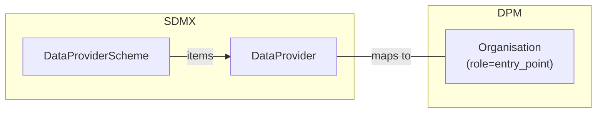

**Example DataProvider**

```xml
<DataProviderScheme agencyID="ECB" id="DATA_PROVIDERS" version="1.0" isPartial="false">
  <Name xml:lang="en">ECB Data Providers</Name>
  <DataProvider id="BDE">
    <Name xml:lang="en">Banco de España</Name>
    <Contact>
      <URI>https://www.bde.es/</URI>
    </Contact>
  </DataProvider>
</DataProviderScheme>
```

**Example Organisation**

| OrganisationID | Name                          | Acronym | IDPrefix | Role        | URI                       |
| -------------- | ----------------------------- | ------- | -------- | ----------- | ------------------------- |
| 11             | Banco de España               | BDE     | 110      | entry_point | https://www.bde.es/       |

### 3.2.1 Mapping cardinality

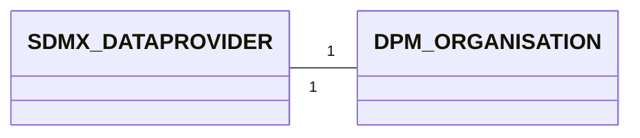

- From SDMX to DPM: One DataProvider maps to one Organisation with `Role = entry_point`. The DataProviderScheme has no DPM counterpart.
- From DPM to SDMX: One Organisation with `Role = entry_point` maps to one DataProvider, contained in a DataProviderScheme owned by the relevant Agency (typically the same Agency that owns the Frameworks the provider reports against).
- **Multi-role organisations**: An entity that is both a maintainer and a data provider appears once in DPM with multiple `Role` rows (or as multiple Organisation records, depending on the implementation), and twice in SDMX (once as Agency, once as DataProvider) with the same `id`.

### 3.2.2 Attributes equivalence

#### 3.2.2.1 SDMX DataProvider attributes
- itemScheme `DataProvider` attributes
    - `id`
    - `urn`
- `Name` (multilingual)
- `Description` (multilingual)
- `Contact` (one or more)

#### 3.2.2.2 DPM Organisation attributes
Same structural attributes as in §3.1.2.2; the differentiating field is `Role`.

#### 3.2.2.3 Mapping details

| SDMX DataProvider                | DPM Organisation                  | Notes                                                                                                                |
|----------------------------------|-----------------------------------|----------------------------------------------------------------------------------------------------------------------|
| `id`                             | `Acronym`                         | Same convention as Agency.                                                                                           |
| `Name` (multilingual)            | `Name` (translated)               | Multilingual rules per [§00_basics §2.3](../00_basics/02_detailed_mapping_rules.md#23-multilingual-support-internationalstring-vs-translations).             |
| `Contact.URI`                    | `URI`                             | First `Contact.URI`.                                                                                                 |
| DataProviderScheme membership    | — (no equivalent)                 |                                                                                                                      |
| ProvisionAgreement reference     | — (external to DPM)               | The agreement itself does not map; see §3.6.                                                                         |
| — (not applicable)               | `Role = entry_point`              | Fixed on the SDMX→DPM path.                                                                                          |

### 3.2.3 Example Mapping SDMX ==> DPM

Starting from:

```xml
<DataProviderScheme agencyID="ECB" id="DATA_PROVIDERS" version="1.0" isPartial="false">
  <DataProvider id="BDE">
    <Name xml:lang="en">Banco de España</Name>
    <Contact>
      <URI>https://www.bde.es/</URI>
    </Contact>
  </DataProvider>
  <DataProvider id="BDF">
    <Name xml:lang="en">Banque de France</Name>
  </DataProvider>
</DataProviderScheme>
```

The mapping produces:

| OrganisationID | Name                | Acronym | IDPrefix | Role        | URI                  |
| -------------- | ------------------- | ------- | -------- | ----------- | -------------------- |
| 11             | Banco de España     | BDE     | 110      | entry_point | https://www.bde.es/  |
| 12             | Banque de France    | BDF     | 120      | entry_point | NULL                 |

### 3.2.4 Example Mapping DPM ==> SDMX

| OrganisationID | Name                | Acronym | IDPrefix | Role        | URI                  |
| -------------- | ------------------- | ------- | -------- | ----------- | -------------------- |
| 11             | Banco de España     | BDE     | 110      | entry_point | https://www.bde.es/  |

```xml
<DataProviderScheme agencyID="ECB" id="DATA_PROVIDERS" version="1.0" isPartial="false">
  <DataProvider id="BDE">
    <Name xml:lang="en">Banco de España</Name>
    <Contact>
      <URI>https://www.bde.es/</URI>
    </Contact>
  </DataProvider>
</DataProviderScheme>
```

- The choice of containing scheme (`ECB:DATA_PROVIDERS` vs another) depends on which Agency owns the reporting framework against which this provider submits. There is no DPM field that disambiguates this — it is an integration convention.

### 3.2.5 DataConsumer / OrganisationUnit — recommended handling

SDMX defines **DataConsumerScheme / DataConsumer** (organisations that receive data) and **OrganisationUnitScheme / OrganisationUnit** (a generic catch-all). DPM does not have dedicated roles for these.

| SDMX                  | DPM                                                                                          |
|-----------------------|----------------------------------------------------------------------------------------------|
| DataConsumer          | Organisation with `Role = responsible` *if* the data consumption role is meaningful in the reporting context. Otherwise, omit. |
| OrganisationUnit      | Organisation with no specific `Role` *if* a relationship to the DPM model is asserted. Otherwise, omit. |
| DataConsumerScheme    | — (no DPM equivalent)                                                                        |
| OrganisationUnitScheme| — (no DPM equivalent)                                                                        |

**Recommendation**: only ingest DataConsumer / OrganisationUnit when there is a documented mapping decision on the DPM side (e.g. a regulator that issues guidance but does not own the framework). Otherwise, leave them out of the DPM model and preserve them via SDMX-side annotation if round-trip fidelity is required.

## 3.3 CategoryScheme / Category ↔ Framework / Module

In SDMX, a **CategoryScheme** organises subject-domain Categories in a hierarchy (single-parent). **Categorisation** is a separate maintainable artefact that links any IdentifiableArtefact (typically a Dataflow) to a Category. Together they form a navigation tree over the structural metadata.

In DPM, the equivalent navigation is provided by **Framework** (top-level container per regulation / domain) and **Module** (coherent reporting package within a Framework). Membership of a structural artefact in a Module is **implicit**: a Variable, Table, or Operation belongs to a Module by appearing in one of its ModuleVersions (5.2.2 of the DPM metamodel).

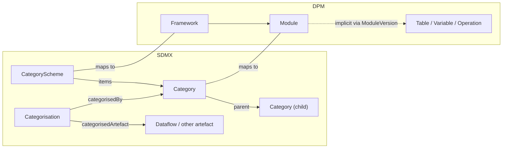

**Example CategoryScheme**

```xml
<CategoryScheme agencyID="EBA" id="EBA_REPORTING" version="1.0" isPartial="false">
  <Name xml:lang="en">EBA reporting domains</Name>
  <Category id="FINREP">
    <Name xml:lang="en">Financial reporting</Name>
  </Category>
  <Category id="COREP">
    <Name xml:lang="en">Common reporting</Name>
    <Category id="COREP_OF">
      <Name xml:lang="en">Own funds</Name>
    </Category>
    <Category id="COREP_LR">
      <Name xml:lang="en">Leverage ratio</Name>
    </Category>
  </Category>
</CategoryScheme>
```

**Example Framework + Modules**

*Framework*

| FrameworkID | Code           | Name                          | OwnerID |
| ----------- | -------------- | ----------------------------- | ------- |
| 100100001   | EBA_REPORTING  | EBA reporting framework       | 1 (EBA) |

*Modules*

| ModuleID    | FrameworkID  | Code      | Name                  |
| ----------- | ------------ | --------- | --------------------- |
| 100200001   | 100100001    | FINREP    | Financial reporting   |
| 100200002   | 100100001    | COREP     | Common reporting      |
| 100200003   | 100100001    | COREP_OF  | Own funds             |
| 100200004   | 100100001    | COREP_LR  | Leverage ratio        |

### 3.3.1 Mapping cardinality

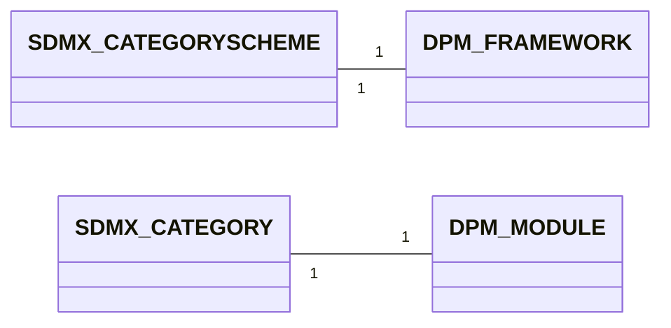

- From SDMX to DPM: one CategoryScheme maps to one Framework; each Category in the scheme maps to one Module under that Framework. The Category hierarchy is **flattened** — DPM Modules are not nested. Where the SDMX hierarchy is meaningful (e.g. a top-level "COREP" with sub-Categories "COREP_OF", "COREP_LR"), each level becomes a separate Module; the parent–child relationship is encoded only in the Module `Code` naming convention (e.g. `COREP_OF` carries the parent's prefix).
- From DPM to SDMX: one Framework maps to one CategoryScheme; each Module maps to one Category. DPM Modules have no hierarchy, so the resulting SDMX Categories are siblings under the scheme — unless naming conventions encode a hierarchy that the mapping can re-materialise.
- **Categorisation**: SDMX Categorisations have no DPM artefact counterpart. Membership is recorded implicitly through `ModuleVersionComposition` (the linkage of TableVersions to a ModuleVersion). See §3.3.5.

### 3.3.2 Attributes equivalence

#### 3.3.2.1 SDMX CategoryScheme attributes
- maintainable artefact attributes
    - `id`, `agencyID`, `version`
- `Name` (multilingual)
- `Description` (multilingual)
- `isPartial`

#### 3.3.2.2 SDMX Category attributes
- itemScheme `Category` attributes
    - `id`, `urn`
- `Name` (multilingual)
- `Description` (multilingual)
- `parent` Category (single)
- child Categories

#### 3.3.2.3 DPM Framework attributes
- `FrameworkID` (system-generated PK)
- `Code`
- `Name`
- `Description`
- `OwnerID` (FK to Organisation)
- References (4.1.3.2)

#### 3.3.2.4 DPM Module attributes
- `ModuleID` (system-generated PK)
- `FrameworkID` (FK)
- `Code`
- `Name`
- `Description`
- inherits Owner from Framework (4.1.2)

#### 3.3.2.5 Mapping details

| SDMX                              | DPM                              | Notes                                                                                                              |
|-----------------------------------|----------------------------------|--------------------------------------------------------------------------------------------------------------------|
| CategoryScheme.`id`               | Framework.`Code`                 |                                                                                                                    |
| CategoryScheme.`agencyID`         | Framework.`OwnerID` (lookup)     | Lookup the Organisation whose `Acronym` equals the `agencyID`.                                                    |
| CategoryScheme.`version`          | — (Framework is unversioned)     | Framework has no version slot. Use ModuleVersion / Release for temporal evolution (§3.4 / §3.8).                  |
| CategoryScheme.`Name`             | Framework.`Name`                 | Multilingual via [§00_basics §2.3](../00_basics/02_detailed_mapping_rules.md#23-multilingual-support-internationalstring-vs-translations).               |
| CategoryScheme.`Description`      | Framework.`Description`          | Multilingual.                                                                                                     |
| CategoryScheme.`isPartial`        | — (no equivalent)                | DPM does not model partial schemes at the Framework level.                                                        |
| Category.`id`                     | Module.`Code`                    |                                                                                                                    |
| Category.`Name`                   | Module.`Name`                    | Multilingual.                                                                                                     |
| Category.`Description`            | Module.`Description`             | Multilingual.                                                                                                     |
| Category.`parent` (hierarchy)     | — (Modules are siblings)         | Hierarchy is flattened; parent encoded only in `Module.Code` by convention (e.g. `COREP_OF` under `COREP`).        |
| — (not applicable)                | Module.`FrameworkID`             | All Modules ingested from one CategoryScheme share the same Framework.                                            |

> **Note — Category hierarchy depth**: SDMX Category trees can be arbitrarily deep. The mapping flattens *all* levels into siblings on the DPM side. If the source uses depth meaningfully (e.g. theme → sub-theme → leaf), the mapping should encode it in the `Module.Code` (dotted or underscored convention) so that DPM → SDMX can rematerialise the hierarchy.

> **Note — Framework owner vs Category owner**: the SDMX `agencyID` on the CategoryScheme decides the DPM Framework owner. Individual Categories in SDMX inherit the scheme's `agencyID` (Categories are not independently versionable). DPM Modules likewise inherit Owner from their Framework (4.1.2). The mapping is therefore consistent on both sides.

### 3.3.3 Example Mapping SDMX ==> DPM

Starting from:

```xml
<CategoryScheme agencyID="EBA" id="EBA_REPORTING" version="1.0" isPartial="false">
  <Name xml:lang="en">EBA reporting domains</Name>
  <Category id="FINREP">
    <Name xml:lang="en">Financial reporting</Name>
  </Category>
  <Category id="COREP">
    <Name xml:lang="en">Common reporting</Name>
    <Category id="COREP_OF">
      <Name xml:lang="en">Own funds</Name>
    </Category>
    <Category id="COREP_LR">
      <Name xml:lang="en">Leverage ratio</Name>
    </Category>
  </Category>
</CategoryScheme>
```

The mapping produces:

*Framework*

| FrameworkID | Code           | Name                       | OwnerID |
| ----------- | -------------- | -------------------------- | ------- |
| 100100001   | EBA_REPORTING  | EBA reporting domains      | 1 (EBA) |

*Modules* (siblings under the Framework — hierarchy flattened, encoded in `Code`)

| ModuleID    | FrameworkID  | Code      | Name                  |
| ----------- | ------------ | --------- | --------------------- |
| 100200001   | 100100001    | FINREP    | Financial reporting   |
| 100200002   | 100100001    | COREP     | Common reporting      |
| 100200003   | 100100001    | COREP_OF  | Own funds             |
| 100200004   | 100100001    | COREP_LR  | Leverage ratio        |

### 3.3.4 Example Mapping DPM ==> SDMX

Starting from the Framework + Modules above (after a Module rename to `COREP_LARGE_EXP`):

| ModuleID    | FrameworkID  | Code              | Name                  |
| ----------- | ------------ | ----------------- | --------------------- |
| 100200005   | 100100001    | COREP_LARGE_EXP   | Large exposures       |

The mapping produces:

```xml
<CategoryScheme agencyID="EBA" id="EBA_REPORTING" version="1.0" isPartial="false">
  <Name xml:lang="en">EBA reporting domains</Name>
  <Category id="COREP">
    <Name xml:lang="en">Common reporting</Name>
    <Category id="COREP_LARGE_EXP">
      <Name xml:lang="en">Large exposures</Name>
    </Category>
  </Category>
</CategoryScheme>
```

- The `Module.Code` `COREP_LARGE_EXP` carries the parent prefix `COREP_`; the mapper rematerialises the parent–child relationship if the convention is documented at the project level.
- If no hierarchy convention is in use, the mapping emits all Modules as direct children of the scheme.

### 3.3.5 Categorisation — implicit in Module membership

SDMX **Categorisation** is a maintainable artefact that links an IdentifiableArtefact (typically a Dataflow) to a Category, e.g.:

```xml
<Categorisation agencyID="EBA" id="CAT_DF_FINREP_F0101" version="1.0">
  <Source>
    <Ref agencyID="EBA" id="DF_FINREP_F_01.01" version="1.0" class="Dataflow"/>
  </Source>
  <Target>
    <Ref agencyID="EBA" id="FINREP" version="1.0" class="Category" maintainableParentID="EBA_REPORTING"/>
  </Target>
</Categorisation>
```

In DPM there is no `Categorisation` artefact. The same statement is encoded by the membership of the corresponding TableVersion in the `FINREP` Module's ModuleVersion (via `ModuleVersionComposition`, see §3.4).

| Direction       | Rule                                                                                                                                                                                                                                                  |
|-----------------|-------------------------------------------------------------------------------------------------------------------------------------------------------------------------------------------------------------------------------------------------------|
| SDMX → DPM      | For each Categorisation linking a Dataflow to a Category: locate the DPM Table that maps to that Dataflow (per [§02 §3.1](../02_data_definition/03_detailed_mapping_rules.md#31-dataflow-dsd-table)) and add it (its TableVersion) to the ModuleVersion of the Module that maps to that Category. The Categorisation itself is not materialised.                                                                                       |
| DPM → SDMX      | For each TableVersion that appears in a ModuleVersion's composition: emit a Categorisation linking the corresponding Dataflow to the Category that maps to the Module. Categorisation `id` is generated (e.g. `CAT_<dataflow-id>_<category-id>`).     |

> **Lossy round-trip**: SDMX Categorisations are first-class, versioned artefacts with their own `id`, `agencyID`, `version`. None of these survive into DPM. On the reverse path, the regenerated Categorisation receives a new identity. If round-trip identity matters, preserve the original Categorisation `id` and `version` via a `DPM_CATEGORISATION_ID` annotation on the Categorisation. See also [§05 Gaps](../05_gaps/01_gaps_overview.md) for the canonical statement of this loss.

> **Multiple Categorisations of one artefact**: SDMX allows a single Dataflow to be Categorised under multiple Categories (e.g. by subject *and* by frequency). DPM allows a single Table to belong to multiple Modules — but only as separate TableVersion entries in each Module's ModuleVersion. The 1:N relationship is preserved; the *reasoning* (multi-criteria classification vs multi-Module reporting) is not.

## 3.4 ReportingTaxonomy / ReportingCategory ↔ ModuleVersion

This is the structural pair for the **deployable bundle** that reporters submit against:

- In SDMX, a **ReportingTaxonomy** is a maintainable scheme containing **ReportingCategory** items. Each ReportingCategory references the Dataflows (and Metadataflows) that reporters submit against for that taxonomy. Versioning of the taxonomy is the unit of release for a reporting cycle.
- In DPM, a **ModuleVersion** is the versioned, deployable bundle of TableVersions (and Operations, glossary roots) for one reporting cycle of a Module. ModuleVersions carry `FromReferenceDate` / `ToReferenceDate` (4.2.2) that determine for which reference date each version is applicable.

> **Alignment note**: this section reflects the alignment introduced by commit `d8ec4bd` (*"docs: remove incorrect DSD/Dataflow→Module/ModuleVersion mappings and align ReportingTaxonomy"*). The DSD/Dataflow pair is **not** the DPM Module counterpart; it is the Table counterpart (§02 §3.1). The deployable-unit correspondence is ReportingTaxonomy ↔ ModuleVersion.

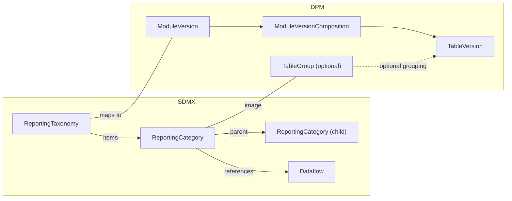

**Example ReportingTaxonomy**

```xml
<ReportingTaxonomy agencyID="EBA" id="FINREP_3.2" version="1.0" isPartial="false">
  <Name xml:lang="en">FINREP reporting taxonomy 3.2</Name>
  <ReportingCategory id="BALANCE_SHEET">
    <Name xml:lang="en">Balance sheet</Name>
    <Dataflow>
      <Ref agencyID="EBA" id="DF_FINREP_F_01.01" version="1.0"/>
    </Dataflow>
    <Dataflow>
      <Ref agencyID="EBA" id="DF_FINREP_F_01.02" version="1.0"/>
    </Dataflow>
  </ReportingCategory>
  <ReportingCategory id="INCOME_STATEMENT">
    <Name xml:lang="en">Income statement</Name>
    <Dataflow>
      <Ref agencyID="EBA" id="DF_FINREP_F_02.00" version="1.0"/>
    </Dataflow>
  </ReportingCategory>
</ReportingTaxonomy>
```

**Example ModuleVersion**

*ModuleVersion*

| ModuleVID   | ModuleID    | Code   | Name           | FromReferenceDate | ToReferenceDate | StartReleaseID | EndReleaseID |
| ----------- | ----------- | ------ | -------------- | ----------------- | --------------- | -------------- | ------------ |
| 100300001   | 100200001   | 3.2    | FINREP 3.2     | 2024-01-01        | NULL            | 5              | NULL         |

*ModuleVersionComposition* (linkage to TableVersions)

| ModuleVID   | TableVID   | TableGroupID |
| ----------- | ---------- | ------------ |
| 100300001   | 6101       | 200          |
| 100300001   | 6102       | 200          |
| 100300001   | 6200       | 201          |

*TableGroup*

| TableGroupID | Code             | Name              | StartReleaseID |
| ------------ | ---------------- | ----------------- | -------------- |
| 200          | BALANCE_SHEET    | Balance sheet     | 5              |
| 201          | INCOME_STATEMENT | Income statement  | 5              |

### 3.4.1 The deployable-unit alignment

The reasoning behind this pairing (rather than DSD/Dataflow ↔ Module):

1. **Versioning unit**. SDMX ReportingTaxonomy carries the version of the *reporting cycle* (e.g. FINREP 3.2). DPM ModuleVersion carries the version of the *reporting package*. Both bump together when a regulator publishes a new reporting cycle. DSDs and Dataflows can change independently, just as TableVersions can — they are not the deployable unit.
2. **Membership**. Both ReportingCategory and ModuleVersion list the structural artefacts in scope (ReportingCategory.dataflows; ModuleVersionComposition.tableVID). Neither is the structural definition itself.
3. **Reference date**. SDMX uses `validFrom` / `validTo` on the MaintainableArtefact (the ReportingTaxonomy). DPM uses `FromReferenceDate` / `ToReferenceDate` directly on ModuleVersion (4.2.2). The pair aligns at the same level.
4. **Reporter contract**. Reporters submit against the ReportingTaxonomy version (or, transitively, against the Dataflows it lists). They submit DPM data against a specific ModuleVersion. The "what is required this cycle" question lands at this level.

### 3.4.2 Mapping cardinality

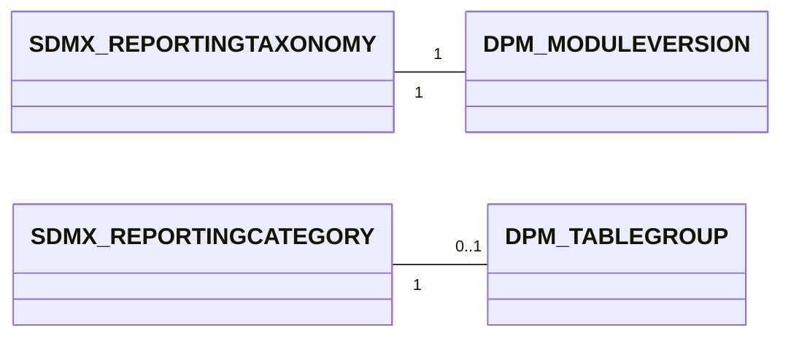

- From SDMX to DPM: one ReportingTaxonomy maps to one ModuleVersion (under a Module that maps to a Category covering the same reporting domain — see §3.3 for the Module pairing). Each ReportingCategory maps optionally to a TableGroup that groups the matching TableVersions inside the ModuleVersion. The `dataflows` listed in each ReportingCategory map to the ModuleVersionComposition rows for the corresponding TableVersions.
- From DPM to SDMX: one ModuleVersion maps to one ReportingTaxonomy. TableGroups (if present and used for navigation) map to ReportingCategories; each ReportingCategory references the Dataflows that map to the TableGroup's TableVersions. ModuleVersions whose TableVersion list is not partitioned by TableGroup emit a single (default) ReportingCategory containing all Dataflows.

### 3.4.3 Attributes equivalence

#### 3.4.3.1 SDMX ReportingTaxonomy attributes
- maintainable artefact attributes
    - `id`, `agencyID`, `version`
    - `validFrom`, `validTo`
- `Name` (multilingual)
- `Description` (multilingual)
- `isPartial`

#### 3.4.3.2 SDMX ReportingCategory attributes
- itemScheme `ReportingCategory` attributes
    - `id`, `urn`
- `Name` (multilingual)
- `Description` (multilingual)
- `parent` ReportingCategory
- references to Dataflows / Metadataflows

#### 3.4.3.3 DPM ModuleVersion attributes
- `ModuleVID` (system-generated PK)
- `ModuleID` (FK to Module)
- `Code` (the version code)
- `Name`
- `Description`
- `FromReferenceDate`, `ToReferenceDate` (4.2.2)
- `StartReleaseID`, `EndReleaseID` (4.2.1)
- inherits Owner from Module → Framework

#### 3.4.3.4 DPM TableGroup attributes
- `TableGroupID` (system-generated PK)
- `Code`
- `Name`
- `Description`
- `StartReleaseID` (informational only — see §04 Versioning)
- nested via `TableGroupComposition`

#### 3.4.3.5 Mapping details

| SDMX                                       | DPM                                            | Notes                                                                                                            |
|--------------------------------------------|------------------------------------------------|------------------------------------------------------------------------------------------------------------------|
| ReportingTaxonomy.`id`                     | ModuleVersion.`Code` (with Module.`Code`)      | The combined `<Module.Code>:<ModuleVersion.Code>` should map to the ReportingTaxonomy `id` (e.g. `FINREP_3.2`). |
| ReportingTaxonomy.`agencyID`               | Module.Owner (via Framework)                   | The ReportingTaxonomy is owned by the Agency that maps to the Framework's Owner.                                |
| ReportingTaxonomy.`version`                | Release identification (see §3.8)              | The version corresponds to the Release pin, not directly to ModuleVersion.`Code`.                                |
| ReportingTaxonomy.`validFrom`              | ModuleVersion.`FromReferenceDate`              | Application date. See §04 for nuances when the SDMX validFrom is at the artefact level vs the Release level.   |
| ReportingTaxonomy.`validTo`                | ModuleVersion.`ToReferenceDate`                |                                                                                                                  |
| ReportingTaxonomy.`Name`                   | ModuleVersion.`Name`                           | Multilingual.                                                                                                   |
| ReportingTaxonomy.`Description`            | ModuleVersion.`Description`                    | Multilingual.                                                                                                   |
| ReportingTaxonomy.`isPartial`              | — (no equivalent)                              |                                                                                                                  |
| ReportingCategory.`id`                     | TableGroup.`Code`                              | When ReportingCategory is materialised as TableGroup.                                                           |
| ReportingCategory.`Name`                   | TableGroup.`Name`                              |                                                                                                                  |
| ReportingCategory.`parent`                 | TableGroupComposition (parent–child)           | TableGroup nesting captures the hierarchy.                                                                       |
| ReportingCategory.`Dataflow` (references)  | ModuleVersionComposition rows                  | Each referenced Dataflow becomes a ModuleVersionComposition row pointing to the TableVersion that maps to that Dataflow (§02 §3.1). |
| — (not applicable)                         | ModuleVersion.`StartReleaseID` / `EndReleaseID`| Bound by the Release pin, not by SDMX. See §3.8.                                                                |

> **Note — Dataflows live in the Tables layer**: ReportingCategory.dataflows references *existing* SDMX Dataflows. Those Dataflows must be mapped to DPM Tables under the same Framework (per [§02 §3.1](../02_data_definition/03_detailed_mapping_rules.md#31-dataflow-dsd-table)) **before** the ModuleVersionComposition rows can be emitted. The taxonomy mapping is therefore a *post-pass* over the data-definition mapping.

> **Note — partial taxonomies**: If a ReportingTaxonomy lists Dataflows that are not in the DPM model, the mapping must either (a) skip those Dataflows with a warning, or (b) trigger the Table mapping for each missing Dataflow first. Implementations should choose (b) when the source repository is authoritative for the structure.

### 3.4.4 ReportingCategory.dataflows — partial correspondence

ReportingCategory's `Dataflow` references identify the Dataflows that reporters submit under that category. The mapping rule is:

| ReportingCategory.Dataflow                  | DPM equivalent                                                                            |
|---------------------------------------------|-------------------------------------------------------------------------------------------|
| `<Ref agencyID=… id=DF_X version=…>`        | The TableVersion that maps to Dataflow `DF_X` (per §02 §3.1.4).                          |
| (Order of references)                       | Order in `ModuleVersionComposition` (preserved if the implementation supports it).        |
| (Reference to Metadataflow)                 | — (no DPM equivalent for reference metadata at this level; see [§05 Gaps](../05_gaps/01_gaps_overview.md) for the open question on Metadataflow handling). |

The correspondence is **partial**: ReportingTaxonomy is a *navigation wrapper* over Dataflows that exist independently in the source repository, while ModuleVersion *contains* the structural definitions through ModuleVersionComposition. Information that lives only on the wrapper side (e.g. ReportingTaxonomy `Description`) is preserved in ModuleVersion fields; information that lives only on the wrapped side (e.g. Dataflow attributes) is preserved per the rules in §02.

### 3.4.5 Example Mapping SDMX ==> DPM

Starting from the ReportingTaxonomy in §3.4 (introductory example) and assuming Dataflows `DF_FINREP_F_01.01`, `DF_FINREP_F_01.02`, and `DF_FINREP_F_02.00` have already been mapped to TableVersions `6101`, `6102`, `6200`:

*ModuleVersion*

| ModuleVID   | ModuleID    | Code   | Name                                | FromReferenceDate | ToReferenceDate | StartReleaseID | EndReleaseID |
| ----------- | ----------- | ------ | ----------------------------------- | ----------------- | --------------- | -------------- | ------------ |
| 100300001   | 100200001   | 3.2    | FINREP reporting taxonomy 3.2       | 2024-01-01        | NULL            | 5              | NULL         |

- `ModuleID = 100200001` — the FINREP Module mapped from Category `FINREP` in §3.3.
- `Code = 3.2` — derived from the ReportingTaxonomy `id` suffix.
- `FromReferenceDate = 2024-01-01` ← `validFrom`.

*TableGroups* (one per ReportingCategory)

| TableGroupID | Code             | Name              | StartReleaseID |
| ------------ | ---------------- | ----------------- | -------------- |
| 200          | BALANCE_SHEET    | Balance sheet     | 5              |
| 201          | INCOME_STATEMENT | Income statement  | 5              |

*TableGroupComposition* (assigning Tables to groups)

| TableGroupID | TableID   |
| ------------ | --------- |
| 200          | (Table for DF_FINREP_F_01.01) |
| 200          | (Table for DF_FINREP_F_01.02) |
| 201          | (Table for DF_FINREP_F_02.00) |

*ModuleVersionComposition*

| ModuleVID   | TableVID   | TableGroupID |
| ----------- | ---------- | ------------ |
| 100300001   | 6101       | 200          |
| 100300001   | 6102       | 200          |
| 100300001   | 6200       | 201          |

### 3.4.6 Example Mapping DPM ==> SDMX

Starting from the ModuleVersion + TableGroup tables above, the mapping produces:

```xml
<ReportingTaxonomy agencyID="EBA" id="FINREP_3.2" version="1.0" isPartial="false"
                   validFrom="2024-01-01">
  <Name xml:lang="en">FINREP reporting taxonomy 3.2</Name>
  <ReportingCategory id="BALANCE_SHEET">
    <Name xml:lang="en">Balance sheet</Name>
    <Dataflow><Ref agencyID="EBA" id="DF_FINREP_F_01.01" version="1.0"/></Dataflow>
    <Dataflow><Ref agencyID="EBA" id="DF_FINREP_F_01.02" version="1.0"/></Dataflow>
  </ReportingCategory>
  <ReportingCategory id="INCOME_STATEMENT">
    <Name xml:lang="en">Income statement</Name>
    <Dataflow><Ref agencyID="EBA" id="DF_FINREP_F_02.00" version="1.0"/></Dataflow>
  </ReportingCategory>
</ReportingTaxonomy>
```

- The ReportingTaxonomy `id` combines `Module.Code` and `ModuleVersion.Code`: `FINREP_3.2`.
- ReportingCategories are emitted in `TableGroup.Code` order, each containing the Dataflows that map to the TableVersions in the group.
- If the ModuleVersionComposition has TableVersion rows with no `TableGroupID`, the mapping emits a single default ReportingCategory (e.g. `id="DEFAULT"`) containing them — or, alternatively, lists those Dataflows directly under the ReportingTaxonomy if the SDMX target supports it.

### 3.4.7 ReportingTaxonomyMap — brief

`ReportingTaxonomyMap` maps a ReportingTaxonomy onto another ReportingTaxonomy, typically across versions of the same reporting cycle. It is detailed alongside the other §03 mapping artefacts in §3.12.1; the key alignment is that a ReportingTaxonomyMap from `FINREP_3.1` to `FINREP_3.2` corresponds to the relationship between two ModuleVersions of the same Module — which DPM expresses through Module.versions and Release composition rather than as a separate map artefact.

## 3.5 TableGroup / TableAssociation — DPM-only with optional ReportingCategory image

DPM provides explicit grouping for Tables within a Module: **TableGroup** organises Tables into hierarchical, navigable bundles (e.g. *Balance sheet*, *Income statement* under FINREP); **TableAssociation** allows the same Table to participate in multiple groupings (e.g. by subject *and* by reporting frequency). Neither has a direct SDMX counterpart at the same conceptual level.

In SDMX, the closest analogue is a **ReportingCategory** subtree inside a ReportingTaxonomy (§3.4): ReportingCategories may be nested and reference Dataflows. They are not, however, the same artefact — ReportingCategories are scoped to one ReportingTaxonomy version, while DPM TableGroups are independent Concepts that exist outside any single ModuleVersion.

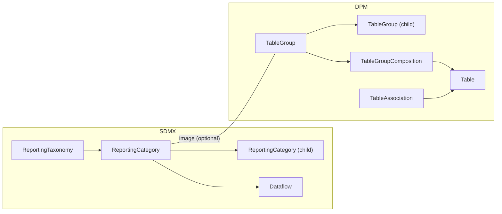

### 3.5.1 No direct SDMX equivalent

| Direction       | Statement                                                                                                                                                              |
|-----------------|------------------------------------------------------------------------------------------------------------------------------------------------------------------------|
| SDMX → DPM      | If the source provides ReportingCategories with hierarchy, the mapping in §3.4 materialises a TableGroup tree. Otherwise, no TableGroups are created.                  |
| DPM → SDMX      | TableGroups become ReportingCategories *only inside the ReportingTaxonomy* generated for the matching ModuleVersion. Outside that scope, TableGroups are not emitted. |

This means that the same DPM TableGroup can become *different* ReportingCategory items in different ReportingTaxonomies (one per ModuleVersion that uses the group). The TableGroup's identity does not survive into SDMX.

### 3.5.2 Recommended round-trip handling

| Asymmetry                                            | Recommendation                                                                                                                                                  |
|------------------------------------------------------|-----------------------------------------------------------------------------------------------------------------------------------------------------------------|
| TableGroup `Code` and `Description` should round-trip | Emit them as `ReportingCategory.id` and `Description`. On the reverse path, the same `Code` is reconstructed.                                                  |
| TableAssociation may put one Table in multiple groups | Emit each association as a separate `ReportingCategory.Dataflow` reference. Reverse: each Dataflow that appears under multiple ReportingCategories produces multiple TableAssociations. |
| Hierarchical TableGroup nesting                      | Mirror the parent–child relationship via `ReportingCategory.parent`.                                                                                            |
| Pure DPM TableGroup outside any ModuleVersion        | Lossy on the SDMX side. The TableGroup will only be emitted when a ModuleVersion that uses it is also being emitted. Standalone TableGroups should be flagged or preserved as a `DPM_TABLEGROUP` annotation on the Framework's CategoryScheme. |

### 3.5.3 Example DPM ==> SDMX

Starting from:

*TableGroup*

| TableGroupID | Code             | Name              | StartReleaseID |
| ------------ | ---------------- | ----------------- | -------------- |
| 200          | BALANCE_SHEET    | Balance sheet     | 5              |

*TableAssociation* (Table appears in two groups)

| TableID | TableGroupID |
| ------- | ------------ |
| 6101    | 200          |
| 6101    | 250          |

(Where `200 = BALANCE_SHEET` and `250 = QUARTERLY_REPORTING` are different navigation views of the same Table.)

The mapping produces a ReportingCategory under the ReportingTaxonomy generated for the matching ModuleVersion (§3.4):

```xml
<ReportingTaxonomy …>
  <ReportingCategory id="BALANCE_SHEET">
    <Name xml:lang="en">Balance sheet</Name>
    <Dataflow><Ref agencyID="EBA" id="DF_FINREP_F_01.01" version="1.0"/></Dataflow>
  </ReportingCategory>
  <ReportingCategory id="QUARTERLY_REPORTING">
    <Name xml:lang="en">Quarterly reporting</Name>
    <Dataflow><Ref agencyID="EBA" id="DF_FINREP_F_01.01" version="1.0"/></Dataflow>
  </ReportingCategory>
</ReportingTaxonomy>
```

The Dataflow `DF_FINREP_F_01.01` appears under both ReportingCategories — preserving the multi-grouping intent of the DPM TableAssociation.

## 3.6 ProvisionAgreement / Datasource — out of scope for DPM

SDMX **ProvisionAgreement** is a maintainable artefact that formalises a *data supply contract* between a DataProvider and a Dataflow:

```xml
<ProvisionAgreement agencyID="ECB" id="PA_BDE_CBD2" version="1.0">
  <DataProvider>
    <Ref agencyID="ECB" id="DATA_PROVIDERS" class="DataProvider" containedID="BDE"/>
  </DataProvider>
  <Dataflow>
    <Ref agencyID="ECB" id="CBD2" version="1.0"/>
  </Dataflow>
  <Datasource>
    <SimpleDatasource>
      <DataURL>https://bde.example/cbd2.xml</DataURL>
    </SimpleDatasource>
  </Datasource>
</ProvisionAgreement>
```

DPM does not model this contract. DPM expresses *what is required* (the ModuleVersion: which Tables, which Variables, which Operations) but **not** *who supplies it from where* (the agreement and endpoint).

### 3.6.1 Why DPM does not model provisioning

DPM is a metamodel for reporting requirements, not for data exchange logistics. Provisioning concerns — the contractual relationship, the URL where data is fetched, authentication and scheduling — are handled by the implementing platform (e.g. EBA's regulatory reporting infrastructure) outside the DPM database. This is consistent with the design principle that DPM "focuses on the what, not the how" (see [§01 Basics §1.3](../00_basics/01_base_comparison.md)).

### 3.6.2 Recommended preservation

| Direction       | Recommendation                                                                                                                                                                                          |
|-----------------|---------------------------------------------------------------------------------------------------------------------------------------------------------------------------------------------------------|
| SDMX → DPM      | Do not materialise ProvisionAgreement in DPM. If round-trip preservation is required, attach a `DPM_PROVISION_AGREEMENT` annotation to the matching ModuleVersion containing the original ProvisionAgreement URN(s).                                                                          |
| DPM → SDMX      | Do not emit ProvisionAgreement during the DPM → SDMX mapping. ProvisionAgreements must be authored separately by the operating platform (or recovered from the `DPM_PROVISION_AGREEMENT` annotation if present). |

> **Note — Datasource follows ProvisionAgreement**: SDMX `SimpleDatasource` and `RESTDatasource` are nested inside the ProvisionAgreement. They are not separable artefacts; the §3.6 rule covers them implicitly.

> **Note — DPM Organisation `URI`**: The DPM Organisation `URI` field (§3.1.2.2) is a contact URI for the organisation, **not** a data submission endpoint. It must not be conflated with `Datasource.DataURL`.

## 3.7 Process / ProcessStep — out of scope for DPM

SDMX **Process** is a maintainable artefact describing a workflow or data-processing pipeline. **ProcessStep** items reference input and output artefacts and document transformations. Process is the SDMX construct for capturing data lineage and production workflow.

DPM does not model production workflows. The DPM database documents *what* is to be reported and *how to validate it*, not the operational pipeline that produces or consumes it.

### 3.7.1 Recommended handling

| Direction       | Recommendation                                                                                                                                                          |
|-----------------|-------------------------------------------------------------------------------------------------------------------------------------------------------------------------|
| SDMX → DPM      | Do not materialise Process / ProcessStep in DPM. Optional preservation via a `DPM_PROCESS` annotation on the most-relevant DPM artefact (Framework or ModuleVersion).   |
| DPM → SDMX      | Do not emit Process / ProcessStep during the DPM → SDMX mapping. Processes must be authored separately by the operating platform.                                       |

Operations and Validation rules in DPM (5.4 of the metamodel) are *not* equivalent to SDMX Process: DPM Operations are validation/calculation rules over the data, not workflow steps. The two concepts should not be conflated.

## 3.8 Release ↔ version validity

SDMX has no dedicated *release* artefact. Each MaintainableArtefact carries its own `version`, optionally with `validFrom` / `validTo` timestamps. A "release" in the SDMX sense is the implicit set of artefact versions a publisher considers current at a given point in time.

DPM treats releases as first-class. **Release** (4.2.1 of the DPM metamodel) is a publication milestone that bundles a set of versioned artefacts (ModuleVersion, TableVersion, HeaderVersion, VariableVersion, …) and carries:

- `Code` — the release identifier (e.g. `2024-Q2`),
- `Date` — when the release is published (i.e. the publication event),
- `IsCurrent` — flag marking the most recent published Release.

Versioned artefacts reference Release through `StartReleaseID` and (optional) `EndReleaseID`, which together define the set of releases in which the version is active.

In addition, ModuleVersion carries `FromReferenceDate` / `ToReferenceDate` (4.2.2) which define when the **reporting obligation** starts/ends. These are independent of the publication date — a Release can be published in March 2024 with a ModuleVersion whose `FromReferenceDate` is 2024-Q2.

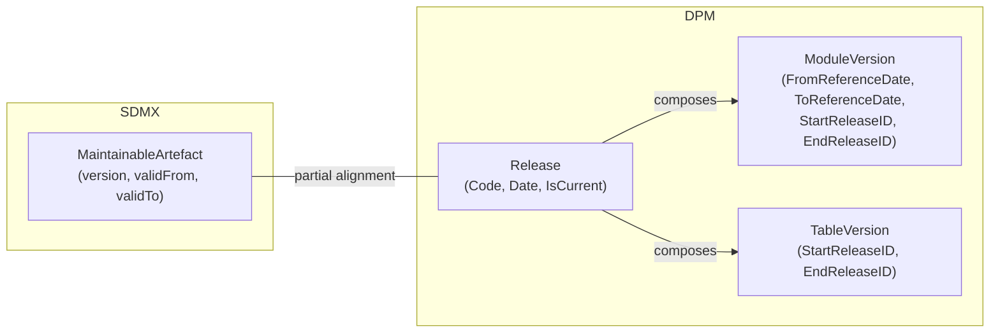

### 3.8.1 Why this lives in §03 and not §04

Both this chapter and [§04 Versioning](../04_versioning_and_extensibility/01_versioning_overview.md) touch Release and ModuleVersion. The split is:

- **§03 (here)**: artefact-level identity and structural mapping rules (what fields go where, how to emit a Release).
- **§04**: versioning *behaviour* — when to bump a version, how the SDMX uniform versioning model interacts with DPM's Release-based history, what counts as a breaking change.

If you are looking for the recipe to convert a single Release into SDMX validity windows, stay here. If you are looking for guidance on when a TableVersion bump is required, see §04.

### 3.8.2 Mapping cardinality

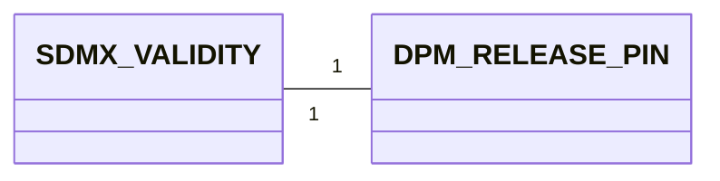

- From SDMX to DPM: there is no direct artefact pair. The mapping rule is to **infer** a Release from `validFrom` clusters in the source repository: artefacts whose `validFrom` falls within a small time window are assumed to belong to the same release. This is heuristic and should be supervised. The recommended path on SDMX → DPM is to *receive* an explicit release identifier from the source as part of the ingestion contract; if the source is silent, generate one Release per import batch with `Code` = batch timestamp.
- From DPM to SDMX: each Release becomes a set of `validFrom` (= Release.Date) values applied to the matching MaintainableArtefacts. `validTo` is set when the Release becomes superseded (next Release with `IsCurrent = TRUE` in the same composition chain).

### 3.8.3 Attributes equivalence

#### 3.8.3.1 SDMX validity attributes (per MaintainableArtefact)
- `validFrom` (date)
- `validTo` (date, optional)

#### 3.8.3.2 DPM Release attributes
- `ReleaseID` (system-generated PK)
- `Code`
- `Date`
- `Description`
- `IsCurrent`

#### 3.8.3.3 DPM Release-pinned version attributes (e.g. ModuleVersion)
- `StartReleaseID`
- `EndReleaseID`
- `FromReferenceDate` (ModuleVersion only — application date)
- `ToReferenceDate` (ModuleVersion only)

#### 3.8.3.4 Mapping details

| SDMX                         | DPM                                              | Notes                                                                                                       |
|------------------------------|--------------------------------------------------|-------------------------------------------------------------------------------------------------------------|
| MaintainableArtefact.`validFrom` | Release.`Date` (via `StartReleaseID` lookup)  | All artefacts pinned to the same `StartReleaseID` share one `validFrom`.                                   |
| MaintainableArtefact.`validTo`   | Release.`Date` (via `EndReleaseID` lookup)    | Set when the artefact is superseded.                                                                       |
| ReportingTaxonomy.`validFrom`    | ModuleVersion.`FromReferenceDate`             | When the reporting obligation begins. Distinguished from publication date.                                  |
| — (not applicable)               | Release.`Code`                                | Has no SDMX field. Recommended preservation: `DPM_RELEASE_CODE` annotation on the MaintainableArtefact.    |
| — (not applicable)               | Release.`IsCurrent`                           | SDMX expresses "current" by the absence of `validTo`. The two are equivalent for the latest version only. |
| — (not applicable)               | Release.`Description`                         | Lossy.                                                                                                     |

> **Note — `Date` vs `FromReferenceDate`**: when emitting SDMX from DPM, `validFrom` should be set from `Release.Date` (publication date) — *not* from `FromReferenceDate`. If the application date matters to the SDMX consumer, attach it as a `DPM_FROM_REFERENCE_DATE` annotation on the ReportingTaxonomy. See [§05 Gaps](../05_gaps/01_gaps_overview.md) for the canonical statement of this asymmetry.

### 3.8.4 Example Mapping SDMX ==> DPM

Given a set of SDMX artefacts (Codelists, DSDs, Dataflows, ReportingTaxonomy) all carrying `validFrom="2024-03-15"`, the mapping infers a single Release:

| ReleaseID | Code     | Date       | IsCurrent | Description |
| --------- | -------- | ---------- | --------- | ----------- |
| 5         | 2024-Q2  | 2024-03-15 | TRUE      | EBA reporting framework release for 2024-Q2 |

Each ingested MaintainableArtefact's version row then references `ReleaseID = 5` as its `StartReleaseID`.

If the source provides an explicit release identifier (e.g. via a contract or a `DPM_RELEASE_CODE` annotation), `Code` is set from it; otherwise `Code` is generated from `Date`.

### 3.8.5 Example Mapping DPM ==> SDMX

Given:

| ReleaseID | Code     | Date       | IsCurrent |
| --------- | -------- | ---------- | --------- |
| 5         | 2024-Q2  | 2024-03-15 | TRUE      |

For each MaintainableArtefact whose version row has `StartReleaseID = 5` and `EndReleaseID = NULL`:

```xml
<ReportingTaxonomy agencyID="EBA" id="FINREP_3.2" version="1.0"
                   validFrom="2024-03-15">
  <Annotations>
    <Annotation>
      <AnnotationTitle>DPM Release Code</AnnotationTitle>
      <AnnotationType>DPM_RELEASE_CODE</AnnotationType>
      <AnnotationText xml:lang="en">2024-Q2</AnnotationText>
    </Annotation>
  </Annotations>
  <!-- … -->
</ReportingTaxonomy>
```

When a later Release (e.g. `2024-Q3`) supersedes this version, the same artefact gets `validTo = 2024-06-15` (the `Date` of `2024-Q3`).

### 3.8.6 Cross-reference

For module-level temporal alignment (how `FromReferenceDate` interacts with Release composition, how to stage a Release rollout), see [§04 §1.3 Releases and temporal alignment](../04_versioning_and_extensibility/01_versioning_overview.md#13-releases-and-temporal-alignment).

## 3.9 Deactivation ↔ version validity (validTo)

DPM **Deactivation** is a soft-delete mechanism: instead of physically removing an artefact, a Deactivation marks it as inactive starting from a specific Release. Deactivated artefacts remain in the database for historical reference and round-tripping but are excluded from new modelling and active reporting.

In SDMX, the equivalent effect is achieved by setting `validTo` on the MaintainableArtefact's version. There is no dedicated artefact; it is a property of the version itself.

DPM uses two distinct mechanisms depending on the artefact:

- For **glossary** artefacts (Category, Item, Property, DataType — 4.2.3 of the metamodel): `IsActive = FALSE` on the artefact itself.
- For **versioned** artefacts (ModuleVersion, TableVersion, HeaderVersion, VariableVersion, OperationVersion): `EndReleaseID` set on the version row (the version is bounded above; subsequent Releases do not include it).

A separate `Deactivation` artefact in some implementations records the *reason* and the triggering Release; if it is not present, the deactivation event is recoverable only from the `EndReleaseID`.

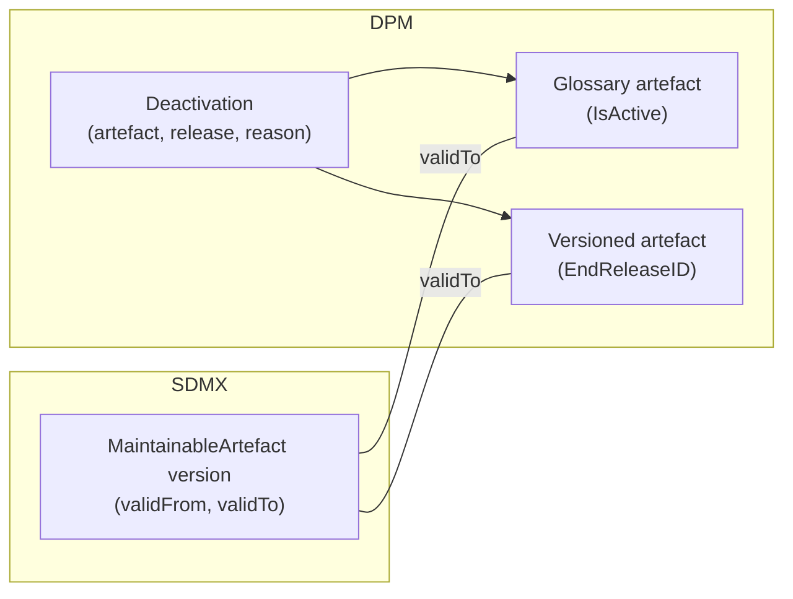

### 3.9.1 Mapping cardinality

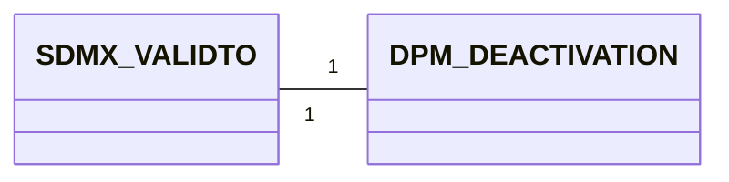

- From SDMX to DPM: when an incoming version row has `validTo` set, it is mapped to:
    - For glossary artefacts → `IsActive = FALSE` on the corresponding DPM artefact, plus a Deactivation row pinned to the Release inferred from `validTo` (per §3.8).
    - For versioned artefacts → `EndReleaseID` set on the matching DPM version row.
- From DPM to SDMX: when a DPM artefact has `IsActive = FALSE` (glossary) or `EndReleaseID != NULL` (versioned), the matching SDMX MaintainableArtefact version is emitted with `validTo` set to the corresponding Release.Date.

### 3.9.2 Attributes equivalence

#### 3.9.2.1 SDMX MaintainableArtefact attributes
- `validTo` (date)

#### 3.9.2.2 DPM Deactivation attributes (where modelled)
- artefact reference
- `release` (FK to Release)
- `reason` (optional)

Plus the underlying state on the artefact itself: `IsActive` (glossary) or `EndReleaseID` (versioned).

#### 3.9.2.3 Mapping details

| SDMX                         | DPM                                              | Notes                                                                       |
|------------------------------|--------------------------------------------------|-----------------------------------------------------------------------------|
| MaintainableArtefact.`validTo` | `EndReleaseID` (via Release lookup)            | Versioned artefacts.                                                        |
| MaintainableArtefact.`validTo` | `IsActive = FALSE` + Deactivation row          | Glossary artefacts (Category, Item, Property, DataType).                    |
| — (not applicable)             | Deactivation.`reason`                          | No SDMX field. Preserve via `DPM_DEACTIVATION_REASON` annotation.            |
| — (not applicable)             | Distinction glossary vs versioned              | The DPM mechanism depends on the artefact class; SDMX uses one mechanism.   |

### 3.9.3 Example

DPM side (a Table deactivated from Release 6 onwards, with reason):

| TableVID | TableID | Code        | StartReleaseID | EndReleaseID | (Deactivation.reason)            |
| -------- | ------- | ----------- | -------------- | ------------ | -------------------------------- |
| 6101     | 410     | F_05.OLD    | 5              | 6            | "Replaced by F_05.NEW (T_5_NEW)" |

(Where `Release 5 = 2024-Q2 (Date 2024-03-15)` and `Release 6 = 2024-Q3 (Date 2024-06-15)`.)

The mapping emits:

```xml
<Dataflow agencyID="EBA" id="DF_F_05_OLD" version="1.0"
          validFrom="2024-03-15" validTo="2024-06-15">
  <Name xml:lang="en">…</Name>
  <Annotations>
    <Annotation>
      <AnnotationTitle>DPM Deactivation Reason</AnnotationTitle>
      <AnnotationType>DPM_DEACTIVATION_REASON</AnnotationType>
      <AnnotationText xml:lang="en">Replaced by F_05.NEW (T_5_NEW)</AnnotationText>
    </Annotation>
  </Annotations>
  <Structure><Ref agencyID="EBA" id="DSD_F_05_OLD" version="1.0" class="DataStructure"/></Structure>
</Dataflow>
```

### 3.9.4 Cross-reference

For the broader treatment of deactivation propagation (when deactivating a Category cascades to its Items, SubCategories, and Properties — 4.2.4 of the metamodel), see [§04 Versioning](../04_versioning_and_extensibility/01_versioning_overview.md).

## 3.10 Annotation ↔ description / structured fields

SDMX defines a generic **Annotation** mechanism on every AnnotableArtefact (i.e. almost everything in SDMX). Annotations carry `id`, `title`, `type`, `url`, and multilingual `text`, and are designed as an open extension point for implementation-specific metadata, documentation links, rendering hints, and round-trip preservation.

DPM does not have a generic annotation mechanism. Instead, it offers:

- structured `Description` fields (multilingual `InternationalString`) on most Concepts;
- typed attributes for common metadata (e.g. `Reference` for documentation, `Translation` for multilingual content);
- a small number of recognised round-trip annotation markers, listed below, which the mapping defines as mandatory parts of its surface area.

The mismatch is real: SDMX is more flexible (any key/value), DPM is more structured (named slots). The mapping rule below provides a three-tier recipe to bridge it without losing information.

### 3.10.1 The three-tier mapping rule

| Tier | SDMX annotation                                        | DPM mapping                                                                                                                                                                                          |
|------|--------------------------------------------------------|------------------------------------------------------------------------------------------------------------------------------------------------------------------------------------------------------|
| (a)  | `type` matches a recognised DPM marker                | Mapped to a specific DPM field (table below).                                                                                                                                                        |
| (b)  | Free-form annotation (no recognised `type`)           | Appended to the artefact's `Description` field (multilingual), prefixed by `[<type>]` to allow round-trip extraction.                                                                                |
| (c)  | Implementation-specific annotation (no documented use) | Preserved as-is in a generic extension table (out of scope of these guidelines). Implementations that do not provide such a table must either drop the annotation or move it to tier (b). |

The reverse direction (DPM → SDMX) follows the same table:

- DPM-marker fields (tier a) → emit the matching `Annotation` with the documented `type`.
- DPM `Description` content with a `[<type>]` prefix (tier b) → split off and emit as an Annotation; the remainder stays as `Description`.
- Implementation-specific extensions (tier c) → emit as Annotations on the matching artefact.

### 3.10.2 Recognised DPM markers (tier a)

The following annotation `type` values are part of the round-trip mapping surface. Implementations must round-trip them faithfully.

| `AnnotationType`                | Attached to                          | DPM target field                                                                                                                                                                              | See                                                                                                                                                                          |
|---------------------------------|--------------------------------------|-----------------------------------------------------------------------------------------------------------------------------------------------------------------------------------------------|------------------------------------------------------------------------------------------------------------------------------------------------------------------------------|
| `DPM_SIGNATURE`                 | SDMX `Code`                          | `Item.Signature`                                                                                                                                                                              | [§00_basics §2.6.1](../00_basics/02_detailed_mapping_rules.md#261-dpm-signature-annotation), [§01_glossary §3.3.2.4](../01_glossary/03_detailed_mapping_rules.md#3324-signature-dpm-business-key) |
| `DPM_DEFAULT_ITEM`              | SDMX `Code`                          | `ItemCategory.IsDefaultItem`                                                                                                                                                                  | [§01_glossary §3.3.2.6](../01_glossary/03_detailed_mapping_rules.md#3326-sdmxdpm-generating-default-items)                                                                     |
| `DPM_COMPOUND_COMPONENTS`       | SDMX `Code`                          | `CompoundItem` decomposition (Property–Item pairs)                                                                                                                                            | [§01_glossary §3.3.6](../01_glossary/03_detailed_mapping_rules.md#336-sdmx-workarounds-for-compound-item-semantics), [§05_gaps §2.4](../05_gaps/02_specific_gap_analysis.md#24-compound-items-sdmx-feature-gap) |
| `DPM_ID_PREFIX`                 | SDMX `Agency`                        | `Organisation.IDPrefix`                                                                                                                                                                       | §3.1 above                                                                                                                                                                   |
| `DPM_AGENCY_PARENT`             | SDMX `Agency`                        | (informational) original parent Agency `id` for hierarchy preservation                                                                                                                        | §3.1 above                                                                                                                                                                   |
| `DPM_AGENCY_SCHEME`             | SDMX `Organisation` (DPM-side hint)  | (informational) the original AgencyScheme membership                                                                                                                                          | §3.1 above                                                                                                                                                                   |
| `DPM_CATEGORISATION_ID`         | SDMX `Categorisation`                | (informational) original Categorisation `id` for round-trip identity                                                                                                                          | §3.3.5 above                                                                                                                                                                 |
| `DPM_PROVISION_AGREEMENT`       | SDMX `ModuleVersion`-target          | (informational) original ProvisionAgreement URN(s)                                                                                                                                            | §3.6 above                                                                                                                                                                   |
| `DPM_PROCESS`                   | SDMX `Framework` / `ModuleVersion`   | (informational) original Process URN                                                                                                                                                          | §3.7 above                                                                                                                                                                   |
| `DPM_RELEASE_CODE`              | SDMX MaintainableArtefact            | `Release.Code`                                                                                                                                                                                | §3.8 above                                                                                                                                                                   |
| `DPM_FROM_REFERENCE_DATE`       | SDMX `ReportingTaxonomy`             | `ModuleVersion.FromReferenceDate` (when distinct from `validFrom`)                                                                                                                            | §3.8 above                                                                                                                                                                   |
| `DPM_DEACTIVATION_REASON`       | SDMX MaintainableArtefact            | `Deactivation.reason`                                                                                                                                                                         | §3.9 above                                                                                                                                                                   |
| `DPM_TABLEGROUP`                | SDMX `CategoryScheme` / Categorisation | (informational) standalone TableGroup metadata                                                                                                                                              | §3.5 above                                                                                                                                                                   |

> **Note — `id` and `title` of recognised annotations**: `id` should be set to the SDMX-style `<type>_<artefact-id>` pattern; `title` should be a human-readable label (e.g. `"DPM Signature"`). These are conventions, not strict requirements.

### 3.10.3 Free-form annotations (tier b)

When the SDMX source carries an Annotation with a `type` that is not in the recognised list, the mapping appends its content to the matching DPM artefact's `Description`:

```text
<Description>
[<type>] <AnnotationText>
</Description>
```

For example, an annotation:

```xml
<Annotation>
  <AnnotationType>USAGE_NOTE</AnnotationType>
  <AnnotationText xml:lang="en">Use only for trading book exposures.</AnnotationText>
</Annotation>
```

becomes:

```text
[USAGE_NOTE] Use only for trading book exposures.
```

appended to the matching artefact's `Description`. On the reverse path (DPM → SDMX), the prefix is stripped and the content emitted as an Annotation.

> **Multilingual handling**: tier (b) text follows the multilingual rules of [§00_basics §2.3](../00_basics/02_detailed_mapping_rules.md#23-multilingual-support-internationalstring-vs-translations) — one Translation row per language code present on the source Annotation.

### 3.10.4 Examples

#### 3.10.4.1 DPM_SIGNATURE preservation

SDMX → DPM: the annotation populates `Item.Signature` directly:

```xml
<Code id="x6">
  <Annotations>
    <Annotation>
      <AnnotationType>DPM_SIGNATURE</AnnotationType>
      <AnnotationText xml:lang="en">eba_BA:x6</AnnotationText>
    </Annotation>
  </Annotations>
</Code>
```

→ `ItemCategory.Signature = "eba_BA:x6"` (per [§01_glossary §3.3.2.4](../01_glossary/03_detailed_mapping_rules.md#3324-signature-dpm-business-key)).

#### 3.10.4.2 Free-form Annotation passthrough on a ModuleVersion

SDMX:

```xml
<ReportingTaxonomy agencyID="EBA" id="FINREP_3.2" version="1.0">
  <Annotations>
    <Annotation>
      <AnnotationType>RELEASE_NOTES_URL</AnnotationType>
      <AnnotationText xml:lang="en">https://www.eba.europa.eu/finrep-3.2-notes</AnnotationText>
    </Annotation>
  </Annotations>
  <Name xml:lang="en">FINREP reporting taxonomy 3.2</Name>
</ReportingTaxonomy>
```

DPM:

| ModuleVID  | Code | Name                          | Description                                                                |
| ---------- | ---- | ----------------------------- | -------------------------------------------------------------------------- |
| 100300001  | 3.2  | FINREP reporting taxonomy 3.2 | [RELEASE_NOTES_URL] https://www.eba.europa.eu/finrep-3.2-notes             |

On the reverse path, the `[RELEASE_NOTES_URL] …` line is split off the Description and emitted as a `RELEASE_NOTES_URL` Annotation on the ReportingTaxonomy.

> **Tip — Annotation `url` field**: SDMX Annotation has a separate `url` attribute. When the recognised type implies a URL payload, prefer emitting it as `Annotation.url` rather than `Annotation.text`. The mapping implementation should be consistent.

## 3.11 Rendering layer (Header / HeaderVersion / Cell) — handled in §02

The DPM rendering layer — Header, HeaderVersion, Cell, and the derivation of VariableVersions from leaf-level Header intersections — is part of the Table mapping and is documented in [§02 Data Definition — Detailed Mapping Rules §3.1, §3.2](../02_data_definition/03_detailed_mapping_rules.md#31-dataflow-dsd-table). SDMX has no equivalent at the same conceptual level: SDMX intentionally excludes presentation from the Information Model.

The canonical gap statement is in [§05 Gaps §1.3.4 Rendering layer](../05_gaps/01_gaps_overview.md#134-rendering-layer-dpm-sdmx).

This section confirms the boundary so that readers searching §03 for the rendering-layer treatment are pointed at the right place.

| Artefact                    | Documented in                                                                                                |
|-----------------------------|--------------------------------------------------------------------------------------------------------------|
| Header / HeaderVersion      | [§02 §3.2 DSD ↔ Table as structural collections](../02_data_definition/03_detailed_mapping_rules.md#32-dsd-table-as-structural-collections) |
| Cell                        | [§02 §3.2 (flat and non-flat patterns)](../02_data_definition/03_detailed_mapping_rules.md#32-dsd-table-as-structural-collections)          |
| VariableVersion derivation  | [§02 §3.3 Series Constraints ↔ Variables](../02_data_definition/03_detailed_mapping_rules.md#33-series-constraints-variables)               |

## 3.12 Mapping artefacts whose source/target sit in §03

SDMX defines a family of mapping artefacts (StructureMap, RepresentationMap, ConceptSchemeMap, CategorySchemeMap, OrganisationSchemeMap, ReportingTaxonomyMap) for transforming between maintainable artefacts. The maps whose **source/target sit in §03 territory** (taxonomy, category, organisation) are documented here. The maps whose source/target sit in §02 territory (StructureMap, RepresentationMap) are documented alongside the Tables/DSDs they map between, in [§02 §3.2.6 / §3.3.6](../02_data_definition/03_detailed_mapping_rules.md#32-dsd-table-as-structural-collections).

> **General principle**: SDMX maps are first-class maintainable artefacts. DPM has no maintained "map" artefacts; equivalent intent is expressed through ConceptRelation (4.1.4) or through naming/versioning conventions on the artefacts themselves. The mapping below documents the SDMX→DPM and DPM→SDMX recipes per map type.

### 3.12.1 ReportingTaxonomyMap

SDMX **ReportingTaxonomyMap** maps a source ReportingTaxonomy onto a target ReportingTaxonomy, e.g. across versions of the same reporting cycle (`FINREP_3.1` → `FINREP_3.2`). It contains **ReportingCategoryMap** items that pair source ReportingCategories with target ReportingCategories.

```xml
<ReportingTaxonomyMap agencyID="EBA" id="MAP_FINREP_3_1_TO_3_2" version="1.0">
  <Source><Ref agencyID="EBA" id="FINREP_3.1" version="1.0"/></Source>
  <Target><Ref agencyID="EBA" id="FINREP_3.2" version="1.0"/></Target>
  <ReportingCategoryMap>
    <Source>BALANCE_SHEET</Source>
    <Target>BALANCE_SHEET</Target>
  </ReportingCategoryMap>
  <ReportingCategoryMap>
    <Source>INCOME</Source>
    <Target>INCOME_STATEMENT</Target>
  </ReportingCategoryMap>
</ReportingTaxonomyMap>
```

In DPM, the equivalent intent is expressed by:

- The two ModuleVersions (`100300000` for FINREP 3.1, `100300001` for FINREP 3.2) being versions of the **same** Module.
- The TableGroups (`BALANCE_SHEET`, `INCOME_STATEMENT`) used in both ModuleVersions retain the same `Code` when they are the same logical group; renames are recorded by the differing `Code` between ModuleVersions.
- ConceptRelation (4.1.4) with type `version_new`/`version_fix` may explicitly link ModuleVersions and TableGroups across versions when needed.

| Direction       | Recipe                                                                                                                                                           |
|-----------------|------------------------------------------------------------------------------------------------------------------------------------------------------------------|
| SDMX → DPM      | Materialise the source and target ReportingTaxonomies as two ModuleVersions of the same Module (per §3.4). Each ReportingCategoryMap pair becomes a TableGroup correspondence: same `Code` if unchanged, ConceptRelation if renamed. |
| DPM → SDMX      | Emit a ReportingTaxonomyMap whenever two consecutive ModuleVersions of the same Module are both being exported. ReportingCategoryMaps reflect the TableGroup mapping (identity by `Code` plus any explicit ConceptRelations). |

> **Cross-reference to §04**: the version-bump semantics (when does a ModuleVersion change require a new ReportingTaxonomy version vs a backwards-compatible update) are covered in [§04 Versioning](../04_versioning_and_extensibility/01_versioning_overview.md).

### 3.12.2 CategorySchemeMap

SDMX **CategorySchemeMap** maps Categories between two CategorySchemes. It is rarely needed for round-trip; typical use is Framework rebranding or merging.

```xml
<CategorySchemeMap agencyID="EBA" id="MAP_OLD_TO_NEW" version="1.0">
  <Source><Ref agencyID="EBA" id="OLD_DOMAINS" version="1.0"/></Source>
  <Target><Ref agencyID="EBA" id="EBA_REPORTING" version="1.0"/></Target>
  <CategoryMap>
    <Source>FIN_REP</Source>
    <Target>FINREP</Target>
  </CategoryMap>
</CategorySchemeMap>
```

In DPM, the equivalent intent is expressed by:

- Framework merge → a `version_new` ConceptRelation (4.1.4) linking the two Frameworks, *or* a complete migration where Modules from the old Framework are reassigned (`Module.FrameworkID`) to the new one.
- Module rename → a `version_fix` ConceptRelation linking the renamed Modules, plus the new `Module.Code`.

| Direction       | Recipe                                                                                                                                                                   |
|-----------------|--------------------------------------------------------------------------------------------------------------------------------------------------------------------------|
| SDMX → DPM      | Apply the CategoryMap entries as a renaming/migration step on the matching Modules. If both Frameworks already exist, record ConceptRelations of type `version_new` between matching Module pairs. |
| DPM → SDMX      | Emit a CategorySchemeMap when two Frameworks coexist in the export and there is a documented correspondence (via ConceptRelation or naming convention). The map is optional — if not emitted, downstream consumers can recover the relationship from the Module-rename trail in the source. |

### 3.12.3 OrganisationSchemeMap

SDMX **OrganisationSchemeMap** maps Organisations between schemes — typically when an Agency is renamed or absorbed across an SDMX repository:

```xml
<OrganisationSchemeMap agencyID="SDMX" id="MAP_RENAME" version="1.0">
  <Source><Ref agencyID="SDMX" id="AGENCIES" version="1.0"/></Source>
  <Target><Ref agencyID="SDMX" id="AGENCIES" version="2.0"/></Target>
  <OrganisationMap>
    <Source>OLD_NAME</Source>
    <Target>NEW_NAME</Target>
  </OrganisationMap>
</OrganisationSchemeMap>
```

In DPM, an Organisation rename is recorded directly on the Organisation row (`Acronym` change), with a `version_fix` ConceptRelation linking the old and new Concept identities if the implementation tracks pre-rename history.

| Direction       | Recipe                                                                                                                                          |
|-----------------|-------------------------------------------------------------------------------------------------------------------------------------------------|
| SDMX → DPM      | Apply each OrganisationMap as a rename: update the matching `Organisation.Acronym` (and `Name` if the source carries a new label). Record a ConceptRelation of type `version_fix` between the old and new Concept GUIDs to preserve the rename trail. |
| DPM → SDMX      | Emit an OrganisationSchemeMap when there is a documented Organisation rename between two snapshots of the export. The map is informational — the rename is also implicit in the new `Acronym`. |

> **No Categorisation implication**: an Organisation rename does **not** trigger any Categorisation change in either direction. The Framework owner is identified by the (renamed) Organisation; the rest of the model continues to reference it by its primary key.

### 3.12.4 Cross-reference: maps whose source/target sit in §02

For completeness:

| SDMX map type            | Source/target layer           | Documented in                                                                                                                       |
|--------------------------|-------------------------------|-------------------------------------------------------------------------------------------------------------------------------------|
| StructureMap             | Data definition (DSD/Dataflow) | [§02 §3.2](../02_data_definition/03_detailed_mapping_rules.md#32-dsd-table-as-structural-collections)                              |
| RepresentationMap        | Glossary / data definition    | [§02 §3.2](../02_data_definition/03_detailed_mapping_rules.md#32-dsd-table-as-structural-collections), [§01 §3.3](../01_glossary/03_detailed_mapping_rules.md#33-code-category-item) |
| ConceptSchemeMap         | Glossary (Concepts/Properties)| [§01 §3.5.6](../01_glossary/03_detailed_mapping_rules.md#356-conceptscheme-handling)                                                |
| CategorySchemeMap        | §03 (Frameworks/Modules)      | §3.12.2 above                                                                                                                       |
| OrganisationSchemeMap    | §03 (Organisations)           | §3.12.3 above                                                                                                                       |
| ReportingTaxonomyMap     | §03 (ModuleVersions)          | §3.12.1 above                                                                                                                       |
