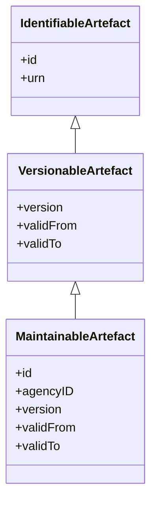
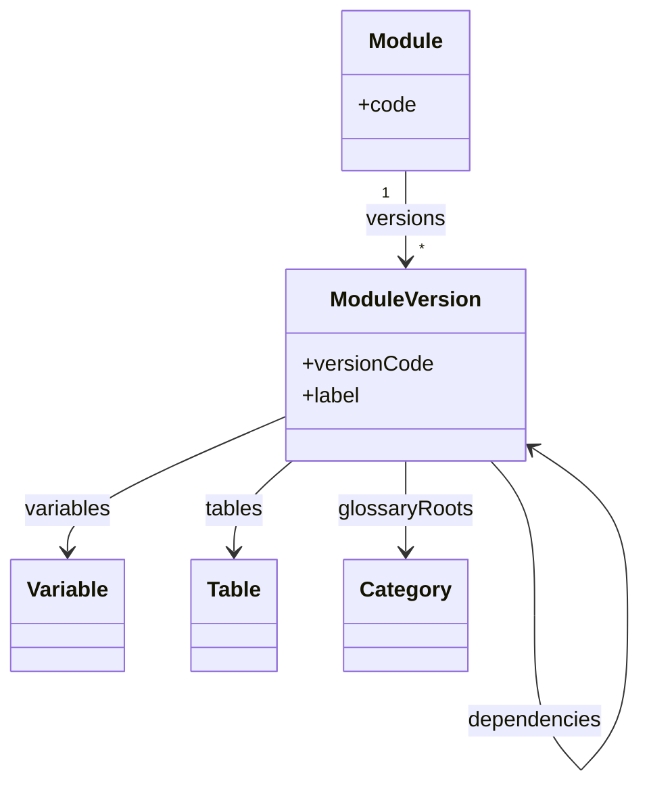
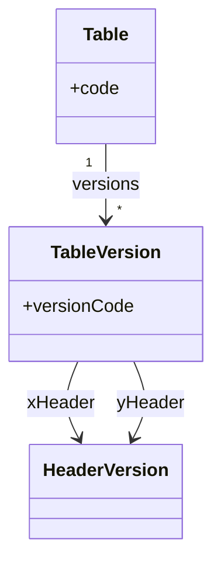
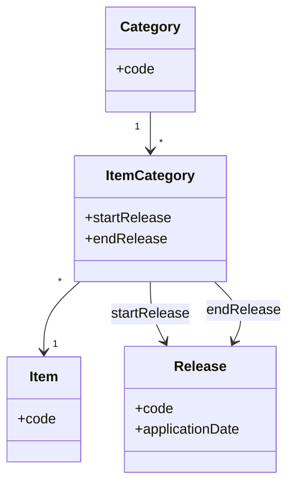
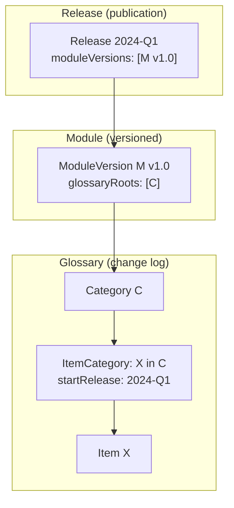

# 1. Versioning overview

This chapter explains how versioning works in SDMX and DPM. While SDMX has a straightforward, uniform versioning model, DPM's approach is more nuanced: true versioning applies only to certain artefacts (Modules, Tables, SubCategories), while glossary items use a release-based change log that must be interpreted in context.

## 1.1 SDMX Versioning model

SDMX has a clean, hierarchical versioning model built into the artefact hierarchy.

### Core principles

1. **Only MaintainableArtefacts are versioned**: Codelists, ConceptSchemes, DSDs, Dataflows, etc. have explicit `version` attributes. Contained items (Codes, Concepts, Dimensions) inherit their parent's version.

2. **Semantic versioning convention**: Versions typically follow `major.minor.patch` (e.g. `1.0.0`, `2.1.0`). Major changes break compatibility; minor changes add content; patches fix errors.

3. **Validity periods**: MaintainableArtefacts can have `validFrom` and `validTo` dates indicating when a version is effective.

4. **Immutability**: Once published, a version should not change. New content requires a new version.

5. **URN-based identity**: Each versioned artefact has a unique URN including the version: `urn:sdmx:org.sdmx.infomodel.codelist.Codelist=AGENCY:ID(VERSION)`

### Versioning scope

| Artefact type | Versioned? | Notes |
|---------------|------------|-------|
| Codelist, ConceptScheme, CategoryScheme | Yes | ItemSchemes are maintainable |
| Code, Concept, Category | No | Inherit parent scheme version |
| DataStructureDefinition | Yes | Component changes require new version |
| Dimension, Measure, Attribute | No | Inherit DSD version |
| Dataflow | Yes | Can version independently of DSD |
| Hierarchy | Yes | Independent from source Codelists |
| DataConstraint | Yes | Can evolve separately from Dataflow |
| ProvisionAgreement | Yes | Versioned contract |

### evolvingStructure flag

DSDs can set `evolvingStructure = true` to allow adding Dimensions without a major version change. This supports growing classifications while maintaining backward compatibility for existing data.

### Version references

When one artefact references another (e.g. a DSD referencing a Codelist), the reference can be:
- **Specific version**: `AGENCY:CODELIST(1.0)` – pinned to exact version.
- **Latest version**: `AGENCY:CODELIST(+)` – always resolves to the latest available version.

This allows structures to either lock dependencies or follow updates automatically.

## 1.2 DPM Versioning model

DPM's versioning model is more complex because it distinguishes between:
1. **Structural versioning**: Explicit versions on Modules, Tables, Headers, and Operations.
2. **Glossary change tracking**: Release-based logs on Categories, Items, Properties—not true versions.
3. **Applicability context**: Glossary item validity depends on which ModuleVersion references it.

### True versioning: Modules, Tables, SubCategories

These artefacts have explicit version semantics with `versionCode` attributes.

#### Module / ModuleVersion

Modules are the primary versioned unit in DPM. A ModuleVersion contains:
- Variables, Tables, Operations (the data definition)
- Glossary roots (references to Categories/Properties used)
- Dependencies (references to other ModuleVersions)

**Key insight**: The `glossaryRoots` reference determines which glossary content is "in scope" for that ModuleVersion. A Category or Property exists in the glossary, but its applicability to a specific reporting context comes from Module membership.

#### Table / TableVersion

Tables have independent versioning. A TableVersion defines the structure (headers, cells) for a specific version of a table.

#### SubCategory

SubCategories (subsets of a Category's Items) are versioned. When the subset changes, a new SubCategory version is created.

### Glossary change tracking: Not true versioning

**This is the critical distinction**: DPM glossary artefacts (Categories, Items, Properties) do not have versions in the traditional sense. Instead, they have **release-based change logs**.

#### The ItemCategory / CategoryItem pattern

In DPM, the relationship between an Item and its Category is tracked via junction artefacts (e.g. `ItemCategory` or `CategoryItem`) that record:
- `startRelease`: The Release when this relationship became active.
- `endRelease`: The Release when this relationship was deactivated (null if still active).

**What this means**:
- An Item is not "version 1.0" or "version 2.0"—it simply exists.
- The log tells you *when* the Item was added to or removed from a Category.
- To know if an Item is "valid", you must ask: "valid for which Release?"

#### The applicability problem

The release-based log answers "when did this change happen?" but not "does this apply to my reporting context?" That question can only be answered by looking at the **ModuleVersion**.

**Example scenario**:
1. Item `X` is added to Category `C` in Release `2024-Q1`.
2. ModuleVersion `M v1.0` references Category `C` as a glossary root.
3. ModuleVersion `M v1.0` is included in Release `2024-Q1`.

Is Item `X` valid for ModuleVersion `M v1.0`? Yes, because:
- `M v1.0` references `C`
- `X` is in `C` as of Release `2024-Q1`
- `M v1.0` is published in `2024-Q1`

But if `M v1.0` were published in Release `2023-Q4` (before `X` was added), then `X` would not be applicable to `M v1.0` even though both reference Category `C`.

### Summary: Two different models

| Aspect | SDMX | DPM |
|--------|------|-----|
| What is versioned | All MaintainableArtefacts | Modules, Tables, Headers, Operations, SubCategories |
| Glossary versioning | Codelist/ConceptScheme versions include all Codes/Concepts | No glossary versioning; release-based change log |
| Version identity | URN with version component | versionCode attribute |
| Validity | validFrom/validTo on artefact | startRelease/endRelease on relationships |
| Applicability | Self-contained in the version | Derived from Module context + Release |
| Item changes | New scheme version | Log entry; same Item, new release range |

### Implications for transformation

When mapping between SDMX and DPM:

1. **SDMX → DPM**: A new Codelist version (e.g. adding a Code) does not create a new Category version in DPM. Instead, an ItemCategory record is created with the appropriate startRelease.

2. **DPM → SDMX**: To produce a Codelist version, you must "snapshot" the Category at a specific Release, including only Items where `startRelease ≤ targetRelease` and (`endRelease` is null or `endRelease > targetRelease`).

3. **Module context is essential**: When converting DPM to SDMX, the ModuleVersion determines which glossary content to include. Without a Module context, you cannot determine which Items are "in scope".

## 1.3 Releases and temporal alignment

### SDMX: Version validity

SDMX artefacts can have `validFrom` and `validTo` dates, but these are optional and not consistently used. Multiple versions of an artefact can coexist; consumers choose which version to use.

### DPM: Releases as publication milestones

DPM Releases are explicit publication events:
- `releaseDate`: When the release is published.
- `applicationDate`: When reporting obligations begin.
- `moduleVersions`: Which ModuleVersions are included.

Releases provide temporal coordination: all stakeholders know that Release `2024-Q1` contains specific ModuleVersions with specific glossary content.

### Alignment challenge

| SDMX | DPM | Gap |
|------|-----|-----|
| Each artefact versioned independently | ModuleVersions bundled in Releases | Coordinated vs independent publication |
| validFrom/validTo (optional) | releaseDate/applicationDate (required) | Different temporal semantics |
| Consumer chooses version | Release determines applicable versions | Pull vs push model |

**Recommendation**: When designing bidirectional mappings, establish conventions for:
1. How SDMX artefact versions align with DPM Releases.
2. How to derive `validFrom`/`validTo` from `applicationDate`.
3. How to bundle SDMX artefacts when converting from a DPM Release.
