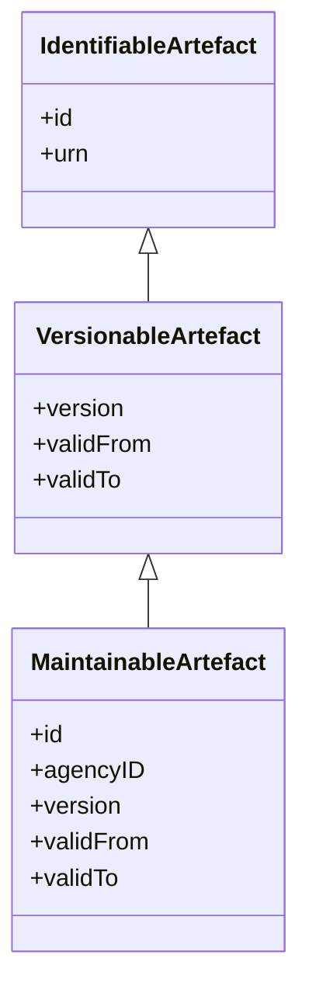
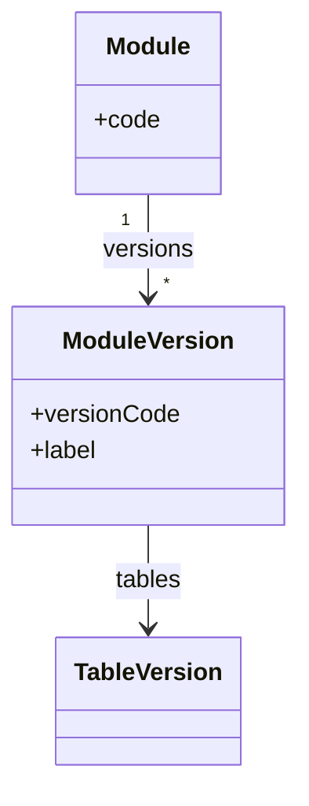
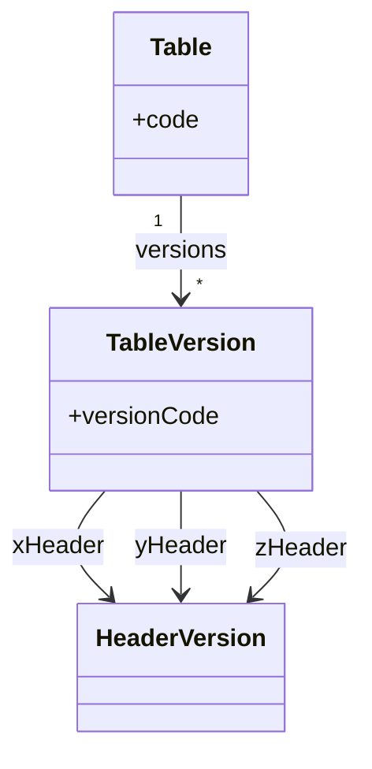
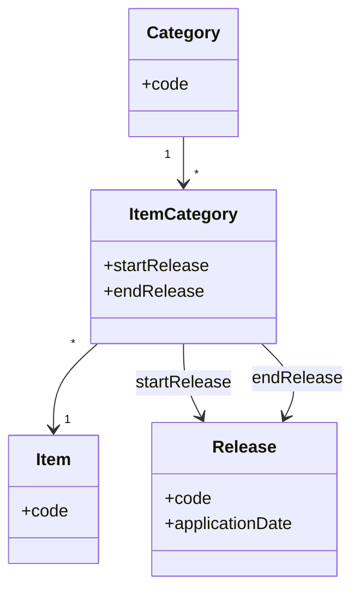
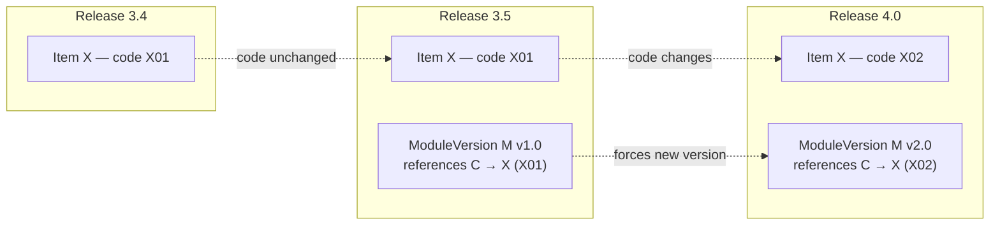

# 1. Versioning overview

This chapter explains how versioning works in SDMX and DPM. While SDMX has a straightforward, uniform versioning model, DPM's approach is more nuanced: true versioning applies only to certain artefacts (Modules, Tables, SubCategories), while glossary items use a release-based change log that must be interpreted in context.

## 1.1 SDMX Versioning model

SDMX has a clean, hierarchical versioning model built into the artefact hierarchy.

### Core principles

1. **Only MaintainableArtefacts are versioned**: Codelists, ConceptSchemes, DSDs, Dataflows, etc. have explicit `version` attributes. Contained items (Codes, Concepts, Dimensions) inherit their parent's version.

2. **Semantic versioning convention**: Versions typically follow `major.minor.patch` (e.g. `1.0.0`, `2.1.0`). Major changes break compatibility; minor changes add content; patches fix errors.

3. **Validity periods**: MaintainableArtefacts can have `validFrom` and `validTo` dates indicating when a version is effective.

4. **Immutability**: Once published, a version should not change. New content requires a new version.

5. **URN-based identity**: Each versioned artefact has a unique URN including the version: `urn:sdmx:org.sdmx.infomodel.codelist.Codelist=AGENCY:ID(VERSION)`

### Versioning scope

| Artefact type | Versioned? | Notes |
|---------------|------------|-------|
| Codelist, ConceptScheme, CategoryScheme | Yes | ItemSchemes are maintainable |
| Code, Concept, Category | No | Inherit parent scheme version |
| DataStructureDefinition | Yes | Component changes require new version |
| Dimension, Measure, Attribute | No | Inherit DSD version |
| Dataflow | Yes | Can version independently of DSD |
| Hierarchy | Yes | Independent from source Codelists |
| DataConstraint | Yes | Can evolve separately from Dataflow |
| ProvisionAgreement | Yes | Versioned contract |

### evolvingStructure flag

DSDs can set `evolvingStructure = true` to allow adding Dimensions without a major version change. This supports growing classifications while maintaining backward compatibility for existing data.

### Version references

When one artefact references another (e.g. a DSD referencing a Codelist), the reference can be:
- **Specific version**: `AGENCY:CODELIST(1.0)` – pinned to exact version.
- **Latest version**: `AGENCY:CODELIST(+)` – always resolves to the latest available version.

This allows structures to either lock dependencies or follow updates automatically.

## 1.2 DPM Versioning model

DPM's versioning model is more complex because it distinguishes between:

1. **Structural versioning**: Explicit versions on Modules, Tables, Headers, and Operations.
2. **Glossary change tracking**: Release-based logs on Categories, Items, Properties—not true versions.
3. **Applicability context**: Glossary item validity depends on which ModuleVersion references it.

> **Critical: ModuleVersion is the only artefact with reference-date validity.**
> In DPM 2.0, only ModuleVersion carries `FromReferenceDate` / `ToReferenceDate` — the calendar window during which the reporting bundle applies. All other "true-versioned" artefacts (Tables/TableVersion, SubCategories, Operations) use only `StartReleaseID` / `EndReleaseID` markers, which point to publication releases rather than calendar dates. This means the answer to "which version of glossary item X applies on date D?" can only be resolved through the ModuleVersion that references X and is valid for date D.

> **Everything starts from ModuleVersion.**
> The practical consequence of the previous point: any consumer needing to resolve the version of a Table, SubCategory, Item, or Property for a reporting context **must** start from a ModuleVersion. The ModuleVersion fixes the Release window, which fixes which release-tagged glossary entries are in scope, which in turn determines the codes and item membership the reporter must use. There is no shorter path — querying the glossary directly without a ModuleVersion produces ambiguous answers.

### True versioning: Modules, Tables, SubCategories

These artefacts have explicit version semantics with `versionCode` attributes.

#### Module / ModuleVersion

Modules are the primary versioned unit in DPM. A ModuleVersion contains:
- Variables, Tables, Operations (the data definition)
- Glossary roots (references to Categories/Properties used)
- Dependencies (references to other ModuleVersions)

#### Table / TableVersion

Tables have independent versioning. A TableVersion defines the structure (headers, cells) for a specific version of a table.

#### SubCategory

SubCategories (subsets of a Category's Items) are versioned. When the subset changes, a new SubCategory version is created.

### Glossary change tracking: Not true versioning

**This is the critical distinction**: DPM glossary artefacts (Categories, Items, Properties) do not have versions in the traditional sense. Instead, they have **release-based change logs**.

#### The ItemCategory / CategoryItem pattern

In DPM, the relationship between an Item and its Category is tracked via junction artefacts (e.g. `ItemCategory` or `CategoryItem`) that record:
- `startRelease`: The Release when this relationship became active.
- `endRelease`: The Release when this relationship was deactivated (null if still active).

**What this means**:
- An Item is not "version 1.0" or "version 2.0"—it simply exists.
- The log tells you *when* the Item was added to or removed from a Category.
- To know if an Item is "valid", you must ask: "valid for which Release?"

#### Two dimensions of item evolution

An Item can evolve across Releases in two distinct ways:

1. **Code change**: The Item's code can be revised over time. The previous code is retired and a new one becomes active from a given Release onward.
2. **Category reassignment**: The Item can move from one Category to another, recorded as an `endRelease` on one `ItemCategory` and a `startRelease` on a new one.

In both cases, the Item's logical identity persists across the change — neither produces a "new" Item.

#### Per-release uniqueness rule

A critical business rule sits on top of the change log. It is **not enforced by the model's cardinalities** but is required for the model to be usable for data exchange:

> Within any given Release, an Item has exactly one code and belongs to exactly one Category.

Given a Release, this makes the (code, Category) pair for any Item unambiguous — which is precisely the signature a reporter needs to produce data and a consumer needs to interpret it. The model itself permits overlapping log entries (two active `startRelease` rows for the same Item in different Categories, or two simultaneously-active codes); curation must guarantee they do not occur. Without this guarantee, the same logical Item could resolve to two codes or two Categories at once, breaking deterministic exchange.

This is also why a Release — not a Module or a Category in isolation — is the smallest unit at which "what code do I use for Item X?" has a well-defined answer.

#### The applicability problem

The release-based log answers "when did this change happen?" but not "which code should I use for my reporting context?" That answer can only be derived through a **ModuleVersion** and the Release in which it is published.

Releases are identified by ordered version numbers (e.g. `3.4`, `3.5`, `4.0`); the order follows their publication date.

**Example scenario** — tracing an Item across three Releases:

1. **Release 3.4** — Item `X` is created in Category `C` with code `X01`. No Module yet references `C`; the Item simply exists in the glossary.

2. **Release 3.5** — A new `ModuleVersion M v1.0` is created and references Category `C` as a glossary root. Item `X`'s code has not changed since Release 3.4, so within Release 3.5 it is still `X01`. The per-release uniqueness rule guarantees this is the only code in scope: reporters submitting data for `M v1.0` use `X01` for Item `X`. The signature is unambiguous.

3. **Release 4.0** — Item `X`'s code is revised from `X01` to `X02`. This is a glossary-only event in the change log. But the per-release uniqueness rule forbids `M v1.0` from referencing `X` under two different codes across Releases. The change therefore propagates: a new `ModuleVersion M v2.0` must be created in Release 4.0, and reporters submitting data for that Release use `M v2.0` with code `X02`.

The pattern: a glossary-level change (code revision or category reassignment) on an Item referenced — directly or transitively — by a Module is not a private glossary matter. It forces a new ModuleVersion, because the signature a reporter must produce has to remain deterministic for the Release.

### Summary: Two different models

| Aspect | SDMX | DPM |
|--------|------|-----|
| What is versioned | All MaintainableArtefacts | Modules, Tables, Headers, Operations, SubCategories |
| Glossary versioning | Codelist/ConceptScheme versions include all Codes/Concepts | No glossary versioning; release-based change log |
| Version identity | URN with version component | versionCode attribute |
| Validity | validFrom/validTo on artefact | startRelease/endRelease on relationships |
| Applicability | Self-contained in the version | Derived from Module context + Release |
| Item changes | New scheme version | Log entry; same Item, new release range |

### Implications for transformation

When mapping between SDMX and DPM:

1. **SDMX → DPM**: A new Codelist version (e.g. adding a Code) does not create a new Category version in DPM. Instead, an ItemCategory record is created with the appropriate startRelease.

2. **DPM → SDMX**: To produce a Codelist version, you must "snapshot" the Category at a specific Release, including only Items where `startRelease ≤ targetRelease` and (`endRelease` is null or `endRelease > targetRelease`).

3. **Module context is essential**: When converting DPM to SDMX, the ModuleVersion determines which glossary content to include. Without a Module context, you cannot determine which Items are "in scope".

## 1.3 Releases and temporal alignment

### SDMX: Version validity

SDMX artefacts can have `validFrom` and `validTo` dates, but these are optional and not consistently used. Multiple versions of an artefact can coexist; consumers choose which version to use.

### DPM: Releases as publication milestones

DPM Releases are explicit publication events:
- `releaseDate`: When the release is published.
- `applicationDate`: When reporting obligations begin.
- `moduleVersions`: Which ModuleVersions are included.

Releases provide temporal coordination: all stakeholders know that Release `2024-Q1` contains specific ModuleVersions with specific glossary content.

### Alignment challenge

| SDMX | DPM | Gap |
|------|-----|-----|
| Each artefact versioned independently | ModuleVersions bundled in Releases | Coordinated vs independent publication |
| validFrom/validTo (optional) | releaseDate/applicationDate (required) | Different temporal semantics |
| Consumer chooses version | Release determines applicable versions | Pull vs push model |

**Recommendation**: When designing bidirectional mappings, establish conventions for:
1. How SDMX artefact versions align with DPM Releases.
2. How to derive `validFrom`/`validTo` from `applicationDate`.
3. How to bundle SDMX artefacts when converting from a DPM Release.
