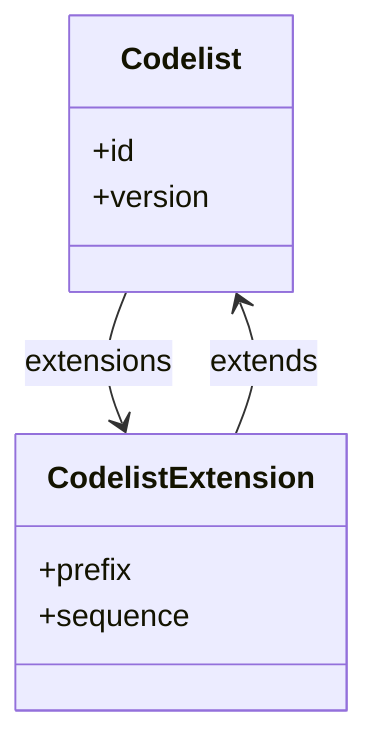

# 2. Extensibility patterns

This chapter documents how SDMX and DPM support extensibility—adding new content, extending value domains, and evolving structures—while maintaining interoperability and compatibility.

## 2.1 Value domain extension

### SDMX: Extended Codelists

SDMX provides **Codelist extension** as a first-class mechanism:

- **Additive extension**: Add codes from another Codelist (e.g. add partner-specific codes to a base Codelist).
- **Restrictive extension**: Select a subset of codes (InclusiveCodeSelection / ExclusiveCodeSelection).
- **Prefix handling**: Avoid code conflicts via prefix assignment.
- **Sequence ordering**: Resolve conflicts when multiple Codelists are merged.



**Example**: An Extended Codelist `CL_COUNTRY_EXTENDED` that:
1. Extends `CL_ISO_COUNTRY` (base ISO codes)
2. Adds codes from `CL_INTERNAL_CODES` with prefix `INT_`
3. Excludes deprecated codes via ExclusiveCodeSelection

### DPM: SubCategories and SuperCategories

DPM uses different mechanisms:

- **SubCategory**: Defines a subset of Items from a Category. Used for restrictions, not additions.
- **SuperCategory**: Unites multiple Categories into a single value domain. Used for merging, not extending.
- **New Items**: Adding values to a Category is done by creating new Items with appropriate `startRelease`.

| Pattern | SDMX mechanism | DPM mechanism |
|---------|---------------|---------------|
| Restrict to subset | Extended Codelist (exclusive) | SubCategory |
| Add new codes | Extended Codelist (additive) or new Codelist version | New Items with startRelease |
| Merge value domains | Extended Codelist (multiple sources) | SuperCategory |
| Partner-specific codes | Extended Codelist with prefix | Separate Category or Items with ownership metadata |

### Extensibility gap

**SDMX → DPM**: Extended Codelists with additive semantics do not map cleanly. Options:
1. Flatten into a single Category with all Items.
2. Create a SuperCategory if sources are distinct Categories.
3. Track the extension relationship in metadata.

**DPM → SDMX**: SubCategories map to restrictive Extended Codelists. SuperCategories map to additive Extended Codelists.

## 2.2 Structural extension

### SDMX: Adding components

DSDs can evolve by adding:
- **Dimensions**: Requires new DSD version (unless `evolvingStructure = true`).
- **Attributes**: Can often be added with minor version change.
- **Measures**: Requires new DSD version.

The `evolvingStructure` flag allows dimension additions without breaking compatibility—existing data remains valid; new data uses the extended structure.

### DPM: Adding Variables

ModuleVersions can include new Variables:
- **FactVariables**: New measures require new ModuleVersion.
- **KeyVariables**: New identifiers require new ModuleVersion.
- **AttributeVariables**: New metadata requires new ModuleVersion.

Tables can gain new cells by creating a new TableVersion.

### Compatibility considerations

| Change type | SDMX approach | DPM approach | Compatibility |
|-------------|--------------|--------------|---------------|
| Add optional attribute | Minor version | New ModuleVersion | Backward compatible |
| Add required dimension | Major version (or evolvingStructure) | New ModuleVersion + new TableVersion | Breaking for existing data |
| Add new measure | Major version | New FactVariable in new ModuleVersion | Additive |
| Rename component | Major version | New Variable (deprecate old via Deactivation) | Breaking |
| Remove component | Major version | Deactivation | Breaking |

## 2.3 Forward and backward compatibility

### Definitions

- **Backward compatible**: Old data/structures work with new definitions.
- **Forward compatible**: New data/structures work with old definitions.

### SDMX compatibility model

SDMX structures are generally **not forward compatible**—old software cannot process data using newer structure versions. Backward compatibility depends on change type:

| Change | Backward compatible? |
|--------|---------------------|
| Add optional attribute | Yes |
| Add dimension (evolvingStructure) | Partial (old data valid, may lack new dimension) |
| Add dimension (normal) | No (old data invalid against new DSD) |
| Add codes to Codelist | Yes (old data still valid) |
| Remove codes from Codelist | No (old data may use removed codes) |

### DPM compatibility model

DPM's release-based model provides a different compatibility story:

- **ModuleVersions are snapshots**: Each ModuleVersion is self-contained. Old ModuleVersions remain valid; new ones are independent.
- **Glossary changes affect future**: Adding an Item (with startRelease) affects only Releases from that point forward.
- **Deactivation preserves history**: Removed artefacts remain for historical data; only new reporting excludes them.

| Change | Backward compatible? | Forward compatible? |
|--------|---------------------|---------------------|
| New ModuleVersion | Yes (old versions unchanged) | No (new features unavailable) |
| Add Item to Category | Yes (old data unaffected) | No (old modules don't see new Item) |
| Deactivate Item | Yes (historical data preserved) | N/A |
| New TableVersion | Yes (old version remains) | No |

### Practical implications

1. **SDMX consumers** must be prepared to handle multiple DSD versions in circulation.
2. **DPM consumers** work with specific Releases; each Release is a consistent snapshot.
3. **Transformation tools** must track which version/release is being converted to ensure consistency.

## 2.4 Extension patterns for interoperability

### Pattern 1: Parallel extension

When both SDMX and DPM structures need the same extension:

1. Add codes to SDMX Codelist (new version or Extended Codelist).
2. Add Items to DPM Category (with startRelease).
3. Update mappings to include new codes/Items.
4. Publish aligned versions/releases.

**Key**: Coordinate timing so both communities receive the extension simultaneously.

### Pattern 2: Local extension with mapping

When one community extends independently:

1. Community A adds local codes/Items.
2. Mapping rules are updated to handle local extensions.
3. Community B may map to "other" or ignore unknown codes.

**Key**: Define conventions for handling unmapped values (reject, map to catch-all, pass through).

### Pattern 3: Optional vs required additions

| Addition type | SDMX handling | DPM handling |
|---------------|--------------|--------------|
| Optional new field | DataAttribute with usage=optional | AttributeVariable (nullable) |
| Required new field | DataAttribute with usage=mandatory (breaking) | FactVariable (requires new Table cells) |
| Optional new code | Add to Codelist; no constraint change | Add Item; SubCategory unchanged |
| Required new code | Add to Codelist + update constraint | Add Item + update SubCategory |

### Pattern 4: Deprecation without removal

To phase out content without breaking existing data:

**SDMX**:
1. Mark code as deprecated (via Annotation).
2. Exclude from constraints for new data.
3. Keep in Codelist for historical validation.

**DPM**:
1. Set `endRelease` on ItemCategory.
2. Item remains for historical reference.
3. New SubCategories exclude the Item.

## 2.5 Identifier alignment

### The challenge

SDMX, DPM, and XBRL each have identifier conventions:

| Aspect | SDMX | DPM | XBRL |
|--------|------|-----|------|
| Code format | Alphanumeric, agency conventions | Alphanumeric, owner conventions | NCName (XML rules) |
| Version in ID | Separate attribute | Separate versionCode | In namespace or linkbase version |
| Case sensitivity | Case-sensitive | Case-sensitive | Case-sensitive |
| Special characters | Limited (typically A-Z, 0-9, _) | Limited | NCName restrictions |

### Alignment recommendations

1. **Use compatible identifiers**: Restrict to characters valid in all three: `[A-Za-z0-9_]`, starting with a letter.
2. **Avoid version in ID**: Keep version separate from identifier.
3. **Establish prefix conventions**: Use prefixes to indicate source system if needed.
4. **Document mappings**: When IDs cannot align, maintain explicit mapping tables.

### Example naming convention

```
SDMX:  CL_COUNTRY (Codelist)     → Code: ES
DPM:   COUNTRY (Category)        → Item: ES
XBRL:  CountryDimension          → Member: ES

Convention: Lowercase prefix + domain name
- SDMX: CL_ prefix for Codelists
- DPM: No prefix for Categories
- XBRL: PascalCase with Dimension/Member suffix
```

## 2.6 Change management recommendations

1. **Coordinate releases**: Align SDMX version publications with DPM Releases when structures are shared.

2. **Semantic versioning**: Use major.minor.patch to signal change impact:
   - Major: Breaking changes (new required dimensions, removed codes)
   - Minor: Backward-compatible additions (new optional attributes, new codes)
   - Patch: Corrections (label fixes, description updates)

3. **Deprecation period**: Allow time between deprecation announcement and removal.

4. **Change documentation**: Publish change logs describing what changed between versions/releases.

5. **Validation tolerance**: Consider validating against both old and new versions during transition periods.
