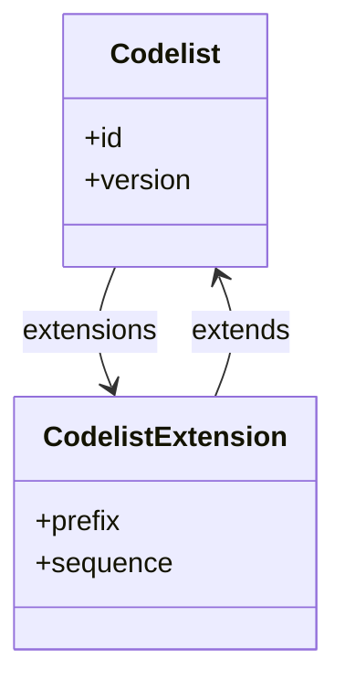
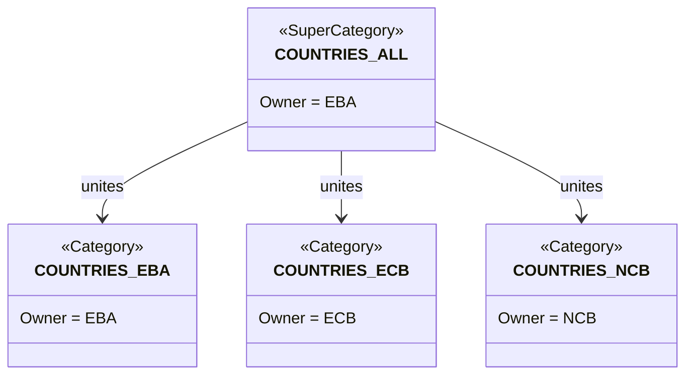

# 2. Extensibility patterns

This chapter documents how SDMX and DPM support extensibility—adding new content, extending value domains, and evolving structures—while maintaining interoperability and compatibility.

## 2.1 Value domain extension

### SDMX: Extended Codelists

SDMX provides **Codelist extension** as a first-class mechanism:

- **Additive extension**: Add codes from another Codelist (e.g. add partner-specific codes to a base Codelist).
- **Restrictive extension**: Select a subset of codes (InclusiveCodeSelection / ExclusiveCodeSelection).
- **Prefix handling**: Avoid code conflicts via prefix assignment.
- **Sequence ordering**: Resolve conflicts when multiple Codelists are merged.



**Example**: An Extended Codelist `CL_COUNTRY_EXTENDED` that:
1. Extends `CL_ISO_COUNTRY` (base ISO codes)
2. Adds codes from `CL_INTERNAL_CODES` with prefix `INT_`
3. Excludes deprecated codes via ExclusiveCodeSelection

### DPM: SubCategories and SuperCategories

DPM uses different mechanisms:

- **SubCategory**: Defines a subset of Items from a Category. Used for restrictions, not additions.
- **SuperCategory**: Unites multiple Categories into a single value domain. Used for merging, not extending.
- **New Items**: Adding values to a Category is done by creating new Items with appropriate `startRelease`.

| Pattern | SDMX mechanism | DPM mechanism |
|---------|---------------|---------------|
| Restrict to subset | Extended Codelist (exclusive) | SubCategory |
| Add new codes | Extended Codelist (additive) or new Codelist version | New Items with startRelease |
| Merge value domains | Extended Codelist (multiple sources) | SuperCategory |
| Partner-specific codes | Extended Codelist with prefix | Separate Category or Items with ownership metadata |

### Extensibility gap

**SDMX → DPM**: Extended Codelists with additive semantics do not map cleanly. Options:
1. Flatten into a single Category with all Items.
2. Create a SuperCategory if sources are distinct Categories.
3. Track the extension relationship in metadata.

**DPM → SDMX**: SubCategories map to restrictive Extended Codelists. SuperCategories map to additive Extended Codelists.

## 2.2 Structural extension

### SDMX: Adding components

DSDs can evolve by adding:
- **Dimensions**: Requires new DSD version (unless `evolvingStructure = true`).
- **Attributes**: Can often be added with minor version change.
- **Measures**: Requires new DSD version.

The `evolvingStructure` flag allows dimension additions without breaking compatibility—existing data remains valid; new data uses the extended structure.

### DPM: Adding Variables

ModuleVersions can include new Variables:
- **FactVariables**: New measures require new ModuleVersion.
- **KeyVariables**: New identifiers require new ModuleVersion.
- **AttributeVariables**: New metadata requires new ModuleVersion.

Tables can gain new cells by creating a new TableVersion.

### Compatibility considerations

| Change type | SDMX approach | DPM approach | Compatibility |
|-------------|--------------|--------------|---------------|
| Add optional attribute | Minor version | New ModuleVersion | Backward compatible |
| Add required dimension | Major version (or evolvingStructure) | New ModuleVersion + new TableVersion | Breaking for existing data |
| Add new measure | Major version | New FactVariable in new ModuleVersion | Additive |
| Rename component | Major version | New Variable (deprecate old via Deactivation) | Breaking |
| Remove component | Major version | Deactivation | Breaking |

## 2.3 Forward and backward compatibility

### Definitions

- **Backward compatible**: Old data/structures work with new definitions.
- **Forward compatible**: New data/structures work with old definitions.

### SDMX compatibility model

SDMX structures are generally **not forward compatible**—old software cannot process data using newer structure versions. Backward compatibility depends on change type:

| Change | Backward compatible? |
|--------|---------------------|
| Add optional attribute | Yes |
| Add dimension (evolvingStructure) | Partial (old data valid, may lack new dimension) |
| Add dimension (normal) | No (old data invalid against new DSD) |
| Add codes to Codelist | Yes (old data still valid) |
| Remove codes from Codelist | No (old data may use removed codes) |

### DPM compatibility model

DPM's release-based model provides a different compatibility story:

- **ModuleVersions are snapshots**: Each ModuleVersion is self-contained. Old ModuleVersions remain valid; new ones are independent.
- **Glossary changes affect future**: Adding an Item (with startRelease) affects only Releases from that point forward.
- **Deactivation preserves history**: Removed artefacts remain for historical data; only new reporting excludes them.

| Change | Backward compatible? | Forward compatible? |
|--------|---------------------|---------------------|
| New ModuleVersion | Yes (old versions unchanged) | No (new features unavailable) |
| Add Item to Category | Yes (old data unaffected) | No (old modules don't see new Item) |
| Deactivate Item | Yes (historical data preserved) | N/A |
| New TableVersion | Yes (old version remains) | No |

### Practical implications

1. **SDMX consumers** must be prepared to handle multiple DSD versions in circulation.
2. **DPM consumers** work with specific Releases; each Release is a consistent snapshot.
3. **Transformation tools** must track which version/release is being converted to ensure consistency.

## 2.4 Extension patterns for interoperability

### Pattern 1: Parallel extension

When both SDMX and DPM structures need the same extension:

1. Add codes to SDMX Codelist (new version or Extended Codelist).
2. Add Items to DPM Category (with startRelease).
3. Update mappings to include new codes/Items.
4. Publish aligned versions/releases.

**Key**: Coordinate timing so both communities receive the extension simultaneously.

### Pattern 2: Local extension with mapping

When one community extends independently:

1. Community A adds local codes/Items.
2. Mapping rules are updated to handle local extensions.
3. Community B may map to "other" or ignore unknown codes.

**Key**: Define conventions for handling unmapped values (reject, map to catch-all, pass through).

### Pattern 3: Optional vs required additions

| Addition type | SDMX handling | DPM handling |
|---------------|--------------|--------------|
| Optional new field | DataAttribute with usage=optional | AttributeVariable (nullable) |
| Required new field | DataAttribute with usage=mandatory (breaking) | FactVariable (requires new Table cells) |
| Optional new code | Add to Codelist; no constraint change | Add Item; SubCategory unchanged |
| Required new code | Add to Codelist + update constraint | Add Item + update SubCategory |

### Pattern 4: Deprecation without removal

To phase out content without breaking existing data:

**SDMX**:
1. Mark code as deprecated (via Annotation).
2. Exclude from constraints for new data.
3. Keep in Codelist for historical validation.

**DPM**:
1. Set `endRelease` on ItemCategory.
2. Item remains for historical reference.
3. New SubCategories exclude the Item.

## 2.5 Identifier alignment

### The challenge

SDMX, DPM, and XBRL each have identifier conventions:

| Aspect | SDMX | DPM | XBRL |
|--------|------|-----|------|
| Code format | Alphanumeric, agency conventions | Alphanumeric, owner conventions | NCName (XML rules) |
| Version in ID | Separate attribute | Separate versionCode | In namespace or linkbase version |
| Case sensitivity | Case-sensitive | Case-sensitive | Case-sensitive |
| Special characters | Limited (typically A-Z, 0-9, _) | Limited | NCName restrictions |

### Alignment recommendations

1. **Use compatible identifiers**: Restrict to characters valid in all three: `[A-Za-z0-9_]`, starting with a letter.
2. **Avoid version in ID**: Keep version separate from identifier.
3. **Establish prefix conventions**: Use prefixes to indicate source system if needed.
4. **Document mappings**: When IDs cannot align, maintain explicit mapping tables.

### Example naming convention

```
SDMX:  CL_COUNTRY (Codelist)     → Code: ES
DPM:   COUNTRY (Category)        → Item: ES
XBRL:  CountryDimension          → Member: ES

Convention: Lowercase prefix + domain name
- SDMX: CL_ prefix for Codelists
- DPM: No prefix for Categories
- XBRL: PascalCase with Dimension/Member suffix
```

## 2.6 Change management recommendations

1. **Coordinate releases**: Align SDMX version publications with DPM Releases when structures are shared.

2. **Semantic versioning**: Use major.minor.patch to signal change impact:
   - Major: Breaking changes (new required dimensions, removed codes)
   - Minor: Backward-compatible additions (new optional attributes, new codes)
   - Patch: Corrections (label fixes, description updates)

3. **Deprecation period**: Allow time between deprecation announcement and removal.

4. **Change documentation**: Publish change logs describing what changed between versions/releases.

5. **Validation tolerance**: Consider validating against both old and new versions during transition periods.

## 2.7 Ownership rules

Ownership governs **who can extend what** in each model. The Organisation/Agency mapping that grounds ownership lives in [§3.1 of the detailed mapping rules](03_detailed_mapping_rules.md#31-agency-organisation-role-owner). This section documents the extension boundaries that derive from ownership.

### 2.7.1 SDMX ownership rules

- **Codelist extension across agencies.** An organisation may not add Codes directly to a Codelist owned by another agency. The mechanism is **CodelistExtension** (§2.1) — a separate maintainable artefact owned by the extending agency that pulls in codes from the base Codelist (with prefix handling to avoid collisions) and adds new codes under its own ownership.
- **Cross-ownership references.** A DSD owned by agency A may reference a Codelist owned by agency B without ownership transfer; the referencing artefact does not modify the referenced artefact.
- **Versioning by owner.** Each maintainable artefact's version is owned by its agency. Two agencies cannot publish overlapping versions of the same artefact identity (`agencyID:id`).
- **CategoryScheme.** Codes (Items) within a Category cannot have a different owner from the CategoryScheme as far as SDMX 3.x is concerned; the closest mechanism for shared classification is to model the Items in separate Codelists owned by their respective agencies and unite them via Categorisations or Hierarchies.

### 2.7.2 DPM ownership rules — confirmed and pending

The following rules are derived from current DPM 2.0 practice. Items marked **(pending DPM Alliance)** are not yet documented in the official metamodel and need confirmation; this work-stream raises them as questions to the Alliance.

| Rule | Status | Source |
|---|---|---|
| An organisation **may not** add Items to a Category owned by another organisation directly. | Confirmed | DPM 2.0 metamodel ownership constraints |
| An organisation **may not** add Tables to a Module owned by another organisation. | Confirmed (meeting 2026-05-04) | Bank of Spain example: cannot add a Table to an EBA Module |
| An organisation **may** create its own Module that references Tables owned by another organisation. | **Pending DPM Alliance** | Discussed but not yet formalised |
| An organisation **may** create its own ReportingTaxonomy/Module that references Dataflows/Tables owned by another organisation. | **Pending DPM Alliance** | Symmetric to the previous row |
| Items in a Category may have a different owner from the Category itself. | **Pending DPM Alliance** | Driven by the multi-owner shared-Category case (§2.8) |
| Releases owned by different organisations interact with the release-based change log. | **Open issue** | Releases have an owner; multi-owner releases need rules |

The pending items are tracked for upcoming DPM Alliance sessions; see [§2.8](#28-multi-owner-items-in-shared-category) for the use case driving them.

### 2.7.3 Cross-model implications

When Codes/Items are owned by different organisations:

- **SDMX → DPM**: a Codelist `B:CL_X` referenced by a DSD `A:DSD_Y` produces a Category in DPM owned by Organisation `B` (mapped from agency `B`); Category and Items inherit ownership from their source. The referencing DPM Module is owned by Organisation `A`; the cross-ownership reference works because Module references Items, it does not contain them.
- **DPM → SDMX**: a Module owned by `A` referencing a Category owned by `B` produces SDMX where the Codelist (mapped from the Category) is owned by `B` and the DSD/ReportingTaxonomy (mapped from the Module) is owned by `A`.
- **Shared Items in Category** (the [§2.8](#28-multi-owner-items-in-shared-category) case): when items have different owners than the Category, SDMX's flat ownership-per-Codelist creates ambiguity that requires a structural workaround (sub-Codelists per owner unioned via Extended Codelist or SuperCategory).

## 2.8 Multi-owner Items in shared Category

This section addresses the use case Angelo highlighted in the meeting on 2026-05-04: a Category that all three of EBA / ECB / a national CB can contribute Items to, with each contributor retaining ownership of its own Items. The pattern recurs in supervisory data (EBA + ECB + NCB) and in IRF (national authorities adding country-specific extensions to a common framework).

### 2.8.1 Setup

- Logical category: `COUNTRIES` (or any country-specific value domain).
- Owners: EBA (the most general), ECB (euro-area scope), an NCB (national scope).
- Each owner adds Items under its own naming and lifecycle, but reporters must see them as one coherent Category.

### 2.8.2 Recommended pattern (DPM side)

1. **Three sub-Categories**, one per owner:
    - `COUNTRIES_EBA` owned by EBA — global / EU-wide country items.
    - `COUNTRIES_ECB` owned by ECB — euro-area-specific items not in the EBA list.
    - `COUNTRIES_<NCB>` owned by the national CB — country-specific items relevant only nationally.
2. **One SuperCategory** `COUNTRIES_ALL` owned by EBA (the most general owner) that unites the three sub-Categories. Membership in the SuperCategory is the "in-scope" signal for any Module that needs the full union.
3. Items remain owned by their contributing organisation. The SuperCategory does not own the Items; it just unites the Categories.
4. SubCategories of `COUNTRIES_ALL` (e.g. "EU member states", "Reporting countries") can be defined by any owner who has a legitimate use case; the SubCategory is owned by its definer, not by the SuperCategory's owner.



### 2.8.3 Recommended pattern (SDMX side)

1. **Three Codelists**, one per owner: `EBA:CL_COUNTRIES_EBA`, `ECB:CL_COUNTRIES_ECB`, `<NCB>:CL_COUNTRIES_<NCB>`.
2. **One Extended Codelist** `EBA:CL_COUNTRIES_ALL` that pulls in codes from the three source Codelists with `CodelistExtension` entries (per [§2.1](#21-value-domain-extension)). Use prefix handling to avoid code collisions where they exist (rare for country codes if everyone respects ISO).
3. The DSD that requires the unified domain references `EBA:CL_COUNTRIES_ALL`.

The mapping from §2.8.2 to §2.8.3 follows the standard rules:
- DPM SuperCategory ↔ SDMX Extended Codelist (additive).
- DPM SubCategory of a Category ↔ SDMX Extended Codelist (restrictive, on its parent Codelist).

### 2.8.4 Open issues for DPM Alliance / EBA

These questions surfaced in the 2026-05-04 meeting and need to be resolved before the multi-owner pattern can be specified normatively.

| Issue | Why it matters |
|---|---|
| Can Items be owned by an organisation other than the Category's owner? | If yes, the three sub-Categories pattern can collapse into one Category with multi-owner Items. If no, the sub-Category pattern is the only option. |
| How do Releases interact when contributing organisations have different release calendars? | The release-based change log assumes release ownership at the Category level. Multi-owner Items in different release calendars need clear rules for which release "applies" when querying applicability. |
| Code-uniqueness rules across multi-owner Items. | Without prefix conventions or registered authority, two contributors could mint the same code for different concepts. |
| Naming-collision resolution. | When SuperCategory unites Items with potentially overlapping codes, what is the canonical resolution rule (first-registered wins, owner-prefix, error)? |
| Ownership of derived artefacts (SuperCategory, SubCategory of SuperCategory). | The natural rule is "most general owner" but this needs to be explicit. |

These are flagged as open questions in this work-stream's documentation; they are **not** decided rules. Implementations should default to the conservative pattern (three sub-Categories with explicit owners, plus a SuperCategory) until the Alliance confirms a more permissive option.

### 2.8.5 Cross-references

- The deduplication of glossary content across ModuleVersions in this multi-owner setting interacts with the **virtual versions** algorithm in [§3.7](03_detailed_mapping_rules.md#37-virtual-versions-for-glossary-artefacts). When sub-Categories from different owners are bundled in a single ModuleVersion, the virtual-version snapshot must include all three contributors' Items.
- The Brexit example in [§3.7.5](03_detailed_mapping_rules.md#375-worked-example--brexit) is single-owner (EBA owns the Category and the changing Item). The multi-owner case adds a layer where each contributor's Item lifecycle is independent.
- Categorisation lossy round-trip (cross-link to [§02 §3.4.4](../02_data_definition/03_detailed_mapping_rules.md#344-categorisation-implicit-in-module-membership)) compounds in multi-owner scenarios because the original SDMX Categorisation `id` and `version` may belong to a different agency than the receiving Module.
