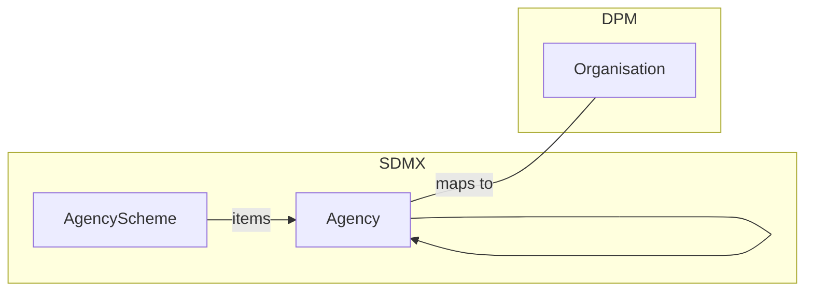
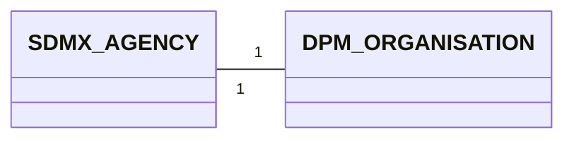
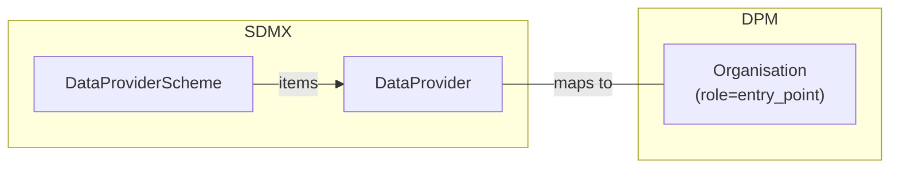
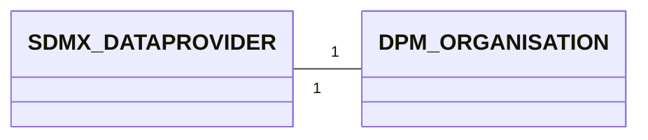
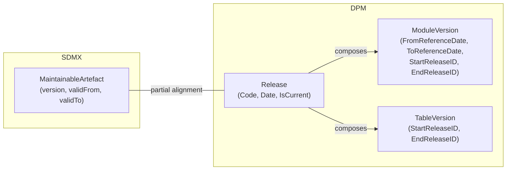
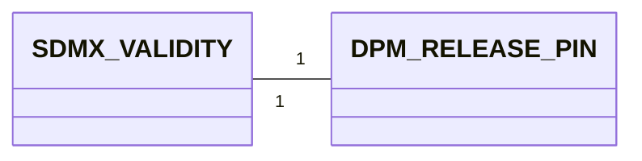
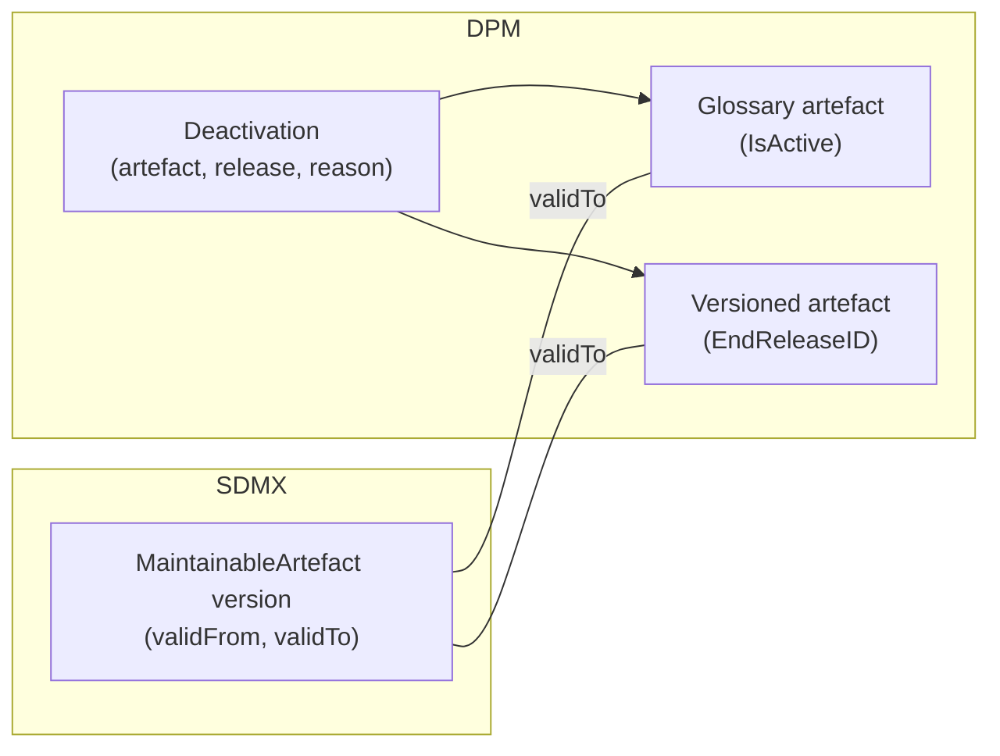
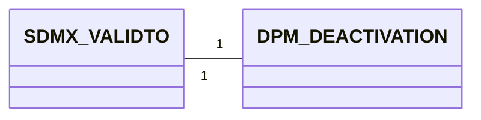

# 3. Detailed mapping rules

This chapter provides the artefact-level mapping rules for the cross-cutting foundations of versioning and extensibility:

- **Organisations and ownership** (§3.1–§3.3) — who maintains, supplies, consumes; the identity layer that every other artefact depends on. Ownership is the foundation for extensibility because it determines who can publish, extend, or supersede a model.
- **Lifecycle** (§3.4 Release, §3.5 Deactivation) — how published artefacts evolve across publication milestones and how soft-delete is expressed.
- **Generic extension mechanism** (§3.6 Annotation) — the canonical SDMX→DPM round-trip pattern, including the registry of recognised marker types used throughout these guidelines.

> - **Prerequisites**:
>     - General identification and multilingual rules from [Basics — Detailed Mapping Rules](../00_basics/02_detailed_mapping_rules.md).
>     - The conceptual treatment of versioning and Releases lives in chapter 1 of this same section: [Versioning overview](01_versioning_overview.md). The detailed rules here are the artefact-level companion.
>     - The extensibility patterns (Codelist extensions, structural extension, compatibility) live in chapter 2: [Extensibility patterns](02_extensibility_patterns.md).
> - **Scope**: real cross-model correspondences only. Artefacts without a counterpart in the other model (ProvisionAgreement, Process, TableGroup, Framework) are documented in [§05 Gaps](../05_gaps/02_specific_gap_analysis.md). The deployable bundle (ReportingTaxonomy / ReportingCategory ↔ Module / ModuleVersion, including Categorisation and ReportingTaxonomyMap) lives in [§02 §3.4](../02_data_definition/03_detailed_mapping_rules.md#34-reporting-bundle-reportingtaxonomy-reportingcategory-moduleversion).

## 3.1 Agency ↔ Organisation (role = owner)

In SDMX, every MaintainableArtefact references a maintaining **Agency**. Agencies are organised in **AgencyScheme**s and may be hierarchical (an Agency can contain child Agencies — e.g. `SDMX.ECB` containing `SDMX.ECB.DG-S`).

In DPM, every Concept inherits an **Owner Organisation** (4.1.2 of the DPM metamodel). Organisations are flat (no scheme container, no hierarchy) and are differentiated by `OrganisationRole`. The Owner role corresponds to the SDMX maintaining Agency.



**Example Agency**

```xml
<AgencyScheme agencyID="SDMX" id="AGENCIES" version="1.0" isPartial="false">
  <Name xml:lang="en">SDMX agencies</Name>
  <Agency id="EBA">
    <Name xml:lang="en">European Banking Authority</Name>
    <Contact>
      <Name xml:lang="en">EBA Reporting</Name>
      <URI>https://www.eba.europa.eu/</URI>
    </Contact>
  </Agency>
</AgencyScheme>
```

**Example Organisation**

| OrganisationID | Name                          | Acronym | IDPrefix | Role  | URI                          |
| -------------- | ----------------------------- | ------- | -------- | ----- | ---------------------------- |
| 1              | European Banking Authority    | EBA     | 100      | owner | https://www.eba.europa.eu/   |

### 3.1.1 Mapping cardinality



- From SDMX to DPM: One Agency maps to one Organisation with `Role = owner`. The containing AgencyScheme has no DPM counterpart and is not materialised.
- From DPM to SDMX: One Organisation with `Role = owner` maps to one Agency, contained in the AgencyScheme owned by the *maintaining Agency* of the destination repository (typically `SDMX:AGENCIES`).
- **Hierarchical Agencies**: SDMX `Agency.parent` (child Agency relationship) flattens to DPM. Each Agency in the hierarchy becomes a separate Organisation; the parent relationship is lost (or preserved via the `Acronym` naming convention — see §3.1.2.3).

### 3.1.2 Attributes equivalence

#### 3.1.2.1 SDMX Agency attributes
- itemScheme `Agency` attributes (see [Identification mapping rules](../00_basics/02_detailed_mapping_rules.md#22-identification-dpm-ids-vs-sdmx-urns))
    - `id`
    - `urn`
- `Name` (multilingual)
- `Description` (multilingual)
- `Contact` (one or more)
    - `Name`
    - `Department`
    - `Role`
    - `URI`, `Email`, `Telephone`, `Fax`, `X400`

#### 3.1.2.2 DPM Organisation attributes
- `OrganisationID` (system-generated PK)
- `Name`
- `Acronym`
- `IDPrefix`
- `Role` (`owner` | `publisher` | `entry_point` | `responsible`)
- `URI`

#### 3.1.2.3 Mapping details

| SDMX Agency               | DPM Organisation             | Notes                                                                                                                                |
|---------------------------|------------------------------|--------------------------------------------------------------------------------------------------------------------------------------|
| `id`                      | `Acronym`                    | The Agency `id` is short and stable — it maps to the DPM `Acronym`. Examples: `EBA`, `ECB`, `EIOPA`.                                |
| `Name` (multilingual)     | `Name` (translated)          | Multilingual rules per [§00_basics §2.3](../00_basics/02_detailed_mapping_rules.md#23-multilingual-support-internationalstring-vs-translations). |
| `Contact.URI`             | `URI`                        | The first `Contact.URI` is taken; remaining contact details are not mapped (no DPM slot).                                           |
| `Contact.Name`, `Email`, …| — (not mapped)               | DPM has no contact‑detail slot. Optional preservation via Annotation (see §3.6).                                                    |
| AgencyScheme membership   | — (no equivalent)            | DPM Organisations are not grouped into schemes.                                                                                     |
| `Agency.parent`           | — (no equivalent)            | Hierarchy is flattened. Optionally encode in `Acronym` using a dotted convention (e.g. `ECB.DG-S`).                                |
| — (not applicable)        | `IDPrefix`                   | DPM-specific: 3-digit prefix used in primary keys (4.1.2 of the DPM metamodel). When ingesting SDMX, allocate a new prefix.         |
| — (not applicable)        | `Role = owner`               | Fixed on the SDMX→DPM path: the Agency expresses ownership.                                                                          |

> **Note — `IDPrefix` allocation (SDMX → DPM)**: The DPM `IDPrefix` is a 3-digit value that disambiguates primary keys across organisations when models from different owners are merged (see §4.1.2 of the DPM metamodel). It does not exist in SDMX and must be allocated locally when an SDMX Agency is first ingested. The allocation is implementation-specific (free pool, registry, etc.) and is not part of the mapping itself.

> **Note — Hierarchy preservation**: The "flattened" rule loses parent links. When round-tripping SDMX→DPM→SDMX, the original parent can be preserved on the DPM side using a `DPM_AGENCY_PARENT` annotation (see §3.6). This is optional and recommended only when fidelity matters.

### 3.1.3 Example Mapping SDMX ==> DPM

Starting from the SDMX side:

```xml
<AgencyScheme agencyID="SDMX" id="AGENCIES" version="1.0" isPartial="false">
  <Name xml:lang="en">SDMX agencies</Name>
  <Agency id="EBA">
    <Name xml:lang="en">European Banking Authority</Name>
    <Contact>
      <URI>https://www.eba.europa.eu/</URI>
    </Contact>
  </Agency>
  <Agency id="ECB">
    <Name xml:lang="en">European Central Bank</Name>
    <Contact>
      <URI>https://www.ecb.europa.eu/</URI>
    </Contact>
  </Agency>
</AgencyScheme>
```

The mapping produces one DPM Organisation per Agency (the AgencyScheme itself is not materialised):

| OrganisationID | Name                          | Acronym | IDPrefix | Role  | URI                          |
| -------------- | ----------------------------- | ------- | -------- | ----- | ---------------------------- |
| 1              | European Banking Authority    | EBA     | 100      | owner | https://www.eba.europa.eu/   |
| 2              | European Central Bank         | ECB     | 200      | owner | https://www.ecb.europa.eu/   |

- `Acronym` ← Agency `id`.
- `Name` ← Agency `Name` (localised translations stored in the Translation table per [§00_basics §2.3](../00_basics/02_detailed_mapping_rules.md#23-multilingual-support-internationalstring-vs-translations)).
- `URI` ← first Agency `Contact.URI`.
- `IDPrefix` allocated locally (`100`, `200`).
- `Role = owner` because Agency expresses maintainership.

### 3.1.4 Example Mapping DPM ==> SDMX

Starting from the DPM side:

| OrganisationID | Name                          | Acronym | IDPrefix | Role  | URI                          |
| -------------- | ----------------------------- | ------- | -------- | ----- | ---------------------------- |
| 1              | European Banking Authority    | EBA     | 100      | owner | https://www.eba.europa.eu/   |

The mapping produces one SDMX Agency embedded in the destination repository's AgencyScheme:

```xml
<AgencyScheme agencyID="SDMX" id="AGENCIES" version="1.0" isPartial="false">
  <Agency id="EBA">
    <Name xml:lang="en">European Banking Authority</Name>
    <Contact>
      <URI>https://www.eba.europa.eu/</URI>
    </Contact>
  </Agency>
</AgencyScheme>
```

- The Agency is added to the maintaining repository's `AGENCIES` scheme. Choosing the maintainer of that scheme is an integration decision, not a mapping decision.
- DPM `IDPrefix` is **not** emitted as an SDMX attribute. If round-trip preservation is required, attach it as a `DPM_ID_PREFIX` annotation on the Agency.

### 3.1.5 AgencyScheme handling

SDMX AgencyScheme has no DPM container counterpart. Concretely:

- **SDMX → DPM**: iterate over the Agencies of the scheme; emit one Organisation per Agency. The scheme `id`, `agencyID`, and `version` are not preserved by default.
- **DPM → SDMX**: collect all Organisations with `Role = owner` and emit them as Agencies under a single AgencyScheme. By convention, the destination scheme is the maintaining repository's `AGENCIES` (e.g. `SDMX:AGENCIES`); a different choice is possible only for self-contained, self-maintained repositories.

> **Round-trip note**: If multiple SDMX AgencySchemes coexist in the source repository (e.g. one per regulator), the SDMX → DPM step loses the partition. Preservation is possible via a `DPM_AGENCY_SCHEME` annotation on the Organisation, mapped back on the reverse path. This is optional.

## 3.2 DataProvider ↔ Organisation (role = entry_point)

In SDMX, **DataProvider** is an Organisation that supplies data. DataProviders sit in **DataProviderScheme**s and are referenced by **ProvisionAgreement**s that bind a provider to a Dataflow (and optionally a Datasource).

In DPM, the same concept is carried by `Organisation` with `Role = entry_point`. DPM does not model the agreement itself (see [§05 §2.6](../05_gaps/02_specific_gap_analysis.md#26-provisionagreement-datasource-sdmx-feature-without-dpm-equivalent) — ProvisionAgreement is external to DPM); it only models the entity that submits the data.



**Example DataProvider**

```xml
<DataProviderScheme agencyID="ECB" id="DATA_PROVIDERS" version="1.0" isPartial="false">
  <Name xml:lang="en">ECB Data Providers</Name>
  <DataProvider id="BDE">
    <Name xml:lang="en">Banco de España</Name>
    <Contact>
      <URI>https://www.bde.es/</URI>
    </Contact>
  </DataProvider>
</DataProviderScheme>
```

**Example Organisation**

| OrganisationID | Name                          | Acronym | IDPrefix | Role        | URI                       |
| -------------- | ----------------------------- | ------- | -------- | ----------- | ------------------------- |
| 11             | Banco de España               | BDE     | 110      | entry_point | https://www.bde.es/       |

### 3.2.1 Mapping cardinality



- From SDMX to DPM: One DataProvider maps to one Organisation with `Role = entry_point`. The DataProviderScheme has no DPM counterpart.
- From DPM to SDMX: One Organisation with `Role = entry_point` maps to one DataProvider, contained in a DataProviderScheme owned by the relevant Agency (typically the same Agency that owns the Frameworks the provider reports against).
- **Multi-role organisations**: An entity that is both a maintainer and a data provider appears once in DPM with multiple `Role` rows (or as multiple Organisation records, depending on the implementation), and twice in SDMX (once as Agency, once as DataProvider) with the same `id`.

### 3.2.2 Attributes equivalence

#### 3.2.2.1 SDMX DataProvider attributes
- itemScheme `DataProvider` attributes
    - `id`
    - `urn`
- `Name` (multilingual)
- `Description` (multilingual)
- `Contact` (one or more)

#### 3.2.2.2 DPM Organisation attributes
Same structural attributes as in §3.1.2.2; the differentiating field is `Role`.

#### 3.2.2.3 Mapping details

| SDMX DataProvider                | DPM Organisation                  | Notes                                                                                                                |
|----------------------------------|-----------------------------------|----------------------------------------------------------------------------------------------------------------------|
| `id`                             | `Acronym`                         | Same convention as Agency.                                                                                           |
| `Name` (multilingual)            | `Name` (translated)               | Multilingual rules per [§00_basics §2.3](../00_basics/02_detailed_mapping_rules.md#23-multilingual-support-internationalstring-vs-translations).             |
| `Contact.URI`                    | `URI`                             | First `Contact.URI`.                                                                                                 |
| DataProviderScheme membership    | — (no equivalent)                 |                                                                                                                      |
| ProvisionAgreement reference     | — (external to DPM)               | The agreement itself does not map; see [§05 §2.6](../05_gaps/02_specific_gap_analysis.md#26-provisionagreement-datasource-sdmx-feature-without-dpm-equivalent). |
| — (not applicable)               | `Role = entry_point`              | Fixed on the SDMX→DPM path.                                                                                          |

### 3.2.3 Example Mapping SDMX ==> DPM

Starting from:

```xml
<DataProviderScheme agencyID="ECB" id="DATA_PROVIDERS" version="1.0" isPartial="false">
  <DataProvider id="BDE">
    <Name xml:lang="en">Banco de España</Name>
    <Contact>
      <URI>https://www.bde.es/</URI>
    </Contact>
  </DataProvider>
  <DataProvider id="BDF">
    <Name xml:lang="en">Banque de France</Name>
  </DataProvider>
</DataProviderScheme>
```

The mapping produces:

| OrganisationID | Name                | Acronym | IDPrefix | Role        | URI                  |
| -------------- | ------------------- | ------- | -------- | ----------- | -------------------- |
| 11             | Banco de España     | BDE     | 110      | entry_point | https://www.bde.es/  |
| 12             | Banque de France    | BDF     | 120      | entry_point | NULL                 |

### 3.2.4 Example Mapping DPM ==> SDMX

| OrganisationID | Name                | Acronym | IDPrefix | Role        | URI                  |
| -------------- | ------------------- | ------- | -------- | ----------- | -------------------- |
| 11             | Banco de España     | BDE     | 110      | entry_point | https://www.bde.es/  |

```xml
<DataProviderScheme agencyID="ECB" id="DATA_PROVIDERS" version="1.0" isPartial="false">
  <DataProvider id="BDE">
    <Name xml:lang="en">Banco de España</Name>
    <Contact>
      <URI>https://www.bde.es/</URI>
    </Contact>
  </DataProvider>
</DataProviderScheme>
```

- The choice of containing scheme (`ECB:DATA_PROVIDERS` vs another) depends on which Agency owns the reporting framework against which this provider submits. There is no DPM field that disambiguates this — it is an integration convention.

### 3.2.5 DataConsumer / OrganisationUnit — recommended handling

SDMX defines **DataConsumerScheme / DataConsumer** (organisations that receive data) and **OrganisationUnitScheme / OrganisationUnit** (a generic catch-all). DPM does not have dedicated roles for these.

| SDMX                  | DPM                                                                                          |
|-----------------------|----------------------------------------------------------------------------------------------|
| DataConsumer          | Organisation with `Role = responsible` *if* the data consumption role is meaningful in the reporting context. Otherwise, omit. |
| OrganisationUnit      | Organisation with no specific `Role` *if* a relationship to the DPM model is asserted. Otherwise, omit. |
| DataConsumerScheme    | — (no DPM equivalent)                                                                        |
| OrganisationUnitScheme| — (no DPM equivalent)                                                                        |

**Recommendation**: only ingest DataConsumer / OrganisationUnit when there is a documented mapping decision on the DPM side (e.g. a regulator that issues guidance but does not own the framework). Otherwise, leave them out of the DPM model and preserve them via SDMX-side annotation if round-trip fidelity is required.

## 3.3 OrganisationSchemeMap

SDMX **OrganisationSchemeMap** maps Organisations between schemes — typically when an Agency is renamed or absorbed across an SDMX repository:

```xml
<OrganisationSchemeMap agencyID="SDMX" id="MAP_RENAME" version="1.0">
  <Source><Ref agencyID="SDMX" id="AGENCIES" version="1.0"/></Source>
  <Target><Ref agencyID="SDMX" id="AGENCIES" version="2.0"/></Target>
  <OrganisationMap>
    <Source>OLD_NAME</Source>
    <Target>NEW_NAME</Target>
  </OrganisationMap>
</OrganisationSchemeMap>
```

In DPM, an Organisation rename is recorded directly on the Organisation row (`Acronym` change), with a `version_fix` ConceptRelation linking the old and new Concept identities if the implementation tracks pre-rename history.

| Direction       | Recipe                                                                                                                                          |
|-----------------|-------------------------------------------------------------------------------------------------------------------------------------------------|
| SDMX → DPM      | Apply each OrganisationMap as a rename: update the matching `Organisation.Acronym` (and `Name` if the source carries a new label). Record a ConceptRelation of type `version_fix` between the old and new Concept GUIDs to preserve the rename trail. |
| DPM → SDMX      | Emit an OrganisationSchemeMap when there is a documented Organisation rename between two snapshots of the export. The map is informational — the rename is also implicit in the new `Acronym`. |

> **No Categorisation implication**: an Organisation rename does **not** trigger any Categorisation change in either direction. The Framework owner is identified by the (renamed) Organisation; the rest of the model continues to reference it by its primary key.

## 3.4 Release ↔ version validity

SDMX has no dedicated *release* artefact. Each MaintainableArtefact carries its own `version`, optionally with `validFrom` / `validTo` timestamps. A "release" in the SDMX sense is the implicit set of artefact versions a publisher considers current at a given point in time.

DPM treats releases as first-class. **Release** (4.2.1 of the DPM metamodel) is a publication milestone that bundles a set of versioned artefacts (ModuleVersion, TableVersion, HeaderVersion, VariableVersion, …) and carries:

- `Code` — the release identifier (e.g. `2024-Q2`),
- `Date` — when the release is published (i.e. the publication event),
- `IsCurrent` — flag marking the most recent published Release.

Versioned artefacts reference Release through `StartReleaseID` and (optional) `EndReleaseID`, which together define the set of releases in which the version is active.

In addition, ModuleVersion carries `FromReferenceDate` / `ToReferenceDate` (4.2.2) which define when the **reporting obligation** starts/ends. These are independent of the publication date — a Release can be published in March 2024 with a ModuleVersion whose `FromReferenceDate` is 2024-Q2.



> **Cross-reference**: the conceptual treatment of Release semantics (publication vs application date, version validity, two-model summary) is in [§04 §1.3](01_versioning_overview.md#13-releases-and-temporal-alignment). This section is the artefact-level mapping companion.

### 3.4.1 Mapping cardinality



- From SDMX to DPM: there is no direct artefact pair. The mapping rule is to **infer** a Release from `validFrom` clusters in the source repository: artefacts whose `validFrom` falls within a small time window are assumed to belong to the same release. This is heuristic and should be supervised. The recommended path on SDMX → DPM is to *receive* an explicit release identifier from the source as part of the ingestion contract; if the source is silent, generate one Release per import batch with `Code` = batch timestamp.
- From DPM to SDMX: each Release becomes a set of `validFrom` (= Release.Date) values applied to the matching MaintainableArtefacts. `validTo` is set when the Release becomes superseded (next Release with `IsCurrent = TRUE` in the same composition chain).

### 3.4.2 Attributes equivalence

#### 3.4.2.1 SDMX validity attributes (per MaintainableArtefact)
- `validFrom` (date)
- `validTo` (date, optional)

#### 3.4.2.2 DPM Release attributes
- `ReleaseID` (system-generated PK)
- `Code`
- `Date`
- `Description`
- `IsCurrent`

#### 3.4.2.3 DPM Release-pinned version attributes (e.g. ModuleVersion)
- `StartReleaseID`
- `EndReleaseID`
- `FromReferenceDate` (ModuleVersion only — application date)
- `ToReferenceDate` (ModuleVersion only)

#### 3.4.2.4 Mapping details

| SDMX                         | DPM                                              | Notes                                                                                                       |
|------------------------------|--------------------------------------------------|-------------------------------------------------------------------------------------------------------------|
| MaintainableArtefact.`validFrom` | Release.`Date` (via `StartReleaseID` lookup)  | All artefacts pinned to the same `StartReleaseID` share one `validFrom`.                                   |
| MaintainableArtefact.`validTo`   | Release.`Date` (via `EndReleaseID` lookup)    | Set when the artefact is superseded.                                                                       |
| ReportingTaxonomy.`validFrom`    | ModuleVersion.`FromReferenceDate`             | When the reporting obligation begins. Distinguished from publication date.                                  |
| — (not applicable)               | Release.`Code`                                | Has no SDMX field. Recommended preservation: `DPM_RELEASE_CODE` annotation on the MaintainableArtefact.    |
| — (not applicable)               | Release.`IsCurrent`                           | SDMX expresses "current" by the absence of `validTo`. The two are equivalent for the latest version only. |
| — (not applicable)               | Release.`Description`                         | Lossy.                                                                                                     |

> **Note — `Date` vs `FromReferenceDate`**: when emitting SDMX from DPM, `validFrom` should be set from `Release.Date` (publication date) — *not* from `FromReferenceDate`. If the application date matters to the SDMX consumer, attach it as a `DPM_FROM_REFERENCE_DATE` annotation on the ReportingTaxonomy. See [§05 Gaps](../05_gaps/01_gaps_overview.md) for the canonical statement of this asymmetry.

### 3.4.3 Example Mapping SDMX ==> DPM

Given a set of SDMX artefacts (Codelists, DSDs, Dataflows, ReportingTaxonomy) all carrying `validFrom="2024-03-15"`, the mapping infers a single Release:

| ReleaseID | Code     | Date       | IsCurrent | Description |
| --------- | -------- | ---------- | --------- | ----------- |
| 5         | 2024-Q2  | 2024-03-15 | TRUE      | EBA reporting framework release for 2024-Q2 |

Each ingested MaintainableArtefact's version row then references `ReleaseID = 5` as its `StartReleaseID`.

If the source provides an explicit release identifier (e.g. via a contract or a `DPM_RELEASE_CODE` annotation), `Code` is set from it; otherwise `Code` is generated from `Date`.

### 3.4.4 Example Mapping DPM ==> SDMX

Given:

| ReleaseID | Code     | Date       | IsCurrent |
| --------- | -------- | ---------- | --------- |
| 5         | 2024-Q2  | 2024-03-15 | TRUE      |

For each MaintainableArtefact whose version row has `StartReleaseID = 5` and `EndReleaseID = NULL`:

```xml
<ReportingTaxonomy agencyID="EBA" id="FINREP_3.2" version="1.0"
                   validFrom="2024-03-15">
  <Annotations>
    <Annotation>
      <AnnotationTitle>DPM Release Code</AnnotationTitle>
      <AnnotationType>DPM_RELEASE_CODE</AnnotationType>
      <AnnotationText xml:lang="en">2024-Q2</AnnotationText>
    </Annotation>
  </Annotations>
  <!-- … -->
</ReportingTaxonomy>
```

When a later Release (e.g. `2024-Q3`) supersedes this version, the same artefact gets `validTo = 2024-06-15` (the `Date` of `2024-Q3`).

## 3.5 Deactivation ↔ version validity (validTo)

DPM **Deactivation** is a soft-delete mechanism: instead of physically removing an artefact, a Deactivation marks it as inactive starting from a specific Release. Deactivated artefacts remain in the database for historical reference and round-tripping but are excluded from new modelling and active reporting.

In SDMX, the equivalent effect is achieved by setting `validTo` on the MaintainableArtefact's version. There is no dedicated artefact; it is a property of the version itself.

DPM uses two distinct mechanisms depending on the artefact:

- For **glossary** artefacts (Category, Item, Property, DataType — 4.2.3 of the metamodel): `IsActive = FALSE` on the artefact itself.
- For **versioned** artefacts (ModuleVersion, TableVersion, HeaderVersion, VariableVersion, OperationVersion): `EndReleaseID` set on the version row (the version is bounded above; subsequent Releases do not include it).

A separate `Deactivation` artefact in some implementations records the *reason* and the triggering Release; if it is not present, the deactivation event is recoverable only from the `EndReleaseID`.



> **Cross-reference**: the conceptual treatment of deprecation patterns (without removal) is in [§04 §2.3 Forward and backward compatibility](02_extensibility_patterns.md#23-forward-and-backward-compatibility) and [§2.4 Pattern 4: Deprecation without removal](02_extensibility_patterns.md#24-extension-patterns-for-interoperability).

### 3.5.1 Mapping cardinality



- From SDMX to DPM: when an incoming version row has `validTo` set, it is mapped to:
    - For glossary artefacts → `IsActive = FALSE` on the corresponding DPM artefact, plus a Deactivation row pinned to the Release inferred from `validTo` (per §3.4).
    - For versioned artefacts → `EndReleaseID` set on the matching DPM version row.
- From DPM to SDMX: when a DPM artefact has `IsActive = FALSE` (glossary) or `EndReleaseID != NULL` (versioned), the matching SDMX MaintainableArtefact version is emitted with `validTo` set to the corresponding Release.Date.

### 3.5.2 Attributes equivalence

#### 3.5.2.1 SDMX MaintainableArtefact attributes
- `validTo` (date)

#### 3.5.2.2 DPM Deactivation attributes (where modelled)
- artefact reference
- `release` (FK to Release)
- `reason` (optional)

Plus the underlying state on the artefact itself: `IsActive` (glossary) or `EndReleaseID` (versioned).

#### 3.5.2.3 Mapping details

| SDMX                         | DPM                                              | Notes                                                                       |
|------------------------------|--------------------------------------------------|-----------------------------------------------------------------------------|
| MaintainableArtefact.`validTo` | `EndReleaseID` (via Release lookup)            | Versioned artefacts.                                                        |
| MaintainableArtefact.`validTo` | `IsActive = FALSE` + Deactivation row          | Glossary artefacts (Category, Item, Property, DataType).                    |
| — (not applicable)             | Deactivation.`reason`                          | No SDMX field. Preserve via `DPM_DEACTIVATION_REASON` annotation.            |
| — (not applicable)             | Distinction glossary vs versioned              | The DPM mechanism depends on the artefact class; SDMX uses one mechanism.   |

### 3.5.3 Example

DPM side (a Table deactivated from Release 6 onwards, with reason):

| TableVID | TableID | Code        | StartReleaseID | EndReleaseID | (Deactivation.reason)            |
| -------- | ------- | ----------- | -------------- | ------------ | -------------------------------- |
| 6101     | 410     | F_05.OLD    | 5              | 6            | "Replaced by F_05.NEW (T_5_NEW)" |

(Where `Release 5 = 2024-Q2 (Date 2024-03-15)` and `Release 6 = 2024-Q3 (Date 2024-06-15)`.)

The mapping emits:

```xml
<Dataflow agencyID="EBA" id="DF_F_05_OLD" version="1.0"
          validFrom="2024-03-15" validTo="2024-06-15">
  <Name xml:lang="en">…</Name>
  <Annotations>
    <Annotation>
      <AnnotationTitle>DPM Deactivation Reason</AnnotationTitle>
      <AnnotationType>DPM_DEACTIVATION_REASON</AnnotationType>
      <AnnotationText xml:lang="en">Replaced by F_05.NEW (T_5_NEW)</AnnotationText>
    </Annotation>
  </Annotations>
  <Structure><Ref agencyID="EBA" id="DSD_F_05_OLD" version="1.0" class="DataStructure"/></Structure>
</Dataflow>
```

> **Note — Deactivation propagation**: deactivating a Category cascades to its Items, SubCategories, and Properties (4.2.4 of the DPM metamodel). The propagation rules are part of the versioning model and are documented in [§04 §1.2](01_versioning_overview.md#12-dpm-versioning-model).

## 3.6 Annotation ↔ description / structured fields

SDMX defines a generic **Annotation** mechanism on every AnnotableArtefact (i.e. almost everything in SDMX). Annotations carry `id`, `title`, `type`, `url`, and multilingual `text`, and are designed as an open extension point for implementation-specific metadata, documentation links, rendering hints, and round-trip preservation.

DPM does not have a generic annotation mechanism. Instead, it offers:

- structured `Description` fields (multilingual `InternationalString`) on most Concepts;
- typed attributes for common metadata (e.g. `Reference` for documentation, `Translation` for multilingual content);
- a small number of recognised round-trip annotation markers, listed below, which the mapping defines as mandatory parts of its surface area.

The mismatch is real: SDMX is more flexible (any key/value), DPM is more structured (named slots). The mapping rule below provides a three-tier recipe to bridge it without losing information.

### 3.6.1 The three-tier mapping rule

| Tier | SDMX annotation                                        | DPM mapping                                                                                                                                                                                          |
|------|--------------------------------------------------------|------------------------------------------------------------------------------------------------------------------------------------------------------------------------------------------------------|
| (a)  | `type` matches a recognised DPM marker                | Mapped to a specific DPM field (table below).                                                                                                                                                        |
| (b)  | Free-form annotation (no recognised `type`)           | Appended to the artefact's `Description` field (multilingual), prefixed by `[<type>]` to allow round-trip extraction.                                                                                |
| (c)  | Implementation-specific annotation (no documented use) | Preserved as-is in a generic extension table (out of scope of these guidelines). Implementations that do not provide such a table must either drop the annotation or move it to tier (b). |

The reverse direction (DPM → SDMX) follows the same table:

- DPM-marker fields (tier a) → emit the matching `Annotation` with the documented `type`.
- DPM `Description` content with a `[<type>]` prefix (tier b) → split off and emit as an Annotation; the remainder stays as `Description`.
- Implementation-specific extensions (tier c) → emit as Annotations on the matching artefact.

### 3.6.2 Recognised DPM markers (tier a) — canonical registry

This table is the canonical registry for the recognised SDMX `AnnotationType` values used in the SDMX–DPM round trip. Sections elsewhere that refer to a specific marker link back here.

| `AnnotationType`                | Attached to                          | DPM target field                                                                                                                                                                              | See                                                                                                                                                                          |
|---------------------------------|--------------------------------------|-----------------------------------------------------------------------------------------------------------------------------------------------------------------------------------------------|------------------------------------------------------------------------------------------------------------------------------------------------------------------------------|
| `DPM_SIGNATURE`                 | SDMX `Code`                          | `Item.Signature`                                                                                                                                                                              | [§00_basics §2.6.1](../00_basics/02_detailed_mapping_rules.md#261-dpm-signature-annotation), [§01_glossary §3.3.2.4](../01_glossary/03_detailed_mapping_rules.md#3324-signature-dpm-business-key) |
| `DPM_DEFAULT_ITEM`              | SDMX `Code`                          | `ItemCategory.IsDefaultItem`                                                                                                                                                                  | [§01_glossary §3.3.2.6](../01_glossary/03_detailed_mapping_rules.md#3326-sdmxdpm-generating-default-items)                                                                     |
| `DPM_COMPOUND_COMPONENTS`       | SDMX `Code`                          | `CompoundItem` decomposition (Property–Item pairs)                                                                                                                                            | [§01_glossary §3.3.6](../01_glossary/03_detailed_mapping_rules.md#336-sdmx-workarounds-for-compound-item-semantics), [§05_gaps §2.4](../05_gaps/02_specific_gap_analysis.md#24-compound-items-sdmx-feature-gap) |
| `DPM_ID_PREFIX`                 | SDMX `Agency`                        | `Organisation.IDPrefix`                                                                                                                                                                       | §3.1 above                                                                                                                                                                   |
| `DPM_AGENCY_PARENT`             | SDMX `Agency`                        | (informational) original parent Agency `id` for hierarchy preservation                                                                                                                        | §3.1 above                                                                                                                                                                   |
| `DPM_AGENCY_SCHEME`             | SDMX `Organisation` (DPM-side hint)  | (informational) the original AgencyScheme membership                                                                                                                                          | §3.1 above                                                                                                                                                                   |
| `DPM_CATEGORISATION_ID`         | SDMX `Categorisation`                | (informational) original Categorisation `id` for round-trip identity                                                                                                                          | [§02 §3.4.4](../02_data_definition/03_detailed_mapping_rules.md#344-categorisation-implicit-in-module-membership)                                                              |
| `DPM_PROVISION_AGREEMENT`       | SDMX `ModuleVersion`-target          | (informational) original ProvisionAgreement URN(s)                                                                                                                                            | [§05 §2.6](../05_gaps/02_specific_gap_analysis.md#26-provisionagreement-datasource-sdmx-feature-without-dpm-equivalent)                                                       |
| `DPM_PROCESS`                   | SDMX `Framework` / `ModuleVersion`   | (informational) original Process URN                                                                                                                                                          | [§05 §2.7](../05_gaps/02_specific_gap_analysis.md#27-process-processstep-sdmx-feature-without-dpm-equivalent)                                                                  |
| `DPM_RELEASE_CODE`              | SDMX MaintainableArtefact            | `Release.Code`                                                                                                                                                                                | §3.4 above                                                                                                                                                                   |
| `DPM_FROM_REFERENCE_DATE`       | SDMX `ReportingTaxonomy`             | `ModuleVersion.FromReferenceDate` (when distinct from `validFrom`)                                                                                                                            | §3.4 above                                                                                                                                                                   |
| `DPM_DEACTIVATION_REASON`       | SDMX MaintainableArtefact            | `Deactivation.reason`                                                                                                                                                                         | §3.5 above                                                                                                                                                                   |
| `DPM_TABLEGROUP`                | SDMX `CategoryScheme` / Categorisation | (informational) standalone TableGroup metadata                                                                                                                                              | [§05 §2.8](../05_gaps/02_specific_gap_analysis.md#28-tablegroup-tableassociation-dpm-feature-without-sdmx-equivalent)                                                          |

> **Note — `id` and `title` of recognised annotations**: `id` should be set to the SDMX-style `<type>_<artefact-id>` pattern; `title` should be a human-readable label (e.g. `"DPM Signature"`). These are conventions, not strict requirements.

### 3.6.3 Free-form annotations (tier b)

When the SDMX source carries an Annotation with a `type` that is not in the recognised list, the mapping appends its content to the matching DPM artefact's `Description`:

```text
<Description>
[<type>] <AnnotationText>
</Description>
```

For example, an annotation:

```xml
<Annotation>
  <AnnotationType>USAGE_NOTE</AnnotationType>
  <AnnotationText xml:lang="en">Use only for trading book exposures.</AnnotationText>
</Annotation>
```

becomes:

```text
[USAGE_NOTE] Use only for trading book exposures.
```

appended to the matching artefact's `Description`. On the reverse path (DPM → SDMX), the prefix is stripped and the content emitted as an Annotation.

> **Multilingual handling**: tier (b) text follows the multilingual rules of [§00_basics §2.3](../00_basics/02_detailed_mapping_rules.md#23-multilingual-support-internationalstring-vs-translations) — one Translation row per language code present on the source Annotation.

### 3.6.4 Examples

#### 3.6.4.1 DPM_SIGNATURE preservation

SDMX → DPM: the annotation populates `Item.Signature` directly:

```xml
<Code id="x6">
  <Annotations>
    <Annotation>
      <AnnotationType>DPM_SIGNATURE</AnnotationType>
      <AnnotationText xml:lang="en">eba_BA:x6</AnnotationText>
    </Annotation>
  </Annotations>
</Code>
```

→ `ItemCategory.Signature = "eba_BA:x6"` (per [§01_glossary §3.3.2.4](../01_glossary/03_detailed_mapping_rules.md#3324-signature-dpm-business-key)).

#### 3.6.4.2 Free-form Annotation passthrough on a ModuleVersion

SDMX:

```xml
<ReportingTaxonomy agencyID="EBA" id="FINREP_3.2" version="1.0">
  <Annotations>
    <Annotation>
      <AnnotationType>RELEASE_NOTES_URL</AnnotationType>
      <AnnotationText xml:lang="en">https://www.eba.europa.eu/finrep-3.2-notes</AnnotationText>
    </Annotation>
  </Annotations>
  <Name xml:lang="en">FINREP reporting taxonomy 3.2</Name>
</ReportingTaxonomy>
```

DPM:

| ModuleVID  | Code | Name                          | Description                                                                |
| ---------- | ---- | ----------------------------- | -------------------------------------------------------------------------- |
| 100300001  | 3.2  | FINREP reporting taxonomy 3.2 | [RELEASE_NOTES_URL] https://www.eba.europa.eu/finrep-3.2-notes             |

On the reverse path, the `[RELEASE_NOTES_URL] …` line is split off the Description and emitted as a `RELEASE_NOTES_URL` Annotation on the ReportingTaxonomy.

> **Tip — Annotation `url` field**: SDMX Annotation has a separate `url` attribute. When the recognised type implies a URL payload, prefer emitting it as `Annotation.url` rather than `Annotation.text`. The mapping implementation should be consistent.

## 3.7 Virtual versions for glossary artefacts

### 3.7.1 The problem

DPM glossary artefacts — Categories (and their Items), SubCategories of Categories, Properties — do not carry an explicit `version` attribute. SDMX requires one: every Codelist, ConceptScheme, and Hierarchy is versioned. Mapping DPM → SDMX therefore needs a way to *materialise* a version for each glossary slice that is exported.

The naive approach — emit one Codelist version per Release — is too coarse. Many Releases include no glossary changes for a given Category; emitting redundant versions clutters the SDMX repository. The opposite naive approach — emit one Codelist with all Items ever recorded, ignoring release windows — loses the temporal semantics that consumers need.

### 3.7.2 Concept: virtual version

A **virtual version** of a glossary artefact is a synthetic version computed by snapshotting the artefact's state at the Release window of a given ModuleVersion.

- The version is *virtual* because it does not exist in the DPM database; it is inferred at export time.
- The version is *anchored to a ModuleVersion* because that is the only artefact with reference-date validity (see [§1.2](01_versioning_overview.md#12-dpm-versioning-model)).
- Two ModuleVersions that produce the same item set yield the **same** virtual version (deduplicated).

This is the recommended approach for SDMX-DPM mapping. It can be implemented today against the existing DPM 2.0 database with no schema changes.

> **Note — alternative under consideration by the DPM Alliance.** The Alliance is discussing adding a BLOB JSON snapshot field to the `ModuleVersion` table that pre-computes the glossary slice for each ModuleVersion. The two approaches converge on the same per-ModuleVersion snapshot semantics; the BLOB approach trades a database change for cheaper consumption-time access, while inference avoids the database change at the cost of computing the snapshot at export time. This work-stream recommends the inference approach as the documented mapping; the BLOB approach can be adopted later as an optimisation if the Alliance accepts it.

### 3.7.3 Algorithm (DPM → SDMX)

For each ModuleVersion `mv` being exported:

1. **Determine the Release window** of `mv`:
    - `mv_start = mv.StartReleaseID` (the Release at which `mv` becomes active in the DPM publication timeline)
    - `mv_end   = mv.EndReleaseID` (or "open" if NULL)

2. **For each Category `C` referenced by `mv`** (via `mv.glossaryRoots` or transitively through Headers/Variables in `mv`'s Tables):
    - Materialise the virtual Category version `C@mv` as the set of Items where:
      ```
      ItemCategory.startRelease ≤ mv_end
      AND (ItemCategory.endRelease IS NULL OR ItemCategory.endRelease > mv_start)
      ```
    - For each included Item, the **code** to use is the `Code` recorded on the latest `ItemCategory` row whose release window overlaps `mv`'s window. (Item codes can change over time; this captures the current-at-`mv` code.)
    - Record the result as one virtual Codelist version.

3. **For each SubCategory `S` referenced by `mv`** (via Headers' `SubCategoryVID` or Variables' SubCategory references):
    - Locate the SubCategory version (`SubCategoryVersion.StartReleaseID` ≤ `mv_end` AND (end is NULL OR > `mv_start`)) — at most one applies.
    - Materialise its included Items in the virtual representation; this becomes a Hierarchy or a constraint cube depending on the SubCategory shape.

4. **For each Property `P` referenced by `mv`**:
    - Properties themselves do not change over time, but their `Code` (when used as an Item under the Property root) can. Apply the same `ItemCategory`-driven snapshot rule as for Categories.

5. **Deduplicate**:
    - Compute a hash of each (Category, item-set, code-mapping) tuple.
    - Two ModuleVersions that produce the same hash share a single virtual version. Assign a stable version code (e.g. derived from the earliest ModuleVersion that materialised this snapshot, or an incrementing counter).

6. **Assign SDMX version codes**:
    - `MAJOR.MINOR.PATCH` derived from the cumulative changes since the previous deduplicated virtual version.
    - When a virtual version diverges from its predecessor in a backwards-compatible way (only additions), bump MINOR; for code renames or removals bump MAJOR; for typo fixes that don't change semantics bump PATCH.

The materialised SDMX artefacts (`Codelist`, `ConceptScheme`, `Hierarchy` versions) reference the virtual version codes; ReportingTaxonomy version emitted for `mv` (per [§02 §3.4.6](../02_data_definition/03_detailed_mapping_rules.md#346-example-mapping-dpm--sdmx)) references the virtual versions of all glossary artefacts in scope.

### 3.7.4 Algorithm (SDMX → DPM)

This direction is simpler: SDMX already has explicit versions, which become inputs to DPM's release-based change log.

For each SDMX Codelist version `v`:

1. Locate or create the corresponding DPM Category `C`.
2. For each Code in `v` that is not yet recorded in `C`:
    - Insert an `ItemCategory` row with `startRelease = R(v)` where `R(v)` is the Release that maps to the SDMX validFrom of `v`.
3. For each Code that was in the previous Codelist version but is absent from `v`:
    - Set the existing `ItemCategory.endRelease = R(v)`.
4. For each Code whose `id` changed (rename) between versions:
    - This requires explicit human/automated decision; record the rename via two `ItemCategory` rows (one closed, one opened) with a ConceptRelation linking them.

No virtual-version step is needed — the SDMX version is the authoritative input.

### 3.7.5 Worked example — Brexit

**Setup:**

- Category `EU_COUNTRIES`, owner EBA.
- Items include `UK` (United Kingdom) with `ItemCategory.startRelease = R_2010Q1`, `endRelease = R_2020Q4` (UK formally left on 2020-12-31).
- ModuleVersion `M v1.0`: `StartReleaseID = R_2018Q1`, `EndReleaseID = R_2020Q4`.
- ModuleVersion `M v2.0`: `StartReleaseID = R_2021Q1`, `EndReleaseID = NULL`.

**Mapping `M v1.0` to SDMX:**
- Apply the virtual version algorithm with `mv_start = R_2018Q1`, `mv_end = R_2020Q4`.
- `UK` qualifies: `startRelease ≤ R_2020Q4` AND `endRelease (R_2020Q4) > R_2018Q1`. ✓
- Virtual Category version includes `UK`. Emit as `CL_EU_COUNTRIES(1.0)`.

**Mapping `M v2.0` to SDMX:**
- `mv_start = R_2021Q1`, `mv_end = NULL`.
- `UK`: `endRelease (R_2020Q4)` is *not* `> mv_start (R_2021Q1)`. Excluded.
- Virtual Category version omits `UK`. Emit as `CL_EU_COUNTRIES(2.0)`.

A consumer reading the FINREP reporting taxonomy for `M v1.0` sees `CL_EU_COUNTRIES(1.0)` (with UK); for `M v2.0` sees `CL_EU_COUNTRIES(2.0)` (without UK). The Brexit change is faithfully represented without ever materialising "version 1.0" or "version 2.0" in the DPM database.

### 3.7.6 Worked example — code change

**Setup:**

- Property `INSTRUMENT_TYPE` with sub-Items in Category `INSTRUMENT_TYPES`.
- Item formerly known as `X1` is renamed to `X10` at Release `R_2024Q1`. The DPM model records this as two `ItemCategory` rows linked by a `ConceptRelation` of type `version_new`:
    - Row A: `Item = X1_old`, `Code = X1`, `startRelease = R_2020Q1`, `endRelease = R_2023Q4`.
    - Row B: `Item = X1_old` (same logical Item — DPM allows the underlying Item to retain its identity), `Code = X10`, `startRelease = R_2024Q1`, `endRelease = NULL`.
- ModuleVersion `M v1.0`: window `R_2022Q1` – `R_2023Q4`.
- ModuleVersion `M v2.0`: window `R_2024Q1` – open.

**Mapping `M v1.0` to SDMX:**
- For the `INSTRUMENT_TYPE` Items, the active `ItemCategory` row in the window is Row A.
- The virtual Property version uses `Code = X1`. Emit as `CS_INSTRUMENT_TYPE(1.0)` containing Concept with `id = X1`.

**Mapping `M v2.0` to SDMX:**
- The active `ItemCategory` row is Row B.
- The virtual Property version uses `Code = X10`. Emit as `CS_INSTRUMENT_TYPE(2.0)` containing Concept with `id = X10`.

Round-trip preservation: a `DPM_ITEM_CONTINUITY_ID` annotation on the renamed Concept can carry the underlying DPM Item identity so that SDMX → DPM ingestion can recognise the rename rather than treating it as a delete + create.

### 3.7.7 Implementation notes

- **Performance.** Computing virtual versions touches `ModuleVersion`, `ItemCategory`, `SubCategoryVersion`, and `Release` tables. The query is simple but should be cached per `(ModuleVersion, Category)` pair to avoid recomputation when exporting multi-table bundles.
- **Stable version codes.** Two consecutive runs of the algorithm against an unchanged DPM database **must** produce the same virtual version codes. Anchor the version code on the deduplication hash, not on a counter that depends on processing order.
- **Cross-Category SubCategories and SuperCategories.** When a SubCategory unites Items from multiple Categories or a SuperCategory unites multiple Categories, the virtual version is the union of the constituent virtual versions. Bump MAJOR if any constituent had a MAJOR bump.
- **Empty result.** If a Category referenced by `mv` resolves to an empty Item set (no `ItemCategory` row overlaps the window), do not emit an empty Codelist — log a warning. This usually indicates a modelling error.
- **Reverse-engineering existing snapshots.** When a target SDMX repository already contains versioned Codelists, the inference algorithm should reuse the existing version code if the materialised item set matches; only invent a new version code when the materialised set diverges.

### 3.7.8 Comparison with the BLOB-JSON proposal

| Aspect | Virtual-version inference (this work-stream) | DPM Alliance BLOB JSON proposal |
|---|---|---|
| Database change required | None | Yes — new BLOB column on ModuleVersion |
| Cost at export time | Small per-export query | Zero (snapshot already stored) |
| Cost at write time | Zero | Must regenerate BLOB whenever any glossary change touches a ModuleVersion's scope |
| Versioning of the snapshot | Implicit (computed) | Explicit (stored) |
| Available today | Yes | No — pending Alliance discussion |
| Round-trip stability | Depends on stable version-code derivation | Depends on stable JSON serialisation |

Recommendation: adopt the virtual-version inference approach as the documented mapping rule. If the Alliance later accepts the BLOB approach, treat it as a performance optimisation that produces the same per-ModuleVersion snapshots.
