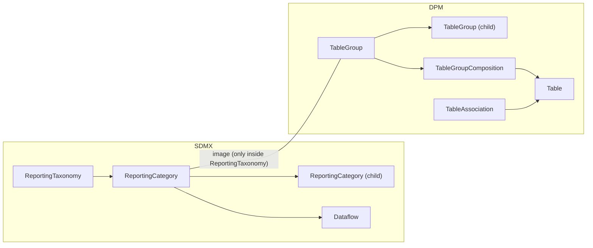
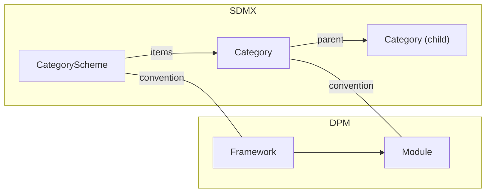
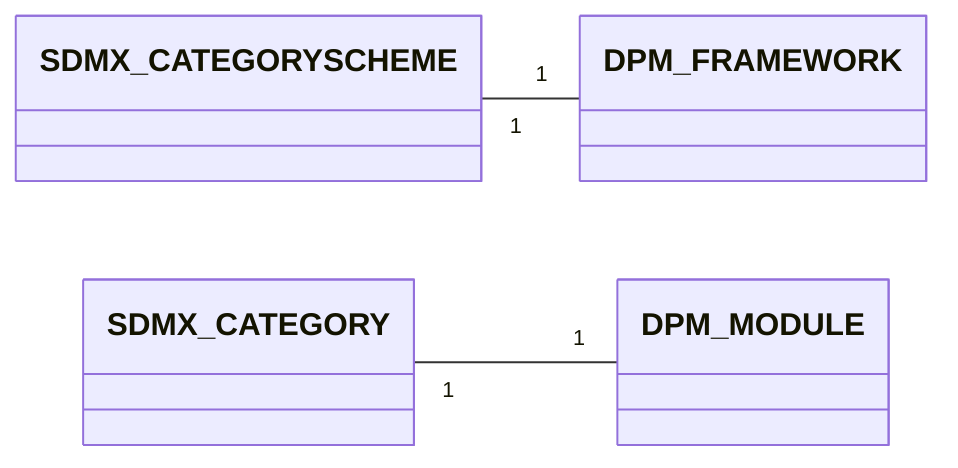

# 2. Specific gap analysis

This chapter provides detailed analysis of specific gap areas that require careful attention when transforming between SDMX and DPM.

## 2.1 Defaults and implicit dimensions

### 2.1.1 The problem

Both SDMX and DPM support the notion of "default" or "implicit" values, but with different mechanisms and semantics.

**SDMX approach**:
- **Wildcards in constraints**: `*` means "all values" for a dimension.
- **cascadeValues**: In MemberSelections, `true` includes child codes, `excludeRoot` includes children but not the parent.
- **Anchor values**: In Generic Series Data (GSD), dimensions with a single allowed value may be omitted from series keys.
- **Fixed values**: StructureMaps can specify FixedValueMaps where a component always has a constant value.

**DPM approach**:
- **Default Item**: A Category can designate one Item as its default (`defaultItem`). When a Property of that Category is used without an explicit value, the default is assumed.
- **Closed cells**: In closed tables, cell intersections imply fixed Property–Item pairs.
- **FilingIndicator defaults**: FilingIndicatorVariables may have default "not reported" semantics.

### 2.1.2 Gap analysis

| Scenario | SDMX | DPM | Gap |
|----------|------|-----|-----|
| Dimension with single allowed value | Can be omitted (anchor) | Must be explicit or use defaultItem | Implicit vs explicit handling differs |
| "All values" wildcard | `*` in constraints | No wildcard; enumerate or use full Category | Wildcard semantics not directly mappable |
| Hierarchical inclusion | cascadeValues on MemberValue | SubCategory membership | Different mechanisms; may not align exactly |
| Fixed constant value | FixedValueMap in StructureMap | Header with fixed Context | StructureMap context vs rendering context |

### 2.1.3 Recommendations

1. **Document anchor dimensions**: When converting SDMX → DPM, explicitly document which dimensions were anchored and their fixed values.
2. **Use defaultItem sparingly**: DPM defaultItem should only be used when the default is semantically meaningful, not just for convenience.
3. **Expand wildcards**: When converting SDMX constraints with wildcards to DPM, expand to explicit SubCategory membership where feasible.
4. **Preserve in metadata**: Store original SDMX constraint semantics in DPM descriptions for round-trip fidelity.

## 2.2 Multi-measure vs single OBS_VALUE

### 2.2.1 The problem

SDMX supports two measure patterns:
1. **Single generic measure**: One `OBS_VALUE` Measure with a `MEASURE` dimension that identifies what is being measured.
2. **Multiple explicit measures**: Multiple named Measures (e.g. `IMPORTS`, `EXPORTS`) in the MeasureDescriptor.

DPM uses **FactVariables**, where each FactVariable represents one measurable quantity. There is no "measure dimension" pattern; each measure is a separate Variable.

### 2.2.2 Gap analysis

| SDMX pattern | DPM mapping | Issues |
|--------------|-------------|--------|
| Single OBS_VALUE + MEASURE dimension | Multiple FactVariables (one per MEASURE code) | Lose the dimensional relationship; MEASURE becomes implicit in Variable identity |
| Multiple explicit Measures | Multiple FactVariables | Direct mapping; measure grouping may be lost |
| Measure cardinality (minOccurs/maxOccurs) | No equivalent | DPM does not model "optional" vs "mandatory" measures |
| MeasureRelationship for attributes | AttributeVariable.subject | Must create separate AttributeVariables per FactVariable |

### 2.2.3 Example

**SDMX DSD with MEASURE dimension**:
```
Dimensions: REF_AREA, TIME_PERIOD, MEASURE
Measure: OBS_VALUE
MEASURE Codelist: IMPORTS, EXPORTS, BALANCE
```

**DPM mapping**:
```
FactVariable: IMPORTS (dimensions: REF_AREA, TIME_PERIOD)
FactVariable: EXPORTS (dimensions: REF_AREA, TIME_PERIOD)
FactVariable: BALANCE (dimensions: REF_AREA, TIME_PERIOD)
```

The MEASURE dimension is "absorbed" into the Variable identity. The relationship between the three measures (they form a coherent group) is lost unless captured in Module organisation or naming conventions.

### 2.2.4 Recommendations

1. **Prefer explicit measures**: When designing SDMX DSDs intended for DPM conversion, use explicit Measures rather than a MEASURE dimension.
2. **Document measure groups**: When converting MEASURE-dimension patterns, document the original grouping in Module structure or TableGroups.
3. **Naming convention**: Use consistent prefixes or suffixes to indicate related FactVariables (e.g. `TRADE_IMPORTS`, `TRADE_EXPORTS`, `TRADE_BALANCE`).
4. **Round-trip metadata**: Store original SDMX measure pattern in descriptions for bidirectional conversion.

### 2.2.5 Metric not in the series key — constraints cannot enumerate metric per data point

This is the inverse of §2.2.1, surfacing in the **DPM ⇒ SDMX constraint** mapping ([§02_data_definition §3.3](../02_data_definition/03_detailed_mapping_rules.md#33-series-constraints--variables)). In DPM a data point is identified by its **Context *and* its metric Property** (the FactVariable). In SDMX a **series key is composed of dimension values only** — a Measure is never part of the key. So when the valid-series space of a closed table is expressed as a `DataKeySet`, data points that share a dimension key but differ only by metric **collapse to a single series key**.

**Example (C_26.00).** Four data points: `(qEBF=qx0, metric=qAIH)`, `(qEBF=qx0, metric=qAIC)`, `(qEBF=qx2011, metric=qAJB)`, `(qEBF=qx0, metric=qBFH)`. As series keys these are just two — `qEBF=qx0` and `qEBF=qx2011` — because the metric cannot enter the key. The constraint therefore states "these dimension keys are valid" and "these Measures exist" (the DSD Measure list) **independently**; it cannot state that `qAJB` occurs *only* at `qEBF=qx2011`.

#### 2.2.5.1 Gap analysis

| Aspect | SDMX | DPM | Gap |
|--------|------|-----|-----|
| Data-point identity | Dimension key + (separately) a Measure | Context + metric Property, as one FactVariable | The metric is identity-bearing in DPM but not key-bearing in SDMX |
| Metric in a key | A Measure is not a key component; a non-enumerated Measure has no discrete value to enumerate | Each metric is an explicit FactVariable | Cannot place the metric inside a `DataKey` |
| Metric ⇄ key binding | A `CubeRegion` may carry a value-less measure `<Component>`, but this only asserts the Measure is *present*, not that it pairs with a particular key | Implicit in each FactVariable's Context | The "which metric at which key" relationship is lost |

This is of a kind with the Cartesian-product caveat in [§3.3.8](../02_data_definition/03_detailed_mapping_rules.md#338-example-mapping-dpm--sdmx): the SDMX constraint over-generalises the DPM data space. Here the loss is along the metric axis rather than across dimensions.

#### 2.2.5.2 Recommendations

1. **Record the metric–key pairing** out of band (e.g. a `DataKeySet` keyed on a metric-bearing dimension, or model documentation) when the precise per-data-point validity matters.
2. **Consider a `MEASURE`-dimension DSD** (single `OBS_VALUE` + a metric dimension; §2.2.1) when round-trip fidelity of the metric–key relationship is required: with the metric as a *dimension* it becomes part of the series key and can be enumerated in the constraint. This trades the explicit-multi-measure shape for key-level precision.
3. **Flag the collapse** in the conversion output so downstream consumers know the constraint is metric-agnostic.

## 2.3 Stock vs flow and temporal semantics

### 2.3.1 The problem

Statistical data has fundamental temporal characteristics:
- **Stock**: Value at a point in time (e.g. balance sheet position on 31 Dec).
- **Flow**: Value over a period (e.g. transactions during Q1).
- **Frequency**: Reporting periodicity (annual, quarterly, monthly, etc.).

SDMX and DPM handle these differently, and XBRL (often used for DPM serialisation) has its own temporal model.

### 2.3.2 SDMX temporal model

- **TimeDimension**: Dedicated component with time-specific FacetValueTypes.
- **FacetValueTypes**: `observationalTimePeriod`, `reportingTimePeriod`, `basicTimePeriod`, `gregorianTimePeriod`, etc.
- **FREQ dimension**: Commonly used to indicate frequency (A, Q, M, D, etc.).
- **Stock/flow**: Not explicitly modelled; typically indicated by Concept semantics or Annotations.

### 2.3.3 DPM temporal model

- **Time Property**: A regular Property referencing a time-related Category.
- **Period types**: Implementation-defined; may distinguish instant vs duration.
- **Stock/flow**: May be indicated by Property semantics or FactVariable dataType.

### 2.3.4 XBRL temporal model

- **Instant**: Point in time (e.g. `2024-12-31`).
- **Duration**: Period with start and end (e.g. `2024-01-01` to `2024-12-31`).
- **periodType**: Concepts are declared as `instant` or `duration` in the taxonomy.

### 2.3.5 Gap analysis

| Aspect | SDMX | DPM | XBRL | Gaps |
|--------|------|-----|------|------|
| Time representation | TimeDimension + FacetValueType | Dimension with time Property | Period element (instant/duration) | Different granularity and semantics |
| Stock vs flow | Implicit (Concept semantics) | Implicit (Property semantics) | Explicit (periodType) | XBRL is most explicit; SDMX/DPM require inference |
| Frequency | FREQ dimension (common convention) | Property or Category | Not directly modelled | SDMX has strongest convention |
| Point-in-time | observationalTimePeriod values | Date values | instant element | Similar but format differs |
| Period | reportingTimePeriod values | Date range or convention | duration element | Representation differs |

### 2.3.6 Alignment challenges

1. **SDMX → DPM**: TimeDimension FacetValueTypes must map to appropriate DPM time Properties. The rich SDMX time semantics (reporting vs observational) may be simplified.

2. **DPM → XBRL**: DPM does not always distinguish stock/flow; the XBRL periodType must be inferred from Property semantics or explicitly configured.

3. **Frequency handling**: SDMX FREQ is a dimension; DPM may model frequency as a Property or derive it from the time period format; XBRL does not have a frequency concept.

### 2.3.7 Recommendations

1. **Explicit stock/flow marker**: Add a Property or annotation indicating stock vs flow when designing DPM structures intended for XBRL serialisation.
2. **Frequency alignment**: Establish conventions for how SDMX FREQ values map to DPM time Categories and XBRL period formats.
3. **Time period normalisation**: Define canonical time period formats that work across all three models.
4. **Documentation**: Clearly document temporal semantics in Property/Concept descriptions to enable correct inference.

## 2.4 Compound items — SDMX feature gap

### 2.4.1 The gap

SDMX has no explicit construct for expressing that a single code is *composed of* multiple values across different dimensions or categories. Every code in a Codelist is a flat, atomic value with no built-in mechanism to encode its internal structure.

DPM provides an explicit **Compound Category Item**: an item that declares its composition via a set of Property–Item pairs (a `Context` with `ContextCompositions`). This makes the multi-dimensional semantics machine-readable and reusable across tables and validation rules. See [glossary mapping rules §3.3.5](../01_glossary/03_detailed_mapping_rules.md#335-compound-item-known-limitation) for the mapping consequences.

### 2.4.2 DPM use case

The canonical example is a financial instrument such as "Treasury bill" (`TBILL`). In SDMX it appears as a flat code in `CL_INSTRUMENT` with no internal structure. In DPM it is a Compound Item explicitly composed of:

- Type of financial instrument (Property) = "Debt security" (Item)
- Sector of the issuer (Property) = "General governments" (Item)
- Original maturity (Property) = "Up to 18 months" (Item)

This composition enables DPM to use `TBILL` directly in slicing, aggregation, and cross-table validation without duplicating the business logic. SDMX cannot express this at the vocabulary level; the semantics must be documented externally or approximated via workarounds (see [§3.3.6](../01_glossary/03_detailed_mapping_rules.md#336-sdmx-workarounds-for-compound-item-semantics)).

### 2.4.3 Previous SDMX proposal

A compound item feature was previously proposed for inclusion in SDMX, inspired in part by the DPM model and similar needs expressed by the IMF. The proposal was rejected during standardisation. The precise version cycle and rejection rationale are not documented here; this section records that the gap is known and was previously considered.

### 2.4.4 Future SDMX candidate

The DPM compound item pattern provides a concrete, well-specified use case that could support revisiting the feature in a future SDMX version. Key arguments for reconsideration:

- **Expressiveness**: Compound items allow vocabulary-level encoding of multi-dimensional semantics that are currently left to documentation or external business rules.
- **Interoperability**: Without native compound item support, DPM→SDMX conversion is necessarily lossy for these structures.
- **Reuse**: Explicit composition at the codelist level enables automated validation and aggregation that SDMX currently cannot perform without out-of-band knowledge.

## 2.6 ProvisionAgreement / Datasource — SDMX feature without DPM equivalent

### 2.6.1 The gap

SDMX **ProvisionAgreement** is a maintainable artefact that formalises a *data supply contract* between a DataProvider and a Dataflow:

```xml
<ProvisionAgreement agencyID="ECB" id="PA_BDE_CBD2" version="1.0">
  <DataProvider>
    <Ref agencyID="ECB" id="DATA_PROVIDERS" class="DataProvider" containedID="BDE"/>
  </DataProvider>
  <Dataflow>
    <Ref agencyID="ECB" id="CBD2" version="1.0"/>
  </Dataflow>
  <Datasource>
    <SimpleDatasource>
      <DataURL>https://bde.example/cbd2.xml</DataURL>
    </SimpleDatasource>
  </Datasource>
</ProvisionAgreement>
```

DPM does not model this contract. DPM expresses *what is required* (the ModuleVersion: which Tables, which Variables, which Operations) but **not** *who supplies it from where* (the agreement and endpoint).

### 2.6.2 Why DPM does not model provisioning

DPM is a metamodel for reporting *requirements*, not for data exchange logistics. Provisioning concerns — the contractual relationship, the URL where data is fetched, authentication and scheduling — are handled by the implementing platform (e.g. EBA's regulatory reporting infrastructure) outside the DPM database. This is consistent with the design principle that DPM "focuses on the what, not the how" (see [§00 Basics §1.3](../00_basics/01_base_comparison.md)).

### 2.6.3 Recommendations

| Direction       | Recommendation                                                                                                                                                                                          |
|-----------------|---------------------------------------------------------------------------------------------------------------------------------------------------------------------------------------------------------|
| SDMX → DPM      | Do not materialise ProvisionAgreement in DPM. If round-trip preservation is required, attach a `DPM_PROVISION_AGREEMENT` annotation to the matching ModuleVersion containing the original ProvisionAgreement URN(s). See the marker registry in [§04 §3.6.2](../04_versioning_and_extensibility/03_detailed_mapping_rules.md#362-recognised-dpm-markers-tier-a-canonical-registry). |
| DPM → SDMX      | Do not emit ProvisionAgreement during the DPM → SDMX mapping. ProvisionAgreements must be authored separately by the operating platform (or recovered from the `DPM_PROVISION_AGREEMENT` annotation if present). |

> **Note — Datasource follows ProvisionAgreement**: SDMX `SimpleDatasource` and `RESTDatasource` are nested inside the ProvisionAgreement. They are not separable artefacts; the rule above covers them implicitly.

> **Note — DPM Organisation `URI`**: The DPM Organisation `URI` field is a contact URI for the organisation, **not** a data submission endpoint. It must not be conflated with `Datasource.DataURL`.

### 2.6.4 Future SDMX / DPM consideration

The DataProvider ↔ Organisation(entry_point) mapping ([§04 §3.2](../04_versioning_and_extensibility/03_detailed_mapping_rules.md#32-dataprovider-organisation-role-entry_point)) preserves *who* submits data, but the *where* and *under what contract* are intentionally outside DPM. There is no proposal to extend DPM with a ProvisionAgreement-equivalent; the platform layer is the right home for this concern.

## 2.7 Process / ProcessStep — SDMX feature without DPM equivalent

### 2.7.1 The gap

SDMX **Process** is a maintainable artefact describing a workflow or data-processing pipeline. **ProcessStep** items reference input and output artefacts and document transformations. Process is the SDMX construct for capturing data lineage and production workflow.

DPM does not model production workflows. The DPM database documents *what* is to be reported and *how to validate it*, not the operational pipeline that produces or consumes it.

### 2.7.2 What this is *not*

DPM Operations and Validation rules (5.4 of the metamodel) are *not* equivalent to SDMX Process: DPM Operations are validation/calculation rules over the data, not workflow steps. The two concepts must not be conflated. Operation/OperationVersion may map (partially) to SDMX VTL artefacts (TransformationScheme, RulesetScheme); that family is currently deferred — see the artefact index.

### 2.7.3 Recommendations

| Direction       | Recommendation                                                                                                                                                          |
|-----------------|-------------------------------------------------------------------------------------------------------------------------------------------------------------------------|
| SDMX → DPM      | Do not materialise Process / ProcessStep in DPM. Optional preservation via a `DPM_PROCESS` annotation on the most-relevant DPM artefact (Framework or ModuleVersion).   |
| DPM → SDMX      | Do not emit Process / ProcessStep during the DPM → SDMX mapping. Processes must be authored separately by the operating platform.                                       |

## 2.8 TableGroup / TableAssociation — DPM feature without SDMX equivalent

### 2.8.1 The gap

DPM provides explicit grouping for Tables within a Module:

- **TableGroup** organises Tables into hierarchical, navigable bundles (e.g. *Balance sheet*, *Income statement* under FINREP).
- **TableAssociation** allows the same Table to participate in multiple groupings (e.g. by subject *and* by reporting frequency).

Neither has a direct SDMX counterpart at the same conceptual level. SDMX has no first-class artefact for grouping Dataflows by subject inside a single reporting cycle.

### 2.8.2 Closest SDMX analogue: ReportingCategory

The closest SDMX analogue is a **ReportingCategory** subtree inside a ReportingTaxonomy ([§02 §3.4](../02_data_definition/03_detailed_mapping_rules.md#34-reporting-bundle-reportingtaxonomy-reportingcategory-moduleversion)). ReportingCategories may be nested and reference Dataflows. They are not, however, the same artefact:

- ReportingCategories are scoped to one ReportingTaxonomy version. DPM TableGroups are independent Concepts that exist *outside* any single ModuleVersion.
- The same DPM TableGroup can become *different* ReportingCategory items in different ReportingTaxonomies (one per ModuleVersion that uses the group). The TableGroup's identity does not survive into SDMX.



### 2.8.3 Mapping recipe (current best practice)

| Direction       | Recipe                                                                                                                                                                  |
|-----------------|-------------------------------------------------------------------------------------------------------------------------------------------------------------------------|
| SDMX → DPM      | If the source provides ReportingCategories with hierarchy, the ReportingTaxonomy mapping ([§02 §3.4](../02_data_definition/03_detailed_mapping_rules.md#34-reporting-bundle-reportingtaxonomy-reportingcategory-moduleversion)) materialises a TableGroup tree. Otherwise no TableGroups are created. |
| DPM → SDMX      | TableGroups become ReportingCategories *only inside the ReportingTaxonomy* generated for the matching ModuleVersion. Outside that scope, TableGroups are not emitted.   |

| Asymmetry                                            | Recommendation                                                                                                                                                  |
|------------------------------------------------------|-----------------------------------------------------------------------------------------------------------------------------------------------------------------|
| TableGroup `Code` and `Description` should round-trip | Emit them as `ReportingCategory.id` and `Description`. On the reverse path, the same `Code` is reconstructed.                                                  |
| TableAssociation may put one Table in multiple groups | Emit each association as a separate `ReportingCategory.Dataflow` reference. Reverse: each Dataflow that appears under multiple ReportingCategories produces multiple TableAssociations. |
| Hierarchical TableGroup nesting                      | Mirror the parent–child relationship via `ReportingCategory.parent`.                                                                                            |
| Pure DPM TableGroup outside any ModuleVersion        | Lossy on the SDMX side. The TableGroup will only be emitted when a ModuleVersion that uses it is also being emitted. Standalone TableGroups should be flagged or preserved as a `DPM_TABLEGROUP` annotation on the Framework's CategoryScheme. |

### 2.8.4 Proposal: a CategoryScheme-based extension

A clean way to fill this gap on the SDMX side without changing the SDMX standard is to use a **dedicated CategoryScheme per Framework that mirrors the TableGroup tree**, with a Categorisation per Table:

- One CategoryScheme `<framework-id>_TABLEGROUPS` whose Categories mirror the TableGroup hierarchy.
- One Categorisation per (Dataflow, TableGroup) pair encoding the TableAssociation.
- The TableGroup identity then survives outside any ReportingTaxonomy (each ReportingCategory still references the matching Categories where useful).

This proposal is *not* part of the current bidirectional mapping; it is recorded here as a candidate refinement for future versions. The trade-off is duplication of navigation (CategoryScheme + ReportingTaxonomy) on the SDMX side, which is acceptable when TableGroup identity must round-trip independently of ReportingTaxonomy versions.

### 2.8.5 Example DPM ==> SDMX (current recipe)

Starting from:

*TableGroup*

| TableGroupID | Code             | Name              | StartReleaseID |
| ------------ | ---------------- | ----------------- | -------------- |
| 200          | BALANCE_SHEET    | Balance sheet     | 5              |

*TableAssociation* (Table appears in two groups)

| TableID | TableGroupID |
| ------- | ------------ |
| 6101    | 200          |
| 6101    | 250          |

(Where `200 = BALANCE_SHEET` and `250 = QUARTERLY_REPORTING` are different navigation views of the same Table.)

The mapping produces a ReportingCategory under the ReportingTaxonomy generated for the matching ModuleVersion ([§02 §3.4](../02_data_definition/03_detailed_mapping_rules.md#34-reporting-bundle-reportingtaxonomy-reportingcategory-moduleversion)):

```xml
<ReportingTaxonomy …>
  <ReportingCategory id="BALANCE_SHEET">
    <Name xml:lang="en">Balance sheet</Name>
    <Dataflow><Ref agencyID="EBA" id="DF_FINREP_F_01.01" version="1.0"/></Dataflow>
  </ReportingCategory>
  <ReportingCategory id="QUARTERLY_REPORTING">
    <Name xml:lang="en">Quarterly reporting</Name>
    <Dataflow><Ref agencyID="EBA" id="DF_FINREP_F_01.01" version="1.0"/></Dataflow>
  </ReportingCategory>
</ReportingTaxonomy>
```

The Dataflow `DF_FINREP_F_01.01` appears under both ReportingCategories — preserving the multi-grouping intent of the DPM TableAssociation.

## 2.9 CategorySchemeMap — SDMX feature without DPM equivalent

### 2.9.1 The gap

SDMX **CategorySchemeMap** maps Categories between two CategorySchemes. It is rarely needed for round-trip; typical use is Framework rebranding or merging:

```xml
<CategorySchemeMap agencyID="EBA" id="MAP_OLD_TO_NEW" version="1.0">
  <Source><Ref agencyID="EBA" id="OLD_DOMAINS" version="1.0"/></Source>
  <Target><Ref agencyID="EBA" id="EBA_REPORTING" version="1.0"/></Target>
  <CategoryMap>
    <Source>FIN_REP</Source>
    <Target>FINREP</Target>
  </CategoryMap>
</CategorySchemeMap>
```

DPM has no direct counterpart. The closest expression is the generic `ConceptRelation` artefact (4.1.4 of the DPM metamodel), which records relationships between Concepts but is not specialised for cross-scheme migration. The mapping is therefore a *workaround* rather than a structural correspondence — which is why CategorySchemeMap is recorded here as a gap rather than alongside the deployable-bundle correspondences in [§02 §3.4](../02_data_definition/03_detailed_mapping_rules.md#34-reporting-bundle-reportingtaxonomy-reportingcategory-moduleversion).

### 2.9.2 DPM workaround via ConceptRelation

In DPM, the equivalent intent is expressed by:

- **Framework merge** → a `version_new` ConceptRelation linking the two Frameworks, *or* a complete migration where Modules from the old Framework are reassigned (`Module.FrameworkID`) to the new one.
- **Module rename** → a `version_fix` ConceptRelation linking the renamed Modules, plus the new `Module.Code`.

ConceptRelation is generic — the rename intent is not encoded in the artefact name; it lives in the relation `type` and in any annotation/description attached to the relation. This is workable but loses the explicit "category-to-category mapping" framing that SDMX provides.

### 2.9.3 Recommendations

| Direction       | Recipe                                                                                                                                                                   |
|-----------------|--------------------------------------------------------------------------------------------------------------------------------------------------------------------------|
| SDMX → DPM      | Apply the CategoryMap entries as a renaming/migration step on the matching Modules. If both Frameworks already exist in the DPM model, record ConceptRelations of type `version_new` between matching Module pairs. The CategorySchemeMap itself is not materialised. |
| DPM → SDMX      | Emit a CategorySchemeMap when two Frameworks coexist in the export and there is a documented correspondence (via ConceptRelation or naming convention). The map is optional — if not emitted, downstream consumers can recover the relationship from the Module-rename trail in the source. |

> **Note — proposal**: a future refinement could be a dedicated DPM entity for cross-Framework migration, or an extension of ConceptRelation with a `category_scheme_map` discriminator. This is not part of the current bidirectional mapping; recorded here for future consideration.

## 2.11 Framework — DPM feature without SDMX equivalent

### 2.11.1 The gap

DPM **Framework** is the top-level container that groups related Modules under one regulatory or statistical domain (e.g. `EBA_REPORTING` containing `FINREP`, `COREP`, `LIQUIDITY`). SDMX has no equivalent: ProvisionAgreements (a common first guess) model data-supply contracts, not legislative groupings of structures, and ReportingTaxonomy is the per-cycle deployable bundle, not a multi-Module domain wrapper.

Framework was originally treated as a regular cross-model correspondence in §03; the meeting on 2026-05-04 reclassified it as a gap because the SDMX side is a **convention** layered on top of CategoryScheme, not a structural counterpart.

### 2.11.2 SDMX-side bridge: CategoryScheme convention

The closest SDMX construct is **CategoryScheme** — a generic classification scheme that can be used as a "backdoor" to represent DPM-only navigation artefacts. The convention is:

- Emit one **CategoryScheme** per Framework, owned by the same Agency that owns the Framework.
- Each Module under the Framework becomes a **Category** under the scheme.
- Cross-link to the deployable bundle: when a ReportingTaxonomy is also emitted (the primary Module mapping in [§02 §3.4](../02_data_definition/03_detailed_mapping_rules.md#34-reporting-bundle-reportingtaxonomy-reportingcategory-moduleversion)), the same Module ↔ Category alignment carries over.
- Heuristic for the reverse path: if a CategoryScheme contains Categories whose target artefacts are ReportingTaxonomies, treat the CategoryScheme as a Framework.

Limitations:

- SDMX consumers will not recognise the CategoryScheme as a Framework without out-of-band agreement; the convention has to be advertised to be useful.
- CategoryScheme has no `Owner` field analogous to Framework (the SDMX `agencyID` is the closest); see [§04 §3.1](../04_versioning_and_extensibility/03_detailed_mapping_rules.md#31-agency-organisation-role-owner) for the Agency↔Organisation mapping.



### 2.11.3 Mapping cardinality



- **From SDMX to DPM**: one CategoryScheme maps to one Framework; each Category in the scheme maps to one Module under that Framework. The Category hierarchy is **flattened** — DPM Modules are not nested. Where the SDMX hierarchy is meaningful (e.g. a top-level "COREP" with sub-Categories "COREP_OF", "COREP_LR"), each level becomes a separate Module; the parent–child relationship is encoded only in the Module `Code` naming convention (e.g. `COREP_OF` carries the parent's prefix).
- **From DPM to SDMX**: one Framework maps to one CategoryScheme; each Module maps to one Category. DPM Modules have no hierarchy, so the resulting SDMX Categories are siblings under the scheme — unless naming conventions encode a hierarchy that the mapping can re-materialise.

### 2.11.4 Attributes equivalence

| SDMX                              | DPM                              | Notes                                                                                                              |
|-----------------------------------|----------------------------------|--------------------------------------------------------------------------------------------------------------------|
| CategoryScheme.`id`               | Framework.`Code`                 |                                                                                                                    |
| CategoryScheme.`agencyID`         | Framework.`OwnerID` (lookup)     | Lookup the Organisation whose `Acronym` equals the `agencyID`. The Agency↔Organisation mapping is in [§04 §3.1](../04_versioning_and_extensibility/03_detailed_mapping_rules.md#31-agency-organisation-role-owner). |
| CategoryScheme.`version`          | — (Framework is unversioned)     | Framework has no version slot. Use ModuleVersion ([§02 §3.4](../02_data_definition/03_detailed_mapping_rules.md#34-reporting-bundle-reportingtaxonomy-reportingcategory-moduleversion)) and Release ([§04 §3.4](../04_versioning_and_extensibility/03_detailed_mapping_rules.md#34-release-version-validity)) for temporal evolution. |
| CategoryScheme.`Name`             | Framework.`Name`                 | Multilingual.                                                                                                     |
| CategoryScheme.`Description`      | Framework.`Description`          | Multilingual.                                                                                                     |
| CategoryScheme.`isPartial`        | — (no equivalent)                | DPM does not model partial schemes at the Framework level.                                                        |
| Category.`id`                     | Module.`Code`                    |                                                                                                                    |
| Category.`Name`                   | Module.`Name`                    | Multilingual.                                                                                                     |
| Category.`Description`            | Module.`Description`             | Multilingual.                                                                                                     |
| Category.`parent` (hierarchy)     | — (Modules are siblings)         | Hierarchy is flattened; parent encoded only in `Module.Code` by convention (e.g. `COREP_OF` under `COREP`).        |
| — (not applicable)                | Module.`FrameworkID`             | All Modules ingested from one CategoryScheme share the same Framework.                                            |

### 2.11.5 Example — DPM ⇒ SDMX

Starting from:

| FrameworkID | Code           | Name                       | OwnerID |
| ----------- | -------------- | -------------------------- | ------- |
| 100100001   | EBA_REPORTING  | EBA reporting domains      | 1 (EBA) |

| ModuleID    | FrameworkID  | Code      | Name                  |
| ----------- | ------------ | --------- | --------------------- |
| 100200001   | 100100001    | FINREP    | Financial reporting   |
| 100200002   | 100100001    | COREP     | Common reporting      |
| 100200003   | 100100001    | COREP_OF  | Own funds             |
| 100200004   | 100100001    | COREP_LR  | Leverage ratio        |

Produces:

```xml
<CategoryScheme agencyID="EBA" id="EBA_REPORTING" version="1.0" isPartial="false">
  <Name xml:lang="en">EBA reporting domains</Name>
  <Category id="FINREP">
    <Name xml:lang="en">Financial reporting</Name>
  </Category>
  <Category id="COREP">
    <Name xml:lang="en">Common reporting</Name>
    <Category id="COREP_OF">
      <Name xml:lang="en">Own funds</Name>
    </Category>
    <Category id="COREP_LR">
      <Name xml:lang="en">Leverage ratio</Name>
    </Category>
  </Category>
</CategoryScheme>
```

The mapper rematerialises the parent–child relationship from the `Module.Code` prefix when a hierarchy convention is documented at project level.

### 2.11.6 Recommendations

1. **Advertise the convention**: when emitting CategoryScheme + Categories as the SDMX side of a Framework, document the convention so consumers know to interpret it as a Framework.
2. **Pair with ReportingTaxonomy**: do not rely on CategoryScheme alone — emit ReportingTaxonomies for the deployable bundles too (§02 §3.4). The CategoryScheme is for navigation; the ReportingTaxonomy is for submission.
3. **Push for a first-class Framework artefact**: a future SDMX evolution could introduce a Framework-equivalent artefact that explicitly groups ReportingTaxonomies under a domain.

## 2.12 CategoryScheme — SDMX backdoor for DPM-only classification

### 2.12.1 The gap

SDMX **CategoryScheme** is a generic classification artefact that can be used to organise any IdentifiableArtefact under a hierarchy of Categories. DPM has **no direct counterpart**: classification responsibilities are partitioned across Framework (top-level domain), Module (coherent reporting package), Category (glossary value-domain), and SuperCategory (cross-Category union). None of these is a generic, retrofittable hierarchy in the way CategoryScheme is.

### 2.12.2 CategoryScheme as a backdoor

CategoryScheme's generality makes it the natural SDMX **backdoor** for DPM-only artefacts that need an SDMX-side image. Three established or proposed uses:

| DPM-only artefact                  | CategoryScheme convention                                              | Documented at |
|------------------------------------|------------------------------------------------------------------------|---------------|
| **Framework**                      | One CategoryScheme per Framework; each Module ↔ Category               | §2.11 above |
| **TableGroup / TableAssociation**  | Proposal: one CategoryScheme per Framework with TableGroup categories  | [§2.8.4](#284-proposal-a-categoryscheme-based-extension) |
| **CategorySchemeMap workaround**   | DPM ConceptRelation between Frameworks — CategorySchemeMap is the SDMX side, but the round-trip is lossy | [§2.9](#29-categoryschememap-sdmx-feature-without-dpm-equivalent) |

The pattern is the same in each case: SDMX CategoryScheme is the "low-ceremony" container for navigation that DPM models with multiple specialised artefacts.

### 2.12.3 Heuristics for SDMX → DPM

When ingesting an unfamiliar CategoryScheme, the inverse mapping is ambiguous. Heuristics in priority order:

1. **Categories reference ReportingTaxonomies** → treat the CategoryScheme as a **Framework**. The Categories become Modules.
2. **Categories reference Dataflows directly (Categorisations)** → treat each Category as a **TableGroup** and the parent CategoryScheme as a navigation grouping inside an existing Module/Framework.
3. **No structural artefacts referenced** (pure subject-domain taxonomy) → annotate the CategoryScheme on the receiving DPM artefact (e.g. via an annotation marker) and do not materialise a Framework. A future evolution could give DPM a generic "subject taxonomy" artefact.

### 2.12.4 Limitations

- The conventions are **not enforced** by SDMX — different agencies may use CategoryScheme differently. Mapping rules must inspect the references inside each Category to decide intent.
- CategoryScheme **versioning** (a first-class concept in SDMX) does not always survive round-trips; DPM Frameworks have no version, so a non-trivial CategoryScheme version requires materialisation as a new Framework or as ConceptRelation history (see [§2.9](#29-categoryschememap-sdmx-feature-without-dpm-equivalent)).
- **Owner** semantics differ: CategoryScheme has only `agencyID`; DPM Framework has an explicit `OwnerID` (Organisation FK). The SDMX → DPM lookup uses the Agency↔Organisation mapping ([§04 §3.1](../04_versioning_and_extensibility/03_detailed_mapping_rules.md#31-agency-organisation-role-owner)).

### 2.12.5 Recommendations

1. **Document the intended use** of every CategoryScheme that will be exchanged across SDMX/DPM boundaries — annotate whether it represents a Framework, a TableGroup tree, or pure subject-domain navigation.
2. **Prefer specialised artefacts where they exist**: emit a ReportingTaxonomy for deployable bundles, not a CategoryScheme.
3. **Use CategoryScheme only when nothing better exists** in SDMX. The temptation to use it for everything is what makes the inverse mapping ambiguous.

## 2.13 DPM glossary/versioning — recommendation to the DPM Alliance

### 2.13.1 The gap

The single largest interoperability challenge is not a missing artefact but the **shape of DPM's versioning model**, and especially its **glossary versioning**. As set out in the [Versioning overview](../00_basics/03_versioning_overview.md), SDMX versions every MaintainableArtefact explicitly and semantically (a Codelist version is a self-contained, citable object), whereas DPM glossary items (Categories, Items, Properties) carry **no explicit version** — their state is reconstructed from release-based change logs and is only unambiguous once resolved through a ModuleVersion and a Release.

### 2.13.2 Not "absent", but implicit

It would be inaccurate to say DPM has no versioning. DPM has mechanisms that can be read as **implicit / snapshot-based versioning**:

- **Release change logs** (`startRelease` / `endRelease` on item–category relationships) record when content changes.
- **Per-Release snapshots** materialise the full glossary state at any Release ([§00 §3.2](../00_basics/03_versioning_overview.md#32-dpm-versioning-model)).
- **ModuleVersion-anchored applicability** fixes which glossary slice a reporter must use ([§00 §3.3](../00_basics/03_versioning_overview.md#33-releases-and-temporal-alignment)).

These are real and usable; the difficulty is that they are **implicit, non-uniform, and not expressed as first-class versions**, which is exactly what cross-model exchange with SDMX needs.

### 2.13.3 Recommendation

Raise with the **DPM Alliance** that DPM versioning — glossary versioning in particular — is a **major interoperability challenge**, and that DPM would benefit from evolving towards a **more explicit and standardised versioning model**, ideally one whose glossary artefacts can be referenced as self-contained, versioned objects (closer to the SDMX Codelist/ConceptScheme model).

The recommendation must be framed carefully:

1. **Acknowledge what exists** — DPM already has implicit/snapshot-based mechanisms; this is an *evolution*, not the introduction of versioning from scratch.
2. **State the benefit** — explicit, uniform versions would remove the need for ModuleVersion-driven inference when exchanging glossary content with SDMX, and make virtual-version computation (see [§04 §3.7](../04_versioning_and_extensibility/03_detailed_mapping_rules.md)) unnecessary in the common case.
3. **Recognise the cost** — changing the versioning model is itself a **central and breaking change** for existing DPM producers and consumers, so it is a strategic recommendation for Alliance consideration, not a quick fix. It is timely because further DPM changes are still anticipated.

## 2.14 Supporting documents / binary attachments — future extension

### 2.14.1 The use case

In IRF and acquisition processes, a structured submission is sometimes accompanied by **additional unstructured or semi-structured documents** — PDFs, Word or Excel files carrying explanations, supporting evidence, or methodological notes. Neither model treats this as part of the core data/structure exchange.

### 2.14.2 What SDMX can and cannot do

- **Referential metadata** (the first mention of this SDMX feature in these docs) can model structured metadata *reports* — attached to datasets, observations, providers, concepts or other artefacts — using a Metadata Structure Definition with concepts such as methodology, accuracy, timeliness, or links/references to attachments. So SDMX can come *close* to the requirement when the supporting information is itself structured and can be **linked to something in the model**.
- **Native transmission of binary files** (the actual PDF/Word/Excel payload) is **not naturally supported** by current SDMX formats, and would additionally raise secure-transmission concerns.

### 2.14.3 DPM side

DPM may have, or be planning, **document-oriented modules** for this kind of content; this needs to be **confirmed with EBA / the DPM Alliance**.

### 2.14.4 Classification

This is a **relevant future extension, not central** to the current SDMX–DPM mapping deliverable. It is recorded here so it is not lost, particularly for acquisition processes, but it sits outside the bidirectional structure/glossary mapping that is the focus of this work. If pursued, the binary-attachment transmission aspect is a candidate to raise in the SDMX Technical Working Group.

## 2.10 Summary of mitigation strategies

| Gap area | Primary mitigation | Secondary mitigation |
|----------|-------------------|---------------------|
| Defaults / implicit dimensions | Explicit documentation | Metadata preservation |
| Multi-measure patterns | Naming conventions + Module structure | Round-trip metadata |
| Stock vs flow | Explicit markers (Property/Annotation) | Documentation |
| Temporal semantics | Canonical formats + conventions | Transformation rules |
| Compound Items (§2.4) | Decomposition + documentation | Annotations (DPM_COMPOUND_COMPONENTS) |
| Cross-codelist hierarchies | SuperCategory + flattening | Accept partial loss |
| Attribute attachment | Convention-based mapping | Flatten to observation |
| Rendering | External specification | Accept loss for SDMX |
| ProvisionAgreement / Datasource (§2.6) | External to DPM | Annotations (`DPM_PROVISION_AGREEMENT`) |
| Process / ProcessStep (§2.7) | External to DPM | Annotations (`DPM_PROCESS`) |
| TableGroup / TableAssociation (§2.8) | ReportingCategory image inside ReportingTaxonomy | Annotations (`DPM_TABLEGROUP`); proposal: dedicated CategoryScheme per Framework |
| CategorySchemeMap (§2.9) | ConceptRelation (`version_new` / `version_fix`) | Documented naming convention on Module `Code` |
| Framework — DPM feature without SDMX equivalent (§2.11) | CategoryScheme convention (one CategoryScheme per Framework; Modules → Categories) | Pair with ReportingTaxonomy ([§02 §3.4](../02_data_definition/03_detailed_mapping_rules.md#34-reporting-bundle-reportingtaxonomy-reportingcategory-moduleversion)) |
| CategoryScheme — SDMX backdoor for DPM-only classification (§2.12) | Use for Framework, TableGroup tree, or subject-domain navigation depending on contained references | Annotate intended use; inspect references for inverse mapping |
| DPM glossary/versioning (§2.13) | Recommendation to the DPM Alliance: evolve towards explicit, standardised versioning | Interim: ModuleVersion-anchored virtual versions / per-Release snapshots |
| Supporting documents / binary attachments (§2.14) | Out of core scope; future extension | SDMX referential metadata for structured parts; check DPM document modules with EBA |
