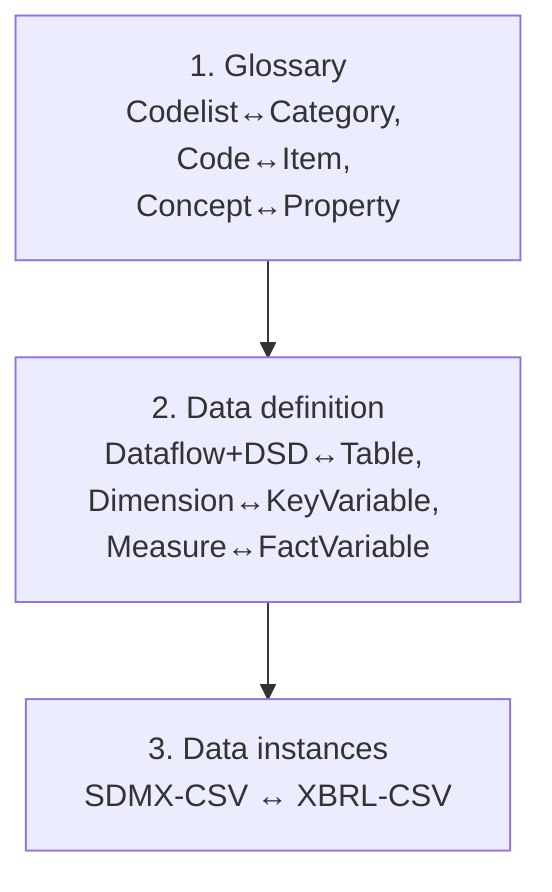

# 1. Methodology

This chapter describes the overall approach to transforming between SDMX and DPM, independent of direction. The two worked examples that follow ([§2](02_dpm_to_sdmx.md), [§3](03_sdmx_to_dpm.md)) apply this method step by step.

## 1.1 Metadata first, data second

A transformation always proceeds in two layers, in order:

1. **Glossary layer** — the shared vocabulary: enumerated value domains (Codelist ↔ Category, Code ↔ Item) and business characteristics (Concept ↔ Property/Metric).
2. **Data-definition layer** — the structures that consume the vocabulary: Dataflow + DSD ↔ Table, Dimension ↔ KeyVariable, Measure ↔ FactVariable, DataAttribute ↔ AttributeVariable.

The glossary layer is a **prerequisite** for the data-definition layer: a Dimension cannot be mapped to a KeyVariable until the Concept and Codelist it references have been mapped to a Property and Category. Converting data instances (CSV reports) is a third step that depends on both layers being in place — see [Data Instances](../data-instances/index.md).

## 1.2 Deterministic vs. judgement-based steps

Not every step can be fully automated. Classify each mapping before building a pipeline:

| Class | Meaning | Examples |
| --- | --- | --- |
| **Deterministic** | A rule produces the target with no ambiguity. | Codelist → Category; Code → Item; Dimension → KeyVariable; copying multilingual Name/Description. |
| **Convention-driven** | Deterministic *once a convention is fixed*; the convention must be agreed and documented. | Identifier normalisation; `IsMetric` derivation; default-item selection; one-CategoryScheme-per-Framework. |
| **Judgement-based** | Requires human input or external information not present in the source. | Stock vs. flow classification when unmarked; compound-item decomposition; attachment-level inference for attributes. |

The general identification, multilingual, and naming rules that apply across all artefacts are in [§00 §2 Detailed mapping rules](../models-relationships/00_basics/02_detailed_mapping_rules.md). Flag every convention-driven and judgement-based output for review rather than silently choosing a default.

## 1.3 Where information is lost

A transformation is **lossless** only where both models can express the same construct. The [Gaps](../models-relationships/05_gaps/index.md) section is the authoritative inventory; the directions below summarise the most common loss points and the recommended handling.

| Construct | SDMX → DPM | DPM → SDMX |
| --- | --- | --- |
| Compound Item | Model manually as multiple dimensions/items | Lossy; preserve components via `DPM_COMPOUND_COMPONENTS` annotation |
| Framework | Materialise directly | Use one-CategoryScheme-per-Framework convention |
| ReportingCategory grouping | Materialise as TableGroup tree | Preserved only inside ReportingTaxonomy |
| Explicit attribute attachment level | Recorded via `variable_attribute` ConceptRelation; level not formalised | Re-derive from ConceptRelation + conventions |
| ProvisionAgreement / Process | Not materialised; annotation workaround | Not materialised; annotation workaround |
| Glossary versioning | Release-anchored snapshots / virtual versions | See [§04 §3 Detailed mapping rules](../models-relationships/04_versioning_and_extensibility/03_detailed_mapping_rules.md) |

When a construct cannot be represented natively, the standard fallback is an **annotation** carrying the original semantics, so a later reverse transformation can reconstruct it. Annotations are described in [§04 §3.6 Annotation extension mechanism](../models-relationships/04_versioning_and_extensibility/03_detailed_mapping_rules.md).

## 1.4 Recommended pipeline

1. **Map owners/agencies.** Establish the Agency ↔ Organisation correspondence first; every other artefact inherits an owner from it ([§04 §3.1](../models-relationships/04_versioning_and_extensibility/03_detailed_mapping_rules.md)).
2. **Map the glossary.** Categories/Items, then Properties/Metrics. Resolve enumerated representations before non-enumerated ones.
3. **Map the data definition.** Tables/Modules, then Headers and Variables, then constraints (SubCategories).
4. **Normalise identifiers** at the boundary (see [Data Instances §1](../data-instances/01_sdmx_csv_xbrl_csv.md) for the ID rules), keeping a reversible map.
5. **Validate** the output against the target model's rules, and **review** all flagged convention-driven and judgement-based outputs.
6. **Record provenance** (annotations) for everything the target cannot represent natively.
