# DPM 2.0 Refit – Metamodel Documentation (Consolidated)

> Source: “DPM 2.0 - Refit project – Metamodel Documentation” (Public Working Draft V0.7, 22/05/2023).

- Metamodel Documentation
- METAMODEL VERSION: 2.0.0-PWD7
- METAMODEL DIAGRAMS DATE: 28/04/2023
- DOCUMENT VERSION AND STATUS: DOCUMENT DATE: 22/05/2023

## 1 Introduction
This document contains description of the Data Points Metamodel created as a result of the DPM
Refit project, a common initiative of the EBA and EIOPA.
### 1.1 Document history
Version
Date
Description
0.1
28/02/2022
First internal working draft. Presents proposed skeleton of the
document structure. Provides description and outlines intended
content of each section. This version uses simplified diagrams of the
metamodel as their comprehensive form is under finalization at the
moment of preparing this first internal draft.
0.2
30/06/2022
Second internal working draft. Extended to cover all sections in more
detail as well as updated to resemble the most recent version of the
meta-model diagram and status of discussions.
0.21
13/07/2022
Second internal working draft updated with comments and changes to
versioning of SubCategories and removal of ItemHierarchy as well as
addressing other editorial changes.
0.3
30/09/2022
Third internal working draft including comments from the first review.
Metamodel description has been updated and completed for all parts
(for metamodel diagram as of 15/09/2022).
0.4
14/11/2022
Fourth internal working draft including updates to the model between
15/09/2022 and 10/11/2022.
0.5
14/12/2022
Internal working draft including updates to the model between
10/11/2022 and 14/12/2022.
0.6
31/03/2023
Internal working draft including some updates to the model between
10/11/2022 and 31/03/2023.
0.7
22/05/2023
Public draft including updates to the model as of 30/04/2023.

### 1.2 Abbreviations and glossary
Term
Description
COREP
COmmon REPorting framework used by credit institutions and investment firms
to report their solvency ratio to NCAs and EBA under the CRR/CRD. It is a part of
the EBA DPM model.
CRR/CRD
Regulatory reporting regime consisting of the Credit Requirements Directive (CRD
IV) and Capital Requirements Regulation (CRR) aiming to improve banks’ ability to
bear risks by strengthening their solvency and liquidity position as well as their
risk management. EBA has been developing DPM models covering CRR/CRD
requirements.
DPM Model
Data Point Metamodel – in this abbreviation it refers to a metamodel (a model of
the model – statements and structures that hold definition of information
requirements) and a methodology (understood as a set of standardized methods
used to solve certain problem).
DPM ML
Data Point Metamodel l Language - structured representation of operations (data
quality checks and data transformations rules) in the DPM metamodel and
resulting databases.
DPM
semantics
When followed by  word “semantics ”, DPM refers to specific information
definitions required in reporting frameworks (e.g. CRDIV COREP/FINREP, Solvency
II, etc) modelled according to the DPM methodology and represented under DPM
metamodel;
DPM
database
Database whose structure follows DPM metamodel and can contain DPM
semantical contents.
DPM Studio
(formerly
DRR)
Technical solution that is being developed by the EBA and EIOPA to facilitate
definition and management of DPM semantics using the DPM (meta)model as
described by this document, including generation of various outputs (e.g.  XBRL
taxonomies representing information requirements).
DPM XL
DPM eXpression Language – formal syntax and grammar for representing
operations (data quality checks and data transformations rules) by the EBA and
EIOPA under DPM after refit.
EBA
European Banking Authority1
ECB
European Central Bank2
EIOPA
European Insurance and Occupational Pensions Authority3
EUCLID
EUCLID stands for European Centralised Infrastructure for Supervisory Data. It is
the platform and data infrastructure developed and used by the EBA to gather
and analyse regulatory data from a wide range of financial institutions. It covers
supervisory, resolution, remuneration and payments data.
Eurofiling
Open joint initiative collaborating with regulatory bodies on EU level in regulatory
space. Consist of regulatory reporting experts - delegates of NCAs and
representatives of market stakeholders – financial institutions, consultancy
companies and IT solution providers. Supports developments in regulatory area
for transparency and standardization.
FINREP
FINancial REPorting framework is used by certain credit institutions, banks and
investment firms for prudential reporting following the International Financial
Reporting Standards (IFRSs) to NCAs and EBA under the CRR/CRD. It is a part of
the EBA DPM model.
Information
requirements
Description of data requested from reporting entity to be provided to recipients
(e.g. international or national competent financial authorities) to support their
activities (e.g. supervisory processes or preparation of statistical reports on macro
and micro levels). They are typically defined by policy departments in cooperation
with data users and published in regulations (e.g. legal acts of European
Commission or national legislation).
Modeller
A person (usually SME) creating and maintaining DPM semantic  definitions.
NCA
Regulatory body on the national level; in context of the EU and financial market
these are typically Central Banks and Financial Services Authorities.
Pension
Funds
Information requirements reported by occupational pensions. It is one of the
components of the EIOPA DPM contents.
PEPP KID/PR
Pan-European Personal Pension Product (PEPP) Key Information Document (KID)
and Prudential Reporting (PR). They are components of the EIOPA DPM
semantical model.
Report
data to be exchanged by reporting entities to regulators based on the DPM
semantic definitions
Reporting
entity
entity whose data is submitted in a report, e.g. financial institutions such as
commercial banks, insurance undertakings, investment firms, etc
SDMX
Statistical Data and Metadata eXchange4 – standard facilitating exchange of
statistical metadata and data.

## 1 https://www.eba.europa.eu/
## 2 https://www.ecb.europa.eu/ecb/html/index.en.html
## 3 https://www.eiopa.europa.eu/
## 4 https://sdmx.org/
SMEs
Subject Matter Experts – persons knowledgeable in certain area; in this document
typically in regulatory reporting domain i.e. understanding content of information
requirements.
SRB
Single Resolution Board5
Solvency II
Solvency II is a regime and a reporting framework introduced to harmonize
prudential reporting of insurance and reinsurance undertakings in EU. It is the
first and major component of the EIOPA DPM model.
XBRL
eXtensible Business Reporting Language6 – open technical standard enabling
metadata and data exchange; applied by the EBA, EIOPA and various NCA for
collecting data from filers.
### 1.3 Target audience
This document is aimed at all potential users of the DPM of all the stakeholders involved in
processing regulatory data - from initial data definition regulators processes, through its preparation
and reporting by reporting institutions and subsequent storage, analysis and disclosure to all
recipients of regulatory data. It includes people with different roles, including SMEs, policy
regulators, data architects and designers/developers of IT solutions. It serves reporting,  collection
and data storage systems, validation and calculation engines, data exploration and disclosures
platforms.
It is assumed that readers of this document are familiar with the current (i.e. pre-Refit) DPM
methodology, metamodel, and DPM models defined by the EBA and EIOPA.
### 1.4 Out of scope of this document
This document focuses on explanation of the DPM metamodel resulting from DPM Refit project,
touching also on its impact on DPM methodology. This document does not cover the following topics
that will be addressed by separate documentation in due time:
-
The xBRL Architecture and its mapping of DPM artefacts to XBRL specification and certain
XBRL taxonomy architecture (e.g. applied by the EBA/EIOPA for serialization in XBRL of
current DPM models, already published78,
-
the APIs to provide means for metadata exchange and approaches for standardization of
definitions (e.g. introduction of a single wide common dictionary on EU level) including
technological solutions that could be leveraged for these purposes (e.g. registries driven by
APIs), processes and approaches related to extension of DPM models (e.g. by importing and
reusing fragments of other models), which will be published in due time,
-
the governance of DPM metamodel, which aims to assure collaboration between authorities
on the maintenance of commonly used DPM Standard metamodel and pursuing the goal of
enabling DPM to be spread and used by different stakeholders serving its digital processes
and helping people to better understand regulatory data in all phases of regulatory life cycle.
This documentation will be published in due time.

## 5 https://www.srb.europa.eu/en/about
## 6 https://www.xbrl.org/the-standard/what/an-introduction-to-xbrl/
## 7 https://www.eiopa.europa.eu/tools-and-data/supervisory-reporting-dpm-and-xbrl_en
## 8 https://www.eba.europa.eu/eba-publishes-draft-version-its-revised-taxonomy-architecture
## 2 DPM Refit project
### 2.1 Goals, history and status quo of DPM
The Data Point Modelling methodology and metamodel were developed with the aim to enable
representation of information requirements by uniquely and explicitly identifying each piece of
reportable data (so-called “data points”) using consistently defined terms gathered in subsets
sharing common semantics for their management and maintenance. The set of definitions created
using the DPM methodology and  the DPM metamodel are referred to as Data Point Model (DPM).
The primary purpose of the DPM was to support the data exchange by providing means for data
recipients (e.g. regulators) to define requested data, so that reporting entities (e.g. banks or
insurance undertakings) understand better the requirements as was meant by the data definition
modellers.
The development of a standardized approach for metadata modelling according to a common
metamodel started organically under the auspices of the Eurofiling in 2008, taking advantage of
several national implementations, e.g. Matrix model9 created and used by the Banca d’Italia (BdI). It
aimed at changing the approach to metadata modelling from form-centric (i.e. driven by data
presentation) to data centric (i.e. focused on data definition irrespective of the way data is rendered
to users).
Another important goal was to shift the data definition exercise from IT specialists to business
domain experts. The first models that followed this approach, back then referred as Data Point
Structures, were developed in 2009 and proved its usability in the context of the development of
FINREP. Several European regulators involved in the Eurofiling initiative started research as a follow-
up to these developments to confirm applicability of the methodology and metamodel in their
specific use cases, including prudential reporting, statistics, credit register, etc. Data Point Models
have been developed at European level by the EBA (CRDIV), EIOPA (Solvency II, Pension Funds, etc.)
as well as by various national competent authorities that extend EBA/EIOPA deliverables or build
their models from scratch, not only in Europe but across the world.
The methodology and metamodel was finally called Data Point Modelling and documented in detail
in the “European Data Point Methodology for Supervisory Reporting” 10 for the European Committee
for Standardization (CEN). In this form it has been also recently adopted as standard 511611 of the
International Organization for Standardisation (ISO).
Since 2013, EBA and EIOPA have been storing the result of the data definitions of their regulatory
reporting frameworks in a DPM database following their similar specific metamodel structures.
Challenges and limitations of the current DPM
With increasing number, variety, and size of implementations, DPM has faced several challenges and
a few shortcomings gained importance.
The following is a not-exhausting list of observed challenges for the new DPM.

## 9 See https://www.bancaditalia.it/statistiche/raccolta-dati/sistema-informativo-
statistico/modellazione/matrixmod.pdf
## 10 http://cen.eurofiling.info/ : http://cen.eurofiling.info/wp-content/upLoads/data/CWA_XBRL_WI001-1-E.pdf
## 11 https://www.iso.org/standard/80873.html
 The recent trends and changes related to so-called RegTech and SupTech show increasing
needs of regulators in more precise data definitions (i.e. detailed of definitions) and on
describing deeper the information need in the infrastructures of the data submitters. At the
same time, there is a higher stress on boosting more powerful analytical usage of this
information in Business Intelligence solutions and in particularly on the use of Artificial
Intelligence and Machine Learning techniques. Therefore, the potential application and
utility of the reporting chain based on DPM is much wider than initially targeted.
 The DPM versioning and historization mechanisms have been an important feature which
can be improved. This is a core aspect for Regulators as regulatory reporting not only needs
to evolve easily across time but also to be able to track back each piece of information for
analytical purposes.
 Defining and maintaining data quality checks (data validations) and data derivations
(calculation or transformations) can be improved in order to share uniform formats
implementations and less resource-consuming task for both regulators and reporting
entities.
 DPM is technology-neutral and should be unbiased by any technical implementation. The
extensible Business Reporting Language (XBRL) standard that has been used in the majority
of DPM implementations on a technical level do not need to include structures and
properties that are required for its subsequent use in serialization as XBRL taxonomies. XBRL
is currently going through phases of technological evolutions aimed at decoupling semantics
from syntax. This initiative called Open Information Model (OIM) already delivered
specifications for data exchange using JSON and CSV (in addition to XBRL-XML) and works
are planned to do the same for XBRL taxonomies. Moreover, it is expected and desired that
a modelling methodology, such as the DPM, shall support various other formats commonly
used for financial data exchange, for example SDMX.
 The implementations of DPM are not unified. Heterogeneous solutions have been
developed in terms of models, processes, formats, and software solutions. Even for
applications that commenced approximately at the same time and were carried by two
sister organizations - EBA and EIOPA – their DPM models have no harmonised components
at the moment, and each has specific flavours. This resulted from various factors, including
but not limited to, 1) the nature of requested data, which is more granular in Solvency II
compared to Capital Requirements Directive (CRD) IV, with many “open” tables; and 2) the
fact that CRD / Capital Requirements Regulation (CRR) is comprised of less homogenous
frameworks (Common Reporting (COREP), Financial Reporting (FINREP), etc.) which in
Solvency II instead were consolidated under a single framework, enabling a more
predictable scheduling of releases and life cycles. These above resulted in entirely
independent developments and models not only not sharing common definitions but also
differing significantly in some of the basic modelling approaches (e.g. the construction of
metrics), publication formats, etc.
 There is a number of features that were not known/required to be address when creating
DPM and that gained on importance during its use in production. These include the DPM
model relate to the need of defining relationships between normalized open tables or
linking table variants, the ability to define terms whose definition comprises of a few other
terms (so called compound terms), defining relations between data points, modelling of
value restrictions, etc.
As a result of the above challenges and taking advantage of other important developments and
revamps conduced or planned (e.g. European Centralized Infrastructure for Supervisory Data
(EUCLID)12, Solvency 2020 review13, XBRL Open Information Model (OIM) specifications14), EBA and
EIOPA decided to commence works on the DPM Refit initiative to further facilitate understanding
and exchange of data in financial sector.
### 2.2 Aim and deliverables of DPM Refit
The DPM Refit project is aimed at enhancing DPM to continue successfully serving its role as a
methodology and metamodel for metadata modelling while overcoming some of its known
limitation and addressing missing functionalities.
In addition to redesigning the DPM metamodel to cope with its known shortcomings and
foreseeable challenges, DPM after refit shall:
-
provide means for creation of a unified metamodel that is independent of the purpose,
characteristics or scope of data (e.g. prudential, statistical, transactional, reference and
master), covering from highly aggregated data points up to very granular data sets,
-
support various data exchange standards (as a result of being defined in technology agnostic
manner); in particular XBRL and SDMX,
-
better support the whole reporting lifecycle, from data definition and metadata
management, to data collection, exploration, derivation, and dissemination. These are the
core components of metadata-driven reporting platforms, providing foundations for the
development of solutions for the definition and application of DPM models,
-
enable consistent modelling of EBA and EIOPA reporting requirements and thus a
convergence of methods, models, processes and tools used for the development of data
dictionaries and related regulatory products.
-
Enable consistent modelling of other regulatory frameworks that need to be integrated
assuring  non redundancy, efficient use of ressources and better availability of data
Discussions about the DPM Refit were initiated by the EBA and EIOPA in the fall 2019 and continue
with the active participation of delegates, of the ECB and, since the DPM Refit workshop held in
December 2021, with inputs from NCAs.
The year 2020 was focussed on the definition of requirements and discussions about the metamodel
of DPM Refit, addressing core content, i.e., the identification of information requirements using
glossary terms and arranged in tables. In 2021 the metamodel was enhanced with the definition of
an approach for metadata historization and the inclusion of operations that are relevant for data
quality checks and data derivation rules). These developments were announced to the NCAs in a
workshop in March 2022 and publicly during Eurofiling Online Session in June 202215. Further works
in the summer of 2022 resulted in the finalization of the approach as regards the ownership of
definitions, translations and assigning concepts with references (e.g., to legislation or other

https://www.eba.europa.eu/sites/default/documents/files/document_library/News%20and%20Press/Commu
nication%20materials/Factsheets/1025098/Factsheet%20on%20EUCLID.pdf
## 13 https://www.eiopa.europa.eu/browse/solvency-ii/2020-review-of-solvency-ii_en
## 14 https://www.xbrl.org/the-standard/what/introducing-the-
oim/#:~:text=The%20Open%20Information%20Model%20(or,standard%2C%20without%20referencing%20syn
tax%20specifics.
## 15 https://2022.eurofiling.info/
underlying documentation). The resulting DPM Refit metamodel diagrams are described in this
documentation.
At the moment of the preparation of this documentation, the DPM Refit metamodel has been also
undergoing severe testing using a set of use cases and through migrating of existing DPM models to
the DPM Refit structures (and vice versa to ensure parallel support during transition period).
.
## 3 Metamodel overview
The DPM metamodel after refit consists of four main components, each serving a dedicated
purpose:
1. A glossary of terms (5.1) which are classified in Categories (5.1.1) of Properties (5.1.4) and
Items (5.1.2) used in the description of information requirements.
2. Rendering (5.2.1) of information requirements in Tables (5.2.1.1) that can be Grouped
(5.2.1.4) and Related (5.2.1.5 and 5.2.1.6). These are packaged (5.2.2) in Frameworks
(5.2.2.1) and Modules (5.2.2.2) which represent data sets (subsets of information
requirements) broken down by subject, scope, etc. This component supports the process of
definition of information requirements and discovery of what is expected to be reported. It
may serve data entry/presentation purposes.
3. The identification and description (using glossary terms) of each individual piece of
information requirements (5.3) that is to be provided with value in a report. These are
referred to as Variables (5.3.1) and help in data exchange by providing single unique
reference for each reported value as well as enable tracking changes in definitions resulting
from fixes or other modifications in modelling to support data lineage. Variables typically
result from Table Headers (5.2.1.2) or Table Cells (5.2.1.3).
4. The definition of operations on data (5.4) i.e., data quality checks (validations) and data
transformation/derivations rules. Operations comprise of Operators (e.g. =, +, -) and
Operands that may refer to glossary terms, rendering structures or Variables.
Metamodel entities identified as Concepts (4.1.2) can be associated with Owner (i.e. maintaining
organization) and be provided with supportive documentation such as references to legal acts,
regulations, standards, etc. (4.1.3.2). Concepts are identified by their Code (4.4). Characteristics that
explain Concepts (e.g., Name, Description, etc) can be translatable (4.1.3.1).
Certain metamodel entities can be (re)used across components, e.g. Context and its Composition
(5.1.5) can apply to glossary, rendering and Variables entities.
Metamodel entities or relationships between entities (e.g., associations between various types of
Concepts) can be modified in time and are therefore subject to historization by means of having
Versions relating to Releases (4.2.1).
Figure 1 below presents an overview of the DPM metamodel described in detail in the next section
of this document.
**Figure 1. DPM metamodel overview.**

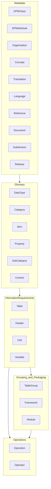
```mermaid
flowchart TB
  %% High-level component overview
  subgraph Metadata
    DPMClass[DPMClass]
    DPMAttribute[DPMAttribute]
    Organisation[Organisation]
    Concept[Concept]
    Translation[Translation]
    Language[Language]
    Reference[Reference]
    Document[Document]
    Subdivision[Subdivision]
    Release[Release]
  end

  subgraph Glossary
    DataType[DataType]
    Category[Category]
    Item[Item]
    Property[Property]
    SubCategory[SubCategory]
    Context[Context]
  end

  subgraph InformationRequirements
   Table[Table]
    Header[Header]
    Cell[Cell]
    Variable[Variable]
  end

  subgraph Grouping_and_Packaging
    TableGroup[TableGroup]
    Framework[Framework]
    Module[Module]
  end

  subgraph Operations
    Operation[Operation]
    Operator[Operator]
  end

  Metadata --> Glossary
  Glossary --> InformationRequirements
  InformationRequirements --> Grouping_and_Packaging
  InformationRequirements --> Operations
  Grouping_and_Packaging --> Operations
```

## 4 Metamodel , ownership and supportive documentation
### 4.1 Metamodel metadata, ownership, and supportive documentation
#### 4.1.1 Metamodel metadata entities
As presented on the left-hand side of Figure 1, DPM defines a few entities that provide information
about the metamodel itself. These entities comprise of:
-
DPMClass,
-
DPMAttribute,
-
DataType,
-
SubdivisionType,
-
Language,
-
Operator,
-
OperatorArgument
and are presented on Figure 2.

**Figure 2. Metamodel metadata entities.**

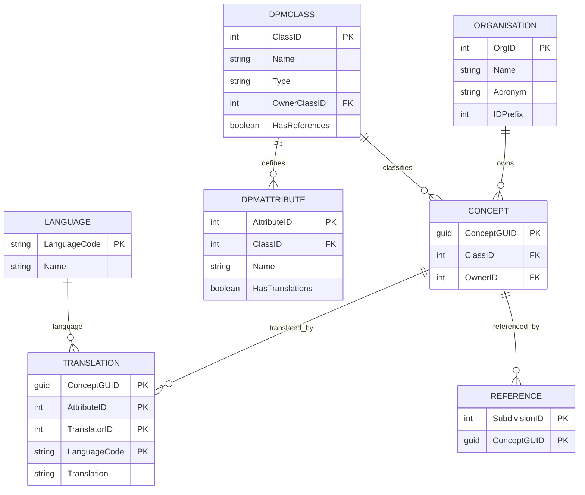
```mermaid
erDiagram
  ORGANISATION ||--o{ CONCEPT : owns
  DPMCLASS ||--o{ CONCEPT : classifies
  DPMCLASS ||--o{ DPMATTRIBUTE : defines
  CONCEPT ||--o{ TRANSLATION : translated_by
  LANGUAGE ||--o{ TRANSLATION : language
  CONCEPT ||--o{ REFERENCE : referenced_by

  ORGANISATION {
    int OrgID PK
    string Name
    string Acronym
    int IDPrefix
  }
  DPMCLASS {
    int ClassID PK
    string Name
    string Type
    int OwnerClassID FK
    boolean HasReferences
  }
  DPMATTRIBUTE {
    int AttributeID PK
    int ClassID FK
    string Name
    boolean HasTranslations
  }
  CONCEPT {
    guid ConceptGUID PK
    int ClassID FK
    int OwnerID FK
  }
  LANGUAGE {
    string LanguageCode PK
    string Name
  }
  TRANSLATION {
    guid ConceptGUID PK
    int AttributeID PK
    int TranslatorID PK
    string LanguageCode PK
    string Translation
  }
  REFERENCE {
    int SubdivisionID PK
    guid ConceptGUID PK
  }
```

Content of the metamodel metadata entities is predefined as described in the next sections of this
document, hence any changes can be introduced only by the DPM metamodel authors.
From the Modellers’ perspective these entities are fixed and must not be edited.
4.1.1.1
DPM Class and Attribute
DPMClass metamodel metadata entity lists of all entities of the DPM metamodel.
DPMClass.Name corresponds to the name of each entity in the metamodel.
Some entities listed in DPMClass are Concepts (4.1.2), i.e. these model entities that:

can be identified with and Owner or inherit Owner from other Concepts,

may have references (4.1.3.2),

contain attributes that are translatable (4.1.3.1).
Concepts are those DPM metamodel entities that have a single Primary Key. The only exception is
SubCategoryItem which has two keys, however it contains attributes that are translatable (4.1.3.1)
and therefore can be considered as a Concept.
DPMClasses whose DPMClass.HasReferences equals TRUE can be provided with references (as
described in 4.1.3.2).
DPMClasses which are Concepts may include DPMClass.OwnerClassID identifying another Concept
class from which their Owner is inherited (as described in 4.1.2).
Table 1 lists DPMClasses which are Concepts.
Name
Type
OwnerClass (inherited from)
HasReferences
Organisation
Independent

Yes
Category
Independent

Yes
Subcategory
Attributive

Yes
Property
SubType
Item
Yes
Item
Independent

Yes
Framework
Independent

Yes
Module
Attributive
Framework
Yes
ModuleVersion
Attributive
Module
Yes
TableGroup
Independent

Yes
Table
Independent

Yes
TableVersion
Attributive
Table
Yes
TableAssociation
Associative

Yes
Header
Attributive
Table
Yes
HeaderVersion
Attributive
Header
Yes
Cell
Associative
Table
Yes
Variable
Independent

Yes
VariableVersion
Attributive
Variable
Yes
CompoundKey
Independent

Yes
Context
Independent

Yes
Operation
Independent

Yes
OperationVersion
Attributive
Operation
Yes
OperationScope
Associative
Operation
Yes
Document
Independent

No
DocumentVersion
Attributive
Document
No.
Subdivision
Attributive
DocumentVersion
No
Release
Independent

Yes
SubCategoryItem
Associative
SubCategory
Yes
Table 1. List of DPMClasses that are Concepts, along with their attributes.
DPMAttribute metamodel metadata entity lists attributes of each metamodel entity from DPMClass.
DPMAttribute.Name corresponds to the name of attribute of entity in the metamodel.
The national language of the DPM models, at least for the EBA and EIOPA, applied on all entity
attributes such as Name, Description, Label, etc. is English. Attributes whose
DPMAttribute.HasTranslation equal TRUE (e.g. Name, Description, Label, etc.) can be provided with
translations to other national languages (4.1.3.1).
For representation of the OperationVersion.Expression the EBA and EIOPA use the DPM XL syntax.
However, using the same mechanism as for national languages translations, operations can be
represented in other syntaxes or formats (e.g. XBRL, SQL, Python).
The list of translatable attributes for each DPMClass is presented in Table 2.
Name
DPMClass
HasTranslations
Name
Category
Yes
Description
Category
Yes
Name
SubCategory
Yes
Description
SubCategory
Yes
Name
Item
Yes
Description
Item
Yes
Label
SubCategoryItem
Yes
Name
Framework
Yes
Description
Framework
Yes
Name
ModuleVersion
Yes
Description
ModuleVersion
Yes
Name
TableGroup
Yes
Description
TableGroup
Yes
Name
TableVersion
Yes
Description
TableVersion
Yes
Label
HeaderVersion
Yes
Name
TableAssociation
Yes
Description
TableAssociation
Yes
Name
VariableVersion
Yes
Description
OperationVersion
Yes
Expression
OperationVersion
Yes
Name
Document
Yes
TextExcerpt
Subdivision
Yes
Name
Organisation
Yes
Acronym
Organisation
Yes
Description
Release
Yes
Table 2. List of translatable DPMAttributes.
Relationship between DPMClass, DPMAttribute and Concept is presented on Figure 3.

**Figure 3. Concept, DPMClass and DPMAttribute entities.**

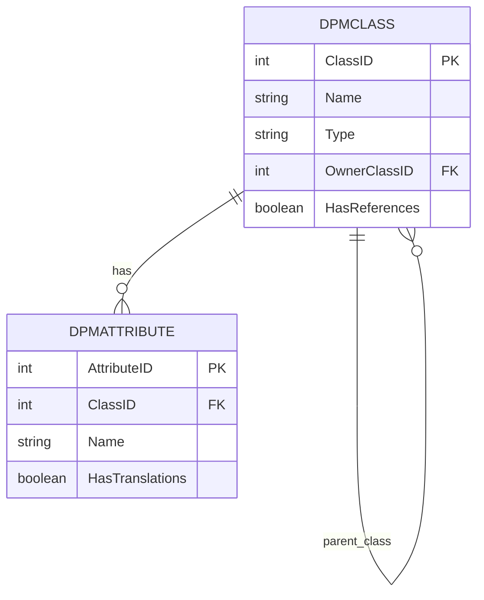
```mermaid
erDiagram
  DPMCLASS ||--o{ DPMATTRIBUTE : has
  DPMCLASS ||--o{ DPMCLASS : parent_class

  DPMCLASS {
    int ClassID PK
    string Name
    string Type
    int OwnerClassID FK
    boolean HasReferences
  }
  DPMATTRIBUTE {
    int AttributeID PK
    int ClassID FK
    string Name
    boolean HasTranslations
  }
```

4.1.1.2
Data Type
DataType entity provides the list of data types that can be used on the following metamodel entities:
-
Property (5.1.4),
-
OperationAttribute (Error! Reference source not found.).
As presented on Figure 2, each DataType is identified by Code and explained by Name.
The list of available data types is presented in see Table 3.
Code
Name
Parent Data Type
i
integer

r
decimal

s
string (non empty)
b
boolean

t
true
boolean
dt
date time

d
date
date time
e
enumeration
string
m
monetary

p
percentage

u
URI

o
ordinals

es
string (including empty string)

Table 3. List of data types.
Data types can be derived (by restriction) from one another. For example, True data type is a
restriction of a Boolean data type to only one value (i.e. Boolean TRUE).
DataType can be deactivated (4.2.3) by setting IsActive to FALSE which indicates that such
deactivated data type can no longer in use in modelling of metadata. Data types listed in Table 3 are
all active at the moment of release of this documentation.
4.1.1.3
Subdivision Type
SubdivisionType is used for structuring of references to documentation (4.1.3.2) and as presented on
Figure 4, is referred from Subdivision.

**Figure 4. SubdivisionType entity.**

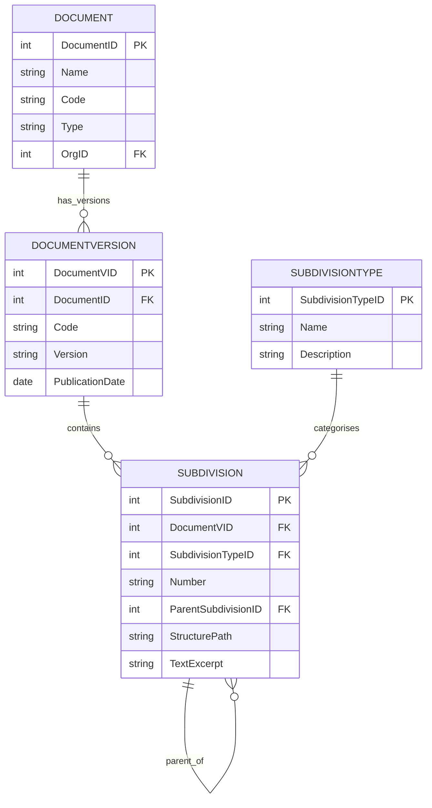
```mermaid
erDiagram
  DOCUMENT ||--o{ DOCUMENTVERSION : has_versions
  DOCUMENTVERSION ||--o{ SUBDIVISION : contains
  SUBDIVISIONTYPE ||--o{ SUBDIVISION : categorises
  SUBDIVISION ||--o{ SUBDIVISION : parent_of

  DOCUMENT {
    int DocumentID PK
    string Name
    string Code
    string Type
    int OrgID FK
  }
  DOCUMENTVERSION {
    int DocumentVID PK
    int DocumentID FK
    string Code
    string Version
    date PublicationDate
  }
  SUBDIVISIONTYPE {
    int SubdivisionTypeID PK
    string Name
    string Description
  }
  SUBDIVISION {
    int SubdivisionID PK
    int DocumentVID FK
    int SubdivisionTypeID FK
    string Number
    int ParentSubdivisionID FK
    string StructurePath
    string TextExcerpt
  }
```

SubdivisionType is identified by its Name and further explained by Description. The list of
SubdivisionTypes is presented in Table 4.
Name
Description
Chapter
For a publication that uses chapters, this part should be used to capture this information. Because chapters
are not necessarily numbers, this is a string.
Article
Article refers to a statutory article in legal material.
Section
Section is used to capture information typically captured in sections of legislation or reference documents.
Subsection
Subsection is a subsection of the section part.
Paragraph
Paragraph is used to refer to specific paragraphs in a document.
Subparagraph
Subparagraph of a paragraph.
Clause
Subcomponent of a sub paragraph.
Subclause
Subcomponent of a clause in a paragraph.
Appendix
Refers to the name of an Appendix, which could be a number or text.
Example
Example captures examples used in reference documentation; there is a separate element for Exhibits.
Page
Page number of the reference material.
Exhibit
Exhibit refers to exhibits in reference documentation; examples have a separate element.
Footnote
Footnote is used to reference footnotes that appear in reference information.
Sentence
In some reference material individual sentences can be referred to, and this allows them to be referenced.
URI
Full URI of the reference such as "http://www.fasb.org/fas133".
Requirement
A suggestion of a new model entry for consideration / to be addressed in the next releases.
Table 4. List of subdivision types.
4.1.1.4
Language
Language entity enables translation to different national languages (4.1.3) and therefore its content
is populated based on the ISO 639-1 alpha-2 language codes and names.
Additionally, it enables representation of Expressions of Operations (5.4.1) in various technical
implementations, e.g. SQL, XBRL, VTL, etc or other than DPM XL formal languages (syntaxes based
on specified grammar).
Language is identified by LanguageCode and its Name as presented on Figure 5.

**Figure 5. Language entity.**

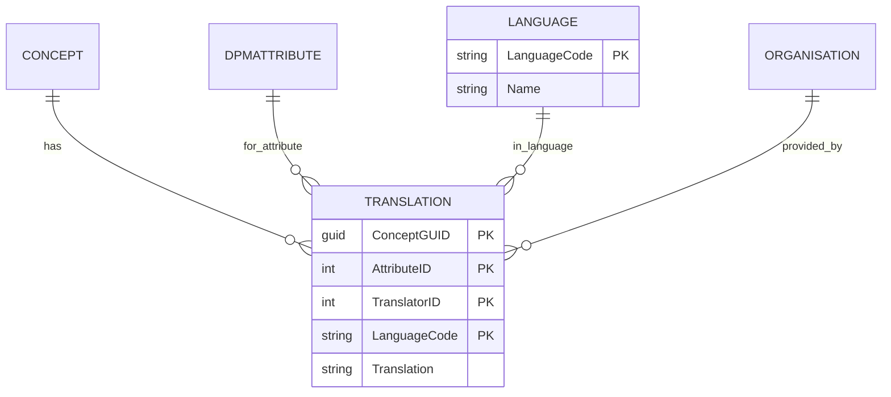
```mermaid
erDiagram
  CONCEPT ||--o{ TRANSLATION : has
  DPMATTRIBUTE ||--o{ TRANSLATION : for_attribute
  LANGUAGE ||--o{ TRANSLATION : in_language
  ORGANISATION ||--o{ TRANSLATION : provided_by

  TRANSLATION {
    guid ConceptGUID PK
    int AttributeID PK
    int TranslatorID PK
    string LanguageCode PK
    string Translation
  }
  LANGUAGE {
    string LanguageCode PK
    string Name
  }
```

4.1.1.5
Operator and Operator Argument
Operators (as presented on Figure 6) can applied by:
-
SubCategoryItem (to indicate arithmetic operations between Items in a SubCategory, see
5.1.3),
-
OperationNode (in which case Operators may be more complex and include multiple
OperatorArguments, see 5.4.1).
**Figure 6. Operator and OperatorArgument entities.**

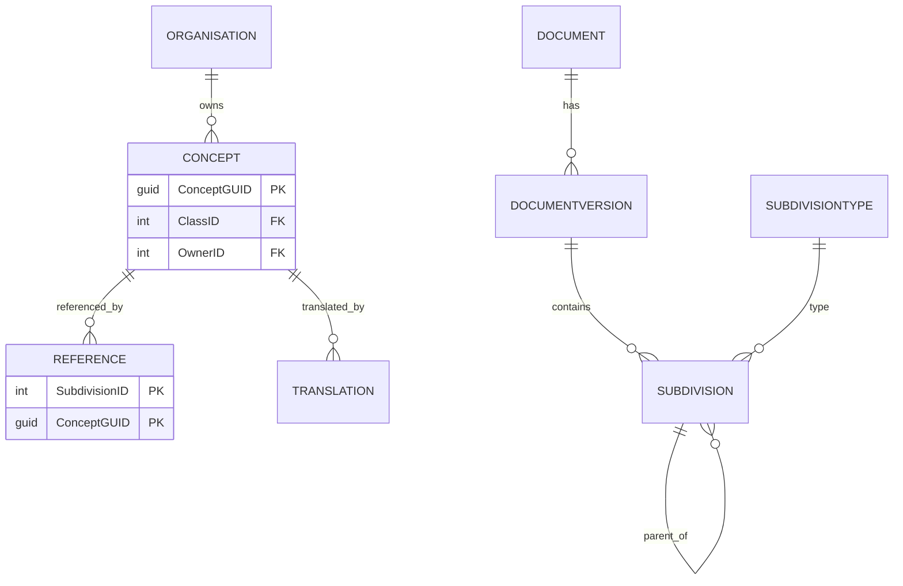
```mermaid
erDiagram
  ORGANISATION ||--o{ CONCEPT : owns
  CONCEPT ||--o{ REFERENCE : referenced_by
  CONCEPT ||--o{ TRANSLATION : translated_by

  DOCUMENT ||--o{ DOCUMENTVERSION : has
  DOCUMENTVERSION ||--o{ SUBDIVISION : contains
  SUBDIVISIONTYPE ||--o{ SUBDIVISION : type
  SUBDIVISION ||--o{ SUBDIVISION : parent_of

  CONCEPT {
    guid ConceptGUID PK
    int ClassID FK
    int OwnerID FK
  }
  REFERENCE {
    int SubdivisionID PK
    guid ConceptGUID PK
  }
```

The list of Operators is presented in Table 5.
Name
Symbol
Type
Unary plus
+
Numeric
Addition
+
Numeric
Division
/
Numeric
Unary minus
-
Numeric
Subtraction
-
Numeric
Absolute value
abs
Numeric
Numeric minimum
min
Numeric
Multiplication
*
Numeric
Numeric maximum
max
Numeric
Square root
sqrt
Numeric
Aggregate maximum
max_aggr
Aggregate
Aggregate minimum
min_aggr
Aggregate
Equal to
=
Comparison
Less than equal to
<=
Comparison
Greater than equal to
>=
Comparison
Element of
in
Comparison
Is null
isnull
Comparison
Greater than
>
Comparison
Less than
<
Comparison
Not equal to
!=
Comparison
Match characters
match
Comparison
And
and
Logical
Or
or
Logical
Not
not
Logical
Exclusive or
xor
Logical
Sum
sum
Aggregate
Count
count
Aggregate
Where
where
Clause
Name
Symbol
Type
Get
get
Clause
If then else
if-then-else
Conditional
Filter
filter
Conditional
Time shift
time_shift
Time
Rename
rename
Clause
RenameNode
node
Clause
Grouping clause
group by
Clause
Persistent assignment
<-
Assignment
Table 5. List of Operators.
As presented on Figure 6, more complex Operators are composed of multiple arguments. The list of
OperatorArguments is provided in Table 6.
Operator (FK)
Order
IsMandatory
Name
Unary plus

operand
Addition

left
Addition

right
Division

left
Division

right
Unary minus

operand
Subtraction

left
Subtraction

right
Absolute value

operand
Numeric minimum

operand
Multiplication

left
Multiplication

right
Numeric maximum

operand
Square root

operand
Aggregate maximum

operand
Aggregate maximum

grouping_clause
Aggregate maximum

component
Aggregate minimum

operand
Aggregate minimum

grouping_clause
Aggregate minimum

component
Equal to

left
Equal to

right
Less than equal to

left
Less than equal to

right
Greater than equal to

left
Greater than equal to

right
Element of

operand
Element of

set
Is null

operand
Greater than

left
Greater than

right
Less than

left
Less than

right
Not equal to

left
Not equal to

right
Match characters

operand
Match characters

pattern
And

left
And

right
Or

left
Or

right
Not

operand
Exclusive or

left
Exclusive or

right
Sum

operand
Operator (FK)
Order
IsMandatory
Name
Sum

grouping_clause
Sum

component
Count

operand
Count

grouping_clause
Count

component
Where

operand
Where

condition
Get

operand
Get

component
If then else

condition
If then else

then
If then else

else
Filter

selection
Filter

condition
Time shift

operand
Time shift

period_indicator
Time shift

shift_number
Time shift

dimension
Rename

operand
Rename

node
RenameNode

old_name
RenameNode

new_name
Table 6. List of OperatorArguments.
#### 4.1.2 Concept and Ownership
As explained in the previous section, information requirements and hence data models are
developed by various authorities. It is therefore necessary to identify Organisation that defined a
given classification, business term, data set, table, etc, and is responsible for its maintenance.
For this purpose, among others, DPM defines Concept entity that represents any identifiable object
in a model (i.e. receiving Code/Name assigned by a modeller). In technical terms – all metamodel
entities that have a single primary key are Concepts (it is important to note though, that some of
such entities are merely versions of another object in time - 4.2.1). As Concepts are also prescribed
by the metamodel for managing references (4.1.3.2) and translations (4.1.3.1), all DPMClasses
(4.1.1.1) who have HasReferences set to TRUE or of which at least one attribute has HasTranslations
set to TRUE, are also represented in the model as Concepts.
All metamodel entities have RowGUID attribute16 which is globally unique. This identifier is referred
from Concept.GUID.

## 16 It is also used for the log of changes (non-normative part of the model, see 0).
**Figure 7. Concepts**

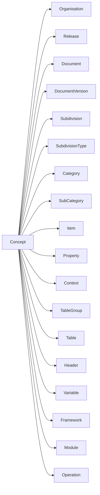
```mermaid
flowchart LR
  Concept --> Organisation
  Concept --> Release
  Concept --> Document
  Concept --> DocumentVersion
  Concept --> Subdivision
  Concept --> SubdivisionType
  Concept --> Category
  Concept --> SubCategory
  Concept --> Item
  Concept --> Property
  Concept --> Context
  Concept --> TableGroup
  Concept --> Table
  Concept --> Header
  Concept --> Variable
  Concept --> Framework
  Concept --> Module
  Concept --> Operation
```

As presented on Figure 8, Concept can be assigned with an Owner indicating Organisation that has
defined and manages it. DPM metamodel restricts each Concept to have one and only one Owner.
**Figure 8. Concept as DPMClass and its Owner Organisation.**

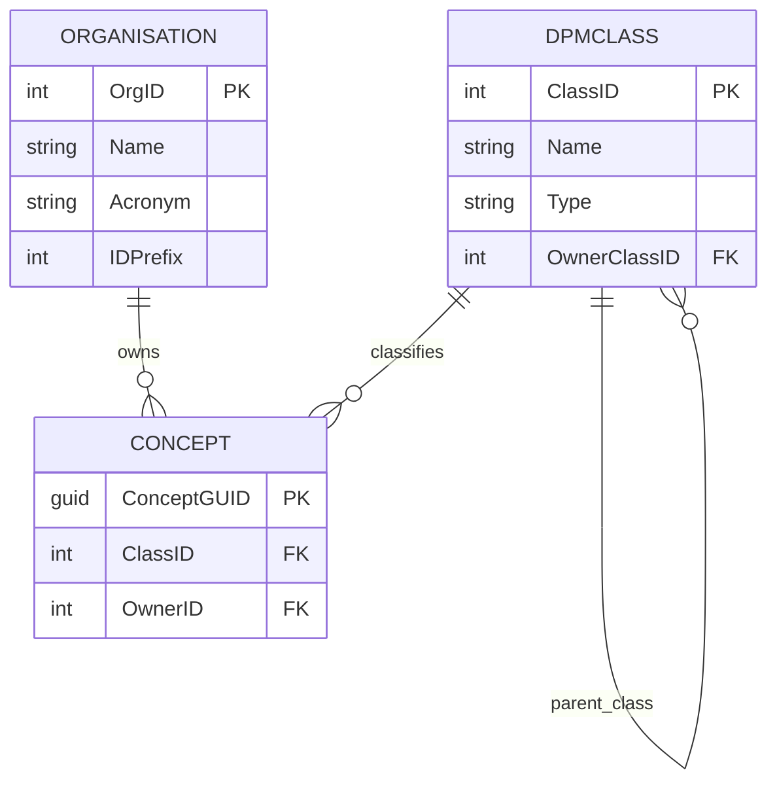
```mermaid
erDiagram
  ORGANISATION ||--o{ CONCEPT : owns
  DPMCLASS ||--o{ CONCEPT : classifies
  DPMCLASS ||--o{ DPMCLASS : parent_class

  ORGANISATION {
    int OrgID PK
    string Name
    string Acronym
    int IDPrefix
  }
  DPMCLASS {
    int ClassID PK
    string Name
    string Type
    int OwnerClassID FK
  }
  CONCEPT {
    guid ConceptGUID PK
    int ClassID FK
    int OwnerID FK
  }
```

For some Concepts information about Owner is inherited from other Concepts. This is identified by
DPMClass.OwnerClassID and documented in Table 1. Modellers are therefore enabled to assign
Owner only for Concepts not having parent class while any children of an upper-level class inherit
this information from their parent (i.e. their Owner is the same as the Owner of their parent
DPMClass).
Owner Organisations are described by their Name and Acronym (e.g. “European Banking Authority”
and “EBA” respectively). Organisation is a Concept itself and therefore these attributes are
translatable (4.1.3.1).
It is possible that one Organisation may indicate itself as Owner of Concepts that are not yet defined
in DPM model by their legitimate Owners (for example standardisation organizations such as ISO,
LEI, IFRS, etc). Should such Concepts be subsequently added by their rightful Owners, DPM
metamodel enables linking such definitions to existing duplicates using ConceptRelation entity
(4.1.4).
For technical reason it is considered that all identifiers (primary key IDs of all metamodel entities) in
the physical database implementation are unique for each Concept. This shall simplify the process of
merging models from various databases maintained individually by different Organisations. To
achieve this, the first three digits of any ID indicate the Owner (as prescribed by
Organisation.IDPrefix) while the other digits ensure uniqueness for each DPMClass for that Owner
(e.g. sequential numbers).
DPM Metamodel contains predefined Organisations as illustrated in Table 7.
Name
Acronym
IDPrefix
DPM Metamodel
DPMM

European Banking Authority
EBA

European Insurance and Occupational Pensions Authority
EIOPA

Table 7. DPM Metamodel predefined Organisations.
DPM Metamodel Organisation host definitions of “Properties”, “Not applicable” and “Templates”
Categories (5.1.1).
#### 4.1.3 Supportive documentation
4.1.3.1
Translations
The primary language of modelling, at least for the EBA and EIOPA DPM models, is English.
Therefore, all attributes like Name, Label, Description, Value, etc across all DPM metamodel entities
are provided in English.
Attributes that are expected or enabled to be translatable are marked as
DPMAttribute.HasTranslation equal TRUE (4.1.1.1).
As presented on Figure 9, Translation identifies Concept (Translation.ConceptID, 4.1.2) along with
translated attribute of this Concept (Translation.AttributeID, 4.1.1.1), the national language of
translation (Translation.LanguageCode, 4.1.1.4) and the Organisation that provided and manages
this translation (Translation.TranslatorID, 4.1.2). It is therefore possible that an attribute of a
Concept has more than one translation defined by different Organizations in one language.

**Figure 9. Concepts' attributes translations.**

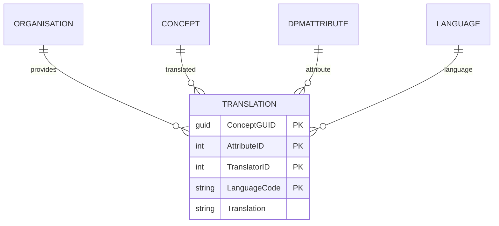
```mermaid
erDiagram
  ORGANISATION ||--o{ TRANSLATION : provides
  CONCEPT ||--o{ TRANSLATION : translated
  DPMATTRIBUTE ||--o{ TRANSLATION : attribute
  LANGUAGE ||--o{ TRANSLATION : language

  TRANSLATION {
    guid ConceptGUID PK
    int AttributeID PK
    int TranslatorID PK
    string LanguageCode PK
    string Translation
  }
```

4.1.3.2
References to documentation
Information requirements result from various documents: legal acts, regulations, standards, change
requests, requirements, etc. Concepts (4.1.2) belonging to DPMClasses whose HasReferences equals
TRUE (4.1.1.1) can be associated with references containing their definitions, guidelines, or other
explanation.
**Figure 10. References.**

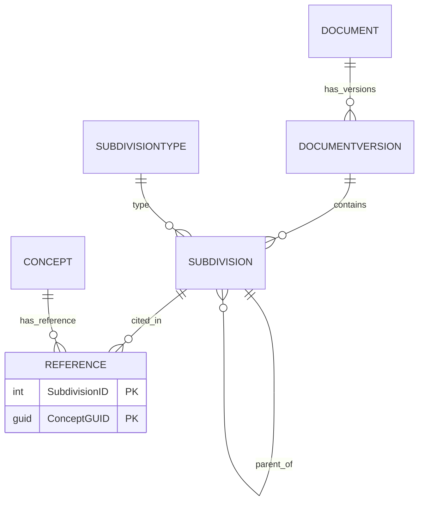
```mermaid
erDiagram
  DOCUMENT ||--o{ DOCUMENTVERSION : has_versions
  DOCUMENTVERSION ||--o{ SUBDIVISION : contains
  SUBDIVISIONTYPE ||--o{ SUBDIVISION : type
  SUBDIVISION ||--o{ SUBDIVISION : parent_of
  SUBDIVISION ||--o{ REFERENCE : cited_in
  CONCEPT ||--o{ REFERENCE : has_reference

  REFERENCE {
    int SubdivisionID PK
    guid ConceptGUID PK
  }
```

As presented on Figure 10, Document identifies a piece of legislation (e.g. EU Directive, ITS, etc) or
other report by its Name and (optionally) Code. Type informs on the kind of the Document (e.g.
“legal_document”, “change_request”). DocumentVersion serves historization purposes and indicates
PublicationDate and Version information of Document along with its Code which may also vary in
time.
As explained in section 4.1.1, SubdivisionType provides a list of typical parts that structure a piece of
a legislation or other report. They are used in Subdivision to resemble arrangement and structure of
Document by providing ability to refer to any individual Subdivision by its Number and providing
means of nesting them in higher-level Subdivisions (hence hierarchical structure of
Subdivision.ParentSubdivisonID). Complete address of Subdivision position in the document is also
provided by Subdivision.StructurePath.
Subdivision (typically leaf-level) may contain the actual wording of the document fragment it
represents (Subdivision.TextExcerpt).
Subdivisions are linked to Concepts via Reference (one Concept can have many References and one
Reference can be reused across many Concepts).
Document, DocumentVersion and Subdivision are Concepts and therefore can have Owner
(DocumentVersion and Subdivision inherits Owner from Document as per Table 1) and some of their
attributes (e.g. TextExcerpt) can have translations (see Table 2 and section 4.1.3.1).
#### 4.1.4 Concept relation
DPM metamodel provides means for Concepts to be related to one another by means of
ConceptRelation that can be referred from all RelatedConcepts as presented on Figure 11.
This generic approach enables linking Concepts within and across Owners and/or representing
various DPMClasses (4.1.1.1). For example, it can be used to connect identical Concepts defined by
different Owners, or to identify the same Concept but modelled differently or even at different
modelling levels (e.g. in logical and physical implementation).

**Figure 11. Concept and ConceptRelation.**

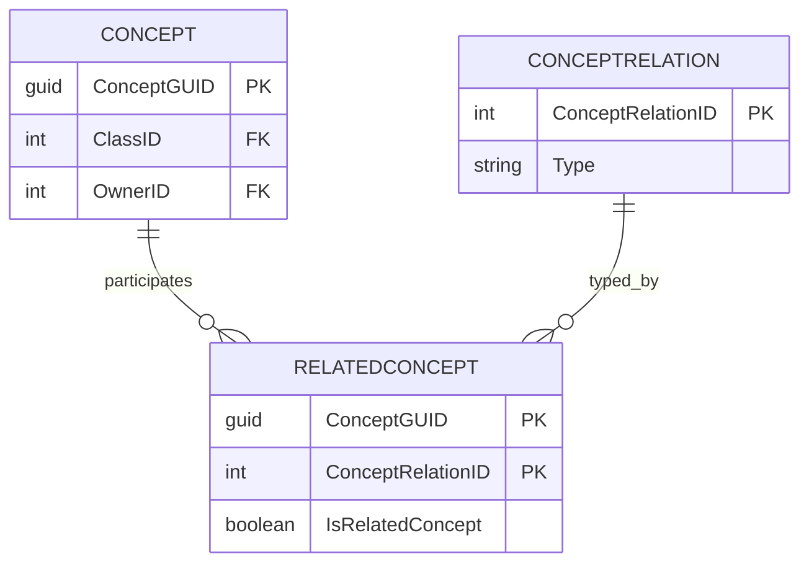
```mermaid
erDiagram
  CONCEPT ||--o{ RELATEDCONCEPT : participates
  CONCEPTRELATION ||--o{ RELATEDCONCEPT : typed_by

  CONCEPT {
    guid ConceptGUID PK
    int ClassID FK
    int OwnerID FK
  }
  CONCEPTRELATION {
    int ConceptRelationID PK
    string Type
  }
  RELATEDCONCEPT {
    guid ConceptGUID PK
    int ConceptRelationID PK
    boolean IsRelatedConcept
  }
```

If a relation has a direction, RelatesConcept.IsRelatedConcept equal TRUE identifies a Concept at the
target of this relation, otherwise it is FALSE (default value) for relation’s source Concept or in case
relation has no direction/is bidirectional.
ConceptRelaton.Type identifies the type of relation. There are three generic relation types (i.e. that
can be applied to various classes of Concepts - 4.1.1.1):
-
“equivalent_concept” indicate that Concepts linked through such relation type (whatever
DPMClass they represent) are semantically the same. This relation is bidirectional hence
IsRelatedConcept is FALSE for all RelatedConcepts,
-
“version_fix” and “version_new” applies typically to Versions of various Concepts (e.g.
ModuleVersions, TableVersions or HeaderVersions) and informs that the target of the
relation is created:
o to correct a modelling problem (“version_fix”) of the source Concept or
o as an evolution of the source Concept (“version_new”) due to e.g. revision of
information requirements;
This information along with Releases (4.2.1) is essential in determining applicability of
glossary (5.1) Concepts in modelling of rendering (5.2.1) and Variables (5.3.1) in time.
In addition to the above three generic relation types, DPM metamodel predefines also relation types
that can be used to relate specific Concepts, i.e.:
-
SubCategories – “subCategoryMaster_version” and “subCategoryRendering_version” (5.1.3),
-
Variables – “factVariable_keyVariable” and “variable_attributeVariable” (5.3.1),
-
Tables – “table_variant” (5.2.1.1).
Detailed semantics of these relation types are explained in the referred sections.
Modellers can extend ConceptRelation.Type with other options that they need or find useful.
### 4.2 Historisation
Information requirements may change in time. Updates to the DPM models can be published by
their authors in scheduled or ad hoc manner.
Moreover, Modellers may decide to modify the way they represent glossary terms or information
requirements e.g. due to bug fixes or to improve the model during periodic revisions. Some Concepts
(4.1.2) can therefore become obsolete in time. However, to enable resubmissions of data for past
periods or to support time series analysis, Concepts of published models are never deleted as it shall
always be possible by reading the model to learn the modelling and information requirements
applicable at any moment of time.
#### 4.2.1 Releases
Release represents each publication of a model17. Each Release is identified by Code and Date.
As presented on Figure 12, Release is applied to metamodel entities which can be:

versions of certain classes of Concepts, i.e:
o SubCategoryVersion,
o TableVersion,
o HeaderVersion,
o VariableVersion,
o ModuleVersion,
o OperationVersion,

connections between Concepts:
o ItemCategory,
o PropertyCategory,
o SuperCategoryComposition,
o TableGroupCompositon,
o CompountItemContext,

individual Concepts life cycle: TableGroup.
The purpose of Release is to support documenting evolution of Concepts or their composition and to
help identifying how a glossary term, a table content or a variable was represented at a point in
time.

## 17 This is typically an external publication i.e. in a public repository or on the website of the model author
organisation, however it may be also used to support internal workflows and processes withing these
organisations.
**Figure 12. Metamodel entities whose historization is supported by reference to Release.**

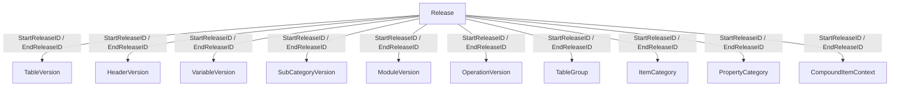
```mermaid
flowchart TB
  Release[Release] -->|StartReleaseID / EndReleaseID| TableVersion[TableVersion]
  Release -->|StartReleaseID / EndReleaseID| HeaderVersion[HeaderVersion]
  Release -->|StartReleaseID / EndReleaseID| VariableVersion[VariableVersion]
  Release -->|StartReleaseID / EndReleaseID| SubCategoryVersion[SubCategoryVersion]
  Release -->|StartReleaseID / EndReleaseID| ModuleVersion[ModuleVersion]
  Release -->|StartReleaseID / EndReleaseID| OperationVersion[OperationVersion]
  Release -->|StartReleaseID / EndReleaseID| TableGroup[TableGroup]
  Release -->|StartReleaseID / EndReleaseID| ItemCategory[ItemCategory]
  Release -->|StartReleaseID / EndReleaseID| PropertyCategory[PropertyCategory]
  Release -->|StartReleaseID / EndReleaseID| CompoundItemContext[CompoundItemContext]
```

On all entities where it applies, Release is referenced twice, mandatorily as StartRelease and
optionally as EndRelease. Additionally, in ItemCategory and PropertyCategory, StartRelease is part of
their primary key. In cases where StartRelease is not part of the primary key, the metamodel
employs as Primary Key one-field ID for this specific concept version. Alternatively, this Primary Key
could be the combination (Version_Invariant_ID, StartRelease). For example, in TableVersion the
Primary Key is TableVID but it could also be TableID and StartReleaseID instead. To make it explicit
on DPM Refit implementation level, one can define a Unique Index containing the alternate Primary
Keys whenever required (note that an exception to this is StartRelease in TableGroup in which case
StartRelease has an informational role only).
As a Concept (4.1.2), Release can be assigned with an Owner, and can be linked to Reference (4.1.3.2)
while its Name and Description attributes are translatable (4.1.3.1).
IsCurrent flag indicates a Release that in a given publication of the model is the most recent one.
DPM does not impose any specific semantic versioning approach. Instead, it shall be driven by
individual requirements of modellers, their organisations and the life cycle of information
requirements represented in the model. In case when subsequent Releases may introduce changes
to past (not only the direct preceding) Releases and modellers decide to track this information
(instead of correcting/updating these past Release), it may be necessary to employ in addition the
“version_fix” and “version_new” Concept relationship types (4.1.4). Reference and submission dates
(4.2.2) also play an important role in determining Concepts’ applicability.
Releases, by design, do not address model administration purposes i.e. storing of creation or
modification timestamps, reflecting a workflow or stages of the development process (internal and
public working drafts). Neither are the Releases aimed at supporting handling of temporary
metadata (e.g. work-in-progress modelling along with internal comments). The latter however can
be reflected in the log of changes (4.2.5).
#### 4.2.2 Application dates
Life cycle of certain model Concepts does not necessarily follow publication timelines or dates
indicated by Release (4.2.1). This applies in particular to Modules (5.2.2.2) that may be indicated as
applicable for reporting from a point of time in the future or until a specified date, independent from
the model publication. For this reason, ModuleVersion definition contains FromReferenceDate
attribute and may include ToReferenceDate attribute as presented on Figure 13.

**Figure 13. Metamodel entities with “from” and “to” application dates.**

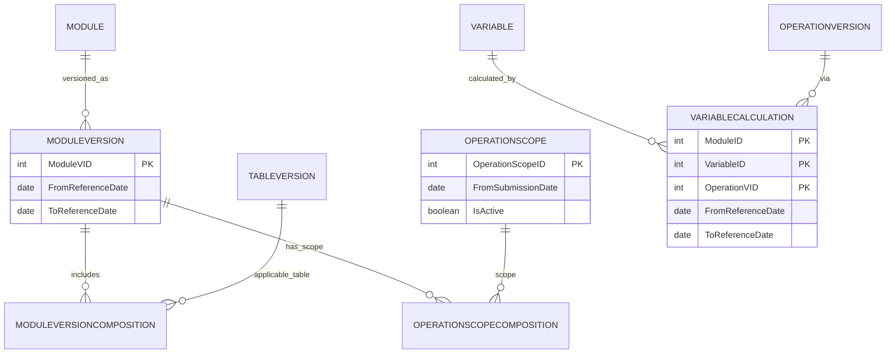
```mermaid
erDiagram
  MODULEVERSION ||--o{ MODULEVERSIONCOMPOSITION : includes
  TABLEVERSION ||--o{ MODULEVERSIONCOMPOSITION : applicable_table
  MODULEVERSION ||--o{ OPERATIONSCOPECOMPOSITION : has_scope
  OPERATIONSCOPE ||--o{ OPERATIONSCOPECOMPOSITION : scope
  VARIABLE ||--o{ VARIABLECALCULATION : calculated_by
  OPERATIONVERSION ||--o{ VARIABLECALCULATION : via
  MODULE ||--o{ MODULEVERSION : versioned_as

  MODULEVERSION {
    int ModuleVID PK
    date FromReferenceDate
    date ToReferenceDate
  }
  OPERATIONSCOPE {
    int OperationScopeID PK
    date FromSubmissionDate
    boolean IsActive
  }
  VARIABLECALCULATION {
    int ModuleID PK
    int VariableID PK
    int OperationVID PK
    date FromReferenceDate
    date ToReferenceDate
  }
```

Similar independence from the model publication date applies to Operations (5.4.1). A version of a
data quality check can be indicated as applicable for reports submitted after a certain date
(OperationScope.FromSubmissionDate) while transformation rules execution can be constrained by
reference dates (VariableCalculation.FromReferenceDate and VariableCalculation.ToReferenceDate).
These dates support model users in understanding the scope of reportable information at any
moment of time: any date falls in some reference period of a ModuleVersion and hence the
applicable TableVersions and OperationVerisons are those attached to it via
ModuleVersionComposition and OperationScopeComposition respectively. In case of the latter, users
shall also consider the status (as the OperationVersion as it can be deactivated, see 4.2.3) and if a
report is to be sent after the OperationScope.FromSubmissionDate.
#### 4.2.3 Deactivations
As presented Figure 14, the following metamodel entities: DataType, Category and Item (hence
indirectly also Property) can be marked as deactivated by setting IsActive attribute to FALSE. This
deactivation implies that they must not be used in modelling of any future information
requirements.

**Figure 14. Metamodel metadata and glossary entities containing IsActive attribute enabling their deactivation.**

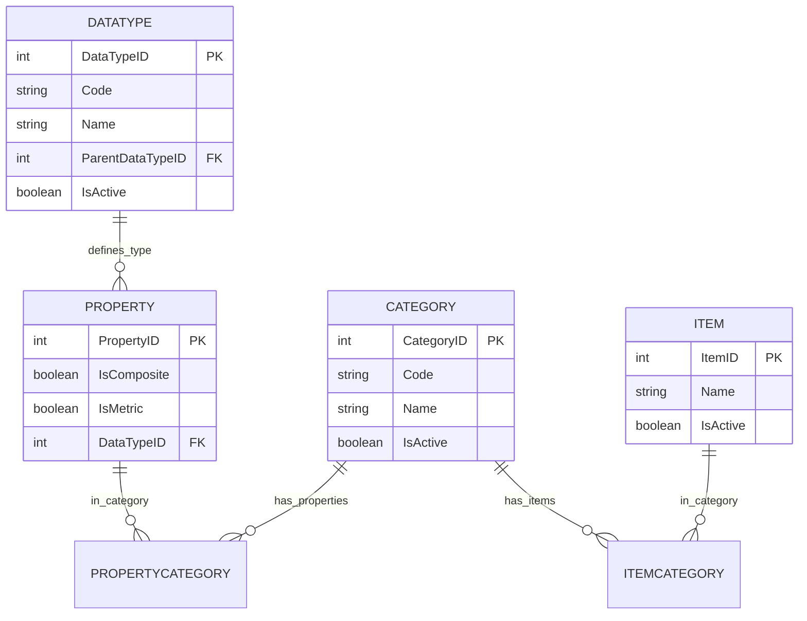
```mermaid
erDiagram
  DATATYPE ||--o{ PROPERTY : defines_type
  CATEGORY ||--o{ ITEMCATEGORY : has_items
  ITEM ||--o{ ITEMCATEGORY : in_category
  CATEGORY ||--o{ PROPERTYCATEGORY : has_properties
  PROPERTY ||--o{ PROPERTYCATEGORY : in_category

  DATATYPE {
    int DataTypeID PK
    string Code
    string Name
    int ParentDataTypeID FK
    boolean IsActive
  }
  CATEGORY {
    int CategoryID PK
    string Code
    string Name
    boolean IsActive
  }
  ITEM {
    int ItemID PK
    string Name
    boolean IsActive
  }
  PROPERTY {
    int PropertyID PK
    boolean IsComposite
    boolean IsMetric
    int DataTypeID FK
  }
```

IsActive attribute is also present on OperationScope (see Figure 13) where it determines if
OperationVersion (referred from the OperationScope) shall apply to a ModuleVersion (linked to
OperationScope via OperationScopeComposition) for any reports sent after the
OperationScope.FromSubmissionDate.
In contrast to DataType and glossary Concepts where deactivation is final, OperationScope enables
re-activation of OperationVersion for ModuleVersion.
#### 4.2.4 Dependencies
Historisation dependencies follow the dependencies between entities in the metamodel (identified
for example by Ownership inheritance, see 4.1.1.1, 4.1.2). For example, deactivating of Category
results in deactivation of all Items, SubCategories and Properties associated with it (unless they are
reassigned to another Category). It is also expected that assigning Concept with EndRelease shall
impact EndRelease of all dependent Concepts. For example, Property (represented as Item) with
EndRelease for a given Category must not be used with Items of that Category on any TableVersion
or HeaderVersion in any subsequent release. Same applies for StartRelease which indicates a first
published version starting from which a glossary Concept can be used in description of Tables or
Variables. The rule does not have to be obeyed for bug fixing of past versions or non-glossary
Concepts. For example, ModuleVersion may refer to TableVersions that don’t exist for a Release for
which a ModuleVersion is defined (for example to reintroduce a Table that was replaced in some
previous Release by another version).
#### 4.2.5 Log of changes (non-normative)
EBA and EIOPA introduced in the DPM Refit metamodel a non-normative (i.e., not aimed to become
part of the DPM standard) component to store information about changes made in models.
ChangeLog entity contains information about modifications made to the content of model entities or
their attributes. In case it is published with a model, it may contain all alterations (including
temporary modelling) or be limited only to final changes (e.g., difference between the published
Releases).
As presented on Figure 15, ChangeLog indicates a Timestamp for each modification made and an
individual User who introduce this modification. This latter information is aimed at internal use only,
not to be shared in the public releases.

**Figure 15. Change log component (non-normative).**

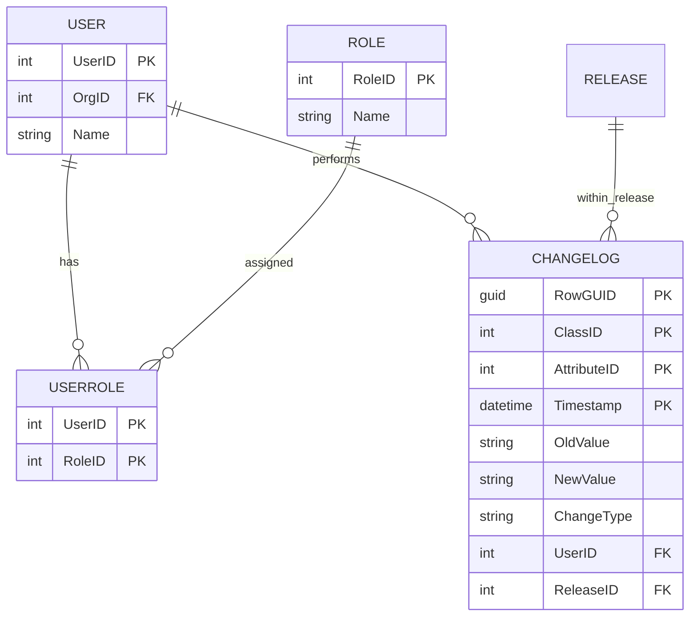
```mermaid
erDiagram
  USER ||--o{ USERROLE : has
  ROLE ||--o{ USERROLE : assigned
  USER ||--o{ CHANGELOG : performs
  RELEASE ||--o{ CHANGELOG : within_release

  CHANGELOG {
    guid RowGUID PK
    int ClassID PK
    int AttributeID PK
    datetime Timestamp PK
    string OldValue
    string NewValue
    string ChangeType
    int UserID FK
    int ReleaseID FK
  }
  USER {
    int UserID PK
    int OrgID FK
    string Name
  }
  ROLE {
    int RoleID PK
    string Name
  }
  USERROLE {
    int UserID PK
    int RoleID PK
  }
```

In order for the ChangeLog to contain modifications to all DPM metamodel entities (i.e., not only to
those representing Concepts but also those containing associations of Concepts and many-to-many
relationships) and refer to them using a single identifier, each entity in the physical implementation
of the metamodel contains RowGUID attribute which is a unique identifier referenced by
ChangeLog.RowGUID.
### 4.3 Derivation
In is assumed that majority of the metamodel entities is populated by Modellers, most likely with
support of dedicated tooling (e.g., DPM Studio). Several entities however, depending on the
modelling process applied, can be computed based on entries from other entities. This concerns for
example generation (and suggestion for reuse) of Variables (5.3.5) for Table Headers or Cells, or
assembling Property-Item pairs in Contexts when defining Table Headers as well as automated reuse
of existing ContextCompositons (5.1.5)
### 4.4 Naming convention
Majority of metamodel entities that are Concepts are identified by Modellers by their Code and
Name.
Name is a short, but at the same time meaningful and distinguishable human readable description of
a given Concept. Name shall be unique in the context of a given DPMClass. For example, Item.Name
shall be unique within a Category it belongs but not necessarily across all Categories to allow for
homonyms.
Codes can be meaningless and take alphanumeric sequence unless they are clearly defined in
underlying information requirements (e.g. Table and their row/column codes) or in cases, when
according to some convention, they can be abbreviations of Name (e.g., capitalised starting letters of
each word of Name) or follow commonly applied codes (e.g. ISO codes for countries, currencies,
NACE codes, etc). Codes for each DPMClass must be unique for an Owner. For example, one
Category must not have two or more Items with the same Code, unless these Items are defined by
different Owners.
Many Concepts can be also assigned with Description which is a more verbose explanation of the
meaning of this Concept.
Specific implementations may restrict the length and format of Codes, Names and Descriptions to
follow database type constraints or replace disallowed characters unsupported by a given
technology (e.g., XML).
## 5 Metamodel components
As described in chapter 3 of this document, DPM metamodel consists of four main components.
Sections of this chapter explain each of these components in detail, one by one. Links embedded in
text shall help navigation as components are heavily interrelated.
### 5.1 Glossary
The purpose of the Glossary component is to enable definition and management of terms and
notions that are later used to describe information requirements.
As presented on Figure 16 and explained in the next sections, Glossary consist of Categories (5.1.1)
that in turn comprise of Items (5.1.2). Items of Category can be grouped in SubCategories (5.1.3)
belonging to this Category. Items in SubCategories can be arranged in hierarchies
(SubcategoryItem.ParentItemID). SubCategories may be related to one another (by means of
ConceptRelations - 4.1.4). Property (5.1.4) may be associated to Category and as a consequence
provide perspective for Items of this Category when applied in description of information
requirements (in Tables - 5.2.1.1, their Headers - 5.2.1.2, or Cells - 5.2.1.3, and in Variables - 5.3.3).
Each Property is also an Item of a dedicated Category (e.g., to enable their grouping in SubCategories
for further use as restrictions of information requirements). Category can comprise of other
categories (SuperCategoryComposition - 5.1.7). Compound Items (5.1.6) can be constructed from
Property-Item pairs (Context and ContextComposition - 5.1.5).
**Figure 16. Glossary component entities and relations.**

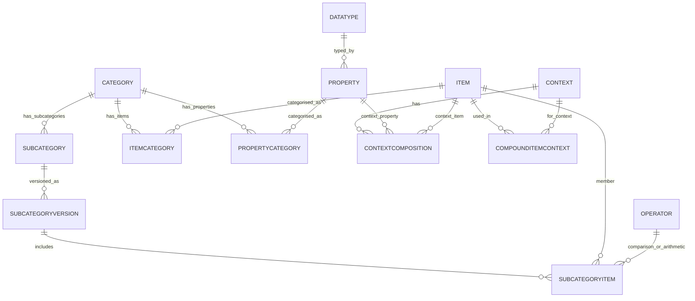
```mermaid
erDiagram
  DATATYPE ||--o{ PROPERTY : typed_by
  CATEGORY ||--o{ SUBCATEGORY : has_subcategories
  CATEGORY ||--o{ ITEMCATEGORY : has_items
  CATEGORY ||--o{ PROPERTYCATEGORY : has_properties
  ITEM ||--o{ ITEMCATEGORY : categorised_as
  PROPERTY ||--o{ PROPERTYCATEGORY : categorised_as
  SUBCATEGORY ||--o{ SUBCATEGORYVERSION : versioned_as
  SUBCATEGORYVERSION ||--o{ SUBCATEGORYITEM : includes
  ITEM ||--o{ SUBCATEGORYITEM : member
  CONTEXT ||--o{ CONTEXTCOMPOSITION : has
  PROPERTY ||--o{ CONTEXTCOMPOSITION : context_property
  ITEM ||--o{ CONTEXTCOMPOSITION : context_item
  ITEM ||--o{ COMPOUNDITEMCONTEXT : used_in
  CONTEXT ||--o{ COMPOUNDITEMCONTEXT : for_context

  OPERATOR ||--o{ SUBCATEGORYITEM : comparison_or_arithmetic
```

#### 5.1.1 Category
Categories typically represent (code) lists of items sharing common semantics or grouped based on
their similar nature. These Items (5.1.2) can be defined in the model, one-by-one, in which case
Category is enumerated (IsEnumerated set to TRUE). Alternatively, Category can serve only as a
“placeholder” for such values, and not name them individually, which results in a not enumerated
Category (IsEnumerated set to FALSE). The content of not enumerated Category is either not known
for Modellers (as it can be for example reporting entity specific) or it is impractical to list all its values
as Items due to their large number or due to high and frequent volatility of its composition.
**Figure 17. Category, Property and Item.**

```mermaid
erDiagram
  CATEGORY ||--o{ ITEMCATEGORY : has_items
  ITEM ||--o{ ITEMCATEGORY : in_category
  CATEGORY ||--o{ PROPERTYCATEGORY : has_properties
  PROPERTY ||--o{ PROPERTYCATEGORY : in_category
  PROPERTY ||--o{ ITEM : implemented_as

  CATEGORY { int CategoryID PK }
  ITEMCATEGORY { int ItemID PK; int StartReleaseID PK; int CategoryID FK }
  PROPERTYCATEGORY { int PropertyID PK; int StartReleaseID PK; int CategoryID FK }
  PROPERTY { int PropertyID PK; int DataTypeID FK }
  ITEM { int ItemID PK; boolean IsProperty }
```

As presented on Figure 17, Categories are also associated with Properties (5.1.4) via
PropertyCategory entity.
In case of enumerated Category, Properties related to it provide perspective to Items from this
Category when used in description of information requirements. For example, “Spain” Item of
“Countries” Category can be associated with “Issuer residence” Property but also with “Broker
residence” or “Location of stock exchange” Properties when describing a single piece of reportable
information (a Variable – see 5.3.1).
Non enumerated Category may gather Properties providing similar type of characteristic when used
in description of information requirements. These could be for example different types of codes that
identify instruments (e.g. ISIN, SEDOL, CUSIP, etc) or entities (e.g. LEI, Tax Identification Numbers,
etc). Non enumerated Category may also gather quantitative Properties.
There are three Categories predefined in the DPM Metamodel and hosted by the DPM Metamodel
Owner (Table 8).
Code
Name
Description
_PR
Properties
Contains Items (5.1.2) which are counterparts of Properties (5.1.4) in physical implementation of
the DPM metamodel.
_NA
Not applicable
Contains Items which do not belong to any specified Category such as those that are typically
used only in dropdowns on Headers or Variables. It is also linked by Properties that do not
belong to any real Category. Such enumerated Properties can refer to Items from Categories:
"Not applicable", "Properties" and in such case they can also use Items of other Categories, in
particular by being linked to such mixed SubCategory (5.1.3). It is not a semantically meaningful
Category.
_TE
Templates
Contains Items which represent Templates (TableGroups - 5.2.1.4 or Tables - 5.2.1.1) for
purposes of resembling Filing indicator Variables (5.3.2).
Table 8. Predefined DPM Metamodel Categories.
Category can refer to external data (IsExternalRefData set to TRUE) identified in such case by
RefDataSource. This could be, for example, so called ‘master’ data (e.g. information about reporting
entities and their reporting obligations) or reference data (registries of companies, information
associated with LEI, list of instruments by ISIN codes, etc.). Such information can be used by
Operations that handle external data (5.4.2).
Category whose Category.IsSuperCategory is set to TRUE is a Super Category (5.1.7).
Modellers identify Categories by Code and Name and may provide Description (4.4).
Category is a Concept and must be assigned with Owner (4.1.2). It can be linked to Reference
(4.1.3.2) and its Name and Description attributes are translatable (4.1.3.1).
Category can be deactivated (4.2.3).
#### 5.1.2 Item
Item is each enumerated value of Category (5.1.1) to which, as presented on Figure 17, it is linked via
ItemCategory. This association is versioned by referring to Release (4.2.1), which means that Item
can change Category in time (following bug fixing or revisions of models for improvements).
Modellers identify Items by Code and Name and may provide Description (4.4). Item Code is assigned
on relation to a Category (ItemCategory.Code) which supports ensuing its uniqueness in context of a
given Category.18
Each enumerated Category can have one Item assigned as its default value
(ItemCategory.IsDefaultItem set to TRUE). Such default Item is assumed to be implicitly present for
all Properties (5.1.4) linked to this Category (via PropertyCategory) whenever these Properties are
not explicitly indicated in description of Fact Variable, and - if applicable – any of its Key or Attribute
Variables (5.3.1), with another Item or SubCategory (5.1.3).
Super Category (5.1.7) can be assigned with a dedicated default Item (i.e. one of the Items belonging
to Category represented by Super Category). Otherwise, any of the default Items of Categories that
constitute a Super Category can be assumed its default Item.
In physical implementation of the DPM metamodel by the EBA and EIOPA, Items whose
Item.IsProperty is set to TRUE are counterparts of Properties (5.1.4) and belong to a dedicated
Category (see Table 8).
Depending on implementation, ItemCategory.Signature can be concatenation Codes or IDs of
Category and Item prefixed with their Owners (Codes or IDs). This is derived data that helps referring
to Items or Properties in a unique and compact manner from Operations (5.4.1). The pattern for
Signature for Properties applied in the EBA and EIOPA models is as follows:
{Organization.Acronym}_{ItemCategory.Code} (e.g. “eba_SE”) while for other Items:
{Organisation.Acronym}_{Category.Code}:{Organization.Acronym}_{ItemCategory.Code} (e.g.
“eiopa_BL:eiopa_x2”) where Organization.Acronym is of Owner (4.1.2) of Category or Item it
prefixes.
Items can be compound (Item.IsCompound set to TRUE) i.e. constructed from more than one
Property-Item pairs (5.1.6).
Item can be deactivated (4.2.3).

## 18 This is required for example to enable serialisation in XBRL format, in situation where Item changes Category
to one for which its code is already occupied by another Item.
Item is a Concept and must be assigned with an Owner (4.1.2).
Item and ItemCategory can be linked to Reference (4.1.3.2).
Item.Name and Item.Description attributes are translatable (4.1.3.1).
#### 5.1.3 SubCategory
SubCategory is a (sub)set of Items (5.1.2) of Category (5.1.1). They can be used to group and further
arrange Items (which - in case of some Categories - can be numerous), in smaller thematical or
otherwise related groups, for easier management, navigation and browsing of a model.

**Figure 18. SubCategory composition of Items and its versioning.**

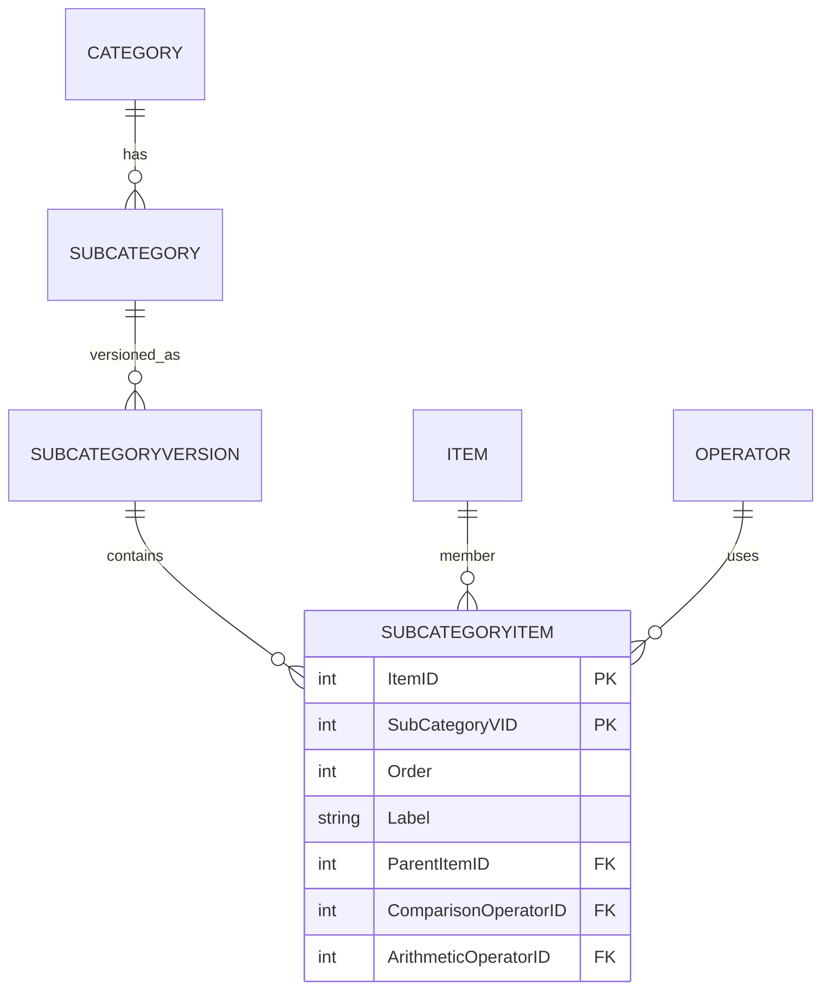
```mermaid
erDiagram
  CATEGORY ||--o{ SUBCATEGORY : has
  SUBCATEGORY ||--o{ SUBCATEGORYVERSION : versioned_as
  SUBCATEGORYVERSION ||--o{ SUBCATEGORYITEM : contains
  ITEM ||--o{ SUBCATEGORYITEM : member
  OPERATOR ||--o{ SUBCATEGORYITEM : uses

  SUBCATEGORYITEM {
    int ItemID PK
    int SubCategoryVID PK
    int Order
    string Label
    int ParentItemID FK
    int ComparisonOperatorID FK
    int ArithmeticOperatorID FK
  }
```

Modellers identify SubCategory by Code and Name and may provide Description (4.4).
SubCategories are versioned as SubCategoryVersion referring to a Release (4.2.1).
As presented on Figure 18, Items are assigned to SubCategoryVersion via SubCategoryItem, which
enables representation of hierarchical dependencies between Items (by means of
SubCategoryItem.ParentItemID), optionally providing information about arithmetical relations. The
latter is achieved by setting a SubCategoryItem.ComparsionOperator (one of: “>”, “>=”, “=”, “=<”,
“<”) indicating if children SubCategoryItems elements (i.e. identifying this SubCategoryItem as their
ParentItemID) contribute to a given SubCategoryItem completely (equal), as a subset (less then or
equal) or a superset (greater than or equal). Positive or negative contribution is identified on each
child SubCategoryItem.ArithmeticOperator with “+” or “-” respectively. Note that only selected
Operators (4.1.1.5) are allowed on SubCategoryItem.ComprarisonOperator and
SubCategoryItem.ArithmeticOperator.
Order of Items in SubCategory shall be defined globally i.e. take sequential numbers for all (not each)
branches/levels disregarding nesting.
Apart from arranging and documenting glossary, SubCategories can provide enumeration options
(list of available/selectable values in form of subsets of Items) for table Headers (5.2.1.2) and thus
resulting from them Variables (5.3.3). In such application an Item participating as an option in a
dropdown can be assigned with a different label (by means of SubCategory.Label) than its globally
applied Item.Name. Consuming application shall utilise this functionality and render dropdown
options using SubCategory.Label that matches the wording prescribed in the underlying regulations,
instructions, etc. Definition of such dropdown Headers (and Variables) must include identification of
Property and SubCategory (consuming application reassemble these into Property-Item pairs for data
exchange).
SubCategories that are related to each other can be linked though ConceptRelation (4.1.4).
ConceptRelation.Type includes by design the following options (subject to extension by Modellers)
dedicated to defining relationships between SubCategories:
-
“subCategoryMaster_version” – indicates that SubCategory identified as a source of the
relation (RelatedConcept.IsRelatedConcept equal to FALSE) is a “master” (i.e. complete
subset of Items for specific classicisation e.g. list of all countries in the World) while
SubCategory identified as a target (RelatedConcept.IsRelatedConcept equal to TRUE) some
‘version’ of this ‘master’ (e.g. list of countries in Europe); such linking shall help maintaining
of ‘version’ when composition of a related ‘master’ is changed (e.g. automatically apply
modification in both when any is changed by the Modeller),
-
“subCategoryRendering_restriction” - indicates that the target SubCategory (pointed by
RelatedConcept.IsRelatedConcept equal to TRUE) shall be used by consuming application for
rendering purposes (e.g. presentation in Table Cells - 5.2.1.3) whenever another
SubCategory indicated by the source of the relationship (i.e. pointed by
RelatedConcept.IsRelatedConcept equal to FALSE) is identified on a SubCategory of
HeaderVersion (5.2.1.2) and/or VariableVersion (5.3.5) that defines/corresponds to this Cell;
this mechanism enables displaying to users hierarchically structured dropdowns when not all
options (e.g. only leaves and/or certain branches) are actually ‘selectable’ and thus
reportable.
SubCategoryVersions can also be linked with “version_fix” and “version_new” concept relation types
to distinguish between patches and evolutionary changes respectively, in case it can’t be achieved by
means of Releases.
SubCategory is a Concept and must be assigned with an Owner (4.1.2), which is inherited by
SubCategoryVersion.
SubCategory and SubCategoryVersion can be linked to Reference (4.1.3.2).
SubCategory.Name, SubCategory.Description and SubCategoryItem.Label are translatable (4.1.3.1).
#### 5.1.4 Property
Properties can be quantitative or qualitative which in the metamodel (Figure 17) is represented by
IsMetric attribute with values TRUE or FALSE respectively.
Quantitative Properties are used to identify the basics of what is measured. For this purpose, they
provide information about expected data type of observation (by referring to Data Type, 4.1.1) and
indicate if requested value is determined at a point of time (PeriodType set to Instant) or for a period
of time (PeriodType set to Duration).
Qualitative Properties are used in descriptive observations. In many cases they are applied in
addition to quantitative Properties to further describe information requirements by providing
perspective to Items (in Context 5.1.5) or serving as Key or Attribute Variables to Fact Variables
(5.3.2).
Properties must be explicitly indicated on each Variable (5.1.8, 5.3.3) and optionally, indirectly, in
Contexts (5.1.5) referred by Variable. Table Headers (5.2.1.2) and Variables which are dropdowns
apply Properties along with SubCategories (5.1.3) listing enumerable options.
Properties may refer to Categories (e.g. for the purpose of their grouping or to indicate applicable
Items). In case of the EBA and EIOPA models, Properties that don’t belong to any natural Category
are applied to “Not applicable” Category (see Table 8).
When used in rendering or in definition of Variables, Properties can provide perspective only to
Items of a Category (or Super Category  5.1.7  that this Category is part of) that they are linked to via
PropertyCategory for a Release (4.2.1) for which this rendering, and variables are defined. For
patches to past Releases, “version_fix” relation type (4.1.4) may be applied if required (as it is for
example planned by EIOPA) to help identifying the glossary state that shall be applied in the
modelling of the fix (e.g., by enabling determining the Release of the fixed TableVersion and hence
the PropertyCategory or ItemCategory assignment applicable for that Release).
DataType (4.1.1.2) of Properties that refer to enumerated Categories (i.w. whose IsEnumerated
attribute equals TRUE) is “Enumeration”.
Properties that are related to a Category containing Compound Items (5.1.6) have IsComposite
attribute set to TRUE.
In physical implementation of the DPM metamodel by the EBA and EIOPA, each Property has a
counterpart Item (5.1.2) whose IsProperty equals TRUE and that belongs to a dedicated Category
(see Table 8). Therefore, Property receives Owner (4.1.2), Code, Name, Description (4.4),
deactivation information (4.2.3) as well as translations (4.1.3.1) and references (4.1.3.2) from that
Item.
#### 5.1.5 Context and ContextComposition
Context serves various roles in the metamodel and can be used by objects from components other
than Glossary, i.e. rendering (5.2.1) and Variables (5.3). As presented on Figure 19 and described in
this section the main role of Context is to gather Property-Item pairs.
**Figure 19. Context and ContextComposition.**

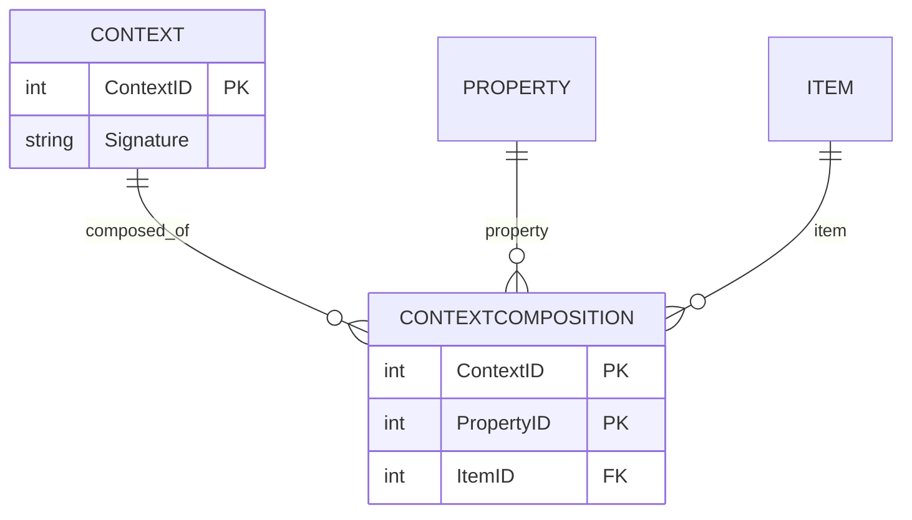
```mermaid
erDiagram
  CONTEXT ||--o{ CONTEXTCOMPOSITION : composed_of
  PROPERTY ||--o{ CONTEXTCOMPOSITION : property
  ITEM ||--o{ CONTEXTCOMPOSITION : item

  CONTEXT {
    int ContextID PK
    string Signature
  }
  CONTEXTCOMPOSITION {
    int ContextID PK
    int PropertyID PK
    int ItemID FK
  }
```

Context through ContextComposition identifies at least one Property-Item pair. One Property (5.1.4)
can be used in a Context only once and only with one Item (5.1.2). This Item needs to belong to
Category (5.1.1) to which Property refers (via PropertyCategory) in given Release (4.2.1).
ContextSignature is composed by concatenation of Codes or IDs of Properties and Items (including
identification of their Owners - 4.1.2) from ContextComposition of a Context. In case of the EBA and
EIOPA models, signature is based on IDs according to the following pattern: {PropertyID_ItemID}
separated with # and order by PropertyID, e.g. 117_2375#251_1528#326_5216#. Such approach
supports identification and reuse of Contexts.
Context as Concept can be assigned to Owner which must be the same as the Owner of:
-
Compound Item (5.1.6),
-
Table – for TableVersion and HeaderVersion (5.2.1.1), or
-
Variable – for VariableVersion (5.3.1).
for which this Context was created.
#### 5.1.6 Compound Items
Compound Items are Items whose IsCompoundItem is set to TRUE.
Compound Items are used to simplify representation of complex terms in a model.
Definition of Compound Item is composed of two or more Property-Item pairs. Each pair is identified
in ContextComposition and gathered in Context (5.1.5). To enable for this composition to be
versioned, Compound Item links to Context via CompoundItemContext that relates to Release (4.2.1)
as presented on Figure 20.
**Figure 20. Compound Item.**

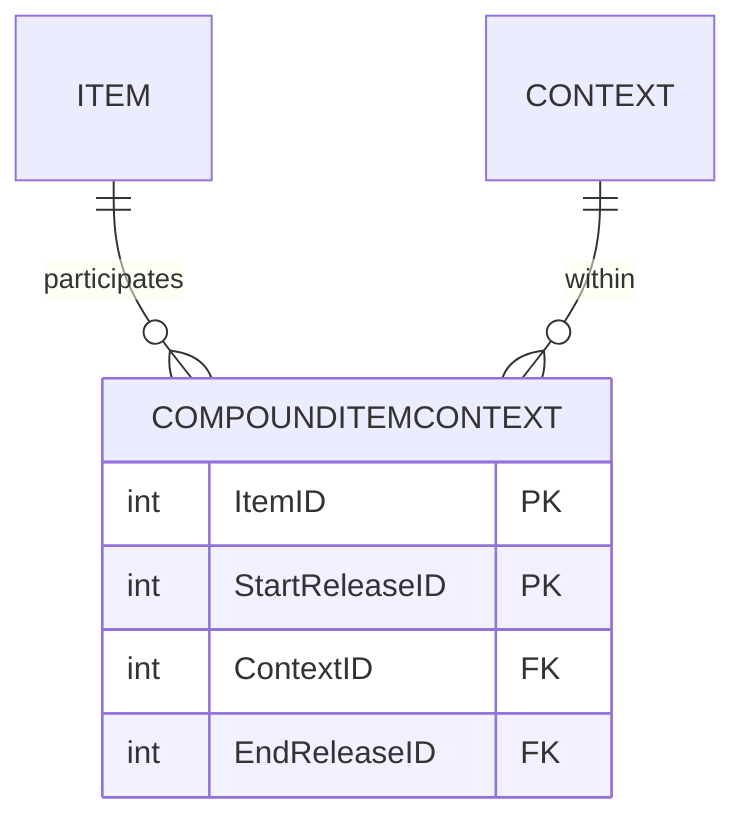
```mermaid
erDiagram
  ITEM ||--o{ COMPOUNDITEMCONTEXT : participates
  CONTEXT ||--o{ COMPOUNDITEMCONTEXT : within

  COMPOUNDITEMCONTEXT {
    int ItemID PK
    int StartReleaseID PK
    int ContextID FK
    int EndReleaseID FK
  }
```

An example of Compound Item is financial instrument “Treasury bills”. When broken down, its
definition consists of the following Property-Item pairs:
-
“Instrument type”: “Debt security”,
-
“Issuer sector”: “Central government”,
-
“Original maturity”: “< 1 year”.
When used in modelling, Compound Items19 reduce complexity of the model enabling its
decomposition in atomic Items if needed. They also enable definition of dropdowns where individual
options are composed of several Items (5.1.2) for various Properties (5.1.4).
As Item, Compound Item belongs to Category (which can be the same as any of its contributing Items
or a different one) and can be applied to Properties of this Category it belongs. It also inherits all
other characteristics of Item.

#### 5.1.7 Super Category
Super Category is a Category (5.1.1) whose Category.IsSuperCategory is set to TRUE.
As presented on Figure 21, Super Category must be identified on
SuperCategoryComposition.SuperCategoryID and results in union of all Categories referred by
SuperCategoryComposition.CategoryID. As a consequence, all Properties (5.1.4) and, in case any of
referred Categories is enumerated, Items (5.1.2) indirectly belong to such Super Category.

## 19 This mechanism enables also definition of Compound Properties, but as all Properties belong to one
dedicated Category the more natural way of identifying that one Property combines semantics of two or more
other Properties would be to assign it as a Parent Hierarchy Item of the Items representing the combined
Properties.
**Figure 21. Super Category.**

```mermaid
erDiagram
  CATEGORY ||--o{ SUPERCATEGORYCOMPOSITION : composed_of
  CATEGORY ||--o{ ITEMCATEGORY : has_items
  CATEGORY ||--o{ PROPERTYCATEGORY : has_properties
  CATEGORY ||--o{ SUBCATEGORY : has_subcategories

  SUPERCATEGORYCOMPOSITION {
    int SuperCategoryID PK
    int CategoryID PK
    int StartReleaseID FK
    int EndReleaseID FK
  }
```

Super Category can have its own Properties and, in case it is enumerated, also Items.
Composition of a Super Category in terms of referred Categories is versioned through
SuperCategoryComposition which refers to Release (4.2.1).
Super Category enables applying Items from more than one Category with Property belonging to any
of these Categories or to this Super Category.
Similarly to Compound Items (5.1.6), Super Categories may help simplifying modelling by reducing
the number of Properties in rendering (5.2.1) or in Variable definition (5.3.3). They also support
creation of dropdowns comprising of Items from various Categories which can be applied on
SubCategories (5.1.3) of Super Category and subsequently used by Table Headers (5.2.1.2) or
Variables (5.3.1).
Default Item of a Super Category (marked as its default by ItemCategory.IsDefaultItem equal TRUE)
can be any of the Items of referred Categories’ or a dedicated Item defined for Super Category. If not
explicitly indicated, it is one (any) of the default Items of the referred Categories’.
#### 5.1.8 Application of glossary terms to other components of the metamodel
Properties (5.1.4), Items (5.1.2) and SubCategories (5.1.3) are used in the modelling process to
describe information requirements.
As presented on Figure 22 and explained in the next sections of this document they are typically
assigned by Modellers to TableVersions (5.2.1.1), HeaderVersions (5.2.1.2) and VariableVersions
(5.3.3) when reflecting/constructing tabular representation of information requirements or defining
a Variable (if the latter is not derived from rendering - see 4.3 and 5.3.5).
**Figure 22. Application of Glossary terms to other components of the model.**

```mermaid
erDiagram
  TABLEVERSION ||--o{ HEADERVERSION : header_semantics
  TABLEVERSION ||--o{ VARIABLEVERSION : variable_semantics
  HEADERVERSION ||--o{ SUBCATEGORYVERSION : dropdown_values
  VARIABLEVERSION ||--o{ SUBCATEGORYVERSION : dropdown_values
  TABLEVERSION ||--o{ CONTEXT : has_context
  CONTEXT ||--o{ CONTEXTCOMPOSITION : context_terms
  PROPERTY ||--o{ CONTEXTCOMPOSITION : context_property
  ITEM ||--o{ CONTEXTCOMPOSITION : context_item
  SUBCATEGORYVERSION ||--o{ SUBCATEGORYITEM : items
  ITEM ||--o{ SUBCATEGORYITEM : item
```

Qualitative Properties are referred directly from TableVersion, HeaderVersion and VariableVersion.
The same applies to quantitative Properties of non-enumerated Categories (5.1.1) and these
Properties of enumerated Categories that are applied as dropdowns on table Headers or Variables.
In case of the latter, the list of Items to appear as dropdown values is defined by SubCategory
identified on these entities (i.e. HeaderVersion.SubCategoryVID, VariableVersion.SubCategoryVID).
Property must be indicated on every Variable.
Property-Item pairs are assigned to TableVersion, HeaderVersion and VariableVersion through
Contexts (5.1.5).
They are packaged thematically (in Frameworks - 5.2.2.1)
### 5.2 Grouping, rendering, and packaging of information requirements
Information requirements defined in regulations are typically represented in tabular format and
grouped by subject, area or scope. Therefore, as presented on Figure 23, DPM Metamodel enables
definition of Tables (5.2.1.1) that can be related to one another and gathered in TableGroups
(5.2.1.4).
Tables can be also assembled in Modules (5.2.2.2) in order to indicate what information is required
to be reported by which institutions and under what circumstances for a given reference date.
Modules are packaged thematically in Frameworks (5.2.2.1), where Framework typically represents a
piece of legislation that resulted in the need for definition of a set of Tables to be reported for these
Modules.
Tables are built from Headers (5.2.1.2) of columns and optionally rows or sheets, on intersection of
which are Cells (5.2.1.3). These Cells, but also Key Headers in case of open Tables, result in Variables
(5.3.1) representing each reportable value.

**Figure 23. Information requirements component entities and relations.**

```mermaid
flowchart TB
  Framework --> Module
  Module --> ModuleVersion
  ModuleVersion -->|composition| TableVersion
  TableVersion --> HeaderVersion
  HeaderVersion --> Cell
  Cell --> VariableVersion
  TableGroup -->|composition| Table
  Table --> TableVersion
  VariableVersion --> Variable
  TableVersion -->|key| CompoundKey
  CompoundKey --> KeyComposition
  KeyComposition --> VariableVersion
```

#### 5.2.1 Grouping and Rendering
Rendering component of the metamodel serves an important role in the modelling process.
Modellers define tabular views following the underlying regulations and subsequently, as presented
on Figure 24, assign these Tables (5.2.1.1) and their Headers (5.2.1.2) with terms from Glossary (5.1)
to express their meaning. Table Cells (5.2.1.3) result from Headers.
Table Headers or Cells result in Variables (5.3.1).
Tables can be grouped (5.2.1.4), associated to one another in terms of primary/foreign keys,
optionality and cardinality of relations, subtyping, etc. (5.2.1.5) or related to one another in other
ways (5.2.1.2).

**Figure 24. Rendering component entities and relations.**

```mermaid
flowchart TB
  TableGroup --> TableGroupComposition --> Table
  Table --> TableVersion
  TableVersion --> TableVersionHeader --> Header
  Header --> HeaderVersion
  Header --> Cell
  TableVersion --> TableVersionCell --> Cell
  TableVersionCell --> VariableVersion
  TableAssociation --> KeyHeaderMapping
```

5.2.1.1
Table and TableVersion
As presented on Figure 25, Table can be flagged as abstract (Table.IsAbstract set to TRUE) or non-
abstract (Table.IsAbstract set to FALSE). Abstract Tables are defined when a single tabular view
defined in a regulation needs to be decomposed in more than one Table, due to for example:
-
DPM modelling assumptions and constraints, disallowing for example one Property (5.1.4) to
be used on a Header (5.2.1.2) of a row and a Header of a column of one Table at the same
time,
-
normalization of tables to minimize redundancies and dependencies, in which case
Table.IsNormalised set to TRUE indicates that a non-abstract Table resulted from
normalization of an abstract Table.
In case when there is no need to split a tabular view defined in legislation to more Tables (i.e.
abstract and non-abstract Tables are identical), the model does not define any abstract Table for this
tablular view and contains only one non-abstract Table.
Information about relations between abstract Table and resulting decompose non-abstract Tables is
defined on TableVersions (see below) of non-abstract Tables by indicating there the originating
abstract Table on TableVersion.AbstractTableID.
While both, abstract and non-abstract Tables can be assigned with Headers (5.2.1.2) and Cells
(5.2.1.3), only non-abstract Tables can be modelled with glossary (5.1) concepts (i.e. their Headers
may refer to Properties, SubCategories, Contexts and link to Variables).
Table.IsFlat flag set to TRUE indicates that Table modelling is done using Properties only and contains
no Contexts which is typical case for statistical tables as defined for example in SDMX. This may
impact the behaviour of Operations (e.g. filter function).
Tables are versioned by means of TableVersion referring to a Release (4.2.1). This enables tracking
evolution of a Table in time for both – graphical representation of a tabular view as well as changes
in its modelling (i.e. referenced glossary terms). “version_fix” and “version_new” Concept relations
(4.1.4) may be used to support this tracing in more complex scenarios (e.g. when updating past
versions).
Modellers identify Table by Code and Name and may provide Description (4.4). These attributes are
defined on TableVersion corresponding to that Table, to enable their change in time and recoding all
historization.
HasOpenColumns, HasOpenRows and HasOpenSheets indicate if a Table is open - i.e. contains
Headers (5.2.1.2) which are Key Variables to other Headers representing Fact Variables (5.3.2) - and
in which direction it is opened (as columns, rows and/or sheets - Table can be open in one, two or all
three directions).

**Figure 25. Table and TableVersion.**

```mermaid
erDiagram
  TABLE ||--o{ TABLEVERSION : versioned_as

  TABLE {
    int TableID PK
    boolean IsAbstract
    boolean HasOpenColumns
    boolean HasOpenRows
    boolean HasOpenSheets
    boolean IsNormalised
    boolean IsFlat
  }
  TABLEVERSION {
    int TableVID PK
    int TableID FK
    int AbstractTableID FK
    int KeyID FK
    int PropertyID FK
    int ContextID FK
    int StartReleaseID FK
    int EndReleaseID FK
  }
```

TableVersion may link to glossary terms - Properties (5.1.4) or Property-Item pairs gathered in
Contexts (5.1.8). This information is applied to all Headers (5.2.1.2) and hence all Cells (5.2.1.3) of
that TableVersion.
TableVersion.KeyID links to CompondKey (5.3.4) identifying Key Variables applicable to Fact Variables
(5.3.2) of this TableVersion.
Table is a Concept that can be assigned with an Owner (4.1.2). TableVersion receives Owner from
Table it corresponds to. Both Table and TableVersion can be linked to Reference (4.1.3.2).
TableVersion.Name and TableVersion.Description are translatable (4.1.3.1).
5.2.1.2
Header, TableVersionHeader and HeaderVersion
Header represents each “Row”, “Column” or a “Sheet” as per Header.Direction.
As Header description and definition may change in time (due to bug fixes, improvements to
modelling, etc), each Header results in HeaderVersion. HeaderVersion is versioned by means of
reference to Release (4.2.1).

**Figure 26. Header, TableVersionHeader and HeaderVersion.**

```mermaid
erDiagram
  TABLEVERSION ||--o{ TABLEVERSIONHEADER : uses_header
  HEADER ||--o{ HEADERVERSION : versioned_as
  HEADER ||--o{ TABLEVERSIONHEADER : placed_in_tableversion
  TABLE ||--o{ HEADER : has
  TABLE ||--o{ CELL : generates
  HEADER ||--o{ CELL : in_dimension

  TABLEVERSIONHEADER {
    int TableVID PK
    int HeaderID PK
    int HeaderVID FK
    int ParentHeaderID FK
    boolean ParentFirst
    int Order
    boolean IsAbstract
    boolean IsUnique
  }
```

As presented on Figure 26, HeaderVersion identifies Header Code and provides its Label (the latter is
translatable, 4.1.3.1).
HeaderVersion links to glossary terms (5.1) that provide semantics to explain the meaning of each
header. As explained in section 5.1.8 this is achieved by referring from HeaderVersion to:
-
Property (5.1.4) that is quantitative (metric) or qualitative but non-enumerated or
enumerated Property in which case it is required to also indicate SubCategory,
-
Property-Item pairs gathered in Contexts (5.1.5).
IsKey set to TRUE implies that Header represents a Key Variable (5.3.2). As a result,
HeaderVersion.KeyVariableVID of this Header points to VariableVersion (5.3.3) that is a Key Variable.
Such Header is not linked from any Cell (5.2.1.3). Only headers who contribute to definition of a Fact
Variable result in Cells.
HeaderVersion refers to TableVersion (5.2.1.1) via TableVersionHeader. This enables reuse of
Headers across TableVersions and provides information about changes in structure of any Table in
time. As Headers’ structure can be rearranged between TableVersions, the following attributes are
applied on TableVersionHeader:

nesting of Headers (ParentHeaderID),

rendering of Parent Header before (ParentFirst set to TRUE) or after its Children,

Order of presentation of Headers,

marking Headers as “grouping only” – i.e. not resulting in cells (IsAbstract set to TRUE),

indicating if values reported for Key Variable corresponding to this Header or Fact Variables
in Cells resulting from Headers must be unique (IsUnique set to TRUE).
Owner (4.1.2) of Header (and hence HeaderVersion) must be the same as Owner of Table which this
Header belongs to (Header.TableID).
As Concepts, Header and HeaderVersion can be linked to Reference (4.1.3.2). HeaderVersion.Label is
translatable (4.1.3.1).
5.2.1.3
Cell and TableVersionCell
As presented on Figure 27, Cell must refer to at least one leaf-level Column or Row Header (5.2.1.2)
but may also point to two or maximum three (i.e. one for each: Column, Row and Sheet).
Key Headers (5.2.1.2) do not result in Cells.

**Figure 27. Cell and TableCellVersion.**

```mermaid
erDiagram
  TABLE ||--o{ CELL : has_cells
  HEADER ||--o{ CELL : column_row_sheet
  TABLEVERSION ||--o{ TABLEVERSIONCELL : versioned_cells
  CELL ||--o{ TABLEVERSIONCELL : cell_state
  VARIABLEVERSION ||--o{ TABLEVERSIONCELL : value

  CELL {
    int CellID PK
    int TableID FK
    int ColumnID FK
    int RowID FK
    int SheetID FK
  }
  TABLEVERSIONCELL {
    int TableVID PK
    int CellID PK
    string CellCode
    boolean IsNullable
    boolean IsExcluded
    boolean IsVoid
    string Sign
    int VariableVID FK
  }
```

As described in 5.2.1.1, Tables may be modified in time by means of TableVersion referring to
HeaderVersion (5.2.1.2) through TableVersionHeader. As a result, Cells can refer to various
TableVersions via TableVersionCell, while still representing the same Header(s).
TableVersionCell indicates:
-
a code of a Cell (if exists): CellCode; such information may be useful for example in mapping
to legislation if it contains such codes or to legacy systems or exchange formats which are
forms driven and therefore base on cells coordinates;
-
if a Cell is mandatory: IsNullable set to FALSE; report must contain data for Variable (5.3.1)
corresponding to this Cell (this is subject to the presence of respective filing indicators);
-
if a Cell is not reportable: IsExcluded set to TRUE; data for Variable corresponding to this Cell
is not requested for this Table; such Cell is typically displayed as greyed out or criss-crossed;
-
that a Cell does not result in any Variable (5.3.1): IsVoid is set to TRUE; i.e. its definition
stemming from concatenation of semantics indicated by glossary (5.1) terms applied on
Headers on which intersection this Cell is defined is illogical (e.g. “Equity instruments” issued
by “Government” with certain “Maturity period”); note that TableVersionCell whose IsVoid is
set to FALSE must point to VariableVersion (5.3.3) resulting from/corresponding to this Cell;
-
if a value reportable for a Cell is a “positive” or “negative” number: imposed by Sign
attribute; note that this and more complex constraints related to the expected value
reportable for a given Cell are imposed by means of Operations (5.4.1).
In case Cell results from Header whose TableVersionHeader.IsUnique is set to TRUE then values
reported in each Cell across all Cells for that Header must be unique.
Owner (4.1.2) of a Cell (and therefore TableVersionCell for that Cell) must be the same as Owner of
Table which this Cell belongs to (Cell.TableID).
As Concepts, Cell and TableVersoinCell can be linked to Reference (4.1.3.2).
5.2.1.4
Table Group
As presented on Figure 28, TableGroups gathers Tables (5.2.1.1) via TableGroupComposition.
TableGroupComposition.Order informs about the sequence of Tables in TableGroup that shall be
applied for example when displaying Tables under TableGroup in user interface. Composition of
TableGroup in terms of Tables it gathers may change between Releases (4.2.1).
**Figure 28. TableGroup and TableGroupComposition.**

```mermaid
erDiagram
  TABLEGROUP ||--o{ TABLEGROUPCOMPOSITION : contains
  TABLE ||--o{ TABLEGROUPCOMPOSITION : member

  TABLEGROUP {
    int TableGroupID PK
    string Code
    string Name
    string Type
    int ParentTableGroupID FK
  }
  TABLEGROUPCOMPOSITION {
    int TableGroupID PK
    int TableID PK
    int Order
    int StartReleaseID FK
    int EndReleaseID FK
  }
```

TableGroups are assigned with Code and Name and may also be provided with Description.
TableGroups can also gather other TableGroups by being indicated as their Parent (ParentGroupID).
This nesting can have multiple levels.
TableGroups may be created for various purposes as indicated by TableGroup.Type. DPM
metamodel envisages at least the following options (that can be further extended by metadata
modellers):
-
“templateGroup”,
-
“template”,
-
“templateVariant”,
-
“templateScope”.
For example, in case of EIOPA DPM models, TableGroup of Type “templateGroup” gathers
TableGroups which are “templates”, that in turn result in multiple “templateVariant” Type
TableGroups.
TableGroups of Type “templateScope” can also be nested. DPM XL syntax enables using their Codes
in Operation.Expression instead of Table Codes. This mechanism simplifies definition of Operations
that apply to multiple Tables belonging to such TableGroup or any of its descendant TableGroups
whose Type is also “templateScope”20.

TableGroups are relatively stable metamodel Concepts. Nevertheless, their application can be
controlled by indicating Release in which they were created or stopped being used (which can be
also determined by calculating if there are Tables in use that are linked to TableGroup through
TableGroupComposition).

## 20 Application of this mechanism requires consistent assignment of Header Codes in Tables under such
TableGroup.
TableGroup is a Concept that can be assigned with Owner (4.1.2). It can be linked to Reference
(4.1.3.2) and its Name and Description attributes are translatable (4.1.3.1).
5.2.1.5
Table Relation
The primary relation between Tables resulting from decomposition of one Table into many (for
various purposes) is described in section 5.2.1.1.
Other relations between Tables can be constructed using Concept Relation mechanism (4.1.4). DPM
currently enables lining tables using “table_variant” ConceptRelation.Type that indicates at the
target of the relation Table that is a variant of Table at its source. This mechanism can be used to
indicate that one Table e.g., “Balance sheet for ring fence funds” is a variant of “Balance sheet”
Table. Other relation types can be defined by Modellers.
5.2.1.6
TableAssociation and KeyMapping
As explained in 5.2.1.1, Tables can be split due to normalisation. More detailed information about
how these decomposed Tables relate to one another or can be assembled back in the demoralised
view, may be indicated using TableAssociation and KeyHeaderMapping as presented on Figure 29.

**Figure 29. TableAssociation and KeyMapping.**

```mermaid
erDiagram
  TABLEVERSION ||--o{ TABLEASSOCIATION : parent_or_child
  TABLEASSOCIATION ||--o{ KEYHEADERMAPPING : key_mapping
  HEADER ||--o{ KEYHEADERMAPPING : headers

  TABLEASSOCIATION {
    int AssociationID PK
    int ChildTableVID FK
    int ParentTableVID FK
    string Name
    boolean IsIdentifying
    boolean IsSubtype
  }
  KEYHEADERMAPPING {
    int AssociationID PK
    int ForeignKeyHeaderID PK
    int PrimaryKeyHeaderID FK
  }
```

TableAssociation associates Child Table with Parent Table. Definition and documentation of the
association is contained in TableAssociation.Name and TableAssociation.Description (both of which
are translatable - 4.1.3.1). Other attributes of TableAssociation describe the characteristics of the
association:
-
if the relationship is identifying (IsIdentifying set to TRUE) indicating that Child Table is
dependent on Parent Table (and cannot exists without it);
-
if it a Child Table is a subtype of Parent Table, which in turn is a supertype (IsSubtype set to
TRUE); in this case SubtypeDiscriminator attribute points to Header of Parent Table whose
values determine the target subtype(s);
-
cardinality and optionality of relationship defined on:
o Parent end (ParentCardinalityAndOptionality): '0_1', '1', '0_m', '1_m',
o Child end (ChildCardinalityAndOptionality): '0_1', '1', '0_n', '1_n'.
For association between Open Tables (i.e. including one or more Key Variables), it is possible to map
Headers of these Tables by indicating in KeyHeaderMapping entity which Header from Parent Table
is used as Foreign Key Header in Child Table. Note that associated Headers do not need to be Key
Headers (e.g. Header from Parent Table used as Foreign Key in Child Table does not need to be a Key
Header in Parent Table).
Owner (4.1.2) of TableAssociation must be the same as Owner of Tables which it associates.
TableAssociation must have Name and may have Description (which are translatable, 4.1.3.1).
As a Concept, TableAssociation can be linked to Reference (4.1.3.2).
#### 5.2.2 Packaging
Information requirements are packaged thematically in Frameworks (5.2.2.1) that typically reflect
legislation imposing certain reporting requirements. Apart from what is being collected, regulations
determine also reporting population and reporting calendar or circumstances that require data to be
submitted. This is managed by means of Modules (5.2.2.2). Packaging component entities and their
relations to rendering and Variables described in the next sections of this documents are presented
on Figure 30.
**Figure 30. Packaging component entities and relations.**

```mermaid
flowchart TB
  Framework --> Module
  Module --> ModuleVersion
  ModuleVersion --> ModuleVersionComposition --> TableVersion
  TableGroup --> TableGroupComposition --> Table
  Table --> TableVersion
  ModuleVersion --> ModuleParameters --> VariableVersion
  TableVersion --> VariableVersion
  ModuleVersion --> CompoundKey --> KeyComposition --> VariableVersion
```

5.2.2.1
Framework
Framework is the uppermost level of grouping of information requirements. It typically corresponds
to a piece of legislation, therefore its association to Owner (4.1.2) and Reference (4.1.3.2) is
particularly important as it constitutes existence of this Framework by indicating the Organisation
that issued this regulation and/or manages this Framework.

**Figure 31. Framework and Module.**

```mermaid
erDiagram
  FRAMEWORK ||--o{ MODULE : contains

  FRAMEWORK {
    int FrameworkID PK
    string Code
    string Name
  }
  MODULE {
    int ModuleID PK
    int FrameworkID FK
  }
```

As presented on Figure 31, Framework is identified by its Code. In addition, Framework must have
Name and may be provided with Description (both are translatable, 4.1.3.1)
5.2.2.2
Module
Module gathers information requirements that are supposed to be reported together, i.e., in one
report.
**Figure 32. Module, its Composition and Parameters.**

```mermaid
flowchart TB
  Module --> ModuleVersion
  ModuleVersion --> ModuleVersionComposition --> TableVersion
  ModuleVersion --> ModuleParameters --> VariableVersion
  TableVersion --> VariableVersion
  VariableVersion --> CompoundKey --> KeyComposition
```

As a result of bug fixes or modifications to the underlying regulations, composition of information
requirements for Module may change in time. Therefore, Module is versioned by means of
ModuleVersion that refers to Release (4.2.1). More importantly, ModuleVersion definition includes
FromReferenceDate and (optional) ToReferenceDate attributes that identify its application dates
(4.2.2). This enables determining which ModuleVersion shall be used for reporting of data for a given
reference date (for a given Module there must be only one Version applicable for one reference
date).
ModuleVersion is identified by Code and Name and may be provided with Description.
As presented on Figure 32, information requirements to be reported for ModuleVersion are defined
by indication of applicable Tables and their Versions (5.2.1.1) assigned to this ModuleVersion
through the ModuleVersionComposition. This indirectly identifies all Variables (5.3.1) to be reported
for ModuleVersion (which results from Key Headers and Cells of all linked TableVersions).
Each Module covers one reporting scenario, usually applicable to specific type of reporting entities,
with observations measured is specified manner for a given period or at a moment in time, in a
particular currency applicable to all monetary amounts. Such global parameters applicable to all Fact
Variables (5.3.2) in ModuleVersion can be expressed by Key Variables composed in CompoundKey
(5.3.4) associated to ModuleVersion or by Attribute Variables linked to ModuleVersion via
ModuleParameters. The latter are typically constructed as Variables indicating Property and
SubCategoryVersion that consist of only one Item.
Module level parameters and Keys do not need to be repeated on (i.e. directly assigned to) every
Fact Variable belonging to this Module. They can be however overridden by another value, if
explicitly attached to Fact Variable or its Key Variable for a given Property represented by Key or
Attribute Variable applied on Module level.
Module and ModuleVersion are Concepts. They inherit Owner from Framework. Both may have
references (4.1.3.2). ModuleVersion Name and Description are translatable (4.1.3.1).
### 5.3 Identification and description of each reported value
Unique identification and description of each reportable value is required to explicitly explain what is
expected to be exchanged and enable tracking changes in modelling of each submitted value.
#### 5.3.1 Variable
Each distinct quantitative or qualitative reportable value (regardless of its occurrence in rendering) is
represented in the DPM as Variable. Next sections of this chapter discuss types and versioning of
Variables. Entities and relations of this component of metamodel and their relations to other
components are presented on Figure 33.

**Figure 33. Variables component entities and relations.**

```mermaid
flowchart TB
  Variable --> VariableVersion
  VariableVersion --> Property
  Property --> DataType
  VariableVersion --> Context
  Context --> ContextComposition --> Item
  VariableVersion --> SubCategoryVersion --> SubCategoryItem --> Item
  TableVersionCell --> VariableVersion
  ModuleVersion --> ModuleParameters --> VariableVersion
```

#### 5.3.2 Variable Types
There are four Types of Variables:
-
Fact Variable, which represents reported observation, typically a monetary amount, other
numeric data, a text, a date or an enumeration. Fact Variable may refer to one or more Key
Variables and/or Attribute Variables that are needed to complement understanding of the
piece of data carried by Fact Variable;
-
Key Variable may be needed by some Fact Variables in order to explicitly and uniquely
identify exchanged observation; this identification can be Module wide (e.g., reporting entity
and period) or apply to individual Fact Variables (e.g. appearing in an Open Table - 5.2.1.1 -
where key column(s) identify non-key columns in each row or key sheet(s) identify all cells in
that sheet of a Table);
-
Attribute Variable provides information about some properties of exchanged observation
such as its unit of measure, accuracy or a comment expected to be associated to it by a
reporting entity in their report; Attribute Variable typically applies to Fact Variables but if
needed can be applied also to Key Variables;
-
Filing Indicator Variable which corresponds to each reporting unit (e.g. TableGroup or Table)
that is used by Operations to determine if Operations shall be executed provided that a
reporting unit is declared as present or not in a submitted report. In case of the EBA and
EIOPA models, Filing Indicator Variables result from dedicated Content Tables, that list all
reportable units for each Module. For modelling purposes, Headers and Variables of this
Table apply a dedicated Property and Items of FilingIndicators Category (Table 8).
Variables can be related to one another by means of Concept Relation (4.1.4). The following
ConceptRelation Types are dedicated to connecting Variables:
-
“factVariable_keyVariable” – links Fact Variable (at the source of Relation) to Key Variable
(at the target of Relation) that is needed to identify this Fact Variable,
-
“variable_attribute” links Fact Variable or Key Variable (at the source of Relation) to its
Attribute Variable (at the target of Relation).
Other Relation Types that can be used on Variables are “equivalent_concept” that connects two or
more Variables (Fact, Key, Attribute or mix of any of these) whose meaning is the same but
representation in modelling is different and “version_fix”/“version_new” to support historization by
means of Releases.
#### 5.3.3 VariableVersions
Modelling of Variable may change in time. For this reason, VariableVersion represents Variable for a
given Release (4.2.1).
Each VariableVersion must indicate Property (5.1.4).
Additionally as explained in 5.1.8, enumerated Variable indicates SubCategory (5.1.3) listing and
constraining Items (5.1.2) that are selectable options for this VariableVersion.
VariableVersion.IsMultiValued set to TRUE indicates that observation corresponding to such
enumerated Variable can be reported with two or more Items from the indicated SubCategory.
When VariableVersion.IsMultiValued is set to FALSE entities can report only one Item per
observation (from the indicated SubCategory).
Fact Variable may refer to Context (5.1.5) if Property assigned to it is insufficient to fully describe the
meaning of that Fact Variable.
Fact Variable that requires Key Variables to be identified, links to CompoundKey (5.3.4) gathering
(via KeyComposition) all Key Variables applicable to this Fact Variable.
VariableVersion can be identified by its Code and its description can be included in Name attribute
(which is translatable, 4.1.3.1).
Variable and VariableVersions are Concepts and therefore have Owner (which VariableVersion
inherits from Variable) and can have references (4.1.3.2).
#### 5.3.4 CompoundKey and its KeyComposition
Open Tables (5.2.1.1) contain one or more Key Headers (5.2.1.2). Each Key Header results in Key
Variable (5.3.2). As presented on Figure 34, all Key Variables of any TableVersion are gathered
through KeyCompositon to one CompoundKey. This CompoundKey is referred:
-
from TableVersion and all Fact Variables of this TableVersion and/or
-
by ModuleVersion (5.2.2.2) in which case it implicitly applies to all Fact Variables of all Tables
in this ModuleVersion (unless overridden).

**Figure 34. CompoundKey and KeyComposition application to TableVersion and ModuleVersion.**

```mermaid
erDiagram
  COMPOUNDKEY ||--o{ KEYCOMPOSITION : contains
  VARIABLEVERSION ||--o{ KEYCOMPOSITION : member
  TABLEVERSION ||--o{ COMPOUNDKEY : defines_key
  MODULEVERSION ||--o{ COMPOUNDKEY : module_key

  COMPOUNDKEY {
    int KeyID PK
    string Signature
  }
  KEYCOMPOSITION {
    int KeyID PK
    int VariableVID PK
  }
```

#### 5.3.5 Variables’ definition process
Although Variables (5.3.1) can be defined irrespective of the rendering, in the typicall modelling
process they result from Tables (5.2.1.1).
Fact Variables (5.3.2) are derived from Cells (5.2.1.3), where Table level Glossary terms contribute to
definition of Headers (in which case Glossary terms are inherited, unless overridden, from upper-
level Headers - 5.2.1.2) and is propagated to Cells on intersection of these Headers.
Key Variables are linked from Key Headers which have no Cells attached. This is to ensure that open
(or semi-open, i.e. enumerated and constrained by means of SubCategory - 5.1.3) Sheets, Columns
or Rows are modelled in the same way regardless of their graphical orientation (as ultimately it is a
matter of subjective decision of a Modeller to display these in certain direction).
Global Attribute and Key Variables are identified during definition of Modules (5.2.2.2) they refer to.
### 5.4 Operations on data
In addition to explicit and comprehensive description and unique identification of information
requirements, DPM enables representation of definitions of Operations on data. These could be:
-
quality checks related to imposing constraints on requested data values or their formats,
-
documentation of logical and arithmetic relations between reported data,
-
data transformations enabling producing new data from reported observations according to
certain formulas.
These definitions can be used by software applications parsing reports to execute Operations on
reported data.
#### 5.4.1 Operations
As indicated on Figure 35, Operations are represented in form of Abstract Syntax Tree (AST)21, where
tree nodes are Operators (4.1.1.5) or OperandReferences referring to Variables (5.3.1), Properties
(5.1.4), Items (5.1.2), SubCategories (5.1.3) or – through OperandReferenceLocation to Cells (5.2.1.3).

## 21 https://en.wikipedia.org/wiki/Abstract_syntax_tree
**Figure 35. Entities and relations of Operations component.**

```mermaid
flowchart TB
  ModuleVersion --> OperationScopeComposition --> OperationScope --> OperationVersion
  VariableVersion --> VariableCalculation --> OperationVersion
  Operation --> OperationVersion
  OperationVersion --> OperationNode
  Operator --> OperatorArgument
  OperatorArgument --> OperationNode
  OperationNode --> OperandReference --> OperandReferenceLocation --> Cell
  OperandReference --> Item
  OperandReference --> Property
  OperandReference --> SubCategory
```

Operation Type indicates if Operation represents:
-
“validation” – a quality check checking correctness and consistency of reported fata
reported data,
-
“calculation” – transformation of reported data to produce new derived data, e.g. ratios,
aggregates, etc,
-
“precondition” – check that determines if another related Operation should be executed,
-
 “conditional_severity” – test that determines severity of another related Operation.
Operations can be grouped, nested and sequenced. This latter is used for Operations that serve as a
precondition or inform how severity is determined.
Operation Source indicates the origin of Operation which can be one of the following:
-
“sign” – checks if a reported value is positive or negative, derived from TableVersionCell.Sign
(5.2.1.3),
-
“hierarchy” – originates from one of SubCategories which structure along with
ArithmeticOperators and ComparisonOperators (5.1.3) were identified by Modellers as
applicable to verify reported data or produce new date,
-
“existence” – checks if mandatory data was reported, derived from
TableVersionCell.IsNullable (5.2.1.3),
-
“property_constraint” – ensures that Property is assigned with allowed Items (derived from
SubCategories applied to Variables for a given Property),
-
“user_defined” – neither of the above, typically defined by modeller by indicating Table
Headers, Cells, Variables or glossary terms and applying them in test expression along with
Operators and scalars,
-
“variant” – as above but defined on TableGroups whose type is “templateScope” (5.2.1.4)
and therefore propagated to all Tables that this TableGroup or its descendants are
composed of (via TableGroupComposition).
Operation is versioned by means of OperationVersion referring to Release (4.2.1).
OperationVersion applies to data reported for Modules it is connected to. For Operations whose
Type is “validation”, this connection is made through OperationScope and
OperationScopeComposition to enable handling situations where Operation has different severity
depending on the Module or can be deactivated/re-activated starting from certain submission date
(4.2.3). Operations whose Type is “calculation” are additionally linked to the derived Variable
through VariableCalculation.
As explained above, Operations are represented as trees whose branches and leaves
(OperationNodes) link to Operators (4.1.1.5) and Operands. Detailed explanation of this mechanism
and description of attributes of these entities can be found in the DPM XL and ML documentation.
Operation, OperationVersion and OperationScope are Concepts and therefore are assigned with
Owner, where the latter two inherit the Owner of the first. All three can have references (4.1.3.2).
Description of OperationVersion can be translated (4.1.3.1) to any natural language while Expression
can be reflected in any programming language (e.g. Java, .Net, Python, R, SQL) or other formal
language (different syntaxes build according to specified grammar).
#### 5.4.2 Handling external information
Some Operations refer to external data i.e. information not belonging to any Framework (5.2.2.1 –
and hence Modules 5.2.2.2) and therefore not exchanged in reports. This could be in particular:
-
master data about reporting entities (that may impact data to be disclosed in reports or
determine which ratios or aggregates can computed based on reported data), or
-
reference data (e.g. registry of entities or instruments, that can be crosschecked against
reported information).
Such metadata can be resembled in DPM as Properties (5.1.4) of dedicated Categories (5.1.1), and
eventually as Variables (5.3.1) which as Operands can be referred from Operations and treated as
parameters, that during execution are replaced with values from this master or reference data.