# SDMX Standards Section 2 — Information Model (UML Conceptual Design)

_Version 3.1 (May 2025). Consolidated into Markdown with diagrams translated to Mermaid._

## Notes

- This Markdown is derived from the provided PDF; diagrams have been re-expressed as Mermaid. Some large UML diagrams are simplified to keep Mermaid readable.
- Mermaid `classDiagram` is used for UML-like class diagrams; `flowchart` is used for package and use-case diagrams.

---

May 2025


Revision History Revision Date Contents DRAFT 1.0 December 2025 Draft release updated for SDMX 3.1 for public consultation 1.0 May 2025 Public Release for SDMX 3.1


3 Contents 1 Introduction ...................................................................................................................... 15 1.1 Related Documents 15 1.2 Modelling Technique and Diagrammatic Notes 15 1.3 Overall Functionality 16 1.3.1 Information Model Packages ................................................................................ 16 1.3.2 Version 1.0 ........................................................................................................... 17 1.3.3 Version 2.0/2.1 ..................................................................................................... 17 1.3.4 Version 3.0 ........................................................................................................... 18 1.3.5 Version 3.1 ........................................................................................................... 19 2 Actors and Use Cases ..................................................................................................... 20 2.1 Introduction 20 2.2 Use Case Diagrams 20 2.2.1 Maintenance of Structural and Provisioning Definitions ....................................... 20 2.2.2 Publishing and Using Data and Reference Metadata .......................................... 24 3 SDMX Base Package ....................................................................................................... 28 3.1 Introduction 28 3.2 Base Structures - Identification, Versioning, and Maintenance 29 3.2.1 Class Diagram ...................................................................................................... 29 3.2.2 Explanation of the Diagram .................................................................................. 30 3.3 Basic Inheritance 33 3.3.1 Class Diagram – Basic Inheritance from the Base Inheritance Classes .............. 33 3.3.2 Explanation of the Diagram .................................................................................. 33 3.4 Data Types 34 3.4.1 Class Diagram ...................................................................................................... 34 3.4.2 Explanation of the Diagram .................................................................................. 35 3.5 The Item Scheme Pattern 35 3.5.1 Context ................................................................................................................. 35 3.5.2 Class Diagram ...................................................................................................... 36 3.5.3 Explanation of the Diagram .................................................................................. 36 3.6 The Structure Pattern 38 3.6.1 Context ................................................................................................................. 38 3.6.2 Class Diagrams .................................................................................................... 39 3.6.3 Explanation of the Diagrams ................................................................................ 40 4 Specific Item Schemes .................................................................................................... 46 4.1 Introduction 46 4.2 Inheritance View 46 4.3 Codelist 47 4.3.1 Class Diagram ...................................................................................................... 47 4.3.2 Explanation of the Diagram .................................................................................. 47 4.3.3 Class Diagram – Codelist Extension .................................................................... 49 4.3.4 Class Diagram – Geospatial Codelist ................................................................... 50 4.4 ValueList 54 4.4.1 Class Diagram ...................................................................................................... 54 4.4.2 Explanation of the Diagram .................................................................................. 54 4.5 Concept Scheme and Concepts 56 4.5.1 Class Diagram - Inheritance ................................................................................. 56 4.5.2 Explanation of the Diagram .................................................................................. 56 4.5.3 Class Diagram - Relationship ............................................................................... 58 4.5.4 Explanation of the diagram ................................................................................... 58 4.6 Category Scheme 59


4 4.6.1 Context ................................................................................................................. 59 4.6.2 Class diagram - Inheritance ................................................................................. 60 4.6.3 Explanation of the Diagram .................................................................................. 61 4.6.4 Class diagram - Relationship ............................................................................... 62 4.7 Organisation Scheme 63 4.7.1 Class Diagram ...................................................................................................... 63 4.7.2 Explanation of the Diagram .................................................................................. 64 4.8 Reporting Taxonomy 67 4.8.1 Class Diagram ...................................................................................................... 67 4.8.2 Explanation of the Diagram .................................................................................. 68 5 Data Structure Definition and Dataset ........................................................................... 71 5.1 Introduction 71 5.2 Inheritance View 72 5.2.1 Class Diagram ...................................................................................................... 72 5.2.2 Explanation of the Diagram .................................................................................. 73 5.3 Data Structure Definition – Relationship View 74 5.3.1 Class Diagram ...................................................................................................... 74 5.3.2 Explanation of the Diagrams ................................................................................ 75 5.4 Data Set – Relationship View 83 5.4.1 Context ................................................................................................................. 83 5.4.2 Class Diagram ...................................................................................................... 84 5.4.3 Explanation of the Diagram .................................................................................. 85 6 Cube .................................................................................................................................. 93 6.1 Context 93 6.2 Support for the Cube in the Information Model 93 7 Metadata Structure Definition and Metadata Set .......................................................... 95 7.1 Context 95 7.2 Inheritance 95 7.2.1 Introduction ........................................................................................................... 95 7.2.2 Class Diagram - Inheritance ................................................................................. 96 7.2.3 Explanation of the Diagram .................................................................................. 96 7.3 Metadata Structure Definition 97 7.3.1 Introduction ........................................................................................................... 97 7.3.2 Structures Already Described ............................................................................... 97 7.3.3 Class Diagram – Relationship .............................................................................. 97 7.3.4 Explanation of the Diagram .................................................................................. 97 7.4 Metadata Set 101 7.4.1 Class Diagram .................................................................................................... 101 7.4.2 Explanation of the Diagram ................................................................................ 101 8 Hierarchy ........................................................................................................................ 106 8.1 Scope 106 8.2 Inheritance 107 8.2.1 Class Diagram .................................................................................................... 107 8.2.2 Explanation of the Diagram ................................................................................ 107 8.3 Relationship 108 8.3.1 Class Diagram .................................................................................................... 108 8.3.2 Explanation of the Diagram ................................................................................ 108 9 Structure Map ................................................................................................................ 111 9.1 Scope 111 9.1.1 Class Diagram – Relationship ............................................................................ 111 9.1.2 Explanation of the Diagram ................................................................................ 111 9.1.3 Class Diagram – Epoch Mapping and Date Pattern Mapping ............................ 112


5 9.1.4 Explanation of the Diagram ................................................................................ 113 10 RepresentationMap ....................................................................................................... 116 10.1 Scope 116 10.1.1 Class Diagram – Relationship ............................................................................ 117 10.1.2 Explanation of the Diagram ................................................................................ 117 11 ItemSchemeMap ............................................................................................................ 120 11.1 Scope 120 11.1.1 Explanation of the Diagram ................................................................................ 120 12 Constraints ..................................................................................................................... 123 12.1 Scope 123 12.2 Inheritance 123 12.2.1 Class Diagram of Constrainable Artefacts - Inheritance .................................... 123 12.2.2 Explanation of the Diagram ................................................................................ 123 12.3 Constraints 124 12.3.1 Relationship Class Diagram – high level view .................................................... 124 12.3.2 Explanation of the Diagram ................................................................................ 124 12.3.3 Relationship Class Diagram – Detail .................................................................. 126 13 Data Provisioning .......................................................................................................... 134 13.1 Class Diagram 134 13.2 Explanation of the Diagram 135 13.2.1 Narrative ............................................................................................................. 135 13.2.2 Definitions ........................................................................................................... 136 14 Process ........................................................................................................................... 139 14.1 Introduction 139 14.2 Model – Inheritance and Relationship view 139 14.2.1 Class Diagram .................................................................................................... 139 14.2.2 Explanation of the Diagram ................................................................................ 139 15 Validation and Transformation Language ................................................................... 143 15.1 Introduction 143 15.2 Model - Inheritance view 143 15.2.1 Class Diagram .................................................................................................... 143 15.2.2 Explanation of the Diagram ................................................................................ 144 15.3 Model - Relationship View 146 15.3.1 Class Diagram .................................................................................................... 146 15.3.2 Explanation of the Diagram ................................................................................ 146 16 Appendix 1: A Short Guide to UML in the SDMX Information Model ....................... 158 16.1 Scope 158 16.2 Use Cases 158 16.3 Classes and Attributes 159 16.3.1 General ............................................................................................................... 159 16.3.2 Abstract Class .................................................................................................... 159 16.4 Associations 160 16.4.1 General ............................................................................................................... 160 16.4.2 Simple Association ............................................................................................. 160 16.4.3 Aggregation ........................................................................................................ 161 16.4.4 Association Names and Association-end (role) Names ..................................... 161 16.4.5 Navigability ......................................................................................................... 162 16.4.6 Inheritance .......................................................................................................... 162 16.4.7 Derived association ............................................................................................ 163


6 Change History Version 1.0 – initial release September 2004. 1  2 Version 2.0 – release November 2005 3  4 Major functional enhancements by addition of new packages: 5  6 Metadata Structure Definition 7 Metadata Set 8 Hierarchical Code Scheme 9 Data and Metadata Provisioning 10 Structure Set and Mappings 11 Transformations and Expressions 12 Process and Transitions 13 Re-engineering of some SDMX Base structures to give more functionality: 14  15 Item Scheme and Item can have properties – this gives support for complex hierarchical 16 code schemes (where the property can be used to sequence codes in scheme), and 17 Item Scheme mapping tables (where the property can give additional information about 18 the map between the two schemes and the between two Items) 19 revised Organisation pattern to support maintained schemes of organisations, such as a 20 data provider 21 modified Component Structure pattern to support identification of roles played by 22 components and the attachment of attributes 23 change to inheritance to enable more artefacts to be identifiable and versionable 24 Introduction of new types of Item Scheme: 25  26 • Object Type Scheme to specify object types in support of the Metadata Structure 27 Definition (principally the object types (classes) in this Information Model)  28 • Type Scheme to specify types other than object type 29 • A generic Item Scheme Association to specify the association between Items in two or 30 more Item Schemes, where such associations cannot be described in the Structure Set 31 and Transformation.  32 The Data Structure Definition is introduced as a synonym for Key Family though the term Key 33 Family is retained and used in this specification. 34  35 Modification to Data Structure Definition (DSD) to  36  37 align the cross sectional structures with the functionality of the schema 38


7 support Data Structure Definition extension (i.e. to derive and extend a Data Structure 39 Definition from another Data Structure Definition), thus supporting the definition of a 40 related “set” of key families 41 distinguish between data attributes (which are described in a Data Structure Definition) from 42 metadata attributes (which are described in a metadata structure definition) 43 attach data attributes to specific identifiable artefacts (formally this was supported by 44 attachable artefact) 45 Domain Category Scheme re-named Category Scheme to better reflect the multiple usage of 46 this type of scheme (e.g. subject matter domain, reporting taxonomy). 47  48 Concept Scheme enhanced to allow specification of the representation of the Concept. This 49 specification is the default (or core) representation and can be overridden by a construct that 50 uses it (such as a Dimension in a Data Structure Definition). 51  52 Revision of cross sectional data set to reflect the functionality of the version 1.0 schema. 53  54 Revision of Actors and Use Cases to reflect better the functionality supported. 55  56 Version 2.1 – release April 2011 57  58 The purpose of this revision is threefold: 59  60 • To introduce requested changes to functionality  61 • To align the model and syntax implementations more closely (note, however, that the 62 model remains syntax neutral) 63 • To correct errors in version 2.0 64  65 SDMX Base 66 Basic inheritance and patterns 67  68 1. The following attributes are added to Maintainable: 69  70 i) isExternalReference 71 ii) structure URL 72 iii) serviceURL 73  74 2.  Added Nameable Artefact and moved the Name and Description associations from 75 Identifiable Artefact to Nameable Artefact.  This allows an artefact to be identified (with 76 id and urn) without the need to specify a Name. 77  78 3. Removed any inheritance from Versionable Artefact with the exception of Maintainable 79 Artefact – this means that only Maintainable objects can be versioned, and objects 80 contained in a maintainable object cannot be independently versioned. 81  82 4. Renamed MaintenanceAgency to Agency 0 this is its name in the schema and the URN. 83  84 5. Removed abstract class Association as a subclass of Item (as these association types 85 are not maintained in Item Schemes). Specific associations are modelled explicitly (e.g. 86 Categorisation, ItemScheme, Item). 87


8  88 6. Added ActionType to data types. 89  90 7. Removed Coded Artefact and Uncoded Artefact and all subclasses (e.g. Coded Data 91 Attribute and Uncoded Data Attribute) as the “Representation” is more complex than just 92 a distinction between coded and uncoded. 93  94 8. Added Representation to the Component. Removed association to Type. 95  96 9. Removed concept role association (to Item) as roles are identified by a relationship to a 97 Concept.  98  99 10. Removed abstract class Attribute as both Data Attribute and Metadata Attribute have 100 different properties. Data Attribute and Metadata Attribute inherit directly from 101 Component. 102  103 11. isPartial attribute added to Item Scheme to support partial Item Schemes (e.g. partial 104 Code list). 105  106 Representation 107  108 1. Removed interval and enumeration from Facet. 109 2. added facetValueType to Facet. 110 3. Re-named DataType to facetValueType. 111 4. Added observationalTimePeriod, inclusiveValueRange and exclusiveValueRange to 112 facetValueType. 113 5. Added ExtendedFacetType as a sub class of FacetType. This includes Xhtml as a 114 facet type to support this as an allowed representation for a Metadata Attribute 115  116 Organisations 117 1. Organisation Role is removed and replaced with specific Organisation Schemes of 118 Agency, Data Provider, Data Consumer, Organisation Unit.  119  120 Mapping (Structure Maps) 121  122 Updated Item Scheme Association as follows: 123  124 1. Renamed to Item Scheme Map to reflect better the sub classes and relate better to the 125 naming in the schema. 126  127 2. Removed inheritance of Item Scheme Map from Item Scheme, and inherited directly 128 from Nameable Artefact. 129  130 3. Item Association inherits from Identifiable Artefact. 131   132 4. Removed Property from the model as this is not supported in the schema. 133  134 5. Removed association type between Item Scheme Map and Item, and Association and 135 Item. 136  137 6. Removed Association from the model. 138  139


9 7. Made Item Association a sub class of Identifiable, was a sub class Item. 140  141 8. Removed association to Property from both Item Scheme Map and Item. 142  143 9. Added attribute alias to both Item Scheme Association and Item Association. 144  145 10. Made Item Scheme Map and Item Association abstract. 146  147 11. Added sub-classes to Item Scheme Map – there is a subclass for each type of Item 148 Scheme Association (e.g. Code list Map). 149  150 12. Added mapping between Reporting Taxonomy as this is an Item Scheme and can be 151 mapped in the same way as other Item Schemes. 152  153 13. Added Hybrid Code list Map and Hybrid Code Map to support code mappings between 154 a Code list and a Hierarchical Code list. 155  156 Mapping: Structure Map 157  158 1. This is a new diagram. Essentially removed inherited /hierarchy association between the 159 various maps, as these no longer inherit from Item, and replaced the associations to the 160 abstract Maintainable and Versionable Artefact classes with the actual concrete classes. 161  162 2. Removed associations between Code list Map, Category Scheme Map, and Concept 163 Scheme Map and made this association to Item Scheme Map. 164  165 3. Removed hierarchy of Structure Map. 166  167 Concept 168  169 1. Added association to Representation. 170  171 Data Structure Definition 172  173 1. Added Measure Dimension to support structure-specific renderings of the DSD. The 174 Measure Dimension is associated to a Concept Scheme that specifies the individual 175 measures that are valid. 176  177 2. The three types of “Dimension”, - Dimension, Measure Dimension, Time Dimension – 178 have a super class – Dimension Component 179  180 3. Added association to a Concept that defines the role that the component (Dimension, 181 Data Attribute, Measure Dimension) plays in the DSD. This replaces the Boolean 182 attributes on the components. 183  184 4. Added Primary Measure and removed this as role of Measure. 185  186 5. Deleted the derived Data Structure Definition association from Data Structure Definition 187 to itself as this is not supported directly in DSD. 188  189 6. Deleted attribute GroupKeyDescriptor.isAttachmentConstraint and replaced with an 190 association to an Attachment Constraint. 191


10  192 7. Replaced association from Data Attribute to Attachable Artefact with association to 193 Attribute Relationship. 194  195 8. Added a set of classes to support Attribute Relationship. 196  197 9. Renamed KeyDescriptor to DimensionDescriptor to better reflect its purpose. 198  199 10. Renamed GroupKeyDescriptor to GroupDimensionDescriptor to better reflect its 200 purpose. 201  202 Code list 203  204 1. CodeList classname changed to Codelist. 205  206 2. Removed codevalueLength from Codelist as this is supported by Facet. 207  208 3. Removed hierarchyView association between Code and Hierarchy as this association is 209 not implemented. 210  211 Metadata Structure Definition(MSD) 212  213 1. Full Target Identifier, Partial Target Identifier, and Identifier Component are replaced by 214 Metadata Target and Target Object. Essentially this eliminates one level of specification 215 and reference in the MSD, and so makes the MSD more intuitive and easier to specify 216 and to understand. 217  218 2. Re-named Identifiable Object Type to Identifiable Object Target and moved to the MSD 219 package. 220  221 3. Added sub classes to Target Object as these are the actual types of object to which 222 metadata can be attached. These are Identifiable Object Target (allows reporting of 223 metadata to any identifiable object), Key Descriptor Values Target (allows reporting of 224 metadata for a data series key,  Data Set Target (allows reporting of metadata to a data 225 set), and Reporting Period Target (allows the metadata set to specify a reporting period). 226  227 4. Allowed Target Object can have any type of Representation, this was restricted in 228 version 2.0 to an enumerated representation in the model (but not in the schemas).  229  230 5. Removed Object Type Scheme (as users cannot maintain their own list of object types), 231 and replaced with an enumeration of Identifiable Objects. 232  233 6. Removed association between Metadata Attribute and Identifiable Artefact and replaced 234 this with an association between Report Structure and Metadata Target, and allowed 235 one Report Structure to reference more than on Metadata Target. This allowing a single 236 Report Structure to be defined for many object types. 237  238 7. Added the ability to specify that a Metadata Attribute can be repeated in a Metadata Set 239 and that a Metadata Attribute can be specified as “presentational” meaning that it is 240 present for structural and presentational purposes, and will not have content in a 241 Metadata Set. 242  243


11 8. The  Representation of a Metadata Attribute uses Extended Facet (to support Xhtml). 244  245 Metadata Set 246  247 1. Added link to Data Provider - 0..1 but note that for metadata set registration this will be 248 1. 249  250 2. Removed Attribute Property as the underlying Property class has been removed. 251  252 3. One Metadata Set is restricted to reporting metadata for a single MSD. 253  254 4. The Metadata Report classes are re-structured and re-named to be consistent with the 255 renaming and restructuring of the MSD. 256  257 5. Metadata Attribute Value is renamed Reported Attribute to be consistent with the 258 schemas. 259  260 6. Deleted XML attribute and Contact Details from the inheritance diagram. 261  262 Category Scheme 263 1. Added Categorisation. Category no longer has a direct association to Dataflow and 264 Metadataflow. 265  266 2. Changed Reporting Taxonomy inheritance from Category Scheme to Maintainable 267 Artefact. 268  269 3. Added Reporting Category and associated this to Structure Usage. 270  271 Data Set 272  273 1. Removed the association to Provision Agreement from the diagram. 274  275 2. Added association to Data Structure Definition.  This association was implied via the 276 dataflow but this is optional in the implementation whereas the association to the Data 277 Structure Definition is mandatory. 278  279 3. Added attributes to Data Set. 280  281 4. There is a single, unified, model of the Data Set which supports four types of data set: 282  283 • Generic Data Set – for reporting any type of data series, including time series 284 and what is sometimes known as “cross sectional data”. In this data set, the value 285 of any one dimension (including the Time Dimension) can be reported with the 286 observation (this must be for the same dimension for the entire data set) 287  288 • Structure-specific Data Set – for reporting a data series that is specific to a DSD 289  290 • Generic Time Series Data Set – this is identical to the Generic Data Set except 291 it must contain only time series, which means that a value for the Time Dimension 292 is reported with the Observation 293  294


12 • Structure-specific Time Series Data Set - this is identical to the Structure-specific 295 Data Set except it must contain only time series, which means that a value for 296 the Time Dimension is reported with the Observation. 297  298 5. Removed Data Set as a sub class of Identifiable – but note that Data Set has a “setId” 299 attribute. 300  301 6. Added coded and uncoded variants of Key Value, Observation, and Attribute Value in 302 order to show the relationship between the coded values in the data set and the Codelist 303 in the Data Structure Definition.  304  305 7. Made Key Value abstract with sub classes for coded, uncoded, measure 306 (MeasureKeyValue) ads time (TimeKeyValue) The Measure Key Value is associated to 307 a Concept as it must take its identify from a Concept. 308  309 XSDataSet 310 1. This is removed and replaced with the single, unified data set model.  311  312 Constraint 313  314 1. Constraint is made Maintainable (was Identifiable). 315  316 2. Added artefacts that better support and distinguish (from data) the constraints for 317 metadata.  318  319 3. Added Constraint Role to specify the purpose of the Constraint. The values are allowable 320 content (for validation of sub set code code lists), and actual content (to specify the 321 content of a data or metadata source). 322  323 Process 324 1. Removed inheritance from Item Scheme and Item: Process inherits directly from 325 Maintainable and Process Step from Identifiable. 326  327 2. Removed specialisation association between Transition and Association. 328  329 3. Removed Transition Scheme - transitions are explicitly specified and not maintained as 330 Items in a Item Scheme. 331  332 4. Removed Expression and replaced with Computation. 333  334 5. Transition is associated to Process Step and not Process itself. Therefore the source 335 association to Process Step is removed. 336  337 6. Removed Expressions as these are not implemented in the schemas. But note that the 338 Transformations and Expressions model is retained, though it is not implemented in the 339 schemas. 340  341 Hierarchical Codelist 342  343 1. Renamed HierarchicalCodeList to HierarchicalCodelist. 344


13 2. This is re-modelled to reflect more accurately the way this is implemented: this is as an 345 actual hierarchy rather than a set of relational associations from which the hierarchy can 346 be derived.  347  348 3. Code Association is re-named Hierarchical Code and the association type association 349 to Code is removed (as these association types are not maintained in an Item Scheme). 350  351 4. Hierarchical Code is made an aggregate of Hierarchy, and not of Hierarchical Codelist.  352  353 5. Removed root node in the Hierarchy – there can be many top-level codes in Hierarchical 354 Code. 355  356 6. Added reference association between Hierarchical Code and Level to indicate the Level 357 if the Hierarchy is a level based hierarchy. 358  359 Provisioning and Registration 360 1. Data Provider and Provision Agreement have an association to Datasource (was Query 361 Datasource), as the association is to any of Query Datasource and Simple Datasource. 362  363 2. Provision Agreement is made Maintainable and indexing attributes moved to 364 Registration 365  366 3. Registration has a registry assigned Id and indexing attributes. 367 Version 2.1 (Revision 2.0) – release June 2020 368  369 The package 13, previously named “Expressions and Transformations” is completely 370 reformulated, renamed as “Validation and Transformation Language” and implemented also in 371 the other Sections of the SDMX standards for actual use. 372  373 Version 3.0 – release September 2021 374  375 New Maintainable Artefacts 376 • Structure Map 377 • Representation Map 378 • Organisation Scheme Map 379 • Concept Scheme Map 380 • Category Scheme Map 381 • Reporting Taxonomy Map 382 • Value List 383 • Hierarchy 384 • Hierarchy Association 385 • Metadata Constraint 386 • Data Constraint 387 • Metadata Provision Agreement 388 • Metadata Provider Scheme 389 • Metadataset 390  391


14 New Identifiable Artefacts 392 • GeoFeatureSetCode 393 • GeoGridCode 394 • Metadata Provider 395  396 Removed Maintainable Artefacts 397 • Structure Set – replaced by Structure Map and the four item scheme maps 398 • Hierarchical Codelist – replaced by Hierarchy and Hierarchy Association 399 • Constraint – replaced by Data Constraint and Metadata Constraint 400  401 Changed Maintainable Artefacts 402 • Data Structure Definition – support for microdatasets and reference metadata linked to data 403 • Metadataflow – simplifies exchange of reference metadata, in particular those linked to 404 structures 405 • Metadata Structure Definition – simplified model for reference metadata 406 • Codelist – support for codelist extension and geospatial specialised codelists 407 (GeographicCodelist, GeoGridCodelist) 408 • VTL Mapping Scheme – VTL Concept Mapping Scheme removed to align the VTL / SDMX 409 interface with the 3.0 model 410  411 New Component Representation Types 412 • GeospatialInformation – a string type where the value is an expression defining a set of 413 geographical features using a purpose-designed syntax  414  415 Version 3.1 – release March 2025 416  417 Changed Maintainable Artefacts  418 • Availability Constraint no longer a Maintainable, inherits from Annotatable 419 • Categorisation – added a fixed version of 1.0 420 • Data Constraint 421 o Advanced Release Calendar: removed  422 o Attachment: removed data source attachments 423 • Data Structure new property: Evolving Structure 424 • Dataflow new property: Dimension Constraint  425  426


15 1 Introduction 427 This document is not normative but provides a detailed view of the information model on which 428 the normative SDMX specifications are based. Those new to the UML notation or to the concept 429 of Data Structure Definitions may wish to read the appendixes in this document as an 430 introductory exercise. 431 1.1 Related Documents 432 This document is one of two documents concerned with the SDMX Information Model. The 433 complete set of documents is: 434  435 • SDMX SECTION 02 INFORMATION MODEL: UML CONCEPTUAL DESIGN (this 436 document): This document comprises the complete definition of the information model, with 437 the exception of the registry interfaces. It is intended for technicians wishing to understand 438 the complete scope of the SDMX technical standards in a syntax neutral form. 439 • SDMX SECTION 05 REGISTRY SPECIFICATION: LOGICAL INTERFACES: This 440 document provides the logical specification for the registry interfaces, including 441 subscription/notification, registration/submission of data and metadata, and querying. 442 1.2 Modelling Technique and Diagrammatic Notes 443 The modelling technique used for the SDMX Information Model (SDMX-IM) is the Unified 444 Modelling Language (UML). An overview of the constructs of UML that are used in the SDMX-445 IM can be found in the Appendix “A Short Guide to UML in the SDMX Information Model” 446  447 UML diagramming allows a class to be shown with or without the compartments for one or both 448 of attributes and operations (sometimes called methods). In this document the operations 449 compartment is not shown as there are no operations. 450  451  

### Figure 1: Class with operations suppressed

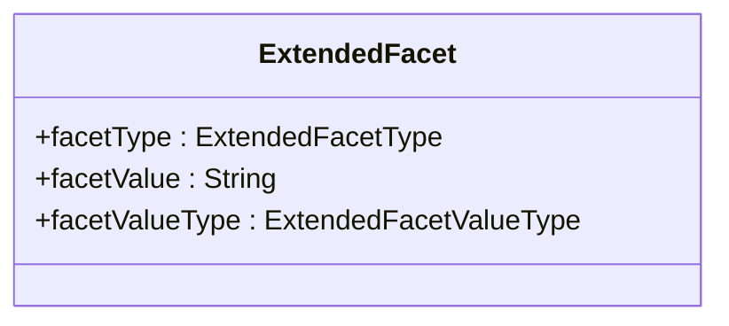

(Illustrative UML example: operations/methods are omitted in this document.)


ExtendedFacet


16 Note that, in any case, attributes inherited from a super class are not shown in the sub class. 463  464 The following table structure is used in the definition of the classes, attributes, and associations. 465  466 Class Feature Description ClassName    attributeName   associationName   +roleName   467 The content in the “Feature” column comprises or explains one of the following structural 468 features of the class: 469  470 • Whether it is an abstract class. Abstract classes are shown in italic Courier font. 471 • The superclass this class inherits from, if any. 472 • The sub classes of this class, if any. 473 • Attribute – the attributeName is shown in Courier font. 474 • Association – the associationName is shown in Courier font. If the association is 475 derived from the association between super classes, then the format is 476 /associationName. 477 • Role – the +roleName is shown in Courier font. 478  479 The Description column provides a short definition or explanation of the Class or Feature. UML 480 class names may be used in the description and if so, they are presented in normal font with 481 spaces between words. For example, the class ConceptScheme will be written as Concept 482 Scheme. 483 1.3 Overall Functionality 484 1.3.1 Information Model Packages 485 The SDMX Information Model (SDMX-IM) is a conceptual metamodel from which syntax specific 486 implementations are developed. The model is constructed as a set of functional packages which 487 assist in the understanding, re-use and maintenance of the model. 488  489 In addition to this, to aid understanding each package can be considered to be in one of three 490 conceptual layers:  491  492 the SDMX Base layer comprises fundamental building blocks which are used by the 493 Structural Definitions layer and the Reporting and Dissemination layer 494 the Structural Definitions layer comprises the definition of the structural artefacts needed to 495 support data and metadata reporting and dissemination 496 the Reporting and Dissemination layer comprises the definition of the data and metadata 497 containers used for reporting and dissemination 498 In reality the layers have no implicit or explicit structural function as any package can make use 499 of any construct in another package. 500


17 1.3.2 Version 1.0 501 In version 1.0 the metamodel supported the requirements for: 502  503 Data Structure Definition including (domain) category scheme, (metadata) concept scheme, 504 and code list 505  506 Data and related metadata reporting and dissemination 507 The SDMX-IM comprises a number of packages. These packages act as convenient 508 compartments for the various sub models in the SDMX-IM. The diagram below shows the sub 509 models of the SDMX-IM that were included in the version 1.0 specification. 510
 511 

### Figure 3: SDMX Information Model v1.0 package structure

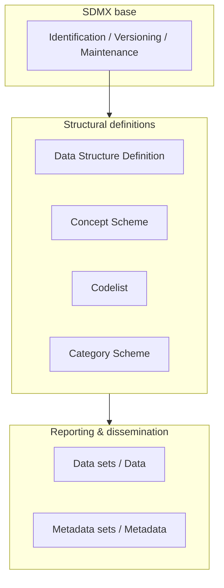


18 Furthermore, the term Data Structure Definition replaces the term Key Family: as both of these 527 terms are used in various communities, they are synonymous. The term Data Structure 528 Definition is used in the model and this document. 529
 

### Figure 4: SDMX Information Model v2.0/2.1 package structure

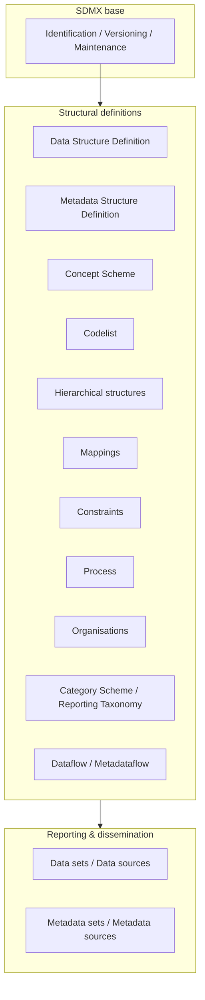


 539 

### Figure 5: v2.0/2.1 package structure including registry (overview)

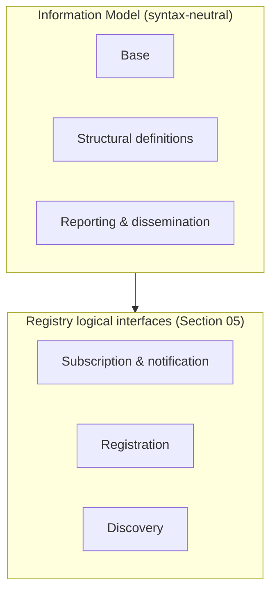


19  548 

### Figure 6: SDMX Information Model v3.0 package structure (also applies to v3.1)

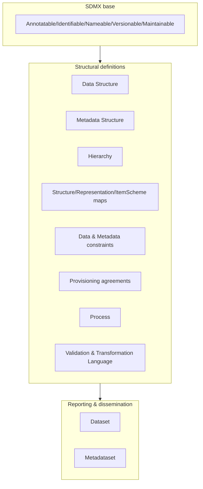


20 2 Actors and Use Cases 553 2.1 Introduction 554 In order to develop the data models, it is necessary to understand the functions to be supported 555 resulting from the requirements definition. These are defined in a use case model. The use case 556 model comprises actors and use cases and these are defined below. 557  558 Actor 559 “An actor defines a coherent set of roles that users of the system can play when interacting with 560 it. An actor instance can be played by either an individual or an external system” 561  562 Use case 563 “A use case defines a set of use-case instances, where each instance is a sequence of actions 564 a system performs that yields an observable result of value to a particular actor” 565  566 The overall intent of the model is to support data and metadata reporting, dissemination, and 567 exchange in the field of aggregated statistical data and related metadata. In order to achieve 568 this, the model needs to support three fundamental aspects of this process: 569  570 • Maintenance of structural and provisioning definitions 571 • Data and reference metadata publishing (reporting), and consuming (using) 572 • Access to data, reference metadata, and structural and provisioning definitions 573 This document covers the first two aspects, whilst the document on the Registry logical model 574 covers the last aspect. 575 2.2 Use Case Diagrams 576 2.2.1 Maintenance of Structural and Provisioning Definitions 577 2.2.1.1 Use cases 578  579
 Maintain Metadataflow DefinitionMaintain Dataflow DefinitionMaintain Category SchemeMaintain Code ListMaintain Hierarchical Code SchemeMaintain Data Structure DefinitionMaintain Metadata Structure DefinitionMaintain  Structure SetMaintenance Agency
Maintain Reporting T axonomyMaintain Maintenance Agency SchemeCommunity Administrator(from Actors)
Maintain Structure DefinitionsStructural Definitions Maintenance Agency
Maintain Provision AgreementProvisioning Definitions Maintenance AgencyMaintainConceptsMaintainProcessMaintain Organisation SchemeMaintain Constraints


21 

### Figure 7: Use cases: maintaining structural & provisioning definitions

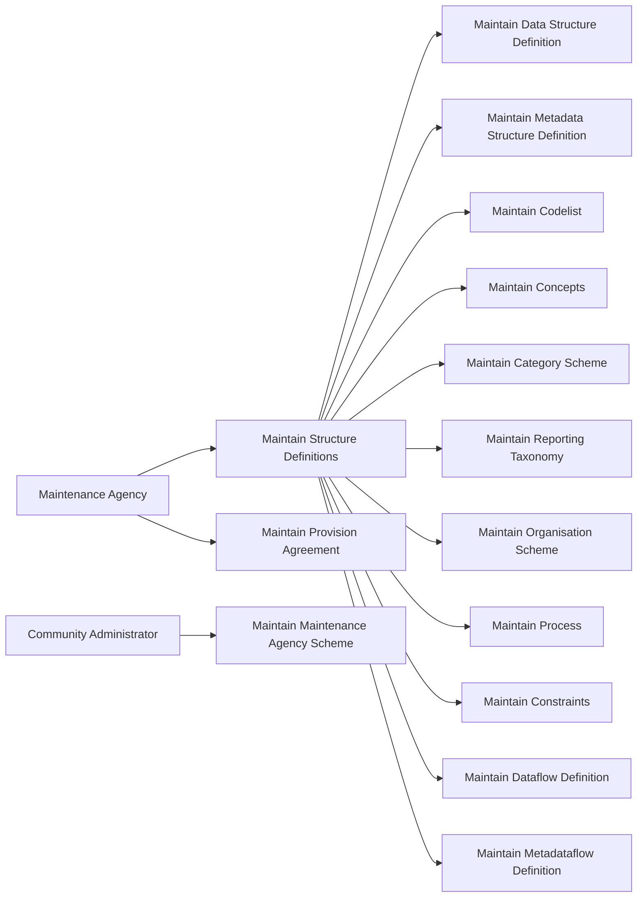


Maintenance Agency


22 Actor Use Case Description artefacts such as provision agreement, and sub-maintenance agencies.  sub roles are: Structural Definitions Maintenance Agency Provisioning Definitions Maintenance Agency   Responsible for maintaining structural definitions.   The maintenance of structural definitions. This use case has sub class use cases for each of the structural artefacts that are maintained.          Creation and maintenance of the Data Structure Definition, Metadata Structure Definition, and the supporting artefacts that they use, such as code list and concepts                         Structural Definitions Maintenance AgencyMaintain Structure DefinitionsMaintain Code ListMaintainConceptsMaintain Category SchemeMaintain Data Structure DefinitionMaintain Metadata Structure DefinitionMaintain Hierarchical Code Scheme


23 Actor Use Case Description                      This includes Agency, Data Provider, Data Consumer, and Organisation Unit Scheme      Responsible for maintaining data and metadata provisioning definitions.    The maintenance of provisioning definitions.  

### Figure 8: Actors & use cases table (maintenance)

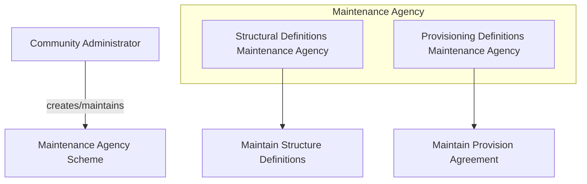


24 2.2.2 Publishing and Using Data and Reference Metadata 605 2.2.2.1 Use Cases 606
 607 

### Figure 9: Use cases: publishing & using data and reference metadata

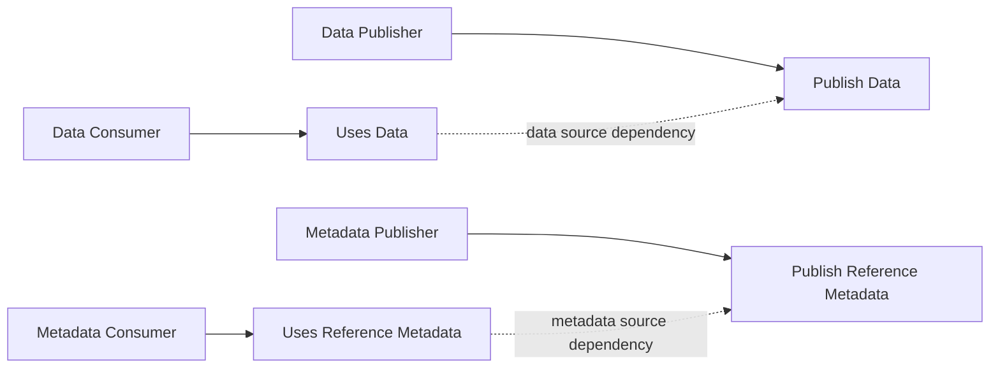


Metadata ConsumerUses Data
Uses Reference Metadata<<extend>>Publish DataData Publisherdata source
metadata source


25 2.2.2.3 Definitions 627 Actor Use Case Description   Responsible for publishing data according to a specified Data Structure Definition (data structure) definition, and relevant provisioning definitions.   Publish a data set. This could mean a physical data set or it could mean to make the data available for access at a data source such as a database that can process a query.   The user of the data. It may be a human consumer accessing via a user interface, or it could be an application such as a statistical production system.   Use data that is formatted according to the structural definitions and made available according to the provisioning definitions. Data are often linked to metadata that may reside in a different location and be published and maintained independently.   Responsible for publishing reference metadata according to a specified metadata structure definition, and relevant provisioning definitions.   Publish a reference metadata set. This could mean a physical metadata set or it could mean to make the reference metadata available for access at a metadata source such as a metadata repository that can process a query. Data Publisher
Publish Data
Data ConsumerUses Data
Metadata PublisherPublish Reference Metadata


26 Actor Use Case Description   The user of the reference metadata. It may be a human consumer accessing via a user interface, or it could be an application such as a statistical production or dissemination system.   Use reference metadata that is formatted according to the structural definitions and made available according to the provisioning definitions.  628 Metadata ConsumerUses Reference Metadata


27 629


28 3 SDMX Base Package 630 3.1 Introduction 631 The constructs in the SDMX Base package comprise the fundamental building blocks that 632 support many of the other structures in the model. For this reason, many of the classes in this 633 package are abstract (i.e., only derived sub-classes can exist in an implementation). 634  635 The motivation for establishing the SDMX Base package is as follows: 636  637 it is accepted “Best Practise” to identify fundamental archetypes occurring in a model 638 identification of commonly found structures or “patterns” leads to easier understanding 639 identification of patterns encourages re-use 640 Each of the class diagrams in this section views classes from the SDMX Base package from a 641 different perspective.  There are detailed views of specific patterns, plus overviews showing 642 inheritance between classes, and relationships amongst classes. 643  644


29 3.2 Base Structures - Identification, Versioning, and Maintenance 645 3.2.1 Class Diagram 646
 647 

### Figure 10: Identification, maintenance and versioning (base structures)

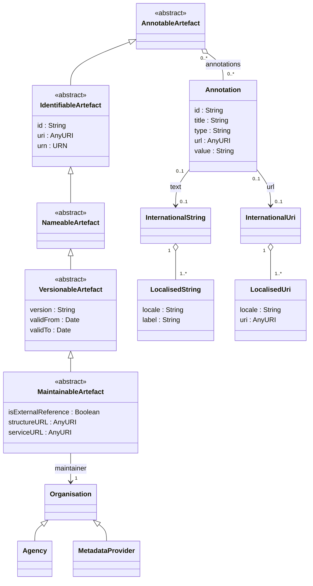


30 3.2.2 Explanation of the Diagram 649 3.2.2.1 Narrative 650 This group of classes forms the nucleus of the administration facets of SDMX objects. They 651 provide features which are reusable by derived classes to support horizontal functionality such 652 as identity, versioning etc. 653  654 All classes derived from the abstract class AnnotableArtefact may have Annotations (or 655 notes): this supports the need to add notes to all SDMX-ML elements.  The Annotation is used 656 to convey extra information to describe any SDMX construct. This information may be in the 657 form of a URL reference and/or a multilingual text (represented by the association to 658 InternationalString). 659  660 The IdentifiableArtefact is an abstract class that comprises the basic attributes needed 661 for identification. Concrete classes based on IdentifiableArtefact all inherit the ability to 662 be uniquely identified.  663  664 The NamableArtefact is an abstract class that inherits from IdentifiableArtefact and 665 in addition the +description and +name roles support multilingual descriptions and names 666 for all objects based on NameableArtefact. The InternationalString supports the 667 representation of a description in multiple locales (locale is similar to language but includes 668 geographic variations such as Canadian French, US English etc.). The LocalisedString 669 supports the representation of a description in one locale. 670  671 VersionableArtefact is an abstract class which inherits from NameableArtefact and 672 adds versioning ability to all classes derived from it, as explained in the SDMX versioning rules 673 in SDMX Standards Section 6 “Technical Notes”, paragraph “4.3 Versioning”. 674  675 MaintainableArtefact further adds the ability for derived classes to be maintained via its 676 association to an Organisation, and adds locational information (i.e., from where the object 677 can be retrieved). 678  679 The inheritance chain from AnnotableArtefact through to MaintainableArtefact 680 allows SDMX classes to inherit the features they need, from simple annotation, through identity, 681 naming, to versioning and maintenance. 682  683 3.2.2.2 Definitions 684 Class Feature Description AnnotableArtefact  Base inheritance sub classes are: IdentifiableArtefact Objects of classes derived from this can have attached annotations. Annotation  Additional descriptive information attached to an object.  id Identifier for the Annotation. It can be used to disambiguate one Annotation from another where there are several Annotations for the same annotated object.


31 Class Feature Description  title A title used to identify an annotation.  type Specifies how the annotation is to be processed.  url A link to external descriptive text.  value A non-localised version of the Annotation content.  +url An International URI provides a set of links that are language specific, via this role.  +text An International String provides the multilingual text content of the annotation via this role. InternationalUri  The International Uri is a collection of Localised URIs and supports linking to external descriptions in multiple locales. LocalisedUri  The Localised URI supports the link to an external description in one locale (locale is similar to language but includes geographic variations such as Canadian French, US English etc.). IdentifiableArtefact Superclass is AnnotableArtefact  Base inheritance sub classes are: NameableArtefact Provides identity to all derived classes.  It also provides annotations to derived classes because it is a subclass of Annotable Artefact.  id The unique identifier of the object.  uri Universal resource identifier that may or may not be resolvable.  urn Universal resource name – this is for use in registries: all registered objects have a urn. NameableArtefact Superclass is IdentifiableArtefact Base inheritance sub classes are: VersionableArtefact Provides a Name and Description to all derived classes in addition to identification and annotations.   +description A multi-lingual description is provided by this role via the International String class.  +name A multi-lingual name is provided by this role via the International String class


32 Class Feature Description InternationalString  The International String is a collection of Localised Strings and supports the representation of text in multiple locales. LocalisedString  The Localised String supports the representation of text in one locale (locale is similar to language but includes geographic variations such as Canadian French, US English etc.).  label Label of the string.  locale The geographic locale of the string e.g French, Canadian French. VersionableArtefact Superclass is NameableArtefact Base inheritance sub classes are: MaintainableArtefact Provides versioning information for all derived objects.  version A version string following SDMX versioning rules.  validFrom Date from which the version is valid  validTo Date from which version is superseded MaintainableArtefact Inherits from VersionableArtefact  An abstract class to group together primary structural metadata artefacts that are maintained by an Agency.  isExternalReference If set to “true” it indicates that the content of the object is held externally.  structureURL The URL of an SDMX-ML document containing the external object.  serviceURL The URL of an SDMX-compliant web service from which the external object can be retrieved.  +maintainer Association to the Maintenance Agency responsible for maintaining the artefact. Agency  See section on “Organisations”  685


33 3.3 Basic Inheritance 686 3.3.1 Class Diagram – Basic Inheritance from the Base Inheritance Classes 687
 688 

### Figure 11: Basic inheritance overview from base structures (simplified)

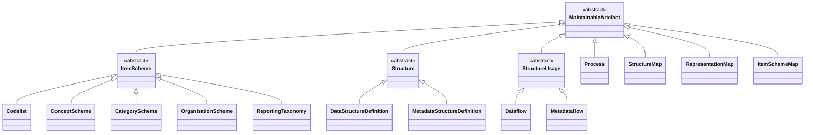

(Figure 11 in the PDF is a large inheritance map; this Mermaid version keeps the main super-types and key concrete artefacts.)


34 3.4 Data Types 694 3.4.1 Class Diagram 695  696
 

### Figure 12: Basic data types (enumerations and supporting types)

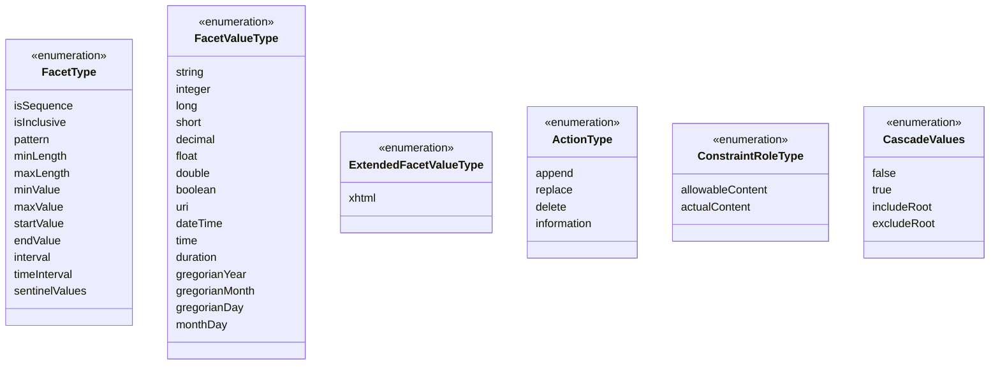


35 3.4.2 Explanation of the Diagram 698 3.4.2.1 Narrative 699 The FacetType and FacetValueType enumerations are used to specify the valid format of 700 the content of a non-enumerated Concept or the usage of a Concept when specified for use 701 on a Component on a Structure (such as a Dimension in a 702 DataStructureDefinition). The description of the various types can be found in the 703 chapter on ConceptScheme (section 4.5). 704  705 The ActionType enumeration is used to specify the action that a receiving system should take 706 when processing the content that is the object of the action. It is enumerated as follows: 707  708 • Append: Data or metadata is an incremental update for an existing data/metadata set or the 709 provision of new data or documentation (attribute values) formerly absent. If any of the 710 supplied data or metadata is already present, it will not replace that data or metadata. This 711 corresponds to the "Update" value found in version 1.0 of the SDMX Technical Standards. 712 • Replace: Data/metadata is to be replaced and may also include additional data/metadata 713 to be appended. 714 • Delete: Data/Metadata is to be deleted. 715 • Information: Data and metadata are for information purposes. 716  717 The ToValueType data type contains the attributes to support transformations defined in the 718 StructureMap (see Section 0). 719  720 The ConstraintRoleType data type contains the attributes that identify the purpose of a 721 Constraint (allowableContent, actualContent). 722  723 The ComponentRoleType data type contains the predefined Concept roles that can be 724 assigned to any Component. 725  726 The CascadeValues data type contains the possible values for a MemberValue within a 727 CubeRegion, in order to enable cascading to all children Codes of a selected Code, while 728 including/excluding the latter in the selection. 729  730 The VersionType data types provides the details for versioning according to SDMX versioning 731 rules, as explained in SDMX Standards Section 6, paragraph “4.3 Versioning”. 732 3.5 The Item Scheme Pattern 733 3.5.1 Context 734 The Item Scheme is a basic architectural pattern that allows the creation of list schemes for use 735 in simple taxonomies, for example.  736  737 The ItemScheme is the basis for CategoryScheme, Codelist, ConceptScheme, 738 ReportingTaxonomy, OrganisationScheme, TransformationScheme, 739 CustomTypeScheme, NamePersonalisationScheme, RulesetScheme, 740 VtlMappingScheme and UserDefinedOperatorScheme. 741


36 3.5.2 Class Diagram 742
 

### Figure 13: Item Scheme pattern

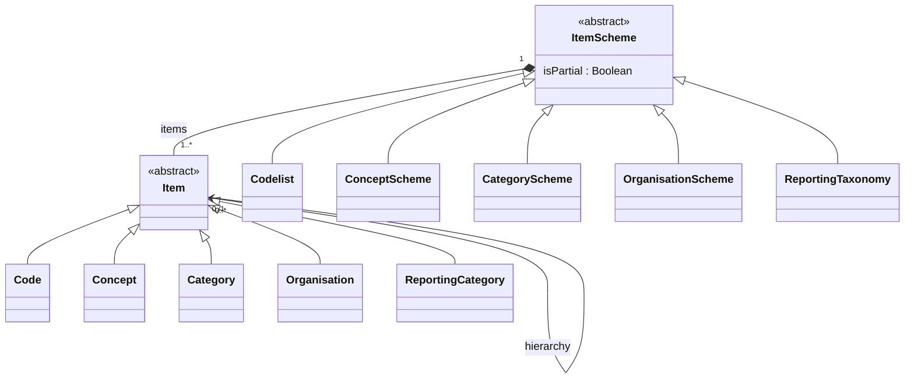


37  756 A “partial” ItemScheme cannot be maintained independently in its partial form i.e., it cannot 757 contain Items that are not present in the full ItemScheme and the content of any one Item 758 (e.g., names and descriptions) cannot deviate from the content in the full ItemScheme. 759 Furthermore, the id of the ItemScheme where isPartial is set to "true" is the same as the 760 id of the full ItemScheme (agencyId, id, version). This is important as this is the id that 761 that is referenced in other structures (e.g., a Codelist referenced in a DSD) and this id is 762 always the same, regardless of whether the disseminated ItemScheme is the full ItemScheme 763 or a partial ItemScheme. 764  765 The purpose of a partial ItemScheme is to support the exchange and dissemination of a sub-766 set ItemScheme without the need to maintain multiple ItemSchemes which contain the same 767 Items. For instance, when a Codelist is used in a DataStructureDefinition it is 768 sometimes the case that only a sub-set of the Codes in a Codelist are relevant. In this case 769 a partial Codelist can be constructed using the Constraint mechanism explained later in this 770 document. 771  772 Item inherits from NameableArtefact which gives it the ability to be annotated and have 773 identity, and therefore has id, uri and urn attributes, a name and a description in the form of 774 an InternationalString. Unlike the parent ItemScheme, the Item itself is not a 775 MaintainableArtefact and therefore cannot have an independent Agency (i.e., it implicitly 776 has the same agencyId as the ItemScheme).  777  778 The Item can be hierarchic and so one Item can have child Items. The restriction of the 779 hierarchic association is that a child Item can have only parent Item. 780  781 3.5.3.2 Definitions 782 Class Feature Description ItemScheme Inherits from: MaintainableArtefact Direct sub classes are: CategoryScheme ConceptScheme Codelist ReportingTaxonomy OrganisationScheme TransformationScheme CustomTypeScheme NamePersonalisationScheme RulesetScheme VtlMappingScheme UserDefinedOperatorScheme The descriptive information for an arrangement or division of objects into groups based on characteristics, which the objects have in common.
 isPartial Denotes whether the Item Scheme contains a subset of the full set of Items in the maintained scheme.


38 Class Feature Description  /items Association to the Items in the scheme. Item Inherits from: NameableArtefact Direct sub classes are Category Concept Code ReportingCategory Organisation Transformation CustomType NamePersonalisation Ruleset VtlMapping UserDefinedOperator The Item is an item of content in an Item Scheme. This may be a node in a taxonomy or ontology, a code in a code list etc. Node that at the conceptual level the Organisation is not hierarchic.  hierarchy This allows an Item optionally to have one or more child Items. 3.6 The Structure Pattern 783 3.6.1 Context 784 The Structure Pattern is a basic architectural pattern which allows the specification of complex 785 tabular structures which are often found in statistical data (such as Data Structure Definition, 786 and Metadata Structure Definition). A Structure is a set of ordered lists.  A pattern to underpin 787 this tabular structure has been developed, so that commonalities between these structure 788 definitions can be supported by common software and common syntax structures. 789


39 3.6.2 Class Diagrams 790
 791 

### Figure 14: Structure pattern

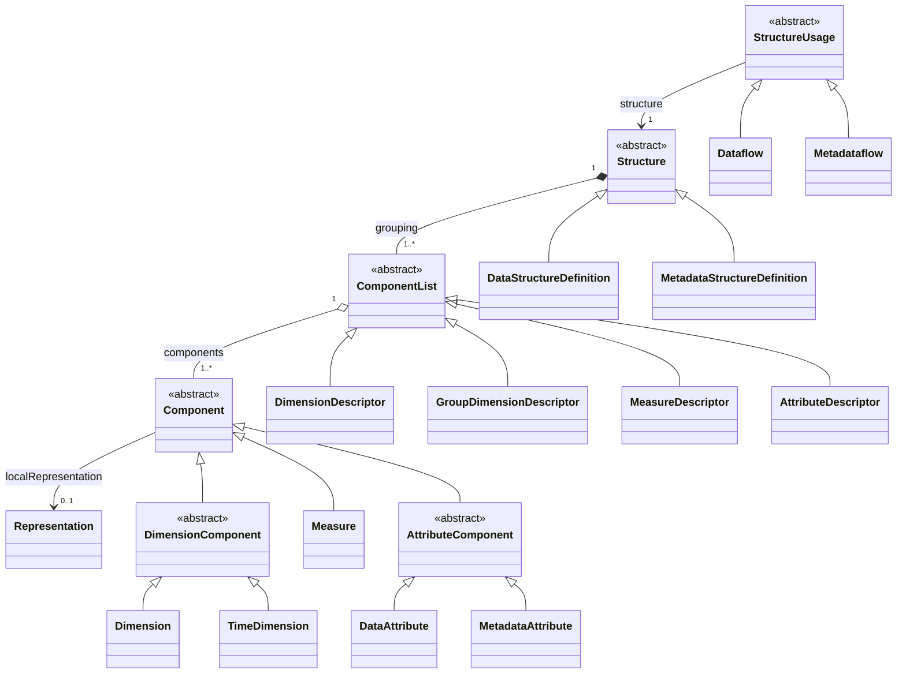


40  793
 794 

### Figure 15: Representation within the structure pattern

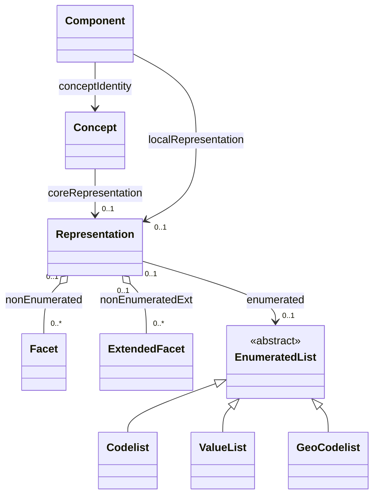


41 AttributeDescriptor: DataAttribute, MetadataAttributeRef 815 MetadataAttributeDescriptor: MetadataAttribute 816  817 Each Component takes its semantic (and possibly also its representation) from a Concept in 818 a ConceptScheme. This is represented by the conceptIdentity association to Concept. 819  820 The Component may also have a localRepresentation. This allows a concrete class, such 821 as Dimension, to specify its representation which is local to the Structure in which it is 822 contained (for Dimension this will be DataStructureDefinition), and thus overrides any 823 coreRepresentation specified for the Concept. 824  825 The Representation can be enumerated or non-enumerated. The valid content of an 826 enumerated representation is specified either in an ItemScheme which can be one of 827 Codelist, ValueList or GeoCodelist. The valid content of a non-enumerated 828 representation is specified as one or more Facet(s) (for example, these may specify minimum 829 and maximum values). For any Attribute this is achieved by one of more 830 ExtendedFacet(s), which allow the additional representation of XHTML. 831  832 The types of representation that are valid for specific components is expressed in the model as 833 a constraint on the association: 834  835 • The Dimension, DataAttribute, Measure, MetadataAttribute may be enumerated 836 and, if so, use an EnumeratedList. 837 • The Dimension and Measure may be non-enumerated and, if so, use one or more 838 Facet(s), note that the FacetValueType applicable to the TimeDimension is restricted 839 to those that represent time. 840 • The MetadataAttribute and DataAttribute may be non-enumerated and, if so, use 841 one or more ExtendedFacet(s). 842  843 The Structure may be used by one or more StructureUsage(s). An example of this, in 844 terms of concrete classes, is that a Dataflow (sub class of StructureUsage) may use a 845 particular DataStructureDefinition (sub class of Structure), and similar constructs 846 apply for the Metadataflow (link to MetadataStructureDefinition). 847 3.6.3.2 Definitions 848 Class Feature Description StructureUsage Inherits from: MaintainableArtefact Sub classes are: Dataflow Metadataflow  An artefact whose components are described by a Structure. In concrete terms (sub-classes) an example would be a Dataflow which is linked to a given structure – in this case the Data Structure Definition.  structure An association to a Structure specifying the structure of the artefact.


42 Class Feature Description Structure Inherits from: MaintainableArtefact Sub classes are: DataStructureDefinition MetadataStructureDefinition Abstract specification of a list of lists to define a complex tabular structure. A concrete example of this would be statistical concepts, code lists, and their organisation in a data or metadata structure definition, defined by a centre institution, usually for the exchange of statistical information with its partners.  grouping A composite association to one or more component lists. ComponentList Inherits from: IdentifiableArtefact Sub classes are: DimensionDescriptor GroupDimensionDescriptor MeasureDescriptor AttributeDescriptor MetadataAttributeDescriptor An abstract definition of a list of components.  A concrete example is a Dimension Descriptor, which defines the list of Dimensions in a Data Structure Definition.    components An aggregate association to one or more components which make up the list. Component Inherits from: IdentifiableArtefact Sub classes are: Measure AttributeComponent DimensionComponent A Component is an abstract super class used to define qualitative and quantitative data and metadata items that belong to a Component List and hence a Structure. Component is refined through its sub-classes.  conceptIdentity Association to a Concept in a Concept Scheme that identifies and defines the semantic of the Component.  localRepresentation Association to the Representation of the Component if this is different from the coreRepresentation of the Concept, which the Component uses (ConceptUsage).


43 Class Feature Description Representation  The allowable value or format for Component or Concept  +enumerated Association to an enumerated list that contains the allowable content for the Component when reported in a data or metadata set. The type of enumerated list that is allowed for any concrete Component is shown in the constraints on the association.  +nonEnumerated Association to a set of Facets that define the allowable format for the content of the Component when reported in a data or metadata set. Facet  Defines the format for the content of the Component when reported in a data or metadata set.   facetType A specific content type, which is constrained by the Facet Type enumeration.  facetValueType The format of the value of a Component when reported in a data or metadata set. This is constrained by the Facet Value Type enumeration.  +itemSchemeFacet Defines the format of the identifiers in an Item Scheme used by a Component. Typically, this would define the number of characters (length) of the identifier.  ExtendedFacet  This has the same function as Facet but allows additionally an XHTML representation. This is constrained for use with a Metadata Attribute and a Data Attribute.  849 The specification of the content and use of the sub classes to ComponentList and Component 850 can be found in the section in which they are used (DataStructureDefinition and 851


44 MetadataStructureDefinition). Moreover, the FacetType SentinelValues is 852 explained in the datastructure representation diagram (see 5.3.2.2), since it only concerns 853 DataStructureDefinitions. 854 3.6.3.3 Representation Constructs 855 The majority of SDMX FacetValueTypes are compatible with those found in XML Schema, 856 and have equivalents in most current implementation platforms: 857  858 SDMX Facet Value Type XML Schema Data Type JSON Schema Data Type .NET Framework Type Java Data Type String xsd:string string System.String java.lang.String Big Integer xsd:integer integer System.Decimal java.math.BigInteger Integer xsd:int integer System.Int32 int Long xsd.long integer System.Int64 long Short xsd:short integer System.Int16 short Decimal xsd:decimal number System.Decimal java.math.BigDecimal Float xsd:float number System.Single float Double xsd:double number System.Double double Boolean xsd:boolean boolean System.Boolean boolean URI xsd:anyURI string:uri System.Uri Java.net.URI or java.lang.String DateTime xsd:dateTime string:date-time System.DateTime javax.xml.datatype.XMLGregorianCalendar Time xsd:time string:time System.DateTime javax.xml.datatype.XMLGregorianCalendar GregorianYear xsd:gYear string2 System.DateTime javax.xml.datatype.XMLGregorianCalendar GregorianMonth xsd:gYearMonth string System.DateTime javax.xml.datatype.XMLGregorianCalendar GregorianDay xsd:date string System.DateTime javax.xml.datatype.XMLGregorianCalendar Day, MonthDay, Month  xsd:g* string System.DateTime javax.xml.datatype.XMLGregorianCalendar Duration xsd:duration  string System.TimeSpan javax.xml.datatype.Duration  859 There are also a number of SDMX data types which do not have these direct correspondences, 860 often because they are composite representations or restrictions of a broader data type. These 861 are detailed in Section 6 of the standards. 862  863 The Representation is composed of Facets, each of which conveys characteristic 864 information related to the definition of a value domain. Often a set of Facets are needed to 865 convey the required semantic. For example, a sequence is defined by a minimum of two 866 Facets: one to define the start value, and one to define the interval. 867  868  2 In the JSON schemas, more complex data types are complemented with regular expressions, whenever no direct mapping to a standard type exists. Facet Type Explanation isSequence The isSequence facet indicates whether the values are intended to be ordered, and it may work in combination with the interval, startValue, and endValue facet or the timeInterval, startTime, and endTime,


45 facets. If this attribute holds a value of true, a start value or time and a numeric or time interval must be supplied. If an end value is not given, then the sequence continues indefinitely. interval The interval attribute specifies the permitted interval (increment) in a sequence. In order for this to be used, the isSequence attribute must have a value of true. startValue The startValue facet is used in conjunction with the isSequence and interval facets (which must be set in order to use this facet). This facet is used for a numeric sequence and indicates the starting point of the sequence. This value is mandatory for a numeric sequence to be expressed. endValue The endValue facet is used in conjunction with the isSequence and interval facets (which must be set in order to use this facet). This facet is used for a numeric sequence and indicates that ending point (if any) of the sequence. timeInterval The timeInterval facet indicates the permitted duration in a time sequence. In order for this to be used, the isSequence facet must have a value of true. startTime The startTime facet is used in conjunction with the isSequence and timeInterval facets (which must be set in order to use this facet). This attribute is used for a time sequence and indicates the start time of the sequence. This value is mandatory for a time sequence to be expressed. endTime The endTime facet is used in conjunction with the isSequence and timeInterval facets (which must be set in order to use this facet). This facet is used for a time sequence and indicates that ending point (if any) of the sequence. minLength The minLength facet specifies the minimum and length of the value in characters. maxLength The maxLength facet specifies the maximum length of the value in characters. minValue The minValue facet is used for inclusive and exclusive ranges, indicating what the lower bound of the range is. If this is used with an inclusive range, a valid value will be greater than or equal to the value specified here. If the inclusive and exclusive data type is not specified (e.g., this facet is used with an integer data type), the value is assumed to be inclusive. maxValue The maxValue facet is used for inclusive and exclusive ranges, indicating what the upper bound of the range is. If this is used with an inclusive range, a valid value will be less than or equal to the value specified here. If the inclusive and exclusive data type is not specified (e.g., this facet is used with an integer data type), the value is assumed to be inclusive. decimals The decimals facet indicates the number of characters allowed after the decimal separator. pattern The pattern attribute holds any regular expression permitted in the implementation syntax (e.g., W3C XML Schema).


46 4 Specific Item Schemes 869 4.1 Introduction 870 The structures that are an arrangement of objects into hierarchies or lists based on 871 characteristics, and which are maintained as a group inherit from ItemScheme. These concrete 872 classes are: 873  874 Codelist 875 ConceptScheme 876 CategoryScheme 877 AgencyScheme, DataProviderScheme, MetadataProviderScheme, 878 DataConsumerScheme, OrganisationUnitScheme, which all inherit from the 879 abstract class OrganisationScheme  880 ReportingTaxonomy 881 TransformationScheme 882 RulesetScheme 883 UserDefinedOperatorScheme 884 NamePersonalisationScheme 885 CustomTypeScheme 886 VtlMappingScheme 887 Note that the VTL related schemes (the last 6 of the above list) are detailed in a dedicated 888 section below (section 15). 889 4.2 Inheritance View 890 The inheritance and relationship views are shown together in each of the diagrams in the specific 891 sections below. 892


47 4.3 Codelist 893 4.3.1 Class Diagram 894  895
 

### Figure 16: Codelist

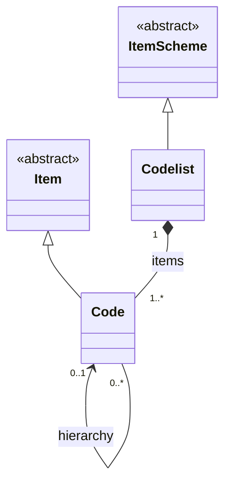


48  900 id 901 uri 902 urn 903 version 904 validFrom 905 validTo 906 isExternalReference 907 serviceURL 908 structureURL 909 isPartial 910 The Code inherits from Item and has the following attributes: 911  912 id 913 uri 914 urn 915 Both Codelist and Code have the association to InternationalString to support a multi-916 lingual name, an optional multi-lingual description, and an association to Annotation to 917 support notes (not shown).  918  919 Through the inheritance the Codelist comprise one or more Codes, and the Code itself can 920 have one or more child Codes in the (inherited) hierarchy association. Note that a child Code 921 can have only one parent Code in this association. A more complex Hierarhcy, which allows 922 multiple parents is described later. 923  924 A partial Codelist (where isPartial is set to 'true') is identical to a Codelist and contains 925 the Code and associated names and descriptions, just as in a normal Codelist. However, its 926 content is a subset of the full Codelist. The way this works is described in section 3.5.3.1 on 927 ItemScheme. 928  929 4.3.2.2 Definitions 930 Class Feature Description Codelist Inherits from ItemScheme A list from which some statistical concepts (coded concepts) take their values.  Code Inherits from Item A language independent set of letters, numbers or symbols that represent a concept whose meaning is described in a natural language.  hierarchy Associates the parent and the child codes.  extends Associates a Codelist with any Codelists that it may extend.  931


49 4.3.3 Class Diagram – Codelist Extension 932
 933 

### Figure 17: Codelist extension

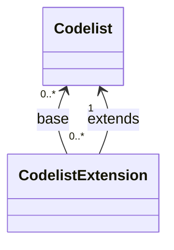

(A Codelist may extend another Codelist; the extension references a base Codelist and adds Codes.)


50 may have a value that corresponds to a Code, including its children Codes (via the 946 cascadeValues property), or even include instances of the wildcard character ‘%’ in order to 947 point to a set of Codes with common parts in their identifiers. 948 4.3.3.2 Definitions 949 Class Feature Description CodelistExtension  The association between Codelists that may extend other Codelists.  prefix A prefix to be used for a Codelist used in a extension, in order to avoid Code Conflicts.  sequence The order that will be used when extending a Codelist, for resolving Code conflicts. The latest Codelist used overrides any previous Codelist. InclusiveCodeSelection  The subset of Codes to be included when extending a Codelist. ExclusiveCodeSelection  The subset of Codes to be excluded when extending a Codelist. MemberValue Inherits from: SelectionValue A collection of values based on Codes and their children.  cascadeValues A property to indicate if the child Codes of the selected Code shall be included in the selection. It is also possible to include children and exclude the Code by using the 'excluderoot' value.  value The value of the Code to include in the selection. It may include the ‘%’ character as a wildcard.  950 4.3.4 Class Diagram – Geospatial Codelist 951 The geospatial support is implemented via an extension of the normal Codelist. This is 952 illustrated in the following diagrams. 953


51  954 

### Figure 18: GeoCodelist inheritance

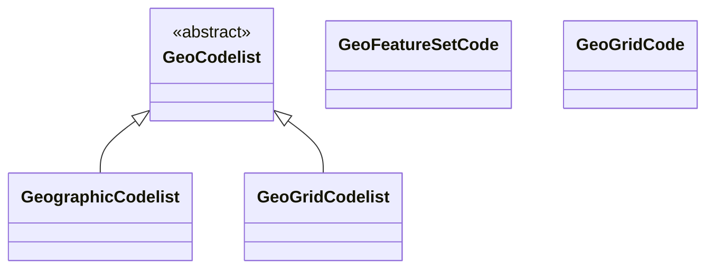


52  956 

### Figure 19: Geospatial codelists (simplified)

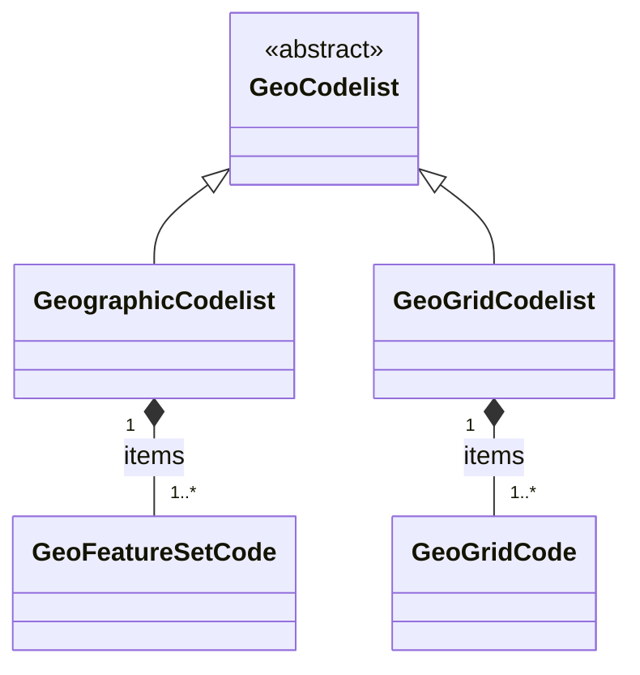


53  geoType The type of Geo Codelist that the Codelist will become. GeoRefCode Abstract Class Sub Classes: GeoFeatureSetCode GeoGridCode The abstract class that represents a special type of Code, which includes geospatial information. GeographicCodelist  A special Codelist that has been extended to add a geographical feature set to each of its items, typically, this would include all types of administrative geographies. GeoGridCodelist  A code list that has defined a geographical grid composed of cells representing regular squared portions of the Earth.  gridDefinition Contains a regular expression string corresponding to the grid definition for the GeoGrid Codelist. GeoFeatureSetCode  A Code that has a geo feature set.  value The geo feature set of the Code, which represents a set of points defining a feature in a format defined a predefined pattern (see section 6). GeoGridCode  A Code that represents a Geo Grid Cell belonging in a specific grid definition.  geoCell The value used to assign the Code to one cell in the grid.  973


54 4.4 ValueList 974 4.4.1 Class Diagram 975
 976 

### Figure 20: ValueList

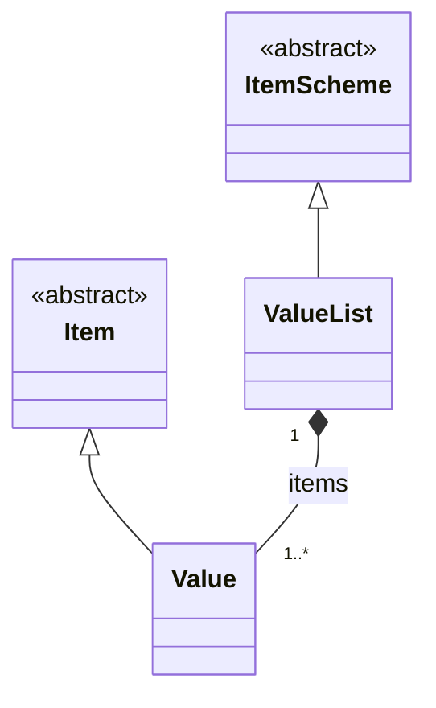


55  982 id 983 uri 984 urn 985 version 986 validFrom 987 validTo 988 isExternalReference 989 registryURL 990 structureURL 991 repositoryURL 992 ValueItem inherits from EnumeratedItem, which adds an id, with relaxed constraints, to the 993 former. 994  995 Through the inheritance from NameableArtefact the ValueList has the association to 996 InternationalString to support a multi-lingual name, an optional multi-lingual description, 997 and an association to Annotation to support notes (not shown). Similarly, the ValueItem, 998 inherits the association to InternationalString and to the Annotation from the 999 EnumeratedItem. 1000  1001 The ValueList can have one or more ValueItems. 1002 4.4.2.2 Definitions 1003 Class Feature Description ValueList Inherits from EnumeratedList A list from which some statistical concepts (enumerated concepts) take their values. ValueItem Inherits from EnumeratedItem A language independent set of letters, numbers or symbols that represent a concept whose meaning is described in a natural language.  1004


56 4.5 Concept Scheme and Concepts 1005 4.5.1 Class Diagram - Inheritance 1006  1007
 

### Figure 21: ConceptScheme (inheritance view)

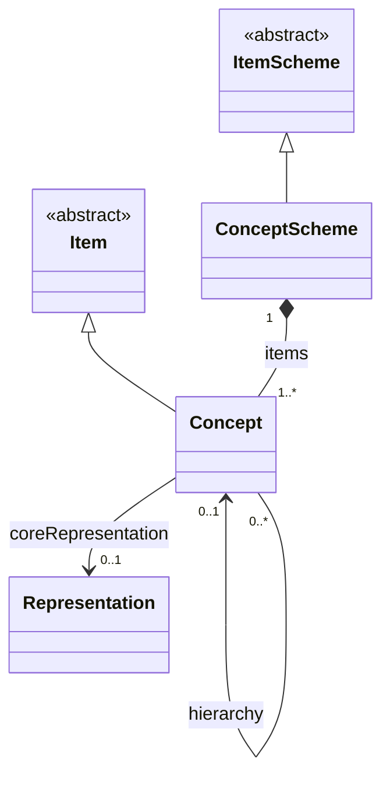


57  1010 id 1011 uri 1012 urn 1013 version 1014 validFrom 1015 validTo 1016 isExternalReference 1017 registryURL 1018 structureURL 1019 repositoryURL 1020 isPartial 1021 Concept inherits from Item and has the following attributes: 1022  1023 id 1024 uri 1025 urn 1026 Through the inheritance from NameableArtefact both ConceptScheme and Concept have 1027 the association to InternationalString to support a multi-lingual name, an optional multi-1028 lingual description, and an association to Annotation to support notes (not shown). 1029  1030 Through the inheritance from ItemScheme the ConceptScheme comprise one or more 1031 Concepts, and the Concept itself can have one or more child Concepts in the (inherited) 1032 hierarchy association. Note that a child Concept can have only one parent Concept in this 1033 association. 1034  1035 A partial ConceptScheme (where isPartial is set to “true”) is identical to a ConceptScheme 1036 and contains the Concept and associated names and descriptions, just as in a normal 1037 ConceptScheme. However, its content is a subset of the full ConceptScheme. The way this 1038 works is described in section 3.5.3.1 on ItemScheme. 1039  1040


58 4.5.3 Class Diagram - Relationship 1041
 1042 

### Figure 22: ConceptScheme relationships (simplified)

```mermaid
classDiagram
direction LR
class Concept
class ConceptScheme
class Representation
class Facet
ConceptScheme "1" *-- "1..*" Concept : items
Concept --> "0..1" Representation : coreRepresentation
Representation "0..*" o-- "0..*" Facet : facets
```


59 The Concept may be related to a concept described in terms of the ISO/IEC 11179 standard. 1063 The ISOConceptReference identifies this concept and concept scheme in which it is 1064 contained.  1065 4.5.4.2 Definitions 1066 Class Feature Description ConceptScheme  Inherits from ItemScheme The descriptive information for an arrangement or division of concepts into groups based on characteristics, which the objects have in common. Concept Inherits from Item A concept is a unit of knowledge created by a unique combination of characteristics.  /hierarchy Associates the parent and the child concept.  coreRepresentation Associates a Representation.  +ISOConcept Association to an ISO concept reference. ISOConceptReference  The identity of an ISO concept definition.  conceptAgency The maintenance agency of the concept scheme containing the concept.  conceptSchemeID The identifier of the concept scheme.  conceptID The identifier of the concept.  1067 4.6 Category Scheme 1068 4.6.1 Context 1069 This package defines the structure that supports the definition of and relationships between 1070 categories in a category scheme. It is similar to the package for concept scheme. An example 1071 of a category scheme is one which categorises data – sometimes known as a subject matter 1072 domain scheme or a data category scheme. Importantly, as will be seen later, the individual 1073 nodes in the scheme (the “categories”) can be associated to any set of 1074 IdentiableArtefacts in a Categorisation.  1075


60 4.6.2 Class diagram - Inheritance 1076
 

### Figure 23: CategoryScheme (inheritance view)

```mermaid
classDiagram
direction TB
class CategoryScheme
class Category
class ItemScheme {<<abstract>>}
class Item {<<abstract>>}
ItemScheme <|-- CategoryScheme
Item <|-- Category
CategoryScheme "1" *-- "1..*" Category : items
Category "0..1" <-- "0..*" Category : hierarchy
```


61 4.6.3 Explanation of the Diagram 1078 4.6.3.1 Narrative 1079 The categories are modelled as a hierarchical ItemScheme. The CategoryScheme inherits 1080 from the ItemScheme and has the following attributes: 1081  1082 id 1083 uri 1084 urn 1085 version 1086 validFrom 1087 validTo 1088 isExternalReference 1089 structureURL 1090 serviceURL 1091 isPartial 1092 Category inherits from Item and has the following attributes: 1093  1094 id 1095 uri 1096 urn 1097 Both CategoryScheme and Category have the association to InternationalString to 1098 support a multi-lingual name, an optional multi-lingual description, and an association to 1099 Annotation to support notes (not shown on the model). 1100  1101 Through the inheritance the CategoryScheme comprise one or more Categorys, and the 1102 Category itself can have one or more child Category in the (inherited) hierarchy 1103 association. Note that a child Category can have only one parent Category in this 1104 association. 1105  1106 A partial CategoryScheme (where isPartial is set to “true”) is identical to a 1107 CategoryScheme and contains the Category and associated names and descriptions, just 1108 as in a normal CategoryScheme. However, its content is a subset of the full 1109 CategoryScheme. The way this works is described in section 3.5.3.1 on ItemScheme. 1110  1111


62 4.6.4 Class diagram - Relationship 1112
 1113 

### Figure 24: CategoryScheme relationships (with categorisation, simplified)

```mermaid
classDiagram
direction TB
class CategoryScheme
class Category
class Categorisation
class StructureUsage {<<abstract>>}
class Dataflow
class Metadataflow

StructureUsage <|-- Dataflow
StructureUsage <|-- Metadataflow

CategoryScheme "1" *-- "1..*" Category : items
Categorisation --> "1" Category : category
Categorisation --> "1" StructureUsage : artefact
```


63 Class Feature Description Category  Inherits from Item An item at any level within a classification, typically tabulation categories, sections, subsections, divisions, subdivisions, groups, subgroups, classes and subclasses.  /hierarchy Associates the parent and the child Category. Categorisation Inherits from MaintainableArtefact Associates an Identifable Artefact with a Category.  +categorisedArtefact Associates the Identifable Artefact.  +categorisedBy Associates the Category. 4.7 Organisation Scheme 1126 4.7.1 Class Diagram 1127  1128
 

### Figure 25: Organisation schemes

```mermaid
classDiagram
direction TB
class OrganisationScheme {<<abstract>>}
class Organisation {<<abstract>>}
class AgencyScheme
class DataProviderScheme
class DataConsumerScheme
class OrganisationUnitScheme
class MetadataProviderScheme
class Agency
class DataProvider
class DataConsumer
class OrganisationUnit
class MetadataProvider

OrganisationScheme <|-- AgencyScheme
OrganisationScheme <|-- DataProviderScheme
OrganisationScheme <|-- DataConsumerScheme
OrganisationScheme <|-- OrganisationUnitScheme
OrganisationScheme <|-- MetadataProviderScheme

Organisation <|-- Agency
Organisation <|-- DataProvider
Organisation <|-- DataConsumer
Organisation <|-- OrganisationUnit
Organisation <|-- MetadataProvider

AgencyScheme "1" *-- "1..*" Agency : items
DataProviderScheme "1" *-- "1..*" DataProvider : items
DataConsumerScheme "1" *-- "1..*" DataConsumer : items
OrganisationUnitScheme "1" *-- "1..*" OrganisationUnit : items
MetadataProviderScheme "1" *-- "1..*" MetadataProvider : items
```


64 4.7.2 Explanation of the Diagram 1129 4.7.2.1 Narrative 1130 The OrganisationScheme is abstract. It contains Organisation which is also abstract. The 1131 Organisation can have child Organisation. 1132  1133 The OrganisationScheme can be one of five types: 1134  1135 1. AgencyScheme – contains Agency which is restricted to a flat list of agencies (i.e., there 1136 is no hierarchy). Note that the SDMX system of (Maintenance) Agency can be hierarchic 1137 and this is explained in more detail in the SDMX Standards Section 6 “Technical Notes”. 1138 2. DataProviderScheme – contains DataProvider which is restricted to a flat list of 1139 agencies (i.e., there is no hierarchy). 1140 3. MetadataProviderScheme – contains MetadataProvider which is restricted to a 1141 flat list of agencies (i.e., there is no hierarchy). 1142 4. DataConsumerScheme – contains DataConsumer which is restricted to a flat list of 1143 agencies (i.e., there is no hierarchy). 1144 5. OrganisationUnitScheme – contains OrganisationUnit which does inherit the 1145 /hierarchy association from Organisation. 1146  1147 Reference metadata can be attached to the Organisation by means of the metadata 1148 attachment mechanism. This mechanism is explained in the Reference Metadata section of this 1149 document (see section 7). This means that the model does not specify the specific reference 1150 metadata that can be attached to a DataProvider, MetadataProvider, DataConsumer, 1151 OrganisationUnit or Agency, except for limited Contact information. 1152  1153 A partial OrganisationScheme (where isPartial is set to “true”) is identical to an 1154 OrganisationScheme and contains the Organisation and associated names and 1155 descriptions, just as in a normal OrganisationScheme. However, its content is a subset of 1156 the full OrganisationScheme. The way this works is described in section 3.5.3.1 on 1157 ItemScheme. 1158  1159 4.7.2.2 Definitions 1160 Class Feature Description OrganisationScheme Abstract Class Inherits from ItemScheme Sub classes are: AgencyScheme DataProviderScheme MetadataProviderScheme DataConsumerScheme OrganisationUnitScheme A maintained collection of Organisations.  /items Association to the Organisations in the scheme.


65 Class Feature Description Organisation Abstract Class Inherits from Item Sub classes are: Agency DataProvider MetadataProvider DataConsumer OrganisationUnit An organisation is a unique framework of authority within which a person or persons act, or are designated to act, towards some purpose.  +contact Association to the Contact information.  /hierarchy Association to child Organisations. Contact  An instance of a role of an individual or an organization (or organization part or organization person) to whom an information item(s), a material object(s) and/or person(s) can be sent to or from in a specified context.  name The designation of the Contact person by a linguistic expression.  organisationUnit The designation of the organisational structure by a linguistic expression, within which Contact person works.  responsibility The function of the contact person with respect to the organisation role for which this person is the Contact.  telephone The telephone number of the Contact.  fax The fax number of the Contact.  email The Internet e-mail address of the Contact.  X400 The X400 address of the Contact.  uri The URL address of the Contact. AgencyScheme  A maintained collection of Maintenance Agencies.


66 Class Feature Description  /items Association to the Maintenance Agency in the scheme. DataProviderScheme  A maintained collection of Data Providers.  /items Association to the Data Providers in the scheme. MetadataProviderScheme  A maintained collection of Metadata Providers.  /items Association to the Metadata Providers in the scheme. DataConsumerScheme  A maintained collection of Data Consumers.  /items Association to the Data Consumers in the scheme. OrganisationUnitScheme  A maintained collection of Organisation Units.  /items Association to the Organisation Units in the scheme. Agency Inherits from Organisation Responsible agency for maintaining artefacts such as statistical classifications, glossaries, structural metadata such as Data and Metadata Structure Definitions, Concepts and Code lists. DataProvider Inherits from Organisation An organisation that produces data.  MetadataProvider Inherits from Organisation An organisation that produces reference metadata.  DataConsumer Inherits from Organisation An organisation using data as input for further processing. OrganisationUnit Inherits from Organisation A designation in the organisational structure.  /hierarchy Association to child Organisation Units  1161


67 4.8 Reporting Taxonomy 1162 4.8.1 Class Diagram 1163
 1164 

### Figure 26: Reporting taxonomy (simplified)

```mermaid
classDiagram
direction TB
class ReportingTaxonomy
class ReportingCategory
class ItemScheme {<<abstract>>}
class Item {<<abstract>>}
class StructureUsage {<<abstract>>}

ItemScheme <|-- ReportingTaxonomy
Item <|-- ReportingCategory
ReportingTaxonomy "1" *-- "1..*" ReportingCategory : items
ReportingCategory --> "0..*" StructureUsage : reportsOn
ReportingCategory "0..1" <-- "0..*" ReportingCategory : hierarchy
```


68 4.8.2 Explanation of the Diagram 1166 4.8.2.1 Narrative 1167 In some data reporting environments, and in particular those in primary reporting, a report may 1168 comprise a variety of heterogeneous data, each described by a different Structure. Equally, 1169 a specific disseminated or published report may also comprise a variety of heterogeneous data. 1170 The definition of the set of linked sub reports is supported by the ReportingTaxonomy. 1171  1172 The ReportingTaxonomy is a specialised form of ItemScheme. Each ReportingCategory 1173 of the ReportingTaxonomy can link to one or more StructureUsage which itself can be one 1174 of Dataflow, or Metadataflow, and one or more Structure, which itself can be one of 1175 DataStructureDefinition or MetadataStructureDefinition. It is expected that 1176 within a specific ReportingTaxonomy each Category that is linked in this way will be linked 1177 to the same class (e.g. all Category in the scheme will link to a Dataflow). Note that a 1178 ReportingCategory can have child ReportingCategory and in this way it is possible to 1179 define a hierarchical ReportingTaxonomy. It is possible in this taxonomy that some 1180 ReportingCategory are defined just to give a reporting structure. For instance: 1181  1182 Section 1 1183  1. linked to Datafow_1 1184  2. linked to Datafow_2 1185 Section 2 1186  1. linked to Datafow_3 1187  2. linked to Datafow_4 1188  1189 Here, the nodes of Section 1 and Section 2 would not be linked to Dataflow but the other 1190 would be linked to a Dataflow (and hence the DataStructureDefinition). 1191  1192 A partial ReportingTaxonomy (where isPartial is set to “true”) is identical to a 1193 ReportingTaxonomy and contains the ReportingCategory and associated names and 1194 descriptions, just as in a normal ReportingTaxonomy. However, its content is a sub set of the 1195 full ReportingTaxonomy The way this works is described in section 3.5.3.1 on ItemScheme. 1196  1197 4.8.2.2 Definitions 1198 Class Feature Description ReportingTaxonomy Inherits from ItemScheme A scheme which defines the composition structure of a data report where each component can be described by an independent Dataflow or Metadataflow.  /items Associates the Reporting Category ReportingCategory Inherits from Item A component that gives structure to the report and links to data and metadata.  /hierarchy Associates child Reporting Category.


69 Class Feature Description  +flow Association to the data and metadata flows that link to metadata about the provisioning and related data and metadata sets, and the structures that define them.  +structure Association to the Data Structure Definition and Metadata Structure Definitions which define the structural metadata describing the data and metadata that are contained at this part of the report.    1199


70 1200


71 5 Data Structure Definition and Dataset 1201 5.1 Introduction 1202 The DataStructureDefiniton is the class name for a structure definition for data. Some 1203 organisations know this type of definition as a “Key Family” and so the two names are 1204 synonymous. The term Data Structure Definition (also referred to as DSD) is used in this 1205 specification. 1206  1207 Many of the constructs in this layer of the model inherit from the SDMX Base Layer. Therefore, 1208 it is necessary to study both the inheritance and the relationship diagrams to understand the 1209 functionality of individual packages. In simple sub models these are shown in the same diagram 1210 but are omitted from the more complex sub models for the sake of clarity. In these cases, the 1211 inheritance diagram below shows the full inheritance tree for the classes concerned with data 1212 structure definitions. 1213  1214 There are very few additional classes in this sub model other than those shown in the inheritance 1215 diagram below. In other words, the SDMX Base gives most of the structure of this sub model 1216 both in terms of associations and in terms of attributes. The relationship diagrams shown in this 1217 section show clearly when these associations are inherited from the SDMX Base (see the 1218 Appendix “A Short Guide to UML in the SDMX Information Model” to see the diagrammatic 1219 notation used to depict this). 1220  1221 The actual SDMX Base construct from which the concrete classes inherit depends upon the 1222 requirements of the class for: 1223  1224 Annotation – AnnotableArtefact 1225 Identification – IdentifiableArtefact 1226 Naming – NameableArtefact 1227 Versioning – VersionableArtefact 1228 Maintenance – MaintainableArtefact 1229


72 5.2 Inheritance View 1230 5.2.1 Class Diagram 1231  1232
 

### Figure 27: DSD & Dataset packages (inheritance, simplified)

```mermaid
classDiagram
direction TB
class Structure {<<abstract>>}
class DataStructureDefinition
class Dataset
Structure <|-- DataStructureDefinition

class Dataset {<<abstract>>}
class GenericDataset
class StructureSpecificDataset
class GenericTimeSeriesDataset
class StructureSpecificTimeSeriesDataset
Dataset <|-- GenericDataset
Dataset <|-- StructureSpecificDataset
Dataset <|-- GenericTimeSeriesDataset
Dataset <|-- StructureSpecificTimeSeriesDataset
```

(The standard provides a unified dataset model; the four variants reflect generic vs structure-specific and time-series constraints.)


73 5.2.2 Explanation of the Diagram 1233 5.2.2.1 Narrative 1234 Those classes in the SDMX metamodel which require annotations inherit from 1235 AnnotableArtefact. These are: 1236  1237 IdentifiableArtefact 1238 DataSet 1239 Key (and therefore SeriesKey and GroupKey) 1240 Observation 1241 Those classes in the SDMX metamodel which require annotations and global identity are 1242 derived from IdentifiableArtefact. These are: 1243  1244 NameableArtefact 1245 ComponentList 1246 Component 1247 Those classes in the SDMX metamodel which require annotations, global identity, multilingual 1248 name and multilingual description are derived from NameableArtefact. These are: 1249  1250 VersionableArtefact 1251 Item 1252 The classes in the SDMX metamodel which require annotations, global identity, multilingual 1253 name and multilingual description, and versioning are derived from VersionableArtefact. 1254 These are: 1255  1256 MaintainableArtefact 1257 Abstract classes which represent information that is maintained by Maintenance Agencies all 1258 inherit from MaintainableArtefact, they also inherit all the features of a 1259 VersionableArtefact, and are: 1260  1261 StructureUsage 1262 Structure 1263 ItemScheme 1264 All the above classes are abstract. The key to understanding the class diagrams presented in 1265 this section are the concrete classes that inherit from these abstract classes. 1266  1267 Those concrete classes in the SDMX Data Structure Definition and Dataset packages of the 1268 metamodel which require to be maintained by Agencies all inherit (via other abstract classes) 1269 from MaintainableArtefact, these are: 1270  1271 Dataflow 1272 DataStructureDefinition 1273 The component structures that are lists of lists, inherit directly from Structure. A Structure 1274 contains several lists of components. The concrete class that inherits from Structure is: 1275


74  1276 DataStructureDefinition 1277 A DataStructureDefinition contains a list of dimensions, a list of measures and a list of 1278 attributes. 1279  1280 The concrete classes which inherit from ComponentList and are subcomponents of the 1281 DataStructureDefinition are:  1282  1283 DimensionDescriptor – content is Dimension and TimeDimension 1284 DimensionGroupDescriptor – content is an association to Dimension, 1285 TimeDimension 1286 MeasureDescriptor – content is Measure 1287 AttributeDescriptor – content is DataAttribute and an association to 1288 MetadataAttribute 1289 The classes that inherit from Component are: 1290  1291 Measure 1292 DimensionComponent and thereby its sub classes of Dimension and TimeDimension 1293 Attribute and thereby its sub classes of DataAttribute and MetadataAttribute 1294 The concrete classes identified above are the majority of the classes required to define the 1295 metamodel for the DataStructureDefinition. The diagrams and explanations in the rest 1296 of this section show how these concrete classes are related in order to support the functionality 1297 required. 1298 5.3 Data Structure Definition – Relationship View 1299 5.3.1 Class Diagram  1300
 1301  1302 

### Figure 28: Data Structure Definition relationships (excluding representation)

```mermaid
classDiagram
direction TB
class DataStructureDefinition
class DimensionDescriptor
class GroupDimensionDescriptor
class MeasureDescriptor
class AttributeDescriptor
class DimensionComponent {<<abstract>>}
class Dimension
class TimeDimension
class Measure
class DataAttribute
class GroupDimensionDescriptor

DataStructureDefinition "1" *-- "1" DimensionDescriptor : dimensions
DataStructureDefinition "0..*" *-- "0..*" GroupDimensionDescriptor : groups
DataStructureDefinition "0..1" *-- "0..1" MeasureDescriptor : measures
DataStructureDefinition "0..1" *-- "0..1" AttributeDescriptor : attributes

DimensionDescriptor "1" o-- "1..*" DimensionComponent
DimensionComponent <|-- Dimension
DimensionComponent <|-- TimeDimension

MeasureDescriptor "1" o-- "1..*" Measure
AttributeDescriptor "1" o-- "0..*" DataAttribute
```


75 5.3.2 Explanation of the Diagrams 1303 5.3.2.1 Narrative 1304 A DataStructureDefinition defines the Dimensions, TimeDimension, 1305 DataAttributes, and Measures, and associated Representations, that comprise the 1306 valid structure of data and related attributes that are contained in a DataSet, which is defined 1307 by a Dataflow. In addition, a DataStructureDefinition may be related to one 1308 MetadataStructureDefinition, in order to use the latter’s MetadataAttributes, by 1309 relating them to other Components within the DSD, as explained below. 1310  1311 The Dataflow may also have additional metadata attached that define qualitative information 1312 and Constraints on the use of the DataStructureDefinition such as the subset of 1313 Codes used in a Dimension (this is covered later in this document – see sections “Constraints” 1314 and “Data Provisioning”).  Each Dataflow has a maximum of one 1315 DataStructureDefinition specified which defines the structure of any DataSets to be 1316 reported/disseminated.  A Dataflow may optionally define which Dimensions it uses, by 1317 defining a DimensionConstraint (this is a mandatory requirement if the 1318 DataStructureDefinition sets its’ evolvingStructure property to ‘true’ and is sematically 1319 referenced by the Dataflow). 1320  1321 There are two types of dimensions each having a common association to Concept: 1322  1323 • Dimension 1324 • TimeDimension 1325  1326 Note that DimensionComponent can be any or all its sub classes i.e., Dimension, 1327 TimeDimension. 1328  1329 The DimensionComponent, DataAttribute, MetadataAttribute and Measure link to 1330 the Concept that defines its name and semantic (/conceptIdentity association to 1331 Concept). The DataAttribute, Dimension (but not TimeDimension) and Measure can 1332 optionally have a +conceptRole association with a Concept that identifies its role in the 1333 DataStructureDefinition, or one of the standard pre-defined roles, i.e., those published 1334 in "GUIDELINES FOR SDMX CONCEPT ROLES" by the SDMX SWG. The use of these roles 1335 is to enable applications to process the data in a meaningful way (e.g., relating a dimension 1336 value to a mapping vector). It is expected, beyond the standard roles published by the SWG, 1337 that communities (such as the official statistics community) will harmonise such roles within their 1338 community so that data can be exchanged and shared in a meaningful way within that 1339 community. 1340  1341 The valid values for a DimensionComponent, Measure, DataAttribute or 1342 MetadataAttribute, when used in this DataStructureDefinition, are defined by the 1343 Representation. This Representation is taken from the Concept definition 1344 (coreRepresentation) unless it is overridden in this DataStructureDefinition 1345 (localRepresentation) – see Figure 28. Note also that TimeDimension is constrained to 1346 specific FacetValueTypes. Moreover, the Representations of MetadataAttributes are 1347 specified in the corresponding MetadataStructureDefinition, linked by the 1348 DataStructureDefinition. 1349  1350


76 There will always be a DimensionDescriptor grouping that identifies all of the Dimension 1351 comprising the full key. Together the Dimensions specify the key of an Observation. 1352  1353 The DimensionComponent can optionally be grouped by multiple 1354 GroupDimensionDescriptors each of which identifies the group of Dimensions that can 1355 form a partial key. The GroupDimensionDescriptor must be identified 1356 (GroupDimensionDescriptor.id) and this is used in the GroupKey of the DataSet to 1357 declare which DataAttributes or MetadataAttributes are reported at this group level in 1358 the DataSet. 1359  1360 There can be a maximum of one TimeDimension specified in the DimensionDescriptor. 1361 The TimeDimension is used to specify the Concept used to convey the time period of the 1362 observation in a data set. The TimeDimension must contain a valid representation of time and 1363 cannot be coded. 1364  1365 There can be one or more Measures under the MeasureDescriptor. Measures represent 1366 the observable phenomena. Each Measure may have a valid representation, a maxOccurs 1367 attribute limiting the maximum number of values per Measure (which may be set to 'unbounded' 1368 for unlimited occurrences), as well as a minOccurs attribute, indicating the minimum required 1369 number of values, when the Measure is reported. If minOccurs or maxOccurs are omitted 1370 (they both default to ‘1’), the Measure is considered to take a single value; otherwise, it is an 1371 array. Moreover, the usage attribute indicates whether a Measure must be reported or not, by 1372 the corresponding values: mandatory or optional. 1373  1374 The AttributeDescriptor may contain one or more Attributes, i.e., at least one 1375 DataAttribute definition or one MetadataAttribute reference.  1376  1377 The DataAttribute defines a characteristic of data that are collected or disseminated and is 1378 grouped in the DataStructureDefinition by a single AttributeDescriptor. The 1379 DataAttribute can be indicated if it must be reported or not, by the corresponding value of 1380 the usage attribute: i.e., mandatory or optional. The property minOccurs specifies the 1381 minimum number of array values to be included when the DataAttribute is reported. 1382 Moreover, a maxOccurs attribute indicates whether the DataAttribute may need to report 1383 more than one values, i.e., an array of values. The DataAttribute may play a specific role in 1384 the structure and this is specified by the +role association to the Concept that identifies its 1385 role. 1386  1387 The MetadataAttribute defines reference metadata that may be collected or disseminated 1388 and is grouped together with DataAttribute under the AttributeDescriptor. 1389  1390 A DataAttribute or a MetadataAttribute (i.e., an AttributeComponent) is specified 1391 as being +relatedTo an AttributeRelationship, which defines the constructs to which 1392 the AttributeComponent is to be reported within a DataSet. An AttributeComponent 1393 can be specified as being related to one of the following artefacts: 1394  1395 • All data within the dataset (DataflowRelationship) – this is equivalent to attaching 1396 an Attribute to all data within the Dataflow. 1397 • Dimension or set of Dimensions (DimensionRelationship) 1398


77 • Set of Dimensions specified by a GroupKey (GroupRelationship – this is retained 1399 for compatibility reasons – or +groupKey of the DimensionRelationship) 1400 • Observation (ObservationRelationship) 1401 • In addition to the positioning of an AttributeComponent within a DataSet, another 1402 relationship indicates the Measure(s) for which the AttributeComponent is reported. 1403 Regardless of the position of the AttributeComponent within the DataSet, the 1404 AttributeComponent may concern one, more than one, or all Measures included in 1405 the DSD. This is expressed using the MeasureRelationship class, which relates a 1406 DataAttribute to one or more Measures. Lack of the MeasureRelationship 1407 defaults to a relationship to all Measures. 1408
 1409 

### Figure 29: Attribute attachment in the DSD (simplified)

```mermaid
classDiagram
direction TB
class DataStructureDefinition
class DataAttribute
class AttributeRelationship {<<abstract>>}
class NoSpecifiedRelationship
class PrimaryMeasureRelationship
class DimensionRelationship
class GroupRelationship
class AttachmentConstraint

AttributeRelationship <|-- NoSpecifiedRelationship
AttributeRelationship <|-- PrimaryMeasureRelationship
AttributeRelationship <|-- DimensionRelationship
AttributeRelationship <|-- GroupRelationship

DataAttribute --> "1" AttributeRelationship : attributeRelationship
DimensionRelationship --> "1..*" DimensionRelationship : (attachedToDims)
GroupRelationship --> "1" GroupRelationship : (attachedToGroup)
GroupRelationship --> "0..1" AttachmentConstraint : attachmentConstraint
```

(Attributes can be attached to the observation, to specific dimensions, to groups, or to the primary measure, depending on the relationship type.)


78 Relationship Meaning Location in Data Set at which the Attribute is reported DataflowRelationship The value of the attribute is fixed for all data contained in the dataset. The Attribute value applies to all data defined by the underlying Dataflow. The attribute is reported at the Dataset level. Dimension (1..n) The value of the attribute will vary with the value(s) of the referenced Dimension(s). In this case, Group(s) to which the attribute should be attached may optionally be specified. The attribute is reported at the lowest level of the Dimension to which the Attribute is related, otherwise at the level of the Group if Attachment Group(s) is specified. Group The value of the Attribute varies with combination of values for all of the Dimensions contained in the Group. This is added as a convenience to listing all Dimensions and the attachment Group, but should only be used when the Attribute value varies based on all Group Dimension values. The attribute is reported at the level of Group.
Observation The value of the Attribute varies with the observed value. The attribute is reported at the level of Observation.  1414  1415
 1416 

### Figure 30: Representation of DSD components (overview)

```mermaid
classDiagram
direction TB
class Component {<<abstract>>}
class Dimension
class TimeDimension
class Measure
class DataAttribute
class Representation
class EnumeratedList {<<abstract>>}
class Facet
class ExtendedFacet

Component <|-- Dimension
Component <|-- TimeDimension
Component <|-- Measure
Component <|-- DataAttribute

Component --> "0..1" Representation : localRepresentation
Representation --> "0..1" EnumeratedList : enumerated
Representation --> "0..*" Facet : nonEnumerated
Representation --> "0..*" ExtendedFacet : nonEnumeratedExt
```


79 Each of Dimension, TimeDimension, Measure, DataAttribute and 1418 MetadataAttribute can have a Representation specified (using the 1419 localRepresentation association). If this is not specified in the 1420 DataStructureDefinition then the representation specified for Concept 1421 (coreRepresentation) is used. Measure, and DataAttribute may be also represented 1422 by multilingual text (as seen in the DataSet diagram further down). An exception is the 1423 MetadataAttribute, where its Representation is specified in the 1424 MetadataStructureDefinition. 1425  1426 A DataStructureDefinition can be extended to form a derived 1427 DataStructureDefinition. This is supported in the StructureMap. 1428 5.3.2.2  Definitions 1429 Class Feature Description StructureUsage  See “SDMX Base”. Dataflow Inherits from StructureUsage Abstract concept (i.e., the structure without any data) of a flow of data that providers will provide for different reference periods.  /structure Associates a Dataflow to the Data Structure Definition.  dimensionConstraint A list of Dimensions which the Dataflow uses. This is only required when the referenced DataStructureDefinition has the evolvingStructure property set to true and when the association to the DataStructureDefinition in on the latest minor version4. DataStructureDefinition  A collection of metadata concepts, their structure and usage when used to collect or disseminate data.  /grouping An association to a set of metadata concepts that have an identified structural role in a Data Structure Definition.  4 Referencing the latest minor version of the Data Structure is achieved by the reference including the plus operator on the minor version to indicate it links to the latest stable version, for example 2.0+.0 will resolve to the highest version 2.x.y.


80 Class Feature Description  evolvingStructure An optional boolean property, defaulting to false. When true the DataStructureDefinition may have new Dimensions added without having to change its major version number.  GroupDimensionDescriptor Inherits from ComponentList A set of metadata concepts that define a partial key derived from the Dimension Descriptor in a Data Structure Definition.  /components An association to the Dimension components that comprise the group. DimensionDescriptor Inherits from ComponentList An ordered set of metadata concepts that, combined, classify a statistical series, and whose values, when combined (the key) in an instance such as a data set, uniquely identify a specific observation.  /components An association to the Dimension  and Time Dimension comprising the Key Descriptor. AttributeDescriptor Inherits from ComponentList A set metadata concepts that define the Attributes of a Data Structure Definition.  /components An association to a Data Attribute component. MeasureDescriptor Inherits from ComponentList A metadata concept that defines the Measures of a Data Structure Definition.  /components An association to a Measure component. DimensionComponent Inherits from Component  Sub class Dimension TimeDimension An abstract class representing any Component that can be used for identifying observations.


81 Class Feature Description  Order Specifies the order of the Dimension Components within the DSD. The property is used to indicate the position of the Dimension Component and determines the Key for identifying observations, or series. The Time Dimension, when specified, must be the last within the Dimension Descriptor. Dimension Inherits from DimensionComponent  A metadata concept used (most probably together with other metadata concepts) to classify a statistical series, e.g., a statistical concept indicating a certain economic activity or a geographical reference area.  /role Association to the Concept that specifies the role that that the Dimension plays in the Data Structure Definition.   /conceptIdentity An association to the metadata concept which defines the semantic of the Dimension. TimeDimension Inherits from DimensionComponent A metadata concept that identifies the component in the key structure that has the role of “time”. DataAttribute Inherits from Component A characteristic of an object or entity.  /role Association to the Concept that specifies the role that that the Data Attribute plays in the Data Structure Definition.   minOccurs  Defines the minimum required occurrences for the Attribute. When equals to zero, the Attribute is conditional.  maxOccurs Defines the maximum allowed occurrences for the Attribute.  Usage Defines whether a Data Attribute must be reported or not.  +relatedTo Association to an Attribute Relationship.  /conceptIdentity An association to the Concept which defines the semantic of the component.


82 Class Feature Description Measure Inherits from Component The metadata concept that is the phenomenon to be measured in a data set. In a data set the instance of the measure is often called the observation.   /conceptIdentity An association to the Concept which carries the values of the measures.  minOccurs  Defines the minimum required occurrences for the Measure. When equals to zero, the Measure is conditional.  maxOccurs Defines the maximum allowed occurrences for the Measure.  Usage Defines whether a Measure must be reported or not. AttributeRelationship Abstract Class  Sub classes ObservationRelationship GroupRelationship DimensionRelationship Specifies the type of artefact to which a Data Attribute can be attached in a Data Set. ObservationRelationship  The Data Attribute is related to the observations of the Data Set. GroupRelationship  The Data Attribute is related to a Group Dimension Descriptor construct.  +groupKey An association to the Group Dimension Descriptor DimensionRelationship  The Data Attribute is related to a set of Dimensions.   +dimensions Association to the set of Dimensions to which the Data Attribute is related.  +groupKey Association to the Group Dimension Descriptor which specifies the set of Dimensions to which the Data Attribute is attached. MeasureRelationship  The Measures that a Data Attribute is reported for.  +measures Association to the set of Measures to which a Data Attribute is related to.


83 Class Feature Description SentinelValuesType  This facet indicates that an Attribute or a Measure has sentinel values with special meaning within their data type. This is realised by providing such values within the TextFormat, in addition to any textType or other Facet. SentinelValue  A value that has a special meaning within the text format representation of the Component.  +name An association of a Sentinel Value to a multilingual name.  +description An association of a Sentinel Value to a multilingual description.  1430 The explanation of the classes, attributes, and associations comprising the Representation is 1431 described in the section on the SDMX Base. 1432 5.4 Data Set – Relationship View 1433 5.4.1 Context 1434 A data set comprises the collection of data values and associated metadata that are collected 1435 or disseminated according to a known DataStructureDefinition. 1436


84 5.4.2 Class Diagram 1437
 

### Figure 31: Dataset (core classes, simplified)

```mermaid
classDiagram
direction TB
class Dataset
class DataStructureDefinition
class Series
class Group
class Observation
class Key
class KeyValue {<<abstract>>}
class CodedKeyValue
class UncodedKeyValue
class TimeKeyValue
class MeasureKeyValue
class AttributeValue {<<abstract>>}
class CodedAttributeValue
class UncodedAttributeValue

Dataset --> "1" DataStructureDefinition : structure
Dataset "0..*" o-- "0..*" Series
Dataset "0..*" o-- "0..*" Group
Series "1..*" o-- "1..*" Observation
Series --> "1" Key : seriesKey
Key "1" o-- "1..*" KeyValue : keyValues

KeyValue <|-- CodedKeyValue
KeyValue <|-- UncodedKeyValue
KeyValue <|-- TimeKeyValue
KeyValue <|-- MeasureKeyValue

Observation "0..*" o-- "0..*" AttributeValue : attributes
AttributeValue <|-- CodedAttributeValue
AttributeValue <|-- UncodedAttributeValue
```

(The full SDMX dataset model is richer; this captures the main container/series/observation/key/attribute structure.)


85 5.4.3 Explanation of the Diagram 1438 5.4.3.1 Narrative – Data Set 1439 Note that the DataSet must conform to the DataStructureDefinition associated to the 1440 Dataflow for which this DataSet is an “instance of data”. Whilst the model shows the 1441 association to the classes of the DataStructureDefinition, this is for conceptual purposes 1442 to show the link to the DataStructureDefinition. In the actual DataSet as exchanged 1443 there must, of course, be a reference to the DataStructureDefinition and optionally a 1444 Dataflow or a ProvisionAgreement, but the DataStructureDefinition is not 1445 necessarily exchanged with the data.  Therefore, the DataStructureDefinition classes 1446 are shown in the grey areas, as these are not a part of the DataSet when the DataSet is 1447 exchanged. However, the structural metadata in the DataStructureDefinition can be 1448 used by an application to validate the contents of the DataSet in terms of the valid content of 1449 a KeyValue as defined by the Representation in the DataStructureDefinition. 1450  1451 An organisation playing the role of DataProvider can be responsible for one or more 1452 DataSet. 1453  1454 A DataSet is formatted as a DataStructureDefinition specific data set 1455 (StructureSpecificDataSet). The structured data set is structured according to one 1456 specific DataStructureDefinition; hence the latter is required for validation at the syntax 1457 level. 1458  1459 A DataSet is a collection of a set of Observations that share the same dimensionality, which 1460 is specified by a set of unique components (Dimension, TimeDimension) defined in the 1461 DimensionDescriptor of the DataStructureDefinition, together with associated 1462 AttributeValues that define specific characteristics about the artefact to which it is attached 1463 – Observations, set of Dimensions. It can be structured in terms of a SeriesKey to which 1464 Observations are reported. 1465  1466 The Observation can be the value(s) of the variable(s) being measured for the Concept 1467 associated to the Measure(s) in the MeasureDescriptor of the 1468 DataStructureDefinition. Each Observation associates one or more 1469 ObservationValues with a KeyValue (+observationDimension) which is the value for 1470 the “Dimension at the Observation Level”. Any Dimension can be specified as being the 1471 “Dimension at the Observation Level”, and this specification is made at the level of the DataSet 1472 (i.e., it must be the same Dimension for the entire DataSet).  1473  1474 The KeyValue is a value for one of TimeDimension or Dimension specified in the 1475 DataStructureDefinition. If it is a Dimension, it can be coded (CodedKeyValue) or 1476 uncoded (UncodedKeyValue). If it is the TimeDimension then it is a TimeKeyValue. The 1477 actual value that the CodedDimensionValue can take must be one of the Codes in the 1478 Codelist specified as the Representation of the Dimension in the 1479 DataStructureDefinition. 1480  1481 An ObservationValue can be coded – this is the CodedObservation – or it can be uncoded 1482 – this is the UncodedObservation. In the case of uncoded observations, the values may be 1483 multilingual – expressed via the TextMeasureValue – or not 1484 (OtherUncodedMeasureValue). 1485


86  1486 The GroupKey is a subunit of the Key that has the same dimensionality as the SeriesKey but 1487 defines a subset of the KeyValues of the SeriesKey. Its sub dimension structure is defined 1488 in the GroupDimensionDescriptor of the DataStructureDefinition identified by the 1489 same id as the GroupKey. The id identifies a “type” of group and the purpose of the GroupKey 1490 is to report one or more AttributeValue that are contained at this group level. The GroupKey 1491 is present when the GroupDimensionDescriptor is related to the GroupRelationship in 1492 the DataStructureDefinition. There can be many types of groups in a DataSet. If the 1493 Group is related to the DimensionRelationship in the DataStructureDefinition 1494 then the AttributeValue will be reported with the appropriate dimension in the SeriesKey 1495 or Observation. 1496  1497 In this way each of SeriesKey, GroupKey, and Observation can have zero or more 1498 AttributeValues that define some metadata about the object to which it is associated. The 1499 AttributeValue may be either a DataAttributeValue or a 1500 MetadataAttributeValue, representing values of DataAttributes defined in the DSD or 1501 MetadataAttributes of the linked MSD, respectively. The allowable Concepts and the 1502 objects to which these metadata can be associated (attached) are defined in the 1503 DataStructureDefinition and the linked MetadataStructureDefinition. 1504  1505 The AttributeValue links to the object type (SeriesKey, GroupKey, Observation) to 1506 which it is associated.  1507  1508 5.4.3.2 Definitions 1509 Class Feature Description DataSet Abstract Class Sub classes StructureSpecificDataSet An organised collection of data.  reportingBegin A specific time period in a known system of time periods that identifies the start period of a report.  reportingEnd A specific time period in a known system of time periods that identifies the end period of a report.  dataExtractionDate A specific time period that identifies the date and time that the data are extracted from a data source.   validFrom Indicates the inclusive start time indicating the validity of the information in the data set.  validTo Indicates the inclusive end time indicating the validity of the information in the data set.


87 Class Feature Description  publicationYear Specifies the year of publication of the data or metadata in terms of whatever provisioning agreements might be in force.  publicationPeriod Specifies the period of publication of the data or metadata in terms of whatever provisioning agreements might be in force.  setId Provides an identification of the data set.  action Defines the action to be taken by the recipient system (information, append, replace, delete)  describedBy Associates a Dataflow and thereby a Data Structure Definition to the data set.   +structuredBy Associates the Data Structure Definition that defines the structure of the Data Set. Note that the Data Structure Definition is the same as that associated (non-mandatory) to the Dataflow.  +publishedBy Associates the Data Provider that reports/publishes the data. StructureSpecificDataSet  An XML specific data format structure that contains data corresponding to one specific Data Structure Definition. Key Abstract class Sub classes SeriesKey GroupKey Comprises the cross product of values of dimensions that identify uniquely an Observation.  keyValues Association to the individual Key Values that comprise the Key.  +attachedAttribute Association to the Attribute Values relating to the Series Key or Group Key. KeyValue Abstract class Sub classes TimeKeyValue CodedKeyValue UncodedKeyValue The value of a component of a key such as the value of the instance a Dimension in a Dimension Descriptor of a Data Structure Definition.


88 Class Feature Description  +valueFor Association to the key component in the Data Structure Definition for which this Key Value is a valid representation.  Note that this is conceptual association as the key component is identified explicitly in the data set. TimeKeyValue Inherits from KeyValue The value of the Time Dimension component of the key. CodedKeyValue Inherits from KeyValue The value of a coded component of the key. The value is the Code to which this class is associated.  +valueOf Association to the Code. Note that this is a conceptual association showing that the Code must exist in the Code list associated with the Dimension in the Data Structure Definition. In the actual Data Set the value of the Code is placed in the Key Value. UnCodedKeyValue Inherits from KeyValue The value of an uncoded component of the key.   value The value of the key component.  startTime This attribute is only used if the textFormat of the attribute is of the Timespan type in the Data Structure Definition (in which case the value field takes a duration). GroupKey Inherits from Key A set of Key Values that comprise a partial key, of the same dimensionality as the Time Series Key for the purpose of attaching Data Attributes.   +describedBy Associates the Group Dimension Descriptor defined in the Data Structure Definition. SeriesKey Inherits from Key Comprises the cross product of values of all the Key Values that, together with the Key Value of the +observation Dimension identify uniquely an Observation.  +describedBy Associates the Dimension Descriptor defined in the Data Structure Definition. Observation  The value(s) of the observed phenomenon in the context of the Key Values comprising the key.


89 Class Feature Description  +valueFor Associates the Measure(s) defined in the Data Structure Definition. The source multiplicity (1..*) indicates that more than one values may be provided for a Measure, if the latter allows it.  +attachedAttribute Association to the Attribute Values relating to the Observation.  +observationDimension Association to the Key Value that holds the value of the “Dimension at the Observation Level”. ObservationValue Abstract class Sub classes UncodedObservationValue CodedObservation   UncodedObservationValue Abstract class Inherits from ObservationValue Sub classes OtherUncodedMeasureValue TextMeasureValue  OtherUncodedMeasureValue Inherits from UncodedObservationValue An observation that has a text value.  value The value of the Uncoded Observation.  startTime This attribute is only used if the textFormat of the Measure is of the Timespan type in the Data Structure Definition (in which case the value field takes a duration). TextMeasureValue Inherits from UncodedObservationValue An observation that has a localised text value  text The localised text values. CodedObservation Inherits from ObservationValue An Observation that takes its value from a code in a Code list.


90 Class Feature Description  +valueOf Association to the Code that is the value of the Observation. Note that this is a conceptual association showing that the Code must exist in the Codelist(s) associated with the Measure(s) in the Data Structure Definition. In the actual Data Set the value of the Code is placed in the Observation. AttributeValue Abstract class Sub classes DataAttributeValue MetadataAttributeValue  Represents the value for any Attribute reported in the Dataset, i.e., Data or Metadata Attribute. DataAttributeValue Abstract class Inherits from AttributeValue Sub classes UncodedAttributeValue CodedAttributeValue The value of a Data Attribute, such as the instance of a Coded Attribute or of an Uncoded Attribute in a structure such as a Data Structure Definition.  +valueFor Association to the Data Attribute defined in the Data Structure Definition. Note that this is conceptual association as the Concept is identified explicitly in the data set. The source multiplicity (1..*) indicates the possibility to provide more than one values for a Data Attribute, if the latter allows it. MetadataAttributeValue (explained further in section “Metadata Set”) The value of a Metadata Attribute, as specified in the Metadata Structure Definition, which is linked in the Data Structure Definition UncodedAttributeValue Inherits from AttributeValue Sub classes OtherUncodedAttributeValue TextAttributeValue  OtherUncodedAttributeValue Inherits from UncodedObservationValue An attribute value that has a text value  value The value of the Uncoded attribute.


91 Class Feature Description  startTime This attribute is only used if the textFormat of the attribute is of the Timespan type in the Data Structure Definition (in which case the value field takes a duration). TextAttributeValue Inherits from UncodedAttributeValue An attribute that has a localised text value  text The localised text values. CodedAttributeValue Inherits from AttributeValue An attribute that takes it value from a Code in Code list.  +valueOf Association to the Code that is the value of the Attribute Value. Note that this is a conceptual association showing that the Code must exist in the Code list associated with the Data Attribute in the Data Structure Definition. In the actual Data Set the value of the Code is placed in the Attribute Value.  1510


92 1511


93 6 Cube 1512 6.1 Context 1513 Some statistical systems create views of data based on a “cube” structure. In essence, a cube 1514 is an n-dimensional object where the value of each dimension can be derived from a hierarchical 1515 code list. The utility of such cube systems is that it is possible to “roll up” or “drill down” each of 1516 the hierarchy levels for each of the dimensions to specify the level of granularity required to give 1517 a “view” of the data – some dimensions may be rolled up, others may be drilled down. Such 1518 systems give a dynamic view of the data, with aggregated values for rolled up dimension 1519 positions. For example, the individual countries may be rolled up into an economic region such 1520 as the EU, or a geographical region such as Europe, whilst another dimension, such as “type of 1521 road” may be drilled down to its lower level. The resulting measure (such as “number of 1522 accidents”) would then be an aggregation of the value for each individual country for the specific 1523 type of road. 1524  1525 Such cube systems rely, not on simple code lists, but on hierarchical code sets (see section 8). 1526 6.2 Support for the Cube in the Information Model 1527 Data reported using a Data Structure Definition structure (where each dimension value, if coded, 1528 is taken from a flat code list) can be described by a cube definition and can be processed by 1529 cube aware systems. The SDMX-IM supports the definition of such cubes in the following way: 1530  1531 • The Hierarchy defines the (often complex) hierarchies of codes. 1532 • If required: 1533 o The StructureMap can group DataStructureDefinition that describe the 1534 cube 1535 o The HierarchyAssociation can provide a mechanism to apply a 1536 Hierarchy to the Codes in the Codelists used by the 1537 DataStructureDefinition, providing also the context of which the hierarchy 1538 applies (e.g., a Dataflow). 1539


94 1540


95 7  Metadata Structure Definition and Metadata Set 1541 7.1 Context 1542 Besides the possibility to extend the components of Data Structure Definitions by metadata 1543 attributes defined in Metadata Structure Definitions, the SDMX metamodel allows metadata to 1544 describe any identifiable artefact. These metadata can be: 1545  1546 1. Exchanged without the need to embed it within the object that it is describing. 1547  1548 2. Stored separately from the object that it describes, yet be linked to it (for example, an 1549 organisation has a metadata repository which supports the dissemination of metadata 1550 resulting from metadata requests generated by systems or services that have access to 1551 the object for which the metadata pertains. This is common in web dissemination where 1552 additional metadata is available for viewing (and eventually downloading) by clicking on 1553 an “information” icon next to the object to which the metadata is attached). 1554  1555 3. Versioned and maintained like structural metadata, but from Metadata Providers than 1556 Agencies. 1557  1558 4. Reported according to a defined structure. 1559  1560 In order to achieve this, the following structures are modelled:  1561  1562 • The Metadata Structure Definition which comprises the metadata attributes that can be 1563 attached to the various object types (these attributes can be structured in a hierarchy), 1564 together with any constraints that may apply (e.g., association to a code list that contains 1565 valid values for the attribute when reported in a metadata set), 1566 • The Metadataflow and/or Metadata Provision Agreement, which contains the objects to 1567 which the metadata are to be associated (attached), 1568 • The Metadata Set, which contains reported metadata. 1569 7.2 Inheritance 1570 7.2.1 Introduction 1571 As with the Data Structure Definition Structure, many of the constructs in this layer of the model 1572 inherit from the SDMX Base layer. Therefore, it is necessary to study both the inheritance and 1573 the relationship diagrams to understand the functionality of individual packages. The diagram 1574 below shows the full inheritance tree for the classes concerned with the 1575 MetadataStructureDefinition, the MetadataProvisionAgreement, the 1576 Metadataflow and the MetadataSet.  1577  1578 There are very few additional classes in the MetadataStructureDefinition package that 1579 do not themselves inherit from classes in the SDMX Base. In other words, the SDMX Base gives 1580 most of the structure of this sub model both in terms of associations and in terms of attributes. 1581 The relationship diagrams shown in this section show clearly when these associations are 1582 inherited from the SDMX Base (see the Appendix “A Short Guide to UML in the SDMX 1583 Information Model” to see the diagrammatic notation used to depict this). 1584  1585


96 7.2.2 Class Diagram - Inheritance 1586
 1587 

### Figure 32: Metadata Structure Definition (inheritance, simplified)

```mermaid
classDiagram
direction TB
class Structure {<<abstract>>}
class MetadataStructureDefinition
class ComponentList {<<abstract>>}
class MetadataAttributeDescriptor
class Component {<<abstract>>}
class MetadataAttribute

Structure <|-- MetadataStructureDefinition
ComponentList <|-- MetadataAttributeDescriptor
Component <|-- MetadataAttribute
MetadataStructureDefinition "1" *-- "1..*" MetadataAttributeDescriptor : reports
MetadataAttributeDescriptor "1" o-- "1..*" MetadataAttribute : attributes
```


97 A Structure may contain several lists of components. In this case the 1603 MetadataStructureDefinition acts as a list and contains Components, i.e., 1604 MetadataAttributes. 1605 7.3 Metadata Structure Definition 1606 7.3.1 Introduction 1607 The diagrams and explanations in the rest of this section show how these concrete classes are 1608 related in order to support the required functionality.  1609 7.3.2 Structures Already Described 1610 The MetadataStructureDefinition only contains MetadataAttributes, since target 1611 objects are contained in Metadataflow and MetadataProvisionAgreement, since SDMX 1612 3.0. 1613  1614 7.3.3 Class Diagram – Relationship 1615
 1616 

### Figure 33: Metadata Structure Definition relationships (simplified)

```mermaid
classDiagram
direction TB
class MetadataStructureDefinition
class ReportStructure
class MetadataTarget
class TargetObject {<<abstract>>}
class IdentifiableObjectTarget
class DataSetTarget
class KeyDescriptorValuesTarget
class ReportingPeriodTarget
class MetadataAttributeDescriptor
class MetadataAttribute

MetadataStructureDefinition "1" *-- "1..*" ReportStructure : reportStructures
ReportStructure --> "1..*" MetadataTarget : targets
MetadataTarget "1" o-- "1..*" TargetObject : targetObjects
TargetObject <|-- IdentifiableObjectTarget
TargetObject <|-- DataSetTarget
TargetObject <|-- KeyDescriptorValuesTarget
TargetObject <|-- ReportingPeriodTarget

ReportStructure "1" *-- "1" MetadataAttributeDescriptor : attributeDescriptor
MetadataAttributeDescriptor "1" o-- "1..*" MetadataAttribute : attributes
```


98 hierarchy of the MetadataAttributes is specified within the 1623 MetadataAttributeDescriptor. 1624  1625 The MetadataAttributeDescriptor comprises a set of MetadataAttributes – these 1626 can be defined as a hierarchy. Each MetadataAttribute identifies a Concept that is 1627 reported or disseminated in a MetadataSet (/conceptIdentity) that uses this 1628 MetadataStructureDefinition. Different MetadataAttributes in the same 1629 MetadataAttributeDescriptor can use Concepts from different ConceptSchemes. 1630 Note that a MetadataAttribute does not link to a Concept that defines its role in this 1631 MetadataStructureDefinition (i.e., the MetadataAttribute does not play a role). 1632  1633 The MetadataAttribute can be specified as having multiple occurrences and/or specified 1634 as being mandatory (minOccurs=1 or more) or optional (minOccurs=0). A hierarchical 1635 MetadataStructureDefinition can be defined by specifying a hierarchy for a 1636 MetadataAttribute. 1637  1638 It can be seen from this, that the specification of the objects to which a MetadataAttribute 1639 can be attached is indirect: the MetadataAttributes are defined in a 1640 MetadataStructureDefinition, but they are attached to one or more 1641 IdentifiableArtefacts as defined in the Metadataflows or 1642 MetadataProvisionAgreements. This gives a flexible mechanism by which the actual 1643 objects need not be defined in concrete terms in the model but are defined dynamically by the 1644 IdentifiableObjectSelection. In this way, the MetadataStructureDefinition can 1645 be used to define any set of MetadataAttributes regardless of the objects to which they can 1646 be attached. 1647  1648 Each MetadataAttribute can have a Representation specified (using the 1649 /localRepresentation association). If this is not specified in the 1650 MetadataStructureDefinition then the Representation is taken from that defined for 1651 the Concept (the coreRepresentation association). 1652  1653 The definition of the various types of Representation can be found in the specification of the 1654 Base constructs. Note that if the Representation is non-enumerated then the association is 1655 to the ExtendedFacet (which allows for XHTML as a FacetValueType). If the 1656 Representation is enumerated, then is must use a Codelist. 1657  1658 The Metadataflow is linked to a MetadataStructureDefinition. The Metadataflow, 1659 in addition to the attributes inherited from the Base classes, it also has a list of 1660 IdentifiableObjectSelection constructs, which resolve into the 1661 IdentifiableArtefacts that the Metadatasets will refer to. The 1662 IdentifiableObjectSelection acts like a reference, but it may also include wildcarding 1663 part of the reference terms. 1664  1665 The MetadataProvisionAgreement is linked to a Metadataflow. The former, like the 1666 Metadataflow, may have IdentifiableObjectSelection constructs to be used for 1667 specifying the proper targets for reference metadata. 1668


99 7.3.4.2 Definitions 1669 Class Feature Description StructureUsage  See “SDMX Base”. Metadataflow Inherits from: StructureUsage Abstract concept (i.e., the structure without any metadata) of a flow of metadata that providers will provide for different reference periods. Specifies possible targets for metadata, via the Identifiable Object Selection.  /structure Associates a Metadata Structure Definition. MetadataProvisionAgreement  Links the Metadata Provider to the relevant Structure Usage (i.e., Metadataflow) for which the provider supplies metadata. The agreement may constrain the scope of the metadata that can be provided, by means of a Constraint. Specifies possible targets for metadata, via the Identifiable Object Selection. MetadataProvider  See Organisation Scheme. IdentifiableObjectSelection  A list or wildcarded expression resolving into Identifiable Objects that metadata will refer to.  MetadataStructureDefinition Inherits from: MaintainableArtefact A collection of metadata concepts and their structure when used to collect or disseminate reference metadata. MetadataAttributeDescriptor Inherits from: ComponentList Defines a set of concepts that comprises the Metadata Attributes to be reported.  /components An association to the Metadata Attributes relevant to the Metadata Attribute Descriptor. MetadataAttribute  Identifies a Concept for which a value may be reported in a Metadata Set.  /hierarchy Association to one or more child Metadata Attribute.


100 Class Feature Description  /conceptIdentity An association to the concept which defines the semantic of the attribute.  isPresentational Indication that the Metadata Attribute is present for structural purposes (i.e. it has child attributes) and that no value for this attribute is expected to be reported in a Metadata Set.  minOccurs maxOccurs Specifies how many occurrences of the Metadata Attribute may be reported at this point in the Metadataset.  /localRepresentation Associates a Representation that overrides any core representation specified for the Concept itself. Representation  The representation of the Metadata Attribute.


101 7.4 Metadata Set 1670 7.4.1 Class Diagram 1671
 1672 

### Figure 34: Metadataset relationships (simplified)

```mermaid
classDiagram
direction TB
class Metadataset
class MetadataStructureDefinition
class MetadataReport
class ReportedAttribute
class MetadataTarget

Metadataset --> "1" MetadataStructureDefinition : msd
Metadataset "1" o-- "1..*" MetadataReport : reports
MetadataReport --> "1" MetadataTarget : target
MetadataReport "1" o-- "0..*" ReportedAttribute : attributes
```


102 the MetadataStructureDefinition classes are shown also but are not a part of the 1684 MetadataSet itself. 1685  1686 A MetadataProvider is maintaining one or more MetadataSets, as the latter is a 1687 MaintainableArtefact. 1688  1689 A MetadataSet comprises a set of MetadataAttributeValues and a set of 1690 TargetIdentifiableObjects, which must be part of those specified in the relevant 1691 Metadataflow or MetadataProvisionAgreement. 1692  1693 The MetadataStructureDefinition specifies which MetadataAttributes are 1694 expected as MetadataAttributeValues. The TargetIdentifiableObjects point to the 1695 IdentifiableArtefacts for which the MetadataAttributeValues are reported. 1696  1697 A simple text value for the MetadataAttributeValue uses the 1698 UncodedMetadataAttributeValue sub class of MetadataAttributeValue whilst a 1699 coded value uses the CodedMetadataAttributeValue sub class. 1700  1701 The UncodedMetadataAttributeValue can be one of: 1702  1703 • XHTMLAttributeValue – the content is XHTML, 1704 • TextAttributeValue – the content is textual and may contain the text in multiple 1705 languages, 1706 • OtherUncodedAttributeValue – the content is a string value that must conform to 1707 the Representation specified for the MetadataAttribute in the 1708 MetadataStructureDefinition. 1709  1710 The CodedMetadataAttributeValue contains a value for a Code specified as the 1711 Representation for a MetadataAttribute in the MetadataStructureDefinition. 1712 7.4.2.2 Definitions 1713 Class Feature Description MetadataSet  Any organised collection of metadata.  reportingBegin A specific time period in a known system of time periods that identifies the start period of a report.  reportingEnd A specific time period in a known system of time periods that identifies the end period of a report.  publicationYear Specifies the year of publication of the data or metadata in terms of whatever provisioning agreements might be in force.


103 Class Feature Description  publicationPeriod Specifies the period of publication of the data or metadata in terms of whatever provisioning agreements might be in force.  action Defines the action to be taken by the recipient system (information, append, replace, delete)  +describedBy Associates a Metadataflow or a Metadata Provision Agreement to the Metadata Set.  +structuredBy Associates the Metadata Attribute Descriptor of the Metadata Structure Definition that defines the structure of the Metadata Set. Note that this dependency explains that the Metadataset is structures according to the Metadata Structure Definition of the linked (by the +describedBy) Metadataflow or the Metadata Provision Agreement.  +publishedBy Associates the Data Provider that reports/publishes the metadata.  +attachesTo Associates the target identifiable objects to which metadata is to be attached.  +metadata Associates the Metadata Attribute values which are to be associated with the object or objects identified by the Target Identifiable Objects(s). TargetIdentifiableObject  Specifies the identification of an Identifiable object.  +valueFor Associates the Target Identifiable Object being a part of the Identifiable Object Selection specified in the Dataflow or Metadata Provision Agreement. StructureRef  Contains the identification of an Identifiable object.  structureType The object type of the target object. IdentifiableArtefactRef  Identification of the target object.


104 Class Feature Description  +containedObject Association to a contained object in a hierarchy of Identifiable Objects such as a Transition in a Process Step. MetadataAttributeValue Abstract class Sub classes are: UncodedMetadataAttributeValue CodedMetadataAttributeValue The value for a Metadata Attribute.  +valueFor (inherited from the AttributeValue) Association to the Metadata Attribute in the Metadata Structure Definition that identifies the Concept and allowed Representation for the Metadata Attribute value.   Note that this is a conceptual association showing the link to the MSD construct. The syntax for the Metadata Attribute value will state, in some form, the id of the Metadata Attribute.  +child Association to a child Metadata Attribute value consistent with the hierarchy defined in the MSD for the Metadata Attribute for which this child is a Metadata Attribute value. UncodedMetadataAttributeValue Inherits from MetadataAttributeValue Sub class: XHTMLAttributeValue TextAttributeValue OtherUncodedAttributeValue The content of a Metadata Attribute value where this is textual. XHTMLAttributeValue  This contains XHTML  value The string value of the XHTML TextAttributeValue  This value of a Metadata Attribute value where the content is human-readable text.  text The string value is text. This can be present in multiple language versions.


105 Class Feature Description OtherUncodedAttributeValue  The value of a Metadata Attribute value where the content is not of human-readable text.  value A text string that is consistent in format to that defined in the Representation of the Metadata Attribute for which this is a Metadata Attribute value.  startTime This attribute is only used if the textFormat of the Metadata Attribute is of the Timespan type in the Metadata Structure Definition (in which case the value field takes a duration). CodedMetadataAttributeValue Inherits from MetadataAttributeValue The content of a Metadata Attribute value that is taken from a Code in a Code list.  value The Code value of the Metadata Attribute value.  +value Association to a Code in the Code list specified in the Representation of the Metadata Attribute for which this Metadata Attribute value is the value.  Note that this shows the conceptual link to the Item that is the value. In reality, the value itself will be contained in the Coded Metadata Attribute Value.  1714


106 8 Hierarchy 1715 8.1 Scope 1716 The Codelist described in the section on structural definitions supports a simple hierarchy of 1717 Codes and restricts any child Code to having just one parent Code. Whilst this structure is useful 1718 for supporting the needs of the DataStructureDefinition and the 1719 MetadataStructureDefinition, it may not be sufficient for supporting the more complex 1720 associations between codes that are often found in coding schemes such as a classification 1721 scheme. Often, the Codelist used in a DataStructureDefinition is derived from a more 1722 complex coding scheme. Access to such a coding scheme can aid applications, such as OLAP 1723 applications or data visualisation systems, to give more views of the data than would be possible 1724 with the simple Codelist used in the DataStructureDefinition. A Hierarchy may be 1725 linked to an IndentifiableArtefact, in order to assist  1726  1727 Note that a Hierarchy is not necessarily a balanced tree. A balanced tree is where levels are 1728 pre-defined and fixed, (i.e. a level always has the same set of codes, and any code has a fixed 1729 parent and child relationship to other codes). A statistical classification is an example of a 1730 balanced tree, and the support for a balanced hierarchy is a subset, and special case, of 1731 hierarchies. 1732  1733 The principal features of the Hierarchy are: 1734  1735 1. A child code can have more than one parent. 1736  1737 2. There can be more than one code that has no parent (i.e. more than one “root node”). 1738  1739 3. The levels in a hierarchy can be explicitly defined or they can be implicit: i.e. they exist 1740 only as parent/child relationships in the coding structure. 1741  1742 4. Hierarchies may be associated to the structures they refer to, via the 1743 HierarchyAssociation. 1744


107 8.2 Inheritance 1745 8.2.1 Class Diagram 1746
 1747 

### Figure 35: Hierarchy (inheritance, simplified)

```mermaid
classDiagram
direction TB
class MaintainableArtefact {<<abstract>>}
class Hierarchy
class HierarchyAssociation
class HierarchyNode

MaintainableArtefact <|-- Hierarchy
MaintainableArtefact <|-- HierarchyAssociation
Hierarchy "1" *-- "1..*" HierarchyNode : nodes
```


108 8.3 Relationship 1764 8.3.1 Class Diagram 1765
 1766 

### Figure 36: Hierarchy relationships (simplified)

```mermaid
classDiagram
direction TB
class Hierarchy
class HierarchyNode
class Level
class Codelist
class Code

Hierarchy "1" *-- "1..*" HierarchyNode : nodes
HierarchyNode --> "1" Code : code
HierarchyNode "0..1" <-- "0..*" HierarchyNode : children
HierarchyNode --> "0..1" Level : level
Code --> "1" Codelist : inCodelist
```


109 level defined by the +parent/+child association will be linked to the same Level. Note that 1789 the +level association need only be specified if the HierarchicalCode is at a different 1790 hierarchical level (implied by the HierarchicalCode parent/child association) than the actual 1791 Level in the level hierarchy (implied by the Level parent/child association). 1792  1793 [Note that organisations wishing to be compliant with accepted models for statistical 1794 classifications should ensure that the Id is the number associated with the Level, where 1795 Levels are numbered consecutively starting with level 1 at the highest Level]. 1796  1797 The Level may have CodingFormat information defined (e.g. coding type at that level).  1798  1799 A HierarchyAssociation links an IdentifiableArtefact (+linkedObject), that 1800 needs a Hierarchy, with the latter (+linkedHierarchy). The association is performed in a 1801 certain context (+contextObject), e.g. a Dimension in the context of a Dataflow. 1802 8.3.2.2 Definitions 1803  1804 Class Feature Description Hierarchy Inherits from:  MaintainableArtefact A classification structure arranged in levels of detail from the broadest to the most detailed level.  hasFormalLevels If “true”, this indicates a hierarchy where the structure is arranged in levels of detail from the broadest to the most detailed level.  If “false”, this indicates a hierarchy structure where the items in the hierarchy have no formal level structure.  +codes Association to the top-level Hierarchical Codes in the Hierarchy.  +level Association to the top Level in the Hierarchy. Level Inherits from  NameableArtefact In a “level based” hierarchy this describes a group of Codes which are characterised by homogeneous coding, and where the parent of each Code in the group is at the same higher level of the Hierarchy.  In a “value based’ hierarchy this describes information about the Hierarchical Codes at the specified nesting level.  +codeFormat Association to the Coding Format.


110 Class Feature Description  +child Association to a child Level of Level. CodingFormat  Specifies format information for the codes at this level in the hierarchy such as whether the codes at the level are alphabetic, numeric or alphanumeric and the code length. HierarchicalCode  A hierarchic structure of code references.  validFrom Date from which the construct is valid  validTo Date from which construct is superseded.  +code Association to the Code that is used at the specific point in the hierarchy.  +child Association to a child Code in the hierarchy.  +level Association to a Level where levels have been defined for the Hierarchy. Code  The Code to be used at this point in the hierarchy.  /items Association to the Code list containing the Code. Codelist  The Code list containing the Code. HierarchyAssociation Inherits from:  MaintainableArtefact An association between an Identifiable Artefact and a Hierarchy, within a specific context.  +contextObject The context within which the association is performed.  +linkedObject Associates the Identifiable Artefact that needs the Hierarchy.  +linkedHierarchy Associated the Hierarchy.  1805   1806


111 9 Structure Map 1807 9.1 Scope 1808 A StructureMap allows mapping between Data Structures or Dataflows.  It ultimately 1809 maps one DataStructureDefinition to another (source to target) although it can do this 1810 via the Dataflow or directly against the DataStructureDefinition. 1811  1812 The StructureMap defines how the structure of a source DataStructureDefinition 1813 relates to the structure of the target DataStructureDefinition. The term structure in this 1814 instance refers to the Dimensions and Attributes (collectively called Components).  An 1815 example relationship is source REF_AREA Dimension maps to target COUNTRY 1816 Dimension. When converting data, systems should interpret this, as ‘data reported against 1817 REF_AREA in the source dataset, should be converted to data against COUNTRY in the target 1818 dataset’. StructureMaps can make use of the RepresentationMap to describe how the 1819 reported value map, if there is a mapping to be done on the value, for example source 1820 REF_AREA.US may map to COUNTRY.USA.  In the case of mapping Dates, the EpochMap or 1821 DatePatternMap is used and maintained in the StructureMap that uses it. 1822  1823 9.1.1 Class Diagram – Relationship 1824  1825
 1826 

### Figure 37: Structure Map (relationship view, simplified)

```mermaid
classDiagram
direction TB
class StructureMap
class StructureUsage {<<abstract>>}
class Dataflow
class Metadataflow
class DataStructureDefinition
class MetadataStructureDefinition
class ComponentMap
class DimensionMap
class AttributeMap
class MeasureMap

StructureUsage <|-- Dataflow
StructureUsage <|-- Metadataflow

StructureMap --> "1" StructureUsage : source
StructureMap --> "1" StructureUsage : target
StructureMap "0..*" o-- "0..*" ComponentMap : maps
ComponentMap <|-- DimensionMap
ComponentMap <|-- AttributeMap
ComponentMap <|-- MeasureMap
```


112 DataStructureDefinition5. In addition, the StructureMap contains zero or more 1835 FixedValueMaps. In this case, one or more Components, from the source or target 1836 DataStructureDefinition, map to a fixed value. 1837  1838 The rules pertaining to how reported values map, are maintained in either a 1839 RepresentationMap, EpochMap, or DatePatternMap.  A ComponentMap can only 1840 reference one of these mapping types to define how the reported values relate from source 1841 Dataset to the target Dataset.  If a ComponentMap has more than 1 source or target, a 1842 RepresentationMap must be used to describe how the values map, as it is the only map 1843 which can define multiple source and target values in combination. 1844  1845 If the ComponentMap does not reference any map type to describe how the values map in a 1846 Dataset, then the values from the source Dataset are copied to the target Dataset verbatim, 1847 with no mapping rules being applied.  1848  1849 A RepresentationMap is a separate Maintainable structure. EpochMap and 1850 DatePatternMap are maintained in the same StructureMap and are referenced locally from 1851 the ComponentMap. EpochMap and DatePatternMap are maintained outside of the 1852 ComponentMap and can therefore be reused by multiple ComponentMaps. 1853  1854  1855 9.1.3 Class Diagram – Epoch Mapping and Date Pattern Mapping 1856
 1857 

### Figure 38: EpochMap and DatePatternMap (simplified)

```mermaid
classDiagram
direction TB
class EpochMap
class DatePatternMap
class StructureMap

StructureMap "0..*" o-- "0..*" EpochMap : epochMappings
StructureMap "0..*" o-- "0..*" DatePatternMap : datePatternMappings
EpochMap {
  sourceEpoch : String
  targetEpoch : String
}
DatePatternMap {
  sourcePattern : String
  targetPattern : String
}
```


113 9.1.4 Explanation of the Diagram 1859 9.1.4.1 Narrative 1860 The EpochMap and DatePatternMap are both IdentifiableArtefact.  An EpochMap 1861 and DatePatternMap both provide the ability to map source to target date formats.  The 1862 EpochMap describes the source date as the number of epochs since a point in time, where the 1863 duration of each epoch is defined, e.g., number of milliseconds since 1970.  The 1864 DatePatternMap describes the source date as a pattern for example MM-YYYY, accompanied 1865 by the appropriate locale. 1866  1867 Both mappings describe the target date as a frequency Identifier.  The frequency identifier is 1868 given either a fixed value, e.g., ‘A’ or a reference to a Dimension or Attribute in the target 1869 DataStructureDefinition of the StructureMap, e.g. ‘FREQ’. In the latter case, the 1870 frequency id is derived at run time when the output series and observations are generated. 1871 Dates mapped using the frequency lookup can therefore be mapped using different frequencies 1872 depending on the series or observation being converted. 1873  1874 If the Frequency Identifier aligns with standard SDMX frequencies the output date format can 1875 be derived using standard SDMX date formatting (e.g., A=YYYY, Q=YYYY-Qn).  If the SDMX 1876 standard formatting is not desired or if the frequency Id is not a standard SDMX frequency Code, 1877 the FrequencyFormatMapping can be used to describe the relationship between the 1878 frequency Id and the output date format, e.g., A01=YYYY. 1879  1880 9.1.4.2 Definitions 1881 Class Feature Description StructureMap Inherits from MaintainableArtefact Links a source and target structure where there is a semantic equivalence between the source and the target structures.  +sourceStructure Association to the source Data Structure.  +targetStructure Association to the target Data Structure  +sourceStructureUsage Association to the source Dataflow.  +targetStructureUsage Association to the target Dataflow. ComponentMap Inherits from AnnotableArtefact Links source and target Component(s) where there is a semantic equivalence between the source and the target Components.  +source Association to zero or more source Components.  +target Association to zero or more the target Components.


114 Class Feature Description  mappingRules Reference to either a RepresentationMap, an EpochMap or a DatePatternMap. FixedValueMap Inherits from AnnotableArtefact Links a Component (source or target) to a fixed value.  value The value that a Component will be fixed in a fixed component map. DateMap Inherits from IdentifiableArtefact   freqDimension The Dimension or Attribute of the target Data Structure Definition which will hold the frequency information for date conversion. Mutually exclusive with targetFrequencyId.  yearStart The date of the start of the year, enabling mapping from high frequency to lower frequency formats.  resolvePeriod Which point in time to resolve to when mapping from low frequency to high frequency periods.  mappedFrequencies A reference to a map of frequency id to date pattern for output. EpochMap Inherits from DateMap   basePeriod Epoch zero starts on this period.  targetFrequencyId The frequency to convert the input date into.  Mutually exclusive with freqDimension.  epochPeriod Describes the period of time that each epoch represents. DatePatternMap Inherits from DateMap Described a source date based on a string pattern, and how it maps to the target date.  locale The locale on which the input will be parsed according to the pattern.  DateMapping    sourcePattern Describes the source date using conventions for describing years, months, days, etc.  targetFrequencyId The frequency to convert the input date into.  Mutually exclusive with freqDimension.


115 Class Feature Description FrequencyFormatMapping Inherits from IdentifiableArtefact Describes the relationship between a frequency Id to the what the output date is formatted  frequencyId The string used to describe the frequency  datePattern The output date pattern for that frequency   1882


116 10 RepresentationMap 1883 10.1 Scope 1884 A RepresentationMap describes a mapping between source value(s) and target value(s) 1885 where the values are restricted to those in a Codelist, ValueList or be of a certain data 1886 type, e.g., Integer. 1887  1888 The RepresentationMap maps information from one or more sources, where the values for 1889 each source are used in combination to derive the output value for one or more targets. Each 1890 source value may match a substring of the original data (using startIndex and/or endIndex) 1891 or define a pattern matching rule described by a regular expression. The target value is provided 1892 as an absolute string, although it can make use of regular expression groups to carry across 1893 values from the source string to the target string without having to explicitly state the value to 1894 carry. An example is a regular expression which states ‘match a value starting with AB followed 1895 by anything, where the anything is marked a capture group’, the target can state ‘take the 1896 anything value and postfix it with AB’ thus enabling the mapping of ABX to XAB and ABY to 1897 YAB. 1898  1899 The absence of an output for an input is interpreted as ‘no output value for the given source 1900 value(s)’. 1901  1902


117 10.1.1 Class Diagram – Relationship 1903
 1904 

### Figure 39: Representation Map (simplified)

```mermaid
classDiagram
direction TB
class RepresentationMap
class Representation
class Facet
class EnumeratedList {<<abstract>>}

RepresentationMap --> "1" Representation : source
RepresentationMap --> "1" Representation : target
Representation --> "0..1" EnumeratedList : enumerated
Representation --> "0..*" Facet : facets
```


118 FacetValueType and ValueList and can be defined as the source of a mapping, thus 1916 allowing rules such as ‘When CL_AREA=UK AND AGE=26 CURRENCY=$’. 1917  1918 10.1.2.2 Definitions 1919 Class Feature Description RepresentationMap Inherits from MaintainableArtefact Links source and target representations, whose values may conform to a linked Codelist, ValueList or enumerated type such as Integer.  source Association to one or more Codelist, ValueList, or FacetValue – mixed types are permissible  target Association to one or more Codelist, ValueList, or FacetValue – mixed types are permissible RepresentationMapping Inherits from AnnotableArtefact Describes how the source value(s) map to the target value(s)  validFrom Optional period describing when the mapping is applicable  validTo Optional period describing which the mapping is no longer applicable.  sourceValues Input value for source in the RepresentationMap  targetValues Output value for each mapped target in the RepresentationMap MappedValue  Describes an input value that is part of the sourceValues in a RepresentationMapping  value The value to compare the source data with  isRegEx If true, the value field should be treated as a regular expression when comparing with the source data  startIndex If provided, a substring of the source data should be taken, starting from this index (starting at zero) before comparing with the value field for matching


119 Class Feature Description  endIndex If provided, a substring of the source data should be taken, ending at this index (starting at zero) before comparing with the value field for matching TargetValue  Describes the target value that is part of the targetValues of a RepresentationMapping  value Represents a value for the targetValues of a RepresenationMapping  1920


120 11 ItemSchemeMap 1921 11.1 Scope 1922 An ItemSchemeMap is an abstract container to describe mapping rules between any item 1923 scheme, with the exception of Codelists and ValueLists which are mapped using the 1924 RepresentationMap.  A single source ItemScheme is mapped to a single target 1925 ItemScheme. The ItemSchemeMap then contains the rules for how the values from the 1926 source ItemScheme map to the values in the target ItemScheme. Each source value may 1927 match a substring of the original data (using startIndex and/or endIndex) or define a pattern 1928 matching rule described by a regular expression. The target value is provided as an absolute 1929 string, although it can make use of regular expression groups to carry across values from the 1930 source string to the target string without having to explicitly state the value to carry. An example 1931 is a regular expression which states ‘match a value starting with AB followed by anything, where 1932 the anything is marked a capture group’, the target can state ‘take the anything value and postfix 1933 it with AB’ thus enabling the mapping of ABX to XAB and ABY to YAB. 1934  1935 The absence of an output for an input is interpreted as ‘no output value for the given source 1936 value(s)’. 1937  1938
 1939 

### Figure 40: Item Scheme Map (simplified)

```mermaid
classDiagram
direction TB
class ItemSchemeMap {<<abstract>>}
class ItemAssociation {<<abstract>>}
class ItemScheme {<<abstract>>}
class Item {<<abstract>>}

ItemSchemeMap --> "1" ItemScheme : sourceScheme
ItemSchemeMap --> "1" ItemScheme : targetScheme
ItemSchemeMap "1" o-- "0..*" ItemAssociation : itemAssociations
ItemAssociation --> "1" Item : sourceItem
ItemAssociation --> "1" Item : targetItem
```


121 • ReportingTaxonomyMap 1949  1950 An OrganisationSchemeMap maps a source AgencyScheme, DataProviderScheme, 1951 DataConsumerScheme or OrganisationUnitScheme to a target AgencyScheme, 1952 DataProviderScheme, DataConsumerScheme or OrganisationUnitScheme.  It is 1953 permissible to mix source and target types to define an equivalence between Organisations 1954 of different roles.  The mapped items refer to the Organisations in the source/target 1955 schemes. 1956 A ConceptSchemeMap maps a source ConceptScheme to a target ConceptScheme.  The 1957 mapped items refer to the Concepts in the source/target schemes. 1958 A CategorySchemeMap maps a source CategoryScheme to a target CategoryScheme. 1959 The mapped Items refer to the Categories in the source/target schemes. 1960 A ReportingTaxonomyMap maps a source ReportingTaxonomy to a target 1961 ReportingTaxonomy. The mapped Items refer to the ReportingCategory in the 1962 source/target schemes. 1963  1964 11.1.1.2 Definitions 1965 Class Feature Description ItemSchemeMap Inherits from MaintainableArtefact Links source and target ItemSchemes  +source Association to a source ItemScheme  +target Association to a target ItemScheme ItemMap Inherits from AnnotableArtefact Describes how the source value maps to the target value  validFrom Optional period describing when the mapping is applicable  validTo Optional period describing which the mapping is no longer applicable.  sourceValue Input value for source  targetValue Output value for each mapped target  isRegEx If true, the sourceValue field should be treated as a regular expression when comparing with the source data  startIndex If provided, a substring of the source data should be taken, starting from this index (starting at zero) before comparing with the value field for matching  endIndex If provided, a substring of the source data should be taken, ending at this index (starting at zero) before comparing with the value field for matching


122 Class Feature Description OrganisationSchemeMap Inherits from  ItemSchemeMap Concrete Maintainable subtype of ItemSchemeMap ConceptSchemeMap Inherits from  ItemSchemeMap Concrete Maintainable subtype of ItemSchemeMap CategorySchemeMap Inherits from  ItemSchemeMap Concrete Maintainable subtype of ItemSchemeMap ReportingTaxonomyMap Inherits from  ItemSchemeMap Concrete Maintainable subtype of ItemSchemeMap  1966


123 12 Constraints 1967 12.1 Scope 1968 The scope of this section is to describe the support in the metamodel for specifying both the 1969 access to and the content of a data source. The information may be stored in a resource such 1970 as a registry for use by applications wishing to locate data and metadata which are available via 1971 the Internet. The Constraint is also used to specify a subset of a Codelist which may be 1972 used as a partial Codelist, relevant in the context of the artefact to which the Constraint is 1973 attached e.g., DataStructureDefinition, Dataflow, ProvisionAgreement, 1974 MetadataStructureDefinition, Metadataflow, MetadataProvisionAgreement. 1975  1976 Note that in this metamodel the term data provider refers to both data and metadata providers. 1977  1978 The Dataflow and Metadataflow, themselves may be specified as containing only a subset 1979 of all the possible keys that could be derived from a DataStructureDefinition or 1980 MetadataStructureDefinition. Respectively, further subsets may be defined within a 1981 ProvisionAgreement and MetadataProvisionAgreement. 1982  1983 These specifications are called Constraint in this model. 1984 12.2 Inheritance 1985 12.2.1 Class Diagram of Constrainable Artefacts - Inheritance 1986
 1987 

### Figure 41: Constrainable and provisioning artefacts (inheritance, simplified)

```mermaid
classDiagram
direction TB
class AnnotatableArtefact {<<abstract>>}
class ConstrainableArtefact {<<abstract>>}
class ProvisioningArtefact {<<abstract>>}
class DataConstraint
class MetadataConstraint
class Dataflow
class Metadataflow
class ProvisionAgreement
class MetadataProvisionAgreement

AnnotatableArtefact <|-- ConstrainableArtefact
AnnotatableArtefact <|-- ProvisioningArtefact

ConstrainableArtefact <|-- Dataflow
ConstrainableArtefact <|-- Metadataflow

ConstrainableArtefact <|-- DataConstraint
ConstrainableArtefact <|-- MetadataConstraint

ProvisioningArtefact <|-- ProvisionAgreement
ProvisioningArtefact <|-- MetadataProvisionAgreement
```


124 MetaDataProvider  1999 MetadataProvisionAgreement 2000 MetadataStructureDefinition 2001 Note that, because the Constraint can specify a subset of the component values implied by 2002 a specific Structure (such as a specific DataStructureDefinition or specific 2003 MetadataStructureDefinition), the ConstrainableArtefacts must be associated 2004 with a specific Structure. Therefore, whilst the Constraint itself may not be linked directly 2005 to a DataStructureDefinition or MetadataStructureDefinition, the artefact that 2006 it is constraining will be linked to a DataStructureDefinition or 2007 MetadataStructureDefinition. A DataProvider and  MetadataProvider indirectly 2008 refernece DSDs and MSDs through their associated Data and Metadata Provision Agreements 2009 as such these Constraints are restricted to Cube Regions and are applicable only to the DSDs 2010 / MSDs which contain the Componets being restricted. 2011  2012 12.3 Constraints 2013 12.3.1 Relationship Class Diagram – high level view 2014
 2015 

### Figure 42: Constraints (high-level relationship view, simplified)

```mermaid
classDiagram
direction TB
class DataConstraint
class MetadataConstraint
class ConstraintRole {<<enumeration>>}
class ConstraintAttachment
class KeySet
class CubeRegion
class MetadataTargetRegion

DataConstraint --> "1" ConstraintRole : role
DataConstraint "0..1" o-- "0..1" KeySet : keySet
DataConstraint "0..1" o-- "0..1" CubeRegion : cubeRegion

MetadataConstraint --> "1" ConstraintRole : role
MetadataConstraint "0..1" o-- "0..1" MetadataTargetRegion : targetRegion
```


125  2022 For instance, a DataStructureDefinition specifies, for each Dimension, the list of 2023 allowable code values. However, a specific Dataflow that uses the 2024 DataStructureDefinition may contain only a subset of the possible range of keys that is 2025 theoretically possible from the DataStructureDefinition definition (the total range of 2026 possibilities is sometimes called the Cartesian product of the dimension values). In addition to 2027 this, a DataProvider that is capable of supplying data according to the Dataflow has a 2028 ProvisionAgreement, and the DataProvider may also wish to supply constraint 2029 information which may further constrain the range of possibilities in order to describe the data 2030 that the provider can supply. It may also be useful to describe the content of a data source in 2031 terms of the KeySets or CubeRegions contained within it. 2032  2033 A ConstrainableArtefact can have two types of Constraints: 2034  2035 1. DataConstraint – is used as a mechanism to specify the set of keys (DataKeySet), 2036 or set of component values (CubeRegion) that can be reported against the target 2037 ConstrainableArtefact. Multiple such DataConstraints may be present for a 2038 ConstrainableArtefact.  2039 2. MetadataConstraint – is used as a mechanism to specify a set of component values 2040 (MetadatTargetRegion) that can be reported against the target 2041 ConstrainableArtefact. Multiple such MetadataConstraints may be present for a 2042 ConstrainableArtefact. 2043  2044 Note also that another possible type of a Constraint is available; that is a 2045 AvailableDataConstraint, this is used to report the data that exists in a data source. An 2046 AvailableDataConstraint is not a Maintainable Artefact as it is geneated dynamically 2047 based on the query.  An AvailableDataConstraint contains only 1 CubeRegion which is 2048 used to specify the valid values per Dimension of the DSD that is is attached to. 2049


126 12.3.3 Relationship Class Diagram – Detail 2050
 2051 

### Figure 43: Constraints detail: KeySet, CubeRegion, MetadataTargetRegion (simplified)

```mermaid
classDiagram
direction TB
class KeySet
class Key
class KeyValue
class CubeRegion
class CubeRegionKey
class MemberSelection
class MetadataTargetRegion
class TargetObjectSelection

KeySet "1" o-- "1..*" Key
Key "1" o-- "1..*" KeyValue

CubeRegion "1" o-- "1..*" CubeRegionKey : includedKeys
CubeRegionKey "1" o-- "1..*" MemberSelection : selections

MetadataTargetRegion "1" o-- "1..*" TargetObjectSelection : selections
```


127 12.3.3.1 Explanation of the Diagram 2053 A Constraint is a MaintainableArtefact. 2054  2055 A DataConstraint has a choice of two ways of specifying value subsets: 2056  2057 1. As a set of keys that can be present in the DataSet (DataKeySet). Each DataKey 2058 specifies a number of ComponentValues each of which reference a Component (e.g., 2059 Dimension, DataAttribute). Each ComponentValue is a value that may be present 2060 for a Component of a structure when contained in a DataSet. In addition, each 2061 DataKeySet may also include MemberSelections for AttributeComponents or 2062 Measures. 2063 2. As a CubeRegion whose MemberSelections SelectionValues define a subset 2064 of allowed/disallowed values for a Component when contained in a 2065 DataSet/MetadataSet. A DataConstraint is restricted to a maximum of 2 2066 CubeRegions, one to define included (allowable) content, and the other to define 2067 disallowed content (isIncluded=false). 2068 The difference between (1) and (2) above is that : 2069 1. Defines a combination of Dimension values, which are assessed in combination to 2070 reference one or more Series in a Dataset.  This combination of values can be used 2071 to explicitly include or exclude the Series from being reported (via the isIncluded 2072 property).  In addition, once a set of Series are targeted by a DataKey restrictions can 2073 be applied to Attribute and Measure values by defining subsets of values that are 2074 either allowed or disallowed.  The DataKeySet targets its rules to specific Series. 2075 2. Defines a subset of values that are allowed for a Component.  Each CubeRegion 2076 MemberSelection defines a single Component to define a set of allowed or disallowed 2077 values, the MemberSelections are processed indepently of each other.  The Cube 2078 Region supplies global rules, not series specific rules. 2079  2080 A MetadataConstraint has only one way of specifying value subsets: 2081  2082 1. As a set of MetadataTargetRegions each of which defines a “slice” of the total 2083 structure (MemberSelection) in terms of one or more MemberValues that may be 2084 present for a Component of a structure when contained in a MetadataSet. 2085 In both CubeRegion and MetadataTargetRegion, the value in ComponentValue.value 2086 and MemberValue.value must be consistent with the Representation declared for the 2087 Component in the DataStructureDefinition (Dimension or DataAttribute) or 2088 MetadataStructureDefinition (MetadataAttribute). Note that in all cases the 2089 "operator" on the value is deemed to be "equals", unless the wildcard character is used '%'. In 2090 the latter case the "operation" is a partial matching, where the percentage character ('%') may 2091 match zero or more characters. Furthermore, it is possible in a MemberValue to specify that 2092 child values (e.g., child codes) are included in the Constraint by means of the 2093 cascadeValues attribute. The latter may take the following values: 2094 – "true": all children are included, 2095 – "false" (default), or  2096 – "excludeRoot", where all children are included, and the root Code is excluded (i.e. the 2097 referenced Code). 2098


128  2099 It is possible to define for the DataKeySet, DataKey, CubeRegion, 2100 MetadataTargetRegion and MemberSelection whether the set is included (isIncluded 2101 = "true", default) or excluded (isIncluded = "false") from the Constraint definition. 2102 This attribute is useful if, for example, only a small sub-set of the possible values are not included 2103 in the set, then this smaller sub-set can be defined and excluded from the constraint. Note that 2104 if the child construct is “included” and the parent construct is “excluded” then the child construct 2105 is included in the list of constructs that are “excluded”.  2106  2107 In any MemberSelection that the corresponding Component was using Codelist with 2108 extensions, it is possible to remove the prefix that has been used, in order to refer to the original 2109 Codes. This is achieved via property removePrefix, which defaults to “false”. 2110  2111 In DataKeys and MemberValues it is possible, via the validFrom and validTo properties, 2112 to set a validity period for which the selected key or value is constrained. 2113 12.3.3.2 Definitions 2114 Class Feature Description ConstrainableArtefact Abstract Class Sub classes are: Dataflow DataProvider DataStructureDefinition Metadataflow MetadataProvisionAgreement MetadataSet MetadataStructureDefinition ProvisionAgreement QueryDatasource SimpleDatasource An artefact that can have Constraints specified.
 content Associates the metadata that constrains the content to be found in a data or metadata source linked to the Constrainable Artefact. Constraint Inherits from MaintainableArtefact Abstract class Sub classes are: DataConstraint MetadataConstraint Specifies a subset of the definition of the allowable or actual content of a data or metadata source that can be derived from the Structure that defines code lists and other valid content.   +dataContentKeys Association to a subset of Data Key Sets (i.e., value combinations) that can be derived from the definition of the structure to which the Constrainable Artefact is linked.


129 Class Feature Description  +dataContentRegion Association to a subset of component values that can be derived from the Data Structure Definition to which the Constrainable Artefact is linked.  +metadataContentRegion Association to a subset of component values that can be derived from the Metadata Structure Definition to which the Constrainable Artefact is linked.  role Association to the role that the Constraint plays DataConstraint Inherits from Constraint Defines a Constraint in terms of the content that can be found in data sources linked to the Constrainable Artefact to which this constraint is associated.  ConstraintRoleType  Specifies the way the type of content of a Constraint in terms of its purpose.    allowableContent The Constraint contains a specification of the valid subset of the Component values or keys.  actualContent The Constraint contains a specification of the actual content of a data or metadata source in terms of the Component values or keys in the source. MetadataConstraint Inherits from Constraint Defines a Constraint in terms of the content that can be found in metadata sources linked to the Constrainable Artefact to which this constraint is associated.  DataKeySet  A set of data keys.  isIncluded Indicates whether the Data Key Set is included in the constraint definition or excluded from the constraint definition.  +keys Association to the Data Keys in the set.  +member Association to the selection of a value subset for Attributes and Measures. DataKey  The values of a key in a data set.


130 Class Feature Description  isIncluded Indicates whether the Data Key is included in the constraint definition or excluded from the constraint definition.  +keyValue Associates the Component Values that comprise the key.  validFrom Date from which the Data Key is valid.  validTo Date from which the Data Key is superseded. ComponentValue  The identification and value of a Component of the key (e.g., Dimension)  value The value of Component  +valueFor Association to the Component (e.g., Dimension) in the Structure to which the Constrainable Artefact is linked. TimeDimensionValue  The value of the Time Dimension component.  timeValue The value of the time period.  operator Indicates whether the specified value represents and exact time or time period, or whether the value should be handled as a range.   A value of greaterThan or greaterThanOrEqual indicates that the value is the beginning of a range (exclusive or inclusive, respectively).   A value of lessThan or lessThanOrEqual indicates that the value is the end or a range (exclusive or inclusive, respectively).   In the absence of the opposite bound being specified for the range, this bound is to be treated as infinite (e.g., any time period after the beginning of the provided time period for greaterThanOrEqual)


131 Class Feature Description CubeRegion  A set of Components and their values that defines a subset or “slice” of the total range of possible content of a data structure to which the Constrainable Artefact is linked.  isIncluded Indicates whether the Cube Region is included in the constraint definition or excluded from the constraint definition.  +member Associates the set of Components that define the subset of values. MetadataTargetRegion  A set of Components and their values that defines a subset or “slice” of the total range of possible content of a metadata structure to which the Constrainable Artefact is linked.  isIncluded Indicates whether the Metadata Target Region is included in the constraint definition or excluded from the constraint definition.  +member Associates the set of Components that define the subset of values. MemberSelection  A set of permissible values for one component of the axis.  isIncluded Indicates whether the Member Selection is included in the constraint definition or excluded from the constraint definition.  removePrefix Indicates whether the Codes should keep or not the prefix, as defined in the extension of Codelist.  +valuesFor Association to the Component in the Structure to which the Constrainable Artefact is linked, which defines the valid Representation for the Member Values. SelectionValue Abstract class. Sub classes are: MemberValue TimeRangeValue LocalisedMemberValue A collection of values for the Member Selections that, combined with other Member Selections, comprise the value content of the Cube Region.  validFrom Date from which the Selection Value is valid.


132 Class Feature Description  validTo Date from which the Selection Value is superseded. MemberValue Inherits from SelectionValue A single value of the set of values for the Member Selection.  value A value of the member.  cascadeValues Indicates that the child nodes of the member are included in the Member Selection (e.g., child codes)  LocalisedMemberValue Inherits from SelectionValue A single localised value of the set of values for a Member Selection.  value A value of the member.  locale The locale that the values must adhere to in the dataset.  TimeRangeValue Inherits from SelectionValue  Abstract Class  Concrete Classes: BeforePeriod AfterPeriod RangePeriod A time value or values that specifies the date or dates for which the constrained selection is valid. BeforePeriod Inherits from TimeRangeValue The period before which the constrained selection is valid.  isInclusive Indication of whether the date is inclusive in the period.  period The time period which acts as the latest possible reported period AfterPeriod Inherits from TimeRangeValue The period after which the constrained selection is valid.  isInclusive Indication of whether the date is inclusive in the period.  period The time period which acts as the earliest possible reported period RangePeriod  The start and end periods in a date range.  +start Association to the Start Period.  +end Association to the End Period. StartPeriod Inherits from TimeRangeValue The period from which the constrained selection is valid.  isInclusive Indication of whether the date is inclusive in the period.  period The time period which acts as the start of the range EndPeriod Inherits from TimeRangeValue The period to which the constrained selection is valid.  isInclusive Indication of whether the date is inclusive in the period.


133 Class Feature Description  period The time period which acts as the end of the range


134 13 Data Provisioning 2115 13.1 Class Diagram 2116
 2117 

### Figure 44: Data/metadata provisioning (relationship & inheritance, simplified)

```mermaid
classDiagram
direction TB
class ProvisionAgreement
class MetadataProvisionAgreement
class DataProvider
class MetadataProvider
class Dataflow
class Metadataflow
class Datasource {<<abstract>>}
class SimpleDatasource
class QueryDatasource

Datasource <|-- SimpleDatasource
Datasource <|-- QueryDatasource

ProvisionAgreement --> "1" DataProvider : provider
ProvisionAgreement --> "1" Dataflow : dataflow
ProvisionAgreement --> "0..1" Datasource : datasource

MetadataProvisionAgreement --> "1" MetadataProvider : provider
MetadataProvisionAgreement --> "1" Metadataflow : metadataflow
MetadataProvisionAgreement --> "0..1" Datasource : datasource
```


135 13.2 Explanation of the Diagram 2119 13.2.1 Narrative 2120 This sub model links many artefacts in the SDMX-IM and is pivotal to an SDMX metadata 2121 registry, as all of the artefacts in this sub model must be accessible to an application that is 2122 responsible for data and metadata registration or for an application that requires access to the 2123 data or metadata. 2124  2125 Whilst a registry contains all of the metadata depicted on the diagram above, the classes in the 2126 grey shaded area are specific to a registry-based scenario where data sources (either physical 2127 data and metadata sets or databases and metadata repositories) are registered. More details 2128 on how these classes are used in a registry scenario can be found in the SDMX Registry 2129 Interface document. (Section 5 of the SDMX Standards). 2130  2131 A ProvisionAgreement / MetadataProvisionAgreement links the artefact that defines 2132 how data / metadata are structured and classified (StructureUsage) to the DataProvider / 2133 MetadataProvider. By means of a data registration, it references the Datasource (data 2134 only), whether this be an SDMX conformant file on a website (SimpleDatasource) or a 2135 database service capable of supporting an SDMX query and responding with an SDMX 2136 conformant document (QueryDatasource).  2137  2138 The StructureUsage, which has concrete classes of Dataflow and Metadataflow 2139 identifies the corresponding DataStructureDefinition or 2140 MetadataStructureDefinition, and, via Categorisation, can link to one or more 2141 Category(s) in a CategoryScheme such as a subject matter domain scheme, by which the 2142 StructureUsage can be classified. This can assist in drilling down from subject matter 2143 domains to find the data or metadata that may be relevant. 2144  2145 The SimpleDatasource links to the actual DataSet on a website (this is shown on the 2146 diagram as a dependency called “references”). The sourceURL is obtained during the 2147 registration process of the DataSet. Additional information about the content of the 2148 SimpleDatasource is stored in the registry in terms of a Constraint (see 12.3) for the 2149 Registration. 2150  2151 The QueryDatasource is an abstract class that represents a data source, which can 2152 understand an SDMX RESTful query (RESTDatasource) and respond appropriately. Each of 2153 these different Datasources inherit the dataURL from Datasource, and the 2154 QueryDatasource has an additional URL, the specURL, to locate the specification of the 2155 service (i.e., the open API specification for RESTDatasource), which describes how to access 2156 it. All other supported protocols are assumed to use the SimpleDatasource URL. 2157  2158 The diagram below shows in schematic way the essential navigation through the SDMX 2159 structural artefacts that eventually link to a data or metadata registration6. 2160  2161  6 Provider Scheme, Provider, Provision Agreement and Registered source refer both to data and reference metadata.


136  2162 

### Figure 45: Linking structural metadata to registration (schematic)

```mermaid
flowchart TB
  Structures["Structural metadata (DSD/MSD, schemes, maps, constraints)"] --> Flows["Dataflow / Metadataflow"]
  Flows --> Prov["Provision Agreement / Metadata Provision Agreement"]
  Prov --> Reg["Registration (registry)"]
  Reg --> Access["Discovery / Query / Subscription"]
```


137 Class Feature Description ProvisionAgreement  Links the Data Provider to the relevant Structure Usage (i.e., the Dataflow) for which the provider supplies data. The agreement may constrain the scope of the data that can be provided, by means of a DataConstraint.  +source Association to a data source, which can process a data query. MetadataProvisionAgreement  Links the Metadata Provider to the relevant Structure Usage (i.e., the Metadataflow) for which the provider supplies metadata. The agreement may constrain the scope of the metadata that can be provided, by means of a MetadataConstraint.  +source Association to reference metadata source, which can process a metadata query. Datasource Abstract class  Sub classes are: SimpleDatasource QueryDatasource Identification of the location or service from where data or reference metadata can be obtained.  +sourceURL The URL of the data or reference metadata source (a file or a web service). SimpleDatasource  An SDMX dataset accessible as a file at a URL. QueryDatasource Abstract class Inherits from:  Datasource Sub classes are:  RESTDatasource A data source, which can process a data query. RESTDatasource  A data source that is accessible via a RESTful web services interface.  +specificationURL Association to the URL for the specification of the web service.


138 Class Feature Description Registration  This is not detailed here but is shown as the link between the SDMX-IM and the Registry Service API. It denotes a data registration document.


139 14 Process 2166 14.1 Introduction 2167 In any system that processes data and reference metadata the system itself is a series of 2168 processes and in each of these processes the data or reference metadata may undergo a series 2169 of transitions. This is particularly true of its path from raw data to published data and reference 2170 metadata. The process model presented here is a generic model that can capture key 2171 information about these stages in both a textual way and also in a more formalised way by 2172 linking to specific identifiable objects, and by identifying software components that are used. 2173 14.2 Model – Inheritance and Relationship view 2174 14.2.1 Class Diagram 2175
 2176 

### Figure 46: Process and transitions (simplified)

```mermaid
classDiagram
direction TB
class Process
class ProcessStep
class Transition
class Condition
class Computation

Process "1" *-- "1..*" ProcessStep : steps
ProcessStep "0..*" o-- "0..*" Transition : transitions
Transition --> "1" ProcessStep : target
Transition --> "0..1" Condition : condition
Transition --> "0..1" Computation : computation
```


140 execution of ProcessSteps from +source ProcessStep to +target ProcessStep  based 2187 on the outcome of a +condition  that can be described in multiple language variants.  2188  2189 14.2.2.2 Definitions 2190 Class Feature Description Process Inherits from Maintainable A scheme which defines or documents the operations performed on data or metadata in order to validate data or metadata to derive new information according to a given set of rules.   +step Associates the Process Steps. ProcessStep Inherits from IdentifiableArtefact A specific operation, performed on data or metadata in order to validate or to derive new information according to a given set of rules.  +input Association to the Process Artefact that identifies the objects which are input to the Process Step.   +output Association to the Process Artefact that identifies the objects which are output from the Process Step.  +child Association to child Processes that combine to  form a part of this Process.  +computation Association to one or more  Computations.  +transition Association to one or more Transitions. Computation  Describes in textual form the computations involved in the process.  localId Distinguishes between Computations in the same Process.  softwarePackage softwareLanguage softwareVersion Information about the software that is used to perform the computation.  +description Text describing or giving additional information about the computation. This can be in multiple language variants.


141 Class Feature Description Transition Inherits from IdentifiableArtefact An expression in a textual or formalised way of the transformation of data between two specific operations (Processes) performed on the data.  +target Associates the Process Step that is the target of the Transition.  +condition Associates a textual description of the Transition.  ProcessArtefact  Identification of an object that is an input to or an output from a Process Step.  +artefact Association to an Identifiable Artefact that is the input to or the output from  the Process Step.  2191


142 2192


143 15 Validation and Transformation Language 2193 15.1 Introduction 2194 This SDMX model package supports the definition of Transformations, which are algorithms to 2195 calculate new data starting from already existing ones, written using the Validation and 2196 Transformation Language (VTL)7. 2197  2198 The purpose of this model package is to enable the: 2199  2200 • definition of validation and transformation algorithms by means of VTL, in order to specify 2201 how to calculate new SDMX data from existing ones; 2202 • exchange of the definition of VTL algorithms, also together the definition of the data 2203 structures of the involved data (for example, exchange the data structures of a reporting 2204 framework together with the validation rules to be applied, exchange the input and output 2205 data structures of a calculation task together with the VTL transformations describing the 2206 calculation algorithms); 2207 • execution of VTL algorithms, either interpreting the VTL transformations or translating 2208 them in whatever other computer language is deemed as appropriate;  2209  2210 This model package does not explain the VTL language or any of the content published in the 2211 VTL guides. Rather, this is an illustration of the SDMX classes and attributes that allow defining 2212 VTL transformations applied to SDMX artefacts.  2213   2214 The SDMX model represented below is consistent with the VTL 2.0 specification. However, the 2215 former uses the SDMX terminology and is a model at technical level (from which the SDMX 2216 implementation artefacts for defining VTL transformations are built), whereas the latter uses the 2217 VTL terminology and is at conceptual level. The guidelines for mapping these terminologies and 2218 using the VTL in the SDMX context can be found in a dedicated chapter (“Validation and 2219 Transformation Language”) of the Section 6 of the SDMX Standards (“SDMX Technical Notes”), 2220 often referenced below. 2221 15.2 Model - Inheritance view 2222 15.2.1 Class Diagram 2223  2224
 7   The Validation and Transformation Language is a standard language designed and published under the SDMX initiative. VTL is described in the VTL User and Reference Guides available on the SDMX website https://sdmx.org.


144  2225 

### Figure 47: Validation & Transformation Language (inheritance, simplified)

```mermaid
classDiagram
direction TB
class MaintainableArtefact {<<abstract>>}
class RulesetScheme
class Ruleset
class Rule
class TransformationScheme
class Transformation
MaintainableArtefact <|-- RulesetScheme
MaintainableArtefact <|-- TransformationScheme
RulesetScheme "1" *-- "1..*" Ruleset : items
Ruleset "1" *-- "1..*" Rule : rules
TransformationScheme "1" *-- "1..*" Transformation : items
```


145 validTo 2240 isExternalReference 2241 registryURL 2242 structureURL 2243 repositoryURL 2244 isPartial 2245 The model artefacts Transformation, Ruleset, UserDefinedOperator, 2246 NamePersonalisation, VtlMapping, CustomType inherit the attributes and 2247 associations of Item which itself inherits from NameableArtefact. They have the following 2248 attributes: 2249  2250 id 2251 uri 2252 urn 2253 The multi-lingual name and description are provided by the relationship to 2254 InternationalString from NameableArtefact. 2255 	 2256


146  2257 15.3 Model - Relationship View 2258 15.3.1 Class Diagram 2259   2260
 2261 

### Figure 48: Validation & Transformation Language (relationships, simplified)

```mermaid
classDiagram
direction TB
class Rule
class Transformation
class Expression
class Operand
class Operator
class Parameter

Rule --> "0..1" Expression : condition
Rule --> "0..1" Expression : assertion
Transformation --> "1" Expression : definition
Expression "1" o-- "0..*" Operand : operands
Operand --> "0..1" Operator : operator
Operator "0..*" o-- "0..*" Parameter : parameters
```


147 A Transformation consists of a statement which assigns the outcome of the evaluation of a 2278 VTL expression to a result (an artefact of the VTL Information Model, which in the SDMX 2279 context can be a persistent or non-persistent Dataflow8).  2280  2281 For example, assume that D1, D2 and D3 are SDMX Dataflows (called Data Sets in VTL) 2282 containing information on some goods, specifically:  D3 the current stocks, D1 the stocks of the 2283 previous date, D2 the flows in the last period. A possible VTL Transformation aimed at 2284 checking the consistency between flows and stocks is the following:   2285                   2286 Dr := If ( (D1 + D2) = D3, then "true", else "false") 2287  2288 In this Transformation: 2289  2290 Dr        is the result (a new dataflow) 2291 :=        is an assignment operator 2292 If((D1+D2)=D3, then "true", else "false") is the expression 2293 D1, D2, D3        are the operands  2294 If, ( ), +, =      are VTL operators 2295  2296 The Transformation model artefact contains three attributes: 2297  2298 1. result  2299 The left-hand side of a VTL statement, which specifies the Artefact to which the outcome 2300 of the expression is assigned.  An artefact cannot be result of more than one 2301 Transformation. 2302  2303 2. isPersistent 2304 An assignment operator, which specifies also the persistency of the left-hand side. The 2305 assignment operators are two, namely ‘:=’ for non-persistent assignment (the result is 2306 non-persistent) and ‘<-’ for persistent assignment (the result is persistent).  2307  2308 3. expression 2309 The right-hand side of a VTL statement, which is the expression to be evaluated. An 2310 expression consists in the invocation of VTL operators in a certain order. When an 2311 operator is invoked, for each input parameter, an actual argument is passed to the 2312 operator, which returns an actual argument for the output parameter. An expression 2313 is simply a text string written according the VTL grammar.  2314  2315 Because an Artefact can be the result of just one Transformation and a 2316 Transformation belongs to just one TransformationScheme, it follows also that a derived 2317 Artefact (e.g., a new Dataflow) is produced in just one TransformationScheme.  2318  2319 The result of a Transformation can be input of other Transformations. The VTL 2320 assumes that non-persistent results are maintained only within the same 2321  8   Or a part of a Dataflow, see also the chapter “Validation and Transformation Language” of the Section 6 of the SDMX Standards (“SDMX Technical Notes”), paragraph “Mapping dataflow subsets to distinct VTL data sets”.


148 TransformationScheme in which they are produced. Therefore, a non-persistent result of a 2322 Transformation can be the operand of other Transformations of the same 2323 TransformationScheme, whereas a persistent result can be operand of transformations of 2324 any TransformationScheme9.  2325  2326 The TransformationScheme has an association to zero of more RulesetScheme, zero or 2327 more UserDefinedOperatorScheme, zero or one NamePersonalisationScheme, zero 2328 or one VtlMappingScheme, and zero or one CustomTypeScheme. 2329  2330 The RulesetScheme, UserDefinedOperatorScheme, NamePersonalisationScheme 2331 and CustomTypeScheme have the attribute vtlVersion. Thus, a TransformationScheme 2332 using a specific version of VTL can be linked to such schemes only if they are consistent with 2333 the same VTL version.   2334  2335 The VtlMappingScheme associated to a TransformationScheme must contain the 2336 mappings between the references to the SDMX artefacts from the TransformationScheme 2337 and the structured identifiers of these SDMX artefacts. 2338  2339 Ruleset Scheme 2340  2341 Some VTL Operators can invoke rulesets, i.e., sets of previously defined rules to be applied by 2342 the Operator. Once defined, a Ruleset is persistent and can be invoked as many times as 2343 needed. The knowledge of the rulesets’ definitions (if any) is essential for understanding the 2344 actual behaviour of the Transformation that use them: this is achieved through the 2345 RulesetScheme model artefact. The RulesetScheme is the container for one or more 2346 Ruleset. 2347  2348 The Ruleset model artefact contains the following attributes: 2349  2350 1. rulesetType – the type of the ruleset according to VTL (VTL 2.0 allows two types: 2351 “datapoint” and “hierarchical” ruleset); 2352 2. rulesetScope – the VTL artefact on which the ruleset is defined; VTL 2.0 allows 2353 rulesets defined on Value Domains, which correspond to SDMX Codelists and 2354 rulesets defined on Variables, which correspond to SDMX Concepts for which a definite 2355 Representation is assumed; 2356 3. rulesetDefinition – the VTL statement that defines the ruleset according to the 2357 syntax of the VTL definition language. 2358  2359 The RulesetScheme can have an association with zero or more VtlMappingScheme. These 2360 mappings define the correspondence between the references to the SDMX artefacts contained 2361 in the rulesetDefinition and the structured identifiers of these SDMX artefacts.  2362  2363  9   Provided that the VTL consistency rules are accomplished (see the “Generic Model for Transformations” in the VTL User Manual and its sub-section “Transformation Consistency”).


149 The rulesets defined on Value Domains reference Codelists. The rulesets defined on 2364 Variables reference Concepts (for which a definite Representation is assumed). In 2365 conclusion, in the VTL rulesets there can exist mappings for: Codelists and Concepts.  2366  2367  2368 User Defined Operator Scheme 2369  2370 The UserDefinedOperatorScheme is a container for zero of more 2371 UserDefinedOperator. The UserDefinedOperator is defined using VTL standard 2372 operators. This is essential for understanding the actual behaviour of the Transformations 2373 that invoke them.  2374  2375 The attribute operatorDefinition contains the VTL statement that defines the operator 2376 according to the syntax of the VTL definition language.  2377  2378 Although the VTL user defined operators are conceived to be defined on generic operands, so 2379 that the specific artefacts to be manipulated are passed as parameters at the invocation, it is 2380 also possible that they reference specific SDMX artefacts like Dataflows and Codelists. 2381 Therefore, the UserDefinedOperatorScheme can link to zero or one VtlMappingScheme, 2382 which must contain the mappings between the VTL references and the structured URN of the 2383 corresponding SDMX artefacts (see also the “VTL mapping” section below). 2384  2385 The definition of a UserDefinedOperator can also make use of VTL rulesets; therefore, the 2386 UserDefinedOperatorScheme can link to zero, one or more RulesetScheme, which must 2387 contain the definition of these Rulesets (see also the “Ruleset Scheme” section above).  2388  2389 Name Personalisation Scheme 2390  2391 In some operations, the VTL assigns by default some standard names to some measures and/or 2392 attributes of the data structure of the result10. The VTL allows also to personalise the names to 2393 be assigned. The knowledge of the personalised names (if any) is essential for understanding 2394 the actual behaviour of the Transformation: this is achieved through the 2395 NamePersonalisationScheme. A NamePersonalisation specifies a personalised name 2396 that will be assigned in place of a VTL default name. The NamePersonalisationScheme is 2397 a container for zero or more NamePersonalisation.  2398  2399 VTL Mapping 2400  2401 The mappings between SDMX and VTL can be relevant to the names of the artefacts and to 2402 the methods for converting the data structures from SDMX to VTL and vice-versa. These 2403 features are achieved through the VtlMappingScheme, which is a container for zero or more 2404 VtlMapping. 2405  2406 The VTL assumes that the operands are directly referenced through their actual names (unique 2407 identifiers). In the VTL transformations, rulesets, user defined operators, the SDMX artefacts 2408  10  For example, the check operator produces some new components in the result called by default bool_var, errorcode, errorlevel, imbalance. These names can be personalised if needed.


150 are referenced through VTL aliases. The alias can be the complete URN of the artefact, an 2409 abbreviated URN, or another user-defined name, as described in the Section 6 of the SDMX 2410 Standards.11  2411  2412 The VTLmapping defines the correspondence between the VTL alias and the structured 2413 identifier of the SDMX artefact, for each referenced SDMX artefact. This correspondence is 2414 needed for the following kinds of SDMX artefacts: Dataflows, Codelists and Concepts. 2415 Therefore, there are the following corresponding mapping subclasses: VtlDataflowMapping, 2416 VtlCodelistMapping and VtlConceptMapping. 2417  2418 As for the Dataflows, it is also possible to specify the method to convert the Data Structure of 2419 the Dataflow. This kind of conversion can happen in two directions, from SDMX to VTL when 2420 a SDMX Dataflow is accessed by a VTL Transformation (toVtlMappingMethod), or from 2421 VTL to SDMX when a SDMX derived Dataflow is calculated through VTL 2422 (fromVtlMappingMethod).12  2423  2424 The default mapping method from SDMX to VTL is called “Basic”. Three alternative mapping 2425 methods are possible, called “Pivot”, “Basic-A2M”, “Pivot-A2M” (“A2M” stands for “Attributes to 2426 Measures”, i.e. the SDMX DataAttributes become VTL measures).   2427  2428 The default mapping method from VTL to SDMX is also called “Basic”, and the two alternative 2429 mapping methods are called “Unpivot” and “M2A” (“M2A” stands for “Measures to Attributes”, 2430 i.e. some VTL measures become SDMX DataAttributes according to what is declared in 2431 the DSD).  2432  2433 In both the mapping directions, no specification is needed if the default mapping method (Basic) 2434 is used. When an alternative mapping method is applied for some Dataflow, this must be 2435 specified in toVtlMappingMethod or fromVtlMappingMethod.  2436  2437  2438 ToVtlSubspace, ToVtlSpaceKey, FromVtlSuperspace, FromVtlSpaceKey 2439  2440 Although in general one SDMX Dataflow is mapped to one VTL dataset and vice-versa, it is also 2441 allowed to map distinct parts of a single SDMX Dataflow to distinct VTL data sets according to 2442 the rules and conventions described in the Section 6 of the SDMX Standards.13  2443  2444 In the direction from SDMX to VTL, this is achieved by fixing the values of some predefined 2445 Dimensions of the SDMX Data Structure: all the observations having such combination of values 2446 are mapped to one corresponding VTL dataset (the Dimensions having fixed values are not 2447  11  SDMX Technical Notes, chapter “Validation and Transformation Language”, section “References to SDMX artefacts from VTL statements”.  12  For a more thorough description of these conversions, see the Section 6 of the SDMX Standards (“SDMX Technical Notes”), chapter “Validation and Transformation Language”, section “Mapping between SDMX and VTL”. 13  SDMX Technical Notes, chapter “Validation and Transformation Language”, section “Mapping dataflow subsets to distinct VTL data sets”.


151 maintained in the Data Structure of the resulting VTL dataset). The ToVtlSubspace and 2448 ToVtlSpaceKey classes allow to define these Dimensions. When one SDMX Dataflow is 2449 mapped to just one VTL dataset these classes are not used. 2450  2451 Analogously, in the direction from VTL to SDMX, it is possible to map more calculated VTL 2452 datasets to distinct parts of a single SDMX Dataflow, as long as these VTL datasets have the 2453 same Data Structure. This can be done by providing, for each VTL dataset, distinct values for 2454 some additional SDMX Dimensions that are not part of the VTL data structure.  The 2455 FromVtlSuperspace and FromVtlSpaceKey classes allow to define these dimensions. 2456 When one VTL dataset is mapped to just one SDMX Dataflow these classes are not used. 2457  2458 Custom Type Scheme 2459  2460 As already said, a Transformation consists of a statement which assigns the outcome of the 2461 evaluation of a VTL expression to a result, i.e. an artefact of the VTL Information Model. 2462 which in the SDMX context can be a persistent or non-persistent Dataflow14.  Therefore, the 2463 VTL data type of the outcome of the VTL expression has to be converted into the SDMX data 2464 type of the resulting Dataflow. A default conversion table from VTL to SDMX data types is 2465 assumed15.  The CustomTypeScheme allows to specify custom conversions that override the 2466 default conversion table. The CustomTypeScheme is a container for zero or more 2467 CustomType. A CustomType specifies the custom conversion from a VTL scalar type that will 2468 override the default conversion. The overriding SDMX data type is specified by means of the 2469 dataType and outputFormat attributes (the SDMX data type assumes the role of external 2470 representation in respect to VTL16). 2471  2472 Moreover, the CustomType allows to customize the default format of VTL literals and the 2473 (possible) SDMX value to be produced when a VTL measure or attribute is NULL.  2474  2475 VTL expression can contain literals, i.e. specific values of a certain VTL data type written 2476 according to a certain format. For example, consider the following Transformation that 2477 extracts from the dataflow D1 the observations for which the “reference_date” belongs to the 2478 years 2018 and 2019:  2479  2480 Dr := D1 [ filter  between (reference_date, 2018-01-01, 2019-12-31)] 2481  2482 In this expression, the two values 2018-01-01 and 2019-12-31 are literals of the VTL “date” 2483 scalar type expressed in the format YYYY-MM-DD. 2484  2485 The VTL literals are assumed to be written in the same SDMX format specified in the default 2486 conversion table mentioned above, for the conversion from VTL to SDMX data types. If a 2487  14  Or a part of a Dataflow, as described in the previous paragraph. 15 The default conversion table from VTL to SDMX is described in the the Section 6 of the SDMX Standards (“SDMX Technical Notes”), chapter “Validation and Transformation Language”, section “Mapping VTL basic scalar types to  SDMX data types”. 16 About VTL internal and external representations, see also the VTL User Manual, section “Basic scalar types”, p.53.


152 different format is used for a certain VTL scalar type, it must be specified in the 2488 vtlLiteralFormat attribute of the CustomType  2489  2490 Regarding the management of NULLs, in the conversions between SDMX and VTL, by default 2491 a missing value in SDMX in converted in VTL NULL and vice-versa, for any VTL scalar type. If 2492 a different value is needed, after the conversion from SDMX to VTL, proper VTL operators can 2493 be used for obtaining it. In the conversion from VTL to SDMX the desired value can be declared 2494 in the nullValue attribute (separately for each VTL basic scalar type). 2495  2496 15.3.2.2 Definitions 2497  2498 Class Feature Description Transformation Scheme Inherits from ItemScheme Contains the definitions of transformations meant to produce some derived data and be executed together  vtlVersion The version of the VTL language used for defining transformations  Transformation Inherits from Item A VTL statement which assigns the outcome of an expression to a result.  result The left-hand side of the VTL statement, which identifies the result artefact.  isPersistent A boolean that indicates whether the result is permanently stored or not, depending on the VTL assignment operator.  expression The right-hand side of the VTL statement that is the expression to be evaluated, which includes  the references to the operands of the Transformation. RulesetScheme Inherits from ItemScheme Container of rulesets.  vtlVersion The version of the VTL language used for defining the rulesets Ruleset Inherits from Item A persistent set of rules which can be invoked by means of appropriate VTL operators.


153 Class Feature Description  rulesetDefinition A VTL statement for the definition of a ruleset (according to the syntax of the VTL definition  language)   rulesetType The VTL type of the ruleset (e.g., in VTL 2.0, datapoint or hierarchical)  rulesetScope The model artefact on which the ruleset is defined (e.g., in VTL 2.0, valuedomain or variable) UserDefinedOperatorScheme Inherits from ItemScheme Container of user defined operators  vtlVersion The version of the VTL language used for defining the user defined operators UserDefinedOperator Inherits from Item Custom VTL operator (not existing in the standard library) that extends the VTL standard library for specific purposes.  operatorDefinition A VTL statement for the definition of a new operator: it specifies the operator name, its parameters and their data types, the VTL expression that defines its behaviour.  NamePersonalisationScheme Inherits from ItemScheme Container of name personalisations.  vtlVersion The VTL version which the VTL default names to be personalised belong to. NamePersonalisation Inherits from Item Definition of personalised name to be used in place of a VTL default name.   vtlArtefact VTL model artefact to which the VTL default name to be personalised refers, e.g. variable, value domain.  vtlDefaultName The VTL default name to be personalised.  personalisedName The personalised name to be used in place of the VTL default name. VtlMappingScheme Inherits from ItemScheme Container of VTL mappings.


154 Class Feature Description VtlMapping Inherits from Item  Sub classes are: VtlDataflowMapping VtlCodelistMapping VtlConceptMapping Single mapping between the reference to a SDMX artefact made from VTL transformations, rulesets, user defined operators and the corresponding SDMX structure identifier. VtlDataflowMapping Inherits from VtlMapping Single mapping between the reference to a SDMX dataflow and the corresponding SDMX structure identifier  dataflowAlias Alias used in VTL to reference a SDMX dataflow (it can be the URN, the abbreviated URN or a user defined alias). The alias must be univocal: different SDMX artefacts cannot have the same VTL alias.  toVtlMappingMethod Custom specification of the mapping method from SDMX to VTL data structures for the dataflow (overriding the default “basic” method).  fromVtlMappingMethod Custom specification of the mapping method from VTL to SDMX data structures for the dataflow (overriding the default “basic” method). VtlCodelistMapping Inherits from VtlMapping Single mapping between the VTL reference to a SDMX codelist and the SDMX structure identifier of the codelist.  codelistAlias Name used in VTL to reference a SDMX codelist. The name/alias must be univocal: different SDMX artefacts cannot have the same VTL alias. VtlConceptMapping Inherits from VtlMapping Single mapping between the VTL reference to a SDMX concept and the SDMX structure identifier of the concept.


155 Class Feature Description  conceptAlias Name used in VTL to reference a SDMX concept. The name/alias must be univocal: different SDMX artefacts cannot have the same VTL alias.  ToVtlSubspace  Subspace of the dimensions of the SDMX dataflow used to identify the parts of the dataflow to be mapped to distinct VTL datasets ToVtlSpaceKey  A dimension of the SDMX dataflow that contributes to identify the parts of the dataflow to be mapped to distinct VTL datasets.  Key The identity of the dimension in the data structure definition of the dataflow that contributes to identify the parts of the dataflow to be mapped to distinct VTL datasets FromVtlSuperspace  Superspace is composed of the dimensions to be added to the data structure of the VTL result dataset in order to obtain the data structure of the derived SDMX dataflow (in case the latter is a superset of distinct VTL datasets calculated independently). FromVtlSpaceKey  A SDMX dimension to be added to the data structure of the VTL result dataset in order to obtain the data structure of the derived SDMX dataflow   Key The identity of the dimension to be added to the data structure of the VTL result dataset in order to obtain the data structure of the derived SDMX dataflow. CustomTypeScheme Inherits from ItemScheme Container of custom specifications for VTL basic scalar types.


156 Class Feature Description  vtlVersion The VTL version, which the VTL scalar types belong to. CustomType Inherits from Item Custom specification for a VTL basic scalar type.  vtlScalarType VTL scalar type for which the custom specifications are given.  outputFormat Custom specification of  the VTL formatting mask needed to obtain to the desired representation, i.e. the desired SDMX format (e.g. YYYY-MM-DD, see also the VTL formatting mask in the VTL Reference Manual and the SDMX Technical Notes).  If not specified, the “Default output format” of the default conversion table from VTL to SDMX is used. 17  datatype Custom specification of the external (SDMX) data type in which the VTL data type must be converted (e.g. the GregorianDay). If not specified, the “Default SDMX data type” of the default conversion table from VTL to SDMX is used. 18  nullValue Custom specification of the SDMX value to be produced for the VTL NULL values, with reference to the vtlScalarType specified above. If no value is specified, no value is produced.  17 See “Mapping VTL basic scalar types to SDMX data types” in the SDMX Technical Notes, chapter “Validation and Transformation Language”. 18 See “Mapping VTL basic scalar types to SDMX data types” in the SDMX Technical Notes, chapter “Validation and Transformation Language”.


157 Class Feature Description  vtlLiteralFormat Custom specification of the format of the VTL literals belonging to the vtlScalarType used in the VTL program (e.g. YYYY-MM-DD)19. If not specified, the “Default output format” of the default conversion table from VTL to SDMX is assumed.20   2499
 19  See also the VTL formatting mask in the VTL Reference Manual and the SDMX Technical Notes. 20 See “Mapping VTL basic scalar types to SDMX data types” in the SDMX Technical Notes,   chapter “Validation and Transformation Language.


158 16 Appendix 1: A Short Guide to UML in the SDMX 2500 Information Model 2501 16.1 Scope 2502 The scope of this document is to give a brief overview of the diagram notation used in UML. The 2503 examples used in this document have been taken from the SDMX UML model.  2504 16.2 Use Cases 2505 In order to develop the data models it is necessary to understand the functions that require to 2506 be supported. These are defined in a use case model. The use case model comprises actors 2507 and use cases and these are defined below. 2508  2509 The actor can be defined as follows:  2510 “An actor defines a coherent set of roles that users of the system can play when 2511 interacting with it. An actor instance can be played by either an individual or an external 2512 system” 2513  2514 The actor is depicted as a stick man as shown below. 2515  2516  

### Figure 49: Actor (UML use-case notation)

```mermaid
flowchart LR
  Actor["🧑 Actor"]:::actor
classDef actor fill:#fff,stroke:#333,stroke-width:1px;
```


Publish Data
Data PublisherPublish Data


159  

### Figure 52: Extend use cases

```mermaid
flowchart LR
  Base(["Uses Data"]) --- Ext(["Uses Reference Metadata"])
  Ext -. "<<extend>>" .-> Base
```

(In UML, an «extend» relationship indicates optional/conditional extension of a base use case.)


Metadata ConsumerUses Data
Uses Reference Metadata<<extend>>
Annotationname : Stringtype : Stringurl : String


160 serves any other purpose (i.e. it is always implemented as one of its sub classes). In the diagram 2549 in this document an abstract class is depicted with its name in italics, and coloured white. 2550  2551  

### Figure 54: Abstract and concrete classes

```mermaid
classDiagram
class MaintainableArtefact {
  <<abstract>>
}
class Dataflow
MaintainableArtefact <|-- Dataflow
```


 

### Figure 55: Simple association

```mermaid
classDiagram
class Dataflow
class DataStructureDefinition
Dataflow "0..*" --> "1" DataStructureDefinition : structure
```


DataflowDefinition
DataStructureDefinition/structure0..*1


161 16.4.3 Aggregation 2574
 2575 

### Figure 56: Simple aggregation

```mermaid
classDiagram
class CategoryScheme
class Category
CategoryScheme "1" o-- "1..*" Category : /items
```


 

### Figure 57: Composition aggregation

```mermaid
classDiagram
class DataStructureDefinition
class DimensionDescriptor
DataStructureDefinition "1" *-- "1" DimensionDescriptor : dimensions
```


0..*0..*
0..*
Process0..*ProcessStep


162  

### Figure 58: Aggregation plus derived associations (illustrative)

```mermaid
classDiagram
class CategoryScheme
class Category
CategoryScheme "1" o-- "1..*" Category : /items
Category "0..1" <-- "0..*" Category : /hierarchy
```


AB


163  

### Figure 60: Inheritance

```mermaid
classDiagram
class Component {<<abstract>>}
class Dimension
Component <|-- Dimension
```


 

### Figure 61: Derived association (illustrative)

```mermaid
classDiagram
class Dimension
class IdentifiableArtefact
Dimension ..> IdentifiableArtefact : /derivedLink
```


CategoryCategoryScheme1..*/items1..*10..*/hierarchy+parent1+child0..*Item0..*1+child0..*+parent1hierarchyItemScheme1..*1..*items